Bitó János
# Lakóépületek tervezése
© 2013 BME Lakóépülettervezési Tanszék

### Közreműködők
Pandula András – akadálymentesítés;
Novák Ágnes – fenntarthatóság;
Oliver Sales – fordítás.

A BME Lakóépülettervezési Tanszék tananyagainak fejlesztése a TÁMOP-4.1.2.A/1-11/1-2011-0055 kódszámú projekt keretében valósult meg.

### Kivonat

Bitó János már klasszikusnak számító Lakóházak tervezése című tankönyve, a lakóépülettervezés oktatásának meghatározó eleme, amely ezentúl digitálisan ingyenesen is elérhető.

A könyv a lakóépületek tervezésének objektív szempontjait veszi sorra a lakás helyiségeitől és az egyes tevékenységek méreteitől indulva a családi házak, társasházak és alacsony nagy sűrűségű beépítéseken és a hétvégi házakon át, a lakókörnyezet kialakításáig és a lakásállomány fenntartásáig, fejlesztéséig.

A digitális változat tartalma a környezettudatos építés és az akadálymentesítés témakörében egyaránt megújult. A bővített változatnak elkészült az angol nyelvű fordítása is, amely az idegennyelvű képzés oktatóinak és hallgatóinak nyújthat segítséget.

---

# Bevezetés

Ez az anyag elsősorban azok számára készült, akik a benne foglalt tudnivalókat gyakorlatban használják fel tervezési tanulmányaik vagy munkájuk folyamán. Az itt közölt ismeretek a lakóépületek tervezéséhez szükségesek, de nem elégségesek. Az építészeti tervezés *alkotói folyamat*, amely csak bizonyos ismeretanyag birtokában végezhető, de a tervező ösztönös értékítéleteit, érzelmeit, ízlését, formaérzékét, fantáziáját és alkotási képességét sem nélkülözheti. Ezek a készségek könyvből nem sajátíthatók el, csak a folyamatos gyakorlat és felkészült oktatóval való személyes együttműködés útján fejleszthetők.

A könyv ismeretanyaga az építészeti tervezés egyik mozzanatára, a *használati értékek* létrehozására összpontosul, emiatt szemlélete akár funkcionalista jelzővel is illethető, a szerzők reménye szerint igaztalanul. A „funkció, szerkezet, forma” elvont fogalmak, konkrétan *csak* épület van, amelyet vizsgálhatunk a rendeltetésszerű használat lehetősége, az állékonysági, tartóssági és épületfizikai tulajdonságok minősége és az esztétikai színvonal szempontjából, akár külön-külön is. A ház *építészeti minősége* azonban csak az épület egységében mérhető: nem lehet építészetileg színvonalas az olyan ház, amely tetszetős, de használhatatlan, vagy formái ellentmondanak a felhasznált anyagok és építőelemek természetéből fakadó, értelmes összeépítési szabályoknak. A tétel fordítva is igaz: a használhatóság és szerkezeti ésszerűség önmagában nem hoz létre igazi építészeti értéket, ha a ház nem hordoz valamilyen eszmeiséget, nem közvetíti alkotójának érzékileg felfogható üzenetét.

A lakóház *szerkezeteivel* itt nem foglalkozhatunk a kérdéskör fontosságának megfelelő súllyal, hiszen az építészképzést folytató hazai iskolák az épületszerkezetek és tartószerkezetek ismeretanyagát külön tantárgy keretében oktatják. Előfordul, hogy az épületszerkezeti és tartószerkezeti tárgynak olyan időbeli felépítése van, amely a tervezési tárgyak oktatásával nincs teljes szinkronban, vagy a kezdő hallgató még nem képes érzékelni az építészeti-tervezési és épületszerkezeti, tartószerkezeti tanulmányainak legszorosabb összefüggését. Ezért szerkezeti kérdéseket is érintünk itt, de csak olyan mélységig, ameddig azok a lakóépületek tereinek elrendezését, főbb formáinak kialakítását alapvetően befolyásolják.

Az építészeti tervezéshez szükséges ismeretek csak analitikus módszerrel közölhetők a rendeltetési, a szerkezeti és a formálást illető tudnivalók vonatkozásában egyaránt. Az ismeretek *szintézise* a tervezés gyakorlatában valósul meg, amikor az analízis részterületein érvényes értékelési szempontok sokszor kerülnek ellentétbe egymással. Megkockáztathatjuk azt az állítást, hogy az építészeti tervezés egyik legfontosabb mozzanata a különböző, egymás rovására érvényesíthető értékek optimális egyensúlyának megteremtése.

A bennünket körülvevő világ gyorsan változik, ez különösen a jogi környezet változására érvényes. Az építészeti tervezést mindig nagyon megkötik az *érvényes építési jogszabályok és előírások*, ezért nem lenne helyes, ha a tervezés oktatásának szempontjai közül ezeket kihagynánk. Ezek azonban — különösen a hazai gyakorlatban — elég gyorsan változnak, és az anyag tartalmának ilyen ütemű, naprakész frissítése szinte lehetetlen. Ezt a hiányosságot úgy igyekeztünk ellensúlyozni, hogy az előírások és követelmények *indokainak*, céljának ismertetésére nagyobb hangsúlyt fektettünk. Ennek ellenére kérjük az olvasót, hogy a könyvben hivatkozott hivatalos előírásokat vesse össze a felhasználás idejében érvényesekkel, és az utóbbiakat tekintse mérvadónak.

Az 1.3. fejezetben bizonyos *követelményeket és ajánlásokat* fektettünk le. *Követelményeknek* azokat az elvárásokat tekintettük, amelyeket az érvényes törvények valóban előírnak, vagy az általános szakmai közmegegyezés szerint elemi kívánalmak. Az itt leírt, de törvényileg nem rögzített követelmények érvényessége csak az oktatás területére terjed ki. Nincs azonban akadálya annak, hogy azokat bármelyik építtető vagy finanszírozó intézmény saját követelményének is tekintse.

A különböző lakóházfajtákra vonatkozó fejezeteket rövid történeti áttekintés előzi meg. Egyrészt azért, hogy az olvasó érzékelje az egyes témaköröknek az egyetemes építészettörténetbe való beágyazottságát. Másrészt azért, mert az egyes épületfajták, beépítési módok kialakulásának *indokai* létrejöttük idejének társadalmi-gazdasági és kulturális környezetében ragadhatók meg tiszta formában. Így az is világossá válik, hogy a jelenkor megváltozott körülményei között miként lehet értelmezni azokat.

A tananyagban közölt sémák és konkrét példák csak illusztrációként szolgálnak, és nem arra valók, hogy a tervezési feladatokba változatlanul átültessék azokat. Egy önmagára valamit is adó hallgató a közölt megoldásokon bizonyára igyekszik túllépni.

Az anyag legnagyobb része Bitó János: Lakóházak tervezése c. (B+V Kiadó 2004) könyvén alapszik, tartalmában annak javított és bővített változata.

A tananyag új kiadásában hangsúlyosabban jelenik meg a fenntarthatóság, az autonómia és az egyetemes tervezés kérdése a lakóépületek és környezetük tervezése során, így kiegészül olyan aspektusokkal, amelyek tudatos alkalmazása ma már elkerülhetetlen az oktatásban és a gyakorlatban.

A fenntarthatóságról és az autonómiáról szóló új munkarészeket és kiegészítéseket Novák Ágnes PhD, az egyetemes tervezést (akadálymentességet) taglaló munkarészeket Pandula András PhD készítette. E társszerzők az általuk írt fejezetek, ill. egyes kiegészítő bekezdések után zárójelbe tett monogramjuk alapján azonosíthatók (N.Á.), (P.A.).

A szerzők köszönetüket fejezik ki mindazoknak, akik a könyv létrehozását erkölcsileg, anyagilag és munkájukkal elősegítették.

Budapest,

# 1. A lakás

## 1.1 A fejezet témaköre

A lakás fogalmának meghatározása korántsem egyszerű, néha mégis szükség van rá. Például olyankor, amikor az ország lakáskészletét felmérik. Ilyenkor el kell dönteni, hogy egy minden egészségügyi felszereltséget nélkülöző, teljesen lepusztult és már lakatlan városi lakás, vagy egy népes család által lakott, de egyetlen helyiségből álló faluvégi putri lakásnak számítható-e? Az ilyenkor használt definíció bizonyos minőségi normák alsó határértékein alapul, amelyek nyilván nem alkalmazhatók új lakások építésénél.

A régebbi hatósági előírások bizonyos helyiségek meglétét írták elő minimális követelményként a lakások létesítéséhez (előtér, szoba, konyha, tisztálkodó helyiség WC-vel), és nem volt lakásnak tekinthető az a tércsoport, amely ezeket nem tartalmazta. Ennek a szabályozásnak az volt a hiányossága, hogy nem tudott mit kezdeni az olyan, újszerű lakásformákkal, amelyek térszervezése nem különálló helyiségek csoportosítását jelenti, és például nincs előterük, vagy nincs külön helyiségként kialakított konyhájuk. A lakásnak, mint objektumnak, műszaki kategóriákkal történő definiálása, és a meghatározás gyakorlati használata azért sem célszerű, mert csak meglévő műszaki fogalmakon alapulhat, ezért az innovációt hátráltatja.

Célravezetőbb, ha a kettős jelentésű „lakás” szó igetövéből kiindulva azt vizsgáljuk, hogy a „lakik” ige mit fed valójában? Lakni nemcsak lakásban lehet, hanem szállodában, diákszállóban, szociális otthonban stb. Az alvás, napközbeni időtöltés, étkezés, személyi higiénia lehetőségét ezek az épületek is biztosítják használóiknak. Ezek a lehetőségek egy büntetés-végrehajtási intézetben is adottak, egy rabról azonban nem mondjuk azt, hogy a börtönben lakik. A „lakik” ige egyfajta menedék-érzettel, mentális komfortérzéssel párosul.

Egy gyermekotthon nem lakóépület, de az olyan gyermekfalu házai, amelyekben egy-egy kisebb csoport gyerek él a nevelő-anya által vezetett háztartásban, már lakásoknak mondhatók. A lakásban történő „lakás” háztartásvitelt is jelent: főzést, mosást, takarítást és egyéb háztartási tevékenységeket.

A lakásokban többnyire családok élnek. Kétgenerációs családok (szülők gyerekekkel), ma már egyre ritkábban háromgenerációs családok (szülők, gyerekek, nagyszülő), gyermektelen, fiatal vagy öreg házaspárok, csonka családok (elvált szülő gyermekekkel), mozaikcsaládok. Igen nagyszámú lakásban élnek magányos személyek. Egyre gyakoribbak a „nem család” típusú együttélési formák (lazább élettársi kapcsolatok, idős testvérek, idős ember együtt élő rokonnal; vagy más típusú közösségek: diákok, baráti csoportok stb.). A közös lakást használó emberek csoportját a szociológiai szakirodalom „háztartásnak” nevezi.

A lakásban való „lakás” a használói csoport kommunikációját, szoros emberi kapcsolatainak megnyilvánulásait is jelenti. A használói csoportnak együttesen, és a csoport tagjainak külön-külön is, van külső baráti, társasági kapcsolata: kisebb-nagyobb gyakorisággal vendégeket fogadnak. Mindamellett, a háztartás tagjainak szükségük van olyan időszakokra, amikor a használói közösségtől elvonulhatnak: tanulnak, dolgoznak, vagy más, elvonultságot igénylő egyéni tevékenységet végeznek. A családok által használt lakások fontos rendeltetése a gyermekápolás és gyermeknevelés, jóllehet ez nem minden lakásban van jelen (pl. az egy-két személy használatára szánt kislakásokban csak kényszerhelyzetekben).

Rendeltetése alapján a lakás fogalmát a következőképpen írhatjuk körül:

A lakás olyan tércsoport, amely egy-egy személy vagy egymással szoros kapcsolatban álló személyek huzamosan használt lakhelyéül szolgál, használóinak megfelelő fizikai és mentális komfortérzetet biztosít, emberi kapcsolataik érvényesülésének teret ad, és megfelelő színvonalon lehetővé teszi az alapvető lakástevékenységek folytatását, az ezekhez szükséges tárgyak és eszközök elhelyezését, tárolását.

Az alapvető lakástevékenységek: a szabadidő közös eltöltése (vendégek fogadása); a közös étkezés; az alvás és pihenés; a lakást használók otthon végzett egyéni foglalatosságai; ételkészítés; takarítás, mosás és tisztogatás; személyi higiénia; különféle dolgok tárolása.

E meghatározás szerint – ha minőségi kritériumokat nem érvényesítünk, és a meghatározásból a „megfelelő” szót elhagyjuk – a korábban említett faluvégi, egyterű kunyhó is lakás, hiszen valamilyen színvonalon teljesíti a leírt feltételeket.

Ha a fogalom-meghatározásban leírtakat rendeltetési követelményeknek tekintjük, mellőlük nem hiányozhatnak azok teljesítésének kritériumai sem. Ezek attól függően eltérőek lehetnek, hogy az országos lakáskészlet felméréséről van-e szó, szükséglakásokat kell létesíteni, olcsó bérű szociális lakásokat tervezünk, vagy éppen luxuslakásokat.

Ezek a kritériumok mindenkori megállapodás kérdései. Egy-egy ország adott gazdasági helyzetében normatív formában rögzítheti (általában rögzíti is) a törvényesen megengedhető alsó határértékeket, ami az építési engedély kiadásának feltétele. Az élethez és egészséghez való jog biztosítása az állam kötelezettsége, ezért megtilthat egészségre ártalmas megoldásokat (pl. normatív formában meghatározhatja és megtilthatja a hőmérséklet, a légállapot, a megvilágítás egészségkárosító szintjét stb.). Másrészt, a fejlettebb társadalmakban a lakásépítést központi erőforrásokból is támogatják, és a rögzített normák jelentenek garanciát arra, hogy a támogatások az ország lakásvagyonának értékét emelik.

A további fejtegetések során a lakások tervezési kérdéseit nem bizonyos, konvencionális helyiségek funkciója szerint tárgyaljuk, hanem a lakáshasználat bizonyos mozzanatainál azt elemezzük, hogy azok milyen téri és tárgyi feltételeket igényelnek azon a lakáshasználati színvonalon, ami nálunk, a mostani társadalmi és gazdasági feltételek között általánosan elvárható.

> **Megjegyzés**
>
> Az alapvető lakástevékenységekben folyamatos lassú változás tapasztalható. A lakhatás és az egyéb munka- vagy szórakozás jellegű tevékenységek a különböző kultúrákban és társadalmi környezetben hol szétváltak, hol szorosan kötődtek egymáshoz.
>
> A XX. századi tiszta lakásfunkciók mellett a XXI. században újra megjelentek az esetleg külön helyiséget vagy térrészt igénylő munkatevékenységek és szabadidős tevékenységek. Sok esetben ez csupán bútorozási változtathatósággal kielégíthető, ugyanakkor a jelenség arra ösztönöz, hogy lehetőleg bizonyos „bőséggel” tervezzünk (ami talán ellentmondhat az építéskori szűken vett költségszempontoknak), így hosszú távon többféle élethelyzetre is alkalmassá válhat ugyanaz a térsor. (N.Á.)

## 1.2 A lakásterek méretei

### 1.2.1. Mérés, mértékrendszer, méretarány, méretrend

A mérés minden műszaki tevékenység alapja, amint a magyar „mérnök” szó ezt szemléletesen kifejezi. A legősibb mérőeszköz az építő tulajdon teste. Az ősidőkből eredő és egyes országokban máig alkalmazott mértékrendszer az emberi testrészek méretével függ össze (*hüvelyk*, tenyér, arasz, *láb*, könyök, *rőf*, *öl*). A primitív építményeknél elfogadható volt az a mérettűrés, amely az építők különböző testméreteiből adódott, de később ezeket a mértékegységeket mérőeszközökön rögzítették. Ezek korszakonként és földrajzi helyenként is eltértek.

A hüvelyk, láb mértékrendszert egyes országokban ma is alkalmazzák, így az Egyesült Államokban, Kanadában és Ausztráliában, valamint a nemzetközi légi közlekedésben (lásd [1.3. ábra](#abra_1_03)).

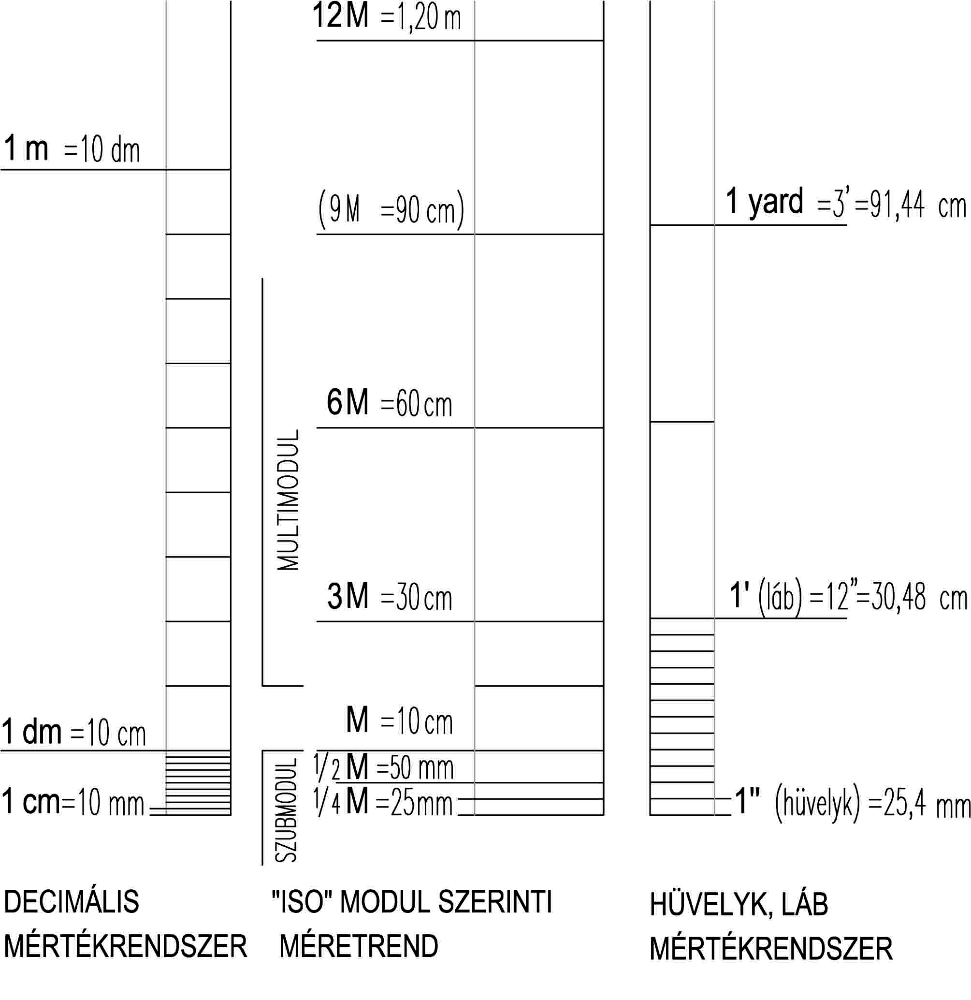

*1.3. ábra – A méretrendszerek és az ISO szerinti méretrend összehasonlítása*

A metrikus rendszer bevezetése előtt a nálunk használt mértékrendszer egyes elemei máig élnek. Területegységre még használjuk a „négyszögöl” mértéket. 1 bécsi öl (Klafter) 189,65 cm, tehát 1 négyszögöl 3,597 m2. A faipari termékek méreteiben is megmaradt a „Zoll” (hüvelyk) mértékegység, amikor „egy colos” deszkáról vagy „két colos” pallóról beszélünk.

Az emberi testrészek méretein alapuló mértékrendszerek azért voltak igen jól használhatók az építészetben, mert a használati terek alkalmas méretei az emberi test méreteivel függnek össze. A szép alkatúnak mondott ember testméreteinek arányai a szépnek érzett építészeti arányokra is kivetülnek.

> **Megjegyzés**
>
> Vitruvius (Augustus császár építésze) „Tíz könyv az építészetről” c. munkájában azt írja: „... Az arányosság minden műben a tagok mértékegységének és az egésznek egymáshoz való mérése, amelyből a szimmetriák rendje jön létre. Mert hiszen szimmetria és arányosság híján egyetlen templomot sem lehet ésszerűen tervezni, csak ha pontosan oly arányos, akár a jó testalkatú ember tagjainak szabatos rendje.” A jó testalkatú ember arányainak elemzése után Vitruvius így folytatja: „Továbbá a testnek természetes középpontja a köldök. Mert ha az embert kitárt karokkal és lábakkal hanyatt fektetjük, s a körző középpontját a köldökébe helyezzük, köré kört húzva, a vonalat mind a kéz mind a láb ujjai érinteni fogják. Ugyanúgy, ahogy a testen kör alakzat jön létre, négyzet idom is található benne. Mert ha a talpaktól a koponya tetejéig terjedő távolságot lemérjük, s ezt a mértéket átvisszük a kitárt karokra, úgy találjuk, hogy szélessége ugyanakkora, mint magassága, mint az olyan négyzeté, amelyeket zsinórmértékkel szerkesztettek.” (Gulyás Dénes fordítása)

Az egység arányos részekre osztásának antik módszere az *aranymetszés,* amely szerint „a kisebb rész úgy aránylik a nagyobbhoz, mint a nagyobb az egészhez”. Leonardo da Vinci közismert arányfigurája Vitruvius leírásának illusztrációja ([1.1. ábra](#abra_1_01)). A négyzet középpontja a figura szeméremcsontja, a kör középpontja a köldök, amelynek helyét a testmagasság aranymetszése jelöli ki.

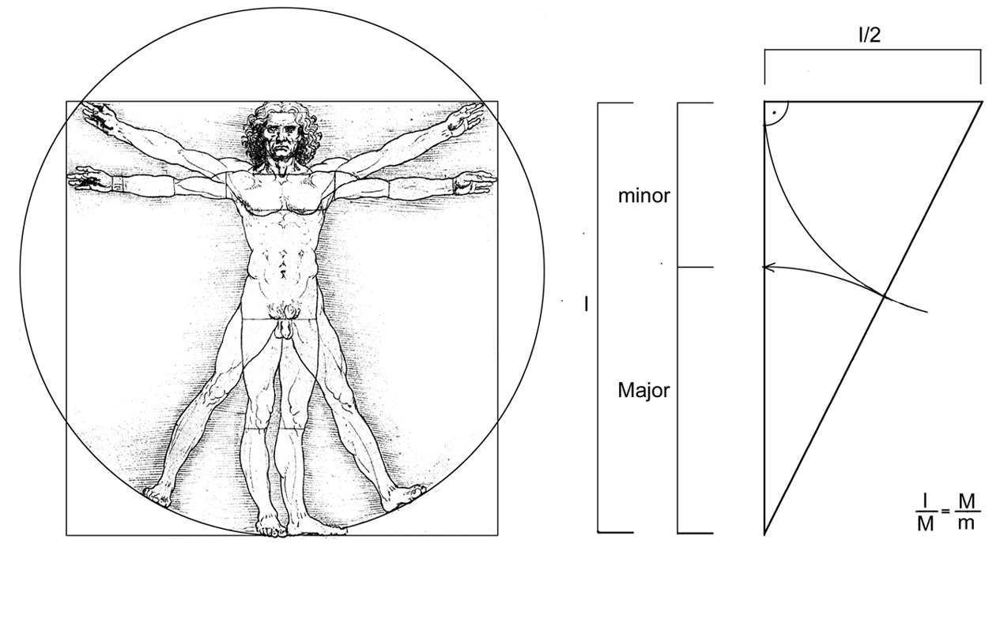

*1.1. ábra – Leonardo arányfigurája (Vitruvius illusztráció) és az aranymetszés szerkesztése*

A XVIII. század végén a Francia Nemzetgyűlés a Tudományos Akadémia javaslata alapján bevezeti a decimális mértékrendszert és alapegységként a Föld Párizson áthaladó délkörének negyvenmilliomod részét, a *métert* jelöli meg. A metrikus rendszert az iparilag fejlett államok 1889-ben általánosan elfogadták (Nagy Britannia és az Egyesült Államok kivételével). Ez a technikában sokkal egyszerűbben használható, mint a bonyolult átszámításokat igénylő hüvelyk- és lábrendszer, de bevezetésével megszűnt a mértékegységek és az emberi testméretek közvetlen összefüggése (az 1 centiméter, 1 deciméter és 1 méter egyetlen testmérettel sem egyezik).

A múlt század közepén a zseniális francia építész, Le Corbusier olyan mértékrendszert dolgozott ki – és alkalmazott saját terveinél – amelyben az emberi test méret- és arányrendszerét a metrikus rendszerrel és a hüvelyk-láb rendszerrel egyesíti. Ez a MODULOR ([1.2. ábra](#abra_1_02)).

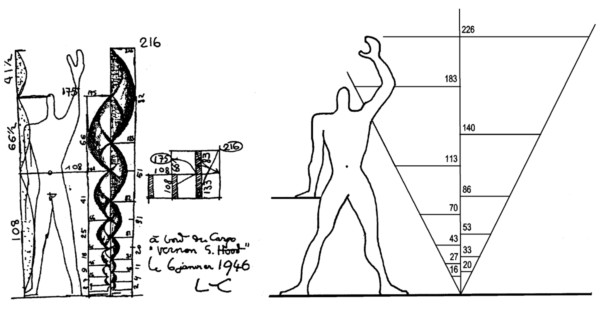

*1.2. ábra – Le Corbusier: MODULOR. Az első változat arányfigurája és a végleges változat*

> **Megjegyzés**
>
> A MODULOR geometriai rendszerének lényege – röviden – a következő: Egy hat láb (183 cm) magas emberi figurát vesz alapul. Aranymetszéssel meghatározza ennek köldökmagasságát (113 cm). E méret kétszeresét tekinti a felemelt kéz magasságának (226 cm). E méretek különbségei olyan számsort adnak (226, 183, 113, 70, 43 cm) amelyek aranymetszés-viszonyban állnak egymással, és Fibonacci-sort képeznek (a nagyobb méret az előtte lévő kettőnek az összege). Két oszlopot rajzol egymás mellé: a 183 cm magas piros oszlopot, és a 226 cm magas kék oszlopot. Mindkettőt aranymetszések sorozatával osztja kisebb egységekre. Azt találja, hogy a kék oszlopon a piros oszlop értékeinek kétszerese jelenik meg. A gyakorlati használhatóság érdekében bizonyos mértékű kerekítéseket alkalmaz, de a méretek mind centiméterben, mind hüvelykben igen jó megközelítéssel kifejezhetők. A mértékrendszer tartalmazza az egységet, annak megkettőzését, aranymetszés szerint csökkentett értékét és aranymetszés szerinti kiterjesztését, ezzel igen gazdag variációs lehetőséget nyújt.
>
> Tanulságos, hogy a Modulor arányfigurájának magasságát először 175 cm-ben, az európai ember átlagmagassága szerint adja meg Corbusier, de rájön, hogy az *átlagos* testméret nem ad jó mértéket az *általánosan használható* terek méretezéséhez. Ezért az emberi figura magasságát később 183 cm-re módosítja, a „hat láb magas”, a hüvelyk, láb méretrendszer rögzítésének idején igencsak termetesnek számító ember méretére.

Corbusier a Modulort általános felhasználásra szánta, de ma már az inkább briliáns szellemi teljesítménynek tekinthető, a gyakorlatban nem terjedt el.

Az építőelemekből történő építkezés megkívánja bizonyos, kötött méretsorok alkalmazását és a méretek közös osztójának, *moduljának* rögzítését. (Az ókortól napjainkig használt tégla kezdettől fogva méretegységesített, méretkoordinált termék.)

A Nemzetközi Szabványügyi Szervezet (ISO) előírása szerint ma az építészetben használandó modul a deciméter, M=10 cm. Ennek többszöröséből képzett, nagyobb méretegység a multimodul, osztásával a szubmodul állítható elő.

Az emberi testméretekkel összefüggő angolszász hüvelyk-láb méretrendszerhez közeli a 3M multimodul (a „láb” hosszmértéktől csak kismértékben tér el), a 9M multimodul a „yard”-hoz áll közel, az ¼ M szubmodul a „hüvelyk” megfelelője. Az emberi test méreteivel, az emberi tevékenységek helyigényével való összefüggés miatt a 3M (30 cm) multimodul többszöröséből képzett méreteket sokszor használjuk lakóépületek tervezésénél. A lakóépületekhez használt, előgyártott szerkezetek (gerendák) méretei gyakran a 6M (60 cm) többszörösei. Nálunk bizonyos asztalosipari gyártmányoknál az egyes termékcsaládok (belső ajtók, beépített bútorok, konyhabútorok) mérete a 15 cm (1½ M) többszöröse ([1.3. ábra](#abra_1_03)).

A lakásterek méretezéséről szóló későbbi fejtegetések során a méreteket többnyire a ½M (5 cm) szubmodul értékeire kerekítve adjuk meg. Ez a pontosság elegendő az egyes lakástevékenységek helyigényének meghatározásához.

### 1.2.2 Az emberi testméretekkel, testhelyzetekkel és mozgásokkal összefüggő térigények

A használati terekben folyó tevékenységekhez szükséges terek, tér-részek méretei a használó személy testméreteivel függenek össze, de nyilván lehetetlen minden lakás tereit és egyes elemeit a használó háztartás tagjainak konkrét testméreteihez igazítani. Valamilyen, általánosnak tekinthető emberi figurát kell mérvadónak tekinteni a tervezés során. Ennek méretei nem lehetnek egy populációra jellemző *átlagos* méretek, mert az ezekhez igazított lakáselemeket csak a népesség *fele* tudná kényelmesen használni. Az sem lenne helyes, ha egy átlagosnál jóval magasabb embert vennénk *mindig* alapul, hiszen egy konyhapult vagy egy mosdókagyló magasságát ahhoz igazítani ugyanilyen hiba lenne. Egyes lakáselemek méretezésénél az átlagosnál nagyobb, másoknál az átlagosnál kisebb ember testméreteit kell mérvadónak tekinteni.

> **Megjegyzés**
>
> Egyes speciális lakófunkciójú épületek esetében, mint például az idősek otthonánál vagy mozgásukban korlátozottak számára készült lakásoknál, az adott célcsoport jellemző használati igényeihez célszerű igazítani bizonyos lakáselemek és szerkezetek méreteit (lásd 1.7. fejezet).
>
> A lakásokat, otthonokat a jelenlegi vagy a jövőbeli lakók változatos és időben folyamatosan változó szükségleteinek, igényeinek figyelembevételével célszerű megtervezni és megépíteni. Változhat a háztartás létszáma pl. gyermek születésével, a gyermek felnőtté válásával, önállósodásával, vagy idős, esetleg ápolásra is szoruló családtag odaköltözésével. Megváltozott szükségletet jelenthet egy ideiglenes vagy egy tartós sérülés, betegség, illetve ezek eredményeképpen fellépő fogyatékosság is. A lakások és az egyes lakáselemek tervezésénél tehát sok esetben célszerű figyelembe venni, hogy azok egyéni használati igényekhez igazodó esetleges megváltoztatása, átalakítása nagyobb átépítés, az épület primer szerkezeteinek érintése nélkül történhessen, a lakás az új igényekhez „adaptálható” legyen. (P.A.)

Az építészeti tervezés során nem kell az emberi testméretekhez illő téregységek dimenzióit alkalmanként mérlegelni: azok szabványokban és tervezési előírásokban, ajánlásokban megtalálhatók. Lehet, hogy különféle eredetű és korú kézikönyvekben más-más méreteket talál az olvasó: ennek oka az, hogy a méretek megállapítása segédtudományok eredményire alapozott szakértői megegyezés kérdése.

Az emberi testméretek vizsgálata különálló tudományág, az *antropometria* tárgya (ennek sok más iparágnál is jelentősége van: pl. a konfekcióiparban, a bútorgyártásban, járműgyártásban stb.). A folyamatos mérések azért is szükségesek, mert az emberi test átlagos méretei generációról generációra változnak.

> **Megjegyzés**
>
> Hollandiában a 18 évesek átlag testmagassága 181 cm, ami azt jelenti, hogy a fiúk átlaga 190 cm körül van – kissé felette –, a lányoké 170 cm feletti. A XX. század második felében a testmagasság 10 évente 1,3 cm-t növekedett, vagyis az átlagérték 6 cm-el nőtt, amelynek oka a jobb táplálkozás és az egészségügyi ellátás színvonalának emelkedése. A növekedés Hollandiában nyilván nem fog ebben az ütemben folytatódni, de azt mondhatjuk, hogy a következő generációk átlagméretei itthon is növekedni fognak.
>
> Az újonnan tervezett épületeknél az EU már 1996 óta javasolt értéknek adja meg ajtónyílások esetében a minimum 210 cm tiszta magassági belméretet. (N.Á.)

Az egyes tevékenységek eszközeinek, a tevékenység környezetének célszerű kialakításával az *ergonómia,* az ésszerű erőkifejtés tudománya foglalkozik, amelynek tárgya eredetileg a munkahelyek legnagyobb teljesítményt eredményező kialakítása volt.

Ebben a kötetben közölt méreteket különböző európai szabványok és korábbi hazai szakkönyvek és kutatások alapján rögzítettük. A számszerű értékek kerekítettek, általában 5 cm többszörösei. (Ez a pontosság elegendő, ha lakóházak helyiségeit, tereit méretezzük.) Az így rendezett méretek könnyebben kezelhetők, megtanulhatók és észben tarthatók, hogy a tervezés során ne kelljen állandóan kézikönyveket lapozgatni. Speciális, nagy részletességű belsőépítészeti feladatokhoz, bútorok tervezéséhez ez a méretsor természetesen túl durva, ilyenkor ajánlatos más kézikönyvekben és szabványokban fellelhető, pontosabb méreteket alkalmazni.

A különféle lakástevékenységek bizonyos testhelyzetekben végezhetők. Ezek 1M illetve ½M szerint kerekített térméret-igényeit az [1.4. sz. ábra](#abra_1_04)> mutatja.

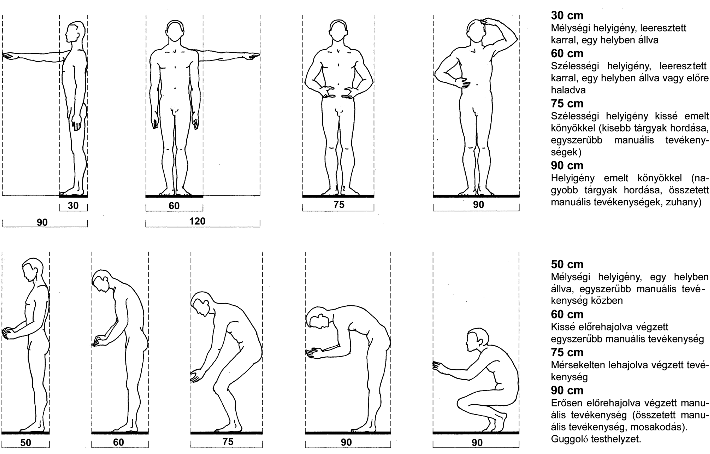

*1.4. ábra – Különféle testhelyzetek helyigénye*

A lakások használata közbeni mozgásokhoz bizonyos közlekedő sávok (bútorozatlan felületek) és közlekedő helyiségek szükségesek. Ezek minimális méreteit az [1.5. sz. ábra](#abra_1_05) mutatja.

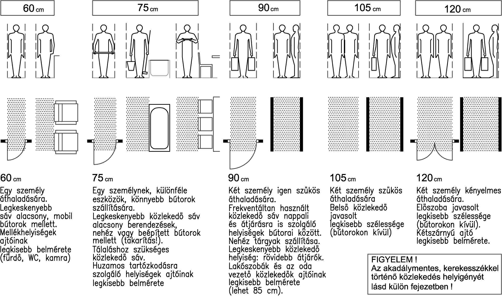

*1.5. ábra – Közlekedés a lakásban. Közlekedő sávok*

> **Megjegyzés**
>
> Tekintetbe kell venni, hogy a bemutatott értékek a javasolt méretek alsó értékei, amelyek biztosítják a még megfelelő használatot. A fenntartható lakásállomány kialakítása és megőrzése érdekében törekedni kell arra, hogy az új lakások hosszú távú használhatósága is biztosítva legyen, ezért a pillanatnyi előírásoknál távolabb kell tekinteni. Ha az új lakás a minőségi váltást szolgálja és nem a lakáshiány enyhítését, akkor az alsó határértéknél kedvezőbb – többnyire 5-10%-kal tágasabb – méreteket célszerű tervezni. A tágasság és a kedvezőbb méretek a lakás többféle használhatóságát és hosszabb élettartamát alapozhatják meg. Ez a magasabb színvonalú, kényelmesebb lakások felé orientálja el a fizetőképes keresletet. A magasabb komfortérzetnek megfelelő lakások építése tehát hosszabb távon is megfelel a keresletnek. (N.Á.)

### 1.2.3. A lakás fontosabb bútorainak, berendezéseinek és azok használatának helyszükséglete

A lakástevékenységek legtöbbje bizonyos bútorok, bútorcsoportok és berendezési tárgyak használatával párosul. *A beépített* bútorokat és berendezéseket mindig jelölni kell a terveken, mert azok a lakás tartozékai, a kivitelezés során elhelyezik azokat. A lakáshasználathoz szükséges *mobil bútorok* elrendezését un. „bútorozási terveken” jelöljük. Ez ellenőrző vagy tájékoztató tervfázis, az engedélyezési és kiviteli tervekhez ennek elkészítése nálunk nem kötelező (vannak országok, ahol a bútorozási terv az engedélyezési eljárás kötelező része). Nyomatékkal javasolható, hogy a lakások bútorozási sémáit már a tervezés kezdő stádiumában is jelöljük vázlatainkon.

Előfordul, hogy valamelyik építtető nemcsak a lakás, hanem a teljes belsőépítészeti kialakítás tervezését is megrendeli, és a tervezőre bízza a bútorok kiválasztását és a lakásban történő elrendezését, de az ilyen megbízás rendkívül ritka. Amennyiben egy konkrét család lakását kell megtervezni, akkor a megrendelővel a bútorok elrendezéséről is konzultálni kívánatos. Az eléggé bölcs építtető azonban tudja, hogy lakása tartós és nagy értékű vagyontárgy is lesz: ha egy család eladja lakását, annak lakáspiaci esélyeit nagyon rontja, ha kizárólag az eladó különleges igénye szerint berendezve használható megfelelően. Magának az építtetőnek is megváltozhatnak lakáshasználati igényei az idők folyamán. Általános esetben, de főképp többlakásos házak ismétlődő lakástípusainak tervezésekor, még nincs tudomásunk arról, hogy a használók milyen bútorokat helyeznek majd el azokban.

*A „bútorozási terv” nem arra szolgál, hogy a lakás bútorainak elhelyezésére egyfajta utasítást adjon, hanem annak ellenőrzésére és bizonyítására, hogy a lakásokban az alapvető lakástevékenységek elvégezhetők.* Ezért itt helytelen valamely speciális, esetleg csak egyedileg legyártható bútorformákat alkalmazni: olyanokat kell figyelembe venni, amelyek a kereskedelemben kaphatók, és használatuk egy általánosan elfogadott lakáskultúra alapján széles körben valószínűsíthető.

A kereskedelemben kapható bútorok méretei is sokfélék, ezért a mértékadó bútorméret megválasztása ugyanazt a problémát veti fel, mint az előző fejezetben taglalt mértékadó testméret. Nyilván, nem lenne helyes a kapható legnagyobb bútorokat tekintetbe venni olyankor, ha egy átlagos igényű lakást tervezünk, de a kapható legkisebbeket még akkor sem, ha a lakást nagyon takarékosan kell méretezni.

A bútor használatához szükséges térméret nagyobb, mint magának a bútornak a dimenziói. Alaprajzi értelemben a bútor használatához szükséges terület az un*. használati zóna.* Egy mértékadó méretű bútor, és annak használatához szükséges használati zóna együttese a *bútorzóna* ([1.6. ábra](#abra_1_06)). Ha a használó által megvásárolt bútor a mértékadó méretnél nagyobb is lesz (ésszerű határok között), akkor a bútorzónában elfér ([1.7. ábra](#abra_1_07)). Ha a konkrét építtetői igény szerint a mértékadónál kisebb bútor is elegendőnek látszik, akkor is a megadott értékek szerint méretezzünk, mert a bútorokat többször lecserélik a lakás élettartama alatt.

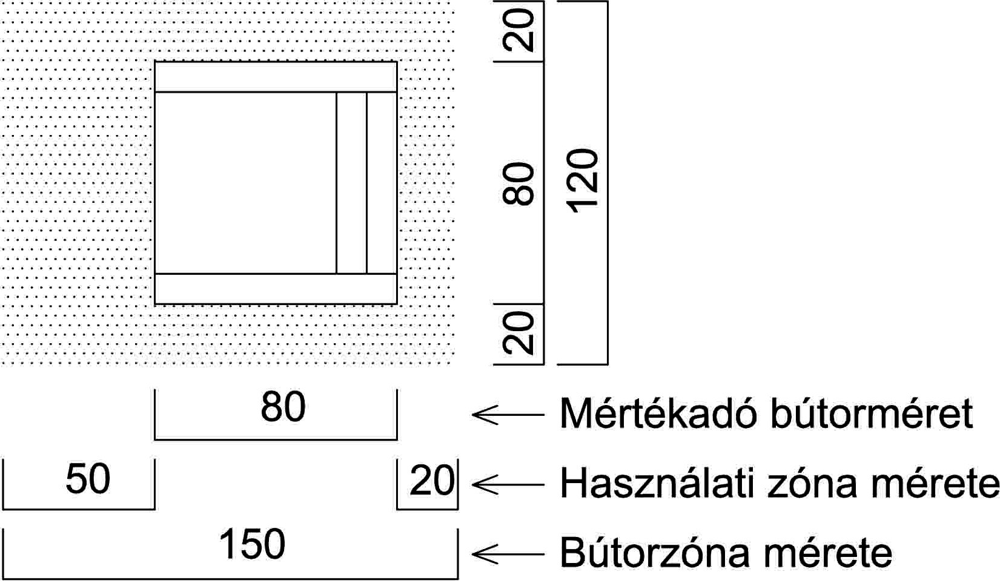

*1.6. ábra – Bútorhasználat helyigénye (példa: fotel)*

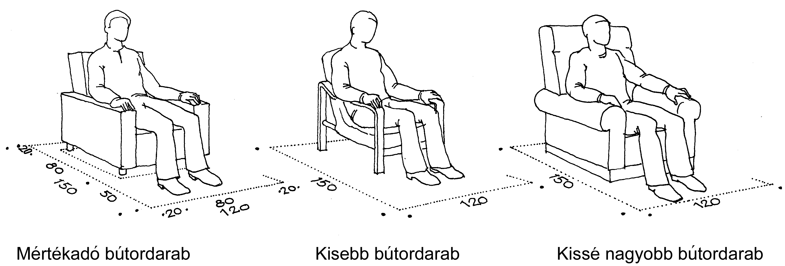

*1.7. ábra – Különböző méretű bútordarabok azonos bútorzónában*

Az egyes, alapvető lakástevékenységekhez használatos bútorok mértékadó méreteit és bútorzónáit az [1.8. sz. ábrasor](#abra_1_08) mutatja be.

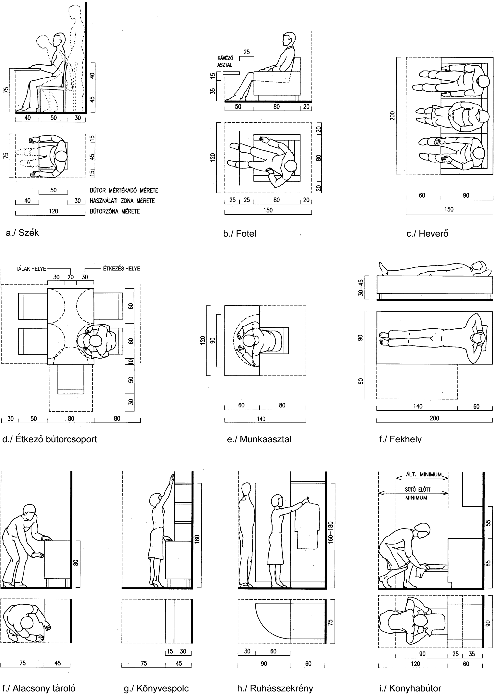

*1.8. ábra – Fontosabb bútorok helyigénye*

Az egészségügyi berendezések mértékadó méretei és használati zónái az [1.9. sz. ábrasoron](#abra_1_09) láthatók.

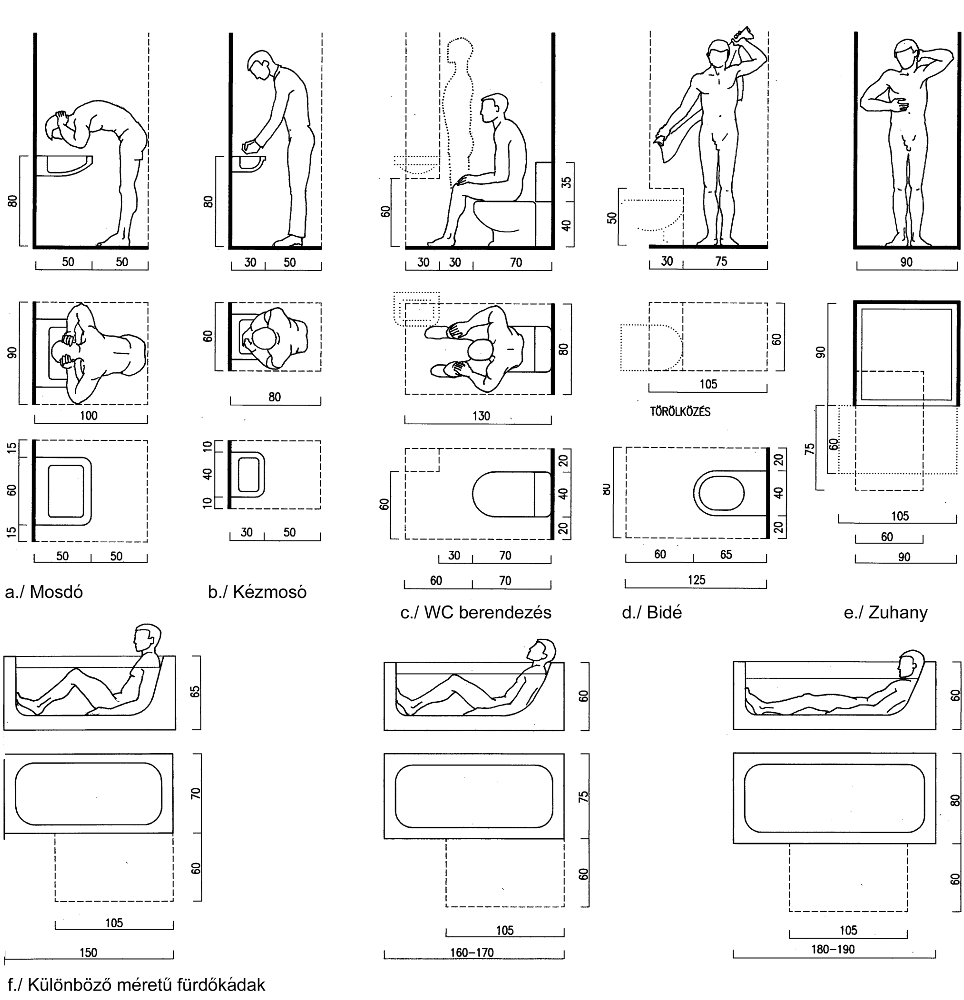

*1.9. ábra – Egészségügyi berendezések használatának helyigénye*

> **Megjegyzés**
>
> A bútor használatához szükséges terület nagysága bizonyos esetekben a mértékadó értékektől jelentősen eltérhet. Ilyen a bútorok, berendezési tárgyak segédeszközzel (pl. kerekesszékkel), segítővel történő használata, vagy egyes berendezések gyermekkel történő használata (pl. kisgyermek fürdetése, WC-re szoktatása, stb.). Természetesen, e szélső értékek kielégítése nem lehet kötelező érvényű lakóépület-tervezési szabály, azonban a lehető legtöbb átlagostól eltérő eset figyelembe vétele növeli a lakás használati értékét. Családi házak esetében megfontolandó nagyobb bútorzóna-méreteket biztosítani az adaptálhatóság (a megváltozott igényhez való átalakítás) érdekében. Többlakásos lakóépületek ismétlődő lakástípusainál a lakástípusok változatosságával, és a nagyobb lakások egy részénél, (a lakások 5-10%-ánál) e szélsőséges bútorzóna méretet javasolt kiindulásként teljesíteni. (P.A.)

### 1.2.4 A lakásterek belmagassága

Legtöbb esetben a lakások tereit azonos magasságú vízszintes padlósík és a vízszintes mennyezetsík zárja le: ilyenkor valamennyi lakástér belmagassága azonos. Amennyiben a lakás több szintes, akkor az azonos belmagasság szintenként adott. Abban az esetben, ha egy szinten alárendelt jellegű lakásterek (tárolók) vannak, ott alacsonyabb belmagasság is elegendő (pl. pincében). Lehetséges azonban, hogy a lakás elrendezése térben differenciált: egyes helyiségeknek vagy helyiségcsoportoknak mind a padlószintje, mind a mennyezetsíkja különbözik, vagy a mennyezetsíkja nem vízszintes. Utóbbi eset olyankor fordul elő, amikor a legfelső szinten a tetőszerkezetet a zárófödémmel egyesítik (általános a tetőterek beépítésénél).

Az egyenes tartásban végzett mozgáshoz vagy más, álló helyzetben végzett tevékenységhez legalább a mértékadó emberi figura nagyságához illő, 1,90 m belmagasság szükséges. Ha a szabályzatok valamilyen helyiség minimális alapterületét előírják, akkor abba csak az 1,90 m-nél magasabb terek számíthatók be. Ezeket nevezzük *használati tereknek*.

Az 1,90 m-nél alacsonyabb terek is alkalmasak beépített vagy mobil tárolók, berendezések, bútorok elhelyezésére, ha azok megközelíthetők és használhatók legalább 1,90 m magas térben, vagy ha használatukra jellemző testhelyzet alacsonyabb belmagasság esetén is kényelmes (pl. ágy, WC berendezés stb.). Ezeket a tér-részeket nevezzük *kiegészítő térnek*.

Bizonyos, huzamos tartózkodásra nem szolgáló terek (közlekedő helyiségek, tároló helyiségek) belmagassága is legyen valamivel nagyobb, mint a mértékadó testmagasság. Ennek mértéke 2,20 m, ezt *csökkent értékű használati tér*-nek nevezzük.

A felemelt karral végzett tevékenységekhez szükséges tér, és azt kiegészítő felső sáv (pl. világítótestek elhelyezésére) együttesen határozzák meg azt a belmagasságot, aminek alapján lakóépületek esetében *teljes értékű használati tér* alakítható ki. A jelenlegi szabályzat nálunk ezt az értéket 2,50 m-ben határozza meg ([1.10. ábra](#abra_1_10)). Ez az *alsó* határérték, ennél nagyobb mindenkor lehet. Közepes igényszintű lakásoknál nálunk általános a 2,70 m körüli belmagasság alkalmazása. A belmagasság a kellemesnek érzett térarányokkal is összefügg: nagyméretű szobák mennyezete magasabban is lehet, de kisebb helyiségekben az aránytalanul nagy belmagasság esetleg zavaró.

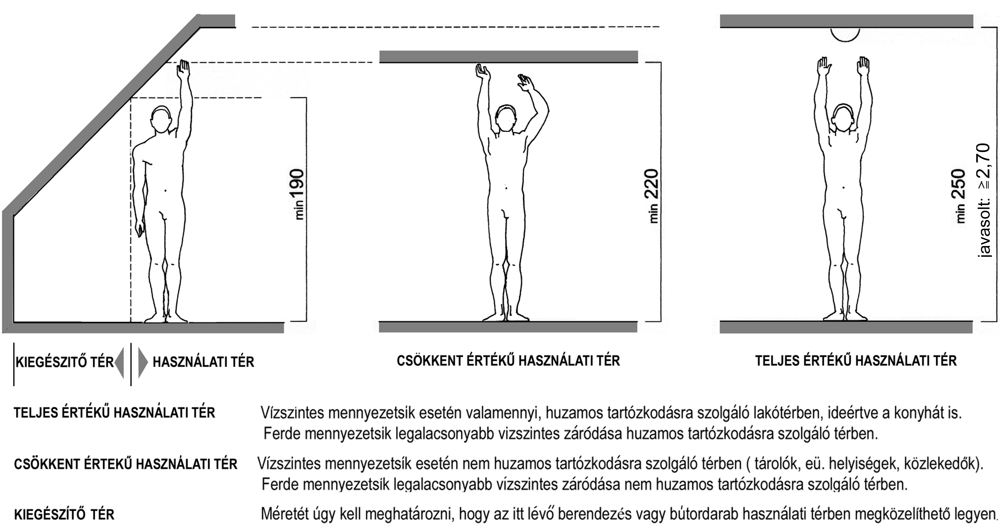

*1.10. ábra – Lakásterek belmagassága*

> **Megjegyzés**
>
> Az előírt minimumnál (2,50, ill. 2,20 m) nagyobb belmagasság biztosítása a költségek ellenére előnyökkel is jár. A nagyobb belmagasság a tágasabb alapterületek esetében arányosabb belső teret ad, egyenletesebb megvilágítású és világosabb belsőt jelent az ablakok nagyobb szemöldökmagassága következtében. A nyári melegben hűvösebbek maradnak és jobban szellőztethetőek a nagyobb belmagasságú terek, mivel kedvezőbbek a belső légáramlási viszonyok. A fűtési hőveszteség (költség) nem a légköbméterrel arányos, hanem leginkább a felület/térfogat aránnyal. A kompakt épületforma esetében a nagyobb belmagasság nem jelent üzemeltetési többletet, viszont jelentős komfortérzet javulást eredményezhet. Ilyen módon közvetetten üzemeltetési előnyt is jelent, hiszen a megfelelő nyári komforthoz nem szükséges gépészeti rásegítés (hűtés, gépi szellőztetés stb.). Ezáltal az épület a növekvő komfortigény ellenére is hosszabb ideig biztosítja a megfelelő lakhatást, és a hosszútávú használatot. (Egyes országokban családi házak esetében az előírás min. 3,0 m belmagasság.) (N.Á.)

<!-- 
Az OTÉK már nem érvényes, ezt javítani kell a TÉKA-ra vagy úgy megfogalmazni, hogy NE legyen jogszabályi hivatkozás.
-->
A most érvényes Országos Településrendezési és Építési Követelmények (OTÉK) az *átlagos belmagasságok* határértékeit rögzítik. Ezek a következők: huzamos tartózkodásra szolgáló helyiségekben min. 2,50 m (a lakás második és azt követő szobáinak kivételével); nem huzamos tartózkodást szolgáló terekben és a második (nem nappali tartózkodásra szolgáló) szobákban 2,20 m. Az előírt átlagos érték betartása azonban önmagában nem garantálja a használhatóságot, ezért azt esetenként kell ellenőrizni és meghatározni úgy, hogy a lakótér a rendeltetési követelmények teljesítési kritériumait kielégítse minden tekintetben. A *hálószobák* esetében a 2,20 m-es *átlagos* belmagasság ferde mennyezetsík esetén megfelelő lehet, de vízszintes mennyezetsík esetén az átlagot ne tekintsük mérvadónak: legyen az is teljes értékű lakótér. Másfelől, pl. egy ferde mennyezetsíkkal kialakított WC akkor is jól használható lehet, ha *átlagos* belmagassága nem éri el a 2,20 m-t.

*A kiegészítő terek* alkalmasak szinte valamennyi lakástevékenységhez szükséges bútor, berendezés elhelyezésére, de szélességük esetenként különböző. Ezért a ferde mennyezetsíkkal kialakított tereknél (tetőtéri helyiségeknél) gondosan kell mérlegelni az egyes kiegészítő tér-részek rendeltetését, és szélességüket pedig az ott *valószínűsíthető* bútorozás használati igénye szerint szabjuk meg. A beépített bútorok és berendezések esetén (higiéniai berendezések, konyhabútor, beépített szekrény stb.) a kiegészítő használati tér funkciója egyértelmű és tervezhető ([1.11. ábra](#abra_1_11)). Amennyiben az 1,90 m-nél alacsonyabb kiegészítő térbe nem kerül bútor (pl. tágasabb lakóhelyiségek esetén), akkor se legyen az túl mély (legfeljebb kb. 1 méter) mert *takarítása* csak kényelmetlen, görnyedt testtartásban végezhető.

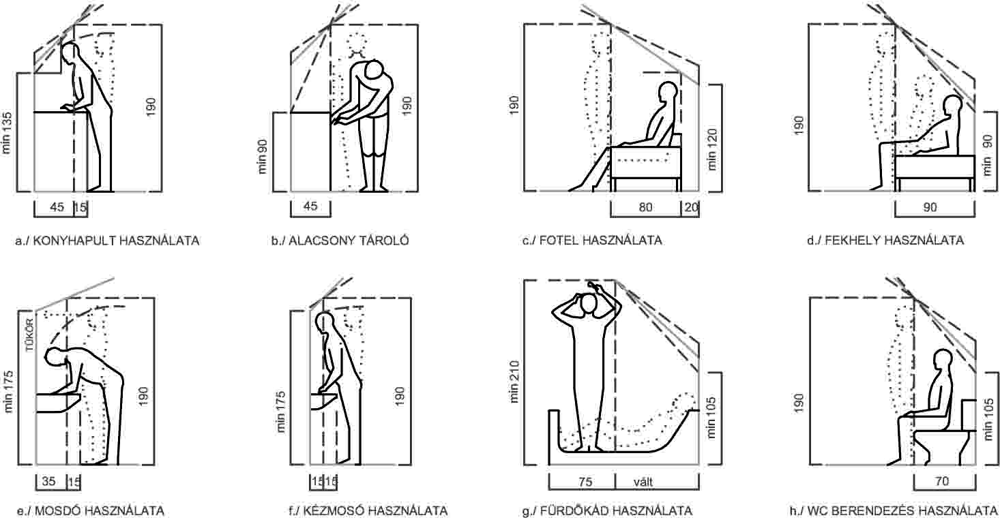

*1.11. ábra – Bútorok és berendezések használata ferde mennyezetsíknál*

### 1.2.5 Az ajtók méretei

A lakásokban alkalmazott ajtók általában felnyíló ajtók, ritkábban tolóajtók. (Az ajtónyílások takarhatók függönnyel, vagy azzal nagyjából egyenértékű műanyag harmonika-ajtókkal is. Ezek azonban nem nyújtanak hangszigetelést és nem légtömörek, ezért nem alkalmazhatók olyan esetekben, amikor az egyes helyiségek ajtóval történő elválasztása követelmény.) A felnyíló ajtók egyszárnyúak vagy kétszárnyúak. A kétszárnyú ajtók általában középen felnyílóak, néha előfordul (pl. lakásbejáratoknál) az aszimmetrikus szárny-elrendezés, amikor a nagyobb szárnyat használják általában, és a rögzített keskenyebb szárnyat csak alkalmanként – pl. bútorszállításkor – nyitják ki. Az egyszárnyú ajtók nyitási iránya kétféle: ha az ajtónak a pántozás felöli oldalán állva a pántot a bal oldalon látjuk, akkor az ajtó „balos”, ellenkező esetben „jobbos” ajtóról beszélünk ([1.13. ábra](#abra_1_13)). Az ajtók lehetnek küszöb nélküliek, vagy küszöbbel ellátottak. Utóbbiak általában a felmosást igénylő vizes helyiségek ajtói. (Az ajtóküszöb ezeknél a helyiségeknél is elhagyható, ha a padlóburkolatuk szintje egy fémperemmel elválasztva kb. 1 cm-rel mélyebbre kerül, mint a csatlakozó helyiségé.) A küszöb nélküli ajtók hangszigetelése kedvezőtlenebb, mint a küszöbbel ellátottaké, de a küszöb a mozgásukban korlátozottak részére akadályt is jelenthet.

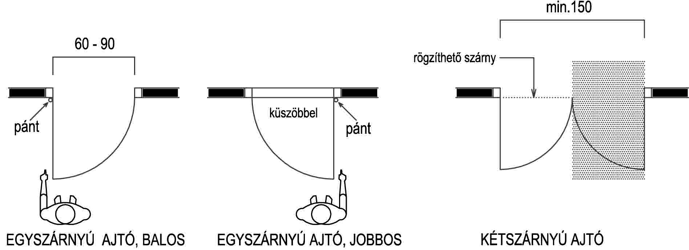

*1.13. ábra – Felnyíló ajtók alaptípusai*

> **Megjegyzés**
>
> A küszöb nélküli kialakítás a lakás legtöbb helyiségkapcsolata esetben előnyösebb, a használati kényelmet fokozza és csökkenti a még járni tanuló vagy éppen futkározó gyermekek, nehezebben mozgó, lábukat kevésbé emelő, csoszogó idősebbek megbotlását, elesését. E szempontot különösen fontos figyelembe venni gyermekek vagy idősek bentlakásos intézményének tervezésekor.
>
> Olyan helyiségeknél, amelyeknél az ajtónak légtömörségi és hangszigetelési követelményeket is teljesítenie kell, automata küszöb alkalmazható. Automata küszöb kialakítására számos technikai megoldás áll rendelkezésre, mint pl. az ajtólap zárásakor a padlósíkból felemelkedő küszöb, az ajtólap aljából kitolódó küszöb vagy egyszerű gumiküszöb, amely terhelés esetén benyomódik. Ez utóbbi, mivel vízküszöböt is jelent, felmosást igénylő vizes helyiségek ajtóinál is megfelelően alkalmazható. (P.A.)

A rajzokon az ajtótengely fölé írt méret a szélességet, a tengely alá írt méret a magasságot jelöli. Az ajtóknak két jellemző alapméretük van: a szabad nyílásméret (a *tokbelméret*), és a *névleges méret*. A névleges méret mindig nagyobb a tokbelméretnél a különféle gyártmányokra jellemző mértékben (általában a tok külméretének és a szükséges elhelyezési közöknek az összege). A kiviteli terveken a névleges méretet kell jelölni ([1.12. ábra](#abra_1_12)).

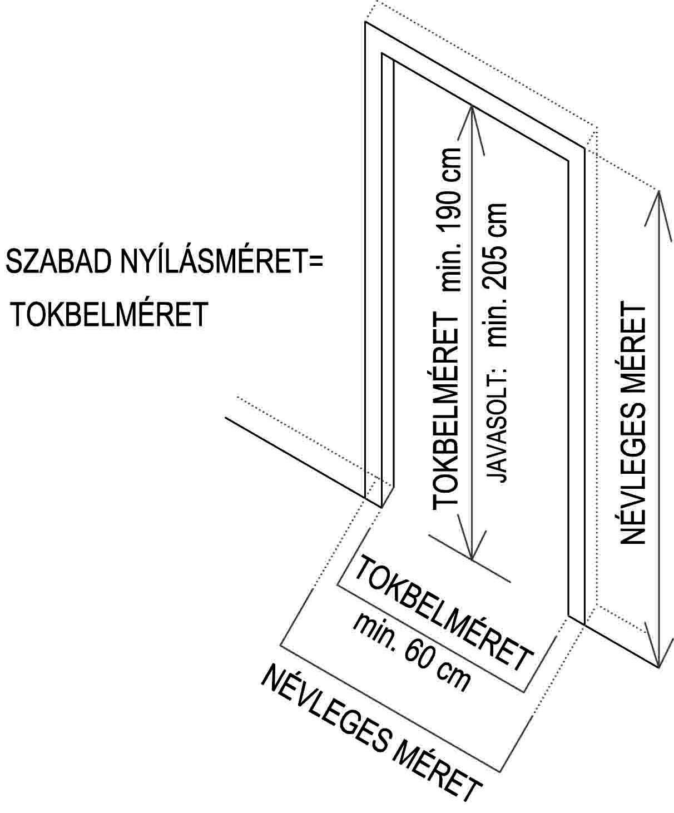

*1.12. ábra – Ajtók alapméretei*

Az ajtók tiszta magassági belméretének javasolt értéke: minimum 205 cm, amit már sok gyártó a 210 cm névleges méret esetében is biztosít.

A lakások méretezésénél az ajtók „használati méretét” vegyük figyelembe, amely a funkció kívánta tokbelméretnél szélességi irányban 10-10 cm-rel, mélységi irányban pedig 10 cm-rel nagyobb. (A nyitott ajtószárny a tokbelméretet meghaladó mértékben áll be a helyiségbe.)

> **Megjegyzés**
>
> Falsarokba helyezett nyílászáró esetében a pánt felőli oldalán biztosított 10 cm-es „falfül” a szerkezet megfelelő elhelyezhetősége (tok rögzítése és takaróprofilok elhelyezése) mellett biztosítja azt is, hogy az ajtólap 90°-ban kitárható legyen, azaz az ajtólap fal felőli oldalán található kilincs a nyitást ne akadályozza, és így a nyílás teljes tokbelmérete közlekedésre alkalmas hasznos keresztmetszetként működjön. (P.A.)

A két használati méret az ajtó használati zónáját jelöli ki. Ebbe maga az ajtót nyitó személy nem fér el, ezért a benyíló szárny felöli oldalon egy 20 cm-es „kiegészítő használati zónát” kell szabadon hagyni. Ez az ajtótok mellett, a kilincsnél legyen, amely egyébként a villanykapcsolónak és a porszívó elektromos csatlakozásának a szokásos helye. Keskenyebb helyiségnél megengedhető, hogy a kiegészítő használati zóna az ajtónyílással szemben alakuljon ki ([1.14. ábra](#abra_1_14)).

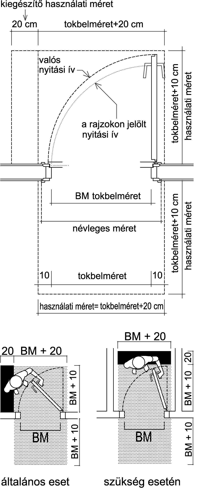

*1.14. ábra – Ajtók használati zónájának méretei*

> **Megjegyzés**
>
> A bejárati ajtók esetében ügyelni kell arra, hogy az ajtó előtti használati zóna az ajtó beépítésével azonos szinten és teljes területén vízszintes legyen annak érdekében, hogy a kulcsok keresése, a zár nyitása vagy az ajtó kitárása alatt az ajtót nyitó személynek ne kelljen lejtős részre vagy lépcsőfokra állnia.
>
> A lakások bejárati ajtóinál, és a lakások frekventáltabb helyiségeinél, illetve az olyan helyiségek ajtóinál, amelyeknél jellemző a csomagok, eszközök cipelése (p. kamra, raktár, háztartási helyiség vagy mosókonyha) célszerű az akadálymentes használat szempontjából is szükséges nagyobb, 50 cm szélességű „kiegészítő használati zóna" biztosítása, amely mindenki számára kényelmesebb ajtóhasználatot tesz lehetővé. A megnövelt „kiegészítő használati zóna" lehetővé teszi, hogy az ajtólap karon ülő gyermekkel, kézben tartott csomaggal, eszközzel (pl. bőrönd, ruháskosár, bevásárló szatyor, porszívó, stb.), valamint segédeszközzel (kerekesszék, kerekes járókeret) is akadálytalanul, kényelmesen felnyitható legyen. (P.A.)

A *tolóajtók* igen nagy előnye, hogy a lakástérből nem foglalnak el helyet. Hátrányuk, hogy általában nem kellően légtömörek és hangszigetelő képességük is jóval elmarad a hagyományos ajtókétól. Tolóajtó akár ajtótok nélkül is szerelhető a falnyílás elé, de a falnyílás tokszerkezettel is keretezhető. A fal előtt futó tolóajtó a falfelületek jelentős részét nyitott állapotban takarja ([1.15 ábra](#abra_1_15)). Ez a felület is bútorozható akkor, ha a tolóajtó-szárny egy könnyen oldható, szerelt válaszfal mögé fut be, vagy eléje egy rögzített bútorfal (könyvespolc) kerül.

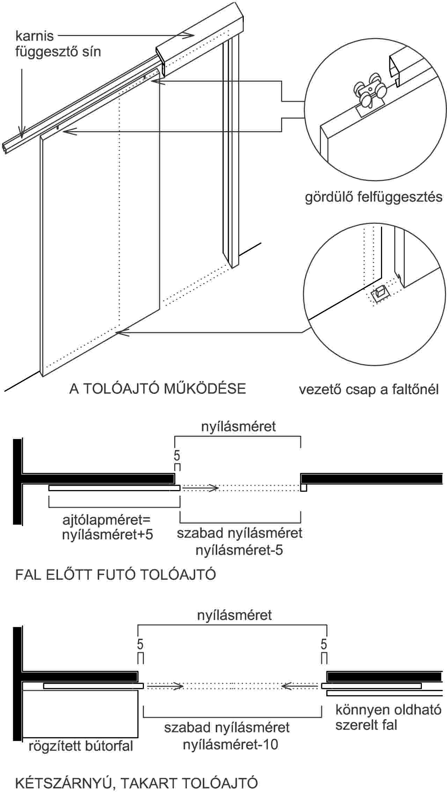

*1.15. ábra – Tolóajtók méretei*

Két, falazott válaszfal közé futó tolóajtót lehetőleg ne tervezzünk, mert a vezetősínt már a kőműves munkák során el kellene helyezni, és ha a vasalás meghibásodása miatt az ajtólap a két válaszfal között akadna ki, akkor az egyik válaszfalat le kellene bontani és újra megépíteni.

### 1.2.6 Az ablakok elhelyezése

Az ablakok alapfunkciója a bevilágítás és szellőzés biztosítása, az ezzel kapcsolatos méretezési szabályokról az 1.5.1. és az 1.5.2. fejezetben esik szó. A lakásterek kialakítását az ablakok helyzete is befolyásolja, mert a jó megvilágítást igénylő lakástevékenységek helyét az ablakok közelében kell kijelölni.

Az ablakok *parapetmagassága* a bevilágított helyiség rendeltetésétől függ (lásd [1.16. sz. ábrasor](#abra_1_16)). A lakószobák ablakainak parapetmagasságát úgy kell kialakítani, hogy ülő testhelyzetben, vízszintes látószög esetén az ablakon jól ki lehessen látni. Ez 90 cm-es – általában szokásos – parapetfal esetén biztosított.

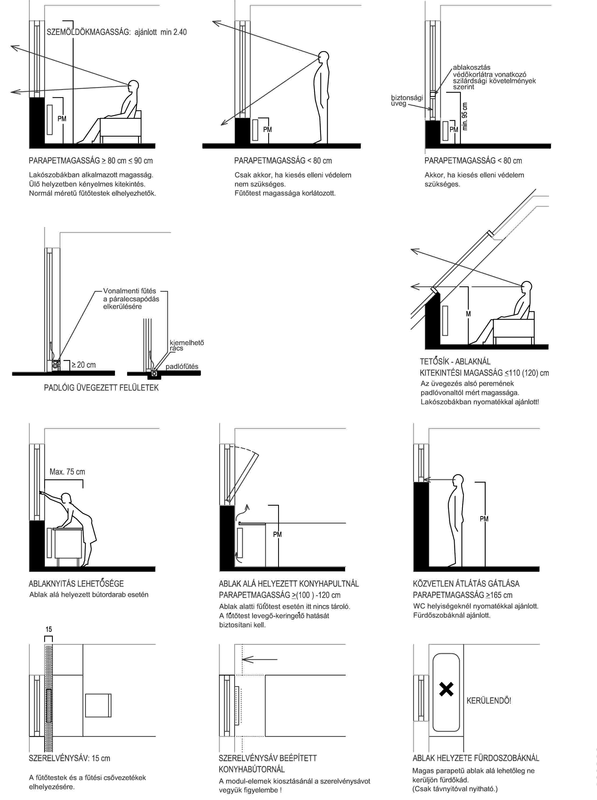

*1.16. ábra – Ablakok elhelyezése*

A tetőtéri helyiségek tetősík-ablakainál a parapetmagasság meghatározása nem egyértelmű, ezért ott az ablakot úgy kell elhelyezni, hogy az üvegezett felület alsó éle ne kerüljön az ülő személy szemmagassága fölé (110 cm, esetleg 120 cm).

Alacsony parapetű, vagy parapet nélküli üvegfalakat ott alkalmazhatunk, ahol igény a külső térrel való intenzív vizuális kapcsolat, ez elsősorban kertre vagy tetőteraszra néző nappali szobáknál fordul elő. Ezekben az esetekben a fűtés lehetőségét már a tervezés kezdetén végig kell gondolni, mert a parapet nélküli üvegfalak vagy igen alacsony parapetfalak elé nem lehet (vagy korlátozottan lehet) fűtőtesteket helyezni. A parapetfal egyben kiesést gátló mellvédfal is, ezért nem szabad 80 cm-nél alacsonyabb parapetű ablakot helyezni oda, ahol az ablak alatti külső terepszint (járda, terasz) 80 cm-nél mélyebben van a padlóvonalhoz képest. Ha valamilyen megfontolásból az emeleten létesítenek olyan ablakot, amelynek parapetmagassága 80 cm-nél alacsonyabb, akkor az ablakon min. 95 cm magasságban olyan vízszintes osztást kell létesíteni, amely a kiesést gátolja, tehát a korlátokra vonatkozó szilárdsági követelményeknek megfelel. Ez alatt fixen beépített, ugyancsak kiesést gátló, ütésálló biztonsági üvegezést kell alkalmazni.

> **Megjegyzés**
>
> A függőleges üvegezett szerkezetek esetében általánosságban igaz, hogy az előírt minimumnál nagyobb üvegfelület előnyös, ha az árnyékolásról is tudunk gondoskodni a nyári túlmelegedés elleni védelemként.
>
> Függőleges felületek esetében a padlóig üvegezett ajtók és üvegfalak alsó 60-80 cm-es része a belső tér megvilágítását nem segíti lényegesen (csak akkor, ha a csatlakozó padlóburkolat tükröződő felületű, ez azonban zavaró hatású is lehet). Akkor járunk el helyesen, ha ezt a felületet nem is vesszük számításba a megvilágítás mértékének számításánál.
>
> A padlóig üvegezett felületek esetében a fűtés berendezéseit is figyelembe kell venni, illetve a biztonsági és takarítási szempontokat. Javasolt a legalább 20 cm magasságig tömör keretszerkezet alkalmazása, amely lehetővé teszi a fűtést és a takarítást is. Amennyiben valóban a padlóig üvegezett felületre törekszünk, úgy a páralecsapódás elkerülésére általában padlóba süllyesztett vonalmenti fűtés szükséges (1.16. ábra).
>
> Az alacsony parapetű üvegezett szerkezetek további hátránya lehet, hogy csak kiváló hőszigetelésű üvegezéssel lehet jó megoldást biztosítani a mi téli hőmérsékleti viszonyaink között, ugyanis az üvegezés alacsonyabb felületi hőmérséklete az üvegszerkezethez közel eső testfelületen a hőérzetet rendkívül kedvezőtlenül befolyásolja.
>
> Nagyobb alapterületű terek esetében a nagyobb szemöldökmagasság vagy a több irányú megvilágítás a jó megoldás. Az egyenletes nappali megvilágítás a külső felületen több magasabb álló ablakkal jobban elérhető, mint egy nagyobb vízszintes ablakkal (azonos üvegfelület esetében).
>
> A ferde síkú üvegezett felületek túlméretezése a belső tér nyári túlmelegedéséhez vezethet. Azt is tekintetbe kell venni ezeknél, hogy a tájolástól függetlenül is tovább tart a benapozott időszak. Például egy keletre tájolt tetősíkú ablakkal bevilágított hálószoba még akkor is közvetlen benapozást kap, amikor már a függőleges falsík nem. Ez főleg a nyári időszakban okozhat túlmelegedést. Ezért ferde síkú transzparens felületek esetében az üvegméret növelése nem jár előnnyel és kerülendő, hacsak nem kimondott tervezői szándék vezet a nagyobb üvegfelülethez (pl. műtermek, üvegházak stb.). (N.Á.)

A belső tér ablak alatt lévő sávja bizonyos bútorok, berendezések elhelyezésére alkalmas (munkaasztal, konyhapult stb.) de azok nem lehetnek a parapetnél magasabbak, szélességi méretük pedig nem haladhatja meg azt a mértéket, amely az ablakkilincs eléréséhez szükséges (max. 75 cm).

A fűtőtestek szokásos helye is az ablak alatt van, ezekhez gyakorta vezetnek az ablakot tartalmazó fal mentén vízszintes fűtési csövek. Ezért itt egy 15 cm-es sávot bútorozás szempontjából ne vegyünk figyelembe (szerelvénysáv). A szerelvénysáv jelenlétét modulméretű beépített bútorok elhelyezésénél is tartsuk számon (a kialakuló hézag takaró elemmel elfedhető). Újabban gyakori, hogy a fűtési csővezetékek a padlóburkolat alatt futnak, itt a szerelvénysáv valójában csak az ablak alatt szükséges. Ennek ellenére az egész fal mentén vegyük azt figyelembe, mert az épületgépészeti vezetékhálózat milyensége gyakran csak a kiviteli-tervi stádiumban dől el, és a méretezési többlet a bútorozáshoz is bizonyos biztonsági tartalékot nyújt ([1.16. ábra](#abra_1_16)).

Amennyiben *beépített konyhabútor* kerül az ablak alá, a parapetmagasság lehetőleg ne legyen 120 (esetleg 100) cm-nél alacsonyabb, és az ablak ne legyen csak felnyíló szárnyú (a nyitott ablakszárny a pulton folyó munkát zavarja). Ilyenkor a fűtőtest vagy másutt van, vagy a konyhabútor ablak alatti része csak munkafelületet tartalmaz, alacsony tárolót nem. A munkafelületen hagyott rés a radiátor levegő-keringető hatását nem akadályozza. (Kivétel a mozgáskorlátozottak számára létesített lakás: a tolószékben ülő személy érzéketlen lábát a radiátor megégetheti.)

A fürdőszobáknál, WC helyiségeknél az ablakok parapetmagasságát lehetőleg úgy szabjuk meg, hogy oda kívülről ne lehessen belátni. A mélyebb parapetű ablakok átlátszatlan üvegezése (katedrálüveg, homokfúvott üveg) a homlokzati megjelenés szempontjából kedvezőtlen. Magas parapetű ablak alá lehetőleg ne kerüljön fürdőkád, mert akkor az ablakot csak bonyolult távnyitó szerkezettel lehet működtetni.

Az ablakok méretének és helyzetének megállapításánál gyakran ütköznek a rendeltetési igények és a homlokzatképzési szempontok. Lehet, hogy egy-egy helyiség ablakának használati szempontból optimális helyzete és mérete a homlokzaton kedvezőtlen ritmus-váltást okoz, vagy a homlokzatrendszerhez arányaiban nem illeszkedik. Az ellentmondó szempontok közötti mérlegelés a tervező dolga. Gyakran a helyiség teljes elrendezését, méretezését meg kell változtatni a kedvező homlokzat érdekében, de azt nem lehet megtenni, hogy *alapvető* rendeltetési követelmények teljesítését esztétikai megfontolások miatt elhanyagoljuk. Ezért az első vázlatoktól kezdve mindig az *egész házat* kell tervezni a homlokzatokkal együtt.

### 1.2.7 A helyiségek méreteinek meghatározása

A lakás helyiségei méretezésének *egyik* fontos szempontja, hogy azokban a rendeltetésszerű lakástevékenységeket el lehessen végezni. Ezek bizonyos bútorok, bútorcsoportok használatával és ezek megközelítésével párosulnak.

Ha a bútorokból bútorcsoportokat kell összeállítani, akkor az egyes bútorok használati zónái egymással átfedhetnek. A használati zóna ugyancsak átfedésben lehet a közlekedő sávval ([1.17. ábra](#abra_1_17)).

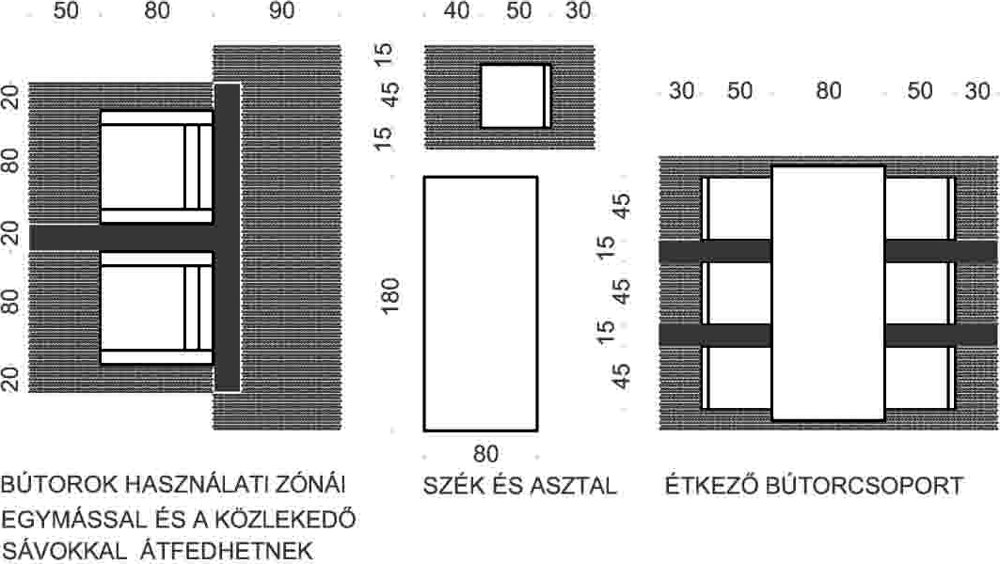

*1.17. ábra – Bútorcsoportok összeállítása*

Egy lakástér (helyiség) rendeltetésszerű használatához szükséges bútorok, bútorcsoportok bútorzónái és a közlekedő sávok méretei valamint az ajtók használati zónái, az ablakok helyzete alapján lehet a helyiségek legkisebb alaprajzi méreteit kijelölni, illetve ellenőrizni ([1.18. sz. ábra](#abra_1_18)). A bútorok használati zónáit és a közlekedő sávokat a bútorozási terveken *nem* kell jelölni. Egy adott bútorelrendezéshez szükséges minimális méreteknél *nagyobbat* mindig lehet tervezni, sőt – ha arra lehetőség van – ajánlatos is. Nem jó, ha egy-egy helyiség csak egyféleképpen bútorozható, ezért kívánatos, hogy a helyiségméretek bizonyos „tartalékokkal” rendelkezzenek, de a gondos tervező a bútorelrendezés többféle lehetőségét is ellenőrzi a méretezés során.

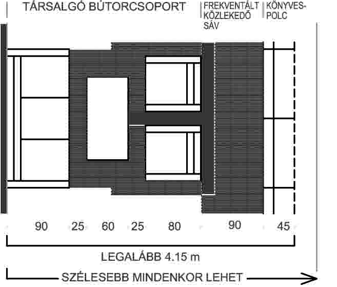

*1.18. ábra – Helyiségméret meghatározása bútorozás alapján*

A megadott bútorzóna és közlekedő-sáv méreteket akkor is tartsuk be, ha közvetlen lakáshasználati tapasztalataink alapján azoknál kisebb is elegendőnek tűnik. Ugyanis a megadott alapméretek szerint tervezett lakás már némi területi tartalékkal rendelkezik.

Az egészségügyi helyiségek berendezéseit az építés során beépítik, ezért ezek pontos méretezése a berendezések helyigénye alapján történhet ([1.19. ábra](#abra_1_19)). Ebben az esetben is lehetőség van az ennél tágasabb méretekre. Tartsuk azonban szem előtt, hogy a nagyobb alapterület magasabb színvonalú felszereltséget tesz lehetővé, ezért az a jó, ha az alapterület egy újabb, vagy nagyobb méretű, kényelmesebb berendezési tárgy helyszükséglete szerint növekszik.

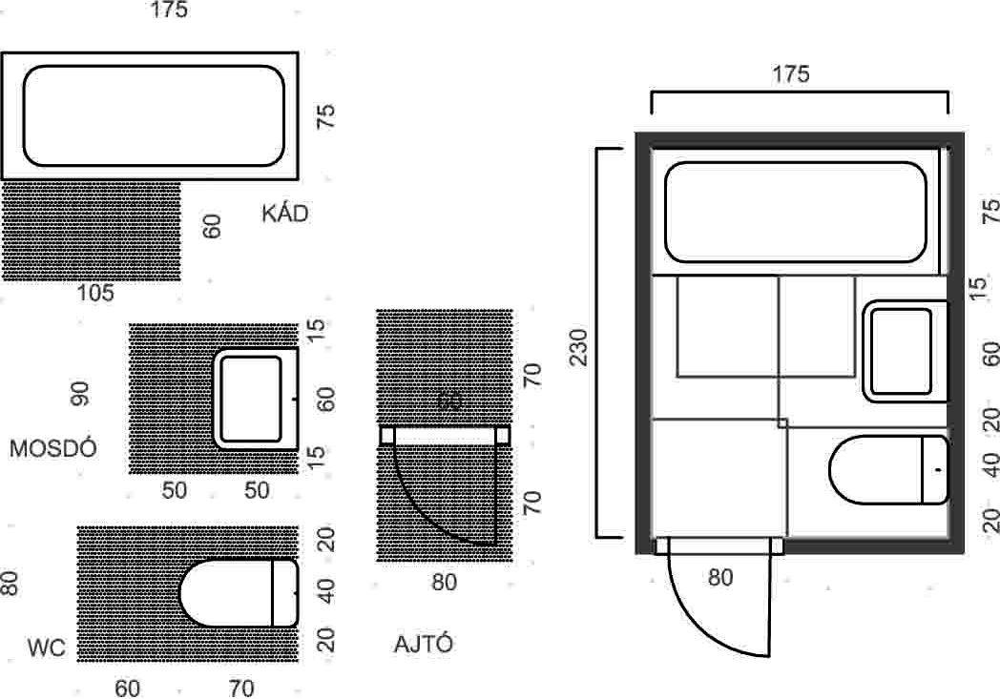

*1.19. ábra – Fürdőszoba méretei a berendezések helyszükséglete alapján*

Az m=1:100-as, m=1:50-es terveken a helyiségeket a nyers falméretek szerint kótázzuk. A valóságban kialakult helyiségméretek a falak burkolatvastagságával csökkennek. Ez a méretkülönbség lehet milliméter nagyságrendű (pl. sima felületű szerelt válaszfalak esetén, amelyekre esetleg csak tapéta kerül), de a nyers válaszfallapokra hagyományosan felhordott vagy vakolatra ragasztott burkolólapok esetében ez egy-egy falon kb. 2,5 cm-t, a helyiség méretében 5 cm méretcsökkenést is eredményezhet. Ez a kisebb méretű egészségügyi helyiségeknél problémát jelenthet. A berendezési tárgyak használati zónáiban van annyi tartalék, hogy hosszabb falfelületen a burkolatokból adódó méretcsökkenés észrevétlenül elosztható, de kicsiny helyiségméreteknél ez számottevő lehet és ott figyelembe is kell venni ([1.20. ábra](#abra_1_20)). A helyiségméretektől függetlenül, bizonyos helyzetekben a burkolatvastagság elhanyagolása a bútorozásra rendelkezésre álló sávot a használhatatlanságig csökkentheti. (Például, az [1.20. ábra](#abra_1_20) 600 mm mély konyhabútora nem lenne elhelyezhető, ha a burkolatlan falfelülettől az ajtó névleges mérethatáráig tartó sáv 60 cm lenne.)

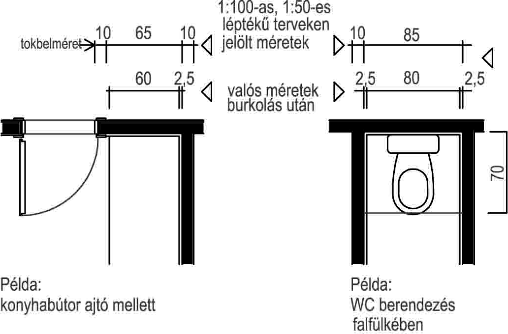

*1.20. ábra – Falburkolatok vastagságának figyelembe vétele rövid méreteknél*

A lakásterek méreteinek meghatározásakor nemcsak a fizikailag értelmezett lakástevékenységek térigénye számít. A *mentális komfortérzethez* tágasság-érzet, esztétikailag kellemes térarányok is tartoznak, amelyeket számszerűsíteni és normatívákban rögzíteni nem lehet. Az ehhez illő térméretek meghatározása nem nélkülözheti a tervező tér-érzékét és intuícióit. A térdimenzióknak azonban mindenképpen elegendőnek kell ahhoz lennie, hogy a lakótér rendeltetése szerint használható legyen, az ehhez szükséges méretek csökkentését semmilyen más szempont sem indokolhatja.

A következő fejezetben a lakóterekre vonatkozó használati követelmények teljesítési kritériumának *alsó határértékeit* írjuk le, vagyis az elfogadható minimumot. Lehet, hogy ezek sokszor szegényesnek tűnnek, de éppen ezért tovább nem csökkenthetők. Sajnos, elég gyakran látunk olyan lakás-terveket, amelyeknél egyes lakáselemek használati színvonala a luxus-kategóriába tartozik, míg más rendeltetési követelmények a minimális színvonalon sem teljesülnek.

Bizonyos helyiségek méretei a lakást használók létszámától függnek (pl. az étkező, nappali tartózkodás tere, egészségügyi felszereltség stb.). Lakáspiaci feltételek között nem várható, hogy egy lakásban mindig pont annyian lakjanak, amekkora használói létszámot a tervező figyelembe vett. A nagyobb lakásokban inkább a tehetősebb, mintsem sokgyerekes családok élnek. Mégis kívánatos, hogy a létszámtól függő lakáselemek megfelelő színvonalon legyenek használhatók, ha a lakás valóban telített. Ezért használjuk a lakások *férőhelyszámának* fogalmát. Egy lakás férőhelyszáma annyi, ahány fekhelyet el lehet benne helyezni úgy, hogy az „Alvás, pihenés” fejezetrészben leírt használati követelmények maradéktalanul teljesüljenek.

## 1.3. A lakástevékenységek térigénye

### 1.3.1. Közös időtöltés, kikapcsolódás, vendégek fogadása

A lakás érzelmileg is szoros kapcsolatban álló embercsoport (általában család) élettere, ahol az otthoni szabadidő eltöltése az együtt élők rendszeres kommunikációjával párosul. A közösen eltöltött szabadidő, a „családi együttlét” nemcsak a mentális komfortérzet szempontjából fontos, de hozzátartozik a személyiség fejlődéséhez, kiteljesedéséhez is: a lakás a gyermekek elemi szocializálódásának színtere.

A családi együttélés kapcsolatai napjainkban már nem annyira szorosak, mint régebben voltak, a beszélgetések, társasjátékok helyett a közös televíziózás tölti ki az otthon töltött szabadidő nagy részét. Egyre gyakoribb, hogy a háztartás-tagoknak saját szobájukban elhelyezett rádiója, sőt saját tévé készüléke van, de általában van egy, mindenki által együttesen használt jobb minőségű tévé berendezés is.

A közös időtöltés tere szolgál a család vendégeinek fogadására, ezért a helyiséget potenciálisan használók létszámát tekintsük mindig nagyobbnak, mint amennyi a lakásban élő személyek száma.

Az itteni bútorok legyenek kényelmes ülő-alkalmatosságok: fotelek és heverő(k), amelyeket társalgó bútorcsoport formájában szokás elrendezni, az ülőhelyekről könnyen elérhető kávézó asztallal. Igen sok családnak élnek közeli hozzátartozói más városban, és sokszor előfordul, hogy egy látogató családtag egy-két éjszakát vendégként tölt a lakásban. Ilyenkor rendkívül hasznos, ha a heverőt pótfekhelyként is igénybe lehet venni, ezért – bár a kereskedelemben rövidebb, kétszemélyes heverő is kapható – a méretezésnél az ágyméretű heverő térigényét tekintsük mértékadónak. A lakástevékenységhez szükséges bútorokat, ezek elrendezési változatait az [1.21. ábra](#abra_1_21) mutatja.

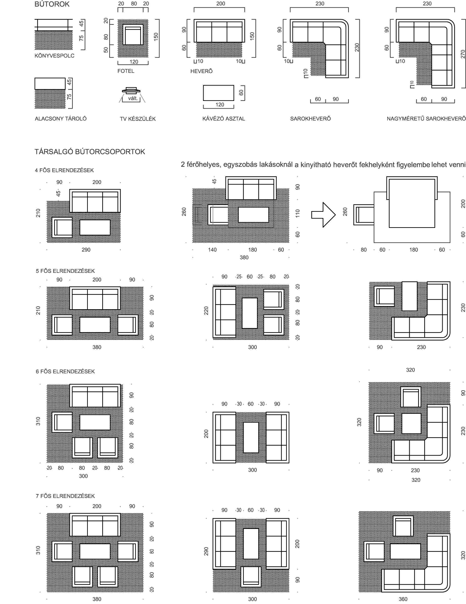

*1.21. ábra – Közös időtöltés, vendégfogadás bútorai*

**Követelmények és ajánlások**

**Alapkövetelmény:**

Biztosítani kell, hogy a lakásban élő háztartás valamennyi tagja otthoni szabad idejét együtt is eltölthesse, audiovizuális szórakoztató eszközöket közösen használhasson, a lakásban vendégeket fogadhasson.

**Bútorigény:**

Társalgó-bútorcsoport: fotelek és pót-fekhelyként is használható heverő, kávézó asztal, kép- és hanglejátszó berendezések, tároló bútorok a közösen használt könyvek és egyéb tárgyak számára. Könyvek tárolásától el lehet tekinteni, ha a lakás más helyiségében (pl. külön könyvtárszobában, dolgozószobában stb.) mód van megfelelő méretű könyvszekrény vagy könyvespolc elhelyezésére.

**A társalgó bútorcsoport legyen elegendő:**

- 1-2 férőhelyes lakásokban legalább 4 személynek
- 3-4 férőhelyes lakásban legalább 5 személynek
- 5 férőhelyes vagy annál nagyobb lakásban legalább 6 személynek.

A közös időtöltés és vendégfogadás tere legyen kellően tágas, megengedett legkisebb alapterülete legalább 17 m2 (OTÉK), de *nyomatékosan ajánlott* legalább 18 m2 alapterület az 1-2 férőhelyes lakásoknál is, 3 férőhelyes vagy annál nagyobb lakásokban pedig a 20 m2 alsó határérték.

A helyiség szélességi vagy mélységi mérete ne legyen kevesebb 3,60 m-nél.

1-2 férőhelyes kislakásokban a közös időtöltés tere (nappali) lehet az alvás tere is (nappali-háló).

*Szükség esetén* 2 férőhelyesnél nagyobb lakásban is *megengedhető*, hogy a nappali legfeljebb két személy alvóhelye is legyen, de csak akkor, ha a társalgás, vendégfogadás lehetőségét – alacsonyabb követelményszinten és időszakosan – más lakástérben (pl. étkezőhelyiségben, étkezőkonyhában) biztosítani lehet. (Lásd még az „Alvás, pihenés” követelményeinél.)

A *fekhely nélküli* nappalit közlekedő térnek is lehet tekinteni („rejtett közlekedő”), ha a tervezési program erről másképpen nem rendelkezik (lásd 1.51. és 1.53. fejezet).

### 1.3.2. Közös étkezés

Az étkezés „technológiai” értelemben az ételkészítés műveletsorához is illeszthető, de azért tárgyaljuk itt külön, hogy hangsúlyozzuk: a közös étkezés nem csupán táplálkozást jelent. A családi együttlét ritkuló alkalmait egyre inkább a közös étkezések jelentik (a valóságban elég ritkán fordul elő, hogy valamennyi családtag a nappali ülőgarnitúráját használva „társalog”). A közös étkezés helye legyen olyan, hogy ott akár egy ünnepi asztal is megteríthető legyen.

> **Megjegyzés**
>
> A hatvanas-hetvenes években épített sok ezer panellakás jellemző, közös hiányossága, hogy azokban a közös étkezésnek nem adtak teret. A kisméretű nappaliban az egyébként szükséges bútorok mellett étkezőasztal nem fér el, az aprócska konyha étkezésre nem alkalmas. A lakók sokszor barkácsolnak különféle lehajtható polcokat a konyhában, ahol valahogyan étkezni lehet. A lakásszociológiai felmérések sok olyan esetet is feltártak, ahol a nagyobb létszámú családok tagjai felváltva ettek.

Az étkező asztalnak általában több funkciója van, mint maga a viszonylag rövid ideig tartó étkezés. Kártyázni, társasjátékokat játszani lehet rajta, vagy a kisgyerek ott rajzolgathat a mama közelében stb. A jól méretezett és megfelelően elhelyezett étkezőasztal a nappali időtöltés bútorait egészíti ki. A főzőhely közvetlen közelében lévő étkező asztal a konyha technológiai felületeként is szolgálhat az étkezés idején kívül.

A családok időnként vendégeket fogadnak ebédre vagy vacsorára, ezért ajánlatos az étkezőhely méretezésénél több személyt figyelembe venni, mint a lakás férőhelyszáma. Az étkezés bútorait és a különböző étkező-elrendezéseket az [1.22. ábra](#abra_1_22) mutatja.

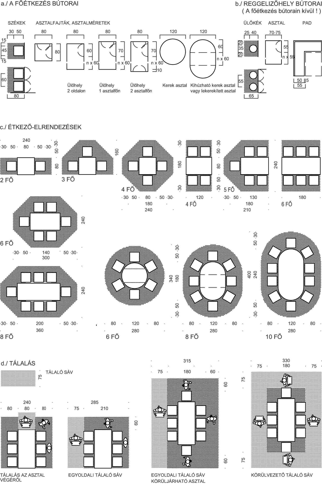

*1.22. ábra – Közös étkezés bútorai*

**Követelmények és ajánlások**

**Alapkövetelmény:**

Biztosítani kell, hogy a lakásban élő háztartás valamennyi tagja együtt étkezhessen kulturált körülmények között, alkalmanként étkező vendégeket fogadhasson.

**Bútorigény:**

Étkező asztal, székekkel. A bútorcsoport férőhelyszáma semmiképp sem lehet a lakás férőhelyszámánál kisebb, de nyomatékosan ajánlott annál két fővel (vendégekkel) nagyobb létszám figyelembe vétele.

2 férőhelyesnél nagyobb lakásoknál nem kerülhet az étkező olyan helyiségbe, amely valamelyik használó alvóhelye. (Nem lehet a nappali szobát alvóhelyként figyelembe venni, ha rendszeresen használt étkező van ott.) Az étkező legyen a főzőhely (konyha) megfelelő közelségében, attól legfeljebb egy ajtó válassza el (kivételt képez az olyan eset, amikor a konyhában is van egy, legalább a használói létszámra méretezett második étkezőhely). A főzőhely és az étkezőhely között ne legyen lépcső (balesetveszély a tálaláskor!). Az étkezés terét közlekedő térként figyelembe lehet venni.

### 1.3.3. Alvás, pihenés

A lakás elemi rendeltetése a regenerálódás: az alvás és napközbeni pihenés zavartalan biztosítása. Az alvás helye szokásosan a hálószoba, de lehet más tér is (pl. háló-galéria, más szobával egybenyitott hálófülke, esetleg nappali-háló). A hálószobák – hagyományosan – a családtagok *egyéni tevékenységeinek* (tanulás, szellemi munka) is színterei, de nem minden esetben. Ezért az egyéni tevékenységek követelményeit majd külön fejezetben részletezzük. Ha a hálóhely más helyiséggel (helyiségekkel) térben állandóan összekapcsolt, akkor *a követelményeket az összekapcsolt terekre, mint egységes térre kell értelmezni.*

Az intim életközösségben élő párok (szülők) általában azonos térben kívánnak aludni, így azoknak két személyes hálóhelyiséget kell tervezni. Más háztartástagok *optimális esetben* saját, egyedül használt hálóhelyiséggel rendelkeznek, de ezt szerényebb jövedelmű – kivált a többgyermekes – családok anyagilag ritkán engedhetik meg maguknak. Ezért kétszemélyes hálókat ki lehet alakítani más családtagoknak is, annak tudtával, hogy az egy hálóhelyiségben élőknek életritmusukban alkalmazkodniuk kell egymáshoz. Két személy esetén ez a tolerancia még elvárható, de ha egy hálóhelyiségben kettőnél több fekhely van, az már az elfogadható mértéknél nagyobb zsúfoltságot jelent. Kisfiú és kislány közös hálószobája csak kisgyermekkorban megfelelő. Kamaszkorú vagy annál idősebb különnemű testvérek közös hálószobája rendkívül zavaró, ezért konkrét családok számára tervezett lakásoknál ezt kerülni kell.

Más lakástevékenységekkel való viszony szempontjából *kivételesen lehet kezelni az egy vagy két férőhelyes kislakások hálóhelyeit*, mert a használók életritmusát *az egész lakásra* vonatkozóan lehet egyeztetni (pl. az ételkészítés és alvás vagy vendégfogadás és alvás egyidejűsége kizárható, ha a lakásban egyetlen személy lakik, és elvárható az egyidejűség elkerülése akkor is, ha a lakásban egy gyermektelen pár él). Ezeknél a közös időtöltés helye (nappali) egyben hálóhely is lehet (fekvőhelyes nappali).

A fizetőképes lakáskereslet vagy a szociális lakásellátás lehetőségei alapján még nem biztosítható általánosan, hogy a családok akkora lakáshoz jussanak, amelyben a hálószobákon kívül még egy fekhely nélküli nappali szoba lehet. Szükség esetén szerényebb színvonalú – de még elfogadható – lakáshasználatot jelent, ha a nappali szobába is fekhely kerül, a követelményeknél lefektetett feltételek kielégítése mellett.

A bútorigények meghatározásánál felnőtt korú, akár időskorú használót kell figyelembe venni, mert a lakásban hosszabb időtávon kell laknia a beköltöző családnak: a gyermek mihamar felnőtté válik, a fiatal szülők megöregszenek. A kereskedelemben ugyan kapható, de *a követelménytől eltérő ágyméret* – pl. gyermekágy, emeletes ágy vagy 180 cm-nél keskenyebb, kétszemélyes „francia ágy” – csak az életciklus egy bizonyos időszakában használható, ezért annak elhelyezését a követelmény teljesítési kritériumaként *nem lehet elfogadni.*

A huzat, a hideget sugárzó felületek közvetlen közelsége egészségkárosodást okozhat, ezért ágy hosszoldalával *semmiképpen* nem kerülhet közvetlenül ablak alá, és *lehetőleg* ne kerüljön hosszoldalával külső fal mellé. Sugárzó meleg felület – pl. fűtőtest – közvetlen közelsége is zavarja az alvás nyugalmát.

Az alvás bútorait és a különböző fekhely-elrendezéseket az [1.23. ábra](#abra_1_23) mutatja.

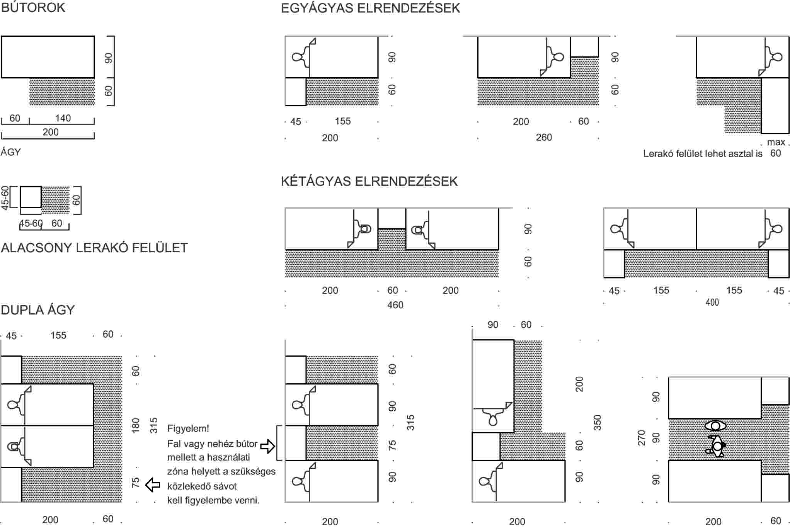

*1.23. ábra – Alvás, pihenés bútorai*

**Követelmények és ajánlások**

**Alapkövetelmény:**

Biztosítani kell, hogy a lakást használók zavartalanul alhassanak, pihenhessenek.

**Bútorigény:**

Személyenként 1 db 90 x 200 cm alaprajzi méretű fekhely, ill. a fekhelyről elérhető, legalább 45 x 45 cm alaprajzi méretű (max. 75 cm magas) lerakó felület (alacsony szekrény, polc, esetleg az ágy melletti asztal).

Egy, akusztikailag összefüggő térben legfeljebb 2 fekhelyet lehet feltételezni.

A lakásban házastársi (élettársi) közösségben élő pár számára biztosítani kell az ágyak „iker”-elrendezését (szülői háló). Ennek befoglaló mérete min. 180 x 200 cm, amely mindkét hosszoldalon megközelíthető („fekhelyes nappali” esetén lehet kihúzható vagy kinyitható pamlag is). Más családtagok (pl. testvérek) számára különálló, hosszoldalon nem érintkező fekhelyek elhelyezését kell lehetővé tenni. Az 1 férőhelyesnél nagyobb lakásban legalább egy helyiséget szülői hálóként kell figyelembe venni.

A fekhelyeket úgy kell elhelyezni, hogy a használók zavaró kényelmetlenséget vagy egészségkárosodást ne szenvedjenek sugárzó hideg vagy erősen sugárzó meleg felületek közelsége miatt.

A más lakásterektől légtérben elválasztott hálóhelyiségek térfogata fekvőhelyenként legalább 15 m3 legyen (lásd még 1.5.2. fejezet). Erősen ajánlott, hogy az egyszemélyes hálóhelyiség alapterülete 8 m2-nél, a kétszemélyes hálóhelyiségé 12 m2-nél akkor se legyen kisebb, ha az előírt térfogat ennél alacsonyabb értékek mellett is biztosítható.

*Két férőhelyesnél nagyobb* lakásokban alvás céljára csak olyan helyiség szolgálhat, amelyet a lakás egyéb tereitől *akusztikailag* le lehet választani oly módon, hogy minden más lakástevékenységet az alvás zavarása nélkül lehessen elvégezni. Itt az alvás céljára szolgáló helyiséget nem lehet közlekedő térnek tekinteni.

1-2 férőhelyes, egy szobás lakásoknál az alvás tere és a közös időtöltés helye lehet azonos (nappali-háló). Két férőhelyesnél nagyobb lakásokban is *megengedhető*, hogy fekhely a közös időtöltés terébe (nappaliba) kerüljön, ha a nappali szoba akusztikai leválasztása mellett más lakástevékenységek zavartalanul végezhetők, a lakás egyéb helyiségei a nappali érintése nélkül megközelíthetők, és csak akkor, ha a közös időtöltés és vendégfogadás funkcióját más, közösen használt helyiség *időszakosan* és kényszerűen bár, de betöltheti (pl. étkező, étkezős konyha). A nappali szobát sohasem lehet gyermek hálóhelyének tekinteni.

### 1.3.4. Egyéni tevékenységek

A lakást használó háztartás tagjai legtöbb esetben otthon is végeznek valamilyen, elvonultságot igénylő egyéni tevékenységet. Ilyen az iskoláskorú gyermekek tanulása, de a szellemi foglalkozásúak körében is gyakori az otthoni munka. Utóbbinak a jelentősége egyre növekszik. Egyes szakértői előrejelzések szerint az informatikai társadalom gyökeresen megváltoztatja a lakás-munkahely viszonyt, egyre nagyobb számban lesz a lakás egyben munkahely is, ahol a munkavállaló számítógépes kapcsolat révén dolgozik együtt munkatársaival.

> **Megjegyzés**
>
> A távmunka igénye és lehetősége, az infokommunikációs eszközök változatossága és beáramlása a lakás tereibe nem megkerülhető jelenség. Ez egyben a fenntarthatóság szociális és gazdasági pillérének erősítését is jelenti, hiszen az otthoni vagy távmunka csökkenti a közlekedésből adódó környezeti terhelést, növeli a munka után fennmaradó rekreációs tevékenységek lehetőségét és az elégedettséget. Ezért az alapvető lakástevékenységek között egyre többször előkerül az otthoni munkavégzés, szolgáltatás. (N.Á.)

Ha valaki nem is dolgozik otthon, legtöbbször van valamilyen egyéni elfoglaltsága (olvasgatás, zenehallgatás, kézimunka, internetezés stb.). Ezek a tevékenységek igen sokfélék lehetnek, a lakás élettartama alatt többször változhatnak is, ezért a tervezés során ezeket egyenként figyelembe venni lehetetlen. Ezért *minimális* követelmény, hogy a háztartás minden tagjának rendelkezésére álljon egy munkaasztal és egy szék helyigényével jellemezhető térrész, ahol saját, egyéni tevékenységeit folytathatja. Ebben elfér egy pihenőfotel (olvasgatás, zenehallgatás, kézimunkázás), vagy egy barkácsasztal vagy egy számítógép-asztal stb. Ha külön dolgozószoba kialakítására nincs anyagi lehetőség, akkor az egyéni tevékenységek szokásos helye a lakásban élő személyek alvóhelye, minthogy az alvásra vonatkozó követelmények eleve a helyiség akusztikai leválasztását igénylik. Szükség esetén megengedhető, hogy egy munkahely – a családfő számára – a nappali szobába kerüljön. A szülői hálóba kerülő asztal-szék bútorzóna lehet fésülködő asztal (ha az egyik szülő nem igényel külön munkahelyet), de arra is alkalmas, hogy abban a kisded-korú gyermek ágyát el lehessen helyezni arra az időre, ameddig a baba éjszaka is felügyeletet igényel. A szülők saját tárgyai, könyvei a nappali szobában is tárolhatók, más családtagok (háztartás-tagok) számára biztosítsunk egyéni tevékenységeik közelében különféle tárgyaiknak, könyveiknek megfelelő méretű tároló helyet. Egy-egy családtag mentális komfort-érzetéhez az egyénileg kialakított, saját tárgyi környezet is hozzájárul.

Ha a lakást használó háztartás anyagi lehetőségei megengedik, az egyéni tevékenységekre vonatkozó minimális követelményeken túl célszerű lehetővé tenni tágasabb munkahely kialakítását, nagyobb tároló felületet, saját tévé használatát, és a személyre szóló, baráti látogatók fogadására alkalmas kisebb ülőgarnitúra elhelyezését. A „hálószoba” nevének megfelelő funkciót többnyire csak szülői hálóként tölt be, a többi „hálószoba” ma már inkább kisebb, saját nappali szobát jelent már a kamaszoknak is, de kivált egy felnőtt korú együtt élő – főiskolás családtag, nagyszülő – számára.

Az egyéni tevékenységek bútorait az [1.24. ábra](#abra_1_24) mutatja.

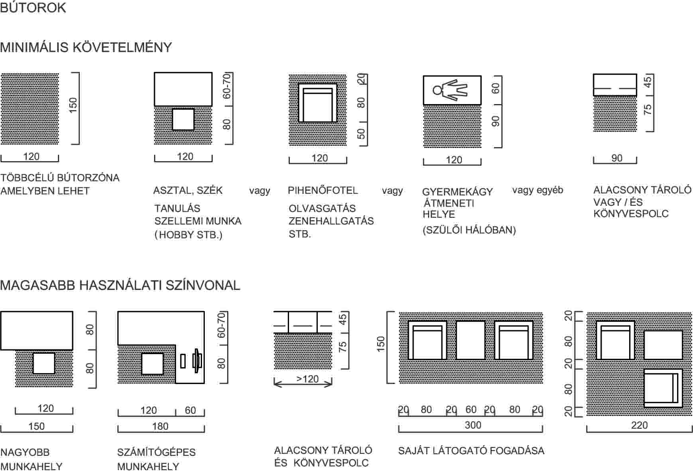

*1.24. ábra – Egyéni tevékenységek bútorai*

**Követelmények és ajánlások**

**Alapkövetelmény:**

Biztosítani kell, hogy a lakást használó háztartás tagjai különféle egyéni tevékenységeiket (tanulás, szellemi munka, szabadidő-tevékenység) zavartalanul végezhessék, az ehhez szükséges tárgyakat, eszközöket saját környezetükben tárolhassák.

**Bútorigény:**

Minimális követelmény: legalább egy 60 x 120 cm-es asztal és a hozzá tartozó szék többcélúan használható bútorzónája, személyenként legalább 90 x 45 cm-es alapterületű alacsony tároló szekrény és/vagy könyvespolc.

Magasabb használati színvonal esetén *ajánlott* nagyobb dolgozóasztalnak, több tárlóhelynek, saját tévé használatának és saját látogató fogadására alkalmas kisebb társalgóhelynek helyet biztosítani.

Az egyéni tevékenység helye legyen más, egyidejűleg folyó zajosabb lakástevékenységtől akusztikailag elválasztható. Egy akusztikailag összefüggő tér (szoba) lehetőleg legfeljebb csak két személy egyéni tevékenységeinek legyen helye. Az alvás és az egyéni tevékenységek helye lehet azonos tér, de a két funkció el is válaszható (háló + dolgozó). Szükség esetén egy munkahely lehet a nappali térben. A szülői hálóban lévő, egyéni tevékenységre szolgáló bútorzónát, amennyiben lehet, úgy képezzük ki, hogy annak helyén átmenetileg elhelyezhető legyen kisbaba ágya.

### 1.3.5. Ételkészítés

Az ételkészítés hagyományos helye a konyha, azonban ma már gyakori, hogy a főzőhely számára nem alakítanak ki külön, e célra szolgáló helyiséget. A továbbiakban konyhát említvén, ezen az ételkészítés bútorait, berendezéseit és a hozzájuk tartozó használati zónát értjük, akár külön helyiségben vannak, akár más térrel (nappalival) összekapcsolt térben.

Minden konyha elemi tartozéka a tűzhely, a vízvételi hely, a főznivaló előkészítésére és feldolgozására szolgáló munkafelület, valamint a konyhaedények és főzőeszközök, evőedények és evőeszközök tárolására szolgáló tároló bútor. (Ezek a helyenként még meglévő, régi, hagyományos konyhákban is megvannak a „sparherd”, a falikút vagy víztároló edény, a konyhaasztal és konyhakredenc formájában.)

A mai, korszerű konyhák elődeit a huszadik század harmincas éveiben fejlesztették ki ([1.25. ábra](#abra_1_25)).

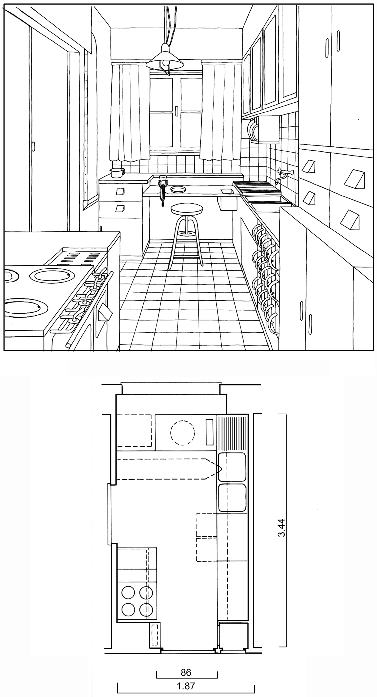

*1.25. ábra – A ‘frankfurti konyha’ 1931*

> **Megjegyzés**
>
> A múlt század húszas, harmincas éveiben folyó funkcionalista lakáselméletek kidolgozása során az ergonómia módszereivel kutatták az otthon végzett fizikai munka helyének – elsősorban a főzésnek – minél kevesebb erőkifejtést igénylő és minél helytakarékosabb kialakítását. A ma elterjedt beépített konyhák prototípusát Grete Lihotzky tervezte meg, amely a „frankfurti konyha” elnevezéssel vált közismertté, ugyanis azt Frankfurt-am-Mainban alkalmazta először Ernst May az ott épülő munkáslakások tervezése során. Ez a konyhaelrendezés röviddel ezután a stockholmi lakásépítési kiállításon nagy sikert aratott, ezért „svéd konyha” néven is ismert.

A korszerű, beépített konyhák méretkoordinált bútorelemekből és berendezésekből összeépített elemsort képeznek: alsó tárolókkal, melyek egyben munkafelületek is, valamint falra szerelt felső tárolókkal esetenként magas szekrényelemekkel. A tárolók rendeltetését és a főzés technológiai sorrendjét az [1.26. ábra](#abra_1_26) mutatja.

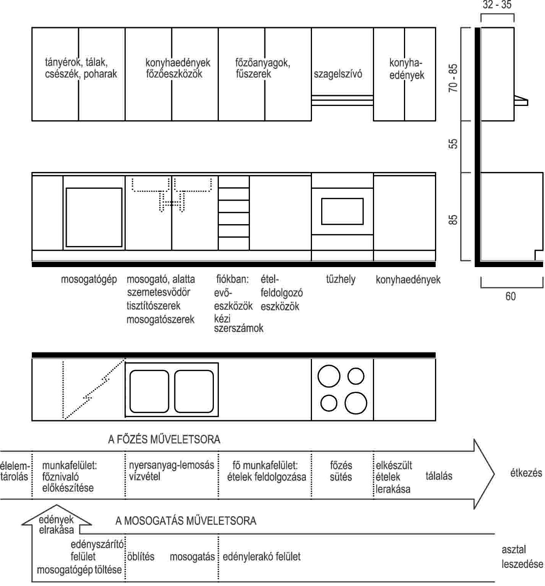

*1.26. ábra – A lakás konyhájának technológiája*

A leginkább használt munkafelület a tűzhely és a mosogató között van: ennek mérete soha ne legyen 60 x 60 cm-nél kisebb. A tűzhely másik oldalán lévő felület a már elkészült ételek lerakására szolgál. A mosogató túloldalán lévő munkafelület a főzési nyersanyagok előkészítésére (tisztítására) való. A megfőzött ételek elfogyasztása utáni mosogatás menetének iránya fordított: a feldolgozó felületen történik az edények összegyűjtése, a mosogató első medencéjében mosogatószeres elmosása, a második medencében öblítése, majd az edények szárítása és elrakása.

A méretkoordinált beépített elemek egységesen 60 cm mélyek, az alsó tárolók magassága 85 - 90 cm, a 32 - 35 cm mély felső tárolók alsó része 135 cm magasságban kezdődik, felső élük magassága kötetlen. Lehetséges a felső tárolók mennyezetig való kiegészítése: a magas, csak zsámolyról elérhető, kiegészítő elemek a nagyon ritkán használt konyhafelszerelések, edények tárolására alkalmasak. A kihúzható részt tartalmazó berendezések (tűzhely, mosogatógép) előtt legalább 120 cm, egyéb bútorok előtt legalább 90 cm széles használati zónát kell biztosítani.

A *tűzhelyek* lehetnek elektromos tűzhelyek vagy gáztűzhelyek. A gáztűzhely üzemeltetése jelenleg olcsóbb, de a nyílt láng égésterméke szennyezi a levegőt és a függönyökre, más textíliákra lerakódik. Ha a konyha légtere a nappali terével össze van nyitva, akkor gáztűzhelyt semmiképp ne alkalmazzunk. Az elektromos tűzhelyek sütője lehet magának a tűzhelynek az alsó részén, de elhelyezhető külön is, magas szekrényelembe építve. Ez utóbbi használata kényelmesebb, mert álló testhelyzetben is kezelhető. Ilyenkor a főzőlap alatti bútorelem tárolóként szolgál.

*Szagelszívó* berendezés kétféle van: olyan, amely a többé-kevésbé megszűrt levegőt a konyha terébe visszaáramoltatja, vagy olyan, amelyik az elszívott levegőt ventillátorral, légvezetéken át a szabadba vezeti. Más lakótérrel összekapcsolt konyha esetén kizárólag az utóbbi a megfelelő, ilyen esetben alkalmazása nem nélkülözhető. Működtetésekor levegő-utánpótlásról gondoskodni kell. Ha a szagelszívó és a gázüzemű falikazán netán egy légtérbe kerül, akkor utóbbi csak zárt égésterű lehet (lásd: 1.5.3. fejezet).

A *mosogatók* egy- vagy kétmedencések, csepptálcával vagy anélkül készülnek. Ha mosogatógép nincs a konyhában, akkor kétmedencés mosogatót tervezzünk, mert az egymedencés mosogatóban, folyóvízzel történő mosogatás igen víz- és energiaigényes, és sokkal több mosogatószert fogyaszt (ez környezetvédelmi szempontból is hátrányos, mert a mosogatószerek előbb-utóbb az élővizekbe kerülnek).

A *mosogatógép* ma már általánosan elterjedt, a tervezés során hagyjunk helyet neki: a lakók azt előbb-utóbb beépítik. A 60 x 120 cm-es mosogatóblokk kétmedencés mosogató + edényszárító felületet tartalmaz: ugyanilyen méretű elem elegendő egy mosogatógép és egymedencés mosogató elhelyezésére ([1.27.b. ábra](#abra_1_27)). Abban az esetben, ha az elemsorban mosogatógép van, akkor csak néhány főzőedény mosogatása történik kézzel: erre az egymedencés mosogató is megfelel, de ha van rá hely, akkor kétmedencés mosogató beépítése ekkor is indokolt. A mosogatógép legyen mindig a mosogató közvetlen közelében. Előnyben kell részesíteni a bútorba épített mosogatógépet, mert felette teljes értékű munkafelület alakítható ki.

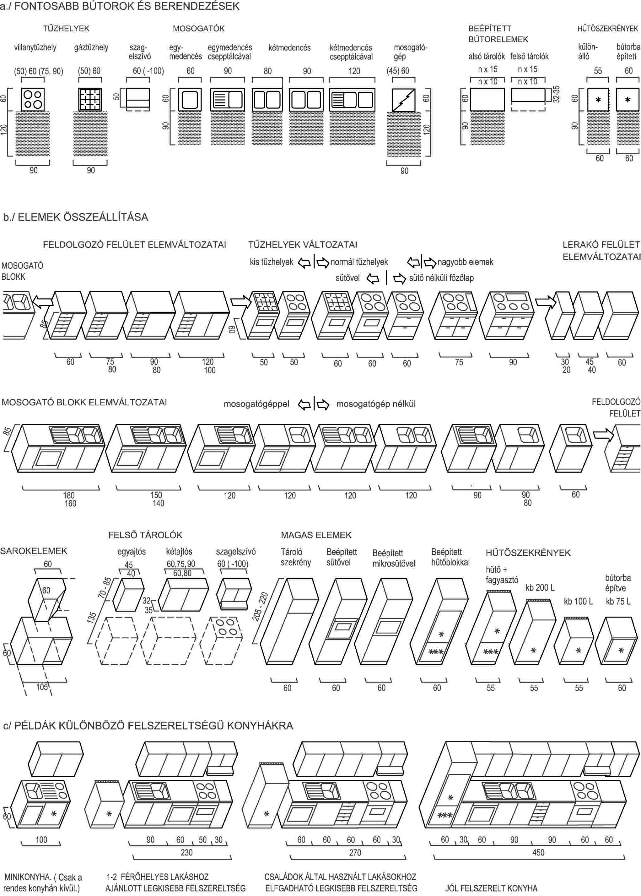

*1.27. ábra – Az ételkészítés bútorai és berendezései*

A *hűtőszekrény* lehet az elemsorba illesztve, de attól különállóan is elhelyezhető. A technológiai folyamatban nincs kijelölt helye. A hűtőszekrény legyen a konyha terében (a kamrában elhelyezett hűtő kezelése körülményes, a kamrát melegíti). Teljes háztartás vitelére alkalmas konyhákba legalább 200 literes hűtőszekrény való, amely a konyhabútorok alsó elemsoránál mindenképp magasabb. Az alacsony (az alsó elemsorba illeszthető) hűtő csak kisebb, 1-2 személyes lakásokban elegendő, de lehetőség szerint itt is ajánlott a magasabb, 150–200 literes hűtő betervezése. Igényesebb konyháknál érdemes 60 x 90 cm méretű hűtőszekrénynek, vagy egyenként 60 x 60 cm méretű hűtő- és fagyasztószekrénynek helyet biztosítani.

> **Megjegyzés**
>
> A hulladékgyűjtés leginkább a bútorozáshoz köthető funkció, de feltétlenül gondoskodni kell a konyhai és lakáson belüli szelektív gyűjtésről. A helyigény biztosítása kézenfekvően a konyhai technológiához van kötve. Az egy főre jutó szemét mennyisége még tudatos vásárlói szokások mellett is növekszik (magasabb fogyasztási színvonal, több csomagolás). A megnövekedett hulladék újrahasznosítása előírás, és a környezet védelme mellett üzleti érdek is. A településeken a közterületen felállított szelektív gyűjtőket felváltja a háznál történő szelektálás és a szelektív szállítás.
>
> Az úgynevezett amerikai konyha esetében is szükséges a „háttérüzem” (élelmiszertároló, hulladéktároló stb.) helyének biztosítása a kevésbé látványos konyhai műveletek és tevékenységek végzéséhez.
>
> Kistelepülések esetében – ahol a lakás mellett jellemzően nagyobb terület áll rendelkezésre – a konyha sokszor egyéb tevékenységeknek (tartósítás, befőzés, mélyhűtésre alkalmas előkészítés és csomagolás) is helyet ad. Még az átlagos családok esetében is tekinthetünk úgy a konyhára, mint értékteremtő munkahelyre. (N. Á.)

*A konyhabútor-elemek* igen széles választéka kapható a kereskedelemben, amelyekből különböző hosszúságú technológiai felület állítható össze. Egyes bútorcsaládok a 15 cm-es alapmodult használják, mások az ISO szabvány szerinti 1M (10 cm) alapmodult. Az ½M (5cm) szubmodul mindkét méretrend alapegysége. Az [1.24. ábrán](#abra_1_24) bemutatott elemeknél mindkét méretrend változatait feltüntettük. Az alsó szekrényelemek összeállítása után a rájuk kerülő felület egyben is kiszabható, így az elemek csatlakozásánál a könnyen piszkolódó és nehezen tisztítható illesztési hézagokat el lehet kerülni. (A jobb kereskedések az elemsor összeépítését és egységes felső lappal való ellátását szolgáltatásként nyújtják.)

A konyha felszereltségét a rendelkezésre álló hely korlátok közé szoríthatja. Egészen kicsiny (1 méter hosszú) egybeépített „készülék-konyha” is kapható, de ez elsősorban irodai teakonyhákba való, lakásokhoz nem elegendő. (Legfeljebb együtt élő családtagok számára, ahol valaki kávét főzhet, vagy egy reggelit elkészíthet magának külön is. A „komplett” konyhát nem helyettesítheti.)

Az egészen kicsiny, 1–2 férőhelyes lakásokhoz is a hűtőszekrényen kívül legalább 230 cm hosszú elemsort tervezzünk ([1.27.c. ábra](#abra_1_27)).

Családok számára tervezett (3 vagy annál több férőhelyes lakásban lévő) konyha elemsora a hűtőszekrényen kívül semmiképp ne legyen 270 cm-nél rövidebb. Erősen ajánlott legalább 360 cm hosszú elemsor + hűtőszekrény.

A lakás „erkölcsi elévülésének”, értékvesztésének egyik forrása lehet az alulméretezett konyha, hogyha évek múltán az akkorára kifejlesztett és általánosan elterjedt új konyhai felszereléseket, berendezéseket nem lehet helyszűke miatt elhelyezni.

A konyha méreteitől és geometriai formájától függően a konyafelület elrendezhető folyamatos elemsorban vagy megszakított elemsorban. A folyamatos elemsor lehet egyenes vonalú, „L” alakú és „U” alakú ([1.28. ábra](#abra_1_28)). A megszakított elemsorral kialakított, párhuzamos elrendezésű konyháknál az egyik oldal technológiai felülete legyen teljes: tartalmazza az előkészítés (edényszárítás) vízvétel (mosogatás), feldolgozás, főzés és lerakás felületeit egymás mellett, folyamatosan. A technológia alapelemeinek két felületre történő elosztása kényelmetlenséget, netán konyhai balesetet is okozhat (pl. ha forró vízzel telt edényt kell a szemközti felületre átemelni). Ha a folyamatos elemsoron kívül is van még munkafelület, a tűzhely és a mosogató közötti feldolgozó felület lehet rövidebb (min 60 cm). Mind az egysoros, mind az L alakú elrendezés kiegészíthető további elemekkel (+munkafelület, hűtőszekrény, tároló szekrények). Étkezős konyháknál az étkező asztalt is tekinthetjük kiegészítő munkafelületnek. A főzés és étkezés időben elkülönül, ezért az asztal helyigényét főzés idején az alája betolt székekkel, étkezés idején a szükséges tálaló sávval együtt lehet/kell figyelembe venni ([1.28. ábra](#abra_1_28)).

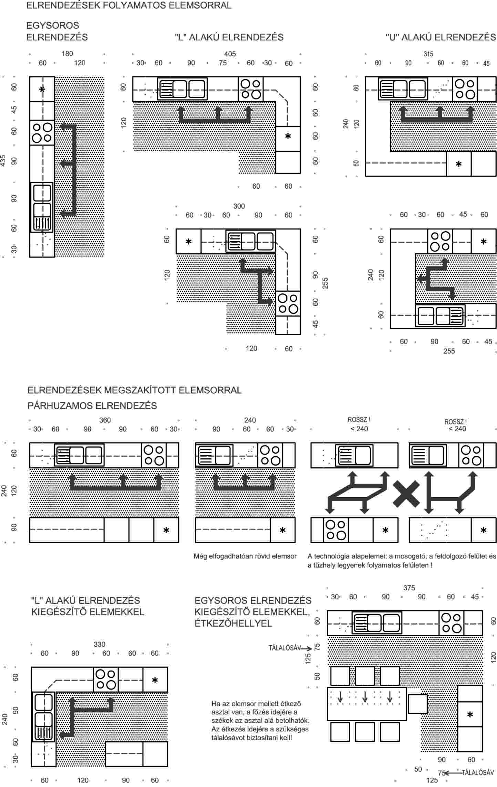

*1.28. ábra – Konyhaelrendezések változatai - példák*

Az L és U alakú konyháknál előforduló, körülményesen használható sarokelemeknek többféle változata készül, ezek közül kettőt az [1.29. ábra](#abra_1_29) mutat. A tűzhely elhelyezésekor ügyelni kell arra, hogy az falsarokba lehetőleg ne kerüljön, mert előtte nem lesz meg a használatához szükséges 90 cm széles sáv, és közvetlenül a sütő mellett lévő fal állandóan piszkolódik. Ugyanez a helyzet akkor is, ha a tűzhely sarokelem.

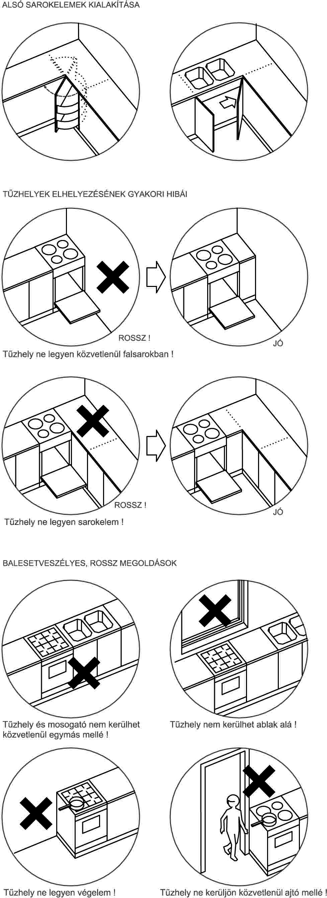

*1.29. ábra – A konyhai elemsor részletei*

Gáztűzhely sohasem kerülhet közvetlenül ablak alá vagy mosogató mellé, mert a huzat vagy a kifröccsenő víz a lángot elolthatja, ami balesetveszélyes. Elektromos tűzhelyet se tervezzünk ablak alá, mert akkor szagelszívó nem szerelhető fel (télen az ablak nem tartható állandóan nyitva), az ablak szárnya a tűzhely fölé nyílna, és a felszálló, zsíros gőz az ablakot állandóan piszkítja még bukó ablakszárny esetén is.

Az otthoni gyermekbalesetek legnagyobb része a konyhában történik. Ezek elkerülése érdekében a tűzhely ne legyen egyik oldalán szabad végelem, és semmilyen körülmények között ne kerüljön közvetlenül az ajtó mellé.

Nagyobb alapterületű, igényesebb lakásoknál a konyha két, ellenkező előjelű fejlődése figyelhető meg. Egyik irány a nappali térrel vizuálisan is egybekapcsolt, a nappali bútorzatával azonos minőségű bútorokkal felszerelt „amerikai konyha”. Ez inkább csak előre tisztított és csomagolt élelmiszerek feldolgozására, elkészítésére való. A másik irányzat a konyha kapacitásának növelése és már-már a kisebb vendéglők konyháihoz közelítő felszerelése olyankor, ha a lakásban gyakori a nagy létszámú ebéd- vagy vacsoravendégek fogadása. Az utóbbi esetben a konyha éppenséggel a vendégfogadás terétől való szeparálást igényli.

A viszonylag nagy alapterületű és nagy kapacitású házi konyháknál újra létjogosultságot kapott a középen lévő feldolgozó felület, amelyet a további technológiai felületek „L” vagy „U” alakban vesznek körül ([1.30. ábra](#abra_1_30)). A középre helyezett „konyhaszigeten” lehet vízvételi hely (mosogató-medence), vagy vizet melegen tartó főzőlap a másutt elhelyezett mosogatón, mosogatógépen és tűzhelyen kívül. Olyan elrendezések is vannak, ahol a teljes technológiai felület a szabadon álló pultfelületen kap helyet.

> **Megjegyzés**
>
> 
>
> 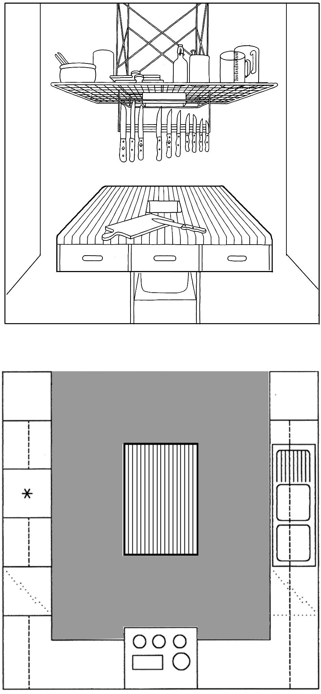
>
> *1.30. ábra – Középre helyezett feldolgozó felület (‘szigetes’ elrendezés)*
>
> A civilizációs ártalmak közül leginkább az allergia és az ételallergia terjed. (Jelenleg a hazai népesség több mint 25 %-a allergiás. A pollenallergiák hamar egyéb allergiákká is alakulnak, a gyermekek 6-8%-a ételallergiás, ez az arány felnőtt korra növekszik.) Ha ételallergiás személy van a családban, sokszor szükség lehet elválasztott konyhatechnológiára, akár külön hűtőszekrényre és edényre is. Ennek is van helyigénye, amit szintén figyelembe vehetünk. Egyre terjed a vegetáriánus, vegán, kóser stb. konyha, amit a tervezés során általában nem veszünk figyelembe, de akkor járunk el helyesen a jövendő – és az időben változó – használók érdekében, ha a különleges konyhatechnológiára megfelelő helyet biztosítunk, vagyis a konyhai egységek számát legalább egy elemmel „túlméretezzük”. Ez a későbbiekben lehetőséget ad a speciális igények befogadására. Az előbbiek alapján a szelektív hulladékgyűjtés, a családban előforduló allergiás vagy egyéb speciális étkezési szokású családtag igényeinek figyelembe vétele érdekében javasolt, hogy a korábban leírtakon kívül legalább egy további alsó és felső elemmel bővítsük a konyha méretét. (N. Á.)

**Követelmények és ajánlások**

**Alapkövetelmény:**

A lakásban olyan főzőhelyet kell kialakítani, ahol egy teljes ételsort tartalmazó főétkezés ételei elkészíthetők a lakást használó személyek + 2 vendég számára, ahol az edényeket el lehet mosogatni, megfelelő számú konyhaedényt és konyhaeszközt, evőedényt, evőeszközt tárolni lehet, és megfelelő méretű hűtőszekrényt lehet elhelyezni.

**Bútorok és berendezések:**

Elektromos vagy gázüzemű tűzhely sütővel vagy a tűzhelytől külön elhelyezett sütő, mosogató melegvízzel, előkészítő és feldolgozó, valamint lerakó munkafelület, amely beépített alacsony tároló szekrények felső síkján lehet, alsó és felső tárolók, magas tároló szekrény(ek). Mosogatógép, hűtőszekrény.

A hűtőszekrényen kívül az elemsor hossza ne legyen rövidebb 1-2 személyes lakásnál 2,30 m-nél, 3 férőhelyes vagy annál nagyobb lakásnál 2,70 m-nél. Nyomatékosan ajánlott 4-5 férőhelyes lakásnál legalább 3,60 m, annál nagyobb lakásnál legalább 4,20 m hosszú elemsor a hűtőszekrényen kívül.

A főzőhely lehet elkülönített térben vagy más lakótérrel (nappali szobával) egy légtérben. A konyhabútorok és berendezések előtti használati zóna nem szolgálhat közlekedésre az 1-2 férőhelyes kislakások kivételével (ezeknél megengedhető az un. főző-előtér). Ha a főzőhely más lakótérrel egy légtérben van, akkor a tűzhely fölé szagelszívó berendezést kell kialakítani. Ilyen esetben nem ajánlott gáztűzhelyt beépíteni. Az a nappali szoba, amellyel a konyha légtérben össze van kapcsolva, alvóhelyként nem vehető figyelembe az 1-2 személyes, egyszobás lakások kivételével.

### 1.3.6. Háztartási munkák

A lakásokban végzett háztartási munkák: mosás, szárítás, vasalás, ruhaneműk javítgatása, takarítás, tisztogatás. Átlagos méretű lakásoknál ezek a lakástevékenységek a lakás egyébként szükséges helyiségeiben elvégezhetők, nagyobb alapterületű, igényesebb lakásoknál célszerű ezek végzésére külön „háztartási helyiséget” kialakítani.

Mosásra ma már általánosan az automata mosógép szolgál. Ez elhelyezhető a fürdőszobában vagy a konyhában is (az automata mosógépek méretei a konyha-modulhoz illeszkednek). Olyan konyhába ne tervezzünk mosógépet, amely más lakótértől nincs akusztikailag leválasztva, mert a mosógép működése zajjal jár. A kimosott ruhaneműk szárítása történhet szárító állványon vagy a fürdőkád feletti fregolin. Ez utóbbi az igényesen felszerelt fürdőszobák esztétikai hatását meglehetősen lerontja. Energiaigényesebb és költségesebb, de feltétlenül kulturáltabb a szárítógép, amely a mosógép felett is elhelyezhető, vagy a mosást-szárítást egyaránt elvégző mosógép.

A vasalás lényegében bármelyik helyiségben elvégezhető az ott felállított vasaló állványon. Tágasabb konyha, étkező helyiség lehet a vasalás helye is. A ruhaneműk javítgatása történhet az étkezőasztalon vagy egyik szülő egyéni elfoglaltságait szolgáló munkafelületen.

A takarítóeszközök és takarítószerek tárolására feltétlenül gondolni kell a tervezés folyamán. Erre szolgálhat egy, legalább 60 x 60 cm méretű szekrény vagy beépített szekrény az előszobában, belső közlekedő helyiségben vagy a konyhában.

Tágasabb lakásoknál igen hasznos külön háztartási helyiség kialakítása. Ez lehet csak a mosás, szárítás helye, de lehetőség szerint itt legyen végezhető a vasalás, javítgatás és a takarítószerek, takarítóeszközök tárolása ([1.31 b. és c. ábra](#abra_1_31)). Ha a lakásnak egyedi, gázüzemű központi fűtése van (cirko), célszerű a fűtőberendezést is a háztartási helyiségben elhelyezni.

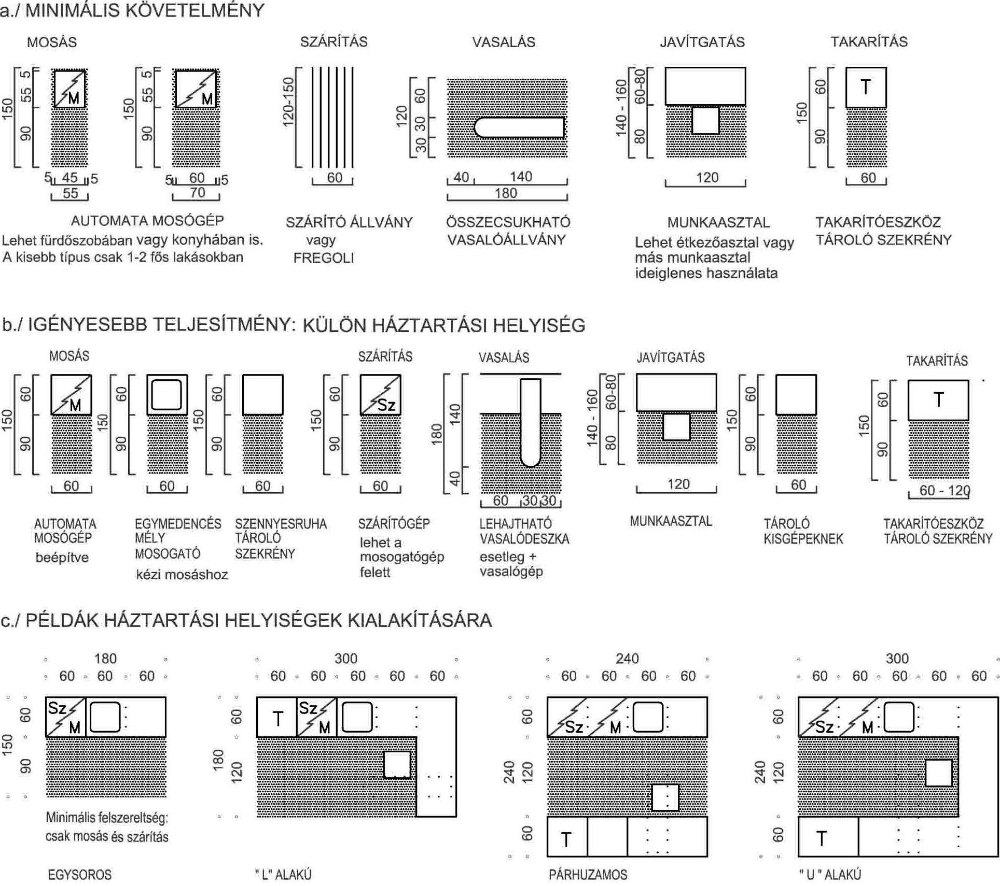

*1.31. ábra – Háztartási munkák bútorai és berendezései*

> **Megjegyzés**
>
> Az otthonnal kapcsolatos takarítás, karbantartási, javítási tevékenységek általában növelik az épület élettartamát, így a fenntarthatóságot is segítik. További pszichés előnyt jelenthet az is, hogy az ilyen jellegű tevékenység általában kreatív, alkotó időtöltés – talán még a legunalmasabb porszívózás is az bizonyos tekintetben – és az otthonhoz való pozitív élményeket, erősebb kapcsolódást biztosíthatják.
>
> Átlagos háztartások esetében a háztartási munkával töltött idő a háztartások gépesítettségének javulása ellenére sem csökken, természetesen a fizikai megterhelés kevesebb. (1986-2000 között a nők háztartásgazdasági munkával töltött ideje 5 %-kal csökkent – vélhetően a gépesítés eredményeképpen, ugyanakkor a férfiak erre fordított ideje 16 %-kal nőtt. Az átlagos nő ennek ellenére napi 249 percet, míg a férfi átlagosan 101 percet töltött háztartásgazdasági tevékenységgel, ideértve a bevásárlást, az otthon karbantartását és az életvitelhez szükséges egyéb teendőket.)
>
> A háztartási munka és annak eszközei helyigényesek, és az eszközök tárolására feltétlenül szükséges helyet biztosítani, míg a tevékenység maga általában nem egy helyhez kötött, ennek ellenére a kicentizett terekben nehezebben végezhető, mint a bizonyos területi tartalékkal is rendelkező lakásokban. (N. Á.)

**Követelmények és ajánlások**

**Alapkövetelmény:**

Biztosítani kell, hogy a lakásban a mosás, szárítás, vasalás, ruhaneműk javítgatása elvégezhető legyen, a takarítóeszközök és takarítószerek számára megfelelő tároló elem álljon rendelkezésre.

**Bútorok és berendezések:**

Minimális felszereltség: automata mosógép, szárítóállvány vagy fregoli, ha szárítógép nincsen. Összecsukható vasalóállvány, asztalfelület, takarítóeszköz-tároló szekrény.

Ha külön háztartási helyiség készül, abban legyen automata mosógép (szárítógép), kézi mosásra és tisztogatásra szolgáló mosogatómedence, szennyesruha-szekrény, javítgatásra, vasalásra szolgáló asztal és lehajtható vasalódeszka, takarítóeszköz-tároló szekrény.

### 1.3.7. Személyi higiénia

Az újonnan épülő lakásokból nem hiányozhat a lakáson belül elhelyezett vízöblítéses WC berendezés és a melegvízzel ellátott tisztálkodó helyiség (fürdőszoba vagy zuhanyfülke).

A személyi higiénia berendezései általában külön, e célra szolgáló helyiségben vannak (egészen ritka kivételektől eltekintve), ezért itt nemcsak magának a tevékenységnek a térszükségletéről, hanem helyiségekről, azok méreteiről is beszélünk.

A *mosdó* mértékadó méreteit az [1.32. ábra](#abra_1_32) mutatja. Ennél nagyobb mosdókat is gyártanak, de azok is általában elférnek a 90 cm széles használati zónában. Kaphatók és felszerelhetők két medencés, dupla mosdók: ezeket két személy legfeljebb kézmosásra használhatja egyidejűleg. Ha a tisztálkodó helyiségben egyszerre két személy egyidejű mosdó-használatára kell számítani, akkor két darab, egymástól 90 cm tengelytávval elhelyezett mosdót kell felszerelni. Igényesebb fürdőszobákban a mosdók lehetnek tároló szekrényekkel is összeépítve ([1.32. ábra](#abra_1_32)).

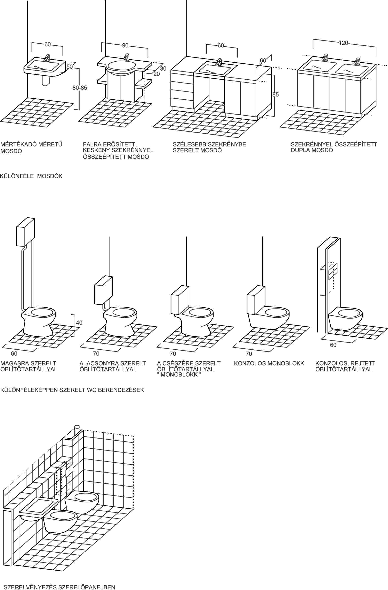

*1.32. ábra – Különféle mosdók*

Kisebb méretű *kézmosó* a fürdőszobai mosdót nem helyettesítheti, az a WC helyiségben, csak kézmosásra szolgálhat.

*A zuhanytál* kényelmes, ajánlott mérete 90 x 90 cm. Az ennél kisebb (egyik méretükben 80 vagy 75 cm széles) zuhanytálak főképp akkor használatosak, ha a fürdőkád mellé, kiegészítő elemként helyezik el őket.

*A fürdőkádak* szokásos méreteit az [1.35. ábra](#abra_1_35) mutatja. Vannak ezeknél lényegesen nagyobb, luxus-színvonalú két- vagy többszemélyes kádak, pezsgőfürdők, süllyeszthető medencék, amelyek már nemcsak tisztálkodásra, hanem kikapcsolódásra, regenerálódásra is szolgálnak. Az ilyen színvonalú fürdőszobák mindig egyedi igényekre készülnek tehetős megrendelők számára, berendezéseiket esetileg kell gyártmánykatalógusokból kiválasztani.

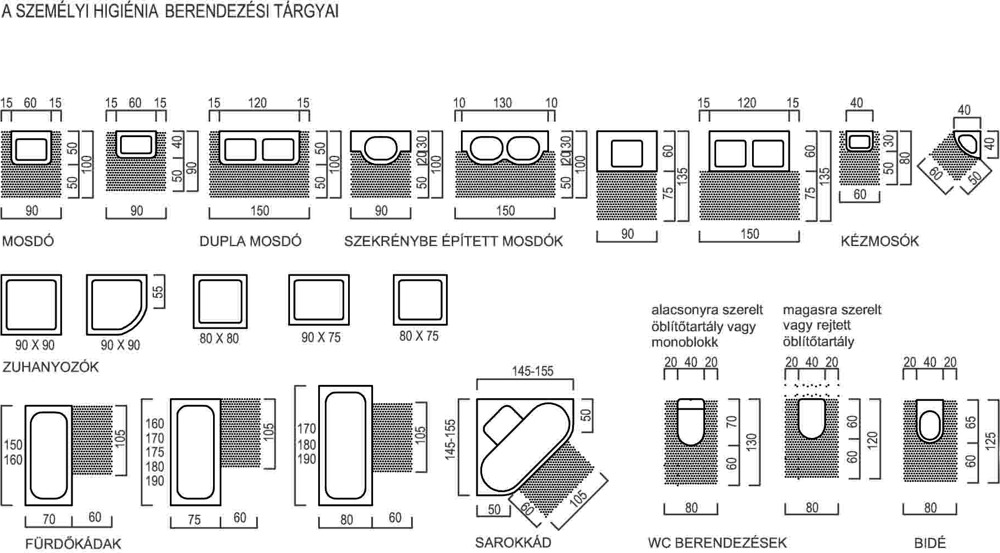

*1.35. ábra – A személyi higiénia berendezési tárgyai*

A *WC berendezések* helyszükséglete a szerelvényezés módjától is függ. A legkisebb helyigényű, magasra helyezett öblítőtartályos elrendezést manapság már ritkán alkalmaznak, általános az alacsonyra vagy magára a csészére szerelt öblítőtartály. A WC csészék lehetnek alsó vagy hátsó kiömlésűek. Az alsó kiömlésű típusok többnyire csak családi házaknál szokásosak, ahol a szennyvízvezeték a pince mennyezetsíkja alatt fut. A hátsó kiömlésű berendezések közül részesítsük előnyben a falra konzolosan szerelhető típusokat, mert ezek sokkal higiénikusabbak a többinél: az alattuk lévő padlófelület könnyen tisztítható ([1.33. ábra](#abra_1_32)).

A WC öblítőtartálya rejtett módon is beépíthető. Főképpen akkor szokásos az ilyen szerelvényezés, ha a gépészeti vezetékeket nem a falba vésik, hanem utólag burkolható, acélvázas szerelőpanelbe szerelik. Ez a panel lehet alacsonyabb is, felső síkja lerakó-felületként jól hasznosítható ([1.34. ábra](#abra_1_32)). Külső falba vízvezetéket bevésni nem szabad (fagyveszély), ezért a szerelvénypanel alkalmazása célszerű akkor is, ha a fürdőszobai berendezések valamilyen okból a külső fal mentén helyezkednek el.

A *bidé* (altestmosó) nem kötelező fürdőszobai tartozék, és nem is mindenki kedveli. Ha készül, akkor kerüljön közvetlenül a WC berendezés mellé. Ennél is a konzolosan szerelt típust részesítsük előnyben. Kapható olyan berendezés is, amely a WC és a bidé funkcióját egyesíti.

Az [1.36. ábrasoron](#abra_1_36) különféle egészségügyi helyiségek méretezésére láthatók példák. Külön WC helyiséget kézmosó nélkül akkor se tervezzünk, ha az a fürdőszoba közvetlen közelében van (a WC-használat utáni kézmosás értelmét veszti, ha két kilincset is meg kell fogni előzőleg...). Bár lakásoknál nem kötelező előírás, *nyomatékosan ajánlott* a WC helyiségek ajtóit *kifelé* nyitni. Idős korban vagy bizonyos betegségek esetén előfordul a WC használata közbeni rosszullét: a befelé nyíló ajtó kinyitását a magatehetetlenül fekvő személy akadályozza, sőt az erőszakosan kinyitott ajtó akár sérüléseket is okozhat neki. Hasonló ok miatt ajánlott a fürdőszobák ajtóit is kifelé nyitni. Ha a befelé nyíló ajtó valamilyen okból elkerülhetetlen, akkor a méretezésnél ne feledkezzünk meg az ajtó használati zónáját kiegészítő 20 cm-es sávról ([1.14. ábra](#abra_1_14)).

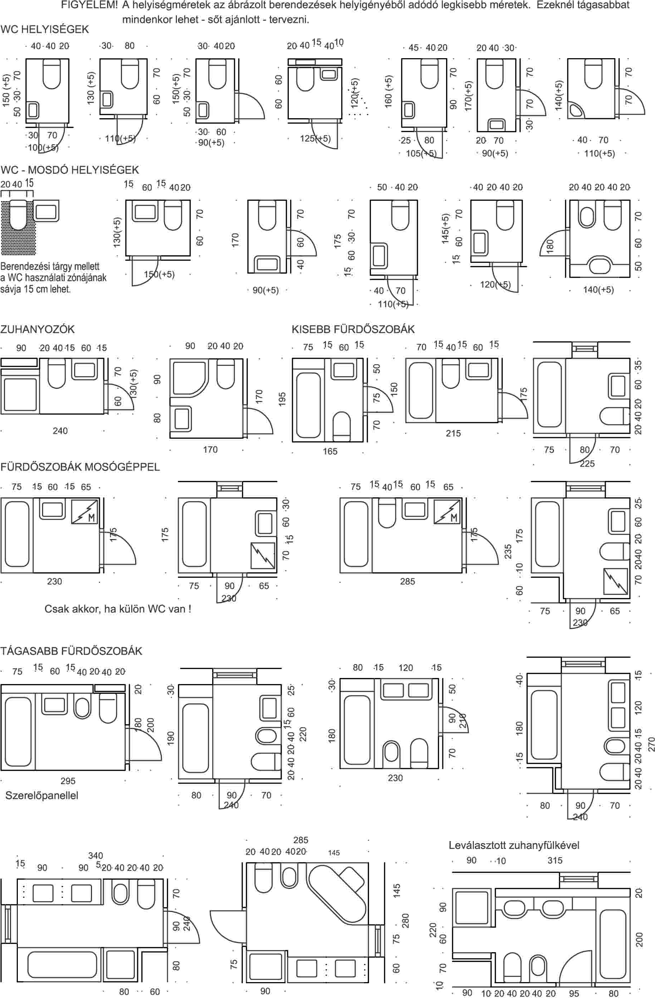

*1.36. ábra – Példák egészségügyi helyiségek kialakítására és méretezésére*

A WC helyiségben rendes méretű mosdót (nemcsak kézmosót) ajánlatos elhelyezni, ha azon a szinten nincs fürdőszoba (kétszintes lakásoknál), vagy igényesebb lakások vendég-vécéiben, ahol a vendégségbe jött hölgyek sminkelhetnek, fésülködhetnek a piperepolccal, tükörrel ellátott mosdó előtt. A méretezési példák tartalmaznak olyan elrendezéseket is, ahol a fürdőszobában mosógép van, mivel átlagos lakások esetén ez általános igény. Nagy lakások színvonalasan kialakított fürdőszobáiba lehetőleg ne kerüljön mosógép: jobb, ha annak külön háztartási helyiséget alakítunk ki.

**Követelmények és ajánlások**

**Alapkövetelmény:**

Biztosítani kell, hogy a lakás valamennyi lakója – a tolerálható egyidejűség figyelembe vételével – WC berendezést használhasson, meleg vízben mosakodhasson, fürödhessen.

**A használói létszámtó függő egészségügyi felszereltség alsó határértékei:**

1-2 férőhelyes lakásban zuhanyfülke mosdóval és WC-vel

3 (4) férőhelyes, legfeljebb kétszobás lakásban fürdőszoba káddal, mosdóval és WC-vel

4-5 férőhelyes (kétszobásnál nagyobb) lakásban fürdőszoba mosdóval, külön WC kézmosóval

6 vagy annál több férőhelyes lakásban fürdőszoba WC-vel + külön WC kézmosóval.

Akkor, ha a lakásban WC berendezéssel ellátott második fürdőszoba vagy zuhanyfülke van, akkor az helyettesítheti a külön WC-t. Amennyiben a lakás helyiségei két szinten helyezkednek el, szintenként legyen legalább egy WC berendezés (külön helyiségben vagy fürdőszobában). Szinteltolásos lakásoknál a WC legfeljebb fél-szint magassági különbséggel legyen elérhető. Fürdőszoba nem szolgálhat más helyiség kizárólagos megközelítésére. A fürdőszoba hálószobán keresztül csak akkor közelíthető meg, ha az kizárólag a hálószobát használókat szolgálja, és azon kívül van még egy, más háztartás-tagok által használható fürdőszoba is.

### 1.3.8. Tárolás

A közös időtöltés, az egyéni tevékenységek, a háztartási munkák tároló bútorainak helyigényét a korábbi fejezetekben tárgyaltuk.

A *ruhaneműk tárolása* történhet mobil szekrényben, beépített szekrényben és járható szekrényben ([1.38. ábra](#abra_1_38)). A napi használatú nagykabátok, még tisztítatlan cipők és a vendégek kabátjainak tárolását közvetlenül a bejárat mellett kialakított előszoba-falon vagy ott elhelyezett szekrényben kell biztosítani. A használók ruhatárának legalább egyik, a mindennapi használatra való részét az alvóhely terében, vagy annak közvetlen közelében lévő közlekedőben (gardróbban) kell elhelyezni.

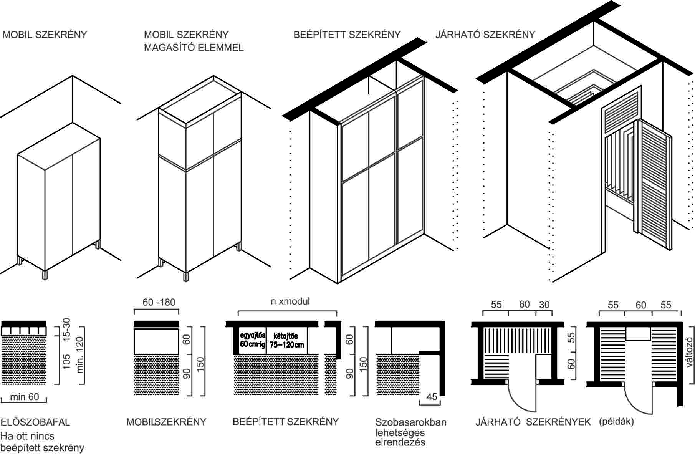

*1.38. ábra – Különböző férőhelyszámú lakások higiéniai felszereltségének fokozatai*

Az *élelmiszertárolás* jelentősége városi lakásokban csökken, mert a kereskedelemben minden élelmiszer könnyen és gyorsan hozzáférhető. Tapasztalható azonban ellenkező előjelű fejlődés is, főleg a nagyvárosok lazább beépítésű zöldövezeteinek és a szuburbánus térségeinek lakásainál, melyek lakói igen gyakran egyszerre vásárolnak egész hétre való élelmiszert és azt autóval szállítják haza. A füstöltáruk, befőttek, nagyobb mennyiségű zöldségfélék tárolására szolgáló hagyományos, nagyméretű éléskamrák igénye inkább csak vidéki településekre jellemző. Sok más országgal szemben, ahol az élelmiszereket a konyhában tárolják, magyar lakáshasználati szokások általában igénylik a lakásokban a „spájz” meglétét.

Az élelmiszer tárolható (a konyhafelszereléseknél már tárgyalt hűtőszekrényen kívül) élelmiszerszekrényben, kamraszekrényben vagy éléskamrában ([1.39. ábra](#abra_1_39)). Az *élelmiszerszekrény* a konyha terébe szellőzik, ezért abban romlékony nyersanyagot (zöldségeket, gyümölcsöt stb.) tárolni nem lehet, csak szárazáruk, konzervek, palackos italok stb. tárolására való.

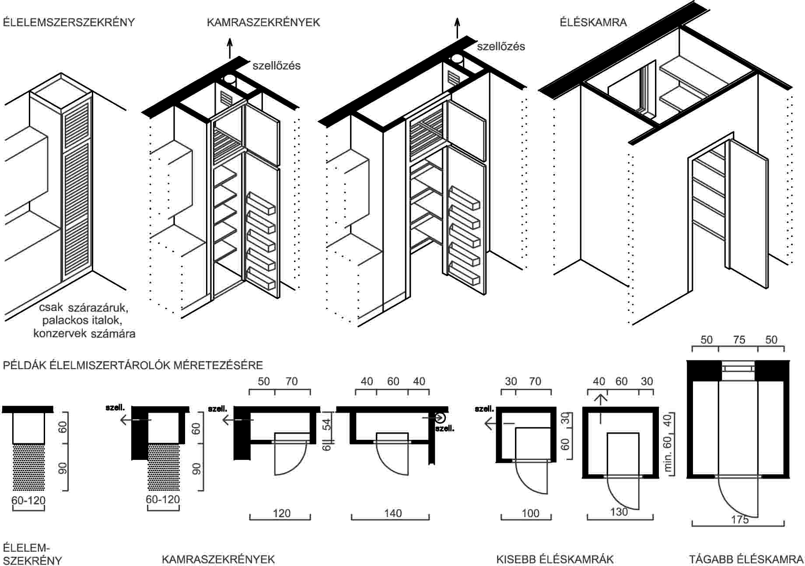

*1.39. ábra – Élelmiszer tárolása*

A *kamraszekrény* a konyha terétől független szellőzést igényel, lényegében kisméretű éléskamrának is tekinthető. Mivel a benne lévő polcsor teljes alapterületét kitölti, a jól kialakított kamraszekrény tároló kapacitása akár nagyobb is lehet, mint egy rosszul polcozható, kisméretű éléskamráé.

Az *éléskamrák* mérete legyen kellően széles, legalább két, de kívánatosan 3 falon polcozható. Ajtajuk mindig *kifelé* nyíljék, mert egy, a polcról leesett vagy eldőlt tárgy az ajtó nyitását megakadályozhatja. A nagyobb méretű éléskamra szellőzése történjék ablakon keresztül, hogy hűvös maradhasson akkor is, ha oda meleget termelő fagyasztóláda kerül.

*Egyéb tárgyak tárolása* (sporteszközök, nagyobb méretű játékok, éppen használaton kívüli gyerek-járóka, szerszámok stb.) tárolása történhet a lakáson kívül is, de a lakás elérhető közelségében (családi házaknál a pincében vagy padláson, esetleg a melléképületek között lévő tároló helyiségben, többlakásos házaknál külön pincei tárolókban). A szorosan értelmezett lakástereken kívül elhelyezett tároló létesítése lényegesen olcsóbb lehet, mint ha az a lakással azonos költséggel kialakított helyiségben történne. Kertes lakásoknál biztosítani kell a kerti szerszámok és kerti bútorok tárolását.

**Követelmények és ajánlások**

**Alapkövetelmény:**

A lakáson belül megfelelő nagyságú tárolókban (helyiségben, bútorzatban) kell biztosítani a ruhaneműk, élelmiszerek tárolását, a lakás könnyen elérhető közelségében egyéb használati tárgyak tárolását.

*Ruhaneműk tárolására* szekrényt, beépített szekrényt vagy járható szekrényt kell kialakítani. A szekrények mélységi mérete legyen legalább 60 cm.

Egy használóra – a lakás férőhelyszámát figyelembe véve – legalább 1 - 1,2 folyóméter szekrényhosszt kell számítani, mint alsó határértéket. Ebből 0,6 folyóméternyi szekrény legyen a használó alvóterében vagy annak közvetlen közelében lévő közlekedőtérben. A lakás bejáratának közvetlen közelében előszobafalat vagy beépített szekrényt kell elhelyezni a felső kabátok, sapkák, vizes cipők, táskák stb. elhelyezésére.

**Élelmiszertárolásra - a hűtőszekrényen kívül - biztosítani kell**

– 1-2 férőhelyes lakásban legalább 60 x 60 cm méretű, mennyezetig érő élelmiszerszekrényt,

– 3 férőhelyes lakásban legalább 60 x 60 cm méretű szellőztetett kamraszekrényt,

– 4 férőhelyes vagy annál nagyobb lakásban legalább 1,20 m polchosszal rendelkező kamrát vagy szellőztetett kamraszekrényt.

Nyomatékosan ajánlott az élelmiszertárolás helyigényének meghatározásánál a lakás konkrét településszerkezeti helyzetének figyelembe vétele, és a tárolókapacitás növelése, ha a kereskedelmi ellátottság színvonala, vagy az életmóddal összefüggő igények azt indokolják.

*Különféle tárgyak eszközök* tárolására *erősen ajánlott* lakásonként legalább 4 m2 alapterületű, elzárható tároló helyiséget biztosítani a lakóépületben vagy annak telkén álló melléképületben. Ez lehet a lakás terein kívül is.

### 1.3.9. Gyermekápolás, gyermeknevelés

A családok által használható lakások elemi rendeltetése a gyermekápolás és gyermeknevelés. A 3 férőhelyes, vagy annál nagyobb lakásoknál gyermekkorú használóra is gondolni kell. Konkrét családtól kapott tervezési megbízás esetén is – ahol már nincs gyermekkorú családtag – figyelembe kell venni, hogy a lakás idővel gazdát cserélhet, és a lakás értékét (kelendőségét) nagyban csökkenti, ha gyermeknevelésre nem alkalmas.

Korábbiakban, az egyes lakástevékenységek bútorainak térszükséglet-elemzésénél nem tértünk ki a gyermekbútorok helyigényére. Ennek egyszerű oka az, hogy a gyermek térszükséglete növekedésével párhuzamosan folyamatosan változik, és a helyiségméretek rögzítésénél mindig a nagyobb, már kamaszkorú – felnőtt méretű – gyermek igényei a mérvadóak.

A csecsemő és kisded korú gyermek igényli a szülőjével való állandó kapcsolatot és felügyeletet még annak más elfoglaltsága esetén is: ezért szükséges a csecsemőkorú gyermek ágyának helyet biztosítani a szülői hálószobában, és a konyhát (főzőhelyet) úgy elhelyezni vagy kialakítani, hogy onnan a gyermek járókája vagy játszóhelye látható, felügyelhető legyen. A szülő jelenlétének érzete magának a gyermeknek is igénye: ezért jó, ha a szülői háló és a kisded korú gyermek hálószobája legalább hallótávolságon belül van (kerülni kell pl. az olyan elrendezéseket, ahol a szülői háló és a kisgyermek hálója a lakás távol eső sarkaiban vagy akár eltérő szinten van).

A közlekedő sávok, ajtók használati zónájának kijelölésekor gondoljunk a karon ülő gyermekkel együtt történő mozgásra. A lakáson belüli mozgás szempontból a mozgásukban korlátozott öreg használók és a járni tanuló vagy épp totyogó kisgyermek igényei gyakran egybeesnek (lásd 1.7. fejezet).

A korábban elemzett lakástevékenységek tér- és eszközigényénél mindig gondolni kell a csecsemő vagy kicsi gyermek szempontjaira. Például, a fürdőszoba kialakításánál előnyben kell részesíteni a fürdőkádat a zuhanyozóval szemben, mert a csecsemő kiskádban való fürösztése zuhanyfülkében nem lehetséges.

Rendkívül fontos a kisgyermek lakáson belüli biztonsága. A gyermekbalesetek sokszor történnek a konyhában (ezek forrásaira és azok kiiktatására az 1.3.5. fejezetben utaltunk). A baleset-elhárításra szolgáló szerkezetek, pl. védőkorlátok kialakítása során gondolni kell a gyermek szempontjaira: annak kisebb testméretére – a védőrács nyílásméreteinél – és arra is, hogy a kisgyermek veszélyérzete még fejletlen. Ezért nem szabad a védőkorlátokon olyan rácsozatot készíteni, amelyen a gyermek felmászhat (lásd későbbi fejezetben).

## 1.4 Lakásterek, helyiségek

Hangsúlyozzuk, hogy az alább elemzett helyiségméretek a bennük *feltételezett* lakásfunkciók bútorainak és berendezéseinek elhelyezéséhez szükséges méreteiből adódnak. Korántsem biztos, hogy csak ezek a funkciók lesznek jelen a valóságos használatban, sőt azok időben is változhatnak a lakás élettartama során. Ezért a jelölt helyiségméreteket csak alsó határértékként kell figyelembe venni, legalább 5 – 10 %-os növelésük javasolható a tervezés folyamán.

A lakások egyes tereinek kialakítása, méretezése az ott folyó lakástevékenységek térigényétől (is) függ az előző fejezetben részletezett elemzés szerint, de más építészeti, téralakítási szempontok is befolyásolják azt. A lakásterek tércsoportot alkotnak, amelyek elemei általában *helyiségek*, amelyek a többi tértől el vannak választva.

**A tér elválasztása szolgálhat:**

- – légtér elkülönítésére (légzáró falakkal vagy üvegfelületekkel, légtömör ajtóval)
- – vizuális elkülönítésre (át nem látszó felületekkel)
- – akusztikus elkülönítésre (megfelelő hanggátlású fallal, ajtóval)
- – építészeti értelmű elkülönítésre (amikor a tér a mellette lévő térrel egy légteret képez, vizuálisan és akusztikusan nincs leválasztva, de önálló térhatással rendelkezik).

A lakásoknál előírt hanggátlású fallal és tömör ajtólappal leválasztott tér esetében minden változat érvényesül. Ilyen leválasztás azonban csak az alvásra, pihenésre valamint a személyi higiéniára szolgáló tereknél követelmény, a lakóterek kapcsolatai ennél lényegesen árnyaltabbak (példák az [1.51. ábrán](#abra_1_51) láthatók). A továbbiakban – itt és most – „helyiségnek” az építészeti értelemben leválasztott tereket nevezzük, és mindig utalunk arra, ha a leválasztás légtérben, vizuálisan vagy akusztikailag is követelmény.

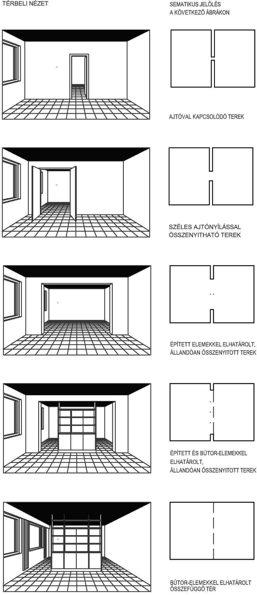

*1.51. ábra – Lakásterek kapcsolatai*

*Közlekedő helyiségek* a lakás azon terei, amelyek fő rendeltetése a lakáson belüli mozgás. Gyakori – és javasolt – a közlekedő tereknek tárolási funkcióval (ruhatárolással) történő kiegészítése. A lakásoknál leggyakrabban alkalmazott közlekedő tér a bejárathoz kapcsolódó előszoba és a belső közlekedő folyosó, amelynek ruhásszekrényekkel kiegészített változatát „gardróbnak” nevezzük. Az előszoba szabad (bútorokon kívüli) szélessége 1.20 m-nél, a belső közlekedő szélessége (bútorokon kívül) 1 m-nél ne legyen kevesebb, ha arról oldalirányban is szobák nyílnak.

> **Megjegyzés**
>
> Az előszoba méretének meghatározásakor ügyeljünk arra, hogy ebben a helyiségben a közlekedés és ruha tárolása mellett legyen elegendő hely a benyíló bejárati ajtó nyitására, az öltözködésre, cipőcserére is. Bizonyos élethelyzetekben más és más igények kerülnek előtérbe. Gyermekek öltöztetéséhez, illetve idősebbek számára előnyös ha egy szék elhelyezhető az előszoba terében anélkül, hogy az a közlekedést zavarná. Az előtérben célszerű egy kb. 0,90 x 1,20 m-es méretű tárolásra alkalmas területet is biztosítani, amely kisgyermekes család esetében a babakocsi tárolására, idősebb családtag vagy kerekesszékes személy esetén a segédeszköz tárolására nyújt lehetőséget. Ez a tároló lehet az előtérből nyíló önálló gardrób helyiség is, de ez legyen követlen kapcsolatban az előtérrel, hogy a saras, vizes kerekű babakocsival, kerekes járókerettel, bevásárló kocsival ne kelljen a lakás több helyiségén keresztülmenni. (Többlakásos lakóépületek esetében a kerekesszék, babakocsi, esetleg bicikli tárolására egy közös tároló is szolgálhat az épület bejáratához közel.)
>
> A nagyobb méretű előszoba kialakítása vendégek érkezésekor, vagy egy nagyobb család reggeli készülődésekor is előnyös. (P. A.)

*A nappali szoba* rendeltetése a lakás kialakításától, nagyságától függően változó. Az [1.40. ábrasor](#abra_1_40) különböző nagyságú és kialakítású nappali szobákat mutat be, aszerint, hogy azok milyen rendeltetési követelmények betöltésére szolgálnak. A „közös időtöltés, vendégek fogadása” általános funkció. Ez kiegészülhet egy használó „egyéni tevékenysége” többcélú bútorzónájának helyigényével: ezt mindenképp ajánlatos figyelembe venni, hogy a szoba némi tartalékterülettel rendelkezzék az alapfunkció bútorainak helyigényén kívül. A nappali szoba lehet az étkezés helye, ekkor a konyha az étkező megfelelő közelségében legyen (kivétel, ha a konyhában is van étkezőhely, és a nappali étkező bútorcsoportja csak alkalmanként kerül használatba).

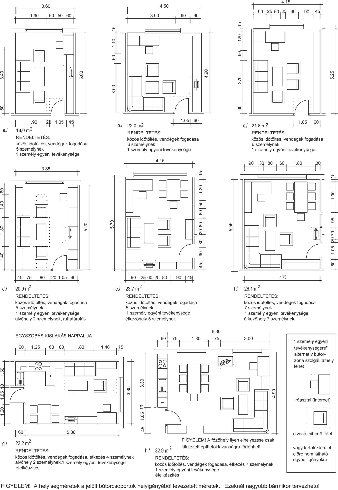

*1.40. ábra – Példák nappali szobákra*

A nappali lehet alvóhely is, elsősorban egyszobás kislakásoknál. Egy-két férőhelyes lakás esetén az akusztikai elkülönítés nem szükséges (illetve csak akkor, ha a tervezési program arról rendelkezik), mert az alvás és más lakástevékenységek egyidejűsége kizárható, illetve tolerálható. Amikor a nappalit két férőhelyesnél nagyobb lakásban is kényszerűen alvóhelynek szánják, akkor az csak a közös időtöltésre, vendégek fogadására és az ott alvók egyéni tevékenységére szolgálhat, más funkcióktól történő vizuális és akusztikai leválasztása követelmény (ide értve az ételkészítés és étkezés helyét is).

Újabban elterjedt a nappali szobában kialakított a főzőhely, de ez még nem tekinthető általános lakáshasználati szokásnak. Csak akkor tervezzünk főzőhellyel együtt kialakított nappalit, ha arra kifejezett építtetői igény merül fel. A konyha külön helyiségként való leválasztása az adott lakás-alapterület (lakásköltség) mellett kisebb nappalit eredményez: az építtető (használó) választása lehet a tágasabb lakótér az elkülönített konyha feladása árán.

*Étkezőhelyiség* kialakítása az étkezőhely igényesebb alternatívája lehet, de szolgálhat „másodlagos nappaliként” is olyankor, ha a nappaliba fekhely kerül, vagy a lakók az igényesebb bútorzattal berendezett nappali szobát meg akarják kímélni. Az étkező közvetlenül kapcsolódjék a konyhához és lehetőleg a nappali szobához is. Az [1.41. ábrasor](#abra_1_41) különböző nagyságú étkezőket mutat. A szükséges alapterület egyrészt az étkező garnitúra férőhelyszámától, másrészt a tálalás módjától függ. Leginkább helytakarékos az asztalvég felől történő tálalás ([1.41.a. ábra](#abra_1_41)), majd az egyoldali tálalósáv, és a legnagyobb területet a körülvezető tálalósáv kívánja, amely a nagy étkezési létszámra alakított, igényes étkező helyiségeknél szokásos. Az étkező garnitúrán kívül az étkező helyiségben kaphatnak helyet az asztali textíliák, tálaló eszközök, ünnepi alkalmakkor használt értékes üvegneműk és porcelánok tárolására szolgáló szekrény, vitrin. Az étkezőt vizuálisan és akusztikailag a lakás egyéb tereitől leválasztani nem szükséges.

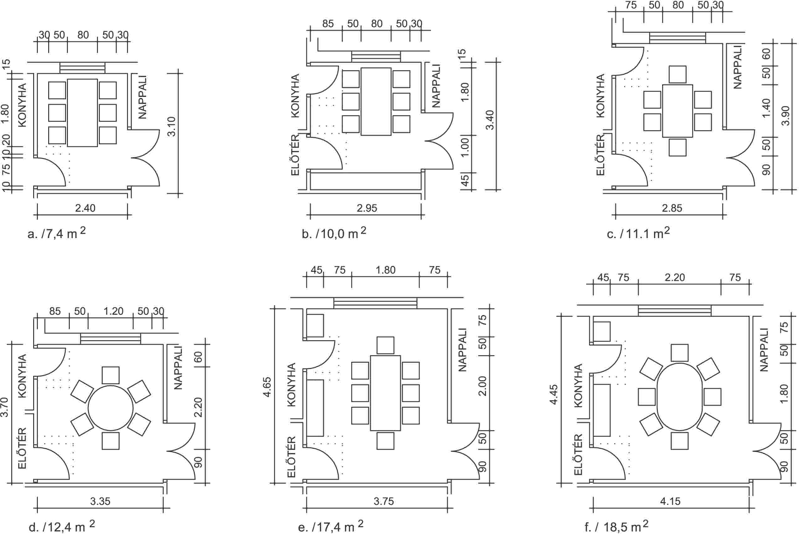

*1.41. ábra – Példák étkezőkre*

> **Megjegyzés**
>
> A körbeülhető étkezőasztal mindenki számára előnyös, de különösen a hallássérültek számára. Így nemcsak egymás mellett, hanem derékszöget bezárva, valamint egymással szemben is le lehet ülni, s ezzel biztosíthatjuk a jó kommunikáció és a szájról olvasás lehetőségét. Javasolt az étkezőasztalt az ablakra merőlegesen úgy elhelyezni, hogy az ülőhelyeket elfoglalva a személyek arca ne legyen árnyékban, és ezzel biztosítható a szájról olvasás, a mimika érzékelésének lehetősége, a kényelmesebb kommunikáció. (P. A.)

*Az étkezős konyhák* helytakarékosabbak, mint a főzőkonyha + étkező együttesen. Előnyük, hogy az étkező asztal az étkezés idején kívül az ételkészítés technológiai felülete is lehet. Bizonyos életvitel mellett (pl. háziállatokat is nevelő falusi háztartásoknál) a konyhában lévő feldolgozó asztal nélkülözhetetlen. Természetesen, étkezős konyhák kialakíthatók városi lakásoknál is. Igényes, nagyméretű lakásoknál – ahol tágas étkezőhelyiség van – általánosan felmerülő igény, hogy a konyhában a főétkezés helyén kívül még egy kisebb étkező, reggeliző hely legyen (ez takarékosabban is méretezhető: lásd [1.22.b. ábra](#abra_1_22)). Különböző étkezős konyhákat mutat az [1.42. ábrasor](#abra_1_42).

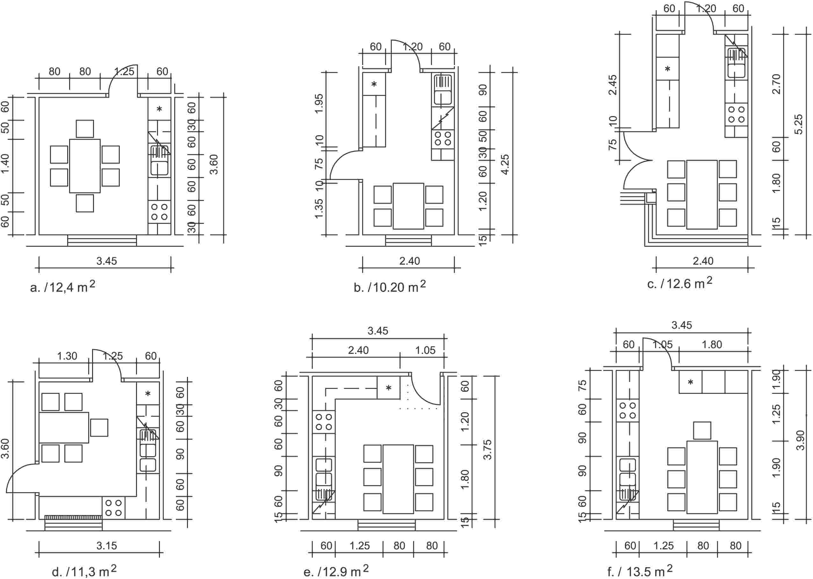

*1.42. ábra – Példák étkezős konyhákra*

A *főzőkonyhák* berendezéseinek elrendezése magának a helyiségnek a kialakítását is meghatározza. Ezeket részletesen tárgyaltuk az 1.3.5. fejezetben és az [1.28. ábrán](#abra_1_28).

*Az egészségügyi helyiségek* kialakítását részletesen tárgyalta az 1.3.7 fejezet, az [1.36. ábrasor](#abra_1_36) példákat mutat be. Az egészségügyi helyiségek vizuális és akusztikai zárása általában szükséges (ritka kivétel lehet, pl. a szülői hálóból nyíló, csak a szülők által használt fürdőszoba esetén).

*A hálószobák* fő rendeltetése az alvás, de általában ez a helyszíne a hálószobát használók egyéni tevékenységének, szellemi munkájának is. A hálószobákat mind vizuálisan, mind akusztikailag a lakás egyéb tereitől le kell választani. Különféle hálószoba elrendezéseket mutat be az [1.43. ábrasor](#abra_1_43). (A helyiségméretek kótái mindig az adott bútorelrendezéshez szükséges legkisebb méretet jelzik: ezeknél nagyobb mindig tervezhető!)

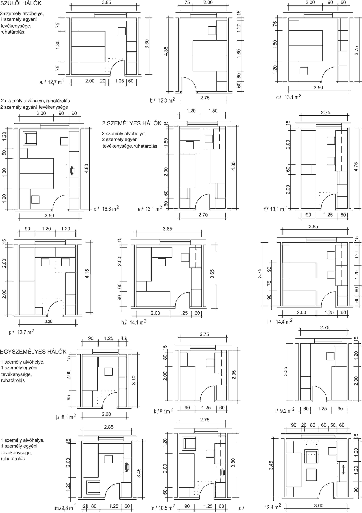

*1.43. ábra – Példák hálószobákra*

Az egyszemélyes háló legalább 8 m2 alapterületű legyen. A felnőtt korú együtt élő (főiskolás gyerek, nagyszülő) inkább saját nappaliként használja a szobáját, ott akár vendégeket is fogad, az ilyen egyszemélyes „hálószoba” szükséges alapterülete eléri vagy meghaladja a kétszemélyes hálószobák méretét is.

Általában, a hálószobák tervezésénél számolni kell azok változatos használatával. Többlakásos házak azonos kialakítású lakástípusaiba különböző összetételű családok költöznek be, és az a szoba, amely egyik családnál „gyermekszobaként” funkcionál, egy másik családnál felnőtt együtt élő szobája lesz, a harmadiknál pedig éppenséggel dolgozószoba lehet. Egy konkrét család számára tervezett családi háznál is fellép hasonló funkcióváltás a család életciklusa során. Lehetséges, hogy a nagymama szobája egy idő után megüresedik és oda az időközben felnőtt korba lépő gyerek költözik be, vagy a legnagyobb gyerek elköltözik otthonról és a korábbi kétszemélyes háló egyszemélyessé válik stb. Mindezek miatt ajánlatos az egyes hálószobák bútorozhatóságát többféle igénybevételre is ellenőrizni. Az [1.44. ábra](#abra_1_44) egy hálószoba többféle bútorozási elrendezését mutatja be.

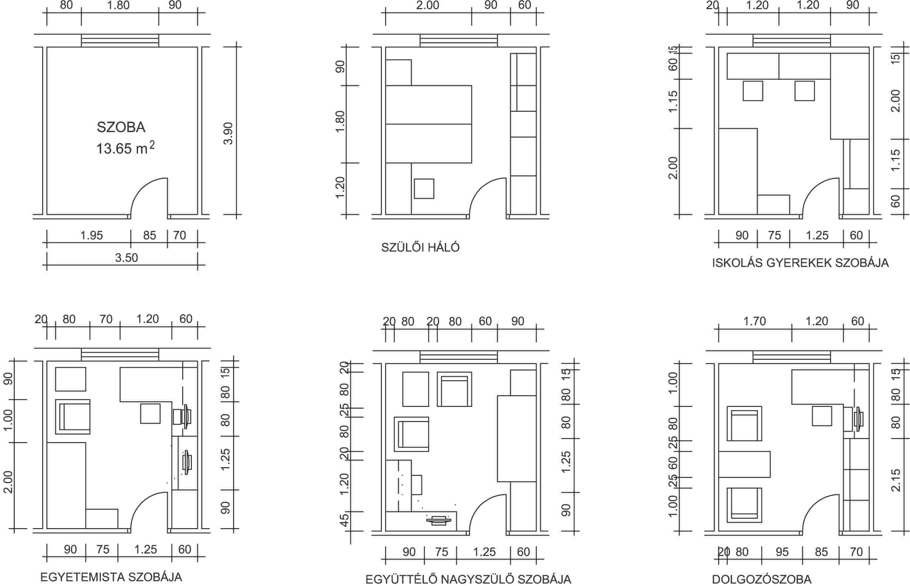

*1.44. ábra – Példa többféleképpen használható szobára*

A felsorolt, konvencionális helyiségeken kívül lehetőség van a lakásterek változatos kialakítására, olyanokra is, amikor „helyiségnek” nehezen nevezhető tér-részről beszélünk (pl. galéria; üldögélésre, társalgásra alkalmas közlekedőtér-bővület; egymásba átáramló, határozottan le nem választott terek stb.). Az ezekre vonatkozó használati és komfortkövetelményeket arra a lakástevékenységre kell értelmezni, amely az adott térben vagy tér-részben folyik. A konkrét tervezési program igényelhet másféle, az általánostól eltérő rendeltetésű helyiségeket vagy tereket is (pl. testépítő szoba, szauna, házi uszoda, hobbi-szoba, barkácsműhely, műterem stb.) Ezek kialakítását, méretezését mindig esetileg, az építtetővel egyeztetve kell a tervezési programban rögzíteni.

## 1.5. Lakásterek komfortkövetelményei

### 1.5.1. Megvilágítás

Minden lakástér (helyiség) rendeltetésszerű használatához szükséges megvilágításáról gondoskodni kell. A megvilágítás lehet természetes megvilágítás és mesterséges megvilágítás.

*A természetes megvilágítás* lehet közvetlen vagy közvetett. A közvetlen megvilágítás a belső teret a külső tértől elválasztó bevilágító felületen (ablakon) keresztül történik, a közvetett természetes megvilágítású helyiség egy – fényáteresztő felülettel elválasztott, vagy szabad nyílással összenyitott – másik térből kap természetes fényt ([1.45. ábra](#abra_1_45)).

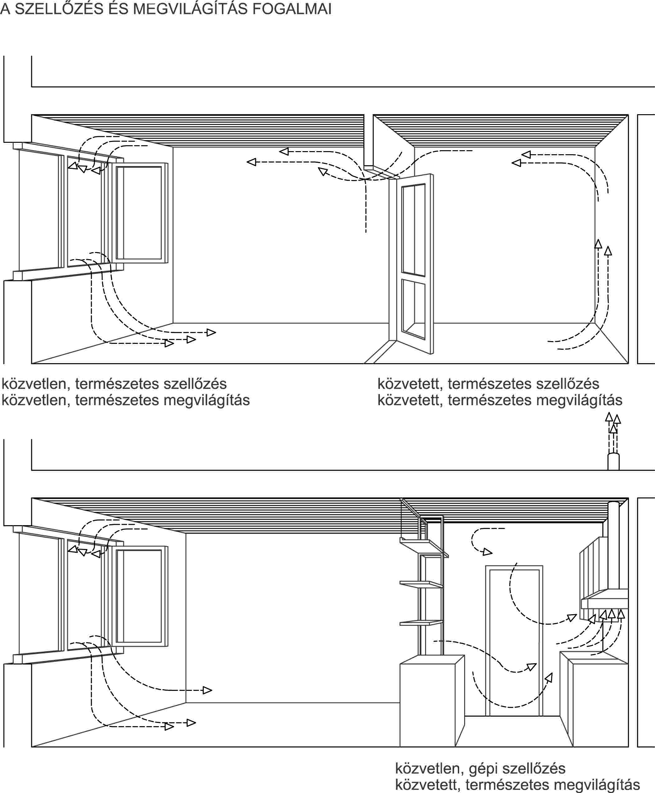

*1.45. ábra – A szellőzés és megvilágítás fogalmai*

Természetes megvilágítás esetén a belső tér megvilágításának erőssége a külső fényviszonyoktól, a bevilágító felület nagyságától és a helyiség belső felületeinek fényvisszaverő hatásától függ.

A szabályzat (OTÉK) a helyiségek bevilágító felületének és hasznos alapterületének viszonyszámát írja elő, amely „...huzamos tartózkodásra szolgáló helyiségben legalább 1:8-ad legyen, vagy megfelelő megvilágítási körülmények mellett, indokolt esetben 1:10-ed lehet, továbbá... felülről történő bevilágítás esetén legalább 1:10-ed legyen.”

A bevilágító felület számításánál mindig az *effektív üvegfelületet* kell figyelembe venni (az ablaktokok, osztások nélkül) ami számottevő mértékben kisebb, mint az ablaknyílások névleges mérete.

> **Megjegyzés**
>
> Osztás nélküli ablakoknál jó közelítéssel vehetjük a tiszta üvegfelület méretét minden irányban 13 cm-rel kevesebbnek, mint a névleges méret. Ez a becslés csak vázlattervi stádiumban elfogadható: a konkrét terveknél azt az üvegfelületet kell figyelembe venni, amelyet a gyártmánykatalógusok a különböző ablakokhoz megadnak, vagy az ablaktok és ablakszárny profiljának ismeretében pontosan számítható.

Az előírás betartása önmagában nem garantálja azt, hogy a természetes megvilágítás mértéke ne legyen a kelleténél kisebb, vagy – esetleg – a szükségesnél nagyobb. Nem biztos, hogy az ablak 1:8 aránya elegendő, ha a helyiség egy szűk utcára vagy udvarra néz, és a szemközti házfal a sugárzó égbolt nagy felületét kitakarja. Vagy fordítva: ha egy dombtetőre épült ház ablakából a teljes horizont látszik, ez nyilván az átlagosnál kedvezőbb helyzetet jelent.

Ha a sugárzó égboltot egy félgömbnek tekintjük, annak egyes pontjaiból érkező fény erőssége a vízszinteshez mért beesési szögtől függően változik. A zenit irányából (függőlegesen) érkező sugárzás erőssége a horizont irányából jövőnek háromszorosa. Ezért az égbolt felé irányított ablakfelületek sokkal hatásosabbak, mint a függőlegesek. A ferde síkban lévő tetőablak megvilágítás szempontjából lényegesen kedvezőbb a függőleges síkban lévőnél, a zenit felé irányított felülvilágító hatásfoka a függőleges ablakénak háromszorosa is lehet.

A helyiség megvilágításának mértéke nemcsak az ablakfelület/alapterület aránytól függ, hanem a helyiség mélységétől és a bevilágító felület felső záródásának magasságától is. A szakmai konvenció azt a teret (térrészt) tekinti jól bevilágítottnak, amelynek az ablakra merőleges mérete nem nagyobb, mint a bevilágító felület felső éle padlótól mért magasságának két és félszerese ([1.46. ábra](#abra_1_46)).

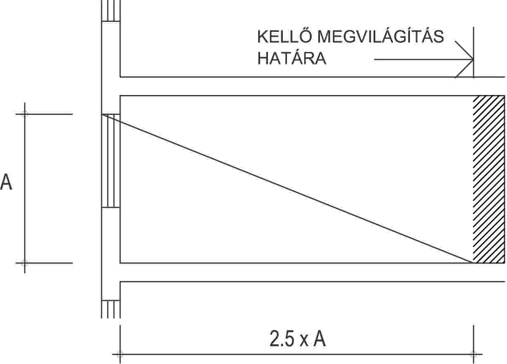

*1.46. ábra – Az ablak szemöldökmagassága és a kellő megvilágítás mélysége*

*A közvetett természetes megvilágítás* általában gyengébb, mint a közvetlen, de nem minden esetben (pl. olyankor, amikor a közvetítő tér teljes felületén üvegezett naptér). Ezért a közvetlen megvilágítással egyenértékűnek kell tekinteni a közvetett megvilágítást is olyankor, amikor annak mértéke az adott lakástevékenység végzéséhez elegendő (pl. az a főzőhely, amely *kellő mértékű* természetes megvilágítást a vele összenyitott étkezőn át kap). Ennek analógiájára *közvetett* természetes megvilágításúnak tekinthetjük az egyes helyiségek azon részeit (nagy mélységű szobák ablaktól távolabb eső területét), amelyek természetes fénnyel megvilágítottak ugyan, de a megvilágítás mértéke nem éri el azt a szintet, amely a közvetlen természetes megvilágítást igénylő lakástevékenységhez szükséges.

**A lakásterek megvilágítási követelményei:**

Közvetlen természetes megvilágítást igényelnek a huzamos tartózkodásra szolgáló lakásterek, amelyek folyamatos, rendeltetésszerű használata a két órát meghaladja.

**Ilyenek**

a közös időtöltés, vendégfogadás, napközbeni olvasgatás tere (nappali szoba e célt szolgáló részei)

az egyéni tevékenységek (otthoni szellemi munka) és a napközbeni pihenés terei (hálószobák)

az ételkészítés tere a 2 férőhelyesnél nagyobb lakásoknál, ha a nappali szobával, vagy közvetlen, természetes megvilágítással rendelkező térrel intenzív vizuális kapcsolatuk nincsen (főzőkonyhák, étkezőkonyhák).

Közvetett természetes megvilágítást kell biztosítani azoknak a tereknek, amelyek időszakosan használtak ugyan és használatuk közben kiegészítő mesterséges megvilágítást is igényelhetnek, de a természetes fény, vagy más lakóhelyiséggel való vizuális kapcsolat a mentális komfortérzethez szükséges.

**Ilyenek**

az étkezőhely

az ételkészítés helye 2 férőhelyesnél nagyobb lakásoknál, ha közvetlen, természetes megvilágítású étkezővel vagy nappalival intenzív vizuális kapcsolatban vannak

a csak alvás céljára szolgáló hálófülke vagy háló-galéria, amely más, közvetlen természetes megvilágítással rendelkező lakótérrel (nappalival) nagy felülettel összenyitott.

*Csak mesterséges* megvilágítás elegendő az időszakosan, rövid ideig használt lakásterekben (közlekedő terekben, egészségügyi helyiségekben, tárolókban, az 1-2 férőhelyes kislakások főzőfülkéiben).

A fent leírt követelmények az *alsó határértéket* jelentik, azoknál kedvezőbb megvilágítás minden esetben lehetséges és – ha mód van rá – ajánlott is. A lakásban lévő, az általánostól különböző rendeltetésű terek megvilágítása a használat jellege szerint történjék. Ha a rendeltetésszerű használat folyamatosan meghaladja a két óra időtartamot, akkor azokhoz közvetlen, természetes világítást kell biztosítani.

### 1.5.2. Szellőzés

A lakásterekben való tartózkodás során az ember oxigént fogyaszt, és széndioxidot lélegez ki. A megfelelő komfortérzetnél a levegő széndioxid tartalma nem haladhatja meg az egy ezreléket, ezért a lakásterek levegőjét cserélni, azokat szellőztetni kell. A szellőzés intenzitását a *légcsere* mértékével jellemzik. (Az óránként kétszeres légcsere azt jelenti, hogy egy helyiség teljes térfogatának levegője egy óra alatt kétszer cserélődik ki.)

Légcsere előállhat a külső légtér és a belső légtér között (közvetlen szellőzés), de légáramlás a belső terek között is fellép. Ha egy helyiség légcseréje egy másik, vele összenyitott helyiségen át történik, akkor *közvetett szellőzésről* beszélünk ([1.45. ábra](#abra_1_45)).

Ha a légáramlás a különböző hőmérsékletű levegőrétegek fajsúly-különbsége és a külső légmozgás (szél) hatására alakul ki akkor ezt természetes (gravitációs) szellőzésnek nevezik. Ha a légáramot gépi úton, ventillátorral idézik elő, akkor mesterséges vagy gépi szellőzésről beszélünk.

*Természetes (gravitációs) szellőzés* történhet külső nyílászárón (ablakon, erkélyajtón) vagy légvezetéken (szellőzőkürtőn, légcsatornán) keresztül.

A korábban alkalmazott külső nyílászárók óránként kb. 1-1,5-szeres légcserét biztosítottak csukott állapotban is (mérettől és légtömörségtől függően). A korszerű, energiatakarékos nyílászárók légtömörsége szinte korlátlanul fokozható, de annak túlzott mértéke hátrányos is lehet: a folyamatos légcsere hiánya akár egészségkárosodást is okozhat, olyankor, ha allergiát előidéző gombásodással párosul. A nagy légtömörségű ablakot is ki lehet időnként nyitni és így a helyiség szellőztethető, de hálószobák esetében, az éjszakai órákban ez nyilván nem lehetséges. Emiatt a hálószobák legkisebb légtérfogatát szabályzat előírja: ez min. 15 m3 fejenként.

Minthogy az ablakon keresztül történő légcsere intenzitása az ablak felső és alsó éle között lévő légoszlop fajsúly-különbségétől függ, szellőzés szempontjából kedvezőbbek a függőleges irányban nyújtott ablakszárnyak, mint a fekvő ablakok. Ugyanezen okból előnyös, ha az ablak felső záródása közel van a mennyezetsíkhoz.

> **Megjegyzés**
>
> A jó belső komfort érdekében szükséges légcsereszám függ a helyiséget használó személyek állapotától és a tevékenységtől is. A megfelelő természetes és egyenletes (huzatérzet nélküli) légcsere fontos komforttényező, és szinte magától megoldott abban az esetben, ha a lakás különböző homlokzatokra szellőzik, ha növény vagy vízfelület van a homlokzat közelében (utcai fasor, zöldhomlokzat), így a homlokzatok között hőmérséklet- különbség alakul ki a nap folyamán. A légcsere kérdése a kiváló légzárású ablakok és az úgynevezett „passzív ház” (lásd későbbi fejezetben) tervezése során lehet kritikus. Általában fűtési időszakon kívül a magas légcsere és nyáron az éjszakai szellőztetés előnyös, mivel csökkenti a belső terek túlmelegedését. Fűtési időszakban pedig az alacsonyabb légcsereszám takarékosabb üzemeltetést tesz lehetővé, mert a légcserével fűtési időszakban hőveszteség lép fel, hiszen meleg levegő távozik a belső térből, és helyét hideg levegő veszi át. A két követelmény látszólag ellentmondásban van, ezért gondos tervezés szükséges a szerkezetek és a gépészeti rendszerek megválasztása során. A gyártó ipar jelenleg a nyílászárók légtömörségének fokozására törekszik, ennek ellenére a frisslevegő bevezetését meg kell oldani. (N. Á.)

Nem minden esetben biztosítható, hogy a szellőzést igénylő helyiségek közvetlenül a homlokzat mellé kerüljenek, és ablakkal lássák el őket. A belső fekvésű helyiségek természetes (gravitációs) szellőzése vízszintes légcsatornán vagy szellőzőkürtőn keresztül történhet.

Ha a belső fekvésű helyiség a homlokzathoz közel van, akkor szellőztetése vízszintes szellőzőcsatornával (átszellőzéssel) is megoldható. Ennek keresztmetszete viszonylag nagy legyen és hossza ne haladja meg a 2 m-t ([1.47. ábra](#abra_1_47)). A gravitációs úton működő szellőzőcsatorna legkisebb keresztmetszetéről az OTÉK rendelkezik, gépi szellőzésnél számítással kell meghatározni azt.

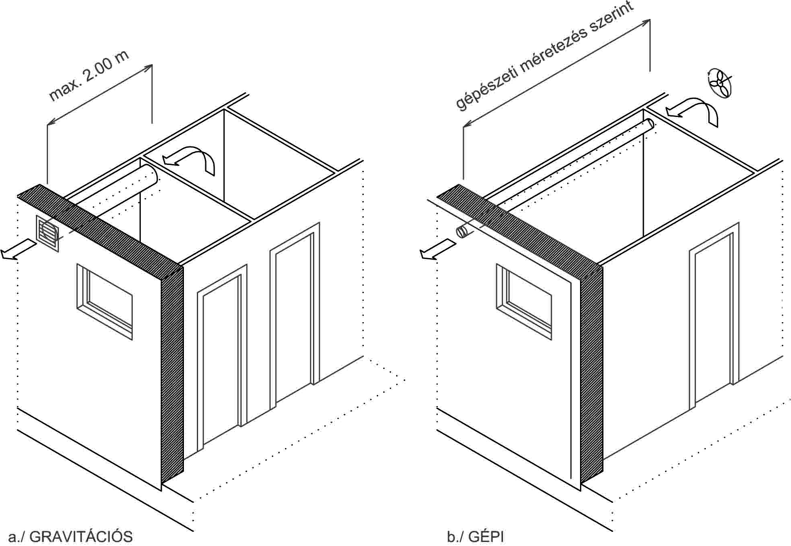

*1.47. ábra – Átszellőzés vízszintes szellőzőcsatornával*

A szellőzőkürtők a helyiség elhasznált levegőjét a tető fölé vezetik. A falazott szellőzőkürtők és különféle, beton-anyagú szerkezetek helyett ma egyre inkább a könnyű, fémszerkezetű, hőszigetelt szellőzőcsatornák használatosak.

> **Megjegyzés**
>
> A gravitációs szellőzőkürtők hatásfoka nem egyenletes: téli időszakban, amikor a szellőzőkürtő felső kitorkolásánál mért hőmérséklet jelentősen alacsonyabb, mint a szellőztetendő helyiség belső hőfoka, a légáramlás mértéke intenzív. Bizonyos meteorológiai helyzeteknél – amikor a szellőzőkürtő alsó-felső nyílása között nem mérhető hőmérséklet-különbség és a szél sem fúj – a kürtőben nincs légáramlás. Forró nyári napokon az is lehetséges, hogy a helyiség levegője hűvösebb a külsőnél, és a szellőzőkürtő visszafelé működik: a szellőztetendő helyiség elhasznált levegőjét a lakás légterébe nyomja (szerencsére ilyenkor az ablakok is nyitva vannak).

A gravitációs szellőzőkürtőn eltávozott levegő utánpótlása vagy a lakás légteréből történik a szellőztetett helyiség ajtórésein, illetve az erre a célra kialakított nyílás-áttöréseken keresztül, vagy külön légcsatornán keresztül kap a helyiség frisslevegő-utánpótlást ([1.48.b. ábra](#abra_1_48)). Az utóbbi megoldás sokkal jobb, de kialakítása bonyolultabb és költségesebb, ezért viszonylag ritkán használják. A gravitációs szellőzőkürtőt minden szellőztetendő helyiséghez külön-külön kell biztosítani, így egy szellőző-blokknak meglehetősen nagy helyigénye van többszintes, többlakásos épületek esetében.

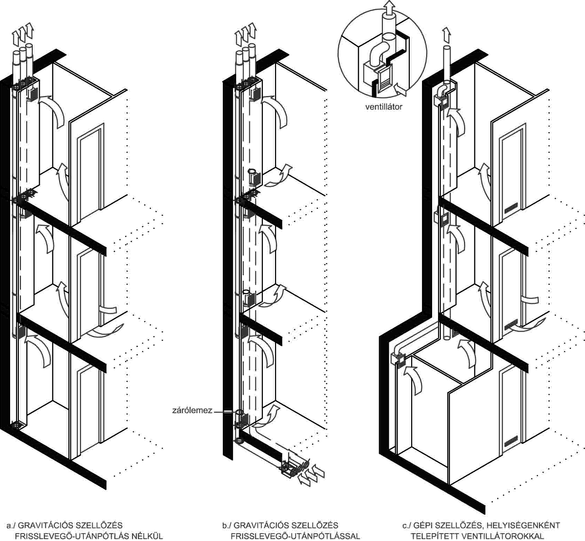

*1.48. ábra – Szellőző rendszerek szerelt jellegű kürtőkkel*

Állandó intenzitású és szabályozható szellőzést biztosít a gépi szellőzés. Lehetséges, hogy a ventilátor több helyiség szellőztetésére szolgáló gyűjtőcsatorna kitorkolásánál van elhelyezve (tetőventilátor), amely állandóan működik. Ellátható valamennyi, szellőztetendő helyiség is külön ventilátorral, amelyeket automata kapcsol be, és tart üzemben a szükséges ideig. Ezek energiát használnak ugyan, de fogyasztásuk nem jelentős, ezért egyre gyakrabban alkalmazzák őket ([1.48.c. ábra](#abra_1_48)). A ventilátorok becsatlakozása előtt torló szelep van beépítve, amely a visszaáramlást megakadályozza, ezért egy szellőzőkürtő több helyiség szellőzésére elegendő többszintes épületeknél is.

> **Megjegyzés**
>
> Korszerűbb, „energiatudatos” gépészeti rendszereknél lehetséges hővisszanyerő berendezés alkalmazása, amely a távozó meleg levegővel a bejövő friss levegőt előmelegíti. Ez a rendszer a szellőzés energiamérlegét a nyereség-oldal felé billenti.
>
> Amennyiben az egész lakást (épületet) ellátó központi szellőztető rendszer készül, azt kell figyelembe venni, hogy a gépészeti rendszer számára megfelelő hely biztosított legyen. A minimálisnál nagyobb belmagasság pl. a szellőztetőrendszerek beépítését is megkönnyíti.
>
> A fentieket egybevetve is a gépészeti rendszerek túlzott alkalmazását kerülni kell, és a lakóhelyiségeknél lehetőleg passzív módon, szerkezetekkel és jó tájolással kell biztosítani a szükséges légcserét (N. Á.)

**A lakásterek szellőzési követelményei:**

- Ablakon keresztül történő, közvetlen természetes szellőzést kell biztosítani azoknak a lakástereknek, amelyek közvetlen, természetes megvilágítást is igényelnek (lásd 1.4.1. fejezet). Szellőző ablakfelülettel kell ellátni azokat a főzőkonyhákat és étkezőkonyhákat, amelyek önálló, más helyiségtől elzárt (elzárható) légtérrel rendelkeznek, kivéve az 1-2 férőhelyes kislakások főzőfülkéit.
- Közvetett természetes szellőzéssel lehet kialakítani a közlekedő tereket, az étkezőt, a nem romlékony anyag tárolására szolgáló tárolókat (gardrób, járható szekrény, általános tároló) és a csak alvás céljára szolgáló háló-galériát, hálófülkét, amely más, közvetlen természetes szellőzését ablakon át nyerő lakóhelyiséggel nagy felületen, állandóan összenyitott.
- Ablakon át, vagy annak hiányában gravitációs, illetve gépi úton működtetett szellőzőcsatornán, szellőzőkürtőn keresztül közvetlen szellőzést kell biztosítani az egészségügyi helyiségeknek (fürdőszobának, zuhanyfülkének, WC és mosdó helyiségnek), a háztartási helyiségnek és az éléskamrának.
- Feltétlenül gépi szellőzést (szagelszívó berendezést) kell alkalmazni azoknál a főzőhelyeknél, amelyek más lakóhelyiség (nappali szoba) légterétől nincsenek elválasztva, valamint az 1-2 férőhelyes kislakások ablakkal nem rendelkező főzőfülkéinek esetében.

> **Megjegyzés**
>
> Szagelszívóval felszerelt konyha esetében cserépkályha és kandallófűtés egy légtérben és egy időben nem alkalmazható. A szagelszívó a belső térben nyomáscsökkenést hoz létre, így fűtési időszakban a kéményből visszaáramlás jöhet létre megfelelő kéménymagasság esetén is. Régebben a gázkészülékek esetében is létrejöhetett ez a jelenség, legújabban azonban a gázkészülékek oxigénellátását egyre inkább közvetlenül a külső térből oldják meg. Hasonló a helyzet az elszívó szellőztetőrendszerekkel és a központi porszívóval, WC ventilátorokkal. Az egyidejű működtetést el kell kerülni. (N. Á.)

A fent nem említett – nem általánosan igényelt – lakásterek szellőzését a rendeltetésszerű használat jellege alapján kell meghatározni. Ablakon keresztül kell szellőztetni huzamos tartózkodásra szolgáló helyiségeket. Közvetlen szellőzést kell biztosítani a szagot, gőzt vagy más szennyezést keltő tevékenységek tereinek.

### 1.5.3. Hőmérséklet, hőérzet, fűtés

A hőérzet nemcsak a lakástér levegőjének hőmérsékletétől függ, hanem egyéb tényezőktől is. Hidegebb hőérzetünk van nagy üvegfelületek közelében (hideg sugárzás) ilyenkor a komfortérzet magasabb fűtési hőmérsékletnél áll elő, míg meleget sugárzó nagy felületek közelében (falfűtés vagy padlófűtés esetén) a szokásosnál alacsonyabb levegő-hőmérséklet mellett is kellemes hőérzetünk lehet. A hőérzet a levegő páratartalmától és a belső térben érzékelhető légmozgástól is függ.

> **Megjegyzés**
>
> A falak és padlószerkezetek jó hőszigetelése hőérzeti előnnyel is jár, a jobban szigetelt külső fal belső felületi hőmérséklete kedvezőbb, így a levegő hőmérséklete már alacsonyabb is lehet. Általános fizikai és egészségügyi állapot esetében téli időszakban a falfelület belső hőmérséklete ne legyen alacsonyabb, mint 16 ºC még a sarkokban sem. 16 ºC falhőmérséklet esetén a megfelelő komfortérzethez ülő tevékenység esetén kb. 23-24 ºC léghőmérséklet szükséges. Amennyiben a belső felületi hőmérsékletet 20 ºC körüli értékre tudjuk növelni, úgy a levegő hőmérsékletét is elegendő 20-21 ºC körül tartani. Ez azt jelenti, hogy jó hőszigetelés esetén a fűtési energiaveszteség kevesebb. További megtakarítás érhető el azáltal, hogy a megfelelő belső komfort eléréséhez elegendő az alacsonyabb belső léghőmérséklet biztosítása. A lakások és épületek fűtése többféle energiahordozóval többféle módon oldható meg, és minden bizonnyal lesznek még újabb és újabb módszerek. Egy biztos, a tervezés során törekedni kell a téli hőveszteségek csökkentésére (jó hőszigetelés, kedvező felület/térfogat arány, a hőhidak kerülése) és a téli hőnyereségek növelésére (jó tájolás, helyiségek egymás mellé sorolása, zónás tervezés). (N. Á.)

A lakások fűtésének megtervezése általában épületgépész-szakember feladata. A fűtés *energiaszükséglete* azonban az épületek építészeti és szerkezeti kialakításának függvénye. A későbbi fejezetekben mindig utalunk a különböző lakóépületfajták energiatudatos tervezésének szempontjaira.

A fűtési rendszerek közül ma már ritkán használják a szilárd tüzelésű, helyi fűtést, általánosan elterjedt a gázüzemű központi fűtés. Ennek fűtőberendezése vagy több lakást szolgál ki (többlakásos házakban), vagy a lakás önálló fűtőberendezéssel és fűtővezeték-hálózattal rendelkezik. A lakásokban gyakrabban alkalmazott gáz falikazán méreteit és kéménycsatlakozását az [1.49. ábra](#abra_1_49) mutatja.

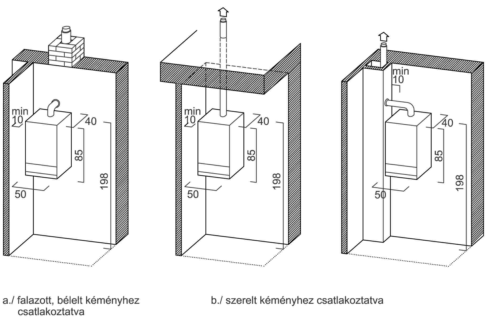

*1.49. ábra – Gázüzemű falikazán*

Nemcsak a kellőnél alacsonyabb, hanem a túl magas hőmérséklet is kellemetlen érzetet okozhat forró nyári napokon. A hőmérséklet a nap 24 órája alatt nem egyenletes, az éjszakai, és hajnali órák mindig hűvösebbek, mint a déli, délutáni időszak. A nagy tömegű épületszerkezetek az energia-felvételt és energia-leadást időben késleltetik, ezért a napközbeni belső hőmérséklet jobban közelít 24 órás átlaghoz, és a külsőnél alacsonyabb marad a nagy hőtehetetlenségű anyagokból készült épületeknél (ezért hűvösek a régi, vastag tégla- vagy kőfallal épült házak). A nyári túlmelegedés szempontjából kifejezetten kedvezőtlenek a könnyű épületszerkezetek. Lényeges szempont a lakások kellő szellőzése: többlakásos házak esetében azok a lakáselrendezések a kedvezőbbek, amelyek ablakai két, átellenes homlokzaton vannak és köztük kereszthuzat létesíthető az éjszakai órákban, amikor a napközben felmelegedett falak hőenergiájukat leadják. Rosszabbak azok a lakások, amelyeknek csak egyetlen, nagy hőterhelésnek kitett homlokzati faluk van.

Az ablakon át történő energiafelvétel árnyékolással csökkenthető. A nyári, magas napállás mellett a déli homlokzaton kellő védelmet nyújtanak a vízszintes árnyékoló síkok ([1.50. a.b.c. ábra](#abra_1_50)), de ezek nem hatásosak a keleti vagy nyugati oldalon, ahol a napállás nyáron is alacsony. Főleg a nyugati oldal okoz gondot, mert a helyiségek abban a napszakban kap benapozást, amikor a külső levegő hőfoka már magas. Az alacsony szögben beeső napsugárzás ellen mozgatható árnyékoló szerkezetekkel lehet hatásosan védekezni ([1.50.d.e. ábra](#abra_1_50)).

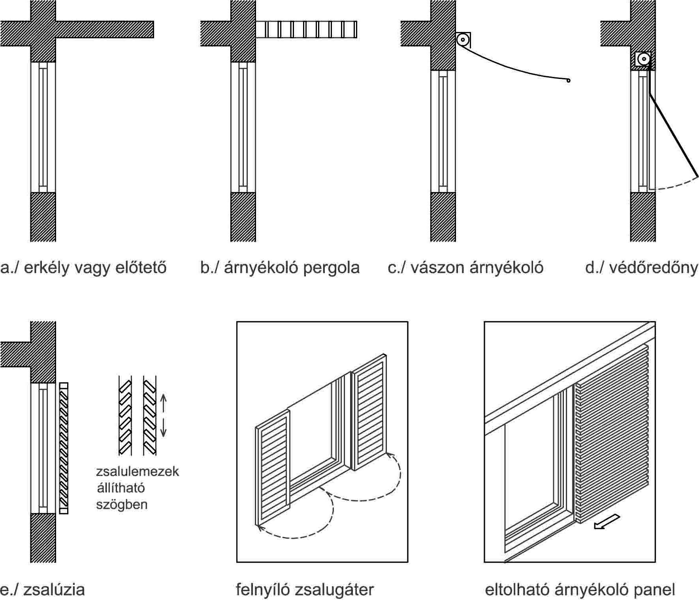

*1.50. ábra – Lakóházaknál gyakran alkalmazott árnyékoló szerkezetek*

Igényesebb lakóházaknál elfordul a lakásterek gépi hűtése (légkondicionálás), ennek energiafogyasztása azonban igen nagy. A túlzott energiafogyasztás a globális, „fenntartható fejlődés” szempontjából negatív jelenségnek tekinthető, ezért kívánatos, hogy a lakásokban a kedvező hőérzetet lehetőleg energiabevitelt nem igénylő megoldásokkal biztosítsuk a nyári időszakban.

### 1.5.4. Benapozás, tájolás, energiatudatos tervezés

A lakásterek benapozása részben egészségügyi okokból, részben mentális komfortérzet szempontjából szükséges, de jelentős szerepe van a lakás energiaháztartásában is.

A közvetlen napsugárzásnak csíraölő képessége van, ezért a napsütötte szobában kevesebb esélye van egészségkárosító mikroorganizmusok, gombák megtelepedésének. A napfényt nélkülöző, északi tájolású vagy állandóan beárnyékolt szoba kedélytelen, rossz hangulatú.

A benapozott helyiség a külső térből energiát vesz fel, ami jelentős fűtési energia-megtakarítással jár. Ma már a lakások kedvező energiaháztartása egyre inkább elsőrendű tervezési szempont: a helyiségek kialakítása, elrendezése és az üvegfelületek méretezése, tájolása az un. „passzív szolár elvek” alapján történik. Ez azt jelenti, hogy a napenergia különféle technikai berendezések (napkollektorok, napelemek) alkalmazása nélkül is hasznosítható csupán az épület és az épületszerkezetek céltudatos kialakításával.

Általánosságban arra kell törekedni, hogy ahol a benapozás hőenergiáját is szeretnénk hasznosítani, ott megfelelő nehéz szerkezeteket alkalmazzunk (vasbeton födém, kerámia burkolat, téglafalak).

A benapozás az év nagyobb részében pozitív jelenség, de – a mi klímánkon – negatív hatású is lehet a forró nyári napokon, amikor a lakásterek túlmelegedését okozhatja (lásd előző fejezet).

Ebből a szempontból kedvező a hálószobák keleti tájolása, mert a hűvös hajnal után a nappali felmelegedés csak a déli órák körül éri el a maximumát, amikor a napsugárzás már nem éri a keleti homlokzatot. Kifejezetten előnytelen a nyugati tájolású hálószoba, mert a délután felmelegedett falak egész éjszaka onthatják a hőséget, ami az éjszakai pihenést zavarja. A konyhában a túlzott felmelegedést a tűzhely és a sütő hője tovább fokozza, káros az éléskamra felmelegedése is. Az egyes helyiségek tájolását a két, egymás ellenében ható szempont alapján lehet meghatározni: a huzamos tartózkodást szolgáló helyiség lehetőleg benapozott legyen, de használatát a túlzott felmelegedés a lehető legkevésbé zavarja.

**Az egyes lakáshelyiségek kedvező tájolása az általánosan elfogadott szakmai konvenció szerint a következő:**

- Nappali szoba: dél (délnyugat, nyugat)
- Szülői háló: kelet (északkelet)
- További hálószobák: kelet, délkelet (dél)
- Konyha, kamra: észak, északnyugat, északkelet
- Az egyéb helyiségek tájolása közömbös.

Ezek a preferenciák nem minden építtető esetén azonosak, és maradéktalan érvényesítésük nem lehetséges mindig. A passzív szolár elvek a konvenciókat gyakran felülírják. Az egyes épülettípusok sajátos tájolási, benapozási kérdéseit a későbbiekben külön tárgyaljuk, fejezetenként.

### 1.5.5. Zaj elleni védelem, akusztikai komfort

A lakástereket zavaró zajhatások forrása (emisszió) lehet a lakáson belül vagy a lakáson kívül; lehet a szomszéd lakásban vagy a közvetlen lakókörnyezetben. A védekezés módja az emisszió csökkentése, vagy a behatolás (imisszió) mérséklése hangszigetelő szerkezetekkel.

Legnehezebb a közvetlen lakókörnyezetben keletkezett zaj elhárítása (a forgalmas utca, vasút, repülőtér, bizonyos ipari tevékenység által keltett zaj), mert az fokozott hangszigetelésű térhatároló szerkezetekkel, speciális üvegezésű ablakokkal elvben mérsékelhető ugyan, de csak csukott ablakok mellett. Ezt lakóépület esetében elvárni nem lehet (vagy légkondicionálással kell párosítani, ami nagyon költséges). A túl magas zajterhelésű területeket nem szabad lakóépületek építésére kijelölni, de ha ez konkrét esetekben a (pl. foghíjtelkek beépítésénél) elkerülhetetlen, akkor az épületek kialakításánál a csendesebb területre néző homlokzatra kell a szobák ablakait helyezni akkor is, ha ez más szempontoknak (pl. a tájolás szempontjainak) ellentmond. Az ilyen helyzetek mindig eseti mérlegelést igényelnek.

A szomszéd lakásból jövő zajterhelés a megfelelő hanggátlású lakáselválasztó fallal és födémmel kivédhető. Zaj elleni védelmet igényel az alvás és a szellemi munka tere (általában a hálószoba), ezeket a lakás egyéb tereitől megfelelő hanggátlású szerkezetekkel kell elválasztani. Egyéb lakástevékenységek keltette zajt (tévézés, zenehallgatás) a háztartás-tagok közös megegyezéssel tolerálhatják, de ha ezek hanggátló elválasztása építtetői igény, akkor lehetséges a nappali szoba akusztikai leválasztása is. A lakáson belül általában zajforrást jelent a konyha és az egészségügyi berendezések használata. Két férőhelyesnél nagyobb lakásoknál nem tekinthető alvótérnek az a szoba, amely a konyhától nincs akusztikailag leválasztva. Bár a korszerű épületgépészeti berendezések és szerelvények ma már csendesebbek, javasolt a hálószobák falába vésett épületgépészeti csővezetékek lehetőség szerinti kerülése.

> **Megjegyzés**
>
> A közvetlen környezetből eredő zaj elleni védelem a lakásokban élők szempontjából nagy figyelmet kíván. Egy átlagos lakásban szinte minden szobában, helyiségben található valamilyen hangkibocsájtó szerkezet: televízió, rádió, CD-lejátszó, számítógép, stb. Ugyanakkor a lakások használói védeni is szeretnék magukat a szomszédból és a saját lakásból jövő épületen belüli zajok ellen. Ebben a megfelelő hangszigeteléssel kialakított ajtók és válaszfalak segítenek, ügyelve arra, hogy a gépészeti és elektromos vezetékek mentén is megfelelő védelem legyen.
>
> A belső terekben általában elegendő a bútorok elhelyezése, hogy a kongóan üres, a zörejeket zavaróan felerősítő akusztikát elkerüljük. Azokra a helyiségekre kell nagyobb figyelmet fordítani, ahol nincsenek hangelnyelő tárgyak, bútorok. Hidegburkolatú lakóhelyiségekben lehetővé kell tenni a padlón szőnyegek vagy az ablakokon függönyök elhelyezését, mert az akusztikai komfortot jelentősen javítják. Vizes helyiségben sem érdemes a teljes falmagasságban kerámia vagy kőburkolatot alkalmazni, a hidegburkolatok alkalmazása elegendő csak a szükséges mértékben, mert a tér zavaróan visszhangossá válhat, és a szokatlan zajok baleset forrásai lehetnek.
>
> Az épületek külső környezetében is egyre növekszik a zajszint. Ennek eredménye az, hogy egy idő után egyre nehezebben tolerálható a környezeti zaj, akár lakáson belül akár lakáson kívül keletkezik. Ezért a szerkezetek tervezésénél figyelembe kell venni mind a kopogóhang, mind pedig a léghang elleni védelmet. Míg az előbbi ellen többrétegű, hanglágy szerkezetek beiktatása szükséges az utóbbi ellen legjobban a nehéz szerkezetek (falak, födémek) védenek meg. Mindenképpen érdemes megjegyezni, hogy mindennek helyigénye van akár a falak akár a födémek vastagságát tekintjük. Minden esetben érdemes az alaprajzi és a függőleges szerkesztési méreteket kis rátartással megadni. Utólag már nehéz lesz a helyet biztosítani ezeknek a szerkezeteknek is.
>
> Ezen túl lehetőség van a zónás tervezés segítségével zajos és csendes zónákat létrehozni a lakáson vagy épületen belül. Az épület külső környezetében tervezett növényzet (zöldhomlokzat, zöldtető, nagyobb zöldfelület) mind segít a külső zajok csökkentésében, hiszen a zajhullámokat a levelek, növények elnyelik, tompítják. (N. Á.)

### 1.5.6. Vizuális komfort (N. Á.)

A lakásterek komfortkövetelményeihez tartozik a vizuális komfort biztosítása. Napjaink legnagyobb részét zárt belső térben töltjük, ezen belül is otthonunkban. A látás, mint érzékelés rendkívül fontos, mert a vizuális ingerek, benyomások éppolyan érzékenyen érintenek, mint a zajok.

A lakáson belüli terek látványa, az alkalmazott színek részben a belsőépítészeti tervezés kérdéskörébe tartoznak, de erre is hatással lehetünk a tervezésnél. Amikor megközelítjük a lakóépületet, vagy belépünk egy lakásba az első erős benyomásunk a vizuális érzékelésből származik.

> **Megjegyzés**
>
> Amikor belépünk egy előszobába, és az illemhely ajtaja ugyanolyan, mint a nappali szobáé, vagy a terek között szükséges vizuális kapcsolatot (pl. konyha-étkező esetében) folyton megszakítja egy belógó ajtószárny, vagy az egyik lakóhelyiség rendkívül világos, míg a másik alulvilágított, akkor a vizuális komfortérzetünk romlik.

A jó tervezés során a beköltözők szemével is végigjárjuk az épületet és a belső tereket. Törekednünk kell a nyugalmat adó, inspiratív terek létrehozására. A lakások a benne élők életének lenyomatát mutatják, de jó tervezéssel segíteni lehet az egyéni használóknak is a nyugodt lakáskörülmények elérésében. A jó fény és színkontrasztok, a megfelelő anyagválasztás – főleg a burkolatok esetében – sokat segít azoknak is, akik nem szakértőként rendezik majd be otthonukat.

Ebben segíthetnek az olyan kiegészítő terek, amelyek jól személyre szabhatóak, vagy a külső világ felé nyitnak, de mégis szűrőként is viselkednek. Ilyen tér lehet az erkély, loggia, terasz, amely növényekkel, bútorokkal egyedileg berendezve a bent élők számára az elvonulást és nyugalmat, vagy éppen a külső környezethez való kapcsolódást jelentheti.

### 1.5.7. Allergén-mentes környezet, egészséges lakás (N. Á.)

Az európai népesség életének nagy részét zárt belső térben tölti. (Ezen belül is vannak különbségek: legtöbb időt belső térben a brit lakosság tölt, míg legtöbb időt szabad térben a svéd lakosság tölti.) A külső és belső tér levegőminősége, az alacsony légszennyezettség mindenki számára fontos. Az allergiások aránya is egyre növekszik. Sok esetben előfordul, hogy külön egy-egy szennyezésre nem érzékeny valaki, míg több szennyeződés egyidejűsége esetén megjelennek a kellemetlen tünetek.

Az allergia kevéssé gyógyítható, a tünetek enyhítése sem egyszerű, az életminőséget, a munkaképességet csökkenti és a társas kapcsolatokra is negatív hatással van.

> **Megjegyzés**
>
> A különböző allergiák közül nem tárgyaljuk itt a fényallergia kérdését, mert a környezet gondos tervezése ebben az esetben speciális szaktudást igényel.

A külső térben található allergének (por, pollen, egyéb szennyező anyagok) főleg a nyári időszakban jelentenek gondot azoknak, akik ebből a szempontból érzékenyebbek. Akik ebben szenvednek, részben alkalmazkodhatnak az idényjelleggel jelen lévő pollen ellen azzal, hogy kerülik a fertőzött területeket, illetve kevesebbet tartózkodnak a szabadban. A levegőben lévő szálló por és a hozzá kapcsolódó szennyező anyagok nehezen elkerülhetőek, jó tervezéssel mégis csökkenteni lehet hatásukat. A legjobb port és egyéb szennyezést megkötő felület a növényzet, ezért városi környezetben fontos a nagy lombtömeggel rendelkező növényzet telepítése fasorok, zöldhomlokzatok, parkok formájában. Hasonlóan kedvező hatású a vízfelület, vízpermet. A nedvesebb, nehezebb levegő a talaj felett lefelé mozog, és kevésbé kerül a légutakba. A száraz meleg levegő a benne lévő porral és az arra tapadó egyéb szennyező anyaggal azonban felfelé emelkedve könnyen a légutakba, bőrfelületre, hajba kerül.

A külső lakókörnyezetben ezért a növényzet és a víz fontos egészségvédő szerepet tölt be. Az épületek elhelyezésénél a tájolás és az uralkodó szélirány figyelembe vétele mellett a környező növényzet tervezése is szükséges.

Belső térben (az épületben és a lakásban) a jelenlévő allergének csökkentése a cél. Ezért fontos megakadályozni, hogy a külső térből nagy mennyiségű szennyező anyag, allergén jusson be a szellőztetéssel. Ennek eszköze a kinti terhelés csökkentése (lásd előző bekezdés) vagy a kontrollált szellőzés alkalmazása. A résszellőzők és a filterrel ellátott szellőztető berendezések ebben nagy segítségre vannak.

Másik feladat, hogy a bent lévő por/allergén mennyiségét csökkentsük. Ennek érdekében olyan jól takarítható felületeket kell kialakítani, amelyek a gyakori tisztítást is bírják. A szőnyegpadló és a pormegkötő falburkolat kerülendő. Általában a könnyen és nedves technológiával is tisztán tartható felületekre kell törekedni, míg a beköltöző lakó dolga lesz a személyre, ízlésre és egészségi állapotra szabott belső felület kialakítása, a szőnyegek és textíliák megválasztása.

A háziállatok által okozott allergia elkerülhető, ha nem tartunk macskát, kutyát, díszmadarat a lakásban. A gyapjú és toll ágynemű által okozott allergia pedig megfelelő tisztítással vagy egyéb, más töltőanyag használatával kerülhető el. Mindezek nem szabhatók személyre előre, de szállásjellegű épületeknél egészen biztos, hogy fokozottan kell ügyelnünk a mindenki számára elfogadható megoldásokra.

> **Megjegyzés**
>
> A fémekkel szembeni kontakt allergia szerencsére még nem terjedt el olyan arányban, mint a légúti allergiák, azonban gyermekek számára készülő létesítményeknél és idősellátást is magába foglaló épületeknél erre is gondolni kell. A kontakt bőrallergiák közül az építőanyagok leggyakrabban a nikkel (fém allergia) és a formaldehyd által okozott allergiákért felelősek.

## 1.6. A lakásterek kapcsolatrendszere, lakáskompozíció

A lakások egyes helyiségeinek a bejárattól való megközelítése közlekedő tereken át történhet (előszoba, belső folyosó), de a kifejezetten erre a célra rendelt tereken kívül más alaprendeltetésű helyiségek is szolgálhatnak közlekedőként (pl. étkező, nappali szoba). Utóbbiakban kialakuló útvonalakat *rejtett közlekedőknek* is szokás nevezni. A szokásos lakáshelyiségek közül nem tartalmazhat „rejtett közlekedőt”, vagyis nem lehet egy másik helyiség megközelítésének *kizárólagos* útvonala a hálószoba (kivéve, ha az csak a hálót használók saját – második – fürdőszobája, öltözője, dolgozója megközelítésére szolgál), egészségügyi helyiség (zuhany, fürdő, WC) a főzőhely technológiai területe, az éléskamra és a háztartási helyiség.

A lakásterek kapcsolatai jelentősen befolyásolják a lakásban élő háztartás tagjainak mentális komfortérzetét és emberi kapcsolataik megnyilvánulásait. Azt, hogy egy lakás „barátságos” vagy „meghitt, otthonos” vagy „elegáns, nagyvonalú” stb. nagyrészt a térkapcsolatok jellege dönti el.

A lakásokban folyó tevékenységek általában folyamatként, tevékenységsorozatokban realizálódnak. Az ismétlődő tevékenységsorozatok bizonyos lakásterek közelségét, kapcsolatát feltételezik. (Pl. élelmiszertárolás – főzés – étkezés – mosogatás; vagy alvás – ébredés – reggeli tisztálkodás – öltözés stb.) Ezek az általánosan elfogadott összefüggések azonban a valóságban sohasem ilyen mereven érvényesülnek.

A lakásban élő háztartás (család) kommunikációja nem értelmezhető egyféle lakástevékenységként – „társalgásként” – hanem az többféle formában jelenik meg.

**A kommunikáció létrejöhet**

- együtt végzett, azonos tevékenységek során (pl. társalgás, tévézés, együtt végzett házimunka)
- azonos térben vagy összenyitott terekben egy időben végzett, de eltérő tevékenységek során
- a családtagok tevékenységsorozatainak mozzanatszerű átfedései alkalmával.

A „családi együttlét” színtere nemcsak a nappali szoba, hanem az egész lakás.

Az egyes lakásterek kapcsolatának konkrét módozatára láthatók példák az [1.51. ábrasoron](#abra_1_51). Az ajtóval kapcsolódó helyiségek összenyitva és elválasztva is használhatók, a nyílászáró nélküli, állandóan összenyitott terek külön „helyiségként” való értelmezése inkább szimbolikus jelentőségű.

Az [1.52. ábrasor](#abra_1_52) a „nappali időtöltés, étkezés, ételkészítés” tereinek többféle kapcsolatára mutat példákat. A különböző lakástevékenységek helyiségei egy közlekedő térből, külön bejárattal is megközelíthetők ([1.52.a. ábra](#abra_1_52)). Ilyenkor a helyiségsor szétaprózott, a terek kapcsolatrendszere inkább szeparálásra mintsem kommunikációra irányul.

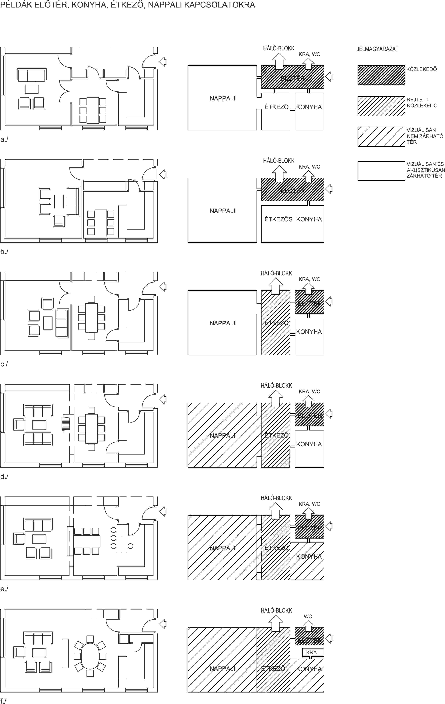

*1.52. ábra – Példák előtér, konyha, nappali kapcsolatokra*

Az 1.52.b. ábrán mutatott elrendezés azt a hagyományos lakáshasználati mintát követi, amikor az étkezős konyha a családi együttlét helyszíne is: az anya főzés közben a konyhában együtt lehet a családdal, felügyelheti a konyhaasztalon játszó, rajzolgató kisgyereket stb. Az [1.52.c. ábra](#abra_1_52) egy központi helyzetű étkező-előteres elrendezést mutat. Az előszobát megkurtítva annak egy része „rejtett közlekedőként” került az étkezőbe, ami által az jóval tágasabb lehetett.

A fenti három elrendezésnél a nappali szoba a többi lakótértől ajtóval leválasztható, kommunikációs funkcióját részben az étkező vagy étkezős konyha veszi át. A nappali szoba ilyen helyzete akkor szükséges feltétlenül, ha az alvóhelyül is szolgál. Másrészt, még mindig élő lakáshasználati szokás egyes családoknál „megkímélt nappali” fenntartása (a valamikori „tisztaszoba” utódaként), amikor a lakás főhelyiségét igényes, drága bútorzattal és textíliákkal rendezik be, ezért a napközbeni, frekventált használattól kímélik.

Az [1.52.d. ábrán](#abra_1_52) látható étkező olyan tér, amely a nappali szobával állandóan össze van nyitva, az [1.52.e. ábrán](#abra_1_52) a főzőhely is a nappali teréhez kapcsolódik, és légtérben sincs attól elválasztva. Így a „nappali tartózkodás” terei a konyha, az étkező és a nappali lényegében egy nagy térbe kerültek. A konyha ilyen felfogása („amerikai konyha”) főleg városi, értelmiségi foglalkozású asszonyok körében népszerű, mert az otthon töltött, szűkösre mért időt családi körben tölthetik főzés közben is. Ha a konyha a nappali terének része, külön bejárata elveszíti jelentőségét, akár el is hagyható. Az [1.52.f. ábra](#abra_1_52) szerinti elrendezésnél a főzőhely csak a nappalin keresztül érhető el.

A másik, szokásosan összetartozó helyiségcsoport a háló – fürdő – közlekedő blokk, ezek elrendezési sémáira mutat példát az [1.53. ábrasor](#abra_1_53).

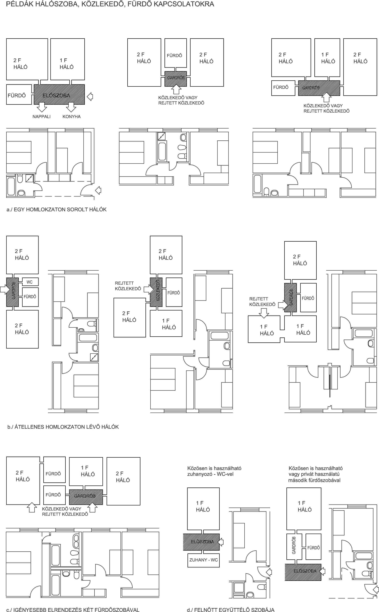

*1.53. ábra – Példák hálószoba, közlekedő, fürdő kapcsolatokra*

A lakásterek kapcsolatainak lehetséges kombinációi szinte végtelen számúak. Az [1.54. ábrasor](#abra_1_54) a gyakoribb esetekre mutat be példákat, funkciósémák formájában (a sémák konkrét alaprajzok nyomán készültek).

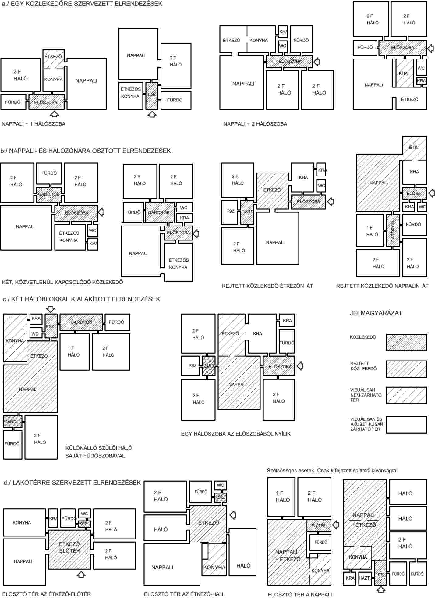

*1.54. ábra – Példák lakáshelyiségek kapcsolati sémáira*

*Az egy közlekedőre szervezett elrendezések* kisebb lakásoknál általánosak, viszonylagos helytakarékosságuk miatt.

*A nappali és hálózónára osztott elrendezések* annak a lakáshasználati igénynek megfelelően alakultak ki, amely megkívánja, hogy a vendégek fogadása alkalmával is zavartalanul használhassák szobáikat azok a családtagok, akik a vendéglátásban nem vesznek részt. Eszerint a hálószobákat és a fürdőszobát feltáró belső közlekedőt a lakás egyéb tereitől vizuálisan is le kell választani, hogy az alvóhely és fürdőszoba közötti „hálóinges forgalom” ne kerüljön a vendégek látókörébe.

Ez a helyiségkapcsolati rendszer nagymértékben rögzült a szakmai közfelfogásban, bár eredeti indítékának általános létjogosultsága ma már erősen megkérdőjelezhető.

> **Megjegyzés**
>
> A családok külső, baráti kapcsolatai ma már kevéssé formálisak, mint hetven-nyolcvan évvel ezelőtt, amikor a polgárcsaládok egymáshoz rendszeresen „vizitbe” jártak az akkori illemkódex kötött viselkedési szabályai szerint. Ma már általános, hogy az egyes családtagoknak is önálló baráti kapcsolataik vannak, és kevesek találnak kivetnivalót abban, ha egy tizenéves, vagy épp a felnőttkorba lépett fiú vagy leány az őt meglátogató barátját, barátnőjét saját szobájában fogadja – épp az „intim zónában”.
>
> Igaz, hogy másfelől újjáéledni látszanak a formális társasági kapcsolatok az üzleti világ vagyonosabb szereplőinél, akiknek igényes villáiban gyakori a formális keretek között rendezett „business party”, amelynek társaságát nem közeli barátság, hanem üzleti érdek hozza össze.

Az „intim zóna” kialakulása a hálószobák zavartalanságát akár az alvás, akár a szellemi munka szempontjából kedvezően befolyásolja, mivel a zajforrásokat tartalmazó „nappali zóna” és a hálószoba között még egy, a hanggátlást elősegítő közlekedő helyiség van.

A nappali zónát feltáró előszoba közvetlenül kapcsolódhat a gardróbhoz, de a kettő között rejtett közlekedő (étkező, nappali) is elhelyezkedhet ([1.54.b. ábra](#abra_1_54)).

*A két (vagy több) hálóblokkal kialakított elrendezések* esetén nem azonos közlekedőről nyílik valamennyi hálószoba, és azok a lakás különböző pólusain is lehetnek. Az előszobából nyíló hálószoba olyan esetben kedvező, ha a családban többé-kevésbé független életritmust igénylő felnőtt korú családtag él: nagyszülő vagy felnőttkorba lépett „gyermek”. Előnyös, ha ennek a hálónak a közelében is van második fürdőszoba vagy zuhanyfülke. Ez szolgálhat a szoba lakójának egyéni használatára vagy a közös WC-t is helyettesítheti ([1.53.d. ábra](#abra_1_53)). Lehetséges a saját fürdőszobával rendelkező szülői háló különválasztása a gyerekszobáktól, ([1.54.c](#abra_1_54) és [1.55.c ábra](#abra_1_55)), de ez a séma kisgyermek éjszakai felügyelete szempontjából kedvezőtlen lehet.

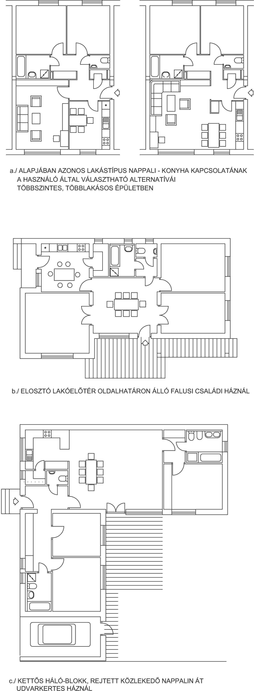

*1.55. ábra – Példák különféle lakáskompozíciós rendszerekre*

*A lakótérre szervezett elrendezések* esetén a csak közlekedést szolgáló helyiségek (folyosók) aránya minimális lehet. Nálunk hagyományai vannak a rejtett közlekedőt tartalmazó étkező centrális elhelyezésének, amely a konyhát és a lakószobákat kapcsolja össze: családi házaknál ez a „lakóelőtér”, többlakásos házaknál az „étkezőhall” ([1.54.d. ábra](#abra_1_54)).

A skandináv országokban korábban is elfogadott volt, de az utóbbi időben másutt is gyakran láthatunk olyan lakáselrendezést, amikor maga a nappali tér veszi át szinte teljes egészében a közlekedés funkcióját és a hálószobák közvetlenül a nappali térből nyílnak. A „közlekedő nélküli lakás” elvi alapja az a felfogás, hogy a lakások költségeit nem a kicsiny helyiségméretekkel, hanem a közlekedők elhagyásával és a belső térelhatárolások, nyílászárók számának csökkentésével lehet leszorítani úgy, hogy közben a lakóterek tágasak maradhassanak. Vélhető azonban, hogy a családtagok kommunikációjának ilyen szoros és állandó – szinte kikényszerített – voltát kevesebb család igényli vagy tolerálja.

A jelenlegi magyar előírások vagy szabályzatok nem zárják ki az említett helyiségkapcsolati rendszerek egyikét sem. Annak eldöntése, hogy melyik elrendezés a jobb vagy progresszívebb, nem a tervező építész feladata. A lakásba költöző család életvitelének, lakáshasználati mintáinak kell megfeleltetni konkrét esetekben a helyiségkapcsolatok jellegét is. Igaz, hogy az emberek adaptációs készsége igen nagy, és bizonyos lakáshasználati „divatok” kritikátlan elfogadására is hajlamosak, de a divatok múlékony természetűek és egy idő után a lakók elégedetlenné válhatnak az életvitelükhöz valójában nem illő lakáselrendezéssel.

A közelmúltban divatossá vált „amerikai konyha” (a nappalival légtérben összecsatolt főzőhely) nyilván alkalmatlan olyan esetekben, ha a konyhatechnológia annyira teljes körű, hogy az egy levágott állat tisztításával, darabolásával kezdődik (falusi háztartásoknál), vagy ha a család főzési szokásai intenzívebb, sok hulladékkal és szaggal járó konyhahasználatot feltételeznek.

Többlakásos házaknál, ahol azonos kialakítású lakástípusok ismételten fordulnak elő, nagy előnyt jelent és a lakáspiaci kelendőséget kedvezően befolyásolja a lakáselrendezés bizonyos mértékű flexibilitása. Például az, ha a nappali–étkező–konyha kapcsolatrendszerét a beköltöző lakó saját igénye szerint megválaszthatja ([1.55.a. ábra](#abra_1_55)).

Bizonyos életviteli típusokhoz bizonyos helyiségelrendezési sémák illeszkednek. Az [1.55.b. ábra](#abra_1_55) egy, faluhelyen közkedvelt étkező-előteres lakáselrendezést mutat, ahol a könnyen tisztítható étkezőelőtér afféle „második nappaliként” szolgál. Ez természetes igény, mert a mindennapos kerti munkákhoz, állatgondozáshoz felvett gúnyában, gumicsizmában tényleg nem lehet a nappali szobát használni, és átöltözni sem lehet, valahányszor a lakásba lépnek.

Az [1.55.c. ábrán](#abra_1_55) mutatott, sajátos L formájú udvarkertes háznál a beépítés jellegéből adódik a hálószobák kétpólusú elrendezése, és a nappali szobában a rejtett közlekedő kialakulása.

A helyiségkapcsolati rendszerek megválasztást az is befolyásolja, hogy a lakáspiac melyik szegmensébe kerül a tervezett lakás.

> **Megjegyzés**
>
> Tévesnek bizonyult a korai funkcionalista lakáselméletek és a szocialista országok ideológiájának azon hipotézise, amely szerint a lakások elosztása a rászorultság szerinti igazságosság alapján lehetséges. Ez szolgált alapul a lakások férőhelyszám szerinti kategorizálásának és annak a feltételezésnek, hogy nagyobb létszámú családnak nagyobb alapterületű lakás jár. A valóságban mindenütt a *lakáspiac* szabályozza alapvetően a lakáshoz jutás lehetőségét. A családok által elérhető lakások nagyságát – költségszintjét – elsősorban fizetőképességük határozza meg, akkor is, ha a lakáspiacot a fejlettebb országokban állami szubvenciókkal befolyásolják.
>
> Az [1.56. ábra](#abra_1_56) első sorában két és fél szobás lakásokat hasonlítunk össze. Az egyik konvencionális elrendezésű, a másik oldottabb nappali-konyha kapcsolattal rendelkezik. Három fős család esetében a második elrendezés kedvezőbbnek ítélhető, ha a család elfogadja vagy igényli a nappali-konyha oldottabb kapcsolatát.
>
> 
>
> 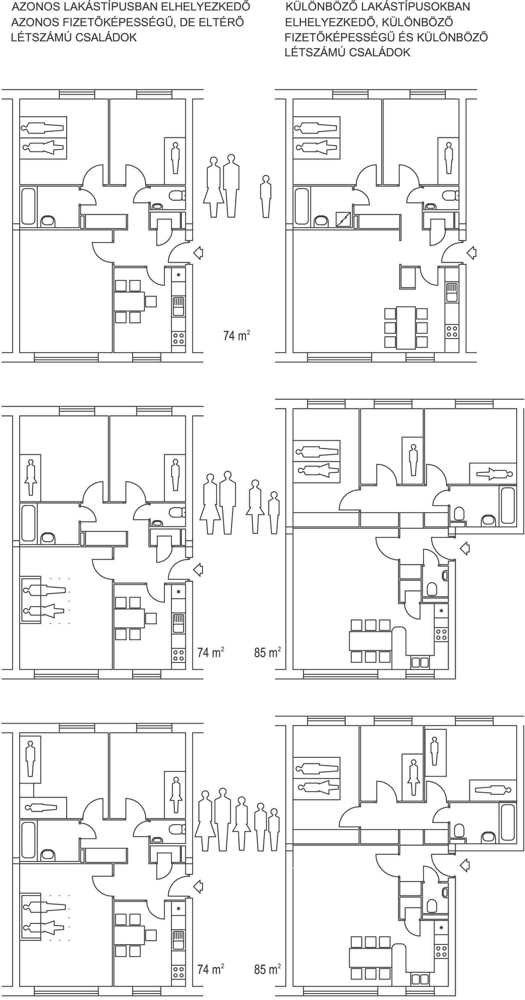
>
> *1.56. ábra – Különböző lakástípusok igénybe vétele lakáspiaci feltételek között*
>
> Ha egy négytagú, két különnemű gyermekkel bíró családtípus igényét tekintjük mérvadónak, az már nem tudja a két és fél szobás lakást megfelelően lakni akkor, ha a nappaliba nem kerülhet fekhely. A konvencionális elrendezés ekkor is használható, ugyanis a szülők hálószobája a nappali lehet, sőt a bemutatott 74 m2-es lakás még három gyerekkel is elfogadható szinten használható. Háromgyermekes családnak kb. 85-90 m2-es lakás kell, ha a nappaliba nem lehet fekhelyet elhelyezni. Ekkora lakás az ország jelenlegi lakáshelyzetében már aligha érhető el minden háromgyermekes család számára, annak ellenére, hogy a szociális támogatásoknál a gyermekek számát is figyelembe veszik.

Bizonyos, szubvencionált lakásberuházásoknál, ahol a többgyerekes, de alacsony jövedelmű családokat előnyben részesítik, vagy olyankor, ha a beruházás helyszíne nem különösen preferált környéken van, és az emiatt mérsékeltebb lakásárak alacsonyabb jövedelműeknek is elérhetők, arra kell számítani, hogy a nappali szobába is fekhely kerülhet az esetek nagy többségében. Ez kizárja a nappali rejtett közlekedőként való felhasználását vagy a konyha teréhez való kapcsolását.

A lakáspiac szempontjait a másik oldalról is érdemes figyelembe venni. Lehetséges, hogy nagyméretű lakásokban kevesen laknak: akár gyermektelen házaspár is építtethet igényes villát magának. Ha azonban a házat el akarják adni – talán azért, mert anyagi helyzetük még jobbra fordul, és jobb helyen, nagyobb házat szándékoznak építeni – akkor a ház kelendőségét nagyon csökkenti, ha a lakás térkapcsolatainál mindössze két személy életvitelét vették figyelembe.

## 1.7. Az akadálymentes lakás – egyetemes tervezés (P.A.; B.J.)

### 1.7.1. Akadálymentes lakás

A különféle építészeti ideológiák és elméletek az EMBERT sokáig valamilyen általános, többé-kevésbé absztrakt fogalomnak tekintették, és igyekeztek meghatározni azt az ember-modellt, amely az építészeti tervezés mértékéül és céljául szolgált (lásd 1.2.1. fejezet). Az idealizált, jó alkatú és erejének teljében lévő ember számára tervezett környezet azonban nem használható mindenki számára: körülbelül a népesség 10%-a rendelkezik valamilyen okból csökkent teljesítőképességgel: mozgásában korlátozott, gyengén lát, gyengén hall, felfogó képességében korlátozott. (A nagyságrend érzékeléséhez elég megemlíteni, hogy ez a csoport lényegesen nagyobb, mint a lakosságnak az a része, amely 6 tagú háztartásban él. Rutinszerűen tervezünk 6 férőhelyes lakásokat, miközben a hátrányos helyzetűekről megfeledkezünk.)

Akadálymentes az a környezet, amelyet mindenki önállóan és biztonságosan tud használni fizikai, érzékszervi vagy értelmi képességeitől függetlenül.

„Akadálymentesen megközelíthető az olyan épület vagy berendezési tárgy, amely a használó fizikai, érzékszervi, és szellemi fogyatékosságának mértékétől függetlenül is lehetőség szerint legönállóbban – külső segítség nélkül – kényelmesen, különösebb erőkifejtés nélkül elérhető. Ehhez megfelelő méretű, magasságú hely biztosított, miközben segédeszközének használata (bot, mankó, járókeret, kerekesszék) nem korlátozott.

Akadálymentesen használható egy épület, ha abban minden szerkezet, berendezési tárgy a használó fizikai, érzékszervi és szellemi fogyatékosságának mértékétől függetlenül lehetőség szerint legönállóbban – súlyos fogyatékossággal bíró használó esetén az állandó kísérőjének segítségével – használható. Ehhez megfelelő méretű, formájú kezelőeszközök biztosítottak, valamint azok elérhetősége és megközelíthetősége is akadálymentes.”

Az ember képességei életciklusa folyamán is változnak: évekig gyerekkocsiban közlekedik, felnőtt korában balesetet szenvedhet, és esetleg mankóval jár egy ideig, megöregedve veszít fizikai és értelmi képességeiből, aggkorára mozgásában is korlátozottá válhat és botra, járókeretre esetleg kerekesszékre szorul. Amennyiben a jelenlegi trend folytatódik, az európai népesség 25%-a lesz 60 év feletti a közeljövőben. A környezet akadálymentes kialakítása tehát a népesség egészét szolgálja, ezért nem tekinthető egy meghatározott embercsoport pozitív diszkriminációjának. Az akadálymentes környezet az emberek közötti esélyegyenlőséget, a hátrányos megkülönböztetés felszámolását szolgálja: például azt, hogy képességeinek megfelelő munkát az is vállalhasson, aki ma a munkahelyek többségét nem tudja megközelíteni mozgáskorlátozottsága miatt, vagy azt, hogy a kulturális szolgáltatásokat – színházi előadásokat, hangversenyeket – igénybe vehesse, étterembe vagy szórakozó helyekre járhasson, hivatalos ügyeit személyesen intézhesse állampolgári jogával élve.

Az 1970-es évektől kezdve a fogyatékos személyek érdekvédelmi szerveződései egyre erősebb politikai erővé váltak, és sok országban elérték esélyegyenlőségük törvényi kodifikációját.

> **Megjegyzés**
>
> Magyarországon az 1997-ben született meg az épített környezet alakításáról és védelméről szóló LXXVIII. számú törvény, amely pontos meghatározásokat és követelményrendszert ad az épített környezet kialakításával kapcsolatban. Ez a törvény az Európai Unió Bizottsága által 1996-ban elfogadott „Az akadálymentesség Európai eszméje” című kézikönyv ajánlására épül, és az OTÉK ebben az ajánlásban rögzített műszaki követelményekkel került kiegészítésre. Ezek a műszaki előírások elsősorban közhasználatú, közszolgáltatást nyújtó épületek kialakítására vonatkoznak. Ugyanakkor „A fogyatékos személyek jogairól és esélyegyenlőségük biztosításáról" szóló 1998. évi XXVI. Törvény (Esélyegyenlőségi törvény) 5.§-a értelmében „a fogyatékos személynek joga van a számára akadálymentes, továbbá érzékelhető és biztonságos épített környezetre”, amelybe beleérthető az akadálymentes lakhatás biztosítása is. Így a lakóépületek tervezésekor – általános követelmény hiányában is – figyelemmel kell lennünk azok egészének (pl. családi házak), vagy egy részének (pl. többszintes többlakásos épületek földszinti lakóegységei, közösségi terei) akadálymentesíthető, adaptálható kialakítására.

A lakóépületek akadálymentes megközelíthetősége és használhatósága nálunk még nem általános követelmény, de a tendenciák ebben az irányban hatnak: az emberek életkor, kultúra és egyéb emberi adottságaik szerinti különbözősége soha nem látott mértéket öltött, így egyre nagyobb igény jelentkezik olyan lakóépületekre, amelyek flexibilitásuk révén az épületet használók életcikluson át változó szükségleteihez költséges és a környezetet terhelő átalakítások nélkül alkalmazkodni tudnak.

Az 1990-es évek végétől kezdve ezért a tervezési folyamatokban az akadálymentes tervezést egyre inkább egy új tervezési paradigma váltja fel: az egyetemes tervezés eszméje.

### 1.7.2. Az egyetemes tervezés

Az egyetemes tervezés eszméje az a preventív gondolkodásmód, tervezési stratégia, amely már a tervezés folyamatának az elején figyelembe veszi a használók képességeinek különbözőségét. E tervezési stratégia gyakorlásával olyan épületek jönnek létre, amelyek különleges tervezési megoldások és adaptáció nélkül biztosítják a lehető legtöbb ember számára a legteljesebb és legönállóbb használhatóságot.

A lakóépületek tervezésénél tehát az a fő cél, hogy minimálisra szorítva az egyéni igényeknek megfelelő adaptálás szükségességét egy lakáskompozícióval szolgáljuk ki a használók különböző, időben, szituációban változó igényeit, szükségleteit.

Ez azt jelenti, hogy nem szükséges valamennyi lakás valamennyi elemét akadálymentes használatra megfeleltetni. Alkalmas méretezéssel elérhető azonban, hogy egy lakás az egyéni igényeknek megfelelően könnyen adaptálható legyen anélkül, hogy azt teljes egészében átépítsék. Az egyébként akadálymentesen megközelíthető lakásoknál (pl. földszinti lakások) az adaptálhatóság követelményének figyelembevétele nyomatékkal javasolható, de bizonyos lakásfajtáknál (pl. öregek otthonházainál, fogyatékos személyek lakóotthonainál, lakócentrumoknál) a teljeskörű akadálymentes kialakítás követelmény.

Az is előfordul, hogy konkrét tervezési megbízás szól a lakás akadálymentes kialakítására: például olyan családi ház esetében, ahol család kötelékében egy mozgásában korlátozott családtag él már az építés idején, vagy olyankor, ha egy meglévő lakás akadálymentesítése szükséges valamelyik családtag balesete vagy maradandó mozgáskorlátozottságot okozó betegsége után.

> **Megjegyzés**
>
> A tervezési elméletek és elvek között több irányzat azonosítható, melyek – nem lebecsülve az árnyalatnyi különbségeket – céljukat és eredményüket tekintve azonosak. Az 1960-as évektől a német nyelvterületen használt „Barrier Free Design" (Korlátok nélküli tervezés) és az 1970-es évektől főleg angol nyelvterületen használt „Accessible Design" (Akadálymentes tervezés) megközelítést az 1990-es évektől kezdődően egyre inkább három új tervezési irányzat váltja fel: „Universal Design" (Egyetemes tervezés), „Design for All" (Tervezés mindenkinek) és „Inclusive Design" (Befogadó tervezés). A három irányzat eredményüket tekintve azonos, így az Európai Unió álláspontját követve a magyarországi szakmai nyelvi közegben jelenleg az Egyetemes tervezés inkább az épített környezet kialakítása tekintetében, a Befogadó tervezés fogalomhasználat inkább a tárgytervezők között használatos.

### 1.7.3. Az akadálymentes lakásterek követelményei

A mozgásukban korlátozottak térigényeit egy kerekesszéket használó személy szükségletei alapján kell meghatározni. (Más segédeszközök: bot, mankó, járókeret mindig használhatók azokon az útvonalakon, amelyek kerekesszékkel is járhatók.) A kerekesszék méreteit és a használatához szükséges hely méreteit az [1.57. ábra](#abra_1_57) mutatja. Helyigény szempontjából különbözik a kézi hajtású és elektromos hajtású kerekesszék. Lehetőleg az utóbbit kell mértékadónak tekinteni.

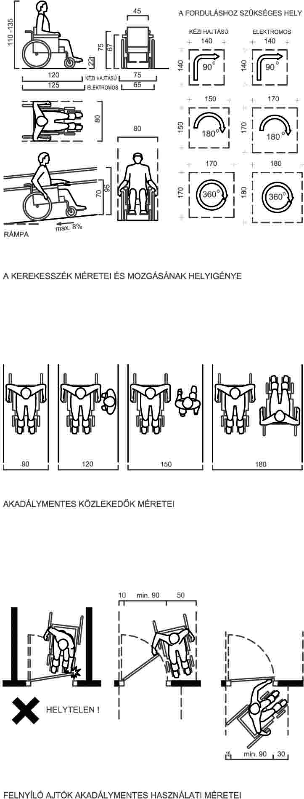

*1.57. ábra – A kerekesszék méretei és mozgásának helyigénye*

A lakáson belüli közlekedés megtervezése során a bútorok közötti közlekedő sáv szélessége 90 cm, magas felületekkel (fallal, beépített bútorral) elhatárolt közlekedő helyiség szélességi mérete legalább 120 cm legyen. Ha a közlekedőről oldalirányban is ajtók nyílnak, szélessége ne legyen kevesebb 150 cm-nél ([1.58. ábra](#abra_1_57)).

Az ajtónyílások szabad belmérete legalább 90 cm legyen. Ügyeljünk arra, hogy kétszárnyú ajtók esetén egy szárny nyitva tartásával is biztosított legyen az előírt szabad szélesség, így egy babakocsi vagy kerekesszék áthaladásához nem szükséges a többnyire körülményesen és nehézségek árán nyitható második szárny kitárása. Kisebb nyílásszélességű kétszárnyú ajtó esetében így a fenti követelményt aszimmetrikus szárnyú ajtószerkezet beépítésével lehet a legegyszerűbben megoldani.

Kerüljük a küszöb kialakítását! Ha a küszöb nem kerülhető el (például vizes helyiségek esetében), akkor az maximum 2 cm magas és lehetőleg legömbölyített vagy letört legyen, hogy kerekesszékkel könnyebben át lehessen rajta menni, illetve hogy az másoknak se okozzon botlásveszélyt.

Ahhoz, hogy az ajtó kerekesszékben ülve is jól megközelíthető, kinyitható, ill. becsukható legyen, az ajtó kilincs felöli oldala mellett az ajtó szélességén felül is szabad helyet kell biztosítanunk. Ez a helyigény az ajtó külső oldalán (ahová az ajtó nyílik) 0,50-0,55 m, az ajtó másik oldalán pedig 0,30 m széles szabad sávot jelent. Az ajtók használati zónáinak méretét az [1.59. ábra](#abra_1_57) mutatja.

Előnyben kell részesíteni a tolóajtókat, használatukhoz erőtlenebb kézzel is megmarkolható fogantyút kell felszerelni az ajtólap élénél.

A közös időtöltés (társalgás) és étkezés számára szolgáló helyiségek alapterülete a funkcióból adódóan az általános használati térigény biztosításával megfelelő nagyságú az akadálymentes használathoz: a bútorok számának csökkentésével vagy a bútorok átrendezésével biztosíthatjuk a kerekesszékkel történő közlekedés és megfordulás helyigényét.

A közös időtöltés (társalgás) szokásos bútorcsoportjában jellemzően az egyik fotel helyén elfér kerekesszék. A kanapét, foteleket érdemes úgy elhelyezni, hogy legyen egy hely, ahonnan a kerekesszékes családtagnak nem kell állandóan eltolni a fotelt, hanem mindig szabadon odagurulhat. A járókerettel, mankóval közlekedők segédeszközeinek számára biztosítsunk helyet az ülőgarnitúra közelében, ahova azt beszélgetés, TV nézés, stb. alatt le lehet tenni, le lehet támasztani. Mivel a nappali hosszabb időtöltésre szolgál, ajánlott biztosítani a kerekesszékes családtag részére is az ülőgarnitúrára történő átülés lehetőségét.

Az ülőgarnitúra elhelyezése esetén gondoljunk arra, hogy a hallássérültek számára előnyösebb, ha nemcsak egymás mellett, hanem derékszöget bezárva, valamint egymással szemben is le lehet ülni, így biztosíthatjuk számukra a szájról olvasás lehetőségét. Az ablaknak háttal nem javasolt ülőgarnitúrát elhelyezni, mert azokat az ülőhelyeket elfoglalva a személyek arca árnyékban lesz, így a szájról olvasás, a mimika érzékelésének lehetősége nem biztosított, a kommunikáció nehézkesebbé válhat.

A közös étkezés helyének méretezésénél egy, kerekesszéket használó személy helyszükségletével kell számolni az [1.60.b. ábrán](#abra_1_60) mutatott méretezés szerint. Ügyelni kell arra, hogy az étkező asztal kerekesszékkel is megközelíthető és térdszabad kialakítású legyen. A székeket érdemes úgy elhelyezni, hogy legyen egy hely (például az asztal egyik vagy mindkét vége), ahonnan a kerekesszékes családtagnak nem kell állandóan eltolni a széket, így akadály nélkül mindig elfoglalhatja helyét az asztalnál. A járókerettel, mankóval közlekedők segédeszközeinek számára biztosítsunk olyan helyet az étkezőasztal közelében, ahova a segédeszközt az étkezés alatt le lehet tenni, le lehet támasztani anélkül, hogy az mások mozgását illetve a felszolgálást zavarná.

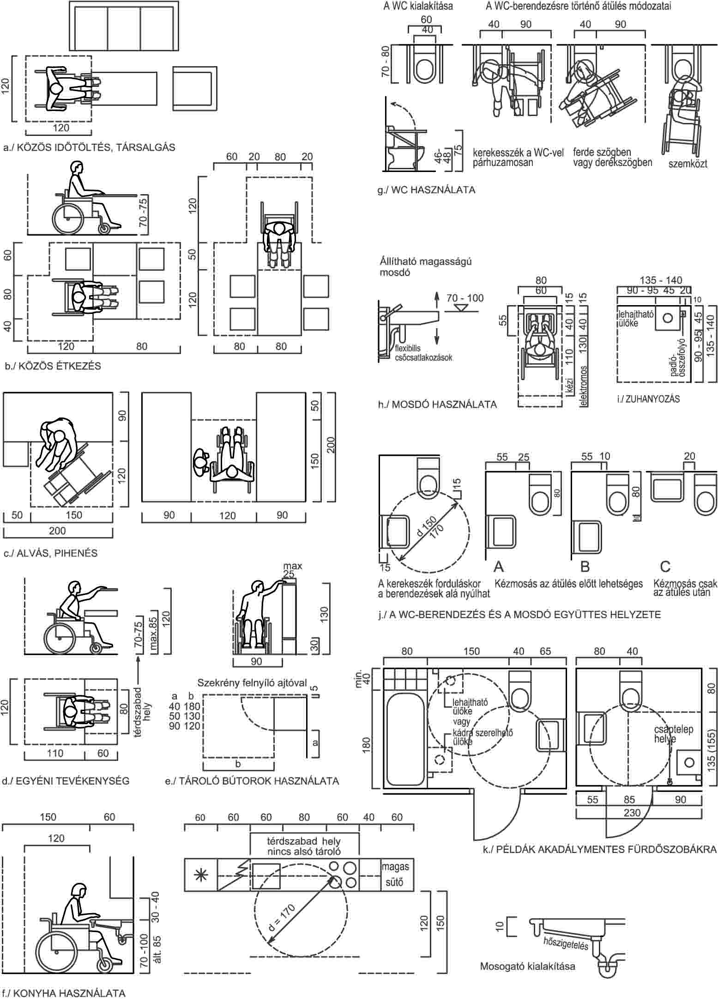

*1.60. ábra – Lakástevékenységek helyigénye akadálymentes lakásban*

Az alvás helyszükséglete a 90 x 200 cm méretű ágy mellett legalább 120 x 150 cm méretű használati zóna a kerekesszékről történő átszálláshoz ([1.60.c. ábra](#abra_1_60)).

> **Megjegyzés**
>
> A súlyosabban, halmozottan sérült személyeket betegemelő berendezés használóval segíthetjük az ágyba fektetni, illetve onnan a kerekesszékbe átültetni. A betegemelő berendezések lehetnek kerekeken gördülő mobil, valamint a mennyezeten rögzített síneken mozgó kialakításúak. Betegemelő berendezés használatának igénye esetén a helyiség bebútorozásánál gondoskodjunk a berendezés mozgatásához, valamint a segítő személyzet részére szükséges szabad területről. Ez a terület legalább 2,0 m szélességű alapterületet jelent az ágy mellett.

A hálószobában vagy az ahhoz kapcsolódó gardróbhelyiségben elhelyezett ruhásszekrények esetében ügyelni kell arra, hogy azok előtt mindig legyen annyi hely, hogy az segédeszközzel, pl. kerekesszékkel is megközelíthető legyen. Ügyeljünk arra is, hogy a szekrényajtók kerekesszékben ülve vagy más segédeszközt használva is kinyithatók, kitárhatóak legyenek. A könnyebb használhatóság érdekében a szekrényajtók „kivető-pántosak" és 180°-ban kitárhatóak legyenek. Előnyös és helytakarékos megoldás a tolóajtóval, vagy speciális bútor-redőnnyel szerelt gardróbszekrény beépítése.

Az egyéni tevékenység, szellemi munka céljára szolgáló asztal alatt legalább 80 cm széles „térdszabad” hely legyen, az asztal legfeljebb 85 cm magasságban legyen. A használati zóna mélysége legalább 110 cm, szélessége 120 cm. A munkához használt könyvek, eszközök számára elhelyezett polc ne legyen 120 cm-nél magasabban ([1.60.d. ábra](#abra_1_60)).

> **Megjegyzés**
>
> Térdszabad kialakítás azt a szabad helyet jelenti, amely biztosítja a beépített berendezések valamint munkafelületek (pultok, asztalok) kerekesszékkel történő megközelíthetőségét és kényelmes használhatóságát. A használó térdének, valamint a kerekesszék karfájának és lábtartójának a munkafelület, illetve berendezési eszköz alá gördülését semmilyen szerkezet, benyúló elem nem korlátozhatja.

A kerekesszékről is elérhető tárgyak tároló felülete nem lehet 130 cm-nél magasabban és 30 cm-nél mélyebben. Ajtós szekrények használatához szükséges helyet az [1.60.e. ábra](#abra_1_60) szerint kell meghatározni. Előnyben kell részesíteni a tolóajtóval kialakított szekrényeket.

A konyhák kialakításánál az általános alapelveknél leírtak fokozott figyelembevétele szükséges: a konyhában a különböző konyhai munkafolyamathoz szükséges berendezések, munkafelületek összevont csoportokban, összefüggő technológiai felületet alkotva helyezkedjenek el. Ellenkező esetben mindenkinek kényelmetlenné, hosszadalmassá válik az ételkészítés, de különösen a kerekesszékkel, járókerettel, mankóval közlekedő használóknak okoz nehézségeket, hiszen nekik a segédeszközük használata miatt mozgás közben mindkét kezük foglalt, így a konyhai munkafolyamatok során ők csak nehézségek árán, vagy egyáltalán nem tudják arrébb vinni, áthelyezni a szükséges dolgokat (pl. forró vízzel telt edényt). Az ételkészítés (konyha) berendezéseit úgy kell kialakítani, hogy az összefüggő technológiai felület (mosogató – feldolgozó felület – tűzhely) alatt megszakítatlan „térdszabad” űrszelvény maradjon, ahova nem lehet alsó tárolókat elhelyezni. A munkapult ideális magassága 0,85-0,90 m. Ügyeljünk arra, hogy a kerekesszékes vagy idős használók számára ideális, ha az összefüggő technológiai felület főbb funkciói egy helyben állva elérhetőek, hogy a főzés során szükséges helyzetváltoztatásokat minimálisra csökkentsük. Ennek érdekében a mosogató és tűzhely közötti távolság – a feldolgozó felület hossza – 80 cm-nél ne legyen hosszabb.

Az egy pozícióból végezhető teljes munkafolyamat a mosogatás esetében is kiemelt jelentőséggel bír a felesleges helyzetváltoztatások csökkentése érdekében: ügyeljünk arra, hogy a mosogatásnál a mosogató egyik oldaláról lehessen elvenni a használt edényeket és a másik oldalon a csepegtetőbe rakni a tisztákat. A mosogató alsó felületét hőszigeteléssel kell ellátni, nehogy a használó érzéketlen térdét megégesse a mosogatóba öntött forró víz. Mosogatógépnél fontos hogy az edények kerekesszékben ülve is biztonságosan behelyezhetőek, illetve elérhetőek legyenek.

A sütő mindig magasabbra helyezett, szekrénybe épített sütő legyen. A tűzhelynek, a sütőnek és a mikrohullámú sütőnek lehetőleg mindkét oldalán biztosítsunk rakodófelületet a forró étel könnyű levételének, kivételének érdekében. Ha ez konyhapulttal nem megoldható, akkor kihúzható rakodó lapokat építsünk be a tűzhellyel, sütővel, mikrohullámú sütővel szomszédos konyhaszekrénybe.

A konyhabútorok ajtói tolóajtók vagy „kivető-pántosak” legyenek, 180 fokos szögben legyenek kinyithatók, hogy a használati zónába az ajtólapok ne álljanak be. Előnyös a fiókos elemek használata, amelynek tartalma felülről ellenőrizhető és kiszedhető. Ajtós elemek előtt a használati zóna legkisebb szélessége 150 cm, az alsó tárolót nem tartalmazó elemek előtt 120 cm. A kerekesszék 180 fokban történő megfordulásához 170 cm átmérőjű kört kell, egy helyen, szabadon hagyni. Ez a térdszabad felületek alá nyúlhat. A felső tárolóknak legalább az alsó polcfelülete a kerekesszékből elérhető legyen, 120 cm-nél nem magasabban ([1.60.f. ábra](#abra_1_60)).

A hűtőnél a kerekesszékből történő elérési magasságra kell ügyelni: a pult alá helyezett kisebb hűtő esetében problémát jelent az alsóbb polcok, fiókok elérése és használata. Javasolt a hűtőt a padlószinttől 0,30 m-rel megemelni, vagy olyan kombinált, hűtő-fagyasztó berendezést választani, ahol a fagyasztó funkció alul, a hűtő felül helyezkedik el.

Az egészségügyi helyiségek kialakítása az akadálymentes lakás tervezésének legkritikusabb része, mert a berendezési tárgyak elrendezése a csökkent fizikai képességű használó egyéni adottságaitól is függ ([1.60.g. ábra](#abra_1_60)).

A felhajtható kapaszkodóval ellátott WC berendezés elhelyezésénél a kerekesszékből történő átülés módozatát figyelembe kell venni. Az átülés (transzfer) történhet úgy, hogy a kerekesszékkel a WC berendezés mellé, azzal párhuzamosan áll be a használó (ez a legritkább: főleg láb-amputáltaknál szokásos); lehetséges, hogy a kerekesszék derékszögben vagy ferdeszögben áll meg a berendezés előtt. Ennél a két esetnél sokszor nem közömbös az átülés iránya, attól függően, hogy a használó izomzata melyik oldalon épebb (jobboldali vagy baloldali transzfer). Lehetséges, hogy a használó a berendezéssel szemben áll meg, és 180 fokos fordulat közben segíti át magát az ülőkére. (A transzfer módozatai azonos személy esetén nem „csereszabatosak”, annak sajátos mozgásképességétől függenek.)

A mosdó lehetőleg állítható magasságú, esetleg dönthető legyen (lehet, hogy a fürdőszobát más családtagok is használják). Ilyenkor flexibilis csőcsatlakozásokat kell beépíteni.

A fürdéshez nem lehet peremes zuhanytálcát beépíteni, a zuhanyzóhely a padlóburkolat folytatásaként legyen kialakítva, legalább 2%-os lejtéssel a sarokban elhelyezett padlóösszefolyó felé. A zuhanyzórészben biztosítsunk megfelelő kapaszkodási lehetőséget és lehajtható zuhanyülőkét, hogy abba a zuhanyzás időtartamára át lehessen ülni a kerekesszékből. A lehajtható zuhanyülőke idős használóknak is komoly segítséget jelent a tisztálkodásnál. Az ülőke megközelítésének helyigénye és a kerekesszékből történő átülés módjai hasonlóak a WC-csészénél leírtakkal. Általában egy használó ugyanúgy ül át a WC-csészére is, mint a zuhanyülőkére. A kényelmes és biztonságos használat érdekében a zuhanyrózsa és a csaptelep mindig a zuhanyülőkére merőleges falszakaszon helyezkedjen el és ne mögötte, vagyis a zuhanyzót optimálisan falsarokban lehet megfelelően kialakítani ([1.60.h. és i. ábra](#abra_1_60)).

> **Megjegyzés**
>
> Bizonyos egyéni képességek esetén a mozgásukban korlátozott személyek számára a fürdőszobában elhelyezett kád is lehetőséget nyújthat a tisztálkodásra: ebben az esetben a kádba történő beülést kell segítenünk. Ezt tehetjük különböző forgalmazóknál kapható kádülőkékkel, amelyek ülő részének forgathatósága és süllyesztési lehetősége biztosítja, hogy kis erőkifejtéssel beülhessünk a kádba. Időskorúaknak lehet, hogy elegendő egy a kád mellett felszerelt kapaszkodó is. Aktív, erős felsőtestű kerekesszékes használóknál elképzelhető olyan megoldás is, hogy a kád végében alakítunk ki egy épített ülőfelületet, amelyre a használó a kerekesszékből át tud ülni, majd onnan a kádba a falon rögzített kapaszkodók segítségével be tud ereszkedni. ([1.60.k ábra](#abra_1_60))

A WC és mosdó kölcsönös helyzeténél azok a megoldások előnyösebbek ([1.60.j. ábra](#abra_1_60) A és B esete), amelynél a mosdó elérhető a WC ülőkéről, így még az átülés előtt kezet lehet mosni. Az „A” változat az alkalmanként igénybevett segítő számára is helyet biztosít a sarokban. Ajánlatos a mosdó mellé flexibilis csőcsatlakozású zuhanyzót altest-mosáshoz felszerelni.

A fürdőszobában is szabadon kell hagyni a forduláshoz szükséges a 150, ill. 170 cm átmérőjű kört: ez részben a lábmagasság felett lévő berendezések alá is nyúlhat.

Más elrendezés szükséges, ha a mozgásában korlátozott egyén nem képes az egészségügyi berendezéseket önállóan használni, és állandó segítségre szorul. Konkrét esetekben személyre szabottan kell a tisztálkodó helyiséget megtervezni, hozzáértő rehabilitációs szakmérnök és – ma már kiterjedt – szakirodalom segítségével.

A lakáskompozíció megtervezésénél a lehetőleg egyenes vonalvezetésű közlekedő sávokat kell kialakítani, és kevés közlekedő helyiséget tartalmazó elrendezésre kell törekedni. A fürdőszoba és hálószoba közvetlen, ajtós kapcsolata kívánalom.

A látássérültek, hallássérültek és értelmi fogyatékos személyek lakóegységek kialakításával kapcsolatos speciális igényeire itt most nem térünk ki: ezek a szakirodalomban megtalálhatók. Onnan nyerhetők információk egyes speciális részletek kialakításának módozataira is (jelek, szerelvények, padlófelületek, korlátok, fogódzók, stb.)

A lakóházak lakáson kívüli tereinek akadálymentes kialakítására az egyes lakóépületfajták tárgyalásánál a későbbi fejezetekben kitérünk.

# 2. A lakókörnyezet

## 2.1. A fejezet témaköre

A lakókörnyezet, mint a településkörnyezet szerves része, elsősorban a településtervezés tudományának és gyakorlatának témakörébe tartozik. Ez a fejezet mindössze annyit tartalmaz ebből az összetett és kiterjedt ismeretkörből, amennyi a lakóházak tervezéséhez nélkülözhetetlennek ítélhető akkor, ha a hallgató úgy kezdi el lakóépület-tervezési tanulmányait, hogy előtte településtervezést nem tanult.

Az építészet helyhez kötött: lakóépület csak egy konkrét helyen, meghatározott környezetben építhető meg. Az előző fejezetben elemzett „lakás” fogalma mindaddig absztrakció, ameddig az lakóház formájában nem jelenik meg. Magának a lakásnak nagyságát, helyiségeinek kialakítását, helyiségkapcsolatait is befolyásolja a konkrét építési hely. A helyszínen elérhető munkahelyek jellege (az építtető foglalkozása), ezzel kapcsolatos jövedelmi viszonyai, az életmódját befolyásoló, társadalmi csoportjára jellemző helyi kultúrminták, az elérhető kereskedelmi és kulturális szolgáltatások stb. többé-kevésbé meghatározzák a lakáshasználatra vonatkozó igényeket és lehetőségeket. Másfelől, az építési helyszínt magában foglaló település nagysága, közlekedési kapcsolatai, az adott településrész infrastrukturális ellátottsága, meglévő karaktere, a telekárak, az ott elérhető építőipari vállalkozások nagyságrendje stb. a használó által egyáltalán elérhető lakóházfajták jellegét határozzák meg. Éppen ezért az egyes lakóépületfajták sajátosságait csak környezetükkel való egységben lehet értelmezni.

> **Megjegyzés**
>
> A „fenntartható fejlődés” fogalma helyett a „fenntarthatóság” fogalmát használjuk a lakókörnyezetet taglaló témakörben is. A fejlődés szó a közgondolkodásban a növekedéssel van összekapcsolva, ami gyakran téves értelmezés. Például, a statisztikailag nyilvántartott országos lakásállomány számszerű növekedése már nem szükséges, de annál fontosabb lenne a kor igényeinek nem megfelelő minőségű és/vagy csak pazarló módon üzemeltethető lakások folyamatos lecserélése korszerű és költséghatékonyan üzemeltethető lakásokra. A „hol legyen az új lakás, lakóépület?” kérdés ma már megelőzi a „milyen legyen a lakás?” kérdését. A fenntarthatóság szempontjából alapvető a lakókörnyezet vizsgálata akár meglevő települési vagy táji környezetről akár új lakókörnyezet kialakításáról van szó.
>
> A környezeti fenntarthatóság azt igényli, hogy a meglevő, a természettől már építéssel elvett területet használjunk a továbbiakban is, és ne vegyünk el új területeket a tájból. Ugyanakkor kívánatos lenne a lakókörnyezet szempontjából nem megfelelő terület más célú hasznosítása, vagy a különböző eszközökkel történő javítása.
>
> A lakókörnyezet kérdését együttesen kell vizsgálni mind a meglevő mind az új lakóterületekre vonatkozóan. (N. Á.)

## 2.2. A környezet

A környezet a bennünket körülvevő jelenségek összessége. Beszélhetünk közeli – közvetlen – környezetről és tágabb környezetről. Az építészetben *közvetlen környezetnek* szokás nevezni a használati tereket, épületeket vagy épületcsoportokat, az azokkal szerves összefüggésben lévő szabad (zöld-) területekkel együtt. A *tágabb környezet* a településrész, a település, térség, nagytérség (régió).

Környezetünket különböző szempontok szerint vizsgálhatjuk, bár környezetünk egységes egész.

A *természeti környezet* magában foglalja mindazokat az anyagi természetű jelenségeket, amelyek nem emberi tevékenység termékei (éghajlati, topográfiai adottságok, a bioszféra helyi sajátosságai).

Az emberi közösség tudatos együttműködése hagyományozott szabályrendszer szerint történik, amely szabályok összességét a szó tágabban értelmezett jelentésében kultúrának nevezzük. A kulturális minták és szabályok szerint együttműködő emberi közösséget társadalomnak hívjuk, amely szintén az egyén környezetét adja: ez a *társadalmi környezet.*

Egy adott térségben élő, egységes kultúrával rendelkező társadalomban *kulturális környezetről* beszélhetünk.

A fejlett kultúrákban a javak termelése és cseréje meghatározott rendszer szerint történik, ez alapján szokás *gazdasági környezetről* is beszélni.

A célszerű emberi tevékenységgel létrehozott objektumok összességét *művi környezetnek* nevezzük, amelynek része az *épített környezet*. Mondják, hogy az épített környezet a társadalom „kollektív memóriája”, vagyis a kultúra hagyományozásának egyik eszköze, így magának a kultúrának része. A művi környezet felfogható a természeti és társadalmi környezet kölcsönhatásának megjelenéseként.

### 2.2.1. A fenntartható lakókörnyezet (N. Á.)

A lakhatási körülmények évezredek során kialakult megoldásait a „fenntarthatóság” folyamatosan formálódó kritériumrendszere új aspektusokkal gazdagítja, részben a technikai változások, részben az életkörülményekben beállt jelentős eltérések miatt, általában a Föld eltartó képességének megtartása és az egészséges környezet létrehozása érdekében.

Az EU országai egyenként, de maga az EU is egyre több – főként energetikai – követelményt fogalmazott meg, melyek alapján – a háztartási eszközök energetikai besorolásához hasonlóan – az épületeket is besorolhatjuk. Az alapelv egyre biztosabb alapokon nyugszik: „kielégíti a jelen szükségleteit anélkül, hogy csökkentené a jövendő generációk képességét arra, hogy kielégítsék a saját szükségleteiket”. A gazdaság, a társadalom és a táji környezet pilléreit tekintve el kell fogadnunk, hogy azok egymásba ágyazottak: az ökoszisztéma alrendszere a társadalom, és a társadalom alrendszere a gazdasági fejlődés. A cél megfogalmazásakor az ökológiai fenntarthatóság a döntő, azonban az eredményes beavatkozás során az alrendszerek komplex figyelembe vétele elengedhetetlen. Ezért minden esetben tekintetbe kell vennünk az alrendszereken belül elérhető lehetséges eredményeket annak érdekében, hogy az ökoszisztéma fenntartható maradjon.

A „Gondolkodj globálisan, cselekedj lokálisan” nem csak a helyszín szempontjából kell, hogy alapelv legyen, hanem meg kell tanulnunk, hogy a kis- vagy részeredmények nélkül nem lesz nagyobb léptékű eredmény sem. Ezért a tervezés, az építés és a fenntartás során minden egyes előrelépés számít.

A közbeszédben a korábban szinte kizárólag a táji-természeti környezet fenntarthatóságaként értelmezett zöld irányzatok mára életünk szinte minden területét átszövik, az étkezés, a tisztálkodás, a szabadidő eltöltése, az iskola és a munkahely is lehet már öko, vagy zöld.

Az építésben a környezet fenntarthatósága a táji, természeti környezet mellett a kulturális és épített környezetet is jelenti. A gazdasági pillér a pénzügyi rendszerre, a megvalósítás és az üzemeltetés kérdéseire, a szociális pillér pedig a jelen és jövő szociális rendszerében egyaránt alkalmas, rugalmas megoldásokra való törekvést jeleníti meg.

A lakókörnyezet esetében – a „posztmodern” lezáródásával, és a zöld mozgalmak megjelenésével – az új fogalmak az 1980-as évektől folyamatosan alakulnak.

Az „energiatakarékos épület” kritériumrendszerének megalkotásával az energiaválság első hulláma utáni évtizedben az energiafelhasználás csökkentését helyezték fókuszba. Ez a kritériumrendszer lett később a hőtechnikai szabványok alapja.

A „szolár építészet” a rendelkezésre álló napenergia befogadását (passzív szolár épületek) vagy további technikai eszközökkel való kinyerését és felhalmozását (aktív szolár épületek) ötvözte a fosszilis energiahordozókkal való takarékossággal.

Az „energiatudatos építészet” már komplexen kezelte az energiafelhasználás kérdését, a tudatosságot az épületen belüli folyamatokra is alkalmazta, a belső hőnyereségek, a technológia figyelembevétele és megfelelő hangolása, a magas komfortigény alacsony fosszilis energiafelhasználással való megvalósítása valóságos gépészeti forradalmat indított el, nagy részben a számítógépek és ellenőrző rendszerek fejlődésének köszönhetően.

A „környezettudatos építészet” a természeti környezet óvását is bevonta a vizsgálati körbe, így új elem lett az anyaghasználat környezetre gyakorolt hatásának vizsgálata, az építőanyagok életciklus-elemzése a korábban már elfogadott használat közbeni energiafelhasználási mutatók elemzése mellett.

A „zöld- vagy bio-építészet” az egészségre gyakorolt hatást is kiemelt szempontként kezeli, vagyis a létrehozott épületnek a használóra közvetlenül tett hatását (fiziológiai és pszichés hatás egyaránt) is bevonja a vizsgálatba.

Az „ökologikus építés” tekintetbe veszi az előbb felsoroltakon kívül a helyi vagy közeli természetes nyersanyagforrásokat, a méltányos kereskedelmet és a helyi munkaerőt is. Az életciklus elemzést teljes ciklusra végzi, a nyersanyag kitermeléstől az építésen és a hasznosításon át a bontásig.

A fenntarthatóság eléréséhez szükséges, hogy a folyamatokat körfolyamatokká alakítsuk, mégpedig külső energiaforrás bevitele nélkül, úgy hogy hulladék ne keletkezzen, miközben a fenntartható társadalmat tekintjük közvetlen célnak a tervezés és építés területén. Rendszerben kell gondolkodni: olyan rendszert létrehozni, amelyben a természeti, társadalmi és gazdasági célok egyaránt megvalósulnak.

Ennek érdekében a lakókörnyezet kialakítása során, a lehetséges közműellátás áttekintésekor, figyelembe kell venni a jelenleg még csak kialakulóban lévő új megoldásokat is. Arra kell törekedni, hogy az egyes épületek vagy nagyobb egységek bizonyos mértékű autonómiát élvezhessenek, és ha lehetséges, a közösségek választhassák meg az energiaforrásaikat vagy akár a hulladékkezelés módszerét. A tervezés során javasolt az alternatív energiatermelést és hulladékkezelést figyelembe venni a helyigény, a tájolás és egyéb körülmények biztosítására. A napenergia befogadását, a szélenergia, az esővíz hasznosítását, a talajvíz megfelelő használatát, a hulladékkezelés alternatív módjait mind figyelembe vehetjük, még abban az esetben is, ha az adott pillanatban még azok megoldására nincs mód, hiszen a következő évtizedekben már reális lehetőséggé válnak.

A szemléletmód finomodása mellett az elmúlt két évtizedben több kísérleti technika is naprakész termékké fejlődött. A megújuló források lehetséges eszközparkja kibővült, használatával kapcsolatban egyre több a tapasztalat, az épületekkel kapcsolatos igények és a minőség értékelése standardizálódott. Kialakult a minősítés rendszere is.

## 2.3. A település, településrendezés

### 2.3.1. A településrendezési szabályok

Az ország teljes területe települések (falvak, városok) területi határai szerint tagolódik közigazgatási értelemben. A közösség részvételét saját környezetének szabályozásában a demokratikus intézményrendszer hivatott biztosítani. Az Alaptörvény kereteiben létrehozott építési törvényt a parlament alkotja meg. Az építési törvény alapján készülnek el az Országos Településrendezési és Építési Követelmények (röviden OTÉK), amelyek országos érvényű szabályokat rögzítenek. Az OTÉK rendelkezéseinek betartásával készítik el az egyes települések helyi építési szabályzatát, amelyhez az adott településre vonatkozó helyi településszerkezeti terv és szabályozási terv tartozik. A helyi érvényű építési szabályokat (az említett tervekkel együtt) a település vagy településrész illetékes önkormányzata hagyja jóvá, emeli törvényerőre. A törvényi szabályozás hierarchiájában az alsóbb szintek rendelkezései nem mondhatnak ellent a felettük állóknak.

Az alkotmányos jogrend törvényeiből műszakilag értelmezhető szabályokat műszaki szakemberek – közöttük építészmérnökök – hoznak létre az OTÉK szintjétől a helyi előírásokig. A parlament vagy a helyi a képviselő testületek döntésre illetékes tagjai általában nem szakemberek, ezért a döntés-előkészítésben résztvevő építészek felelőssége rendkívül nagy azért, hogy tevékenységük során az állampolgárok egyéni és közösségi érdekeit és jogait érvényesítsék, a településfejlesztéssel a lakosság életminőségét valóban emeljék, és az épített környezet kulturális értékeit is megőrizzék, fejlesszék. Az építési előírások általában időszakos érvényűek, a társadalom jogrendjének, gazdasági lehetőségeinek változásaival együtt időről-időre módosulnak. Egy adott időszak törvényerejű építési szabályait nem kell tehát tudományos érvényű axiómáknak tekinteni, de be kell őket tartani, éppúgy, mint minden más törvényt.

### 2.3.2. A települések szerkezete

A települések területén a természeti és művi környezet elemei sajátos összefüggésben állnak egymással, amelynek rendszerét a település szerkezetének nevezzük. A szerkezet elemeinek összefüggésrendszerét végső soron a településeken folyó élet teremti meg.

A településszerkezet a település minden elemét tartalmazza, de a településszerkezet tervezése – a településszerkezeti terv – csak a meghatározó elemekre terjed ki.

> **Megjegyzés**
>
> „A településszerkezeti terv meghatározza a település alakításának, védelmének lehetőségeit és fejlesztési irányait, ennek megfelelően az egyes területrészek felhasználási módját, a település működéséhez szükséges műszaki infrastruktúra elemeinek a település szerkezetét meghatározó térbeli kialakítását és elrendezését, az országos és térségi érdek, a szomszédos vagy a más módon érdekelt többi település alapvető jogainak és rendezési terveinek figyelembevételével a környezet állapotának javítása vagy legalább szinten tartása mellett.” (1997. évi LXXVIII. törvény az épített környezet alakításáról és védelméről. 10. § (1))

A rendezés során a települések területét beépítésre szánt és beépítésre nem szánt részekre tagolják, és ezen belül *területfelhasználási egységekbe* sorolják. A *beépítésre szánt* területfelhasználási egységeket az általános használat jellege szerint megkülönböztetik lakó-, vegyes, gazdasági, üdülő-, különleges területként. Lakóházak építésére elsősorban a lakó- és a vegyes területek szolgálnak.

*A* közterületek *általában önkormányzati tulajdonban vannak, használatuk mindenki számára nyitott, fenntartásukról az önkormányzat gondoskodik (utcák, terek közparkok). A közterületek összefüggő hálózatot képeznek, a település közműhálózata alattuk húzódik.*

### 2.3.3. A településrendezés egyéb aspektusai (N. Á.)

A településrendezés eszközei alkalmasak arra, hogy a megfelelő települési mikroklíma elérését elősegítsük.

Ilyen lehetőség fasorok, kettős fasorok, zöldsávok előírása a közlekedési felületek mentén – ezzel is csökkentve a porszennyezést és zajterhelést a közvetlen lakókörnyezetben.

Jó eszköz a nagyobb összefüggő zöldfelületek előírása a településen belül és annak határai mentén, mert ezek biztosítják a település levegőjének jobb oxigénellátását és a levegő széndioxid tartalmának csökkentését. Az erdősítések jótékony hatása is többféle: a mikroklíma javításán, az egyenletesebb csapadékeloszlás segítésén és a szabadidős tevékenységek lehetőségének kiterjesztésén túl az energia- vagy egyéb haszonerdők a biológiai változatosság megőrzését is szolgálják.

A csapadékvíz útjának tervezése a hasznosítás érdekében települési szinten is átgondolandó feladat.

Fontos a benapozás vizsgálata, különösen változó domborzati viszonyok között. Az árnyékolt településrészeken nem lakófunkciót, hanem gazdasági vagy kereskedelmi területeket javasolt kialakítani.

A széliránynak és szélerősségnek is megfelelő településtervezés során az erősen széljárta helyeken lehetőség van egyes területek energetikai hasznosítására, szélkerekek elhelyezésére. A mérsékelt széljárású területeken lehetőség van – különösen a nyári időszakban – megfelelő növényzettel és vízfelülettel a nyári légmozgás általi átöblítést biztosítani.

Nyitottnak kell lenni azokra a szabályozásokra is, amelyek az épített környezet és természeti környezet összhangját helyezik előtérbe. A települések szerkezeti tervezése során is szükség van puffer területekre, olyan zónákra, amelyeket a későbbi, esetleg ma még nem szokásos funkciókra tudunk majd igénybe venni.

## 2.4. A közművesítés, laksűrűség

Száz évvel ezelőtt falvainkban az akkori higiéniai normáknak és környezeti állapotoknak még megfelelt az ásott kút, űrgödrös árnyékszék, a „közmű” – a település közössége által létrehozott és fenntartott létesítmény – legfeljebb a földút volt és jobb esetben a csapadékvíz elvezetésére ásott árok.

A mai lakáshasználati normák miatt a lakóépületekből nem nélkülözhető a vezetékes víz, a vízöblítéses illemhely és az elektromos energia. Az ivóvízhálózat és elektromos energiahálózat kiépítése viszonylag olcsó, ezért településeink legnagyobb részén e két tényező – amely az un. „részleges közművesítést” jelenti – ma már adott.

Rendkívül súlyos környezeti problémát jelent azonban, hogy a vízvezetékhálózat kiépültével nagyságrendileg megnőtt a lakásokban keletkezett szennyvizek mennyisége. (Fejenként és naponta átlag 140-150 liter szennyvíztermeléssel számolhatunk, ezért egy háromtagú család a mosogatással, tisztálkodással és WC használattal csaknem fél köbméter szennyvizet termel naponta.) Ha a településeken ilyen mennyiségű szennyeződés közvetlenül a talajba jut, a talajvizet elfertőzi, bejut az élővizekbe, és fokozatosan leszivárog a vízadó rétegekig is, ahonnan ma még tiszta ivóvíz nyerhető. Manapság kisebb településeink legnagyobb környezeti problémáját az un. „közműolló” jelenti: a közcsatorna hálózat nélkül kiépült vízvezeték hálózat. Szemben a vízvezeték- és elektromos hálózattal, a közcsatorna kiépítése igen drága, egyrészt a nagyobb csőkeresztmetszetek, az esetleg szükséges átemelő szivattyúk, másrészt a központi szennyvíztisztító telep költségei miatt, ugyanis a szennyvíz csak megfelelő tisztítás után engedhető az élővizekbe.

A szennyvíz elhelyezésének ideiglenes megoldásaként előírhatják zárt szennyvíztároló építését a telken belül, ahonnan a szennyvizet tartálykocsikkal kell elszállítani. Ennek üzemeltetése azonban rendkívül drága (hiszen egy 4-5 fős háztartásban hetenként termelődik egy fuvarnyi szennyvíz), és nyitva marad a szennyvíz tisztításának kérdése. Legfeljebb olyan területen lehet zárt szennyvíztároló megengedhető, ahol a településen a közcsatorna hálózat és tisztítótelep már megvan, és garancia van arra, hogy belátható időn belül a közcsatorna az adott területig is kiépül.

Közcsatorna hiányában a helyi, telken belüli szennyvízelhelyezés kényszerű megoldása az ülepítő és szivárogtató akna, ahonnan a leülepedett és egy ideig állni hagyott szennyvíz a talajba szivárog. Az állni hagyott szennyvíznek némileg csökken a nitráttartalma, a biológiai tisztítást a talajban lévő mikroorganizmusok végzik. A szennyvízbe kerülő egyre több vegyszer (tisztítószer) ezeket a mikroorganizmusokat idővel megöli a szivárogtató egyre nagyobb körzetében. Olyan esetben, ha a településen a házak és a hozzájuk tartozó szivárogtatók túl közel esnek egymáshoz, akkor a területegységre eső szennyvízmennyiség megnő, ugyanakkor a talaj egyre kisebb része őrzi meg biológiai tisztítóképességét. Ezért igen fontos, hogy a közcsatornát nélkülöző területeken a *laksűrűség* viszonylag alacsony legyen (a laksűrűség mérőszáma a területegységen élő lakosok száma: fő/hektár).

> **Megjegyzés**
>
> A laksűrűséghez hasonló, de műszakilag kezelhetőbb egység a lakás-sűrűség (lakás/ha) amelyből az átlagos családlétszámok alapján a laksűrűség levezethető. Újabban alkalmazzák a területfelhasználási egység egészére érvényes „szintterület-sűrűség” mérőszámot, amely az ott építhető összes épület minden szintjének együttes alapterülete és a területfelhasználási egység területének viszonyszáma. Ez is jelzi a laksűrűséget, mert az összes szintterületből a lakások száma, abból pedig a laksűrűség jó közelítéssel becsülhető statisztikai átlagok alapján.

Az alacsony laksűrűség fenntartása különösen fontos azokon a lakóterületeken (falvakban, városok külső területein) ahol a háziállatok tartása megengedett. Az állattartásból keletkezett szennyeződés, bűz és rovarok rendkívüli mértékében leronthatják a lakókörnyezet minőségét, ha a beépítés besűrűsödik. Ma már vannak kielégítő hatásfokkal működő, helyi szennyvíztisztító berendezések és létesítmények (eleveniszapos szennyvíztisztító kisberendezés, nádgyökér-zónás szennyvíztisztítás stb.) azonban ezek is csak alacsony laksűrűségű területen működtethetők.

Könnyen belátható, hogy minél lazábban épül be egy településrész (minél kisebb a lakás-sűrűség) annál nagyobb lesz a közműhálózat egy lakásra jutó építési költsége. A teljes közműhálózat kiépítésének gazdaságossága érdekében a települések besűrítése lenne jó, de ha a teljes közműhálózat mégsem épül ki rövid időn belül, akkor a sűrűsödés igen súlyos környezeti ártalmakat okoz. Ez napjainkban a kisebb településeink fejlesztésének egyik legsúlyosabb anomáliája.

A közműhálózat ma már egyre több szolgáltatást tartalmaz: a burkolt út és járda, a vezetékes víz, szennyvízcsatorna, csapadékvíz-csatorna, közüzemi villamosvezeték-hálózat, gázvezeték, telefonhálózat, vezetékes TV hálózat stb. a közműhálózat része. A közműhálózat az élő szervezetekhez hasonlóan a települések érhálózatát képezi. Mindehhez hozzá tartoznak az egyéb szolgáltatások: pl. a rendszeres közösségi szemétgyűjtés, tömegközlekedés, postaszolgálat, kereskedelmi létesítmény-hálózat, intézményhálózat stb. Ezeket összefoglaló néven *infrastruktúrának* nevezzük. Az infrastrukturális ellátás tervezése és fenntartása az igénybevétel mértékével, vagyis a kiszolgált lakosság számával összefügg. Ezért szükséges, hogy egy adott lakóterületen építhető lakásszámot (laksűrűséget) különféle szabályozási technikákkal behatárolják, és az infrastruktúra fejlesztési lehetőségeivel összehangolják.

## 2.5. Az infrastrukturális ellátottság, építési övezetek

Minél fejlettebb egy lakóterület infrastrukturális ellátása, annál civilizáltabb lakhatási feltételeket nyújt, de az infrastruktúra költségei végső soron a telekárakban is megjelennek. Kisebb falvak infrastrukturális fejlesztésének gazdasági akadálya, hogy a teljes körű közművesítés egy telekre jutó költsége akár nagyobbnak is bizonyulhat, mint amennyiért a telek eladható. Az infrastruktúra költségei a magas szinten közművesített, városias területeken is beépülnek a telekárba, amely árat a piaci kereslet tovább emel. Ez a gazdasági összefüggés a lakássűrűség növekedését ösztönzi, mert a magasabb telekár több lakásegység között oszlik meg, ha a telken többlakásos épület létesíthető. Ezt a településfejlesztés során figyelembe kell venni, mert a laksűrűség túlzott korlátozása visszafogja a lakásépítés ütemét, ami akár társadalmi feszültségeket is kiválthat. Kivételnek számítanak azok a magas szinten ellátott területek, ahol az alacsony laksűrűség megtartása a város közösségi érdeke. Például a budai hegyvidéken – amely a „főváros tüdeje” – a lazább beépítés megőrzése a város lakosságának közös érdeke. Itt azonban ma már egy családi ház építésére szolgáló telek ára egy átlagos családi ház építési költségének többszöröse is lehet, ezért azt csak az igazán tehetős építtetők képesek megvásárolni.

A településfejlesztési stratégiában nem kezelik azonos súllyal az egyes területeket. Az infrastruktúra fejlettsége és egyéb településfejlesztési szándékok alapján eltérően határozzák meg a beépítésre kijelölt lakóterületek karakterét. (A most érvényes OTÉK megkülönböztet nagyvárosias, kisvárosias, kertvárosias, és falusias lakóterületi jelleget.)

A területfelhasználási egységen belül különböző *övezeteket* jelölnek ki a szabályozás során, amelyekre eltérő előírásokat érvényesítenek a következőkre vonatkoztatva: a kialakítható legkisebb telekterület; a beépítési mód; a beépítettség megengedett legnagyobb mértéke; a megengedett legkisebb-legnagyobb építménymagasság; a beépítéshez szükséges közművesítettség mértéke; a zöldfelület legkisebb mértéke; a megengedett környezetterhelési határérték (károsanyag kibocsátás – károsanyag terhelés); terepszint alatti építmények. (A fogalmak részletesebb tárgyalására e fejezetben és a további fejezetekben sor kerül.)

Ezeket az egész övezetre szóló előírásokat úgy lehet érvényesíteni, ha azokat minden egyes építési telekre vonatkozóan rögzítik (előfordulhat, hogy nem minden telken azonos paraméterekkel), és így az építtető már a telekvásárláskor tisztában lehet azzal, hogy építési szándékát milyen korlátok között valósíthatja meg.

## 2.6. Az építési telek

A lakótelek lakóépület létesítésére kialakított földterület. Az újonnan alakított lakótelkeknek a megközelítés és a közműkapcsolatok lehetősége miatt közterülettel (általában utcával) határosnak kell lennie.

A kialakítható illetve beépíthető telkek legkisebb területét, szélességi és mélységi méreteit az építési övezetre vonatkozó előírások szabályozzák. A teleknagyságok a beépítés karakterével összefüggenek: egészen nagyméretű telkek is kialakíthatók több épületből álló lakóegyüttesek, lakóparkok számára (régebben ezeket „tömbteleknek” nevezték), míg viszonylag kisebb telkeket alakítanak ki akkor, ha a területfejlesztési szándék inkább kisebb méretű, egy vagy néhány lakásból álló épületeket kíván az adott területen látni.

A lakóterületen élő közösségnek az érdeke, hogy ott minél kedvezőbb lakókörnyezet legyen, minél több beépítetlen terület maradjon szabadon a növényzet számára. E téren legtöbbször ütközik az egyén vélt érdeke a közösség érdekével: ha drága a telek, akkor a tulajdonos igyekszik azt minél jobban kihasználni, minél nagyobb mértékben beépíteni. Ha ezt minden tulajdonos korlátlanul megtehetné, előbb-utóbb elfogynának a zöldfelületek, a terület túlzottan besűrűsödne, és ezzel a lakókörnyezet leértékelődne az egyéni ingatlanokkal együtt. Ezért minden ingatlantulajdonos javát is szolgálja, ha a telek beépítésének mértékét szabályzatok korlátozzák.

A telek beépített területének és teljes területének viszonyszámát hívjuk a *beépítettség mértékének*, számítási képlete:

Beépítettség (%) = a telek beépített területe / telekterület x 100

A *beépített terület* – durva megfogalmazásban – az épület bruttó (falakkal együtt értelmezett) földszinti alapterülete.

> **Megjegyzés**
>
> A hivatalos megfogalmazás szerint: „A telek beépített területe a telken álló, a környező terepszinthez képest 1,0 m-nél nem magasabbra emelkedő építmények vízszintes síkban mért vetületei területének összege. A vetületi területek számításánál figyelmen kívül kell hagyni a terepcsatlakozástól legalább 2 m-rel magasabban lévő, és az építmény tömegéből legfeljebb 1,50 m-rel kiálló erkély, függőfolyosó, ereszpárkány, előtető, továbbá az épülethez tartozó előlépcső vízszintes vetületét.”

A szabályozásban megkötik a telken létesíthető legnagyobb *építménymagasságot*. Az építménymagasság – ugyancsak durva megfogalmazásban – az épület valamennyi homlokzatmagasságának átlaga. Egyszerűbb esetben úgy számítható, hogy a ház minden homlokzatának együttes területét elosztjuk a homlokzatok együttes hosszával.

> **Megjegyzés**
>
> A hivatalos meghatározás igen hosszú és bonyolult, ezért leírását itt mellőzzük. Megtalálható az OTÉK fogalom-meghatározásai között.

A beépítettség engedélyezett mértéke és az engedélyezett legnagyobb építménymagasság lényegében a telken létesíthető legnagyobb épület-térfogatot határozza meg. Ezzel a nagyobb területegységen építhető lakásszámot is jó közelítéssel behatárolja, mert a lakások átlagos kubatúrája statisztikai törvényszerűség alapján becsülhető.

E szabályozás hátránya, hogy mintegy virtuális kubust jelöl ki a telken, így az épületeket nagyjából azonos tömegformába kényszeríti nagyobb területen, az egyes telkek árnyaltabb morfológiai adottságaitól függetlenül.

A helyi viszonyokhoz rugalmasabban illeszthető szabályozást jelent az un. *fajlagos szintterületi mutató* előírása (a nyugat-európai országokban a legáltalánosabb megkötés). A fajlagos szintterületi mutató valamennyi felszín feletti hasznos szint bruttó alapterületének és a telekterületnek a hányadosa.

Szintterületi mutató = az épület valamennyi, felszín feletti szintjének bruttó alapterülete / telekterület

A szintterületi mutatóval történő szabályozás jól rögzíti a laksűrűséget, de az épületmagasságot nem köti meg nagyobb területen, annak szabályozása eseti lehet akár kisebb telekcsoportok vonatkozásában is. Ez azt jelenti, hogy az alacsonyabb épület telkének beépítettsége akár nagyobb is lehet, mint a magasabb, többszintes házé. Ez látszólag ellentmond a zöldterület védelmének, de valójában nem jelentősen. A magasabb ház ugyanis jobban árnyékol, míg az alacsonyabbnál a fák lombkoronája felnő az épület fölé, és a csökkent árnyékolás miatt a vegetáció intenzívebb lehet. Ezzel a szabályozással érhető el, hogy a többszintes, többlakásos házak eseti alternatívája lehessen az alacsony, nagy sűrűségű beépítés (részletesebben lásd a 4. fejezetben).

A beépítettség mértékének korlátozása önmagában amúgy sem elegendő a zöldfelület kívánatos arányának garantálására: például akkor, ha a többlakásos ház telkének nagy felületét leburkolják nagyszámú gépkocsi parkolóhelyének. Ezért indokolt a zöldfelület legkisebb mértékét is megkötni a telek területének arányában.

A telek beépítési lehetőségét az előírt beépítési mód és az ezzel összefüggésben kijelölt építési hely is megszabja. Ezeket részletesebben a 3. fejezetben tárgyaljuk.

## 2.7. Épületek akadálymentes megközelítése (P. A.)

A lakóépületek gépjárművel, tömegközlekedési eszközzel, kerékpárral vagy gyalogosan történő megközelíthetőségének kényelmes és biztonságos kialakítása fontos tervezési szempont, mely a lakások értékét, komfortját jelentősen befolyásolja.

Akadálymentes használat szempontjából a fedett gépkocsi tárolás (fedett-nyitott vagy zárt gépkocsi tároló) előnyösebb. Abban az esetben, ha a gépkocsitároló az épületen kívül helyezkedik el, javasolt az épület bejáratáig vezető útvonal fedett kialakítása. A fedett gépkocsi beálló és a fedett útvonal biztosításával megvédhetjük a közlekedési útvonalat az időjárás negatív hatásaitól: a vizes, havas, jeges útburkolat mind a gépjárműbe történő ki- és beszállás, mint pedig az épület bejáratának megközelítése során nehézségeket okoz, balesetveszélyt jelent.

A kényelmes és biztonságos használat szempontjából kiemelt jelentőségű az *akadálymentesség* igényével kialakított parkolóhelyek megfelelő szélességének biztosítása: a gépjárműből történő kiszálláshoz a többféle használói igényt figyelembe véve nagyobb, szélesebb hely szükséges, ezért a gépjármű részére fenntartott hely és a mellette biztosított ki-, ill. beszállósáv együttes szélességi mérete 3,60 m-nél kisebb ne legyen. Ugyanígy a parkolóhely, ill. a zárt gépkocsitároló hossza minimum 5,50 m legyen annak érdekében, hogy az esetlegesen a csomagtartóban szállított kerekesszék, csomag, babakocsi kiszedéséhez megfelelő hely álljon rendelkezésre.

A gépkocsibeálló, valamint az akadálymentes járdák, gyalogutak burkolata kellően szilárd, egyenletes felületű, csúszásmentes legyen: ezt jellemzően öntött beton, aszfalt vagy kiselemes térkő burkolat kialakításával lehet biztosítani, de alkalmazható faburkolatot vagy acél járdarács is. Az utóbbiak esetében ugyanakkor ügyelni kell arra, hogy az elemek közötti rések, illetve a járófelület nyílásai olyan méretűek legyenek, hogy abba bot, mankó vagy a kerekesszék, illetve a babakocsi vagy kerékpár kereke ne akadjon, ne szoruljon be. Akadálymentesség szempontjából a gyeprácskő, gyep-beton alkalmazása nem ajánlott, mivel használatukkal egyenetlen, süppedős felület jön létre.

A kerekesszékkel, babakocsival történő biztonságos közlekedés érdekében minimum 1,20 m széles gyalogutakat kell kialakítani. Ügyelni kell továbbá arra, hogy az útvonalon a kerekesszékkel történő 360°-os megfordulás lehetősége adott legyen. A kényelmes és biztonságos közlekedés érdekében a járdákon, gyalogutakon belüli szintkülönbségeket lehetőleg kerülni kell. Ha a tereplejtés miatt ez nem oldható meg, akkor a lépcsők helyett, vagy azokat kiegészítve enyhe lejtésű, maximum 5%-os lejtésű rámpát vagy tereplejtőt kell kialakítani. Ha a telek a járdához képest oldalirányú lejtéssel rendelkezik, akkor a járdát a lejtős oldal felől mindenképp szegéllyel kell ellátni a kerekesszék legurulásának elkerülése érdekében. A szegély kialakításakor azonban biztosítani kell a burkolaton összegyűlő csapadék megfelelő elvezetését.

A lakóépületek magasabb komfortjának érdekében nyomatékosan ajánlott bejáratok szintbeli, vagy tereplejtővel történő megközelítését biztosítani: a bejárat előtt kialakítandó 1-2 lépcsőfoknyi előlépcső valamennyi használó számára akadályt jelent a mindennapokban. A bejárat kiemelését, hangsúlyozását javasolt egyéb építészeti elemmel, az épület építészeti megformálásával biztosítani.

Ha az előlépcső építészeti, szerkezeti vagy egyéb tényező miatt nem hagyható el, akkor azt mindenképpen szükséges rámpával kiegészíteni. A rámpa kialakításának, szerkesztésének szabályait figyelembe véve fél-, vagy teljes emeletnyi szintkülönbséget már nem lehet rámpával áthidalni, mert az olyan hosszú rámpát eredményezne, amelynek a helyigénye általában nem biztosított. Ilyen esetben a szintkülönbség áthidalására javasolt gépészeti berendezés beépítése (pl. emelőlap, felvonó). Többszintes, többlakásos lakóépületek esetében, ahol jellemzően felvonó is található az épületben, az akadálymentes beközlekedés érdekében nyomatékosan javasolt, hogy a felvonó a csatlakozó terepszinten lévő bejárati előtérből induljon.

## 2.8. A településkörnyezet kulturális, építészeti értékeinek védelme

Épített környezetünk kulturális értékeit nemcsak az egyes épületek hordozzák, hanem az egész településkörnyezet. Ez utóbbi talán még fontosabb szempont: a viszonylag egyszerű, de azonos rendező elvek szerint épült házak harmonikus együttese kulturáltabb településkörnyezetet képez, mint az egyénieskedő módon tetszelgő – de egységes karaktert nélkülöző – túlformált házak halmaza.

*A településkarakter* a település szerkezetének, az épített elemek rendszerének helyi sajátosságait hordozza. Az utcák, terek hálózatának a sajátos struktúráját, a telkek beépítési jellegét, az épületek formálását, egymáshoz való viszonyát jelenti, beleértve a házakon megjelenő jellegzetes részletformákat is. A hagyományos településkörnyezet építészeti egységét az egységes kultúrminták tiszteletben tartása eredményezte. Az általános kultúra helyi sajátosságai a településkörnyezet helyi jellegzetességeit is kialakították. Ez azonban mindig összefüggésben volt az adott kor és hely gazdasági viszonyaival is.

A településszerkezet és településkép folyamatos változás eredménye, a ma hagyományosnak tudott állapota az állandó fejlődés egyik stációja csupán. Magán viseli különböző korok megmaradt elemeit, azok lenyomatát: elevenségét és érdekességét éppen e kulturális rétegződés „olvasata” jelenti. A történeti folyamatosságot az általános kultúra közmegegyezésen alapuló, hagyományozott, ezért hagyománytisztelő jellegzetessége biztosította, valamint az egészséges haszonelvűség, amely miatt a településszerkezet használati értéket is jelentő, örökölt elemeit megtartották.

Mára sajnos a kulturális közmegegyezés felbomlott és zavarossá vált, az emberi együttélést a divergencia jellemzi. A hagyományos környezetet más kultúrákból és szubkultúrákból átvett minták összefüggéstelen elemei hatják át a tömegkommunikáció közvetítésével, a fogyasztói társadalom tagjait új meg új termékek befogadására ösztökélik, az „újszerűség” önmagában értéket színlel. Mindez tükröződik épített környezetünkben, nemcsak az építtetői igények miatt, hanem igen gyakran magában az építész szakmában érzékelhető szétzilált értékrend és egyénieskedő magatartás miatt is. Nem lehet azonban sikeres az a szakmai szemlélet sem, amely a hagyományos településkarakter változatlanságára, lemerevítésére törekszik, vagy olyan településkép nosztalgikus felidézésére, amelynek gazdasági és kulturális gyökerei ma már nincsenek jelen a társadalomban.

A *helyi építési előírások* eszközül szolgálhatnak arra is, hogy a település *esztétikai* megjelenését befolyásolják. A várostervező építész egyéni voluntarizmusa azonban súlyos feszültség forrása is lehet, ha a közösség az előírásokat öncélú korlátozásként, állampolgári szabadságának önkényes megnyirbálásaként érzékeli. Rendkívül fontos, hogy a település közössége részt vegyen a településfejlesztési és szabályozási döntések meghozatalában, az építész megfelelő érvekkel érjen el közmegegyezést. Nélkülözhetetlen az „empátia”, az olyan értelmiségi magatartás, ami abban mutatkozik meg, hogy az építész nem a közösség felett állónak, hanem a közösség tagjának tudja magát.

A lakóépületek ritkán jelennek meg környező épületek látványától függetlenül. Legfeljebb a nagyméretű, fákkal sűrűn benőtt telkeken álló villák érzékelhetők így, de a keskenyebb telkeken a házakat mindig a szomszédos épületekkel együtt, egy összefüggő épületsor elemeinek látjuk: a házak sora *utcaképet* formál. Az agglomerációs térségek hirtelen fejlődésnek indult községeinek utcaképét az teszi zavarossá és kulturálatlanná, hogy a villaként pózoló, de egymáshoz igen közelre épült, ugyanakkor egymástól elütő formavilágú házak építészeti kakofóniát teremtenek.

Falvaink hagyományos „fésűs” beépítési módja az utcára merőleges gerincű, oromzatos (vagy kontyolt) tetőivel, többé-kevésbé azonos léptékű és arányú utcai homlokzataival kellemes *utcaritmust* teremtett. Az építészeti hatás nem az épületformában rejlett csupán: ma is láthatunk utcára oromzattal néző, a hagyományos mintát többé-kevésbé követő új épületeket, de nagyobb léptékben és más arányokkal: csupán a lényeg, a harmonikus *arány- és léptékrend*, az annak megfelelő *ritmus* vész el. Rendkívül zavaró, ha oromzattal az utcára néző házak magasságai, tetőhajlásszögei nagyon eltérnek: az „alpesi” meredek tető, meg a laposabb „mediterrán” tetőforma váltakozása eltérő éghajlatokon élő kultúrák építészeti formáit idézi. A *homlokzatmagasságok és a tetőhajlásszögek határértékeinek megkötése* bizonyos tűréshatárok között indokolt a szabályozás során, különösen oromzatos utcakép esetén.

A hagyományos, városias utcaképekben a zártsorú beépítés az utcával párhuzamos tetőgerincet, és a homlokzat párkányzatos záródását igényelte. A mezővárosok fejlődése folyamán, az utcai keresztszárny megjelenésével a tetőgerinc iránya átfordult, az oromzatos utcakép párkányzatossá vált (részletesebben lásd majd a 3.2. fejezetben). Valószínű, hogy e párkányzatos homlokzat lett kissé félreértett mintája a hatvanas-hetvenes évek közkedvelt „sátortetős” házainak, amelyek az oromzatos utcaképet felváltották. Ma már nincs ilyen, közös mintát követő tetőformára építtetői közmegegyezés, ezért szabályozatlan esetben a legkülönfélébb tetőformák kerülhetnek – és kerülnek – egymás mellé. Indokolt lehet helyileg szabályozni az utcára néző épületszárnyak *tetőgerinceinek irányát*.

Nehéz lenne receptet adni, hogy hol, milyen utcakép indokolt. Ez függ a helyi sajátosságoktól, a beépítési módtól és egyéb tényezőktől. Ha például egy utcában az épületmagasságok eltéréseit engedi a szabályzat – emeletes és földszintes házak kerülhetnek egymás mellé – akkor a párkányzatos utcakép ajánlatosabb, mint az oromzatos. Bizonyos beépítési módok bizonyos tetőformákkal párosulnak: pl. a zártsorú beépítés oromzatos formája tipikusan észak-európai és a hazai hagyományoktól idegen.

Az építési vonalnak, a homlokzatmagasságok határértékeinek, a tetőforma jellegének és a tetőhajlásszögnek a megkötésén túl az utcaképet hatóságilag szabályozni nemigen szokták. Esetleg a kerítések egységesítése, a homlokzatszínezésnél bizonyos szélsőségek kizárása jöhet szóba. Az egységes, kulturált környezet létrejöttéhez semmivel nem pótolható az építtetők jószándékú meggyőzése, közmegegyezés elérése, de főképpen a tervező építészek szakmai alázata, hogy minden egyes épület tervezésekor a település és az utca meglévő építészeti karakterét tartsák tiszteletben.

# 3. Családi házak

## 3.1. A fejezet témaköre

A családi házak *általában* a lakóépületek *egylakásos* formái, de nem egyértelmű a tartomány határának kijelölése. A két generáció együttélésére kialakított családi ház valójában két lakást tartalmaz. Ugyancsak családi háznak mondjuk az ikerházszerűen kialakított, közös telken álló kétlakásos épületet is. A több lakást tartalmazó sorház lakásegységeit egy lakásos épületeknek, családi házaknak is tekinthetjük, ha mindegyik önálló telken áll, míg ha ugyanez az épület közös telken épül meg, akkor már többlakásos társasháznak is tekinthető. Ezért a családiház jellegű csoportházakat majd a következő fejezetben tárgyaljuk.

Lakásminőség szempontjából a családi ház a legmagasabb jövedelmű rétegek lakásformája nagyvárosok villanegyedeiben, míg faluhelyen – mint az egyetlen elérhető épületforma – az átlagos jövedelmű vagy épp a szegényebb néprétegek hajléka.

## 3.2. Történeti áttekintés

Ebben a fejezetben „falusi” és „városi” családi házakról beszélünk. Ez a megkülönböztetés nem a településszerkezeti elhelyezkedés alapján történik. Nagyvárosok külső területein is találhatók kifejezetten falusias jellegű épületek, míg a községekben is vannak városias családi házak.

> **A falusi családi házak**
>
> Falusias családi házaknak itt azokat nevezzük, amelyek telkén mezőgazdasági termelés és állattartás folyik. A falusi „porta” nemcsak lakótelek, hanem mezőgazdasági kisüzem is, a lakó- és mezőgazdasági üzemi funkciók a település szerkezetében átfedésben vannak. A falusi lakóház fejlődéstörténete jellemzően illusztrálja az épített környezetnek a gazdasági és kulturális környezettel való kölcsönhatását.
>
> A századokon át spontán módon alakult településrend kétszáz évvel ezelőtt két alaptípust mutatott hazánkban: a halmazos (rostos) és lineáris elrendezésűt.
>
> A XVIII. században kezdődött telekszabályozás valójában a XIX. század második feléig tartott, és a telepített falvaknál mérnökök által szerkesztett (és hatóságilag szigorúan szabályozott) „fésűs” beépítési forma lett az általános minta az új telekosztásokon. Az örökösödés útján megosztott telkek egyre keskenyebbé váltak. A telek oldalhatárán áll a hosszú, egytraktusos lakóház, e mögött – a házhoz csatlakozva – sorolódnak a melléképületek. A lakóház mellett „tiszta udvar” alakult ki, e mögött helyezkedett el a gazdasági udvar, majd a telek hátsó felén a veteményes kert. A hasonló elrendezésű teleksoron ezek a különböző funkciójú telekrészek egymás mellé kerültek, így mintegy spontán zónák alakultak ki az utcával párhuzamosan, ezek a mai napig jelen vannak ([3.1. ábra](#abra_3_01)).
>
> 
>
> 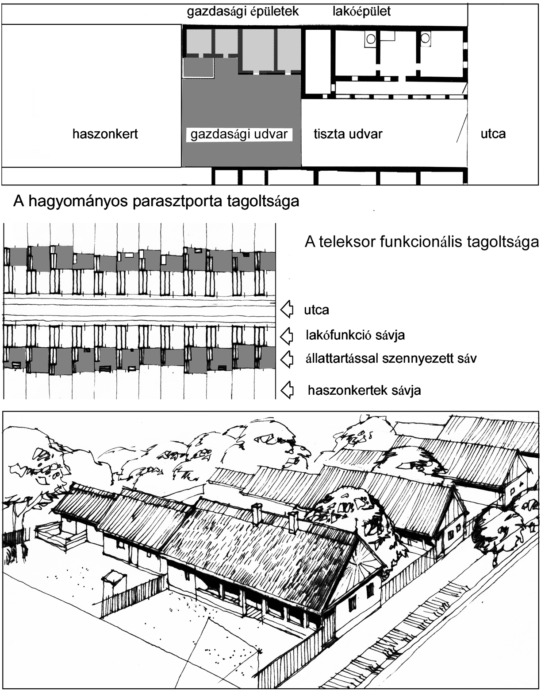
>
> *3.1. ábra – A hagyományos, ‘fésűs’ beépítésű falusi porta*
>
> A fésűs beépítés továbbfejlődését láthatjuk a XIX.–XX. század fordulóján. A kiegyezés utáni tőkebeáramlás, a folyószabályozások, a vasúthálózat kiépülése a mezővárosok fellendülését hozta. A mezővárosok szaporodó polgársága: az iparosok, kereskedők, értelmiségiek, és azok a nagygazdák, akiknek külterületi tanyái (szálláskertjei) vették át a mezőgazdasági funkciót, már másféle lakóháztípust igényeltek. A fésűs beépítés tekehatáron álló, utcára merőleges tetőgerincű épülettípusa L alakú formát ölt – gyakran úgy, hogy a régi házat toldották meg egy bővítménnyel – a szomszéd felé csak egy keskeny átjárót hagyva (félzártsorú beépítés). Ezt az átjárót lefedték (száraz kocsibehajtó) és így az utca teljesen zártsorú lett. A városközponthoz közelítve ebbe természetes módon illeszkednek az emeletes épületek és helyenként megjelenő bérházak. Létrejött egy sajátos, kisvárosi karakterű utcakép ([3.2. ábra](#abra_3_02)). A második világháborút követően ez a folyamat leállt, mert megszűnt létezni a városi polgárság és az az életforma, amelynek a fent leírt polgárház volt a térbeli kerete.
>
> 
>
> 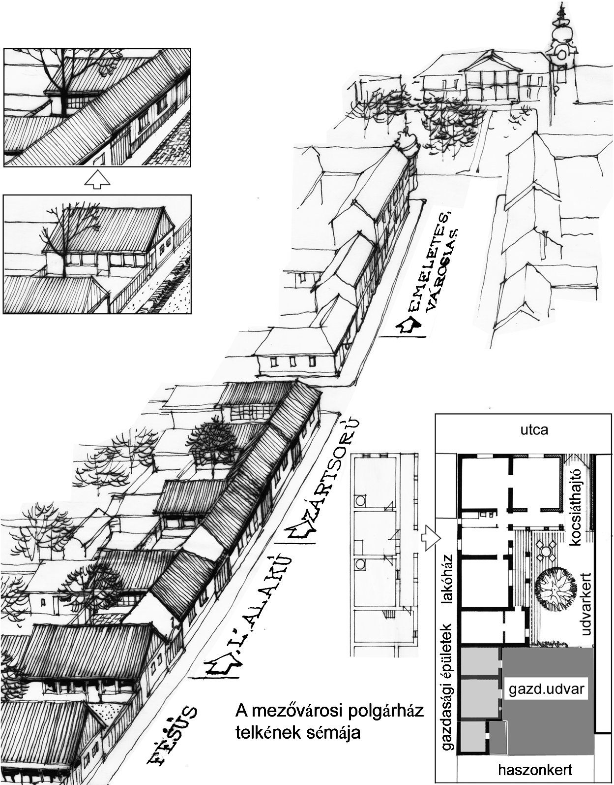
>
> *3.2. ábra – A mezővárosi zártsorú beépítés kialakulása*
>
> A falu életében gyors, drámai változások kezdődtek a második világháború után. A földosztás, a kényszerű beszolgáltatások időszaka, majd az erőszakos téeszesítés a hatvanas évek derekára alapvető változást hozott a falu életében. A parasztság, mint sajátos kultúrával rendelkező, kizárólag mezőgazdasággal foglalkozó társadalmi réteg csaknem teljesen felszámolódott. A magyar népesség fele foglalkozott korábban mezőgazdasággal, de a termelő szövetkezetek tagsága nem érte el a munkaképes népesség 10%-át sem. A falusi lakosság legnagyobb része a városok ipari üzemeiben vállalt munkát, oda naponta beutazott („ingázott”). Eközben a falusi porták mezőgazdasági funkciója semmit sem csökkent. Az ingázók a munkából hazatérve kertet műveltek, állattenyésztéssel foglalkoztak, hogy az ipari üzemben kapott szerény fizetésüket kiegészítsék (akkoriban ezt „kétlaki” életformának nevezték a szociológusok). Ez a kétlaki réteg paraszti életformáját részben megtartotta, a munkásság szubkultúrájának egyes elmeit átvette, és a régi hierarchiában felette álló polgárság gyakran félreértett kultúrmintáit iparkodott követni.
>
> Mindezek a változások a falu építészetében is markáns nyomot hagytak. A hatvanas években robbanásszerűen terjedtek el a sátortetős kockaházak, a nagyjából négyzetes alaprajzú kéttraktusos épületek. Bizonyára a kertvárosi kispolgári házak adhattak ehhez mintát, de terjedésükhöz hozzájárult az a hatósági szabályozás, amely a kertvárosokra vonatkozó előírásokat érvényesítette a falvakban is, például megkövetelte előkert kialakítását. Az utcától hátrább kényszerült ház hátrafelé nem léphetett, mert ott kezdődött az ólakkal szennyezett zóna. A ház így négyzetes alaprajzot vett fel. A korábbi, tágas oldalkert keskeny átjáróvá vált, ahova szobát nyitni nem lehetett a szomszéd közelsége miatt: a helyiségek tájolására az utca és a hátsó kert iránya maradt. A kert felőli homlokzat azonban éppen az állattartási épületekre nézett, ezért a szobákat a tisztább utca irányába nyitották meg. A középfőfal a házat két részre osztotta: a hátsó udvar felöl a napközben is használt konyha és egyéb gazdasági helyiségek, az első traktusban csak este és ünnepnapokon használt szobák voltak. Ez a jánusz-arcú ház a kétlaki életforma adekvát kerete volt. Ez volt azonban az utolsó típus, amely nagyjából azonos mintát követve még egységes utcaképet formált ([3.3. ábra](#abra_3_03)).
>
> 
>
> 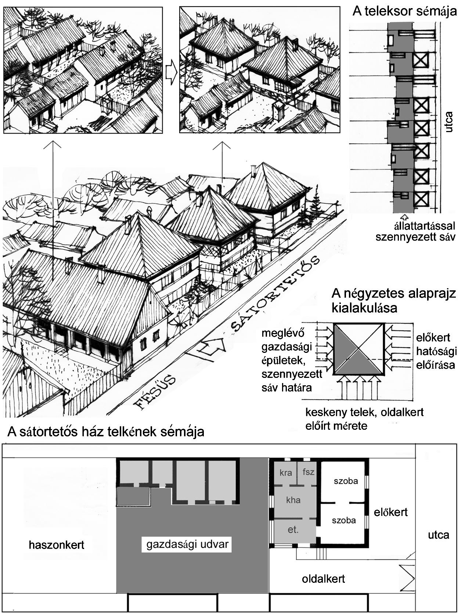
>
> *3.3. ábra – A fésűs forma felbomlása, a sátortetős háztípus kialakulása*
>
> A hetvenes-nyolcvanas években a háztáji gazdálkodás jelentősége fokozódott. A korábban főképp önellátásra és csak részben piacra termelő, házkörüli gazdaságban gyakran monokulturális termelés alakult ki ekkoriban (pl. nagyszámú sertés vagy baromfi tartása). A nyolcvanas években már megengedték a magánvállalkozásokat: iparosműhelyek is megjelentek a portákon. A kétfelől nyert jövedelem jelentős megtakarításokra adott lehetőséget, de ezt a gazdaság fejlesztésére fordítani még nem volt szabad: pl. földet vásárolni nem lehetett. A megtakarított jövedelmeket értékálló vagyontárgyba akarták fektetni: ennek eredménye lett az igazi lakásszükségletet jóval meghaladó, nagyméretű házak építése, kiemelt alagsorral, tetőtérbeépítéssel, vagy emeletes formában. Az üzemi és lakófunkciók korábbi, vízszintes tagoltsága gyakran függőlegesen irányban érvényesült: a lakóterek a felső szintekre kerültek, a földszintet a gazdasági funkció töltötte ki. Ezek a házak már professzionális mintákat követtek, gyakran az un. „ajánlott tervek” nagyobbra épített változatai, de a szorosan egymás mellé zsúfolt, túlzott épületvolumenek már szinte szétfeszítik a település korábbi szerkezetének kereteit. A házak formailag egymástól elütnek, az utca zavarossá, heterogénné vált ([3.4. ábra](#abra_3_04)).
>
> 
>
> 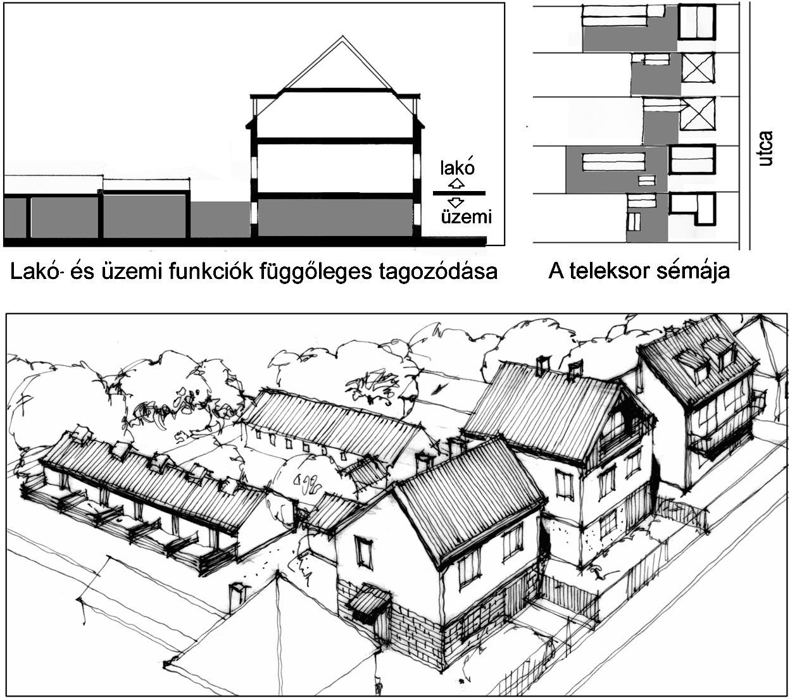
>
> *3.4. ábra – Az egységes utcakép felbomlása. A házak léptékváltása*
>
> A rendszerváltozás után a termelőszövetkezetek jó része életképtelen kisbirtokokra esett szét, a magyar mezőgazdaság válságba került, a 90-es évek a falvak gazdasági hanyatlását hozták. A túlépített, léptéktelen házak építésének korszaka lejárt. Még nem látszik tisztán, hogy a mezőgazdaság szerkezete milyen végleges formát ölt, de az minden bizonnyal tükröződni fog a magyar faluszerkezetben és a lakóház-típusokban is. Elkezdődött egyes falvak funkcióváltása: üdülőfalvak alakulnak ki a tájilag szép, de gazdaságilag hanyatló térségekben. A nagyvárosi agglomerációk falvaiban a kiáramló, vagyonosabb városi népesség kereslete a telkek árait felveri: az ingatlanok értéke jóval meghaladja azt a szintet, amelyet a mezőgazdasággal (is) foglalkozó réteg megengedhet magának. Ezek a városkörnyéki települések egyre inkább kertvárosi karaktert öltenek és „alvótelepülésekké” válnak.

> **A városias családi házak**
>
> Városias családi házaknak itt azokat nevezzük, amelyek telkének mezőgazdasági funkciója nincs, a telek regenerálódásra, legfeljebb hobbi-kertészkedésre szolgál.
>
> A bérházak XIX. század közepén történő megjelenéséig a városok lakáskészlete is többnyire családi házakból állt. A fallal körülvett városokban a helyszűke miatt viszonylag nagy laksűrűség alakult ki, a nagy arányban jelen lévő németajkú polgárság ugyancsak német eredetű kultúrmintákat követett: jellemző a *zártsorú*, földszintes vagy egy (ritkábban két-) emeletes épülettípus, egy vagy két hátranyúló oldalszárnnyal, vagy a mind a négy telekhatárt körülépítő, keretes forma. Ezek a nagyméretű házak tartalmazták a városi polgár műhelyét, raktárait, néha fogatos lovai istállóját, de lakhelyet adtak a gazdag polgár háza népének, a cselédségnek is. Ahol megmaradtak, általában többlakásos házakká alakultak át, néhány kivételtől eltekintve (pl. a budai vár falain belül is található még néhány családi ház).
>
> Az alföldi mezővárosok szerkezetük szerint óriásira nőtt falvak voltak, egészen a XIX. sz. második feléig. A falusias szerkezet városiasodásának folyamatát az előző részben ismertettük. Az alábbiakban a városias családi házak rövid történeti áttekintését Budapest példáján mutatjuk be.
>
> Mai felfogásunk szerint a városias családi ház legnagyobb értékét a hozzá kapcsolódó kert, a természethez való közelség adja. A természetközelség mentális, kulturális igénye a XVIII. század végétől, a francia felvilágosodás idejétől eredeztethető és a XIX. század közepére vált építészeti, településtervezési szemponttá. Az angol kertvárosok indítják el a kertvárosok építését Európa-szerte, az angol vidéki udvarház, a „manor-house” a városkörnyéki villák mintája lesz ott, és terjed el másutt is.
>
> A villa a városlakó gazdag polgárság és arisztokrácia nyaralóháza volt eredetileg, és akkor nagyobb gazdaság is tartozott hozzá. Hasonlóan alakultak ki a budai és pesti villák a XIX. század első felében. Pesten, a Városliget környékén, Budán a közeli dombokon épültek nyaralóházak, az utóbbi helyen egy-egy villához többholdas szőlőterület is tartozott. (Néhány szép klasszicista műemlék-villa ma is látható: pl. Barabás Miklós szőlőskerti háza a Városmajor utcában, a Jókai villa a Svábhegyen vagy a „Csendilla” a Budakeszi úton.)
>
> A városegyesítés után kezdődött el Budapesten az *állandó lakhelyül szolgáló* reprezentatív városi villák építése a gazdag polgárság megrendelésére, az akkor uralkodó eklektikus stílusban, pl. a külső Andrássy úton és ahhoz közeli területeken ([3.5. ábra](#abra_3_05)).
>
> 
>
> 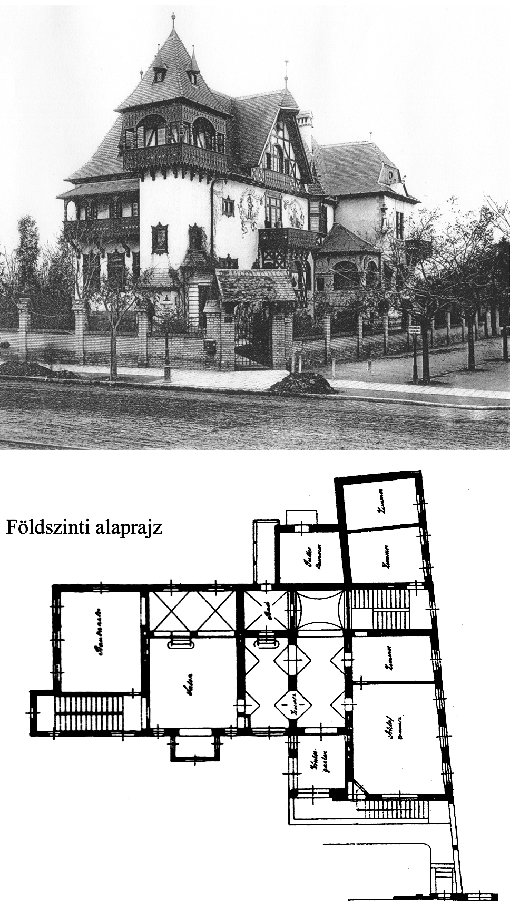
>
> *3.5. ábra – Nagypolgári villa. 1896. Schweiger Gyula építész háza. Budapest. Stefánia út.*
>
> A Duna-hidak megépülése és a közlekedés fejlődése a budai kerületekre is kiterjesztette az immár egész évben lakott villák építését a századforduló körül (Rózsadomb, Gellérthegy). Az első világháborút követő időszakban Buda lett a villaépítkezések fő helyszíne.
>
> A nagypolgári villák mellett a *szerényebb családi házak* is elszaporodtak Budapesten. A századforduló gazdasági konjunktúrája miatt a fővárosba áramló munkavállalók lakhatási igényei képtelenül felverték a lakbéreket, nyomasztó lakáshiány alakult ki. Ennek feloldására törvény született 1908-ban, amely 10 000 munkáslakás felépítéséről szólt. Az angol kertvárosok mintájára szervezték meg Kispesten a Wekerle-telep építését, amelyet a kezdeményező miniszterelnökről, Wekerle Sándorról neveztek el. Ez egyaránt tartalmaz többlakásos épületeket és családi házakat, összesen mintegy 4000 lakást. A telektakarékosság miatt nagy számban fordulnak elő ikerházak és négylakásos ikerházak. A maga idejében igen korszerű, kiváló városrendező és tervező építészek által tervezett együttes a kertvárosi környezet szép példája ma is ([3.6. ábra](#abra_3_06)).
>
> 
>
> 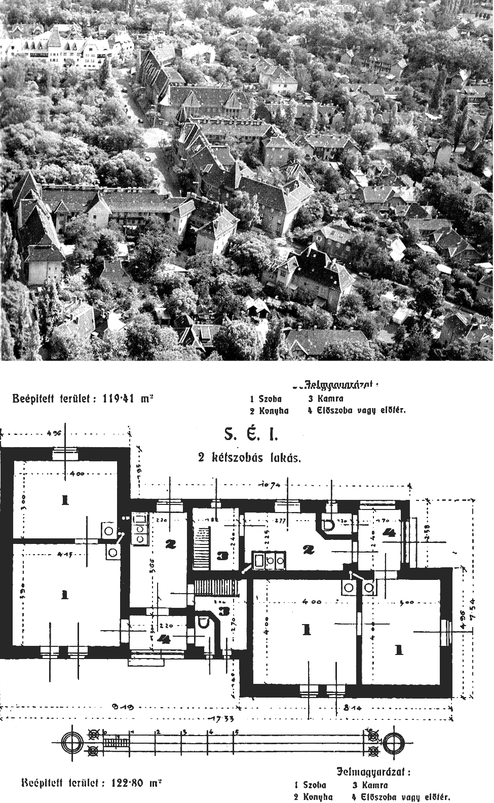
>
> *3.6. ábra – Budapest, Wekerle telep. 1909–1926. Légi felvétel-részlet és kétlakásos háztípus terve*
>
> Egyes üzemek is építettek családi házas együtteseket tisztviselőik számára (pl. a Ganz gyár az Orczy tér mellett vagy a gázgyár Óbudán). A családi házas telepek szervezett formában való építése a két világháború között is folyt: jellegzetes példa a magdolnavárosi OTI-telep (750 lakás), amely 1940-ben készült el, közismert építészek tervei alapján, szerény eszközökkel formált kétszobás, szabadon álló házakkal és ikerházakkal (az egyszobás lakások földszintes sorházakban kaptak helyet).
>
> A szerényebb jövedelmű rétegek elsősorban a külvárosokban építettek családi házakat, ahol a telekár még megfizethető volt. Több helyen történt parcellázás kifejezetten olcsó épületek számára alakított keskeny telkekkel, gyakran ikresített beépítési mód előírásával.
>
> Az igényes városi villákat sokszor vezető építész-egyéniségek tervezték, így XX. századi építőművészeti irányzatok jellegzetességeit a családi házakon is követni lehet. A korábbi, historizáló, eklektikus stílus egyeduralmát megtörve, a századforduló után megjelentek a vernakuláris építészet elemei a városi villákon, majd a 30-as években az európai modern mozgalmak, elsősorban a Bauhaus inspirációjára is születtek kiváló építészeti alkotások ([3.7. ábra](#abra_3_07)). 1931-ben készült el a modern építészet szellemében fogant remek együttes, a Napraforgó-utcai minta-lakótelep, amely a „kisemberek villáit” volt hivatva bemutatni. Annak ellenére, hogy a közreműködő építészek nem vallottak azonos építészeti elveket, a házsorok együttes megjelenése ma is mintaértékű.
>
> 
>
> 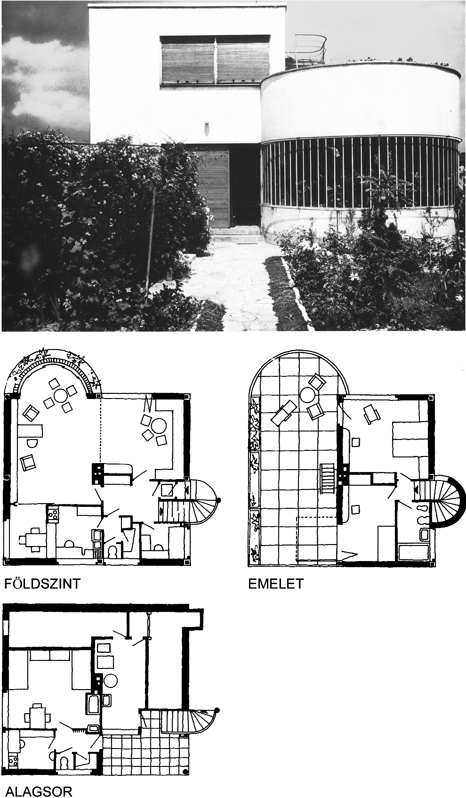
>
> *3.7. ábra – Molnár Farkas: Villa. Budapest, Lejtő út. 1932.*
>
> A második világháborút követő években a városi családi házak építésének folyamata megtorpant. A nagypolgárság felszámolódott, az igényes polgári villákat államosították és legtöbbször többlakásos bérházakká torzították. A diktatúra ideológiája magának a családi háznak, mint lakásformának létjogosultságát is megkérdőjelezte.
>
> Budapest határait 1951-ben kiterjesztették, és egy sor, korábban önálló települést a fővároshoz csatoltak. Ezek – a központi részeik kivételével – még sokszor falusias településkaraktert mutattak.
>
> A hatvanas-hetvenes években a korábbi villanegyedek telkein 4-6 lakásos társasházak épültek az újra emelkedő telekárak megosztása érdekében.
>
> A hetvenes években és a nyolcvanas évek elején épült családi házak főbb helyszínei az eredetileg üdülőknek parcellázott budai külső területek, és a fővároshoz csatolt települések voltak. Az akkori hivatalos ideológia eszmei ellenzékeként fellépő magyar „organikus építészet” irányzata is megjelent a családi házak körében ([3.8. ábra](#abra_3_08)).
>
> 
>
> 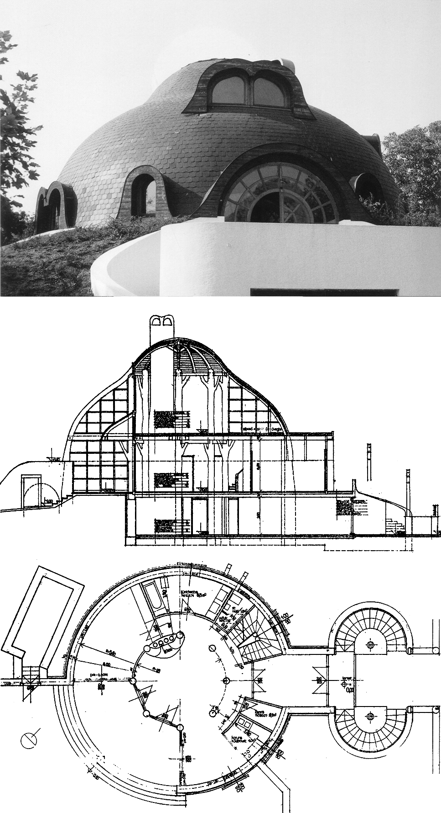
>
> *3.8. ábra – Makovecz Imre: Richter-ház. Budapest, Pesthidegkút 1983.*
>
> A nyolcvanas évek második felében kezdődött, és a 90-es években teljesedett ki az újmódi, nagyméretű családi házak építése a budai zöldterületeken. A rendszerváltozás után megjelent egy hirtelen meggazdagodott építtetői réteg, a növekvő kereslet miatt a budai zöldterületek telekárai az égig szöktek. Az újgazdag réteg ideálja a nagypolgári, neobarokk villa. A nagyméretű épületeken historizáló elemek jelennek meg, sokszor talmi formákban. (Az építészek megalkuvását könnyítette, hogy az időszak kezdete az egyetemes építészet un. „posztmodern klasszicizmus” irányzatának szakmai legitimálásával esett egybe.) Mindamellett számos, építészetileg magas színvonalú családi ház is született egy-egy kulturált, tehetős megrendelő számára ([3.9. ábra](#abra_3_09)).
>
> 
>
> 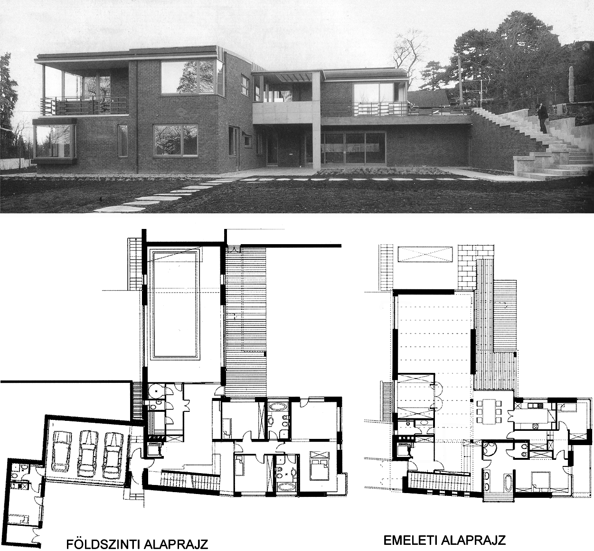
>
> *3.9. ábra – Igényes családi villa. Budapest. Turányi Gábor 2000.*
>
> A fővárosi, családi házak építésére alkalmas telkek lassanként elfogynak, megindul a nagyvárosokból történő kiáramlás, és a „városi” karakterű családi házak egyre nagyobb számban épülnek a nagyvárosi agglomerációk falvaiban.
>
> A huszadik század végén a szakmai figyelem egyre inkább az energiatudatosság felé fordult (márcsak az üzemelési költségek csökkentése miatt is) és a „fenntarthatóság” (lásd 2.2.1. fejezet) kiemelt szempont lesz a családi házak létesítésekor is. Az új szemlélettel tervezett házak ma még nem épülnek tömegesen, de egyre nagyobb teret nyernek. A jövő útját mindenképpen ezek jelölik ki.
>
> A [3.10. ábra](#abra_3_10) természetközeli építőanyagok felhasználásával a fenntarthatóság szellemében épült házat mutat.
>
> 
>
> 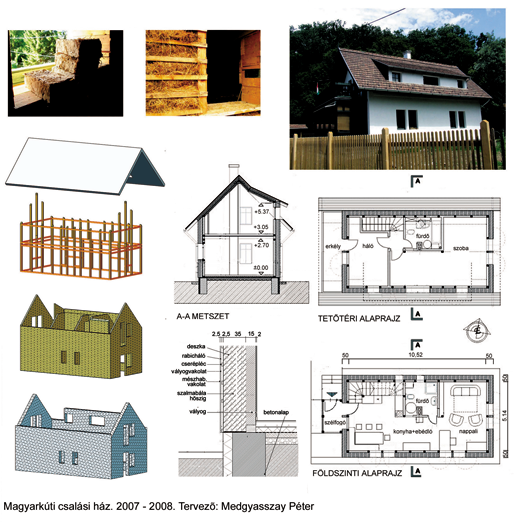
>
> *3.10. ábra – Magyarkúti családi ház 2007-2008 Tervező: Medgyasszay Péter*

> **Új törekvések a kortárs családi ház építésben: autonóm házak, ökoházak, passzív házak (N.Á.)**
>
> Mindhárom kategória tervezése során az alábbi elvek érvényesülnek, természetszerűleg különböző hangsúllyal:
>
> - a napsugárzás energiájának jó hasznosítása (tájolás, jó hőtároló szerkezetek)
> - a fűtés és egyéb működtetés (használati melegvíz, főzés, egyéb háztartási funkciók) energiafelhasználásának minimalizálása
> - autonóm épületnél az energia termelésének helyi megoldása (nap, szél, biomassza)
> - a természetes megvilágítás és szellőzés maximális kihasználása
> - a nyári hővédelem passzív eszközökkel (árnyékolás, növényzet) történő megoldása
> - újrahasznosítás, valamint lehetőleg természetes és megújuló anyagok használata
> - víztakarékos megoldások alkalmazása, a keletkezett csökkentett mennyiségű szennyvíz szelíd technológiás kezelése, és újrafelhasználása.
>
> **Különbségek:**
>
> - *Autonóm ház:* az épület és környezet hálózatokról leválasztva úgynevezett „off-grid” rendszerben működik, vagy ha hálózatba van kötve, akkor a betáplálás és kivétel egyensúlyban van. Jellemzően nagyobb telekkel rendelkező épület esetén jó megoldás. Ezeknél az épületeknél az áramtermelés, a vízkivétel, a szennyvíztisztítás, a hőenergia termelése „telekhatáron belül” történik. Az épület üzemeltetése során egymás mellett megtalálható a low-tech (pl. alomszékes illemhely, tömegkályha) és a high-tech (pl. fotovoltaikus áramtermelés). Az épület lakói általában tudatosan, megfelelő ismertekkel felvértezve vesznek részt az épület működtetésében. Az energiafelhasználás jellemzően 80-100 kWh/m2/év. A fűtési-, főzési-, egyéb energia formája jellemzően biomassza, napenergia, illetve elektromos áram.
> - *Ökoház:* azokat az épületeket nevezzük így, ahol az anyaghasználatra és az egészséges belső klímára különös gondot fordítanak, egyben az energiafelhasználás az átlagosnál alacsonyabb és jellemzően megújuló forrásokat használnak. Az ökoházaknál törekednek az új technikai megoldások természetközeli változatainak alkalmazására (pl. gravitációs rendszerű napkollektor, vízteres kandallókályha), és a lakók aktívan részt vesznek a működtetésben. Az energiafelhasználás jellemzően 80-120 kWh/m2/év. A fűtési-, főzési-, egyéb energia formája jellemzően biomassza, napenergia, illetve elektromos áram.
> - *Passzív ház:* míg az előző két épülettípusnál megelégednek az alacsony energiafelhasználással, addíg a passzív házak esetében az alacsony energiabevitel mellett a belső hulladékenergia maximális felhasználása is előtérbe kerül. Ennél az épülettípusnál az automatizált működtetés általában a high-tech megoldások felé viszi a gépészetet (hővisszanyerő szellőztető rendszer, talajkollektorok hőszivattyúk, stb.). A fenntartás és működtetés során az automatizált rendszerek általában rendszeres karbantartást, sokszor távfelügyeletet is igényelnek. Épülettípustól függően 40-60 kWh/m2/év energiabevitel szükséges, a technológia miatt ez leginkább szoláris energia és elektromos áram formájában történik.

## 3.3. Családi házak szabadon álló beépítési módban

### Hatósági építési követelmények, szabályzatok

Az országos Településrendezési és Építési Követelmények (OTÉK) szerint a telkek beépítési módját szabadon álló, oldalhatáron álló, ikres és zártsorú formában kell meghatározni a helyi építési szabályzatban. Ez a családi házakra is vonatkozik. A következőkben az egyes beépítési módokban épülő családi házak leírására külön alfejezetet szánunk.

Legrészleteseben – ebben a fejezetben – a szabadon álló beépítési módot elemezzük, a többi beépítési módnál csak az ezektől különböző jellegzetességekre térünk ki.

Az OTÉK szerint

> *„Az építési telek épület elhelyezésére szolgáló területrészét (építési hely) építési határvonalakkal kell megállapítani úgy, hogy a) szabadon álló beépítési mód esetén azt minden oldalról a saját telkének az előírt elő- oldal- és hátsókerti építési határvonalai és a telek határai közötti beépítetlen része vegye körül, ...”*

Szabadon álló családi ház az építési telken csak bizonyos korlátok között építhető, beépítetlen sávot kell hagyni a teleknek mind a négy határa mentén ([3.11. ábra](#abra_3_11)).

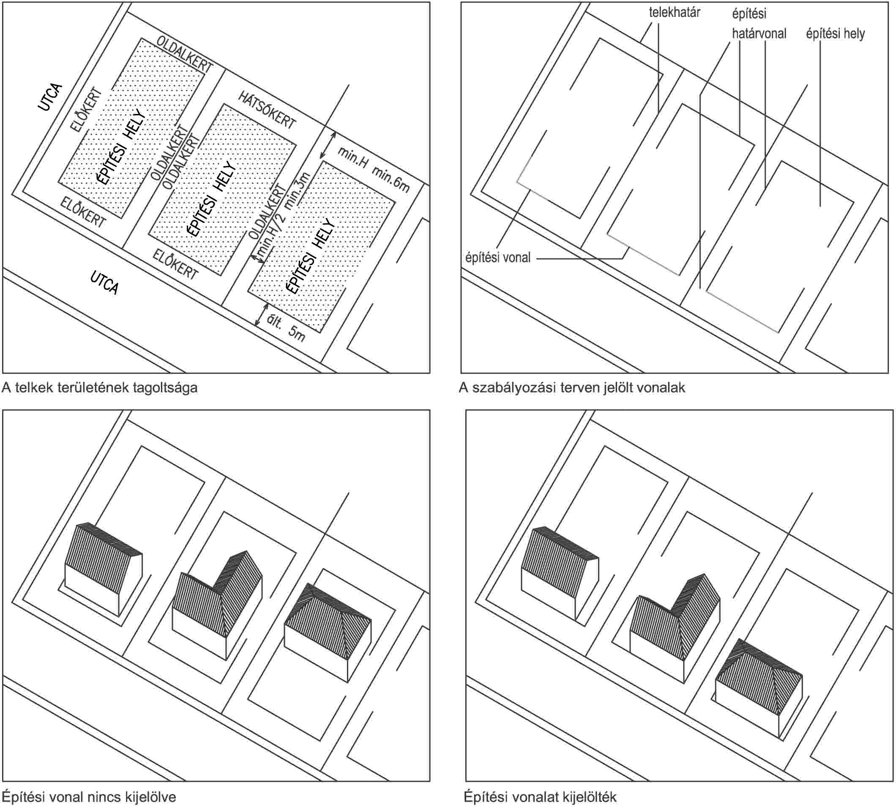

*3.11. ábra – A telkek beépítésének szabályai szabadon álló beépítési módban*

Az *előkert* a telek utcavonalához csatlakozó beépítetlen sáv: rendeltetése az, hogy a lakóépületet az utca zavaró hatásaitól védje (zaj, füstgáz, por, az ablakon való közvetlen betekintés), másrészt a házak homlokzatsorát az utcai telekhatárnál hátrább kényszerítse, hogy az utca térfalai kitáguljanak, az előkertek az utcai fasorral együtt kellemes zöldkörnyezetet adjanak. Amikor a helyi szabályozás másképpen nem rendelkezik, az előkert legkisebb mélysége általában 5 méter ([3.12. ábra](#abra_3_12)).

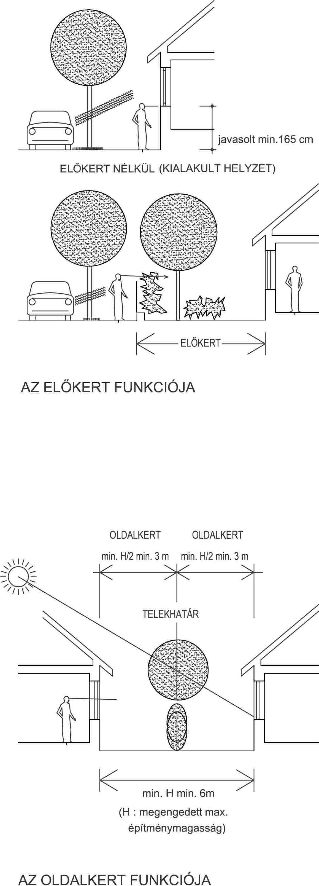

*3.12. ábra – Az előkert funkciója és az oldalkert funkciója*

Az *oldalkert* az utcára merőleges telekhatárok mentén kialakuló beépítetlen sáv. Rendeltetése a szomszédos épületek között megfelelő távolság garantálása. Az épületek között megfelelő távolságot kell tartani az esetleges tűz átterjedésének elkerülése érdekében, de az oldalkert méretére történő előírás betartása az előírt tűztávolság meglétét önmagában nem garantálja, mert az több más szemponttól is függ (anyagok tűzállósági foka, nyílászárók helyzete, mérete stb.). Az előírt tűztávolság meglétét külön is ellenőrizni kell.

Az egymásra néző homlokzatok közötti távolság biztosítja, hogy a szomszédos házak között zavaró átlátás és áthallás ne keletkezzék.

Megfelelően széles oldalkert szükséges ahhoz, hogy a szomszédos épületek benapozását, kertjük termőhelyi értékeit az elengedhetetlennél nagyobb mértékben ne korlátozzák árnyékolással.

A felsorolt szempontok általában összefüggenek az épület magasságával (tűz elleni védelem, árnyékolás) ezért az oldalkert legkisebb szélességét az építménymagasság függvényében határozzák meg. Mivel a telkek nem egyszerre épülnek be, egy alacsonyabb épülethez szabott oldalkert nem védene kellően egy később épülő, magasabb ház zavaró közelségétől, ezért az épületek magasságát is szabályzatok korlátozzák.

Az épületek magasságának előírásokkal való korlátozása elég körülményes. Valamikor az épületek *párkánymagasságának* felső határértékét írták elő, de ennek kijátszására születtek olyan házak, amelyeknek hatalmas manzárdtetői alatt még 2-3 lakószint is elfért. Ennek elkerülésére történt a *homlokzatmagasság* rögzítése, amely az épületet körülvevő járda valamint a falsík és a tetősík elméleti metszésvonala között mérhető távolság. Alkalmazása körülményes volt olyankor, ha a homlokzatmagasság egy-egy homlokzati síkon nem volt végig azonos, pl. lejtőre épített ház esetében. Ma az *építménymagasság* fogalmát használják, amely – egyszerűen fogalmazva – az épület valamennyi homlokzatának átlagos magassága. A számítás ennél bonyolultabb: kifejtése az OTÉK-ben található. (1. sz. melléklet: Fogalom-meghatározások. 26. Építménymagasság (H))

Az oldalkert mérete a helyi szabályzatban *megengedett legnagyobb építménymagasság* fele, de legalább 3 méter. A csatlakozó oldalkertek együttes mérete (az épületek távolsága) eszerint nem lehet a megengedett építménymagasságnál, sem 6 m-nél kevesebb ([3.12. ábra](#abra_3_12)).

A hátsókert *a hátsó telekhatár mentén kialakuló beépítetlen sáv, rendeltetése az oldalkertével lényegében megegyezik. Kerthasználat szempontjából általában a telek hátsó része az értékesebb, ezért a hátsókert legkisebb méretének korlátozása szigorúbb: nem lehet keskenyebb, mint a megengedett építménymagasság, de legalább 6 m.*

*A beépítési tilalom alá eső telekrészek határának grafikus jelölése a szabályozási terveken az* építési határvonal, *a határvonalak által közrezárt terület az* építési hely, *ahová az épület elhelyezhető.*

Rendezett utcakép vagy más szempontok miatt a helyi szabályzási tervben rögzíteni lehet az *építési vonalat*, amelyre az épületet egyik homlokzatával, vagy két homlokzatának sarokpontjával kell kötelezően elhelyezni.

A fentieken kívül a helyi szabályzatban rögzítik a telken alkalmazható legnagyobb beépítettség mértékét, esetleg a megengedett szintterületi mutató mértékét és a legkisebb zöldfelület arányát, vagy egyéb, helyi érvényű szabályokat.

A hatósági szabályok betartása önmagában nem elegendő az épületnek a telken való jó elhelyezéséhez. Az alábbiakban a telek és épület viszonyát meghatározó tervezési szempontokat részletezzük, annak előrebocsátásával, hogy ezek nem maradéktalanul érvényesítendő szabályok. Az egyes szempontok gyakran egymás ellenében hatnak: a prioritások érvényesítése és az értékek egyensúlyának megteremtése az építész feladata és felelőssége.

A telek beépítésének szempontjait a szabadon álló beépítésre vonatkoztatva tárgyaljuk részletesebben. Más beépítési módok esetében csak az azokra jellemző sajátos szempontokra térünk ki.

### 3.3.2. Benapozás, szélvédettség, tájolás

A lakások helyiségeinek benapozásáról és tájolásáról az 1.5.4. fejezetben esett szó. Energetikai szempontból előnyös, ha az épület nagyobb ablakfelületei a napfényes homlokzatokra kerülnek; a filtrációs hőveszteségeket jelentősen csökkentheti, ha az uralkodó széliránynak kitett homlokzat zárt, kevés nyílást tartalmaz (Magyarország legnagyobb részén az uralkodó szélirány ÉNY). A fokozott energiatudatossággal tervezett házak tervezésénél ezek az adottságok nagy jelentőséget kapnak (lásd 3.7.3. fejezet).

Egy helyiség tájolása önmagában nem biztosítja a kellő benapozást, ha ablakára a környezetében lévő objektumok árnyékot vetnek, vagy magának az épületnek egyik szárnya vet árnyékot arra. A benapozást bizonyos beépítési helyzetekben a külön is vizsgálni kell. A szabályzat szerint egy homlokzat akkor tekinthető benapozottnak, ha február 15-én legalább 60 percen át napsugárzás éri.

A benapozás feltételei különböző helyszínek földrajzi szélességi foka szerint változnak. Hazánk legészakibb és legdélibb pontja közötti eltérés, kerekítve, 3 fok. Ez a benapozás tekintetében nem okoz jelentős különbséget, csak akkor kell figyelembe venni, ha pontos számításra van szükség. A 47. földrajzi szélességi fok nagyjából Magyarország közepén fut át, ezért az ahhoz tartozó benapozási feltételek az ország más helyén is általános esetben mérvadók lehetnek. A napsugárzás időtartama az év folyamán változik, és a napsugarak iránya és beesési szöge is változik mind napszakonként, mind az évi ciklusidőben ([3.13. ábra](#abra_3_13)).

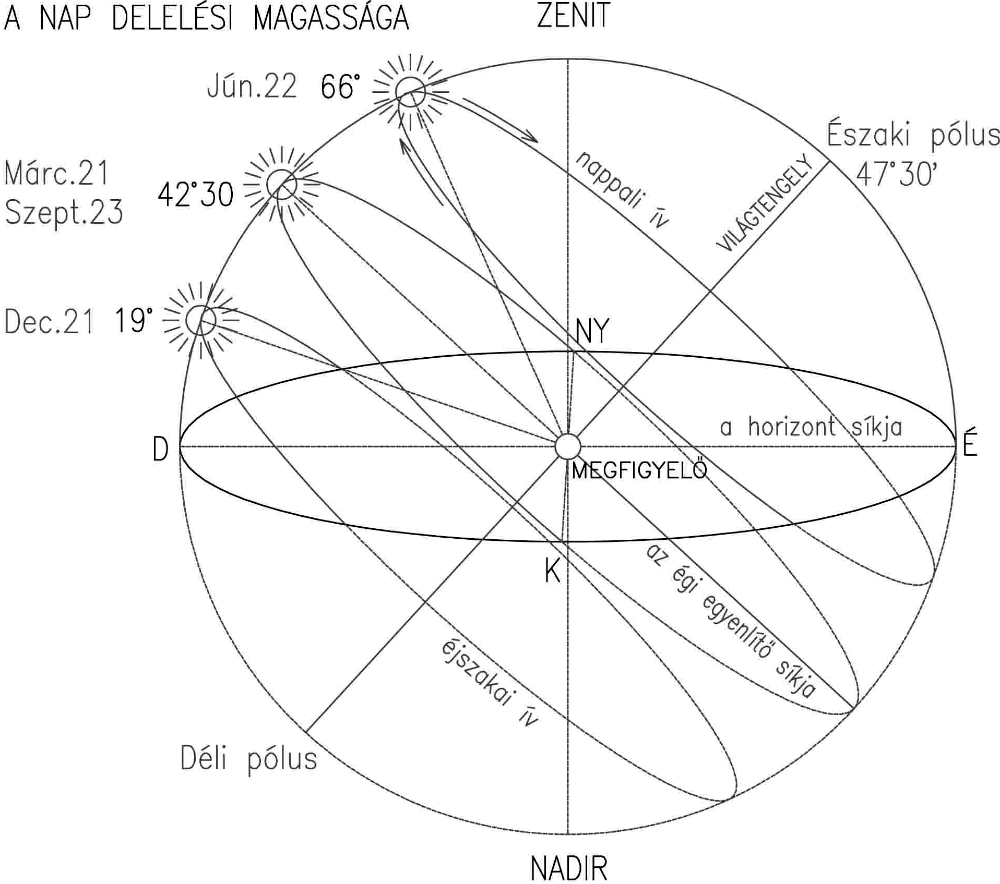

*3.13. ábra – A nap látszólagos mozgása Budapesten*

Az év adott napjának adott órájában a napsugárzás iránya és beesési szöge meghatározható. Erre szolgál az un. „nappálya-diagram” ([3.14.](#abra_3_14), [3.16. ábra](#abra_3_16)), amely az évi és napi ciklusidőben szerkesztett nappályákat szemléletes módon mutatja.

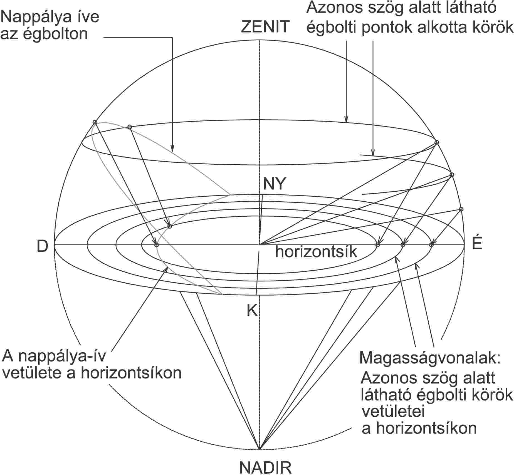

*3.14. ábra – A nappálya-diagramm szerkesztésének elve*

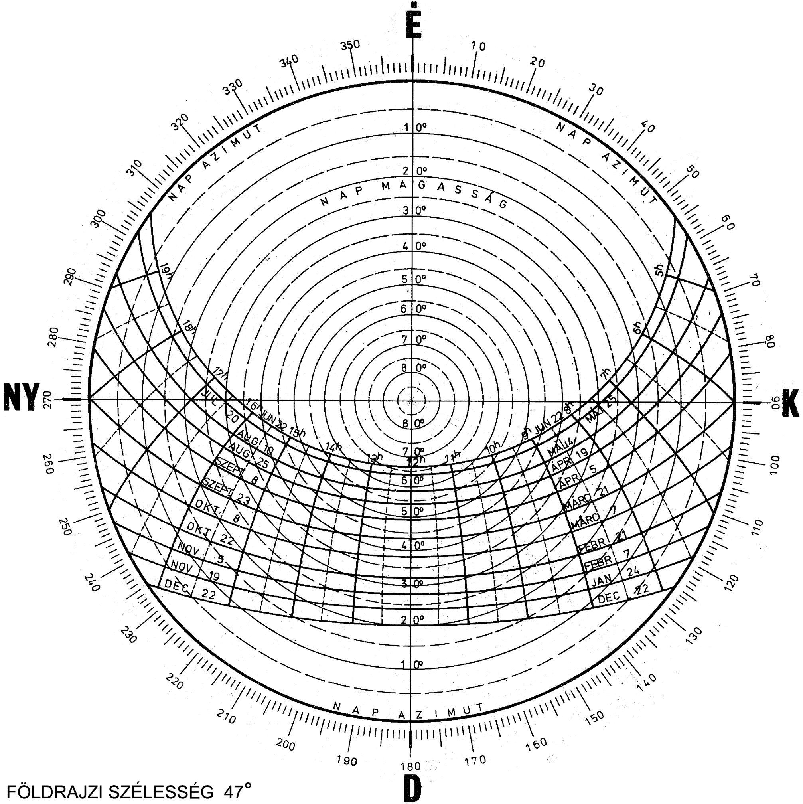

*3.16. ábra – Nappálya-diagram*

> **Megjegyzés**
>
> A nappálya-diagram lényegében az égbolt félgömbje jellegzetes pontjainak vetülete a horizontsíkon (a vetítővonalak a nadírban futnak össze). A diagram mutatja az év minden hónapjának két napján az égbolti nappályák vízszintes vetületét. Ezeken a napkeltétől napnyugtáig tartó órabeosztást jelölik. A koncentrikus körök az égbolton azonos szög alatt látható pontokból képzett körök vetületei. Egy adott nap adott órájában mind a napsugárzás iránya (azimut), mind beesési szöge interpolálással grafikusan is meghatározható.
>
> A közölt diagram Dr. Kuba Gellért „Benapozás” c. kiadványából való (Iparterv 1975).

Ma már fejlett, számítógépes szoftverekkel a benapozási feltételek gyorsabban és pontosabban számíthatók és szerkeszthetők. Pontos számításra például akkor lehet szükség, ha az épületbe jutó napenergia mennyiségét akarjuk tudni a passzív szolár házak energiaháztartásának tervezésénél. (3.7.3. fejezet).

A napsugárzás hátrányos is lehet nyáridőben, ha a benapozott helyiségeket túlságosan felmelegíti. Ez ellen árnyékolással kell védekezni (lásd 1.5.2. fejezet). Az évszakonként változó napmagasság miatt vízszintes árnyékoló síkok ([1.50. a. és b. ábra](#abra_1_50)) megfelelő méretezésével elérhető, hogy az árnyékoló szerkezet ne akadályozza a benapozást abban az időszakban, amikor az energia-felvételre szükség van ([3.18. ábra](#abra_3_18)). A méretezés benapozás-vizsgálat módszerével elvégezhető.

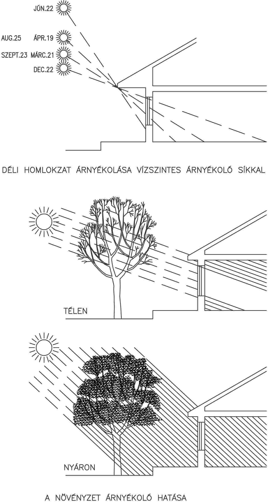

*3.18. ábra – Az árnyékolás évszakonkénti változása*

Optimális árnyékoló „szerkezet” az ablakra árnyékot vető, lombhullató fa koronája, amely a napsugárzást átengedi tavasztól őszig, de nyáron kellemes árnyékot ad. Ez a ház és a kert kölcsönhatásának fontos tervezési szempontja lehet. Az ilyen célból ültetett facsemete 15-20 év múlva teljesítheti csak rendeltetését, ezért elsősorban a meglévő növényanyag megtartására és kihasználására kell törekedni a tervezés során.

### 3.3.3. Kertkapcsolat

A kertvárosi környezetben épülő családi házak különleges értéke a kert. A kert megtervezése éppoly gondosságot igényel, mint a házé: átlagos építészeti minőségű házak is megnemesednek egy szép kertben, és az építészetileg kitűnő házak hatását is leronthatja a kopár, vagy elhanyagolt telek. Az igényes tervezés hozzáértő kertépítész közreműködését kívánja.

A lakás funkcióit a kert kiegészíti, illetve jó időben átveszi. A régi parasztportákon nyáron a mindennapi élet fő színtere az udvar volt. A csatlakozó fedett tornácon tartózkodtak, étkeztek, gyakran építettek szabadtéri főzőhelyet és kemencét. A jól megtervezett kert hasonló funkciót teljesít: teraszok, lugasok a nappali időtöltés, vendégfogadás helyszínei lehetnek, a konyha feladatát időnként átveszi egy kerti grillező. A kert a gyermekek játszóhelye; kerti zuhanyozó, igényesebb esetben kerti fürdőmedence egészítheti ki a rekreációs funkciókat.

A külső és belső terek kapcsolatában használati és esztétikai szempontok egyaránt érvényesülnek. A kerti terasz és a nappali kapcsolatának jó megtervezésével a belső tér mintegy kiegészül a külsővel, a nappali időtöltés kellékei (könyvek, újságok, rádió stb.) a teraszról is rövid úton elérhetők. A kapcsolat építészeti hangsúlyt is kaphat: a nagy felületen megnyitható üvegfal a nappali terét vizuálisan tágítja, a teraszra is kiterjeszti. A hatást fokozhatja a terasz és a szoba azonos vagy hasonló burkolata. Más lakóhelyiségek enteriőrjének esztétikai hatásához is szervesen kapcsolódik a kert látványa, az ablakban – mint keretben – évszakról évszakra változó kép ([3.19. ábra](#abra_3_19)).

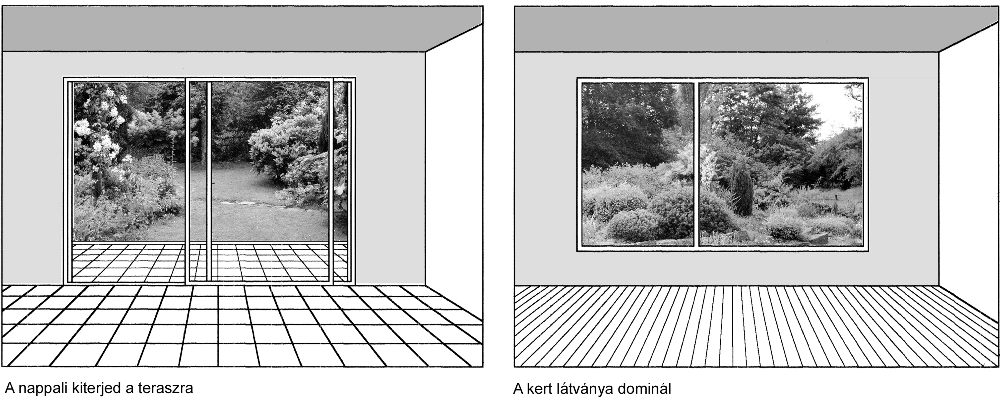

*3.19. ábra – Belső tér és kert kapcsolata*

A *benapozás* a kert kialakításának is fontos szempontja, mert befolyásolja a növényzet termőhelyi viszonyait. Maga az épület is árnyékolja a kertet, ezért az épület északi homlokzata mentén jobbára csak árnyéktűrő növények érzik jól magukat. Az épület helyiségeinek és a csatlakozó kertnek benapozási igényei összefüggenek: a benapozott helyiségek előtt jól benapozott kert-részek vannak. Az olyan elrendezés kedvező, ahol a lakóhelyiségek, főként a nappali szoba és a hozzá csatlakozó terasz előtt teresebb a kert.

A lakóhelyiségek és a kert részeinek tájolási igénye alapján előnyösnek ítélhető épület-elhelyezési sémákat a [3.20. ábra](#abra_3_20) mutatja be, *kizárólag* ennek a szempontnak a figyelembe vételével. Ezt azonban csak irányelvként kell értelmezni, mert a tervezés során mindig a *konkrét* helyszín meglévő és potenciális adottságait kell figyelembe venni.

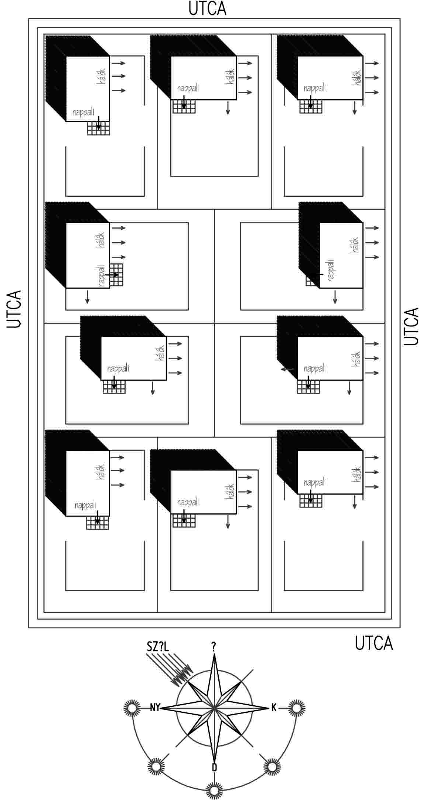

*3.20. ábra – Az épületek telekre helyezésének sémái kizárólag a tájolás és kertkapcsolat szempontjai szerint*

A [3.21. ábra](#abra_3_21) fiktív példákon mutatja be, hogy ha a mereven értelmezett tájolási szempontok szerint az épületet elvben oda kellene helyezni, ahol a telek legértékesebb növényállománya van, akkor más elrendezést kell választani. Egy kivágott terebélyes fa helyett újat ültetni lehet ugyan, de az új fa látványa és árnyékoló hatása emberöltőnyi idő múltán lesz olyan, mint a meglévőé.

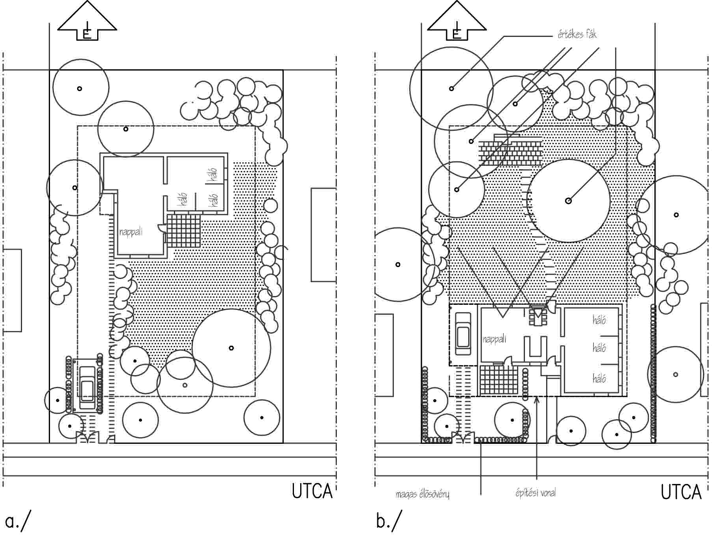

*3.21. ábra – Épületek elhelyezése azonos tájolású telkeken a konkrét helyszín adottságai szerint (fiktív sémák).*

### 3.3.4. Az épület megközelítése

A gyalogosan és gépkocsival történő megközelítés mikéntje fontos tervezési szempont. Az épület bejárata legyen jól látható, építészetileg hangsúlyos helyen, a bejárat megközelítési útvonala lehetőleg kerülje el a kert „intim” használatú részét.

Ez általában nem jelent gondot, ha a főbejárat természetes helye a ház helyiségeinek elrendezése miatt az utcai homlokzaton adódik. Ez azonban nem mindig lehetséges: ha a telekadottság vagy egyéb építészeti szándék az utcára merőlegesen nyújtott alaprajzú házat kíván meg, ennek főbejáratát csaknem lehetetlen közvetlenül az utcai homlokzaton kialakítani, mert külpontos helyzete miatt a belső közlekedők terjengősségét okozná. Ilyen esetben szinte elkerülhetetlen a bejárat oldalkert felőli elhelyezése. Ekkor az épület építészeti megformálásával kell a bejárat helyét egyértelművé, hangsúlyossá tenni.

A gépkocsival való megközelítés a gépkocsitároló helyzetétől függ, azzal együtt tárgyaljuk a 3.3.6. fejezetben.

### 3.3.5. Nem lakás célú épületek és építmények elhelyezése

A korábbi építési szabályzatok megkülönböztettek a lakótelken un. „főépületet” és „melléképületet”. A hatósági szabályozás jelenlegi terminológiája a melléképület fogalmát eltörölte és általában épületek elhelyezéséről rendelkezik. Ennek ellenére, a melléképület fogalma tovább él a köztudatban: ezek alárendelt funkciójú ill. időszakosan használt, legtöbbször nem is fűthető épületek, így egyszerűbb szerkezetekkel, olcsóbban építhetők. Épp ez jelent azonban veszélyt a környezet minősége szempontjából: gyakran látható, hogy a reprezentáló főépület mögötti telekrészen – amely a család mindennapi környezetét adja – szedett-vedett anyagokból tákolt bódék zsúfolódnak, amelyek nemcsak a közvetlen szomszéd, hanem az egész terület környezetének minőségét lerontják.

A szabadon álló beépítési mód különösen alkalmatlan melléképületek befogadására a kisebb telkeken. Az előkertben vagy a keskeny oldalkertben nincs ezekre hely, ha viszont a hátsókertben helyeznek el melléképületeket az építési határvonalakon belül, azok éppen a lakóépület értékes kertkapcsolatát akadályozzák.

A nem lakás célú terek igénye nagyon sokrétű, ezek egy része közvetlenül a lakáshoz kapcsolható (pl. műterem, iroda) más részük a lakástól való elkülönítést igényli (pl. rendelő, iparosműhely stb.) Arra kell törekedni, hogy ezek megfelelő építészeti minőséggel, a lakóépülettel egy tömegben vagy azzal kompozíciós egységben épüljenek meg.

Kertes családi ház esetében mindig gondoskodni kell *a kerti szerszámok és kerti bútorok* tárolásáról.

*Melléképítmények* a nem épület jellegű létesítmények, amelyek a beépített alapterületbe nem számítanak bele (pl. közmű-becsatlakozási vagy közműpótló műtárgy, hulladéktartály-tároló, 1 m-nél nem magasabb fedetlen terasz, víz és fürdőmedence, napkollektor stb.). Lényeges, hogy ide tartozik a „kerti lugas, továbbá lábonálló kerti tető legfeljebb 20 m2 vízszintes vetülettel”. Ez utóbbi ugyanis fedett-nyitott gépkocsitárolásra is szolgálhat.

> **Megjegyzés**
>
> A családi ház kertjének, a vizuális élményen és a rekreációs lehetőségeken túlmenően, igen sokszor gazdasági funkciója is van, ha a telek kellően nagy méretű. A dísznövények mellett megjelennek a kettős funkciójú kertrészletek, az élelmiszertermelésre is alkalmas telekrészek, vagy hobbitevékenységre alkalmas területek. Ez a fajta kerthasználat segít megőrizni a változatos fajtákat, és a lakók kreatív tevékenységeit is elősegítik. Ezért a tervezés során erre is érdemes megfelelő felületet adni, üvegház vagy egyéb melléképület helyének biztosításával. A kertgondozáshoz szükséges locsolóvíz nyerhető a talajból is, így a kerti műtárgyak közé bekerülnek a szivattyú elhelyezéséhez szükséges aknák is. Érdemes a kerti gazdasági és tároló jellegű funkciókat egy csoportban elhelyezni, részben a megfelelő látvány részben a biztonság miatt. (N.Á.)

### 3.3.6. Gépkocsitárolás

Lakásonként 1 gépkocsi elhelyezéséről *kötelező* a telken belül gondoskodni, de ma már egyre gyakoribb, hogy a család két vagy három gépkocsit is üzemeltet. A gépkocsi tárolásának és mozgásának helyigényét a [3.22–3.24. ábrasor](#abra_3_22) mutatja be.

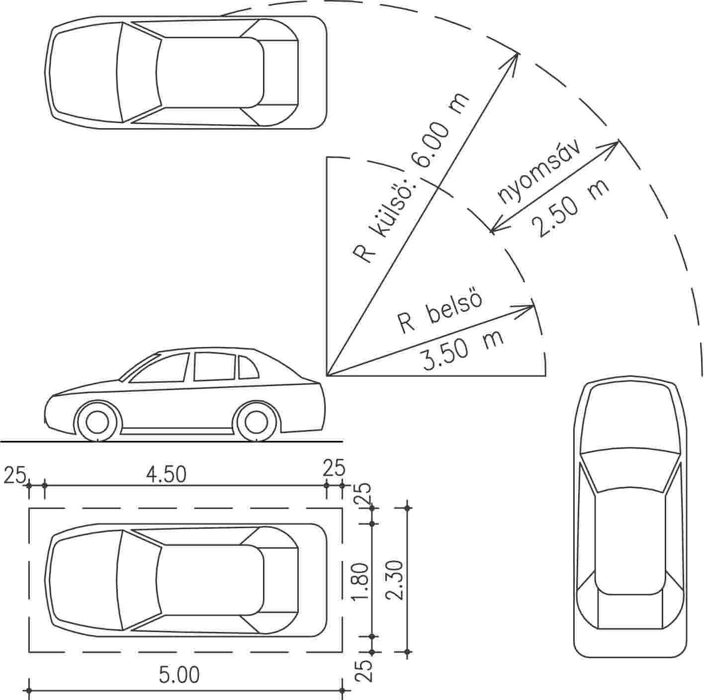

*3.22. ábra – A mértékadó gépkocsi mérete és fordulási íve*

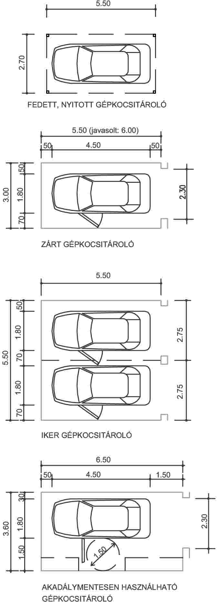

*3.23. ábra – A gépkocsitárolás helyszükséglete*

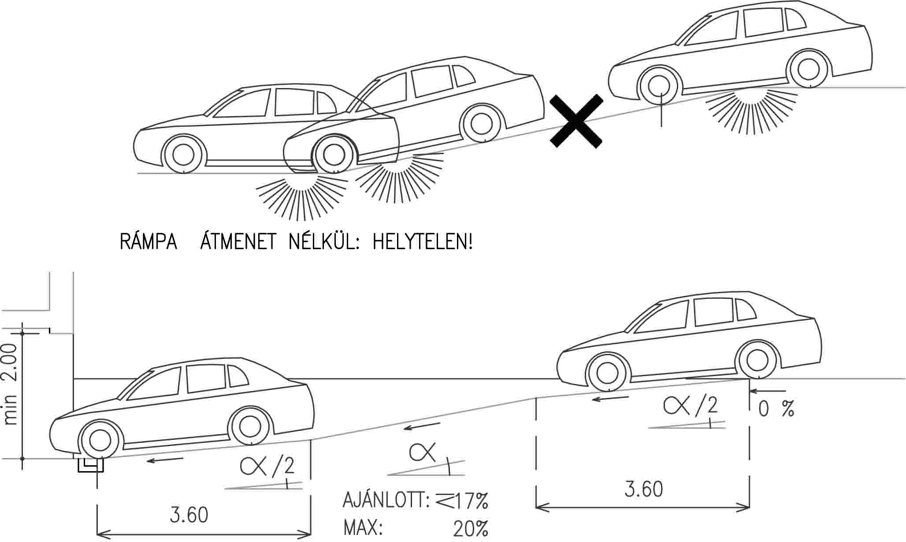

*3.24. ábra – Rámpa kialakítása*

A gépkocsitároló lehet fedett-nyitott és zárt. A fedett-nyitott gépkocsibeállók a leggazdaságosabbak, de hazánkban kedveltebbek a zárt gépkocsitárolók.

A gépkocsitároló lehet magának a lakóépületnek a földszintjén, annak tömegén belül. Ilyenkor a garázs határfalainak, födémszerkezetének, homlokzatképzésének költségei a lakóépületével azonosak, belmagassága legtöbbször feleslegesen nagy.

A garázs csatlakozhat közvetlenül a lakóépület tömegéhez, de a két, volumenében eltérő tömeg esztétikailag elfogadható csatlakozása gondos tervezést igényel.

A gépkocsitároló kerülhet külön (mellék)épületbe, de a viszonylag kisméretű, önálló garázsépület és a főépület együttes építészeti megjelenésének összehangolása fontos szempont. Szokásos – és javasolható – hogy a garázs más kerti létesítményekkel (tároló, szélvédő fal, pergola stb.) kompozíciós egységben legyen. ([3.25. ábra](#abra_3_25)).

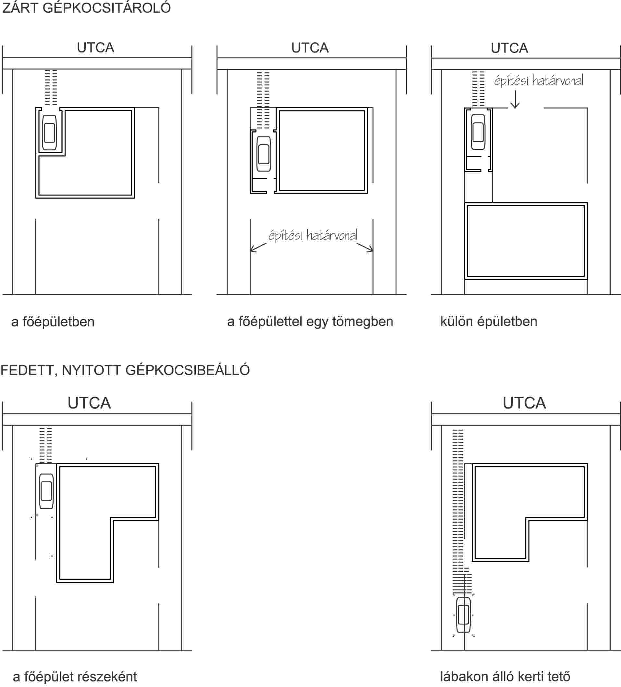

*3.25. ábra – Gépkocsi-elhelyezés sémái szabadon álló családi házaknál*

Az *alagsori vagy pinceszinti* gépkocsitároló megközelítéséhez hosszú rámpa szükséges, amely általában nem fér el az előkert mélységében, hacsak nem emelik fel a földszinti padlóvonalat. Ez utóbbi költségnövekedést okozhat, a lakószintet elszakítja a kerttől, esetleg a homlokzatmagasság korlátai miatt nem is lehetséges. A lakószint alá helyezett gépkocsitároló lejtős terepen jó (lásd következő fejezet) vagy – sík terepen – a lakás belső szinteltolásával alkalmazható ([3.26. ábra](#abra_3_26)).

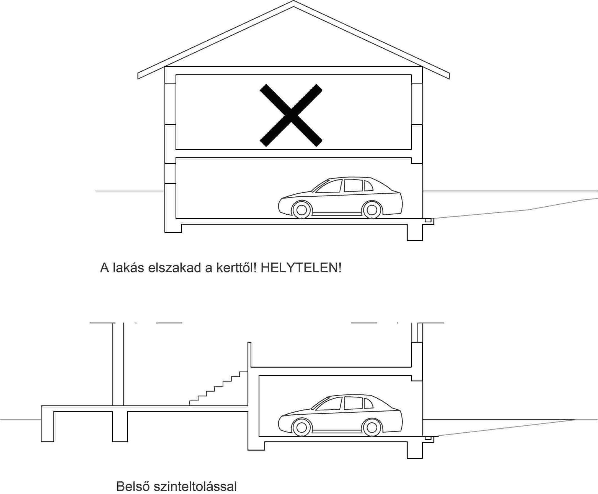

*3.26. ábra – Alagsori gépkocsitároló sík terepen*

> **Megjegyzés**
>
> A fenti felsorolásban az az egyes módozatok alapvető problémáira azért hívtuk fel a figyelmet, hogy a körülményekhez leginkább illő konkrét megoldás kiválasztását elősegítsük. Már a tervezés kezdeti stádiumában érdemes a gépkocsitárolás mikéntjét elemezni, mert az a ház térbeli elrendezésének egyik meghatározó eleme. Mint legtöbb tervezési kérdésben, itt sincs valamilyen, egyedül jónak ítélhető megoldás.

A gépkocsitároló kialakításakor különös gondot kell fordítani annak megközelítésére: a behajtó út lehetőleg ne rontsa a kert értékes részeit, és ha az út nem egyenes, fordulati sugara legyen a beálláshoz elegendő.

> **Megjegyzés**
>
> A gépkocsitárolóba történő behajtáshoz és az autóból történő kényelmes, biztonságos kiszálláshoz érdemes nagyobb, szélesebb helyet biztosítani a minimális helyigényen felül. Ez elkerülhetetlen az akadálymentesség igényével tervezett háznál, és – ha lehetséges – a kényelmes használat és a későbbi adaptálhatóság érdekében is javasolt.
>
> Ajánlott a gépkocsi és a mellette kialakult ki- ill. beszállósáv együttes szélességi méretét legalább 3,60 m-ben rögzíteni. Ez a szélesség a gépkocsi akadálymentes megközelíthetőségét biztosítja, és lehetővé teszi, hogy a gépkocsi ajtaja teljesen felnyitható legyen. Így a nehézkesen mozgó idősebbek számára is kényelmesebb a ki- és beszállás, elegendő hely áll rendelkezésre a gyermekek autósülésbe történő beültetésére valamint az ülésen lévő tárgyak kiemelésére.
>
> Javasolható, hogy a garázs hossza legalább 6 - 6,50 m legyen annak érdekében, hogy a csomagtartóban szállított kerekesszék, csomag, babakocsi kiszedéséhez megfelelő hely álljon rendelkezésre a belső térben.
>
> Ha a lakóépületben külön általános tároló nem készül, a gépkocsi melletti szélesebb közlekedő zóna vagy a gépkocsi tároló megnövelt hossza révén kialakuló plusz terület egy része tárolásra is szolgálhat, ami lakóépület használati értékét növeli.
>
> Az alagsorban vagy pinceszinten kialakított gépkocsitároló a használat szempontjából is előnytelen: a gépkocsi megközelítése, csomagok cipelése, a ki-be pakolás sok lépcsőzést igényel a mindennapos használat során, amely főleg idősebbek számára megerőltető. A bejárati szinttől eltérő szinten kialakított gépkocsitároló a mozgásukban korlátozottak számára lehetetlené teszi a gépjármű megközelítését, így a lakóépület esetleges későbbi akadálymentes használatát korlátozza. (P.A.)

### 3.3.7. Terepre illesztés

A lejtős telek igen gyakori adottság a városok zöldövezeteiben és a nagyvárosi agglomerációkban. Az épület terephez való viszonyát alapvetően a telek lejtésének mértéke, a telek geometriai formája (szélesebb vagy keskenyebb telek), az épület nagysága és magassága (szintszáma) befolyásolja.

Gyakran látható, hogy eredetileg sík terepre tervezett, vagy sík terepre illő épületeket építenek lejtős terepre is úgy, hogy a telek egy részét teljesen vízszintesre egyengetik az épület környezetében. Ez csak akkor elfogadható, ha az épület kiterjedése a lejtőre merőlegesen nem nagy (a rétegvonalakkal párhuzamos hossztengellyel elhelyezett, keskeny épület), és/vagy a telek lejtése igen kismértékű. A tereprendezés szükséges vagy elfogadható mértéke attól függ, hogy az épület hegy felöli és völgy felöli terepcsatlakozásai között mekkora a rendezetlen terepfelszín magasságkülönbsége. Ha a keskeny telek lejtőre merőleges irányban nyújtott épületet kényszerít ki, a szintkülönbség jelentős lehet akkor is, ha a terep viszonylag enyhén lejt.

Arra kell törekedni, hogy a terep eredeti morfológiai karakterét minél jobban megőrizzük. Egyrészt azért, mert a nagymérvű földmunkák jelentős költségtöbblettel járnak és az alapozási költségeket is legtöbbször növelik, másrészt azért, hogy a telek eredeti természeti állapotát: terepformáit, eredeti növényzetét a lehető legkisebb mértékben károsítsuk.

Helytelen az olyan terepre illesztés, amikor az épületet nagymértékű feltöltésre helyezik: csúnya mesterséges domb keletkezik, a teherbíró talajrétegig mélyített alapozás felesleges költségtöbbletet okoz ([3.27. a. ábra](#abra_3_27)).

Ha a tereprendezést főképpen a hegy felőli oldal elbontásával végzik, akkor az épület „kőfejtő” jellegű mélyedésbe kerül, amelynek mélyén vízzsák keletkezhet. A kitermelt talajt el kell szállítani, a hegyfelőli homlokzat – és részben az oldalhomlokzatok – ablakai nagy, mesterséges rézsűkre néznek ([3.27.b. ábra](#abra_3_27)).

Általános - de a mindenkori helyzethez igazítandó - elv a „földegyenleg” elve, amely szerint a kiemelt és feltöltött földmennyiség térfogata legyen azonos. Ez nemcsak a talaj szállítási költségeinek megtakarítás érdekében szükséges, hanem azért is, mert általában ez kívánja az eredeti terepfelszín legkisebb átformálását. Eszerint – egyszintes, keskeny épület esetében – a földszinti padlóvonal az alaprajzot középen átmetsző rétegvonal magasságának közelében (annál kissé magasabban) helyezkedik el ([3.27.c. ábra](#abra_3_27)).

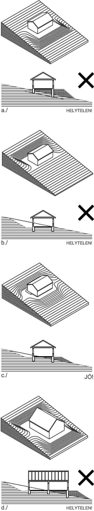

*3.27. ábra – Az épület terepre illesztése*

A lejtőre merőlegesen nagy kiterjedésű épület esetében azonban ez a módszer önmagában nem jó: ugyanolyan, bántóan nagy mesterséges földrézsűket kényszeríthet ki, mint a korábban helytelennek ítélt megoldások és szinte a telek teljes felszínének átformálását igényli ([3.27. d. ábra](#abra_3_27)). Ilyen esetben az épület térbeli elrendezését kell a terephez illeszkedően megtervezni úgy, hogy *a terephez csatlakozó belső terek padlóvonalát különböző magasságban helyezzük el.* Az alábbiakban néhány, gyakori alapelrendezést ismertetünk, annak előre bocsátásával, hogy a házak lehetséges térbeli elrendezésének skálája ennél lényegesen gazdagabb, és a tervezési program, a konkrét helyszín adottsága mindenkor egyedi, és a jó megoldás nem nélkülözheti a tervező leleményét és fantáziáját.

Ha a hegy felől és völgy felől csatlakozó eredeti terepfelszín különbsége nem nagy (nem haladja meg az egy métert), a földszinti padló szintjeinek magassága különböző lehet úgy is, hogy a mennyezet magassága azonos: ezáltal a lejjebb kerülő terek belmagassága nagyobb lesz. Ha ezek tágasabb lakóterek (mint pl. a nappali szoba) a nagyobb belmagasság kifejezetten előnyös ([3.28.a. ábra](#abra_3_28)).

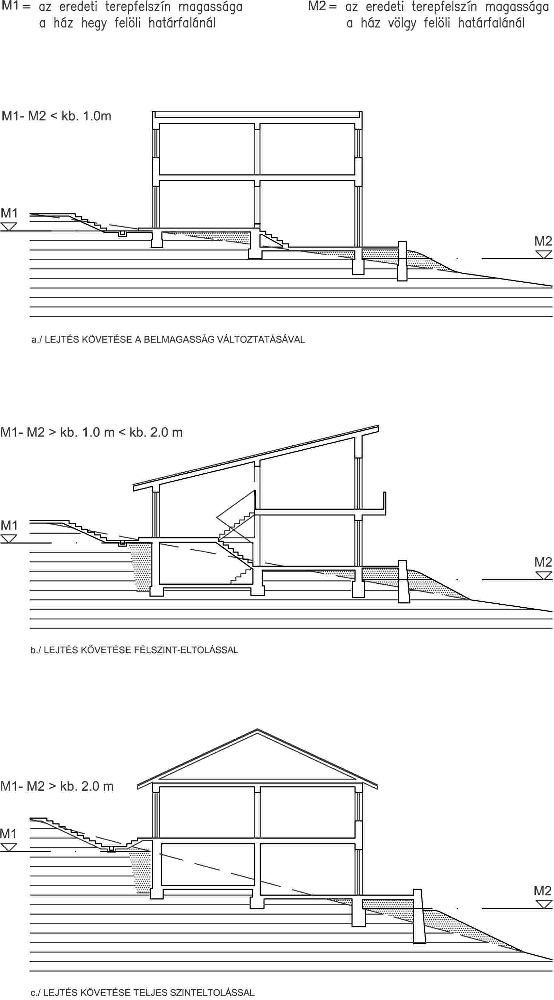

*3.28. ábra – Az épület szintjeinek terepre illesztése*

Lehetséges a ház két (vagy több) tércsoportjának függőleges elmozdítása. A félszint-eltolás ([3.28.b. ábra](#abra_3_28)) impozáns belső térkapcsolatokat eredményezhet, de igen gyakran jár azzal a hátránnyal, hogy az intenzív kapcsolatot igénylő lakásterek is különböző magasságban vannak, emiatt a lakásban való mozgás állandó lépcsőjárást igényel.

Ha az eredeti terepfelszín különbsége az alsó és felső oldal között viszonylag nagy (két méter körüli vagy annál több) akkor alkalmazható olyan térbeli elrendezés, amelynél az alsó szint völgy felőli homlokzata mögött teljes értékű lakóhelyiségek vannak, míg ugyanezen szint a hegy felőli oldalon pincévé válik ([3.28.c. ábra](#abra_3_28)). (A földegyenleg elve – természetesen – nem érvényesíthető maradéktalanul, ha az épület alá pince kerül, mert a feltöltés esetleg túl magas vagy túl nagy kiterjedésű lenne.)

A lejtős terepeken igen gyakori, hogy a talaj egy – a lejtés síkját követő – vízzáró rétege mentén rétegvíz jelentkezik, amely a hegy felőli pincefal mögött feltorlódhat, ott talajvíz-nyomás keletkezhet. Ilyen esetben szivárgórendszert kell kialakítani.

Az épület közvetlen terepcsatlakozása mindig közel vízszintes síkok mentén történik. (Ritka kivételtől eltekintve, mint pl. lábakra állított, vagy valamely különleges építészeti hatás érdekében körüljáró járda nélkül kialakított épületnél.) Az épület körüli járda legfeljebb néhány százalékos mértékben lejthet, egyébként – kivált télen – nem lenne járható, ezért nem funkcionálna. Az épület körüli terepszint-különbségeket a járda közel vízszintes síkjai közé illesztett tereplépcsőkkel kell követni. A tereprendezésnél ügyelni kell arra, hogy lakóhelyiség padlóvonala ne kerüljön a hozzá csatlakozó terepfelszín alá. Ezért a terepre illesztés során a csatlakozó terepfelszínt is meg kell tervezni, lehetőleg a teljes telekre kiterjedően, a szükséges rézsűkkel, esetleges támfalakkal és folyókákkal együtt. El kell kerülni, hogy a csapadékvíz az épület felé folyjon: a hegy felőli oldalon kis mérvű „ellenlejtést” kell kialakítani. A szomszéd ingatlan értékének védelme miatt a kerítéshez közvetlenül csatlakozó terep felszínét átformálni nem szabad – itt nem lehet támfal sem – ezért a rendezett rétegvonalak a kerítések mentén eredeti helyzetükhöz fussanak ki. A csapadékvizet nem szabad a szomszéd telkére vezetni. Az épület körüli tereprendezés sémáját a [3.29. ábra](#abra_3_29) mutatja.

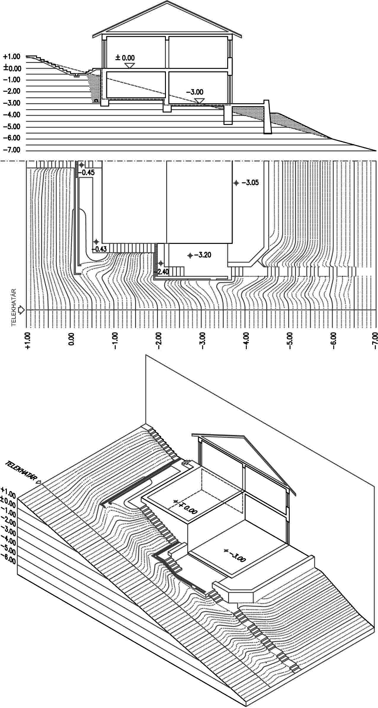

*3.29. ábra – Az épület körüli terepfelszín rendezése*

Lejtős terepen külön problémát okoz a *megközelítés*, kivált a gépkocsi-megközelítés, és a gépkocsitároló kialakítása. Ha a terep 15-16%-nál meredekebb, a gépkocsi az eredeti terepfelszínen kialakított úton mozogni nem tud, ezért az út hegy felőli oldalán a gépkocsitároló általában a terephez csatlakozó szint alá kerül, a völgy felőli oldalon pedig a felső szintre ([3.30. ábra](#abra_3_30)).

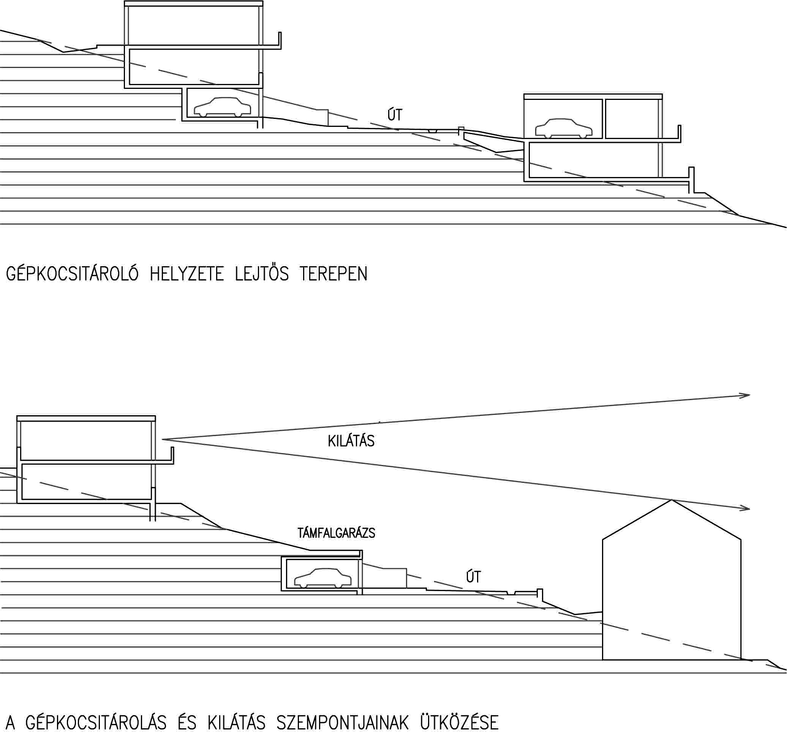

*3.30. ábra – Gépkocsitároló helyzete lejtős terepen*

A lejtős terepen gyakran kivételes környezeti érték a szép *kilátás*. Ha a telek alsó részén nem jelöltek ki építési vonalat, néha célszerűnek látszik az úttól emelkedő telek felső részére építeni a házat, és lent, az út mellett támfalgarázst kialakítani ([3.31. ábra](#abra_3_30)). Ilyenkor a ház bejáratáig viszonylag hosszú, emelkedő utat kell gyalogosan leküzdeni, és a gépkocsitárolónak nincs belső kapcsolata a lakással: ez kétségtelen hátrány. A különböző értékszempontok itt is ellentmondanak, és eseti döntést igényelnek.

## 3.4. Családi házak oldalhatáron álló beépítési módban

Ez a beépítési mód hazánkban igen elterjedt, a falvainkban ez az uralkodó. Ennek történelmi hagyományai vannak (lásd a 3.1.1 fejezetet).

> Az OTÉK szerint
>
> „ Az építési telek épület elhelyezésére szolgáló területrészét (építési hely) építési határvonalakkal kell meghatározni úgy, hogy
>
> (...)
>
> b) oldalhatáron álló beépítési mód esetén annak egyik építési határvonala a telek egyik oldalhatára legyen, (...)”

A telken az *építési hely* határvonala a telek egyik oldalhatárával megegyezik, vagyis az épületet közvetlenül az egyik telekhatárra lehet vagy kell építeni. Egy-egy utcában lévő teleksor építési határvonalát a szabályozási terv rögzíti: az építési határvonallal egybeeső telekhatár a kedvezőtlenebb tájolású, legjobb esetben északi oldalhatár. A szomszéd épülettől való távolság garantálása érdekében az oldalkert (itt csak egy oldalkert van!) a megengedett építménymagassággal azonos szélességű, de legyen legalább 6.00 m. Az utóbbinál keskenyebb oldalkert legfeljebb kialakult, kényszerű helyzetekben lehet indokolt. Az épületet nem kötelező az oldalhatárra építeni, ha erről a helyi szabályozás nem rendelkezik kötelező építési vonal megadásával. Egyes vidékeken hagyomány a szomszéd telekhatártól 1 m-re elmaradni (un. „csurgótávolság”), hogy a tetővíz ne a szomszéd telkére folyjon, és, hogy a szomszéd felé néző homlokzat karbantartására ne kelljen a szomszéd telkét igénybe venni. (Régen – amikor a házat évenként meszelték – a szomszéd által erre biztosított „szolgalmi jog” legtöbb helyen magától értetődő szokásjog volt.) A „csurgótávolságot” a helyi szabályozás előírhatja kötelező építési vonal kijelölésével. Akkor lehet ez indokolt, ha a telkek megfelelően szélesek: a szomszéd felőli, egy méteres teleksáv ugyanis semmilyen használati értékkel nem bír ([3.32. ábra](#abra_3_32)).

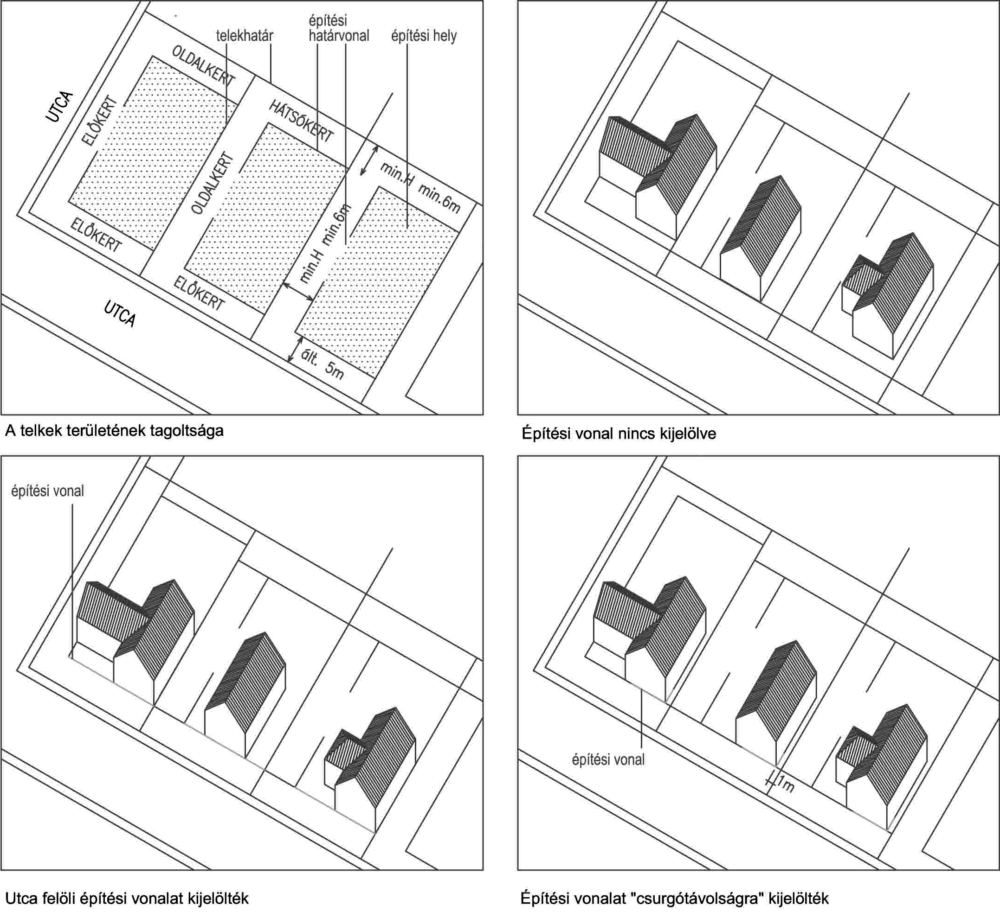

*3.32. ábra – A telkek beépítésének szabályai oldalhatáron álló beépítési módban*

A hagyományos, fésűs beépítésű parasztháznak a szomszéd felé ablaka nem nyílott, de a megváltozott életmód és lakáshasználati normák miatt a fésűs beépítés hagyományos épülettípusát (keskeny, egytraktusos két- vagy háromosztatú ház) ma már nem lehet alkalmazni. A több szoba és mellékhelyiség (WC, fürdő, közlekedők) igénye miatt általában a szomszéd felé is szellőzőablakot kell nyitni. Azért, hogy ez ne zavarja az elkerülhetetlennél nagyobb mértékben a szomszédot, az ablakok kialakítására hatósági megkötéseket tesznek. Az ablakparapeteknek olyan magasnak kell lennie, hogy az álló ember ne lásson át a szomszédba (min 1.80 m). A *zavaró áthallások* elkerülése miatt nem nyílhat a szomszéd felé huzamos tartózkodásra szolgáló helyiség – szoba, konyha – ablaka sem. (Ezt a szabályzat az ablakméret korlátozásával éri el: a szomszéd felé nyitott szellőzőablak nem lehet 0.4 m2-nél nagyobb.) Ugyanezek az előírások vonatkoznak a tetőablakokra is, ha a tető 30 foknál meredekebb. A szomszéd felé pinceablakok sem nyílhatnak csak abban az esetben, ha az épület a szomszéd telektől legalább 1.00 m távolságba kerül ([3.33. ábra](#abra_3_33)). Ha az épület vagy annak egyes részei nem szabályos téglalap alakúak, hanem sokszögűek, akkor a telekhatárral szöget bezáró falra ezek a megkötések mindaddig vonatkoznak, ameddig a fal és a telekhatár által bezárt szög kisebb 60 foknál ([3.34. ábra](#abra_3_34)). Ha az épület vagy épületrész az oldalhatártól legalább 3.00 m-rel elmarad, ezek a korlátozások megszűnnek.

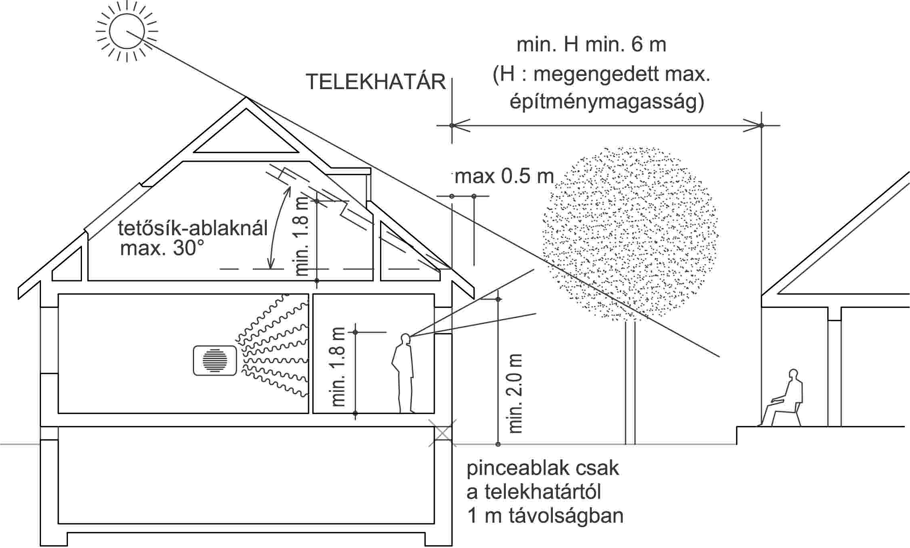

*3.33. ábra – Az oldalhatáron álló beépítés főbb szabályai*

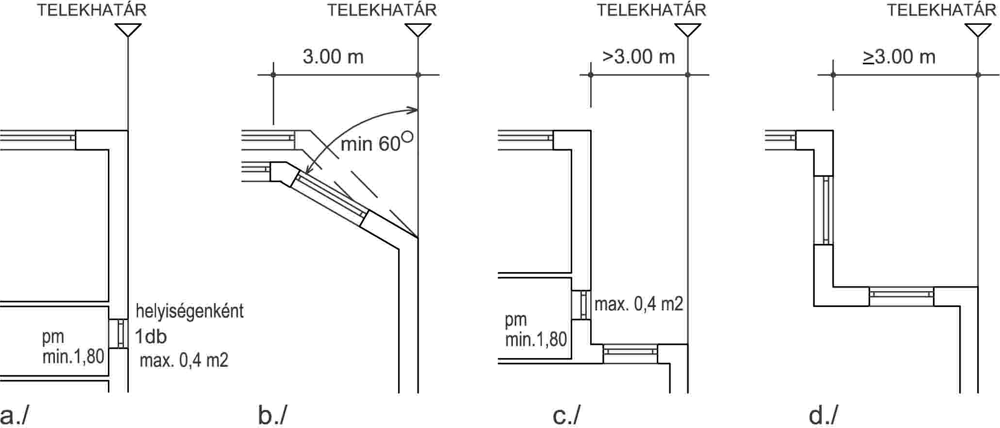

*3.34. ábra – Ablakok elhelyezése az oldalhatáron álló homlokzaton*

Az eresz legalább 2 m magasságban és legfeljebb 0,5 m-re nyúlhat át a szomszéd telekre, de a csapadékvizet a saját telekre kell visszavezetni.

**A nem lakás célú épületek elhelyezése a telken fontos tervezési szempont falusi környezetben. Falvainkban a mezőgazdasági funkció (kertészkedés, állattartás) még most is jelen van a portákon, amelynek tartozékai a „melléképületek”, a mezőgazdasági-üzemi épületek. A telek funkcionális tagoltsága (lakóudvar, gazdasági udvar, haszonkert) a mai napig létezik. Az összetett funkciójú telekhez azért alkalmas az oldalhatáron álló beépítés, mert a lakóépület mellett kialakuló viszonylag széles oldalkert lakófunkciót teljesíthet. A telek mélye felé, az állattartási épületekre és gazdasági udvarra lakóhelyiség megnyitása aligha kívánatos ([3.35. ábra](#abra_3_35)).**

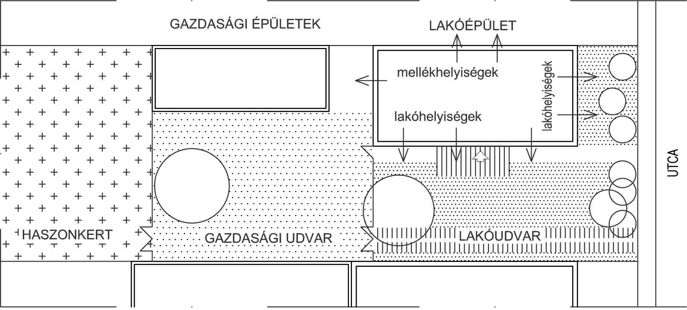

*3.35. ábra – A mezőgazdasági funkciót is teljesítő falusi telek hagyományozott tagoltsága*

A nem lakás célú épületek között kritikus az állattartási épületek helyzete és a lakóépülethez való viszonya. Korábbi építési szabályzatok ezt bizonyos védőtávolságok előírásával kívánták szabályozni, majd a ház körül tartható állatok számának behatárolásával – egyik szabályozás sem bizonyult hatásosnak. A ma országos érvényű szabály szerint állattartási épület nem kerülhet az utcavonalhoz 15,00 m-nél közelebb – ez önmagában nem zárja ki, hogy állattartási épület a lakóépület közvetlen közelébe épüljön, ami semmiképpen sem kívánatos. Az állattartás szabályozása helyi önkormányzati rendelet hatáskörébe tartozik, de fontos építészeti-tervezési kérdés is.

A *gépkocsitároló* szokásos helye a melléképületek között van, de ekkor az oldalkerten kell autóval áthajtani. Az áthajtót ilyenkor kulturáltabban, kerti tipegőkövekkel, műanyag gyepráccsal, zöldbetonnal stb. is ki lehet alakítani. Ha a telek elég széles, maga a gépkocsitároló kerülhet az oldalhatárra ([3.36. ábra](#abra_3_36))

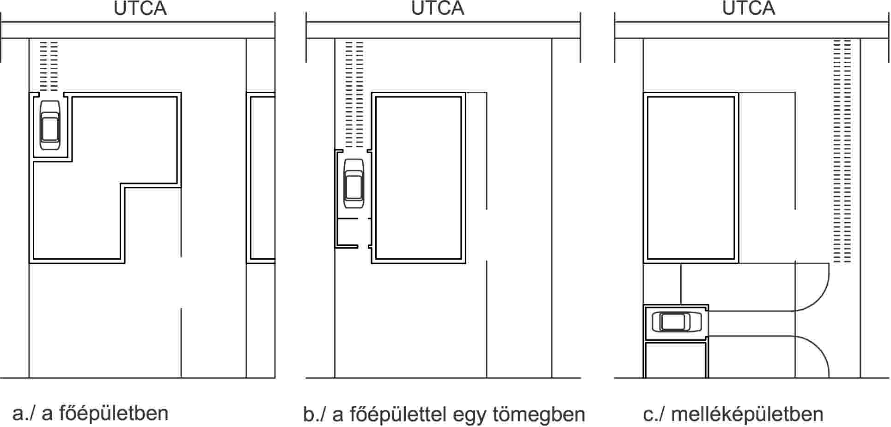

*3.36. ábra – Gépkocsitároló elhelyezésének sémái oldalhatáron álló családi házaknál*

*Kertkapcsolat* lényegében csak az elő- és oldalkerttel létesíthető, ha közvetlenül a lakóépület mögött gazdasági udvar van. Ma már gyakori – különösen a városi agglomerációkban lévő, épp a funkcióváltás periódusában lévő községekben – hogy a korábban kialakult, oldalhatáron álló beépítésű telek egésze pihenőkertként funkcionál. Ilyenkor – természetesen – nem kívánatos a kertet a lakástól melléképülettel elzárni.

**Benapozás és tájolás szempontjából gondot okoz a lakóhelyiségek elhelyezésének korlátozott volta. Az oldalkertre általában lakóhelyisége néznek, igen gyakran a nappalinak is ez a lehetséges tájolási iránya. Az építési követelmények által biztosított 1:1-es légtérarány a teljes értékű benapozáshoz sokszor nem elegendő. Még a 6 méteres oldalkert benapozása is csak akkor jó, ha az épület földszintes, legfeljebb 4 - 4,5 m magas. Ezért az emeletes épületek oldalhatáron álló beépítési módját célszerű elkerülni a szabályozási tervek készítése során.**

## 3.5. Családi házak ikres beépítési módban

A városi családi házas területeken alakult ki az ikres beépítési mód, telektakarékossági okokból. A két szomszédos épület itt is a telekhatárra épül, de *azonos* telekhatárra, ahol egymáshoz csatlakoznak, és látványra egy épületet képét mutatják ([3.37. ábra](#abra_3_37)). Néha ikerháznak nevezik az olyan kétlakásos épületet is, ahol hasonlóképpen csatlakozik egymáshoz két lakás, de a telkük közös. Ez *nem* azonos az ikres beépítési móddal. ([3.38. ábra](#abra_3_38))

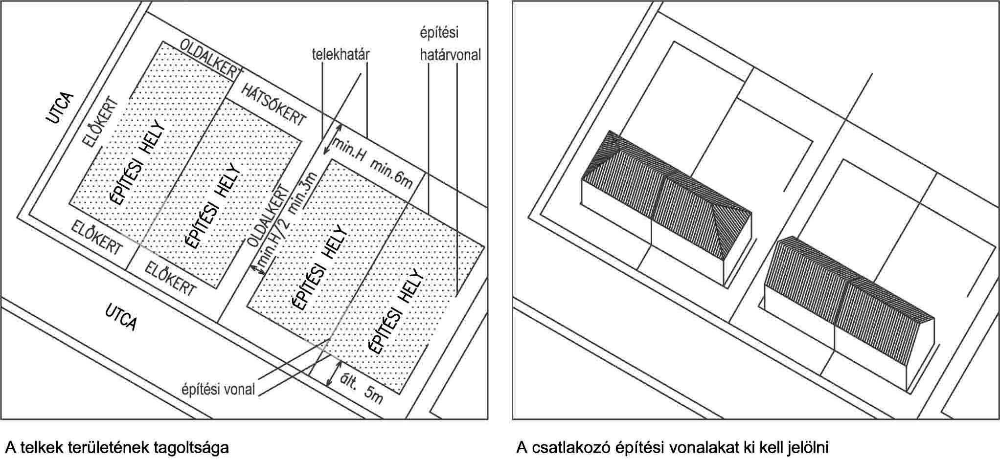

*3.37. ábra – A telkek beépítésének szabályai ikres beépítési módban*

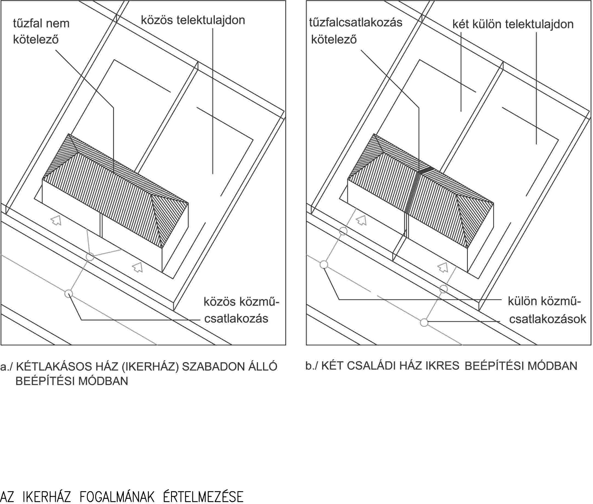

*3.38. ábra – Az ikerház fogalmának értelmezése*

> Az OTÉK szerint
>
> „Az építési telek épület elhelyezésére szolgáló területrészét (építési hely) építési határvonalakkal kell meghatározni úgy, hogy
>
> (...)
>
> b) ikres beépítési mód esetén a szomszédos telkek egymás felőli építési határvonala a telkek közös oldalhatára legyen, (...)”

A telken itt is csak egy oldalkert van, amelynek előírt legkisebb szélessége a családi házéval azonos (építménymagasság fele, de legalább 3 m).

Az ikresített beépítési módnál két, külön telken álló, birtokjogilag teljesen független épület épül a közös telekhatárra, sem a telkeknek, sem az épületeknek nem lehetnek közös tulajdonú részei. Az épületek egymástól függetlenül tarthatók karban, sőt igen gyakran nem is egy időben épülnek meg. Az ikresített házak a telekhatáron két, saját telken álló fallal – *tűzfallal* – csatlakoznak. A két építtetőnek a tervezési program megformálásakor egyet kell érteni, a tervező(k)nek gondosan kell arra ügyelni, hogy a két ház tömege, homlokzata harmonikusan illeszkedjék egymáshoz. Az építtetők kölcsönös megegyezését kívánja a pince létesítése, mert a csatlakozó falak alapozási mélységének azonosnak kell lenni. Ez használati érték nélküli költség annak, aki nem akar pincét ([3.39. ábra](#abra_3_39)).

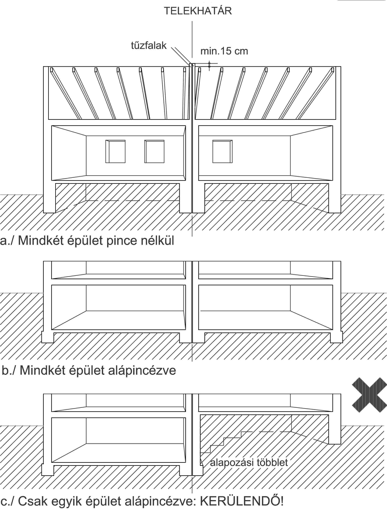

*3.39. ábra – Családi házak csatlakozása ikres beépítésben*

A tűz elleni védelmet itt a csatlakozó határfalak kialakításával kell biztosítani, amelyeknek megfelelő tűzállósági fokkal kell rendelkezniük (a téglafal ezt általában teljesíti) és kissé a tető fölé kell magasodniuk azért, hogy a tetőszerkezeten a tűz ne terjedhessen át a szomszéd házra. Kívánatos (de nem kötelező), hogy a tűzfalak egymást kölcsönösen takarják, hogy a telekhatáron álló épületrészek karbantartásához ne kelljen a szomszéd telkét igénybe venni.

*Zavaró átlátások és áthallások* létrejöttét eleve akadályozza, hogy az épületeknek nem lehet ablaka a szomszéd felé a telekhatáron. Kiugró épületrészen csak akkor nyílhat ablak a szomszéd felé, ha az ablak és a telekhatár között legalább 3 m távolság van. A szomszéd telekhatár felé nem merőleges irányban tartó falban csak akkor lehet ablak a telekhatártól mért 3 m távolságon belül, ha a fal és a telekhatár vonala által bezárt szög nagyobb 60 foknál. ([3.40. ábra](#abra_3_40)).

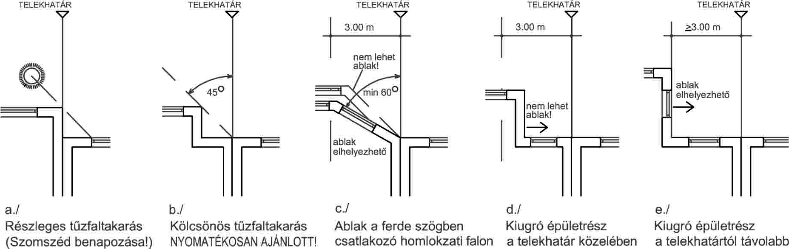

*3.40. ábra – Homlokzati falak csatlakozása a telekhatáron*

*Benapozás és tájolás* feltételeinek biztosítása ikerházak esetén gyakran gondot okoz. Elvben mód van arra, hogy a két épület egymás tükörképe legyen, ekkor azonban a két oldalhomlokzat tájolása ellentétes irányú lesz, és ami egyiknél jó, az esetleg rossz a másiknál. Legtöbbször kedvezőbb, ha a két lakás kialakítása nem azonos. A három szabad homlokzat miatt általában nem áll elő megoldhatatlan helyzet, de az igaz, hogy a két telek adottságai benapozás szempontjából sokszor nem egyenértékűek ([3.41. ábra](#abra_3_41)).

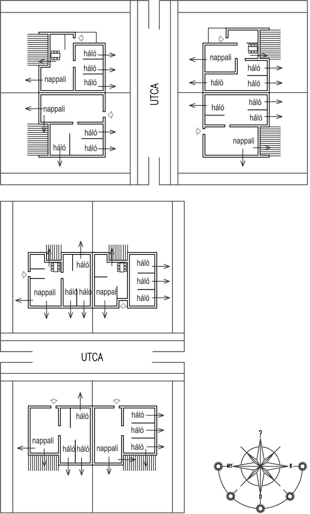

*3.41. ábra – Ikerházak egységeinek kialakítása különböző tájolási feltételek mellett*

*Kertkapcsolat* szempontjából a két épület térbeli közelsége fokozott tervezési gondosságot követel. Ügyelni kell arra, hogy ne csatlakozzanak egymáshoz teraszok a közös telekhatáron, a két kert intenzívebben használt részei között maradjon takaró növényzetnek elegendő hely.

*Nem lakás célú épületek* („melléképületek”) létesítését ikres beépítési módnál érdemes kerülni. Ezeket nem kötelező ugyan a közös telekhatárra építeni, de mindenképpen az építési határvonalakon belül kell lenniük. Mivel az ikres beépítés oldalkertje a szabadon álló beépítéshez hasonlóan keskeny és kertkapcsolat szempontjából nem teljes értékű, a hátsó homlokzat kertkapcsolatát melléképületekkel akadályozni helytelen.

A gépkocsitároló kialakítása történhet az épületben, az épület mögött vagy az épület mellett. Lehetőség van arra, hogy a két épületnek a gépkocsitárolója a közös telekhatáron álljon ([3.42. ábra](#abra_3_42)).

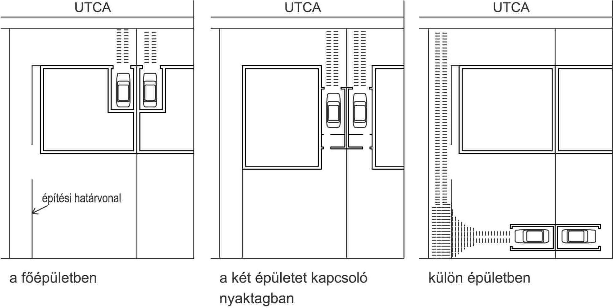

*3.42. ábra – Gépkocsi-elhelyezés sémái ikres beépítésű családi házaknál*

## 3.6. Családi házak zártsorú beépítési módban

A kisvárosok belső, nagyobb sűrűségű családi házas területein kialakult beépítési mód. A viszonylag keskeny telkek miatt a telek utcai homlokvonala teljes szélességében beépül, és az épületek mindkét oldalon tűzfallal csatlakoznak. Sajátos beépítési módot jelent az un. *„félzártsorú”* beépítés, amikor az eredetileg oldalhatáron álló – fésűs – beépítés átformálódott, a hosszú épülethez keresztszárnyat építettek az utca vonalán, de a szomszéd telekhatártól még elmaradva. A keresztszárny melletti oldalkertet később lefedték (szárazbejáró) így az utca zártsorúvá vált. A beépítési mód az oldalhatáron álló és zártsorú beépítés sajátos hibridje lett, ugyanis az oldalszárny szomszéd felöli homlokzata itt nem tűzfalszerű. (Lásd még 3.1. fejezet, [3.2. ábra.](#abra_3_02)) A második világháború után a családi házak zártsorú beépítése új telekosztásokon szinte teljesen megszűnt. Ma leginkább meglévő lakóterületek foghíjtelkeinek beépítése, vagy település-rehabilitáció során fordul elő, de helyenként ismét alkalmazzák az újonnan alakított lakóterületeknél is.

A régebbi szakirodalomban előfordul, hogy a zártsorú formában megvalósult épületeket „sorháznak” nevezik, ez azonban nem azonos azzal a fogalommal, amely a *csoportház* (sorház, láncház, átriumház) gyűjtő meghatározásba tartozik. A zavar elkerülésére tisztázni kell a fogalmakat.

A *hagyományos, zártsorú* beépítésnél az előzetesen kialakított telkeken az épület jellegét, térbeli kialakítását csak annyiban kötik meg, amennyit az országos és helyi szabályozás előír. A szabályok kereteiben minden tulajdonos szabadon építkezhet, általában *épületenként eltérő tervek alapján*, legtöbbször nem is egy időben.

A „csoportházak” épületei – sorház, láncház, átriumház – magas sűrűség elérésére tervezett, speciális épületfajták, lakásegységeik *egységes építési terv alapján, egyszerre épülnek*, és csak a fenntartás és birtoklás tekintetében képezhetnek külön ingatlanokat, ha az egységekhez tartozó telket birtokjogilag is leválasztják. Ezért ezeket nem itt, hanem „Az alacsony, nagy sűrűségű beépítések épülettípusai” c. fejezet keretében tárgyaljuk.

> Az OTÉK szerint
>
> „Az építési telek épület elhelyezésére szolgáló területrészét (építési hely) építési határvonalakkal kell meghatározni úgy, hogy
>
> (...)
>
> d) zártsorú és csoportos beépítési mód esetén annak a telek előkerti építési határvonalához csatlakozó oldalai a telek két oldalhatárán legyenek.”

A meglévő foghíjtelkek beépítése és a település-rehabilitációk során egy kialakult állapotba való rugalmasabb beilleszkedés lehetősége érdekében az OTÉK *nem* minden esetben írja elő a szomszéd felé a „tűzfalcsatlakozást”, tehát a házat nem mindig kötelező az oldalsó telekhatárra építeni. A ház épülhet akár „fél zártsorú” formában, amikor az épület csak egyik telekhatárra épül rá. Ha megszakítatlan, zártsorú utcakép kívánatos, a telekhatárra való építést elő kell írni. Ugyancsak elő lehet írni, és a szabályozási terven jelölni, hogy az épületek zárt sora helyenként megszakadjon. (Az épületköz legalább az építménymagasság 2/3-a). A közös telekhatárra való építésnél az ikerházas beépítési módnál leírt szabályok itt is érvényesek, mindkét telekhatáron (lásd [3.40. ábra](#abra_3_40)).

Az országos érvényű követelmények nagy szabadságfoka miatt ennél a beépítési formánál nagy szerep hárul a rendezett lakókörnyezet kialakulása érdekében a helyi szabályozásra. Ezzel kapcsolatosan az alábbi ajánlásokat lehet tenni:

Ha a zártsorúan csatlakozó telkek nem egyszerre épülnek be, akkor a telek utcai homlokvonalának szélességét – új telekosztáson – legalább 10 m-ben ajánlott meghatározni. (Keskenyebb telek a közműcsatlakozások miatt jelenthet problémát, és építési-felvonulási területként sem megfelelő.)

Akkor, ha zártsorú utcakép megtartása vagy kialakulása kívánatos, akkor építési vonalakkal kell megkötni az épületek helyét. Abban az esetben, ha hátranyúló oldalszárny építése megengedhető, akkor ennek helyét is építési vonallal kell rögzíteni.

Az *utcai* *homlokzatmagasság* szabályozása bizonyos határértékek között indokolt (az előírt „építménymagasság” betartása önmagában nem garantálja az utcai homlokzatok egységes megjelenését, mert pl. az utcai és a kerti homlokzat magassága különbözhet is azonos építménymagasság mellett).

A szomszédos ingatlanok használati értékének (kerthasználatának, benapozásának) biztosítása érdekében a hátsókert építési határvonalát úgy kell kijelölni, hogy a csatlakozó homlokzatok ne árnyékolják egymást az elkerülhetetlennél nagyobb mértékben (pl. azáltal, hogy a szomszédnak a közös telekhatáron álló épülete mélyen a kertbe nyúlik), ez különösen fontos, ha a helyi szabályzat magasabb, emeletes épületeket is megenged.

Régebben előírás volt, hogy a telek hátsókertje felé kiugró épületrész nem eshet a csatlakozó homlokzatokhoz a közös telekhatáron 45 fokos szögben húzott vonalon belül ([3.44. ábra](#abra_3_44)). Ma is lehetőség van a hátsókert felőli építési határvonal ilyen kijelölésére.

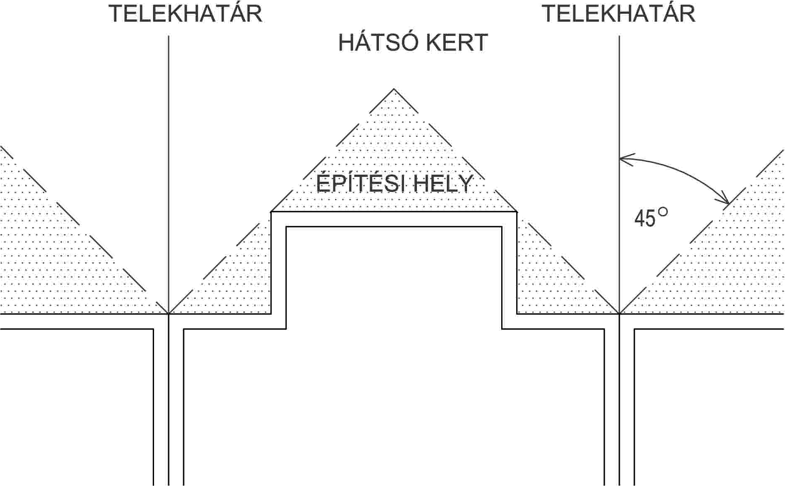

*3.44. ábra – Régebben alkalmazott (a helyi szabályozásban most is alkalmazható) szabály a kert felőli építési határvonal kijelölésére*

*Kölcsönös tűzfaltakarás* – bár ma már nem kötelező – nyomatékosan ajánlott annak érdekében, hogy a közös telekhatárra épülő homlokzat takaratlan részének karbantartásához vagy felújításához ne kelljen a szomszéd telkét igénybe venni.

*A benapozás és tájolás* feltételei értelemszerűen korlátozottak, mivel a lakóháznak csak két homlokzata van, mert mindkét oldalon a szomszédjához csatlakozik.

A *kertkapcsolat* és benapozás szempontjai gyakran egymás ellenében hatnak: a prioritás érvényesítése mindenkor eseti tervezési kérdés. Gondolni kell a kert fenntartási célú megközelítésére. Ez lehetőleg a lakás tereinek érintése nélkül történjék, de ha ez elkerülhetetlen, akkor az utcától a kertig könnyen tisztítható, alárendeltebb jelentőségű helyiségsor vezessen. Ez az un. „hidegpadlós átjárás” ([3.45. ábra](#abra_3_45)).

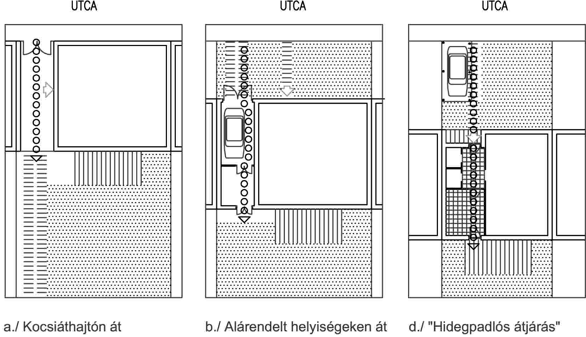

*3.45. ábra – A kert fenntartási célú megközelítése zártsorú beépítési módban*

A *gépkocsitároló* kialakítása sokszor problémát jelent. A hátsókertbe nem kerülhet „melléképület” sem, ezért az utcával párhuzamosan kijelölt, a kívánatos épületmélységnek megfelelő építési határvonal a gépkocsitárolót a főépület tömegébe kényszeríti, ami az értékes utcai homlokzatból vesz el. A hagyományos, zártsorú épületek kapualjait ma is gyakran használják gépkocsibeállónak: ez azért is jó, mert lehetővé teszi a kert fenntartási célú megközelítését ([3.46. ábra](#abra_3_46)).

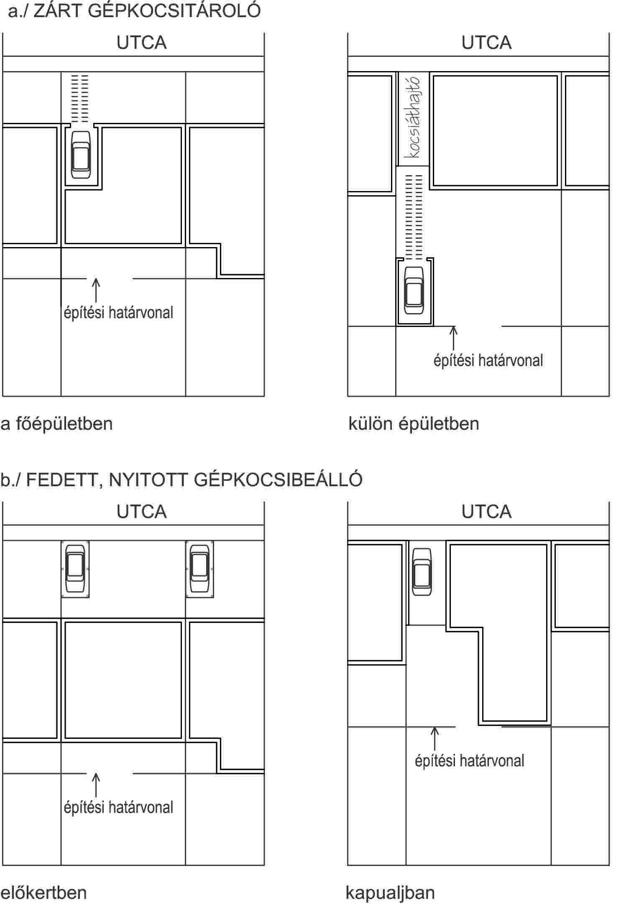

*3.46. ábra – Gépkocsi-elhelyezés sémái zártsorú családi házaknál*

## 3.7. Családi házak kialakítása

### 3.7.1. Családi házak térbeli elrendezése, szintjei

A családi házak térbeli elrendezését az építési program, a helyszín adottsága, és – természetesen – az építész tervezői szándéka határozza meg.

A családi házak egy vagy kétszintesek, ritkábban 3 vagy több szintesek (gyakori a két szint + tetőtér, de három teljes szint kialakítására a családi házak építésére alkalmas építési övezetek általában nem adnak lehetőséget). Differenciáltabb térbeli elrendezések is lehetségesek, ilyenek a részben kétszintes, összenyitott légterű és belső szinteltolással kialakított házak ([3.47. ábra](#abra_3_47)).

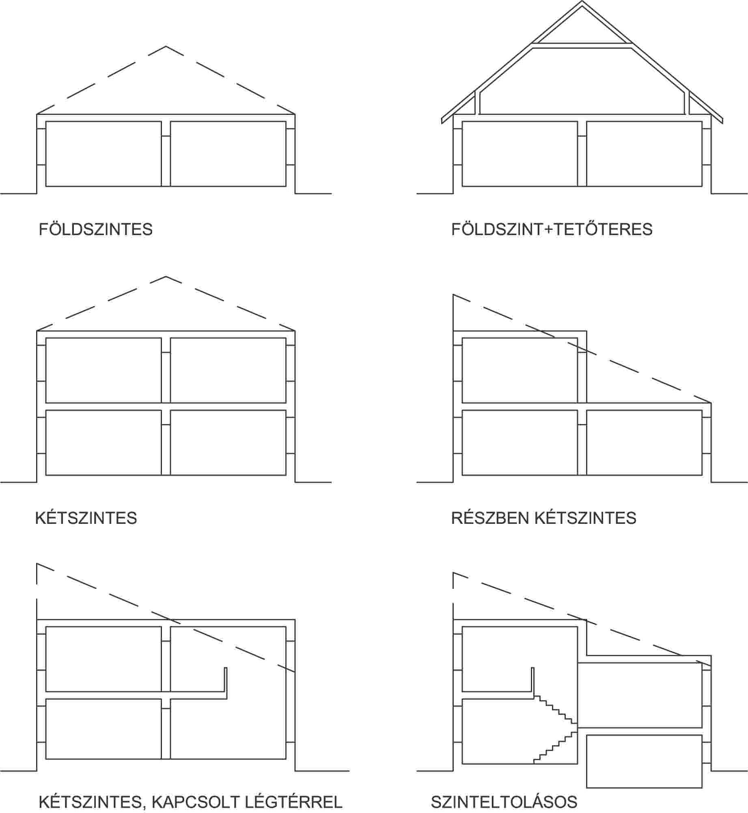

*3.47. ábra – Családi házak szintjeinek gyakoribb térbeli elrendezése*

A térbeli elrendezést befolyásolja a nem szorosan vett lakásfunkciók jelenléte (iroda, műterem, műhely stb.) és a lakással való kapcsolata. Maga a lakás is elhelyezkedhet egy vagy két, esetleg több szinten. A lakóhelyiségek 3 szintre való tagolása már nem kedvező: ilyen mérvű lépcsőjárás már fárasztó, kényelmetlen. A különböző szinteken elhelyezett tércsoportok funkció szerint is összetartozó helyiségek: általános, hogy a nappali tevékenységek terei a földszinten, a hálószobák (fürdővel) az emeleten kapnak helyet. Emeletes elrendezés esetén is nyomatékosan ajánlott legalább egy hálószoba és fürdő vagy zuhanyozó + WC földszinti elhelyezése, hogy egy időszakosan vagy tartósan mozgáskorlátozott (pl. öreg vagy balesetet szenvedett) családtag életvitelét ne akadályozza, ha a lépcsőt használni nem tudja. Hasonló megfontolásból hátrányos – az egyébként festői térkapcsolatokat adó – szinteltolásos elrendezés akkor, ha az összetartozó tevékenység-sorozatok útvonalát lépcső szakítja meg (pl. konyha – étkező stb.). Természetesen, a szokásostól eltérő térszervezés is lehetséges, ha azt bizonyos adottságok úgy kívánják (pl. a nappali szoba a felső szintre is kerülhet, ha onnan szép kilátás adódik, vagy – lejtős terep esetén – a felső szint a bejárati szint stb.).

*Alagsor vagy pince* kialakítása gyakori építtetői igény.

> **Megjegyzés**
>
> A hivatalos fogalom-meghatározás szerint *alagsor* az a helyiség vagy helyiségcsoport, amelynek padlóvonala legfeljebb 70 cm-rel, *pince* az, amely ennél nagyobb mértékben kerül a terepszint alá.

A terepfelszín alá kerülő terek vagy tércsoportok ne legyenek lakóhelyiségek. Itt lehet elhelyezni a nem lakás célú funkciókat, vagy a lakást kiegészítő funkciókat: pl. műhelyt, tárolókat stb. Igényesebb, nagy költségű családi házaknál ide kerülhet a kondicionáló terem, szauna, sőt a házi úszómedence, játékszoba stb.

Az épület teljes földszintje alatt lévő *alagsort* sík terepen ne tervezzünk: ilyenkor a legalsó lakószint 1,80 – 2 m magasságba kerül és elszakad a kerttől. *Pince* létesítésénél feltétlenül meg kell vizsgálni a talajvíz magasságát. Ha a mértékadó talajvízszint a pince padlósíkja fölé esik, akkor *talajvíznyomás* ellen kell védekezni. Magas talajvízszint esetében ez nemcsak a szigetelés a kialakításánál jelent többletköltséget, de különleges szerkezeti megoldásokkal kell védekezni az ellen, hogy az épület a talajvízben „felússzon”, mivel az 1-2 szint magas épület súlya a talajvíz nyomásával nem tud egyensúlyt tartani. Ilyen esetben pincét létesíteni rendkívül gazdaságtalan és nem ajánlatos (pl. egyes alföldi térségekben, vízparton stb.).

A terepszint alá kerülő helyiségeket szigetelni kell talajnedvesség ellen, legfeljebb akkor nem, ha a pincét kifejezetten gyümölcs és/vagy hordós bor tárolására akarja az építtető használni (a „porszáraz” légállapot ennek nem kedvez).

Lehetséges az épület csak egy részének alápincézése, ha nagyobbra nincs igény, de ez némi többletköltséget okoz a többi fal alapozásánál is: a sávalapokat lépcsőzetesen kell a pincefal alapsíkjához csatlakoztatni. Ügyelni kell arra, hogy a pince határfalai a földszinti tartófalakkal összhangban legyenek ([3.48. ábra](#abra_3_48)).

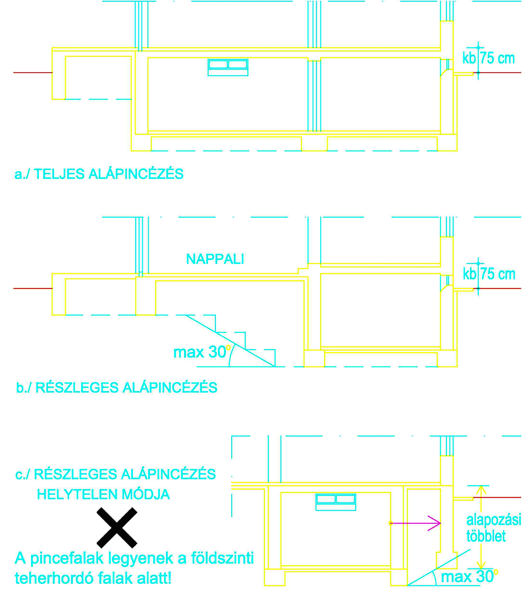

*3.48. ábra – A pinceszint kialakítása*

A pincében lévő tereknek természetes szellőzést kell biztosítani. A hagyományos pinceablakok elhelyezéséhez a földszinti padlóvonalat 70-80 cm magasra kell emelni: ez a lakás szép kertkapcsolatát korlátozza. Ilyenkor lehetséges az épület részbeni alápincézése úgy, hogy a nappali szoba néhány lépcsőfokkal lejjebb kerüljön, vagy egyéb megoldást kell választani az ablakok elhelyezésére ([3.49. ábra](#abra_3_49)).

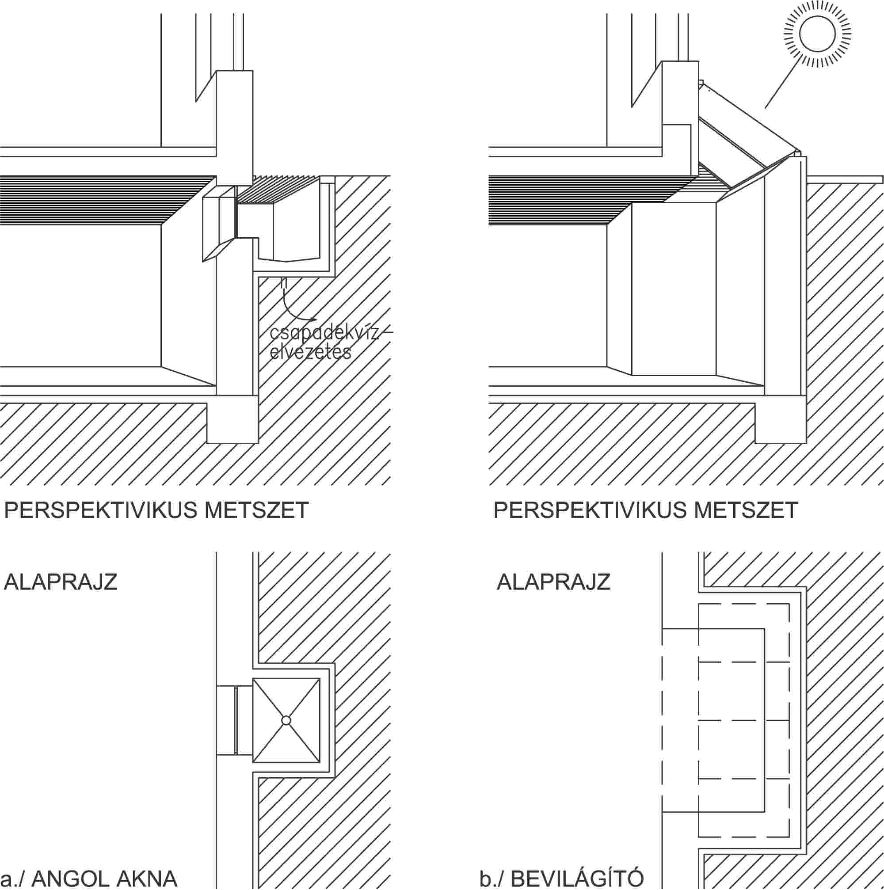

*3.49. ábra – A pinceablak elhelyezése alacsony földszinti padlóvonal esetén*

### 3.7.2. Családi házak főbb szerkezetei

A családi házak szerkezetei közül itt csak azokat tárgyaljuk, amelyek az épület elrendezését, térszervezését és tömegformáját alapvetően befolyásolják, vagyis amelyeknek szerkesztési szabályait már a tervezés kezdő stádiumában is figyelembe kell venni.

A családi házaknál is lehetséges előregyártott, komplex építési rendszerek alkalmazása: manapság főképpen a könnyű, fa alapanyagú rendszerek a legelterjedtebbek, és hazánkban is egyre jobban terjednek. Ezeknek azonban saját szerkesztési szabályaik vannak, és legtöbbször sorozattervek (katalógus-tervek) alapján épülő házakhoz alkalmazzák őket. Egyedi tervek megvalósításához is alkalmazhatók, azonban az építési rendszer szabályainak teljes körű ismerete szükséges a tervezéshez, ezért általában a „rendszergazda” saját tervező csoportot alkalmaz. A továbbiakban az un. „hagyományos” építésmód főbb tervezési vonatkozásait ismertetjük.

*A függőleges teherhordó szerkezetek* családi házaknál legtöbbször *teherhordó falak,* mivel az 1-2 szint magas épületek térelhatároló külső falainak teherbíró képessége általában elegendő ahhoz, hogy a födémek terhelését hordja. Különleges építészeti szándék vagy nagy épületvolumen esetén lehetséges pillérváz alkalmazása is. (A XX. századi építészettörténetben ennek számos példájával találkozunk: vasbetonváz Corbusier villáinál, acélváz Mies van der Rohe családi házainál stb.)

A teherhordó falazatok általában téglából vagy egyéb, legtöbbször szilikát anyagú falazóblokkból készülnek. Manapság az un. „ökologikus építészet” térnyerésével újra létjogosultságot nyertek a földfalak korszerű változatai.

> **Megjegyzés**
>
> Homlokzati falak esetén a megfelelő hőszigetelés elérése érdekében egyre gyakrabban kell réteges falszerkezetet alkalmazni. A téglaszerkezeten a külső oldalon jellemzően 10-15 cm vastag hőszigetelés és a további külső réteg – vakolat vagy egyéb burkolat – kerül a falakra. Ezért a korábban általános 38 cm falvastagság egyre kevésbé jellemző. Ökölszabályként minimum 48 cm vastag külső fallal kell számolnunk téglafalaknál a szerkesztések során, és könnyűszerkezetes épület esetében sem csökken a falvastagság 30 cm alá. Ezeket a méreteket a beépítettség számításánál is figyelembe kell venni. (N.Á.)

A homlokzati térelhatároló falak lehetnek teherhordók és nem teherhordók. A teherhordó falak nyílászárók elhelyezésére szolgáló áttörésénél figyelmet kell fordítani arra, hogy a kialakuló falpillérek keresztmetszete elegendő legyen a rájuk háruló terhelés viselésére, ezért azok zártabb, kevéssé felnyitott homlokzatot eredményeznek (főként a hőtechnikailag nagy teljesítményű, porózusabb anyagú falazatok teherbírása korlátozott). A nem teherhordó külső fal nagy felületen megnyitható. Általában nem elegendő, hogy csak a homlokzati falak legyenek teherhordóak (egytraktusos épületek), a ház alaprajzát *belső teherhordó falakkal* kell tagolni.

Akkor, ha a teherhordó falak az épület hossztengelyével párhuzamosak, hosszfalas rendszerről, ha arra merőlegesek, harántfalas rendszerről beszélünk.

A belső függőleges teherhordó szerkezetek helyenként lehetnek kisebb keresztmetszetű, vasbeton esetleg acél pillérek is. Ez intenzívebb térkapcsolatokra ad lehetőséget, azonban a pillérekre felfekvő kiváltó gerendák alsó síkjai legtöbbször a mennyezetsíknál lejjebb vannak, a helyiség belső terében megjelennek (rossz esetben kellemetlenül metszenek át egy helyiséget) így a belső téralakítás lehetőségét befolyásolják ([3.50.f. ábra](#abra_3_50)).

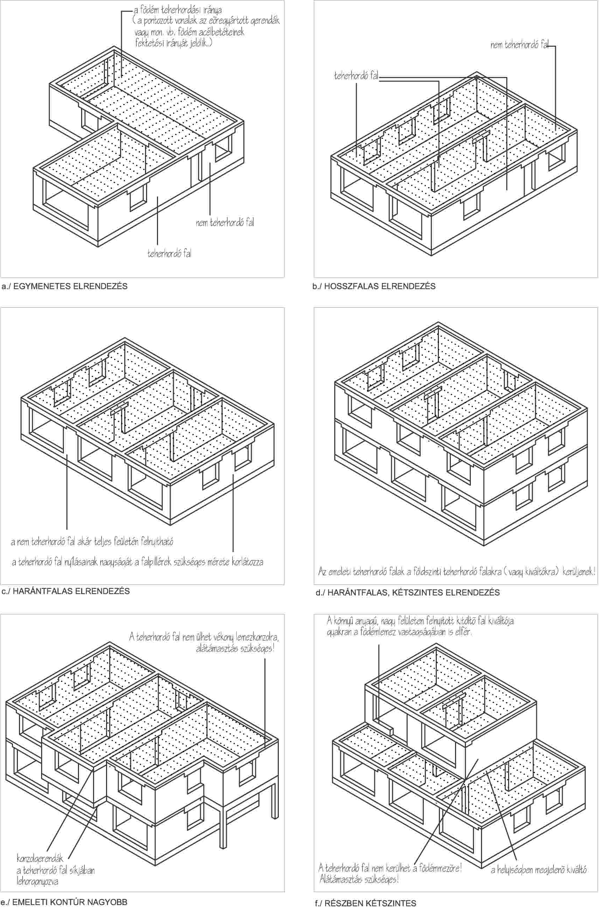

*3.50. ábra – Családi házak teherhordó falszerkezeteinek elrendezése*

*A vízszintes teherhordó szerkezetek* (födémek, kiváltók) leggyakoribb anyaga a vasbeton, helyszínen öntött monolitikus vagy előre gyártott elemekből kialakított formában. Újra terjedőben vannak a fafödémek.

Az előre gyártott gerendák hossza kötött, ezért a teherhordó falazatok közötti *fesztáv* meghatározásánál ezek gyártási méreteit figyelembe kell venni. A 60 cm-es modulban kialakított fesztávok legtöbb előre gyártott födémrendszerhez alkalmasak.

A monolit lemezfödémeknek is általában meghatározott teherhordási iránya van, tehát kétoldali alátámasztást igényelnek, bár fesztávuk kötetlen. Abban az esetben, ha az épület alaprajza a szabályos, derékszögű szerkesztéstől eltér (szögben összehajló falközök, íves falak stb.) akkor előre gyártott födémrendszer nagyon nehezen vagy semmiképp nem alkalmazható: ilyenkor csak monolit födém jöhet szóba.

A födémszerkezet megválasztásánál fontos szempont az építés helyszínének és a kivitelező technikai lehetőségeinek ismerete. A monolit födém akkor előnyös, ha a helyszínre készbeton szállítható, vagy a kivitelező felkészült nagyobb mennyiségű és jó minőségű szerkezeti beton helyszíni előállítására, nagy felületek zsaluzására és a betonvasalás szakszerű elkészítésére. Az előre gyártott elemekből készült födémeket – egyszerűbb kontúrú épületek esetén – a kevésbé felszerelt, kisebb építési vállalkozás is jól el tudja készíteni, akár az építtetők munkaerejének bevonásával.

Az alkalmazott *fesztávok* megválasztása a gazdaságosság és a kivitelezés lehetőségeinek figyelembe vételével történjen. (A födémek igénybevétele a fesztáv *négyzetével* arányos!)

Lakóházaknál alkalmazható előre gyártott födémek fesztávjainak felső határa általában 6,60 (esetleg 7,20) méter, ez körülbelül megegyezik az egyszerűen készíthető, monolitikus síklemez födémek fesztávjainak felső határértékével. (Ennél nagyobb fesztávú födémek már különleges kiképzést és nagy szerkezeti vastagságot igényelnek, létesítésük igen nagy költségtöbblettel jár).

A függőleges és vízszintes teherhordó szerkezetek az épület térbeli rendszerét tércsoportokra tagolják, és ezeket a kötöttségeket már az első vázlatok készítésénél figyelembe kell venni. A [3.50. ábra](#abra_3_50) felhívja a figyelmet a kezdő tervezők által gyakran elkövetett hibák elkerülésére is.

*A tetőszerkezetek és fedések* megválasztása a ház építészeti megjelenését, formálását döntően befolyásolja ([3.51. ábrasor](#abra_3_51)).

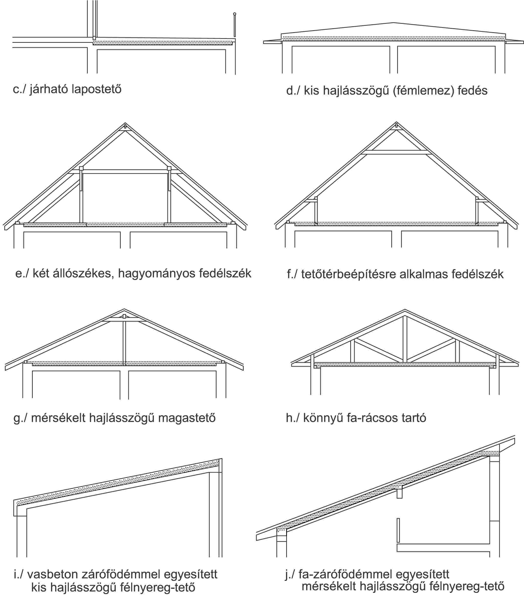

*3.51. ábra – Családi házaknál gyakran alkalmazott tetőfajták*

Általában lapostetőkről és magastetőkről beszélünk. A lapostetők 1-3 % lejtésűek, nem járható és járható formában (tetőteraszként) alakíthatók ki, újabban terjednek a környezetbarát, növényekkel beültetetett zöldtetők. A magastetők hajlásszöge az alkalmazható fedésmóddal függ össze: igen alacsony tetőhajlásszögnél fémlemezfedést lehet alkalmazni, pikkelyfedések hajlásszögének alsó határa 20 fok körüli. (A különféle fedőanyagok gyártmánykatalógusai az alkalmazható hajlásszöget megadják.) Hazánk éghajlati adottságai miatt elterjedt a közepes, 35-45 fok közötti tetőlejtés. Nagy hajlásszögű tetők (> 45 fok) csapadékosabb vidékeken alakultak ki, ezek hazai hagyományainktól elütnek.

A lapos tető szabdaltabb kontúrú, oldottabb alaprajzok fedéséhez is jól megfelel, de a magastetők geometriai formája fegyelmezettebb tömegképzést igényel. A [3.52. ábra](#abra_3_51) a lakóházaknál gyakrabban alkalmazott tető alapformákat mutatja be. A bonyolult alaprajzi kontúr miatt a magastető sokszor apró síkokra esik szét, csúnya és költséges ([3.52.i. ábra](#abra_3_52)). A tetőforma megjelenését tervezni, ellenőrizni kell már az első alaprajzi vázlatok készítésénél.

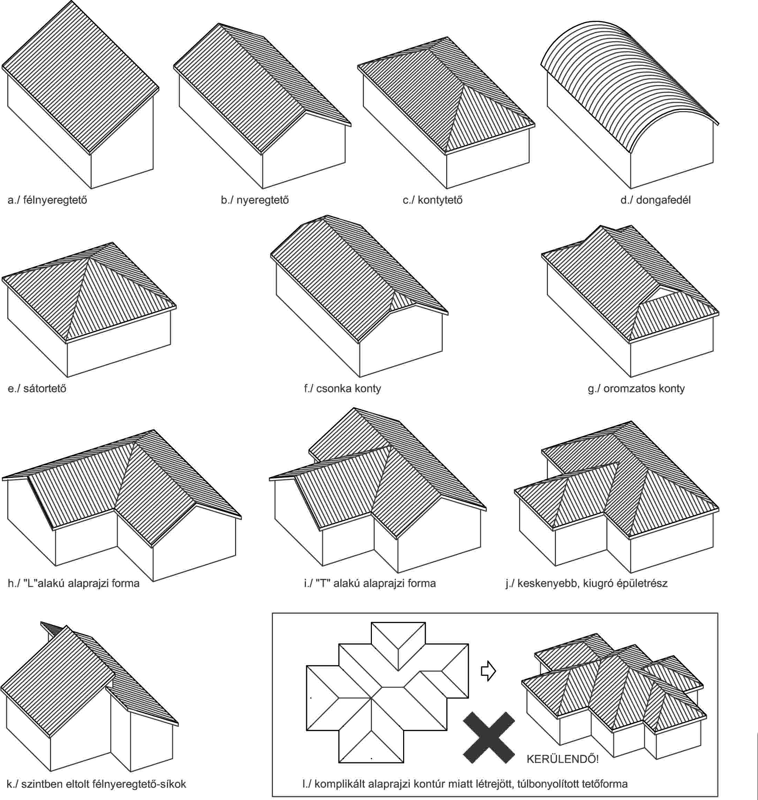

*3.52. ábra – Lakóházaknál gyakran alkalmazott magastető-formák*

A magastetők alatt kialakuló padlástér előnyösen befolyásolja az épület hőháztartását, mivel un. „puffer térként” funkcionál: télen a hőszigetelő réteg felett lévő zárt tér a lakás hőveszteségeit csökkenti, nyáron a kiszellőztetett padlástér véd a lakóterek túlzott felmelegedése ellen. Főleg félnyereg tetőknél fordul elő, hogy a héjazat nem fedélszékre, hanem a ferde kiképzésű zárófödémre kerül ([3.51.i](#abra_3_51) és [3.51.j ábra](#abra_3_51)).

Magastetők esetén igen gyakori a tetőtér hasznosítása, a *tetőtér beépítése*. Ez történhet későbbi építési ütemben is, ha a fedélszéket úgy alakítják ki, hogy a tetőtér *utólag* beépíthető legyen ([3.51.f](#abra_3_51) és [3.53. ábra](#abra_3_53)). A tetőtér térelhatároló szerkezetei általában könnyű szerkezetek, ezért hőtehetetlenségük kicsi: nyáron a tetőtéri helyiségek felmelegedése gondot okozhat, a könnyűszerkezet hangszigetelő teljesítménye is gyengébb. Ezért sokszor fordul elő, hogy a tetőteret vasbeton lemezzel határolják körül („koporsófödém”) kedvezőbb épületfizikai jellemzők érdekében ([3.54.c. ábra](#abra_3_53)). Az ilyen tetőtér építési költsége azonban csaknem annyi, mint amennyibe egy sík mennyezetű új szint kerülne, ezért azt többnyire inkább az építménymagasság hatósági korlátozásai miatt készítik, semmint gazdasági megfontolásból.

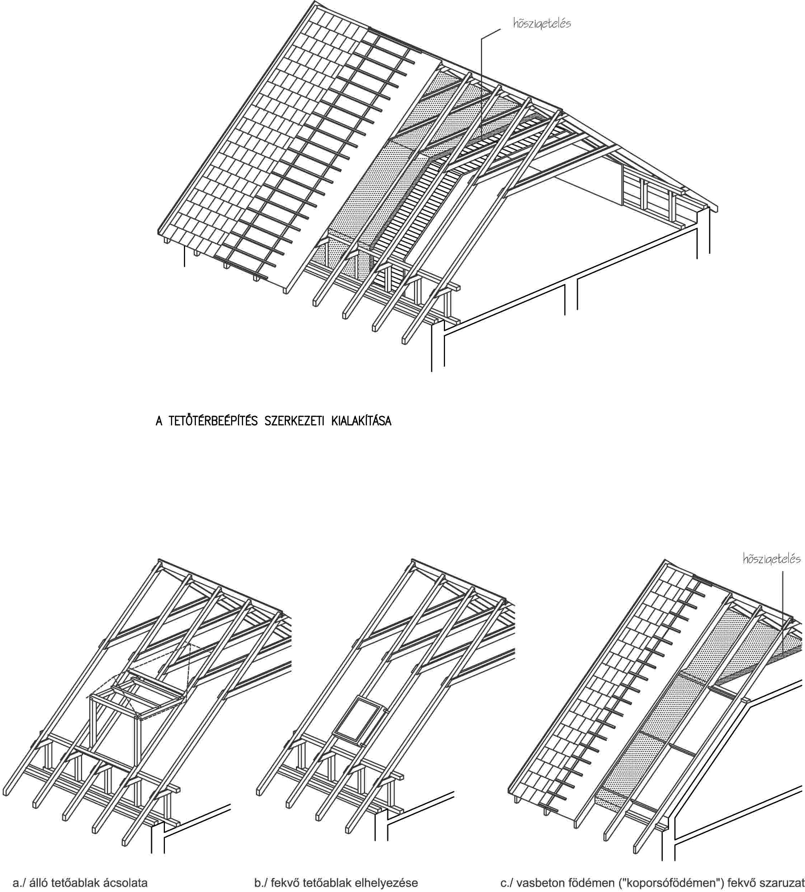

*3.53. ábra – A tetőtérbeépítés szerkezeti kialakítása*

Tetőtérbeépítésre a kb. 35 fok feletti hajlásszögű tető alkalmas, mert ennél alacsonyabb hajlásszög esetén a járható (1,90 m-nél nagyobb belmagasságú) hasznos terek aránya kevés lesz. A tetőszéket úgy kell kialakítani, hogy abban lakóhelyiségek számára elegendő „űrszelvény” alakuljon ki, amelyeket nem zavarnak térbe beálló vízszintes vagy függőleges szerkezetek.

A tetőtérben lévő terek *ablakai* lehetnek az oromzaton, vagy a tetősíkon. Az oromzaton lévő ablakok kialakítása egyszerűbb, különleges kiképzést nem igényelnek. A tetősíkon elhelyezkedhetnek álló tetőablakok, vagy a tetősíkba helyezett ablakok ([3.54. a. és b. ábra](#abra_3_53)). Az álló tetőablakok fogadó szerkezetét az ácsmunkák során kell kialakítani. Maguk a tetősíkba helyezhető ablakok drágábbak ugyan, de külön fogadószerkezetet nem igényelnek, beépítésük egyszerűbb, ezért az álló tetőablakoknál nem költségesebbek.

A lakószobák tetősíkablakinak elhelyezésénél fontos tervezési szempont, hogy azokon vízszintes irányban ki lehessen látni ülő helyzetben is (a túl magas parapetű, vagy felülvilágító-szerű ablakok a bezártság érzetét keltik). A tetőtér beépítésekor térnyerés céljából kialakított magas térdfalak – amelyek a ház arányait is sokszor rontják – a tetőablakokat is a kívánatos mértéknél magasabbra kényszerítik.

Lapostetőknél gyakoriak a lakószobák előtt kialakított tetőteraszok. Ha a felső szint kontúrja nem azonos az alatta lévővel, gondosan kell ügyelni arra, hogy a felső szinti teherhordó falak alá teherhordó szerkezet (fal, pillér) kerüljön. A nem teherhordó falak a födémre is helyezhetők, ha nem túl nehezek (könnyű falszerkezetek, üvegfelületek). Mindenképpen gondot okoz azonban, hogy a tetőterasz födémének vastagsága nem azonos a belső tér alatti födémvastagsággal: a tetőterasz födémének rétegrendjébe ugyanis víz- és hőszigetelő valamint lejtésképző rétegek tartoznak ([3.51.c. ábra](#abra_3_51)).

*A belső lépcsők* kialakítása, helyzete a lakáskompozíció kulcskérdése két- vagy többszintes lakásoknál. A lakás belső lépcsője helytakarékosabb lehet a többlakásos épületek közös lépcsőjénél. A lépcső méretezéséhez a 2 x M + SZ = 60 – 64 cm képletet kell alkalmazni. (M – fellépés magassága; SZ – belépés szélessége). A lépcsőfokok kiosztását íves vagy húzottfokú lépcsők esetén mindig a *járóvonalon* kell elvégezni. A szabályzat megengedi a 20 cm-es fellépési magasságot is egy lakáson belül, de az már kissé kényelmetlen, ezért lehetőleg csak alárendeltebb tércsoportok – pl. pince, üres padlástér – megközelítéséhez lehet ilyen meredek lépcsőt alkalmazni. A beépítetlen padlástér létrával is megközelíthető. A padláslépcső vagy létra belső térből induljon, és legyen fixen beépítve. Padlásfelbúvó ajtó is alkalmazható egy közlekedő helyiség mennyezetén, amelyen át egy harmonika-szerűen lehúzható lépcsővel közelíthető meg a padlás karbantartási céllal. Ha a padlást tárolásra vagy teregetésre is használják, akkor vezessen lépcső oda.

Lakószintek között a 18 cm körüli fellépés még elég kényelmes és gazdaságos alaprajzi méretet ad ([3.55. ábra](#abra_3_55)). A [3.57. ábrán](#abra_3_57) közölt példák egy gazdaságos, de még kényelmes használatot biztosító méretezéssel készültek. (Azoknál *kényelmesebb* mindig tervezhető különösen az igényes, tágasan méretezett lakásoknál.) A húzott fokú lépcső szabályos szerkesztése biztosítja, hogy a fokok orsótér felöli éle egyenletesen és fokozatosan keskenyedjen, így a haladás során nem adódik kényelmetlen lépésritmus-váltás és a korlát fogódzója is szép, egyenletesen emelkedő ívű lesz ([3.56. ábra](#abra_3_56)). A körlépcsők fokainak élei a tágas, kör alakú orsótér középpontjába futnak be. Orsótér nélküli, keskeny csigalépcsőt csak második lépcsőként alkalmazzunk – pl. galériához – mert nagyobb bútordarab vagy *hordágy* szállítása azon nem lehetséges.

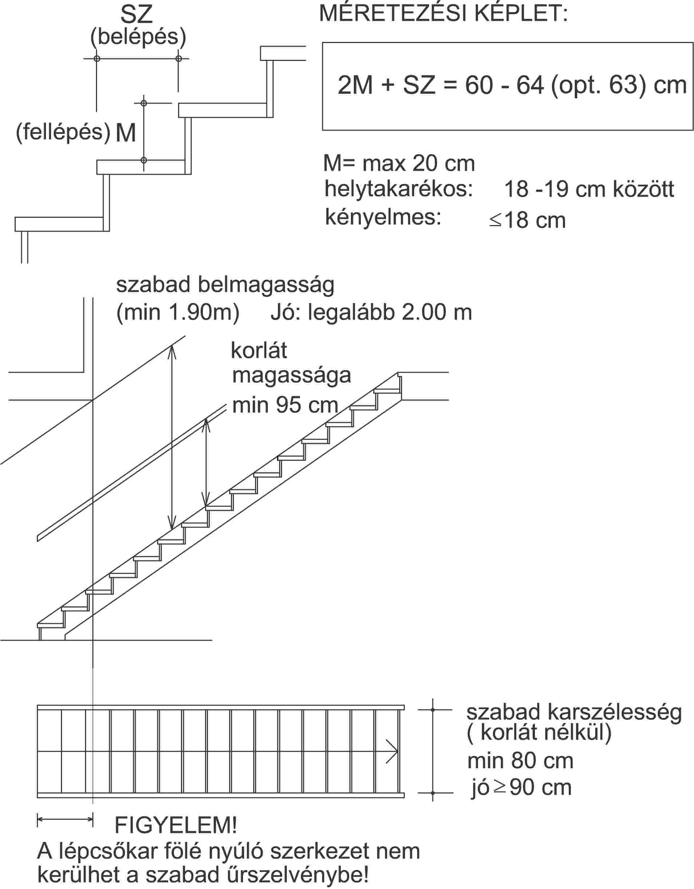

*3.55. ábra – Lakás-belsőlépcső méretezése, szerkesztése*

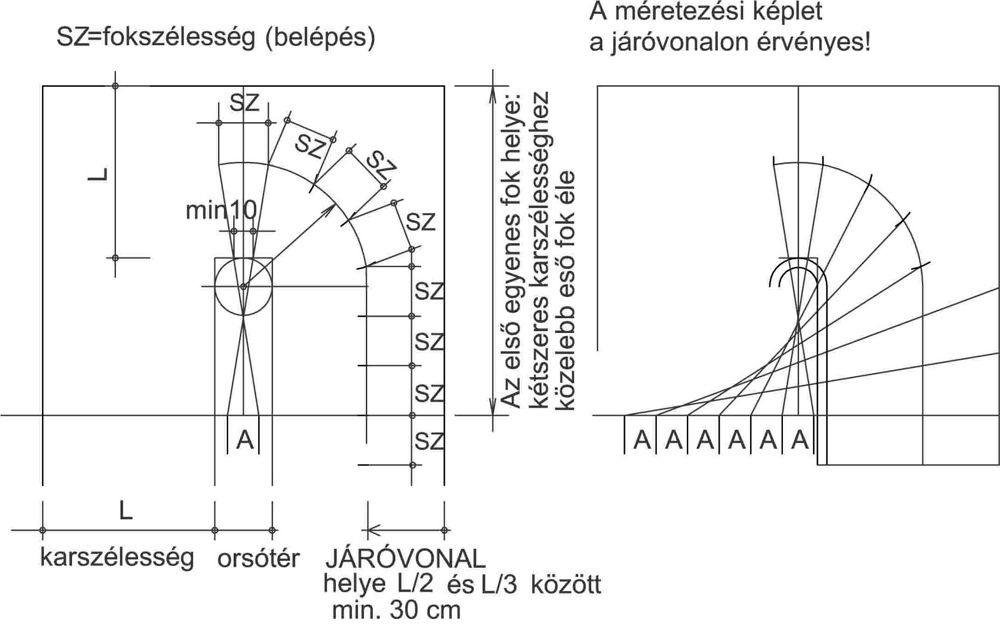

*3.56. ábra – Húzott fokú lépcső szerkesztése*

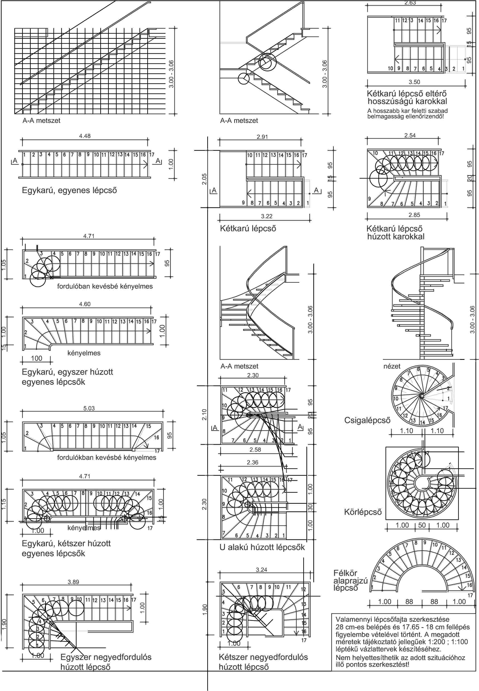

*3.57. ábra – Különböző lakás-belsőlépcsők*

A két lakószintet elválasztó födém – legyen az akár előregyártott, akár monolit vasbetonból – teherhordási iránya és a lépcső geometriai formája összefügg, ugyanis a lépcső miatt nagyobb födémáttörést kell létesíteni. Ilyen szempontból jó, ha az egykarú lépcső a teherhordó falra merőleges. Kétkarú lépcső - közel négyzetes formája miatt - minden állásban alkalmazható, a födémáttöréshez szükséges kiváltások általában elférnek a födémvastagságban, nem szükségszerű a helyiségekbe belógó kiváltók megjelenése. A lépcsőkiváltás egyszerűbb, ha a lépcső mellett teherhordó falak vannak ([3.58. ábra](#abra_3_58)).

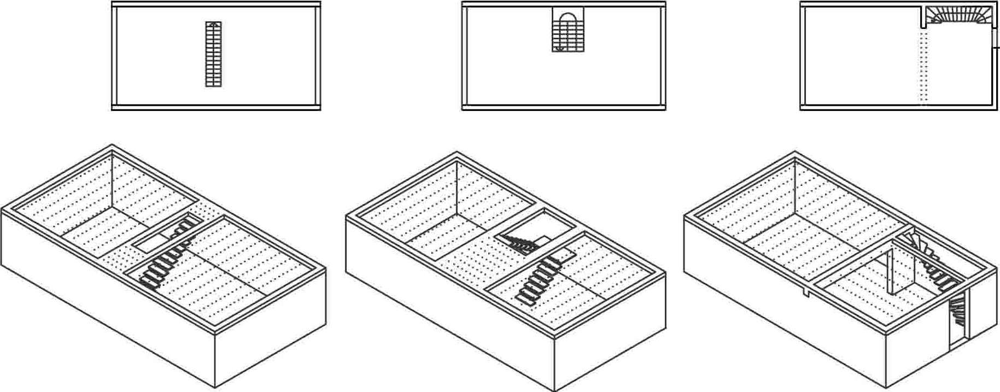

*3.58. ábra – A lakás-belsőlépcső és a födémszerkezet összefüggése*

A pincébe és az emeletre vivő lépcsők lehetőleg egymás fölött legyenek a helytakarékosság érdekében ([3.59.a. ábra](#abra_3_59)). Gondolni kell a lépcső alatti terekre is, nehogy ott megközelíthetetlen és takaríthatatlan zugok alakuljanak ki. (A lépcső alatti tér jól hasznosítható, pl. tárolónak.)

A lépcső fontos belsőépítészeti elem: legyen szép, és kapjon megfelelő építészeti hangsúlyt. Térbe állított áttört lépcső lakóterek közötti térelválasztónak is jó ([3.59.b. ábra](#abra_3_59)). Nem szépek a szűkös közlekedőkből indított lépcsők vagy a folyosószerűen elfalazott egykarú lépcsők.

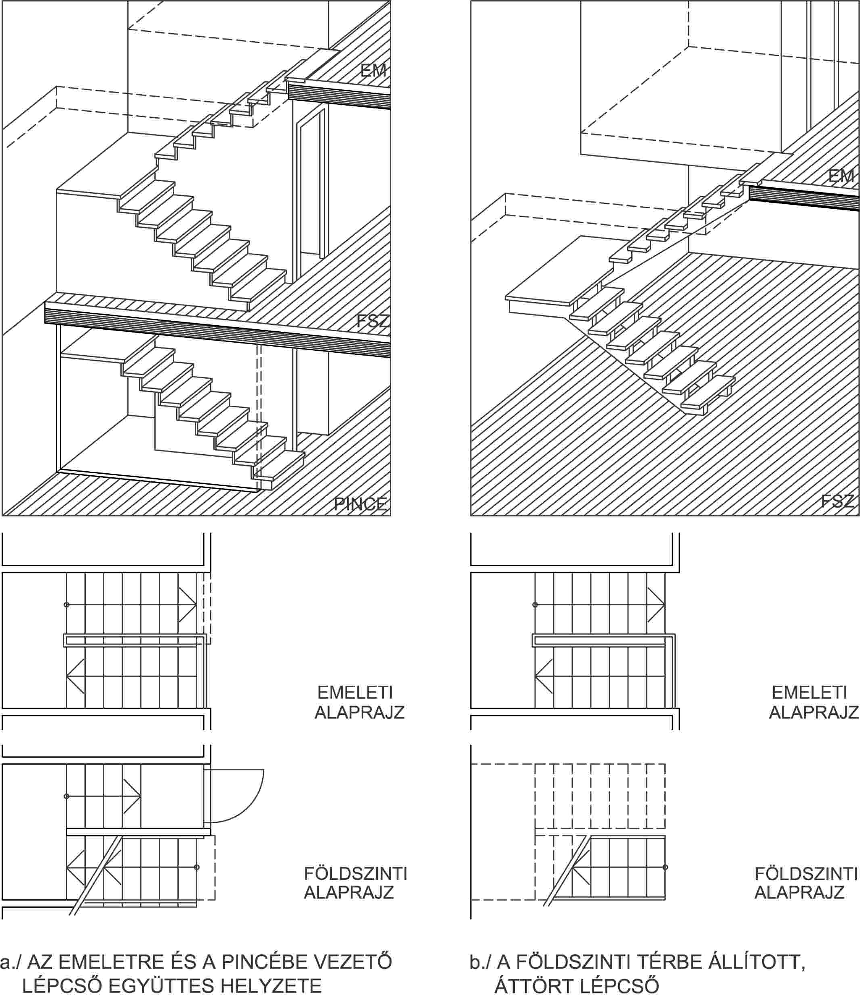

*3.59. ábra – Lakás-belsőlépcsők térbeli helyzete*

### 3.7.3. Családi házak energiatudatos és fenntartható kialakítása (N.Á.)

A fenntartható építés egyik kulcskérdése a mi éghajlati viszonyaink között a fűtési és hűtési energia csökkentése, a nap és szél energiájának jó felhasználása, egyéb megújuló források újszerű használata, a környezetbarát és egészséges belső klímát eredményező anyaghasználat, valamint az épület hosszú élettartamának és használatának biztosítása a megfelelő tervezéssel.

Az épületek a fűtési időszakban a külső határoló felületeken energiát veszítenek, a hőenergia a melegebb térből a hidegebb felé áramlik. Mivel a fűtési időszakban a belső tér hőmérséklete optimális esetben lakótérben körülbelül 20 ºC, a külső tér hőmérsékletnek napi átlaga pedig a januári időszakban - 4 ºC körül alakul, így a külső tér felé történő hőveszteség kiegyenlítésére, a belső hőegyensúly kialakulásához energiát kell az épületbe juttatni. A külső határoló szerkezeteken (falak, nyílászárók, födémek stb.) kijutó hőenergia a hőveszteség, amit pótolni szükséges. A külső határoló szerkezeteket tehát úgy kell kialakítani, hogy jó hőszigetelő képességük legyen, vagyis kevéssé vezessék a hőt. Jő hőszigetelő anyagok azok, amelyek jelentős mértékben tartalmaznak bezárt levegőt. Ilyen anyagok a habosított termékek, műanyaghab, üveghab stb. a szálasított termékek (ásványgyapot, üveggyapot, cellulóz). Ezek általában kis térfogatsúlyú anyagok. (A különböző határoló szerkezeteken különböző mértékű veszteségek jönnek létre. A jól hőszigetelt, szélvédett szerkezeteken fajlagosan kevesebb, míg a kevésbé hőszigetelt, szélnek és hidegsugárzásnak kitett felületeken fajlagosan több veszteség keletkezik. Előnyös arra törekedni, hogy ne legyen túl nagy különbség az egyes szerkezetek hővesztesége között, ezt a hőhidak elkerülésével is elősegíthetjük. A homlokzati nyílászárók hőveszteségének csökkentése azonban nehezen oldható meg költséghatékonyan, így azokat kiegészítő szerkezettel lehet fokozottabb hőszigetelésre alkalmassá tenni.)

Mivel a hőveszteség az épületszerkezeteken keresztül történik, nagy tömegű szerkezetek esetében – a hőtehetetlenség jelensége miatt – a hőenergia késleltetve jut el a hidegebb oldal felé. Nyári időszakban a jelenség fordítva játszódik le, a külső felületeken a meleg a belső tér felé áramlik, és a nehéz szerkezeteken időben késleltetve jut át. A nyári hővédelem szempontjából a nehéz, nagy hőtehetetlenségű falak kedvezőbb belső klímát eredményeznek, hiszen pl. a 42-54 cm vastag tömör tégla vagy vályogfal késleltetése eléri a 18 órát is. Így a napsütéstől felmelegedett fal belső felületi hőmérséklete napközben jelentősen alacsonyabb lehet, mint a külső felületen. A fal a belső tér, a szoba felé napközben még hűvöset sugároz, a komfortérzet a belső térben jó. Éjszaka pedig az éjszakai hűvös levegő beengedésével, erőteljes szellőztetéssel az éjszakai belső hőállapot is megfelelő lehet. Annak érdekében, hogy a forró nyári időszakban ne kelljen energiafaló mesterséges hűtést alkalmazni, a nehéz szerkezetek (fal és padló) és ezzel egyidejűleg az éjszakai szellőztetés fontos eszközök.

A fentiek alapján a külső határoló szerkezetnek egyrészt nehéznek kell lennie a nyári hővédelem miatt, másrészt jő hőszigetelőnek kell lennie a hőveszteségek csökkentése érdekében. Nem sok lehetőség van arra, hogy egyrétegű külső szerkezet megfeleljen mind a két követelménynek. Ezért ma már általános a réteges szerkezetek alkalmazása az energetikai követelmények és a megfelelő komfortérzet érdekében.

Egy könnyűszerkezetes épület esetében az átmelegedés igen gyorsan végbemegy, és a belső térben megfelelő átszellőztetés nélkül nagyon kellemetlen meleg alakul ki nappal és éjszaka is. Ezért könnyűszerkezetes épületeket is érdemes nehéz szerkezetekkel együtt építeni. A könnyűszerkezetes épület esetében a nehéz vasbeton lemezalap vagy pince a nyári nappali túlmelegedést csökkentheti.

A passzív napenergia-hasznosítás alapvetően az „üvegházhatás” jelenségén alapszik. A normál üveg a fény egy részét visszaveri, egy kisebb részét elnyeli, míg egy nagyobb részét átengedi. Az épületbe így bejutott rövid hullámhosszú fény a tárgyakról, szerkezetekről visszaverődve átalakul hőenergiává. A falról, padlóról visszatérő hosszú hullámokat azonban az üveg már nem engedi át, így a meleg bent reked. Ilyen módon a belső, zárt tereket határoló minden napsütötte üvegfelület „napcsapdának” tekinthető, és építészeti megoldásokkal ezt kifejezetten erősíteni is lehet. A délre tájolt nagy üvegfelületek, a belső tér napsütötte részein sötét, a hőt még jobban akkumuláló padlók kialakítása, a puffertérként működő üvegezett télikertek, mind a passzív napenergia-hasznosítás példái. Ilyen rendszereknél nyáron természetesen intenzív árnyékolásról és szellőztetésről kell gondoskodni.

A transzparens szerkezetek általában nehezebben és költségesebben hőszigetelhetők, mint a tömör falak, ezért a hőnyereség mellett napsütésmentes időszakban növelik a hőveszteséget. Több északi országban is elkezdték például a négyszeres üvegezésű ablakokat alkalmazni a hőveszteségek csökkentése érdekében, ezek azonban olyan kellemetlen kilátási viszonyokat eredményeztek, hogy lakásoknál már nem javasolják.

Ökölszabály: északnyugati-, északi-, északkeleti irányban lehetséges hármas üvegezésű ablakokat elhelyezni, azonban költséghatékonyabb, ha ezeken a homlokzatokon csak a bevilágításhoz és funkcióhoz szükséges méretű üvegezett szerkezeteket tervezünk. Délkeleti- déli-, délnyugati irányban a kétrétegű üvegezett szerkezetek adnak jó megoldást, mert a tavaszi és őszi időszakban szoláris nyereséget jelentenek (3 rétegű üveggel a szoláris nyereség jóval alacsonyabb), és a téli éjszakai időszakban kiegészítő szerkezettel – redőnnyel, spalettával, függönnyel – lehet javítani az ablakok hőszigetelését.

A napsugárzás hasznosítását és a hőveszteségek csökkentését eredményező tervezés eszközei a mi éghajlati viszonyaink között:

*Energiaveszteségek minimalizálását segítő tervezés*

Az épület felület-térfogat arányának kedvező megválasztása, a fűtött térfogathoz lehetőleg kevés lehűlő felület tartozzon, az épület különösen az észak felé néző homlokzatainál kevéssé legyen tagozott.

Kiváló hőszigetelés szükséges a külső határoló szerkezeteken (ökölszabályként fogadjuk el a külső falon és lábazaton a 15 cm vastagságú hőszigetelést, padláson lapostetőn pedig a 30 cm vastagságot).

Hőhidak elkerülése jó lábazati falszigeteléssel, pozitív sarkok és födémtalálkozások magasabb szintű hőszigetelésével.

Északnyugati, északi, északkeleti homlokzaton minimális ablakfelületek a hőveszteségek csökkentésére, ugyanakkor az ablakok legyenek nyithatóak és magasan elhelyezettek a nyári természetes szellőztetés érdekében.

Zónás tervezés alkalmazása, a fűtött belső tér és a külső tér között fűtetlen pufferzónák kialakítása (szélfogó a bejárat előtt, garázs, tárolók az északi nyílás nélküli felületeknél stb.).

A szél hűtő hatásának csökkentése téli időszakban (pl. örökzöld növényzet az északnyugati, északi homlokzat közelében).

Nagy üvegfelületek téli (esti) hővédelmének biztosítása (redőnyök, zsaluk, spaletták).

*Napenergia befogadását, tárolását, megosztását segítő tervezés*

Üvegezett szerkezetek délkeleti- déli- délnyugati tájolása, lehetőleg magas szemöldökmagasságú ablakok és ajtók alkalmazásával a tavaszi és őszi sugárzási nyereség maximalizálására.

Amennyiben a funkció lehetővé teszi, a déli homlokzat előtt naptér létesítése javasolt olyan módon, hogy mögötte legyen nagy hőtároló kapacitású fal és padlószerkezet. Legjobb hatásfokkal a kétszintes üvegházak működnek a mi éghajlatunk alatt.

A beérkezett napenergia tárolására készüljön nehéz padlószerkezet alsó oldali hőszigeteléssel, nehéz falszerkezet a sugárzási energia akkumulálására.

A napterek és a fűtött terek között szabályozott légcsere biztosítása szükséges.

A természetes megvilágítás biztosítására, a világítási energiafelhasználás csökkentésére kell törekedni.

Zárt belső terekben függőleges, ferde vagy tetőbevilágító szerkezetek alkalmazása javasolt.

A felsorolt tervezési elveket passzív napenergia-hasznosításnak nevezzük. (Ezek nem állnak messze a magyar hagyománytól sem, a napsütésre tájolt falusi tornác, a polgári lakások verandái, a magas spalettás ablakok, a hűvös kamrák és pincék, a nehéz tégla szerkezetek mind figyelembe vették a fenti lehetőségeket.)

Ökölszabály a napterek kialakításához: a naptér fogalmát gyakran összetévesztik a „télikert” fogalmával, helytelenül, mert ez utóbbi – ha délszaki növényeket tartanak benne – hideg téli éjszakákon fűtést is igényelhet. A naptér energetikai szerepénél fogva *nem lehet fűtött tér*. A naptér nagy előnye, hogy használati térként is igénybe vehető akár a fűtési idényben is, késő ősszel és kora tavasszal, amikor hőmérséklete már megfelelő komfortérzetet biztosít. A naptér rendkívül hangsúlyos építészeti elem mind lakás helyiségeinek elrendezésénél, mind a tömeg- és homlokzatformálásnál. A napterek hőterhelése nyári időszakban igen nagy lehet, és helytelen kialakítás esetén a lakás amúgy is túlzott belső hőmérsékletét az tovább emelheti, ezért a megfelelő árnyékolásról, kiszellőztetésről gondoskodni kell. A „szolár-házak” szakszerű tervezéséhez nagy felkészültség és szakavatott épületgépész bevonása szükséges.

A fent részletezett eszközökkel lecsökkentett fűtési energiaigény, és a napsugárzás energiájának közvetlen hasznosításával a lerövidített fűtési időszak lehetővé teszi, hogy a szükséges további energiát megújuló forrásokból nyerjük.

Amennyiben napenergiát hasznosító gépészeti eszközöket használunk (napenergia a használati melegvíz céljára, elektromos áram termelésére) úgy *aktív* napenergia hasznosító rendszerekről beszélünk. Mindegyik rendszer esetében fontos, hogy az energia begyűjtése mellett a tárolás és a megosztás-felhasználás rendszerét is meg kell tervezni. Mindezeknek az eszközöknek helyigényük is van.

Példa egy 4 személyes háztartás *aktív szoláris* eszközeire:

*Használati melegvízkészítés*

A jól hőszigetelt, megfelelően tájolt és méretezett épület déli tájolású ferde tetőfelületén elhelyezhető sík vagy csöves kollektor. A melegvíz tárolása jellemzőn épületen belül történik több hőszigetelt, egymás mellé sorolt álló tartályban. A rendszerhez tartoznak még érzékelők, szivattyúk, tágulási tartályok, és a napsütésmentes időszakban a kisegítő rendszer, ami általában elektromos fűtőpatron. Jellemzően a nyári időszakban két napi meleg víz fogyasztásra érdemes a rendszert kialakítani.

> **Megjegyzés**
>
> Ökölszabály: személyenként és naponta 40-60 liter átlagos melegvízfogyasztást számolunk, amit növelhet az, ha a rendszerre mosógépet és mosogatógépet is kapcsolunk. A használati melegvíz készítéséhez a következő rendszer tekinthető költséghatékonynak: 4 fős háztartás használati melegvízigényéhez 4-6 m2 déli tájolású, 35-45 fokos dőlésszögű kollektor, és 300 liter puffertároló szükséges.

Kiegészítő fűtésrásegítés

A szoláris rendszer fűtésrásegítésre megfelelő kiépítése is lehetséges, hiszen családi ház esetében legtöbbször a tetőfelület mérete ezt lehetővé teszi, különösen ha kiválóan leszigetelték az épületet, és a passzív napenergia-hasznosítás is megoldott. Ebben az esetben a nagy tetőfelület mellett a hatalmas hőszigetelt tartályok helyigényét, és azok szabályozását kell biztosítani. Nem csupán a rendszer költségesebb, hanem nagyobb teret is kell erre építenünk. A téli időszakban, a mi éghajlatunk alatt, bármilyen nagy rendszer esetében is biztosítani kell kiegészítő fűtést is „hagyományos” energiabevitellel: gáz, elektromos áram, biomassza felhasználás formájában. A nagy rendszerek nyári energiatermelésének felhasználása azonban gondot okozhat, a nyári felesleges hőmennyiséget jellemzően medencefűtésre lehet használni.

> **Megjegyzés**
>
> Ökölszabály: kisegítő napenergiás fűtéshez a következő rendszer tekinthető költséghatékonynak: 5 m2 fűtött padlófelülethez 1 m2 kollektorfelület szükséges (vákuumcsöves kollektor esetében kevesebb). Ennek megfelelően egy körülbelül 150 m2 fűtött alapterületű épület esetében 30 m2 kollektor szükséges, melyhez általában 2 db 1000 literes hőszigetelt puffertároló tartály tartozik. A napsugárzásmentes időszakban a fűtést biomassza kazán (pl. pelletkazán), gázkazán vagy elektromos rásegítés biztosítja. A helyiségekben a fűtést többnyire padló- fal- vagy mennyezetfűtés biztosítja, mert így lehet az alacsonyabb hőmérsékletű fűtőközeget jól felhasználni.

A napenergiát hasznosító fűtési rendszerek egyik, jelenleg még kevésbé kiérlelt, megoldási módja a légkollektorok alkalmazása. Ezt természetéből adódóan légfűtéssel együtt alkalmazva lehet hasznosítani. A rendszer gazdaságos, a levegős fűtésnek azonban jelenleg vannak még gyenge pontjai: a hőtároló közeg biztosítása, illetve az akusztikai problémák csökkentése. Jól használható azonban a légkollektoros fűtés akkor, ha az épületben a szellőztető rendszer is ki van építve, hiszen ekkor egyébként is biztosítani kell a por és pollenszűrést, a jó akusztikai megoldást és a pontos és automatizált vezérlést. Jelenleg leginkább kis középületeknél lehet ezt megfelelően alkalmazni.

> **Megjegyzés**
>
> Ökölszabály: kisegítő légkollektoros napenergiás fűtéshez a következő rendszer tekinthető költséghatékonynak: 10 m2 fűtött padlófelülethez 1 m2 kollektorfelület szükséges, vezérlő rendszerrel, automatikával és légtechnikai berendezésekkel. A napsugárzásmentes időszakban a fűtést biomassza kazán (pl. pelletkazán), gázkazán vagy elektromos rásegítés biztosítja.

Elektromos energia termelése napsugárzásból

A hőenergián kívül elektromos energiatermelés is lehetséges a napsugárzás felhasználásával világítás, konyhai munkák, háztartási és egyéb elektronikai berendezések gazdaságos üzemeltetéséhez. Az elektromos energia helyi előállításához lehetőség van áramtermelő elemek és akkumulátorok elhelyezésére. Amennyiben nem használják fel az áramot a keletkezésének időpontjában, akkor az egyenesen a rendszerbe is visszatölthető. A termelt áram alacsony feszültségű egyenáram, így felhasználása is ilyen formában hatékony. Jelenleg az általános háztartási berendezések közül csupán a világítás, a hűtőszekrény és egyes szórakoztató elektronikai berendezések tudnak ilyen módon működni. A termelt energiát ezért el kell tárolni – akkumulátorokban – és át kell alakítani a gépekhez. Ehhez invertert, vagyis áramátalakítót kell használni. Az áramtermelő elemeket is a megfelelő tájolású tetőre lehet tenni, vagy alkalmazhatók pl. az ablaküvegbe integrált elemek is. (Így pl. egy déli tájolású naptér ferde síkú fedése is készülhet napelemekből.)

> **Megjegyzés**
>
> Ökölszabály: a szoláris áramtermelés „sziget üzemmódban” lakóépületek esetében nem tekinthető költséghatékonynak a szükséges egyéb berendezések és a karbantartás miatt. A nagy elektromos rendszerbe betápláló helyi áramtermelés azonban megoldott. A rendszerek a közeljövőben – 10 éven belül – egészen bizonyosan egyszerűsödni fognak és a hatékonyságuk is egyre jobb lesz.

Az elektromos áram szélenergiával történő termelése is lehetséges, azonban a tárgykörön túlmenő kérdéseket vet fel, így a lakóépületek tervezése során erre most nem térünk ki.

A biomassza felhasználása fűtésre és használati melegvíz készítésére

A biomassza mint megújuló forrás felhasználása egyre inkább előtérbe kerül. Itt is azt kell figyelembe venni, hogy ha kiválóan hőszigetelték az épületet, és a passzív napenergia-hasznosítás is megoldott, akkor a lecsökkentett hőenergia igényt biomasszával is ki lehet elégíteni. Ilyen épület esetében mind a faelgázosító kazán, mind a pellet tüzelés költséghatékony és környezetbarát megoldás.

A rendszer hasonlít a hagyományosnak tekinthető vízteres központi fűtéshez, azzal a különbséggel, hogy működtetése a pontos vezérlés és automatika alkalmazása révén jelentősen hatékonyabb. A kazánhoz jellemzően speciális kémény szükséges, valamint a tüzelőanyag tárolását is biztosítani kell. 1,8 kg pellet vagy 3 kg tűzifa felel meg 1 m3 gáznak központi fűtési felhasználás szempontjából.

Használati melegvízkészítésre a fatüzeléses vízmelegítők és korszerű tégla vagy öntöttvas vízteres tűzhelyek is alkalmasak. Lakóépületnél akkor használhatók, ha a főzés és melegvízigény időben közel esik, és a használóknak módjuk van a kissé időigényesebb megoldást választani. Jelenleg leginkább ott terjedt el, ahol az egyéb lakás körüli gazdasági tevékenység megfelelő mennyiségű éghető hulladékot termel, így annak felhasználása is megoldható.

> **Megjegyzés**
>
> Ökölszabály: az egy fűtési idényre szükséges mennyiség tüzifából a csökkentett energiaigényű épület esetében 150 m2-es fűtött alapterületre vetítve 2000 kg (kb. 2,2 – 2,8 m3) pellet vagy 3000 kg (kb. 3,5 - 4 rakat, egy rakat 1 m x 1 m x 1,7 m) tüzifa szükséges. A korábban épült épületeknél ennek a többszöröse is elfogy egy fűtési idényben.

Tégla kályhák, tömegkályhák építése kisebb alapterületű, 3-4 helyiségből álló épületek esetében jó megoldás.

# 4. Az alacsony, nagy sűrűségű beépítések épülettípusai

## 4.1. A fejezet témaköre

A címben jelzett épületkategóriának nincs összefoglaló elnevezése a magyar hivatalos szóhasználatban (angolul: Low-Rise, High-Density Housing).

A hivatalos építésigazgatási szóhasználat a lehetséges beépítési módok körében „zártsorú és csoportos” beépítést említ. Az OTÉK fogalom-meghatározása a *csoportházat* a sorház, láncház, átriumház gyűjtő meghatározásaként értelmezi. Valójában az itteni épületfajták köre ennél tágabb. (Néhány példát a [4.1. ábra](#abra_4_01) mutat.) Zártsorú és csoportos beépítési módban valamennyi lakásegység és telke önálló, egymástól elhatárolt ingatlan. Mint látni fogjuk, az ilyen beépítés a címben jelzett tartománynak csak egyik része, ugyanis ma már általánosabb az olyan beépítés, ahol a lakásegységek közös telken állnak (lakóegyüttesek, lakóparkok). Ilyenkor – jobb híján – az épületekre vagy házcsoportokra a „szabadon álló” beépítési mód szabályai érvényesek. Ezért szerepel a címben a kissé pongyola „beépítés” elnevezés a beépítési mód helyett, mert a tárgyalt épületkategóriák többféle beépítési módban fordulhatnak elő a most érvényes hazai szabályrendszer keretében.

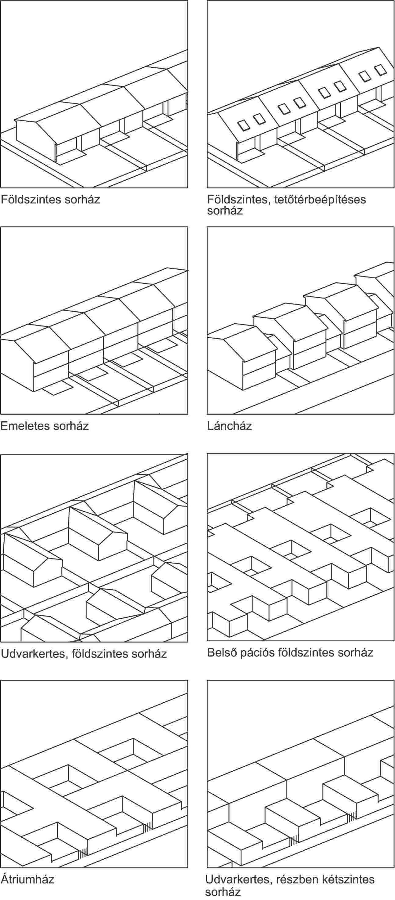

*4.1. ábra – Az alacsony, nagy sűrűségű beépítés néhány épülettípusának sémája*

Az alacsony, nagy sűrűségű beépítés épületfajtáinak spektruma átfed mind a családi házak, mind pedig a többszintes, többlakásos házak tartományával. Az önálló telken álló sorházegység a zártsorú családi házak körébe is sorolható, de a szakirodalomban nagy számban találhatók olyan példák, amelyeknél sorházszerűen kiképzett lakások szerkezetileg összefüggenek egy többszintes, többlakásos épülettel, pl. azzal közös földalatti garázsuk van. Egy olyan ház, amelynek valamennyi lakása saját használatú kerttel rendelkezik, de a lakások egy közös térből (pl. üveggel fedett „belső utcából”) nyílnak, akár többszintes, többlakásos épületnek is mondható.

*Az alacsony, nagy sűrűségű beépítés épülettípusai viszonylag nagy szintterületi mutatóval telepített épületek vagy épületcsoportok, amelyek valamennyi lakásegységéhez, vagy lakásegységeinek zöméhez, önálló használatú kert vagy kert-rész csatlakozik közvetlenül.*

## 4.2. Történeti áttekintés
### Az európai fejlődés

A nagy sűrűséggel telepített lakóházak a történelem folyamán mindig ott alakultak ki, ahol valamilyen adottság miatt az építési területek szűkösek voltak. A fallal körülvett városokban a túlélés esélyeit növelte háborús időkben, ha valaki a falon belül lakott, ezért ott igen magas laksűrűség alakult ki.

Az udvarkertes házak elődjét a római, átriumos háztípusban szokták megjelölni, mai megfelelője innen kapta nevét is, bár az ókorban más formák is általánosak voltak. A belső udvaros háztípus minden bizonnyal az éghajlati viszonyok miatt alakult ki a mediterrán területeken, mert a magas falakkal körülvett belső udvar árnyékos volt, védett a forróság ellen, és az udvar volt a család rendszeres tartózkodási helye az év nagyobbik részében. Később, az iszlám kultúra is a kívülről zárt, befelé forduló háztípus elterjedését ösztönözte a spanyolországi és észak-afrikai területeken.

A mai sorházak korai elődeit az európai középkori városi háztípusban kereshetjük. A folyamatos elaprózódás miatt a telkek utcai homlokvonala nagyon keskenyé vált, és ehhez képest igen mély háztípus alakult ki rajtuk.

Az alacsony, nagy sűrűségű beépítés első fénykora az ipari forradalom után kezdődött Angliában a rohamos urbanizáció hatására. Az angol nagyvárosokban jelentek meg tömegével a típustervek alapján épített kétszintes sorházak, amelyek városrésznyi területeket fednek be. A beépítés sűrűsége rendkívül magas, így ezeknek a lakóterületeknek építészeti hatása meglehetősen sivár ([4.3. ábra](#abra_4_03)).

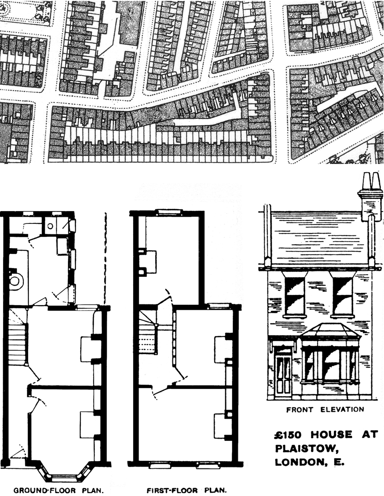

*4.3. ábra – A londoni sorházak a XIX. század második felében. Beépítés és háztípus*

A mai, kertes beépítési jelleg ugyancsak Angliában alakult ki a XIX. - XX. század fordulóján, az angol kertvárosokban. Az angol kertváros mintát teremtett, Európa-szerte épültek kertvárosok vagy kertváros-jellegű településrészek, amelyek lakásállományában a sorházak is szerepet kaptak.

Az első világháború után, főképp ott, ahol szociáldemokrata kormányzat jutott hatalomra, a politika célul tűzte ki a munkásrétegek lakáshelyzetének javítását. Ez képezte a modern, funkcionalista lakástervezés ideológiai hátterét, melynek szellemi központja a weimári Németországban volt. A Deutscher Werkbund egyesülés 1927-ben építészeti kiállítást szervezett Stuttgartban (Weissenhof lakótelep) amelynek tervezésében a modern építészet első generációjának nagy egyéniségei vettek részt. A lakóháztípusok között jelen voltak a sorházak is.

A modern építészet korai szakaszából a sorházas lakótelepek ismert példája Dessau Törten városrészében Walter Gropius által tervezett telep és a Frankfurt am-Mainban épült, Ernst May által tervezett „Römerstadt”, ahol nagy kiterjedésű lakóterületet alakítottak ki kétszintes sorházakkal ([4.4. ábra](#abra_4_04)).

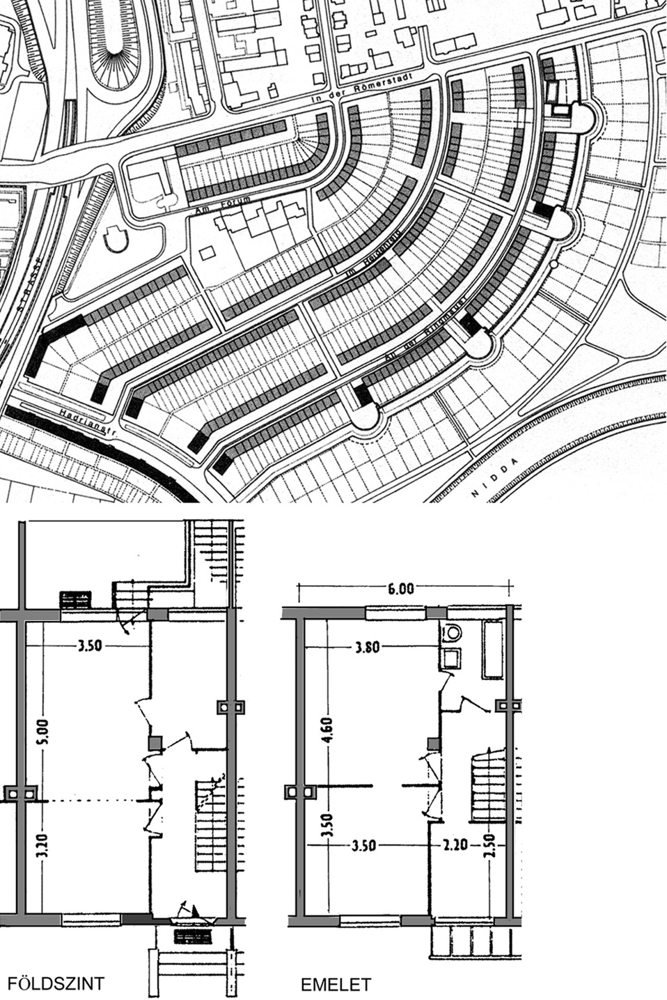

*4.4. ábra – Lakótelep. Römerstadt, Frankfurt-am-Main. 1926-1930. Ernst May. Helyszínrajz-részlet és kétszintes sorház alaprajza*

A modern mozgalom adaptálta az udvarkertes háztípust, és kifejlesztette a modern átriumházat a nagy sűrűségű beépítések létrehozására. Példaként említhetjük a Ludwig Hilberseimer által tervezett L alakú házat, amelynek alaprajzi elrendezése sok későbbi típus előképe ([4.5. ábra](#abra_4_05)). Mies van der Rohe is tervezett átriumházakat a harmincas évek elején. Udvarkertes házak a két világháború között csak szórványosan épültek, számottevő mértékben később a 60-as években terjedtek el.

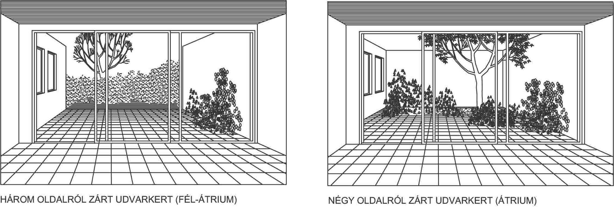

*4.5. ábra – Udvarkertes ház terve. Ludwig Hilberseimer. 1931.*

A második világháború nagy lakás-veszteségeinek pótlására Nyugat-Európában államilag kezdeményezett és pénzügyileg nagymértékben támogatott tömeges méretű lakásépítés kezdődött az ötvenes években. A hatvanas évekre a gazdasági helyzet ott már lehetővé tette, hogy viszonylag igényes lakások is épüljenek szervezett formában. Az alacsony, nagy sűrűségű lakóegyüttesek építésének fő helyszínei Anglia, Hollandia és a skandináv országok, de sok jelentős együttes épült másutt is, ismertek a nyugat-németországi és svájci példák is.

A dán Jörn Utzon tervezte a festőien szép „Kingohousene” átriumházas telepet Helsingörben ([4.6. ábra](#abra_4_06)). Itt a változatos terepviszonyok és a terület mélypontján lévő természetes víztükör miatt a sűrűbb beépítés a magasabban lévő terepvonulatokra koncentrálódik, ami lehetővé teszi az eredeti természeti környezet minél nagyobb részének megtartását.

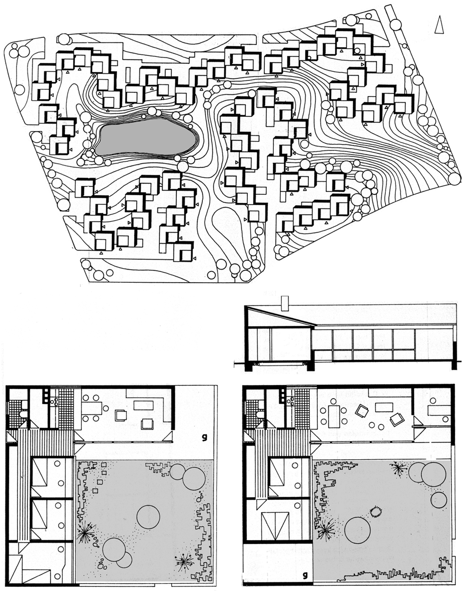

*4.6. ábra – Kinghousene. Helsingör. Átriumházak. 1958–1960. Jörn Utzon. Helyszínrajz és háztípusok.*

A korabeli egyetemes építészetben vezető szerepet játszó, finn „második generáció” egy-egy szép példával mutatkozott be Tapiolában. Itt épült meg Pentti Ahola közismert átriumházas együttese ([4.7. ábra](#abra_4_07)). A viszonylag nagyméretű, négy oldalról határolt udvarkert kellemes mikroklímát teremt az északi égöv zord időjárásában.

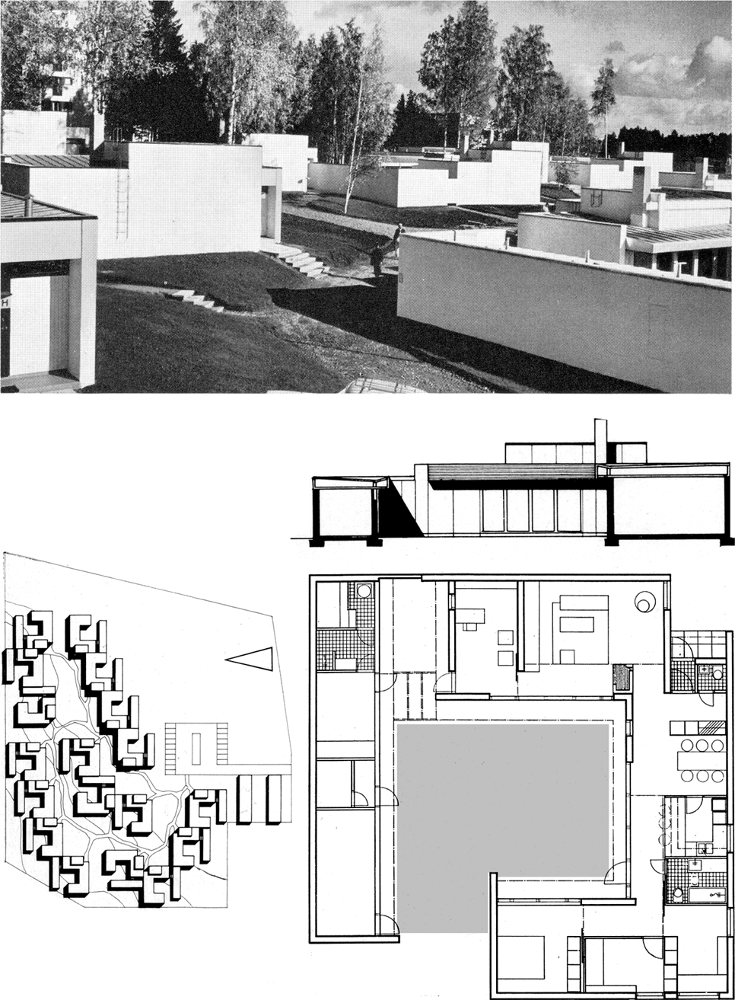

*4.7. ábra – Átriumházak. Tapiola, Finnország. 1963–1965. Pentti Ahola*

A hetvenes években az alacsony, nagy sűrűségű beépítések épülettípusai gyakran épültek a többszintes, többlakásos házakkal kompozíciós egységben. Ezzel igyekeztek feloldani a csupa sokszintes sávházakból formált lakótelepi környezet egyhangúságát. A kétféle beépítés területi egysége a telepek differenciáltabb lakásösszetételét is szolgálja: az alacsony, sűrű beépítés a nagyobb lakásokat fogadja be, míg a többszintes, többlakásos épületek a kisebb lakásokat tartalmazzák ([4.8. ábra](#abra_4_08)).

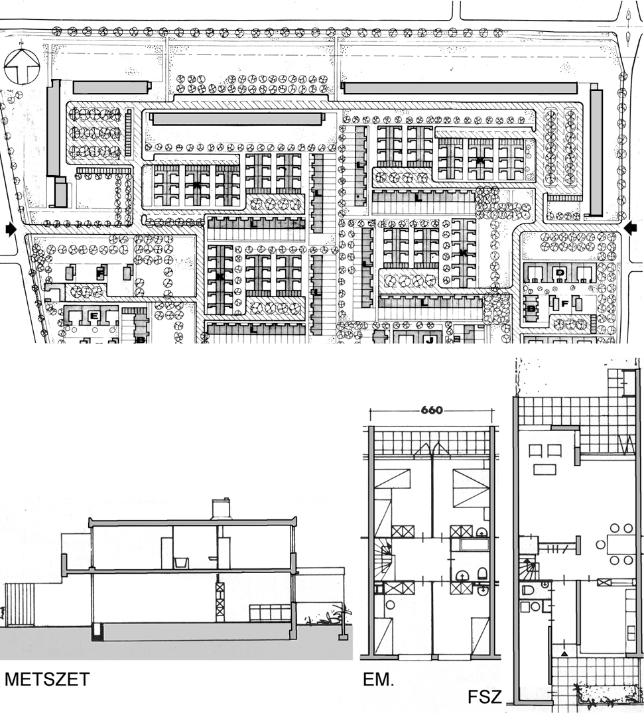

*4.8. ábra – t’ Hool. Eindhoven, Hollandia 1969-1973. Van den Broek és Bakema Helyszínrajz-részlet és kétszintes sorháztípus*

A hetvenes években épült a Ratingen-Eckamp telep, Düsseldorf mellett ([4.9. ábra](#abra_4_09)). A házsor tengelyére merőleges tetőgerincek oromzatai közvetlenül csatlakoznak egymáshoz, és az észak-német történelmi építészet városi utcáinak hangulatát idézik. (Meg kell jegyezni, hogy az ilyen tetőforma nálunk nem honos.) A nagy lélegzetű együttes egyik reprezentánsa a koncentrált lakótelepek alternatívájaként létesített alacsony, sűrű beépítéseknek.

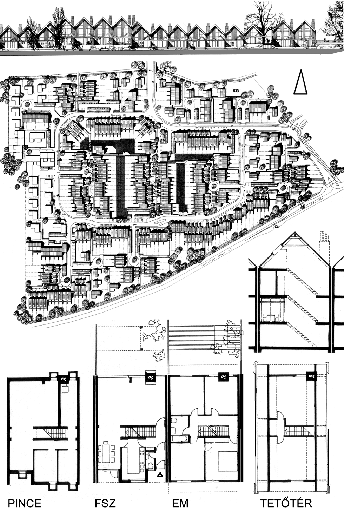

*4.9. ábra – Sorházas lakótelep. Ratingen, Düsseldorf mellett. 1970-es évek*

A nyolcvanas évek második felének lakásépítésében jelentős változások történtek Európa-szerte. A tömeges lakásépítésben élenjáró országok (pl. Svédország) lakásépítésének évi üteme a korábbinak töredékére esett vissza. A poszt-modern építészeti és településtervezési elvek a modern lakótelep egyeduralmát megtörték, de ekkorra az állami és önkormányzati szféra is visszavonult a nagy léptékű lakásberuházások kezdeményezéséből. Szerepét a különféle nonprofit gazdasági szervezetek (lakásszövetkezetek, lakásszövetségek) veszik át. Kisebb, legfeljebb néhányszor tíz lakást tartalmazó együttesek jellemzőek az alacsony, nagy sűrűségű beépítések körében, amelyek gyakran épülnek a meglévő, lazább településszövetek még beépítetlen részein. Tervezésüket sokszor összekapcsolják olyan, humánus lakókörnyezet kifejlesztésének igényével, amely a lakók szorosabb emberi kapcsolatokon alapuló együttélését segíti elő. Jellegzetes példa a bajorországi Veitschöchheimben épült együttes ([4.9. ábra](#abra_4_09)), amelynek tervezési megbízását a dán Vandkunsten csoport pályázat útján nyerte el. Az együttes már nem is emlékeztet az egyforma egységek mechanikus sorolásával kialakuló, megszokott sorház-együttesekre. A lakóközösség kommunikációs fóruma a közös használatú, nagyméretű belső udvar, a lakástípusok változatossága árnyaltabb összetételű lakóközösség kialakulását segíti. (A [4.10. ábrán](#abra_4_10) látható olyan lakáselrendezés, ahol az egymás fölött lévő kétszobás és háromszobás egység „generáció-váltásra” ad lehetőséget úgy, hogy az öregebb nemzedék lakása mindig a földszintről nyíljon.)

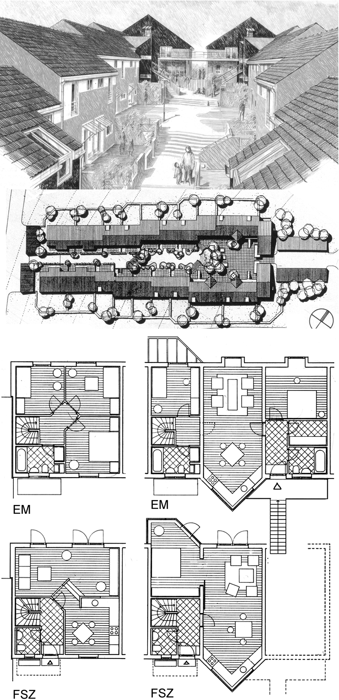

*4.10. ábra – Lakóegyüttes. Veitschöchheim, Németország. 1989. Vandkunsten csoport*

A huszadik század végén az alacsony, nagy sűrűségű együttesekben is megjelent a fenntarthatóságra és energiatudatosságra koncentráló szemlélet, lényegében az előző – családi házakról szóló – fejezetben részletezett innovációk bevezetésével. Erre példa Hollandiában, Utrechtben épült kétszintes naptérrel kialakított sorházas együttes ([4.11. ábra](#abra_4_11)).

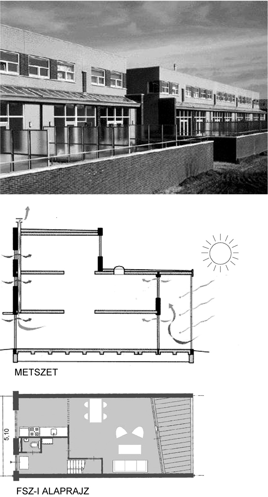

*4.11. ábra – Városi sorházak. Uttrecht, Holandia Tervezők: Van Straalen (Zeist) Hek Klunder Architekte*

A hazai történet

Magyarországon már a múlt században is épültek bányász-kolóniák és nagy gyárakhoz tartozó munkástelepek sorházas formában, amelyek szerény méretű, egyszintes lakásokat tartalmaztak. A XX. század elején épített telepeken a földszintes sorházakat főképp kis alapterületű, egy, legfeljebb két szobás munkáslakások építésére alkalmazták, néhol igen alacsony lakásszínvonallal. A két világháború között épülő családi házas telepeken is a kisebb, egy-másfél szobás lakásokat helyezték el földszintes sorházakban. Kétszintes sorházak vagy átriumházak lényegében nem épültek a második világháború előtt. Hazai bevezetésüket szakmai fórumokon állandóan ösztönözték a Nyugat-Európát megjárt és a nemzetközi modern építészet szervezetével is kapcsolatot tartó magyar építészek, gyakorlatilag eredménytelenül. (Pl. Kozma Lajos kétszintes sorházakra és átriumházakra készült szép tervei sem valósultak meg.)

Az ötvenes évek végén indult el szórványosan a kétszintes sorházak építése. Bányászlakások épültek tágasabb, kétszintes elrendezéssel, pl. Ózdon, a Farkaslyuk telepen. A létező szocializmus évtizedeiben – nagyjából a 80-as évekig – a lakásépítés két, határozottan elkülönült területre tagolódott: az állami lakásépítésre és a magánlakás-építésre. A hatvanas évek derekára kiderült, hogy a legkeményebb ötvenes években ideológiai alapon kiátkozott családiház-építés nem nélkülözhető, és már az ötéves népgazdasági tervek is tartalmazták a magánlakás-építés által teljesítendő mutatószámokat. Az állami és magánlakás-építés megoszlása nagyjából fele-fele arányú. Az első tartományt az állami (ill. tanácsi) apparátus szervezte az előírt tervmutatók teljesítésére, és állami építőipari nagyvállalatok kivitelezték koncentrált, néha több ezres lakásszámot felmutató lakótelepeken, hogy a hatvanas években indított házgyári technológiák minél termelékenyebben legyenek kihasználhatók. A lakótelepek tízszintes épületeihez képest nem lehetett alternatíva az alacsony, 1-2 szintes beépítés, ezért az nem is szerepelt az állami lakásépítés kelléktárában.

A magánlakás-építés elsöprő többségét a házilagos kivitelezésben megvalósított családi házak jelentették, fő helyszínei az alacsony szinten ellátott, vidéki térségek voltak. A „közműolló” egyre tágabbra nyílt, a hozzáértők már akkor is felismerték ennek ökológiai veszélyeit. A gazdaságosabb közművesítés lehetősége érdekében a központi politika inspirálni igyekezett a sűrűbb beépítéseket a magánlakásoknál is. Államilag kezdeményezett „kísérleti lakótelepek” épültek, amelyeken sorházakat is bemutattak (pl. az óbudai és budafoki kísérleti lakótelep, békéscsabai lakótelep). A hatvanas években a jövőbeni falu modelljét kutató, elméleti szinten maradt tervpályázatokban és tervjavaslatokban megjelenik a „falusi sorház”, ahol a haszonkertek sorházak közelében lettek volna, de nem közvetlenül a lakáshoz kapcsolva. Hasonló elgondolással indult eredetileg a Maros Tamás által tervezett, szakmailag nagy elismertséget kapott perbáli sorház-együttes is ([4.12. ábra](#abra_4_12)). Valójában az agglomerációs térségekben alkalmazható alacsony, nagy sűrűségű beépítések korai példája lett, lakói ma főleg értelmiségiek.

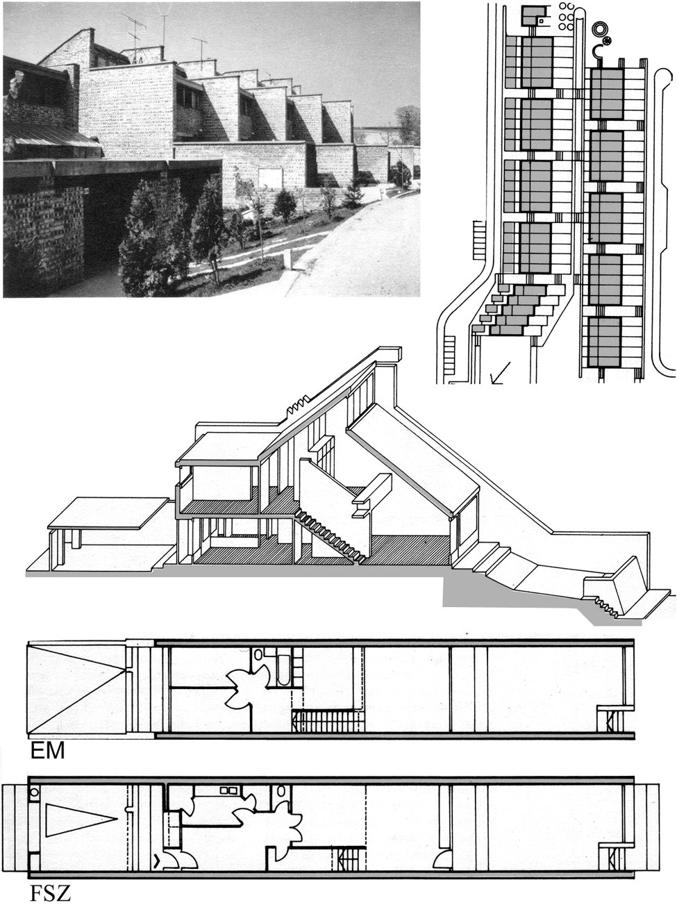

*4.12. ábra – Sorházak. Perbál, 1975. Maros Tamás*

A politikai apparátus a lakossági kezdeményezésű magánlakás-építésben pénzügyi eszközökkel is igyekezett elősegíteni a sűrűbb beépítési formák elterjedését. A hitelfeltételek különféle épületfajták szerint eltérőek voltak. Legkevesebb hitelt adtak a családi házhoz, kevéssel több járt (volna) a fejezet témájába vágó „korszerű, csoportos családi házaknak”, még többet kapott az „egyedi többszintes” épület (legalább két lakószint, legalább négy lakással) és legtöbb a „telepszerű többszintes” formának jutott (legalább 12 lakást tartalmazó lakásberuházás, legalább kétszintes és legalább négylakásos épületekkel). A pénzügyi preferenciák hatására az alacsony, nagy sűrűségű beépítések épülettípusai közül azok kezdtek épülni, amelyek a legnagyobb anyagi támogatást kapták. A kétszintes sorház – némi jóindulattal – belefért az „egyedi többszintes” és a „telepszerű többszintes” kategóriába. A szabadon álló beépítésre alakított telkeken megjelentek a 4-6 egységből álló emeletes „sortársasházak”, és a megfelelő infrastruktúrát legtöbbször nélkülöző, 12 lakásos emeletes sorház-együttesek épültek imitt-amott, a faluvégeken is. Mindezek ellenére ott, ahol a település irányítása hozzáértő kezekben volt, figyelemre méltó együttesek is létesültek.

A nyolcvanas években már az Országos Takarékpénztár által finanszírozott és eladásra szánt lakások épültek a lakótelepeken is, de mind a beruházás szervezését, mind kivitelezését a korábbról örökölt apparátus végezte. A lakótelepek léptéke kedvezően változott, és a házgyárak lakáskészletében immár megjelennek a sorházak is (pl. Újszeged, Nyíregyháza). Az igazi hiány a beruházás szervezési oldalán mutatkozott: nem voltak meg azok a nonprofit gazdasági szerveződések, amelyek az akkori Nyugat-Európában a spontán építtetői igényeket szervezett formákba egyesítették.

A nyolcvanas évek második felében már kedvező változások jelei mutatkoztak. Spontán kezdeményezéssel létrejött lakásszövetkezet beruházásában épül meg az a dunaújvárosi, udvarkertes házakból álló 97 lakásos együttes ([4.13. ábra](#abra_4_13)). Ennél a terület-takarékos tömbtelek, az olcsó közművesítés és a szervezett anyagbeszerzés gazdasági előnyeit lehetett egyesíteni az akkor is legolcsóbb, házilagos kivitelezésből adódó megtakarításokkal. Az épületenként történt házilagos kivitel néhol kívánni valót hagy az egyes házak építészeti színvonalában, de ezt bőven ellensúlyozza az egységes, kulturált lakókörnyezet, ami a lakásszövetkezeti tagok jó együttműködésének köszönhető.

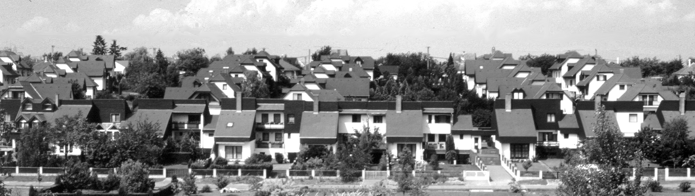

*4.13. ábra – Dunaújváros, lakóegyüttes 1985–1989 Bitó J. Sárvári I. Szamosi Gy.*

A rendszerváltozás hatására alapvetően új helyzet állt elő a lakásépítés intézményi és pénzügyi feltételeiben. A 90-es években a lakásépítés üteme nagymértékben visszaesett. Az alacsony, nagy sűrűségű beépítések a profit-orientált vállalkozói lakásépítés körében épültek néhány helyen, és megjelentek a magas lakásszínvonalat mutató lakóparkok körében is, néhol építészetileg is kiemelkedő minőségben ([4.14. ábra](#abra_4_14)).

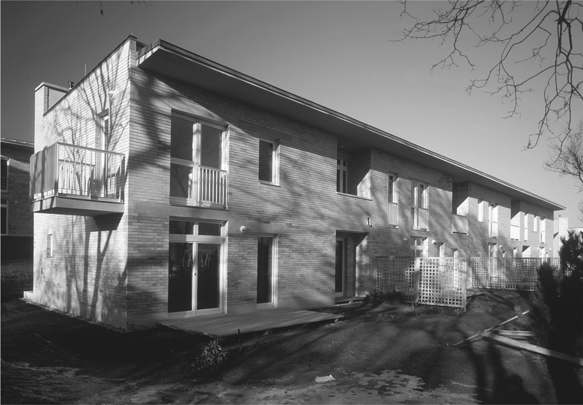

*4.14. ábra – Sorház a Budapest, Barlang-utcai lakóparkban. Cságoly Ferenc 2000*

## 4.3. Az alacsony, nagy sűrűségű beépítések közös jellemzői

### 4.3.1. Gazdaságossági kérdések

Minél jobb egy terület infrastrukturális ellátása, annál nagyobb a terület-előkészítés költsége, amelyet a telekárba beépítenek. A jól ellátott városi lakótelkek árát a piaci kereslet tovább emeli, így a nagyvárosi és nagyváros-környéki zöldövezetekben épülő, nagy telekkel rendelkező családi házak építését ma már csak a nagyon tehetős építtetői réteg engedheti meg magának. Az ennél alacsonyabb jövedelmű városi lakosság előtt látszólag két lehetőség van: vagy többszintes, többlakásos épületbe költözik, de elesik a lakáshoz tartozó kert előnyeitől; vagy egy távolabbi, és rosszul ellátott területen épít kertes családi házat, ahol a telekár még elérhető számára, de vállalnia kell a napi utazás költségeit és nélkülözni kényszerül a városias lakókörnyezet szolgáltatásait.

Az alacsony, nagy sűrűségű beépítések a kétféle beépítési forma közötti űrt töltik ki: a kertes családi házak használati értékét nyújtják bizonyos mértékig, miközben a többszintes, többlakásos házakra jellemző telektakarékos beépítés gazdasági előnyeit is hordozzák.

E fejezetben tárgyalt épületfajták gazdasági kérdéseit a családi házas beépítésekkel összehasonlítva is vizsgálhatjuk. A beépítési módok egyes változatai a takarékosabb telekfelhasználás miatt alakultak ki: a családi házak zártsorú beépítési módban igénylik a legkisebb telket. A „hagyományos” zártsorú beépítés családi házai egymástól függetlenül, akár eltérő időben, telkenként valósulhatnak meg. A hagyományos, zártsorú beépítés telkének nagysága nemigen lehet kisebb, mint a szabadon álló beépítésnél megkívánt telekterület fele. Ez frekventáltabb területeken még mindig viszonylag magas telekárat jelenthet.

Az alacsony, nagy sűrűségű beépítés épületeinek közös jellemzője, hogy azok lakásegységei egyszerre épülnek meg, az összefüggő épületre vagy épületcsoportra kiterjedő, egységesen készült terv alapján. Az együtt létesített épületvolumen tartalmazhat kevesebb, akár 4-6 lakást is, de az egyszeri beruházás keretében megvalósított lakások száma akár százas nagyságrendet is elérheti. A lakásegységre vetített telekhányad, és annak ára, a szabadon álló családi házas beépítésnél megkívánt értéknek akár negyed-ötödrészére is csökkenhet, de mégis van minden lakónak – bármilyen kicsiny – saját használatú kertje.

Az intenzív beépítés, természetesen, feltételezi a teljes közművesítést és a teljes körű városi közszolgáltatásokat. (Ilyen sűrű beépítés mellett a szennyvíz talajba történő elszivárogtatása szóba sem jöhet, a kis kertek a konyhai hulladék komposztálásra nem alkalmasak, ezért nélkülözhetetlen a korszerű és gyakori szemétgyűjtés stb.) Magyarán: az alacsony, nagy sűrűségű beépítés nem fogható fel úgy, mint a rosszul ellátott családi házas területek sűrűbben beépített változata, hanem a magas fokon ellátott, városias lakóterület alacsony házakat tartalmazó formájának tekintendő.

Az alacsony, nagy sűrűségű beépítés témája a többszintes, többlakásos házak kérdéskörének irányából is megközelíthető. Utóbbiaknál a beépítési sűrűség és az épületmagasságok csökkenése volt tapasztalható az utóbbi évtizedekben. Kiderült, hogy a magas lakóépületeket a lakók nem kedvelik, és azok léte gazdaságilag sem igazolható. A parkolási és zöldfelületi normák szigorodása miatt a többszintes, többlakásos beépítések fajlagos szintterületi mutatója legfeljebb akkor emelhető az 1-1,2 érték fölé, ha földalatti garázsokat létesítenek, ami jelentős költségtöbblettel jár. Ezért a három-négy szintnél magasabb épületek létesítésének általában nincs gazdasági indoka a zöldmezős lakásberuházásoknál. Alacsony, nagy sűrűségű beépítéssel a 0,6 - 0,7 szintterületi mutató is elérhető, és a saját kerthasználat előnye miatt ez már reális alternatívája lehet a többszintes, többlakásos épületeknek.

A [4.15. ábrasor](#abra_4_15) sémáival összehasonlítjuk egy hagyományos, háromszintes társasházakkal, kétszintes sorházakkal és egyszintes átriumházakkal beépített, azonos nagyságú terület karakterét, azonos szintterületi mutató mellett. Kétszintes sorházak esetén a beépítettség mértéke nagyobb ugyan, de az alacsonyabb épületek kevéssé árnyékolják a zöldfelületeket, így azok intenzitása is nagyobb.

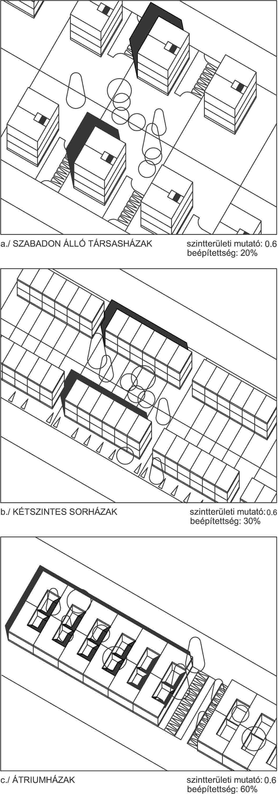

*4.15. ábra – Különböző beépítések összehasonlítása azonos szintterületi mutató mellett*

Az átriumházas beépítésnél a zöldfelületek aránya már a kritikus mérték alá süllyedhet, ezért egyszintes beépítéssel a max. 0,4 - 0,5 körüli szintterületi mutató látszik reálisabbnak.

### 4.3.2. Telekalakítás, telekfelhasználás

Az alacsony, nagy sűrűségű beépítések lakásegységei állhatnak önálló telken (a zártsorú beépítés sűrű formája); egy – több lakásegységet tartalmazó – épület állhat egy közös telken (un. „sortársasház”); vagy több, egyenként több lakásegységet magában foglaló épület(csoport) állhat egy nagyobb kiterjedésű telken (a régi terminológia szerinti „tömbtelken”).

Az önálló telken álló egységek szerkezetileg nincsenek összeépítve, csatlakozásukra a zártsorú családi házaknál leírt szabályok érvényesek (tűzfalcsatlakozás). Valamennyi egység telkével együtt önállóan birtokolt, önállóan bejegyzett ingatlan. Az összefüggő épületsort egyszerre kell megépíteni, de ezután az épületek karbantartása egységenként történik, az épületek tulajdonosainak együttműködésére nincs szükség. Ez a beépítési mód adja leginkább a használónak „az én házam az én váram” érzetet, ezért népszerű. Hátránya viszont, hogy a terület közművesítésének költségei magasak: minden lakásegységhez minden közművet külön-külön kell csatlakoztatni, és keskeny telekszélesség mellett a bekötő vezetékek hossza lényegesen meghaladhatja magának a gerincvezetéknek a hosszát is.

A terület csak közterületre és egyéni területre tagolódik, közösen használt területek nincsenek. Ez egyben a hátránya is: bizonyos zöldterületi funkciókat a keskeny telkek ellátni nem tudnak, mint pl. gyermekek játszó, labdázó helye ([4.16.a. ábra](#abra_4_16)).

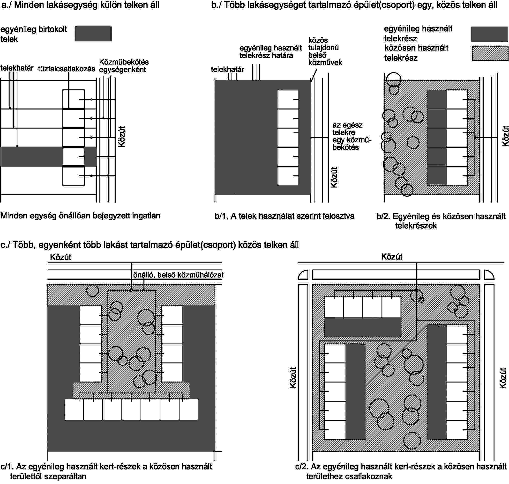

*4.16. ábra – A telekhasználat módozatai az alacsony, nagy sűrűségű beépítéseknél*

Egy épület(csoport), amely több lakásegységet tartalmaz egy közös telken is állhat. A telek osztatlan közös tulajdon, az épület lényegében társasház jellegű. Az épület karbantartása közösen történik. A telekre elég egy-egy közműbekötést adni, a telken belüli vezetékhálózat egyszerűbben, olcsóbban kiépíthető. A telket a lakók közös megegyezéssel teljes egészében fel is oszthatják úgy, hogy minden lakásegységhez saját használatú kert tartozzon. Lehetséges, hogy a lakásegységhez csak egy kisebb, egyénileg használt kertrész tartozik, a telek fennmaradó része közös használatú. Itt lehet labdázó hely, közös grillező, kisebb medence stb. E közös telekrész növényállománya, karaktere a természeteshez közelebb állhat, mint az aprócska „díszkertek” megszokott látványa: itt fákkal, bokrokkal tagolt, nagyobb pázsit-felület létesíthető és egységesen művelhető. A telekhasználat szerint a telek privát és közös részekre tagolódik ([4.16.b. ábra](#abra_4_16)).

*(A területek használatára vonatkozóan az angol nyelvű szakirodalomban általánosan elterjedt „public area; semi-public area; semi-private area; private area” elnevezéseket a továbbiakban „közterület; nyilvános használatú terület; közös terület; privát terület” kifejezésekkel használjuk. A privát terület helyett azért nem használjuk a magyarosabb „magánterület” elnevezést, mert utóbbi inkább tulajdonviszonyt jelent: pl. a közösen használt terület is jelenthet nálunk magánterületet.)*

Nagyobb lakásszámú együttesekhez alakítható olyan, nagyobb kiterjedésű telek, amelyen számos, egyenként több lakásegységet tartalmazó épület illetve épületcsoport helyezhető el. A lakásszám a tízes nagyságrendtől akár a százas nagyságrendig terjedhet. Nagyobb együtteseknél már nemcsak belső, közösen fenntartott közmű-vezetékhálózat van, hanem az egységek megközelítéséhez közterület-jellegű (semi-public) belső úthálózat is szükséges (lásd következő fejezetben). A telek további részei lehetnek közös és privát használatúak.

A zöldfelületek gondozása, a közös kerti létesítmények karbantartása már valamely szervezett lakóközösségi forma meglétét és legtöbbször bérmunka folyamatos igénybevételét is feltételezi. A nagyobb lakásszámú együtteshez gyakran tartozik közös használatú épület is (pl. kerti kisgép-tároló, karbantartó műhely, többcélú közösségi terem, kondicionáló terem, szauna stb.). Ilyen együtteseket Nyugat-Európában gyakran építenek lakásszövetségek, lakásszövetkezetek, amelyek eleve a lakóközösség szorosabb, szervezett együttműködését feltételezik. Nálunk inkább a szintén szervezett fenntartást igénylő „lakópark” terjedt el.

### 4.3.3. Gyalog- és járműforgalmi megközelítés

A lakásegységek jármű- és gyalogforgalmi megközelítése a telekhasználat módjával összefügg. A saját telken álló egységek és a kisebb lakásszámot tartalmazó „sortársasházak” feltárása közvetlenül a közútról történik, önálló belső forgalmi rendszert nem igényelnek.

Nagyobb kiterjedésű, több épületet (több épületcsoportot) magukban foglaló telkek lakásegységeinek megközelítésére több lehetőség van ([4.17. ábrasor](#abra_4_17)).

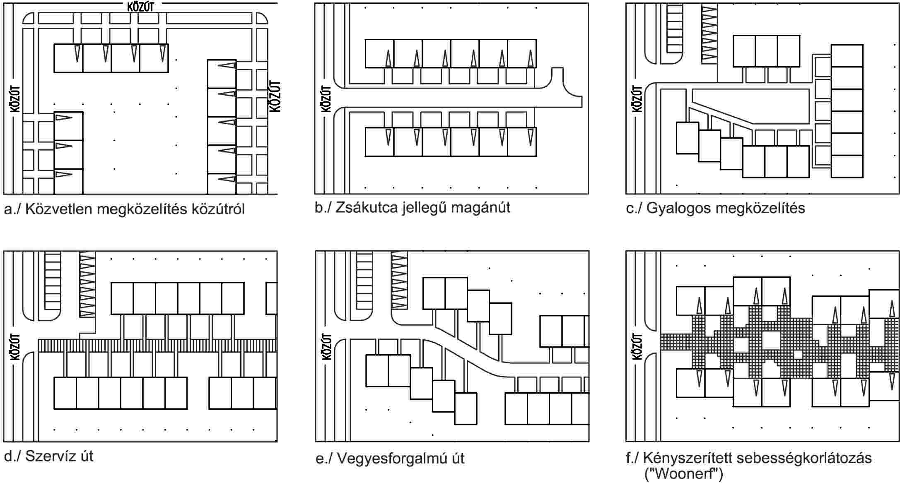

*4.17. ábra – A megközelítés módozatai nagyméretű telkek esetén*

Valamennyi lakásegység közútról mind gyalogosan, mind járművel megközelíthető. Akkor lehetséges, ha a telket három (vagy legalább két) oldalról közút határolja és a telek nem túl nagy, csak a közutak mentén történő beépítéssel is gazdaságos szintterületi mutató érhető el. A gépkocsitárolást célszerű egységenként biztosítani ([4.17.a. ábra](#abra_4_17)).

Az egységek megközelítése nyilvános használatú magánútról (zsákutcából) történik, a gépkocsitárolás egységenként történik. Régebben gyakran alkalmazott megoldás, ma már túlhaladott. Hátránya ugyanis, hogy az autóút és a járdák burkolt felületének kialakítása nagy területet foglal el. A nagy beépítési intenzitás mellett a gépkocsiforgalom jelenléte a telek belsejében balesetveszélyes lehet, és környezeti szempontból (légszennyezés, zaj) is hátrányos ([4.17.b. ábra](#abra_4_17)).

Az egységek gyalogúttal kapcsolódnak az autóúthoz. Gépjárműforgalom az épületek között nincs, a gépkocsitárolás koncentráltan történik a közút-csatlakozás közelében, a lakásegységektől elválasztva. A lakásbejárat és az autóút (parkoló) távolsága viszonylag rövid lehet, azért is, mert a lakásegységek tűzoltó autóval, mentőkocsival történő megközelítési távolsága is korlátozott. Emiatt csak kisebb lakásszámú együttes feltárására alkalmazható ([4.17.c. ábra](#abra_4_17)).

A „szerviz-utas” feltárás. A szerviz-út a szokásosnál nagyobb teherbírású, és szélesebb (3-4,5 m) gyalogút, amelyre kivételezett járművek – mentő, tűzoltó, szemétszállító, bútorszállító stb. – behajthatnak. Előnye a gazdaságosság, a gyalogosok teljes biztonsága. A hatvanas-hetvenes években elterjedten alkalmazták Európa-szerte, de a lakók nem kedvelik, ha a gépkocsiút és parkoló messze esik a lakástól – csomagcipelés hétvégi bevásárlás után ([4.17.d. ábra](#abra_4_17)).

A feltárás történhet vegyes forgalmú úttal. A gyalogosok és az autók azonos felületen közlekednek, de itt tilos parkolni, átmenő forgalom tilos. Parkoló vagy a tömbgarázs elkülönítve helyezkedik el, ezért az utat autóforgalomra csak ritkábban érdemes használni (pl. csomagszállítás esetén) így a gépjárműforgalom is mérsékeltebb. Ennek ellenére csak kisebb forgalmi terhelésnél (alacsony lakásszámnál) alkalmazható ([4.17.e. ábra](#abra_4_17)).

Vegyes forgalmú út, kényszerített sebességkorlátozással (erre a „woonerf” holland elnevezés terjedt el a szakirodalomban). Az épületek között olyan terület alakul ki, amely egyszerre tölt be közterület-jellegű és közösségi funkciót. Sajátos kertészeti eszközökkel és térburkolattal alakítják ki. A lakóközösség kommunikációjának a helye, de autóval is rá lehet hajtani szigorú sebességkorlátozás mellett, amelyet kanyargásra kényszerítő akadályok (virágvályúk, fák, padok, terelőszegélyek és huppanók) garantálnak. A gépkocsitárolás történhet koncentráltan, a lakásegységektől elkülönítve, de az egységekhez is kapcsolódhat ([4.17.f. ábra](#abra_4_17)).

A felsorolt módozatok együtt is alkalmazhatók: pl. a szerviz út vagy vegyesforgalmi út és a gyalogutas megközelítés kombinálásával.

Az akadálymentesség szempontjából a lakásbejárat és parkoló közötti távolság rövidítése kiemelt fontosságú, így a lakásegységhez közvetlenül csatlakozó gépkocsitárolás az előnyösebb megoldás.

A mozgásukban valamilyen ok miatt korlátozott személyek (pl. aktív kerekesszékes személyek, idősek) önálló közlekedésükhöz gyakran gépkocsit használnak. Mivel egy mozgásában korlátozott személy fizikai állapota, illetve az általa használt segédeszköz miatt lassabban és bizonytalanabbul mozog, és egy vagy mindkét keze a segédeszköz használata miatt foglalt – így pl. ernyőt nem tud feje fölé tartani – kiemelt szempont számára, hogy a gépkocsi tárolás a lakás védett bejáratához minél közelebb legyen. Így biztosítható hogy a gépjármű szélsőséges időjárási viszonyok (pl. eső, hó, jég) között is biztonságosan megközelíthető és igénybe vehető. (P.A.)

A telekhasználat mikéntje befolyásolja az épülettípusok kialakítását. A közvetlen, közútról történő megközelítés esetén a lakásegységre jutó közműköltség elvileg a telekszélességgel fordítottan arányos, ezért a gazdasági szempontok minél keskenyebb egységek kialakítására ösztönöznek (az irodalomban találunk példákat akár 4 m széles egységekre is). A „tömbtelkes” beépítésnél, saját (olcsóbban kialakítható) belső közműhálózat és belső forgalmi rendszer esetén ez a szempont nem érvényesül ilyen mértékben, így lehetséges szélesebb – a saját kertrész használatát kevéssé zavaró – egységek megformálása ([4.18. ábra](#abra_4_18)).

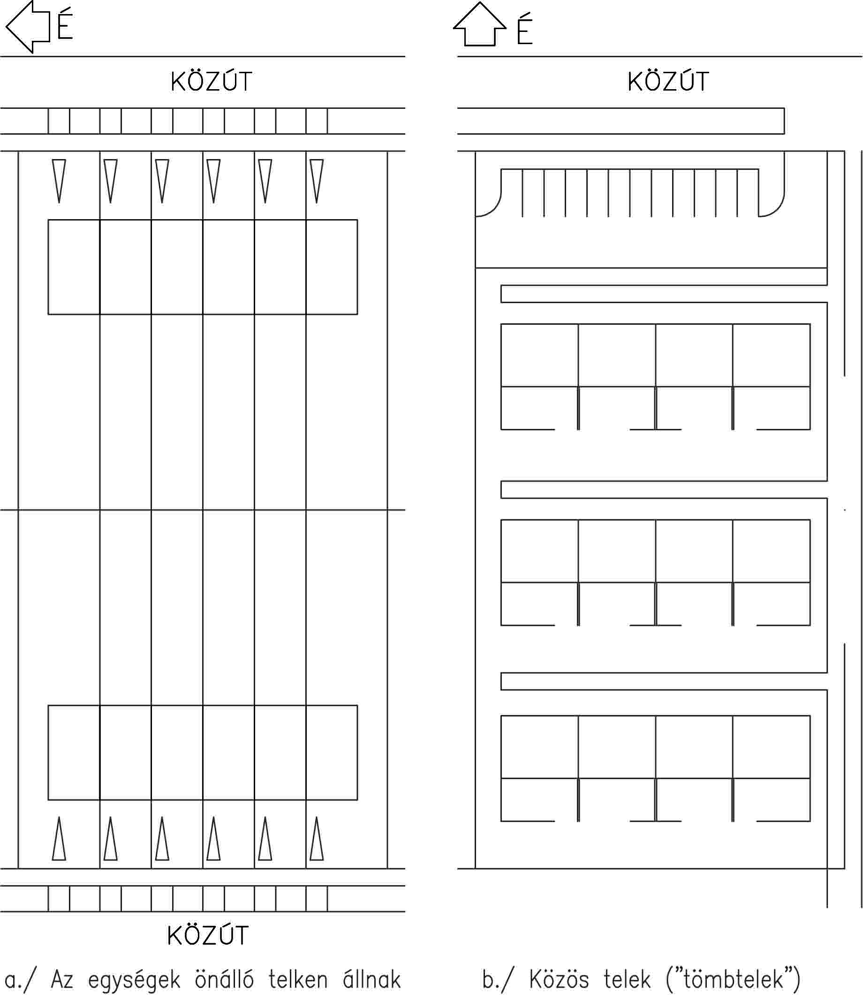

*4.18. ábra – A telekhasználat módjának hatása az épületek kialakítására kétszintes sorházaknál*

Az alacsony, nagy sűrűségű beépítések épületeinek tervezése elválaszthatatlan magának a beépítésnek a megtervezésétől. A lakóegyüttes telepítése (helyszínrajza) és a lakóépületek kialakítása a legszorosabban összefügg. Csak a saját tulajdonú telekkel rendelkező „csoportházaknál” fordulhat elő, hogy egy-egy lakásegységet egy, már korábban alakított telken kell elhelyezni. Általánosabb az olyan eset, ahol a telepítés (beépítési terv) és a lakóépületek tervezése egyszerre történik: az építész maga teremti meg a lakások közvetlen környezetének adottságait.

## 4.4. Sorházak

### 4.4.1. A sorházak szintszáma

A sorházak alacsony, sűrű beépítéseknél leggyakrabban használt épülettípusok. Lehetnek földszintesek vagy két- (ritkábban három- vagy több-) szintesek.

*A földszintes sorházak* esetében a telek beépítettsége éppen kétszerese annak, mint amit kétszintes sorházzal el lehet érni azonos szintterületi mutató mellett. A nagyobb beépítettség miatt a lakásokhoz tartozó kert viszonylag kicsiny. Megfelelően gazdaságos sűrűség mellett (kb. 0,4 szintterületi mutató) az egységek már olyan közel kerülnek egymáshoz, hogy a kerthasználat vizuális zavartalansága nehezen biztosítható. Az intimitás érdekében a kerteket átlátást gátló kerítésfalakkal célszerű elhatárolni, miáltal azok *udvarkertekké* válnak ([4.19. ábra](#abra_4_19)). Az udvarkertes beépítéseket a továbbiakban külön alfejezetben tárgyaljuk.

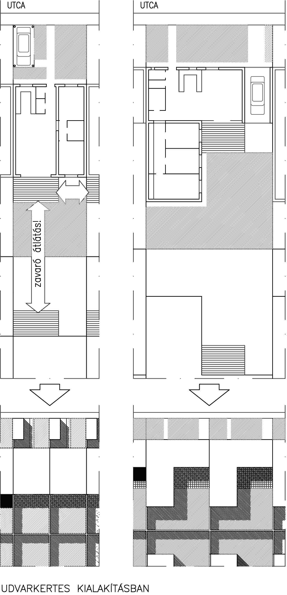

*4.19. ábra – Jellegzetes földszintes sorház típusok*

Átmeneti formát jelent a magastetős, beépített tetőtérrel rendelkező földszintes sorház, amely a kétszintes sorházak körébe is sorolható.

*A kétszintes sorházak* nagy elterjedését indokolják az európai hagyományok (hagyományos, zártsorú kétszintes lakóházak), és az a tény, hogy gazdaságosan telepíthetők: viszonylag kicsiny telekszükséglettel rendelkeznek (magas fajlagos szintterületi mutató).

### 4.4.2. A kétszintes lakásegységek térbeli kialakítása

A lakáskompozíció szempontjából alapvető kötöttség, hogy a lakás helyiségeit csoportosítani kell földszinti és emeleti helyiségcsoportokra, amelyeket lakásbelsőlépcső köt össze. A két helyiségcsoport kézenfekvően a „nappali tartózkodás” zónája valamint a hálószobákból és fürdőből kialakuló „intim zóna”. Mivel a saját kerthasználat a lakástípus alapvető előnye, lehetőleg a kert szintjén legyenek a nappali tartózkodás helyiségei és lakáselemei.

A lakástípus *hátránya* – mint minden kétszintes lakásé – hogy a lakáshasználat állandó lépcsőjárással jár, amely bizonyos élethelyzetekben (öregkor, állandó vagy időszakos mozgáskorlátozottság) kritikussá válhat. Ezért nyomatékosan ajánlott, hogy a földszinten legyen meg valamennyi lakásfunkciót – ha korlátozottan is – kielégítő lakáselem. Legyen itt WC, normális méretű mosdóval (kisméretű kézmosó nem elegendő). Ajánlott a földszinten is elhelyezni egy, a megváltozott igényekre adaptálható zuhanyozót vagy fürdőszobát.

A földszinten elhelyezkedő, a szokásos WC-nél nagyobb méretű vizes helyiség– mint háztartási helyiség - egyben a mosógép elhelyezésére és ruhaszárításra is lehetőséget adhat, ha a lakásban külön háztartási helyiség másutt nem készül. Lehetőleg legyen a földszinten is egy kisebb szoba a nappalin kívül.

Ez a térbeli elrendezés a lakás esetleges későbbi akadálymentes kialakítása szempontjából elengedhetetlen: a többcélú szoba és a hozzá kapcsolódó, adaptálhatóan kialakított fürdőszoba a megváltozott használói igényeket kielégítve biztosítani tudja a lakás hosszú távú használhatóságát. Ajánlott ezért olyan helyiségméreteket alkalmazni, illetve ezeknek a helyiségeknek az ajtóit eleve olyan mérettel tervezni, hogy az később minimális átalakítással biztosítani tudja az akadálymentes használathoz szükséges helyigényt. (P.A.)

A [4.20. ábrán](#abra_4_20) látható egy kétszintes sorház funkciósémája, amelybe a helyiségek alapterületét is jelöltük a kategóriában általánosnak mondható igényszint mellett. Ha az emeleten három hálószoba van a fürdőszobán és a szükséges közlekedőn kívül, a földszint és az emelet alapterülete azonos lehet, kialakítható tisztán kétszintes elrendezés.

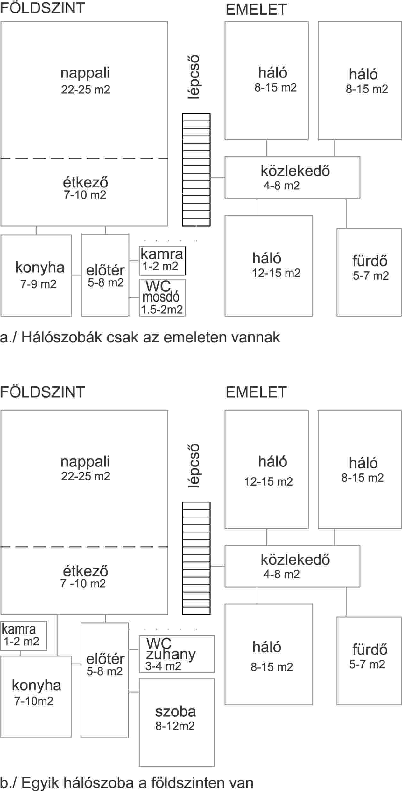

*4.20. ábra – Példák kétszintes sorházak funkciósémájára*

Előfordul, hogy a tervezési program az emeleten kevesebb hálószobát kér, vagy a földszint alapterülete egyéb okból nagyobb az emeletinél. (Kivételesen ritka az olyan program, amely a földszintinél nagyobb alapterületet követel a felső szinten.) A [4.20. ábra](#abra_4_20) második funkciósémája olyan esetet mutat, amikor a földszintre is hálószoba, illetve egy többcélú szoba kerül (nagyszülő szobája, dolgozószoba stb.). Ilyenkor nagyon ajánlott még egy fürdőszobát vagy zuhanyfülkét a földszinten is elhelyezni. Lehetséges az is – mint később tárgyaljuk – hogy a gépkocsitároló is az egységen belül van, a földszinti területigényt növelve. Ilyenkor a földszint és emelet alapterülete nem lehet azonos, a tisztán kétszintes elrendezés helyett más térbeli rendszert kell választani. Ilyen esetekre mutat példákat a [4.21. ábrasor](#abra_4_21).

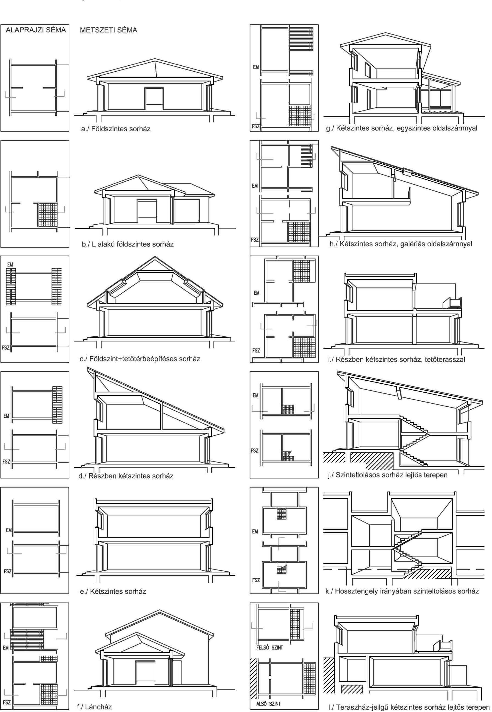

*4.21. ábra – Példák sorházak térbeli elrendezésére*

A tervezés kezdő fázisa legyen mindig a megadott program alapterület-szükségletének elemzése a földszinti és emeleti helyiségek vonatkozásában: a megfelelő térbeli elrendezés megválasztás ennek alapján történjen.

### 4.4.3. A helyiségek tájolása

A *tájolási feltételek* korlátozottak a lakások kialakításánál, mivel a közbenső sorházegységnek csak két homlokzata van az átellenes oldalakon. Általános szempont, hogy a szobák *többsége* lehetőleg benapozott homlokzaton legyen (a nappali mindenképpen). A széleskörűen elfogadott szakmai konvenció szerint a nappali déli vagy nyugati tájolást kíván, de ennél fontosabb szempont a nappali szoba és a kert kapcsolata. Ha a kert a keleti homlokzathoz csatlakozik, akkor a kertkapcsolat kapjon prioritást.

A hálók nyugati tájolása kedvezőtlen a túlzott felmelegedés miatt nyáridőben, ezért azoknak jobb a keleti – esetleg déli – tájolás. É-D-i épülettengelynél a hálók többsége lehetőleg a keleti homlokzaton legyen. Ha egyik homlokzat észak felé néz, akkor legtöbbször elkerülhetetlen az északi háló. Jó, ha ez a szülői háló és inkább a gyerekszobák a benapozottak, hisz azok a használók napközbeni tevékenységének is színterei. Abban az esetben, ha hálószobák a nyugati homlokzatra kerülnek, akkor árnyékolásukról gondoskodni kell.

A példaként közölt [4.22. ábrasor](#abra_4_22) egy gyakori kétszintes sorház-elrendezést mutat, ahol a felső szinten három hálószoba helyezkedik el. Amikor a kert a nyugati oldalon van, akkor kézenfekvő, hogy nyugatra csak egy háló nézzen a három közül. Ez legtöbbször nem tölti ki a homlokzat teljes hosszát (csak jelentős túlméretezés esetén) ezért ide kívánkozik a fürdőszoba is: épp a nappali fölé. Ezt korábban szabályzat tiltotta, de mindenképpen kerülni kell a nappali fala mentén vagy annak falában vezetett ejtőcsövet (lásd 4.4.7. fejezetet). Ilyenkor más vizes helyiséget kell elhelyezni a fürdőszoba alatt, vagy kompromisszumot kell kötni, és két hálót tájolni nyugat felé. (A tájolás szempontjai olyan *értékszempontok,* amelyek más értékekkel együtt, azokkal való kölcsönös egyensúly szerint érvényesek. Lehetséges, hogy néha a tájolási feltételekben kell engedményeket tenni más értékek érvényesülése érdekében.)

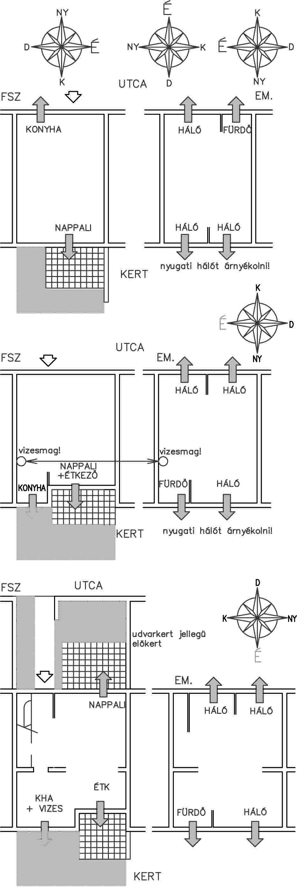

*4.22. ábra – Példák kétszintes, három hálószobás sorházak alaprajzi sémáira a tájolási adottságok figyelembe vételével*

Rendkívül nehézkes a jó tájolás biztosítása olyan esetben, ha a kert az északi homlokzathoz csatlakozik. Ilyen helyzetet ne teremtsünk a beépítési terv készítésénél, de néha ez mégis elkerülhetetlen bizonyos, kialakult helyzetekben. Ilyenkor az előkert is lakófunkciót kaphat, ha a vizuális zavartalanságáról gondoskodunk (pl. falakkal elkerített udvarkert formájában). A hátsó kert legyen más lakóhelyiséggel (pl. étkezővel) kapcsolatban.

Hangsúlyozni kell, hogy a megfelelő tájolás célja a *benapozás*, amit önmagában nem biztosít az, ha egy-egy ablak névlegesen jó tájolású, de maga az ablak az épület saját vetett árnyékába esik, kivált a téli és a tavaszi-őszi hónapokban, amikor legnagyobb szükség van a benapozásra. A [4.23. ábra](#abra_4_23) mutat ilyen esetet negatív példaként.

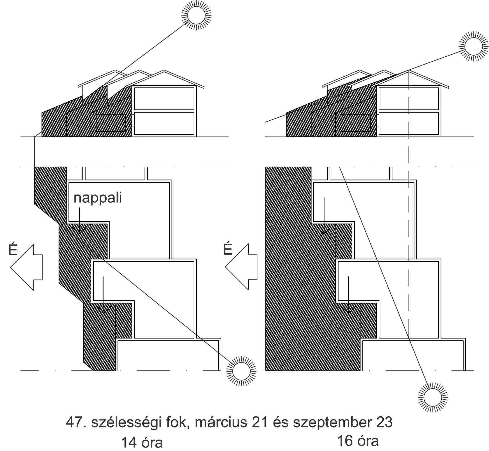

*4.23. ábra – Kétszintes sorház névlegesen jó irányba tájolt nappalija benapozásának vizsgálata (fiktív séma)*

### 4.4.4. Kertkapcsolat

A kerthasználat elsőrendű tervezési szempont, mivel épp ennek érdekében keletkeztek az alacsony, nagy sűrűségű beépítések lakástípusai. Kétszintes sorházaknál nehézséget okoz a viszonylag keskeny telek, és az a tény, hogy az emeleti szobákból a szomszéd kertjébe is közeli átlátás adódik. A *privát kertrészek* zavarásának csökkentését, ill. elkerülését mutatja a [4.24. ábrasor](#abra_4_24). (A rajzok sematikus példák, ezeknél nyilván szélesebb a lehetőségek skálája.)

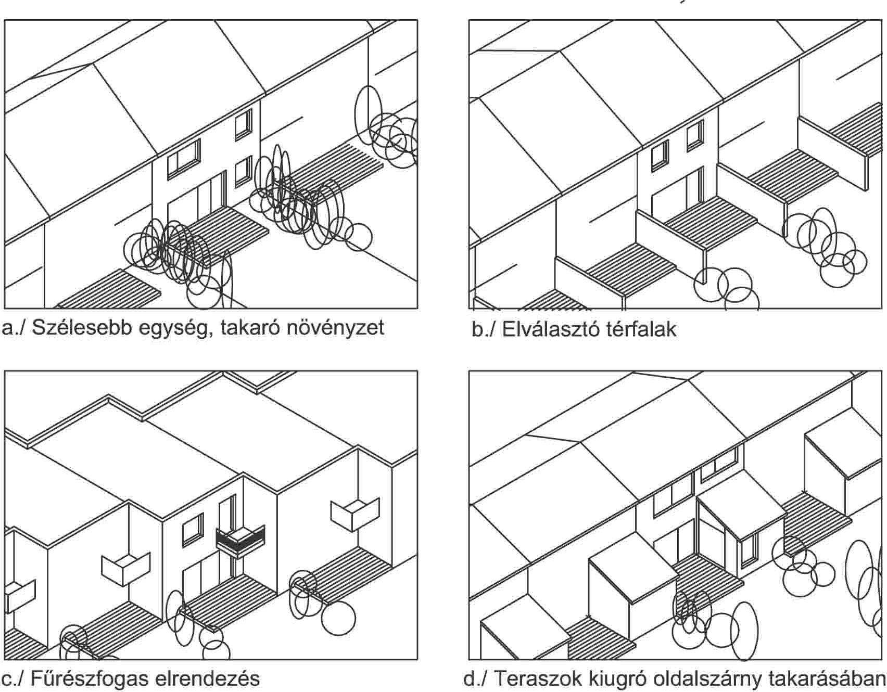

*4.24. ábra – Példák a kerthasználat vizuális zavarásának mérséklésére kétszintes sorházaknál*

A vízszintes értelmű átlátást sűrűn telepített takaró növényzettel akadályozni lehet, ha a sorházegységekhez tartozó kert ehhez eléggé széles ([4.24.a. ábra](#abra_4_24)).

Keskenyebb egységek esetén gyakori, hogy a kerteket térfalakkal határolják el az átlátás elkerülésére ([4.24.b. ábra](#abra_4_24)). Nyáridőben a nappali tartózkodásra elsősorban a *terasz* szolgál, ennek zavartalansága a legfontosabb. Szabdaltabb tömegkontúrral elérhető, hogy a terasz kiessék a szomszéd teraszon ülők közvetlen látómezejéből. Ezt az igényt előnyösen teljesíti a tördelt vagy fűrészfogas elrendezés ([4.24.c. ábra](#abra_4_24)).

Az emeletről a szomszéd kertjébe való lelátást igen nehéz kiküszöbölni, de ez a hátrány jó lakóközösségben általában tolerálható. Kerülni kell viszont azokat a megoldásokat, amelyek az átlátást mintegy kierőltetik (pl. emeleti erkélyek az épület kert felőli oldalán). A felső ablakokból a szomszéd terasz látványa kizárható tördelt kontúrú vagy fűrészfogas telepítéssel, vagy olyan oldalszárny létesítésével, amely mind a földszintről, mind az emeletről adódó átlátást akadályozza ([4.24.d. ábra](#abra_4_24)).

A kertrészek kényelmes megközelíthetőségét sok esetben gátolja a külső és belső tér közötti 1-2 lépcsőfoknyi szintkülönbség vagy a teraszajtó magas küszöbkialakítása. Figyelembe véve, hogy a nyári évszakban a kertrész/terasz és nappali szoba közötti közlekedés intenzív, erősen javasolt, hogy a belső tér és a terasz között legfeljebb 2 cm szintkülönbség legyen. Ez a szintkülönbség biztosítja a minimális vízküszöböt, ugyanakkor az átközlekedés mindenki számára kényelmesebbé válik. (P.A.)

### 4.4.5. Gépkocsitárolás

A telekfelhasználásról és a megközelítésről szóló fejezetekben leírtak szerint a *gépkocsi-elhelyezésre* alapvetően két módszer van: az autók állhatnak koncentrált, közös parkolóban vagy tömbgarázsban, illetőleg a lakóegységekben vagy azok közvetlen közelében lévő privát gépkocsitárolóban. Ez utóbbira mutat sematikus példákat a [4.25. ábrasor](#abra_4_25).

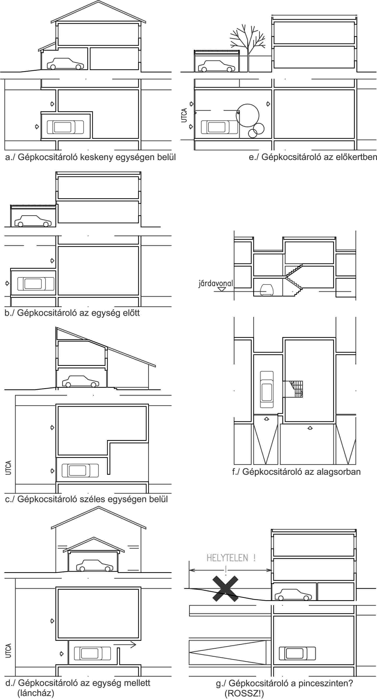

*4.25. ábra – Gépkocsitároló kialakítása kétszintes sorházaknál*

A keskeny, egytraktusos sorházegységbe ékelődő gépkocsitároló szűkösséget okoz a földszinten, és bizonyos, földszintre kívánkozó funkciókat az emeletre kényszerít. Kerülendő megoldás ([4.25.a. ábra](#abra_4_25)).

Közvetlenül a homlokzat elé helyezett gépkocsitároló nem foglal el lakásterületet, de a homlokzati nyílások számát korlátozza, így a garázs mögé huzamos tartózkodásra szolgáló helyiség – pl. konyha – nem tervezhető, ezért a földszint kialakítása nehézkes. Hátrányos megoldás ([4.25.b ábra](#abra_4_25)).

Az épület tömegén belül a földszintre tervezett gépkocsitároló jó elhelyezése nagyobb telekszélességet kíván, és olyan térbeli elrendezést, ahol az emeleti alapterület kisebb a földszintinél. Önálló telken álló sorház-egységeknél előnyös, ha a gépkocsitárolón keresztül a kert fenntartási célú megközelítésére mód van ([4.25.c.](#abra_4_25) és [d. ábra](#abra_4_25)).

Az előkertbe helyezett gépkocsibeálló 2-3 m-rel mélyebb előkertet követel a szokásosnál, így a hátsókertet rövidíti. Az előkert lakófunkcióját, privát használatát teszi lehetővé az udvarkert-jellegű kialakítás ([4.25.e. ábra](#abra_4_25)).

Alagsori (legfeljebb 70 cm-rel a járdaszint alá helyezett) gépkocsitároló csak belső szinteltolással alakítható ki úgy, hogy a nappali ne szakadjon el a kerttől. Ilyenkor alkalmazható az egyes szintek hossztengely irányában történő eltolása ([4.25.f. ábra](#abra_4_25)).

*Pinceszinti* (70 cm-nél mélyebb) *gépkocsitárolót sorházaknál ne tervezzünk*. A rámpa max. 20%-os lejtése – a megkívánt lejtés-átmenetekkel együtt – igen hosszú rámpát eredményezne, amely kiszorítaná a zöldfelületeket a feleslegesen megnövelt előkertből, és annak látványát is tönkretenné a sivár műtárgyak sora.

### 4.4.6. Szerkezetek kialakítása

Az alacsony szintszám miatt a sorházak lehetséges szerkezeti rendszerére is vonatkoztathatjuk a családi házaknál elmondottakat. A szerkezeti rendszer megválasztását befolyásolja az egy építési ütemben épített lakásszám. Technológiai szempontból előnyt jelent, ha a lakásegységek alapszerkezete korlátozott számú típusba sorolható, ami nem zárja ki a belső téralakítás változatosságát. (Kifejezett előnyt jelent, ha a használó kiválaszthatja a számára legmegfelelőbb változatot.)

Sorházaknál leggyakrabban a *teherhordó falszerkezetet* alkalmazzák. Az általánosan alkalmazott előgyártott födémelemek vagy monolit vasbeton lemezek 6,60 - 7,20 m fesztáv tartományig jól használhatók. Ennél nagyobb fesztávokhoz már különleges födémszerkezetek kellenek, azonban ezek más tekintetben is kötöttségeket okoznak (pl. speciális gépészeti elrendezést és emelőgépet igényelnek), ezért alkalmazásuk *általános esetben* nem javasolható.

A *harántfalas elrendezés* keskenyebb egységeknél (kb. 7,20 m fesztávig) azért előnyös, mert az akusztikailag szükséges vastagabb elválasztó fal egyben teherhordó fal is. Szélesebb egységnél már kétmenetes elrendezést (vagy hosszfalas elrendezést) kell alkalmazni.

A *hosszfalas elrendezés* korábban ritka volt sorházaknál. Az elmúlt évtizedek egyre növekvő hőtechnikai követelményei miatt a homlokzatokon a nyílás-fal arány a fal javára növekedett, ami azok teherhordásra való igénybevételére ösztönöz. A „tömbtelkes” beépítéseknél gyakori a viszonylag széles egységek kialakítása (lásd [4.18. ábra](#abra_4_18)). Elvben a hosszfalas rendszer is alkalmazható egy- vagy kétmenetes formában, de az egymenetes, hosszfalas elrendezés a gazdaságos fesztávtartományban (max. 7,20 m) már kritikusan kicsiny épületmélységet eredményez.

Lehetséges a hossz- és harántfalas elrendezés együttes alkalmazása is bizonyos térbeli elrendezéseknél.

*A belső lépcső* kialakítása, helyzete a lakáskompozíció kulcskérdése a kétszintes sorházaknál. A családi házaknál szokásos belső lépcsők itt is alkalmazhatók. (lásd 3.7.2. fejezet, [3.55. – 3.59. ábrák](#abra_3_55)). A lépcsőfajta megválasztása egyéb tervezési szempontokkal függ össze.

A *kétkarú* (egyenes vagy húzott fokú) lépcső *központi* elhelyezése központi helyzetű, előnyösen kihasználható emeleti közlekedőt eredményez. Az ilyen lépcső általában rejtett közlekedőből (étkezőből, nappaliból) indul a túl hosszú előszoba elkerülésére.

A homlokzat közelében elhelyezett, külpontos kétkarú lépcső csak kis épületmélységnél alkalmazható kedvezően ([4.26.a. ábra](#abra_4_26)).

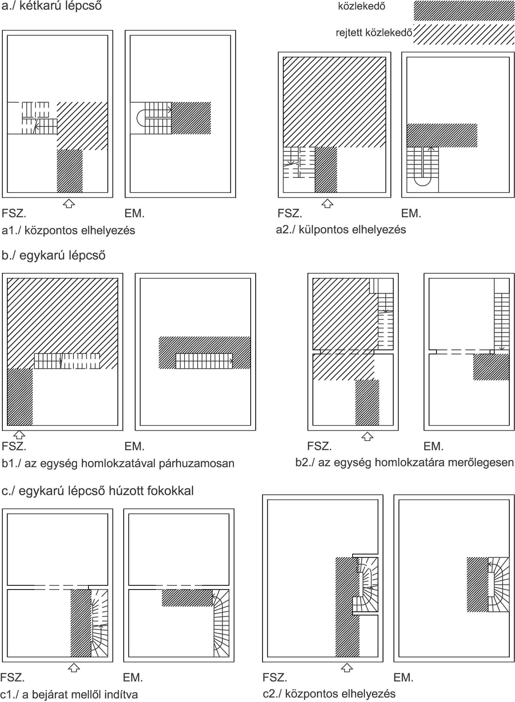

*4.26. ábra – A lépcsőfajták és a lakáskompozíció összefüggésének sémái kétszintes sorházaknál*

*Az egykarú lépcső* elhelyezhető a homlokzattal párhuzamosan. Impozáns belsőépítészeti elem lehet a nappali terében, de viszonylag nagy fesztávot igényel. A felső szinten kialakuló „U” alakú közlekedő eléggé terjengős. Az egység homlokzatára merőleges egykarú lépcső elhelyezése fokozott szerkezeti gondosságot igényel ([4.26.b. ábra](#abra_4_26)).

*A húzott fokokkal ellátott egykarú lépcső* jó szolgálatot tesz olyankor, ha az építtetői igény a hálók szeparáltabb megközelítését kéri. Ilyenkor a lépcső közvetlenül a bejárat mellől indítható, de központi helyen érkezik. Ilyen lépcső központosan is elhelyezhető, de ez hosszú földszinti közlekedőt is jelent. Javít a helyzeten az, ha a lépcső előtti közlekedő nagy nyílással (pl. tolóajtóval) a nappali vagy étkező teréhez kapcsolható ([4.26.c. ábra](#abra_4_26)).

A fent elemzett alapsémákon kívül a lépcső és lakáskompozíció kapcsolata sokkal több elrendezési változatban jöhet létre, mint ahogyan az egységek alaprajzi és térbeli elrendezése is végtelenül változatos lehet. A példák csak annak a tételnek az igazolására szolgálnak, amely szerint a két, egymás feletti szint tervezése már az első vázlatok készítésénél is csak a lépcső elhelyezésével együtt történhet.

### 4.4.7. Épületgépészeti szempontok

A helyiségek térbeli elrendezésénél különös gondot kell fordítani az un. „vizes helyiségek” elrendezésére. A nyomás alatt álló csövek (hideg-melegvíz, fűtési melegvíz) elrendezése általában nem jelent problémát, de a gravitációs úton működő szennyvízvezetékek célszerű elrendezése fontos tervezési szempont az egymás fölé kerülő helyiségek kialakításánál ([4.27.](#abra_4_27) és [4.28. ábra](#abra_4_28)).

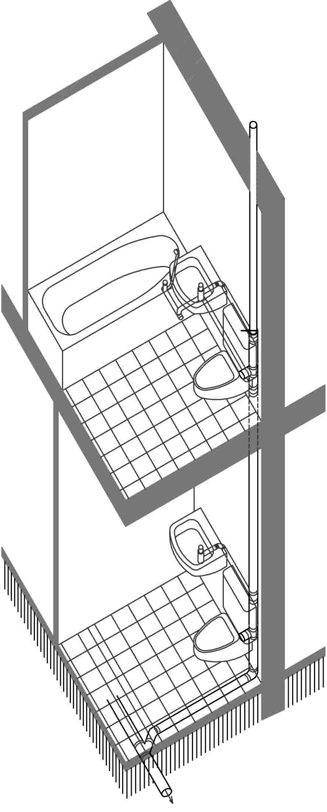

*4.27. ábra – Vizes helyiségek célszerű elrendezése kétszintes lakásoknál*

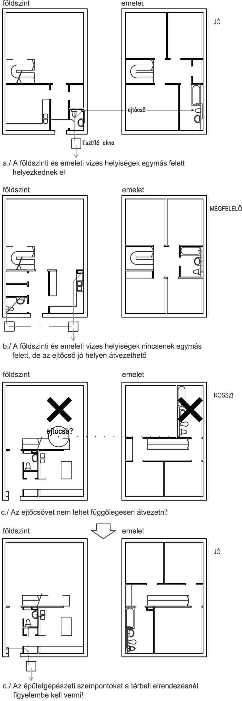

*4.28. ábra – Kétszintes sorházak vizes helyiségeinek elrendezése (fiktív sémák)*

A WC berendezéseket szolgáló, tekintélyes keresztmetszetű szennyvízvezeték vízszintes elhúzásának hossza korlátozott, mivel annak néhány ezrelék lejtést is biztosítani kell, ami a földszint és az emelet közötti födémen belül általában nem lehetséges. A függőleges szennyvízvezeték, az un. „ejtőcső” legyen a WC berendezés közvetlen közelében, esetleg a szennyvízvezeték a födém felett (gépészeti szerelőpanelben) 1-1,5 m-nél nem nagyobb távolságra vízszintesen is vezethető. Kerülni kell az olyan elrendezéseket, amikor WC berendezést is tartalmazó vizes helyiség lakóhelyiség fölé kerül (ezt korábban szabályzat is tiltotta). A lakóhelyiségek fala mentén vezetett ejtőcső csúnya, és zavaró hangforrást is jelent. Kezdő tervezők gyakori hibája az emeleti fürdőszoba olyan helyzete, amikor az ejtőcsövet egy földszinti helyiség közepén kellene átvezetni. Ez megoldhatatlan, hibás tervjavaslat ([4.28.c. ábra](#abra_4_28)).

Gondoskodni kell a fűtőberendezés (cirko) megfelelő elhelyezéséről, annak kémény-csatlakozásáról, valamint az ablakkal nem rendelkező belső fekvésű vizes helyiségek szellőzéséről (függőleges szellőzőcsövek átvezetéséről).

## 4.5. Udvarkertes házak

### 4.5.1. Az udvarkertes ház fogalma, alaptípusai

Az udvarkert legalább három vagy mindegyik oldalán épülethomlokzattal vagy tömör fallal körülvett, belátástól védett lakókert. Udvarkertes házaknak azokat a lakóházakat (házcsoportokat) nevezzük, amelyek lakásai az udvarkerthez közvetlenül kapcsolódnak.

> **Megjegyzés**
>
> A külföldi szakirodalom ezekre az épületekre különféle elnevezéseket alkalmaz. Németül Atriumhaus, Gartenhofhaus, Winkelhaus. Az angol az „átriumház” kifejezést nem használja, a tárgyalt épületeket a Courtyard-House, Court-Garden Home-nak esetenként Patio-House-nak nevezi. Az általánosan elterjedt magyar „átriumház” fogalom inkább a két (vagy három, ill. négy) oldalról körülépített, a többi oldalán tömör fallal elhatárolt udvarkerttel rendelkező háztípusokra vonatkozik. Ebbe a fogalomba nehezen illeszthető bele az olyan földszintes sorház, amelynek csak egy homlokzata néz az udvarkertre. A szakirodalom igen gyakran „átriumházas” beépítésként ismertet olyan elrendezéseket is, amelyeknél az L alakú földszintes épület udvarkertje egyik oldalról nyitott.

Az udvarkert felfogható nagyméretű „szabadtéri lakóhelyiségként” is, nagy értéke a belátástól való védettsége, intim használata ([4.29. ábra](#abra_4_29)).

*4.29. ábra – Az udvarkertek alaptípusai*

Az alábbiakban a fogalomkörbe tartozó, sorolható lakásfajták alaptípusait az udvarkerttel való viszonyuk alapján ismertetjük ([4.30. ábrasor](#abra_4_30)).

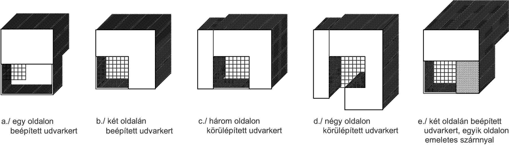

*4.30. ábra – Sorolható udvarkertes lakásegységek gyakoribb sémái*

Az egy oldalon beépített udvarkert épülete földszintes sorház jellegű, annak megfelelően sorolható. Ha viszonylag magas sűrűséggel alkalmazzák a földszintes sorházat, akkor kertjei kisméretűek, vizuális zavarástól való védelmet igényelnek (lásd a korábbi, [4.19. ábrát](#abra_4_19)). Alkalmazása akkor indokolt, ha kisebb vagy közepes méretű (< kb. 100 m2) lakásokat telepítenek udvarkertes formában ([4.30. a. ábra](#abra_4_30)).

A két oldalán beépített udvarkert a leggyakrabban használt épületforma. Ha az udvarkert méretei a megfelelő benapozáshoz kellő méretűek és az épületszárnyak nem végletesen keskenyek, akkor viszonylag nagyobb (> 100 m2) alapterületű lakásokhoz alkalmazható. A szokásos, tömör beépítési formákban ritkán kap előkertet, ilyenkor a szobák vizuális védettségének érdekében azokat az udvarkert felé kell megnyitni. Tájolás szempontjából kedvező, ha a nappali a délre néző, a hálók a keletre néző szárnyon helyezkednek el ([4.30.b. ábra](#abra_4_30)).

A három oldalról körülépített udvarkert harmadik oldalán viszonylag keskeny szárnyat szoktak kialakítani, amelyben a nem közvetlenül lakás célú helyiségek vannak (pl. dolgozó, műhely, tárolók stb. - [4.30.c. ábra](#abra_4_30)).

A négy oldalról körülépített udvarkert nagyméretű lakásokhoz alkalmazható (> 150 m2). Itt nem annyira a telektakarékosság, mintsem az udvarkert más előnyei dominálnak (intim kerthasználat, kedvező mikroklíma). A beépítési sűrűség inkább a családi házaknál alkalmazott értékek felé közelít ([4.30.d. ábra](#abra_4_30)).

A két oldalán körülépített udvarkert, egyik oldalon emeletes szárnnyal, telektakarékos elrendezés. A szintterületi mutató értéke a kétszintes sorházakénál alkalmazott értékeket közelíti vagy azzal egyenlő a kisméretű kert miatt. Itt is csak nagy alapterületű lakások helyezhetők el, ha az udvarkert kellő méretű. A földszint megfelelő benapozása csak akkor biztosítható, ha a kétszintes szárny nem árnyékolja a benapozást igénylő földszinti helyiségeket (legkedvezőbb, ha az északi oldalon van - [4.30.d. ábra](#abra_4_30)).

Előfordul, hogy a lakáshoz nemcsak egy, hanem több udvarkert (vagy nem udvarkert jellegű kertrész is) csatlakozik ([4.31. ábra](#abra_4_31)).

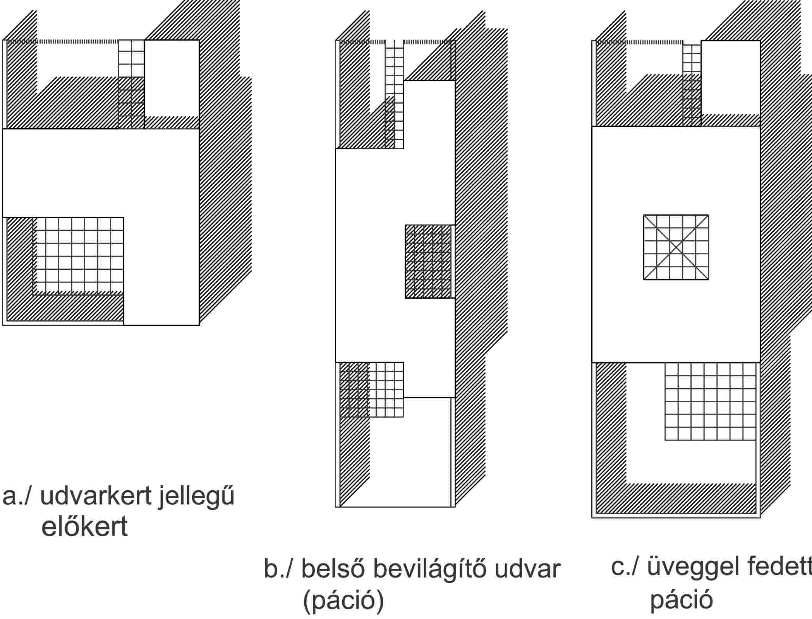

*4.31. ábra – Több udvarkerttel rendelkező sorolható lakásegységek*

Udvarkert jellegű előkert kapcsolódhat a lakáshoz a hátsó udvarkerten kívül. Kissé telekigényesebb megoldás, alkalmazása akkor célszerű, ha az épület közvetlenül csatlakozik a közterülethez. Előnye, hogy lakóhelyiségek az előkert felé is tájolhatók. ([4.31.a. ábra](#abra_4_31)).

Ha a lakássor közvetlenül kapcsolódik a közterülethez, és a rendelkezésre álló telek utcai homlokvonala korlátozott, akkor a minél keskenyebb egységek létesítésének gazdasági érdeke érvényesül. Viszonylag nagy lakás csak úgy helyezhető el földszintes formában, ha az utcára merőleges épületmélység is igen nagy. Ilyenkor egy belső, kisméretű, intim hangulatú páció szolgálhat a lakás egyes helyiségeinek megvilágítására ([4.31.b. ábra](#abra_4_31)).

A naptér udvarkert jellegű kialakítása a szolár energia hasznosításának lehetséges formája. Nyáridőben szellőztetését biztosítani kell. Mivel télen a naptér zárt, ezért az ide néző helyiségek közvetlen szellőzéséről is gondoskodni szükséges ([4.31.c. ábra](#abra_4_31)).

### 4.5.2. Az udvarkertes házak benapozása

Az udvarkertet körítő homlokzatok vagy körítő falak árnyékot vetnek magára az udvarra, és a homlokzatokra is, így kedvezőtlen esetben előfordulhat, hogy a helyiségek névlegesen kedvező tájolása ellenére benapozásuk nem kielégítő.

Benapozás tekintetében az udvarkert alaprajzi méretei és a határoló, árnyékvető síkok magasságai szorosan összefüggenek. Számításba kell venni a tetőformát is, mert magastető esetén gyakori, hogy az árnyékvető sík felső határa nem a homlokzat felső záradéka, hanem a tetőgerinc. Az átriumházas „szőnyegtelepek” létesítésének fénykorában – a hatvanas, hetvenes években – általában lapostetőket alkalmaztak, a manapság épülő udvarkertes együtteseknél gyakori a mérsékelt hajlású magastető és a zöldtető. Magastető alkalmazása esetén az alacsonyabb (20 - 25 fok körüli, vagy annál kisebb) tetőhajlásszög előnyös ([4.32. ábra](#abra_4_32)).

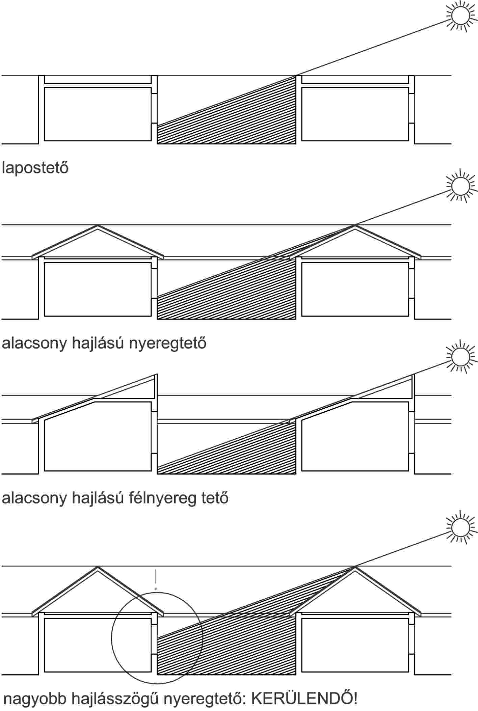

*4.32. ábra – Udvarkertek benapozása különböző tetőformáknál*

A viszonylag kisméretű udvarkertre néző helyiségek benapozottsága „ránézésre” nemigen dönthető el, ezért a benapozás-vizsgálat a tervezés nélkülözhetetlen része, már a tervezés kezdő fázisában.

Adott hónap, adott órájában a napsugárzás iránya pontosan meghatározható, így az udvarkert árnyékviszonyai viszonylag egyszerűen és gyorsan megrajzolhatók egy kritikus időpontra vonatkoztatva. A számítógépet használók jó programokat találnak e témakörben, sőt fejlettebb építész-programoknál a 3D-s megjelenítés árnyékolásához földrajzi szélesség, dátum és óra is rendelhető.

### 4.5.3. Az udvarkertek mikroklímája

Amennyire kívánatos az udvarkertre néző helyiségek benapozása, annyira kedvezőtlen lehet a helyiségeknek és magának az udvarkertnek túlzott felmelegedése a nyári hónapokban. A körítő falak és a vízszintes burkolatok elnyelik és tárolják a napenergiát, és az átszellőzés teljes hiánya, vagy korlátozott volta miatt ott „hőzug” alakulhat ki, és az éjszakai kiegyenlítődés sem érvényesül kellőképpen.

> **Megjegyzés**
>
> Nem véletlen, hogy az udvarkertes házak a mediterrán térségekben és Észak-Afrikában alakultak ki hagyományosan, modern formáik pedig főképp Észak-Európában terjedtek el. A hagyományos déli lakóház udvarkertjének arányai olyanok, hogy a helyiségeket lehetőleg tartsák árnyékban az alaprajzi mérethez viszonyítva magas körítőfalak. Ehhez még századok alatt kipróbált szellőzési rendszerek is tartoztak.

> **Megjegyzés**
>
> Skandináviában a hideg tavaszi-őszi hónapokban is lehet használni a szélvédett, „napcsapdaként” működő udvarkertet, amely a zord téli hóviharok ellen is véd. Az ottani rövid nyár alatt ritkaság, hogy a hőség ellen kelljen védekezni.

Az udvarkert szellőzésének szempontjából jobb, ha azt nem négy oldalról veszik körül tömör falak, illetve ha az egyik térelhatároló fal részben-egészben a belátást gátló, de szellőzést biztosító, áttört formában van kialakítva.

A helyiségek tömör vízszintes síkokkal (nagy kiülésű ereszekkel) történő leárnyékolása itt azért nem előnyös, mert azok is az udvar kiszellőzését gátolják: jobbak az áttört, vagy mozgatható árnyékoló szerkezetek.

Az udvar mikroklímáját kedvezően befolyásolhatja a burkolt és növénnyel fedett felületek arányának jó megválasztása, a hőt kevéssé elnyelő burkolat alkalmazása, nagy aktív levél-felülettel rendelkező, a falakat is árnyékoló növényzet, egy-egy árnyékoló fa beültetése, esetleg kisebb vízfelület létesítése. A szellőzést elősegíti, ha a kertre néző szoba (főleg a nappali szoba) intenzíven átszellőztethető a külső, árnyékos oldal felé.

Az udvarkertes beépítések („szőnyegtelepek”) belső részeinek feltárásánál azért is kerülni kell a gépkocsiforgalom jelenlétét, mert a keletkező füstgázok a korlátozott szellőzésű belső udvarokban megülhetnek.

A zárt udvarkert felfogható úgy is, mint egy „fedetlen naptér”. Ahogyan a jól működő naptér tervezéséhez hozzáértő szakember közreműködése szükséges, ugyanúgy ajánlatos szakavatott kerttervező bevonása egy megfelelő mikroklímájú udvarkert tervezésébe.

### 4.5.4. Az udvarkertes egységek sorolása

Mind az alapegységek kialakítása, mind azok összeépítése igen nagy változatosságot mutat a megépült példák körében. Minden feladat eseti kihívás: a tervező probléma-érzékenységétől, fantáziájától és kreativitásától függ a konkrét megoldás milyensége. Az itt közölt néhány alapséma elemzése csak a fontosabb tervezési szempontok illusztrálására szolgál.

*Az udvarkertes földszintes sorházak* sorolhatók egysávos vagy kétsávos formában. *Kétsávos* formának eredetileg azt az elrendezést nevezik, ahol a feltáró út mindkét oldalát épületek szegélyezik és az út két épületsáv megközelítésére szolgál. Ebből adódóan az út két oldalán lévő lakások bejárata az egymással szemközti homlokzaton van, a kertre néző lakóhelyiségek tájolása egymással ellentétes. Ez az elrendezés kielégítő benapozást csak akkor biztosít, ha a sorolás É-D-i irányú, az egyik sor udvari szobáinak ablakai keleti, a másiké nyugati tájolásúak ([4.33.a. ábra](#abra_4_33)). Az *egysávos* elrendezés megduplázza a feltáró utak számát: előnyösen csak gyalogos megközelítésnél alkalmazható ([4.33.b. ábra](#abra_4_33)).

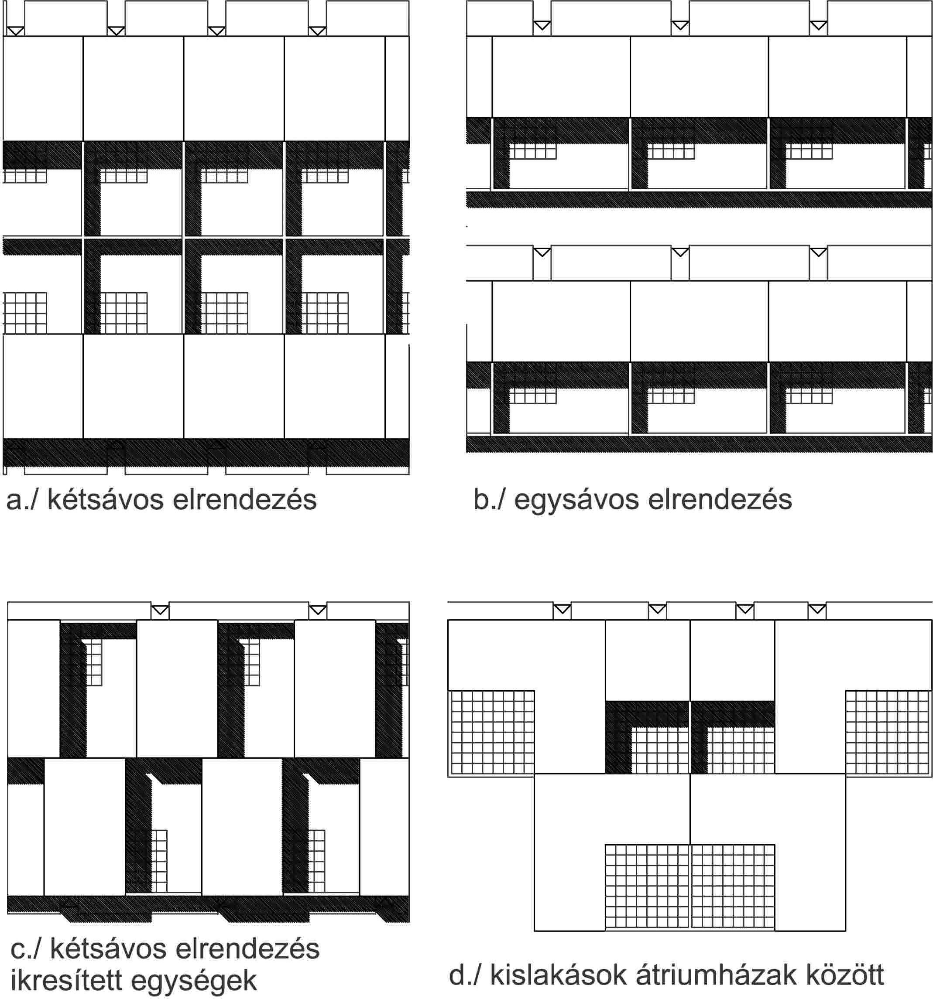

*4.33. ábra – Udvarkertes földszintes sorházak sorolása*

A tájolási anomáliák jó feloldása az egységek olyan elrendezése – nem sorház-szerű összeépítése – amelyet a [4.33.c. ábra](#abra_4_33) mutat. Az egységek helyiségei azonos irányba tájolhatók, az udvarkert jól kiszellőztethető, ha az út felől átlátást gátló, de részben-egészben áttört térelhatároló falat építenek.

Kislakásokat tartalmazó földszintes sorházakat átriumházak közé is soroltak a „szőnyegtelepek” sokrétűbb lakásösszetételének érdekében. Az átriumházak ugyanis viszonylag nagy alapterületű lakások, területi koncentrálásukkal egysíkú lakásösszetétel keletkezik, bizonyos használói rétegek (pl. öregek, önálló életet kezdő fiatalok, egyedül élők stb.) kiszorulnak onnan. A különböző nagyságú lakások keverése a lakóközösség árnyaltabb szociális összetételének kialakulását segíti elő ([4.33.d. ábra](#abra_4_33)).

*Az átriumházak kétsávos sorolása* legtöbbször azt eredményezi, hogy az udvarkertek kerülnek közvetlenül egymás mellé ([4.34.a. ábra](#abra_4_34)). Az elválasztó fal vizuális védelemre jó, de akusztikai védelem szempontjából csökkent értékű. A helyzeten javít, ha a két udvarkert közé még egy keskeny épületsáv kerül, ami pl. tárolókat tartalmazhat. Ez az elrendezés is csak É-D irányú sorolásnál ad megfelelő benapozottságot, de a tájoláshoz illő helyiség-elrendezés két, eltérő alaprajzot eredményez. Kétsávos elrendezés azonos tájolású lakástípusokkal kikényszerítheti az átriumból nyíló lakásbejáratot. ([4.34.a2. ábra](#abra_4_34))

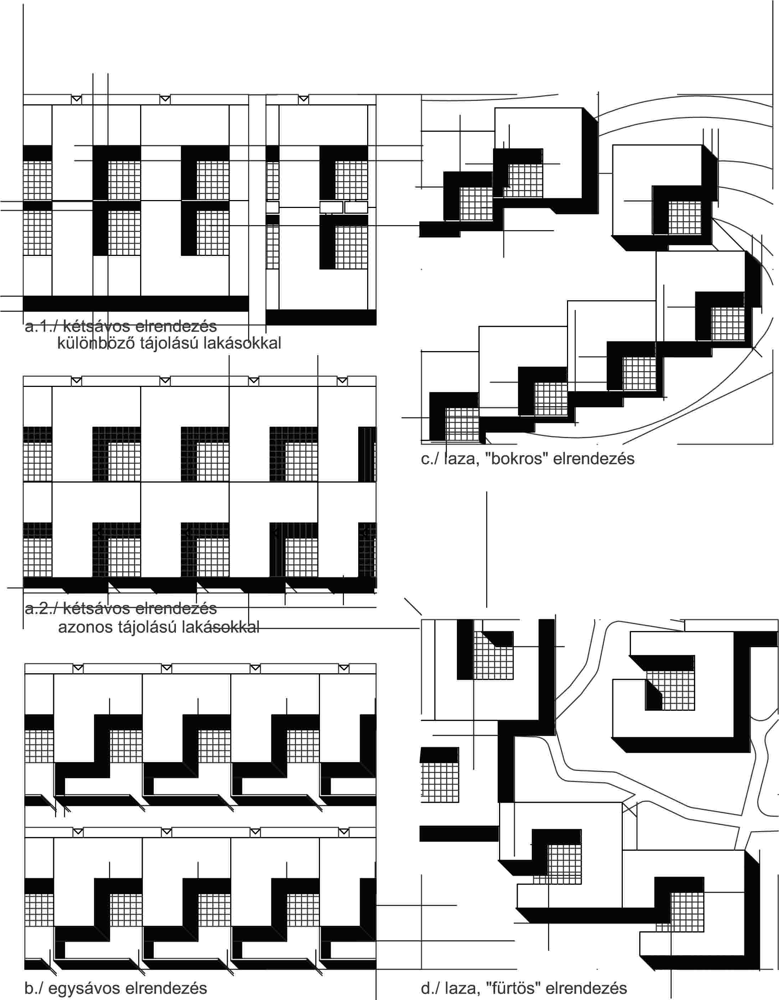

*4.34. ábra – átriumházak sorolása (példák)*

Az *egysávos* sorolás esetén valamennyi lakásegység tájolási, megközelítési adottságai azonosak. Az udvarkert lehet „fél-átrium”, azt még további kertrész egészítheti ki. Az udvarkertek kiszellőzése szempontjából az egysávos elrendezés kedvező. A feltáró utak nagyobb része itt sem közút ([4.34.b. ábra](#abra_4_34)).

A laza, nem lineáris sorolás az együttesek festői és változatos belső (nyilvános használatú) tereit eredményezheti, és az épületcsoportnak a természeti környezethez harmonikusabban illeszkedő, organikus karaktert kölcsönöz ([4.34.c.](#abra_4_34) és [d. ábra](#abra_4_34)). A szigorú, geometrikus szerkesztéstől való eltérés némileg területigényesebb, ezért az ilyen együttesek szintterületi mutatója nem nagy, a családi házaknál szokásos értékeket közelíti. A koncentrált épület-elhelyezés elsőrendű motivációja sokszor nem is a telektakarékosság, hanem az, hogy a zöldkörnyezet minél nagyobb részét a maga természetes formájában lehessen megőrizni. A terület-előkészítés költségeit a koncentrált közműhálózat így is csökkenti.

Legtöbb tehetős, városi ember szeretne zöldkörnyezetben, kertes házban lakni, de hajszolt életmódja miatt a családi ház nagy kertjének rendben tartására nem jut idejéből. A kisebb, lakást kiegészítő udvarkert épp annyi elfoglaltságot ad, ami rövidre szabott szabadidő-tevékenységnek elég, a terület közös részei szervezett bérmunkával egyszerűbben és olcsóbban fenntarthatók, mint telkenként.

### 4.5.5. Gépkocsitárolás

Az udvarkertes beépítéseknél jellemzőbb – és ajánlottabb – a gépkocsitárolás tömbösített formában történő megoldása, mint a lakásegységekhez kapcsolt garázsok építése. Ennek oka, hogy a viszonylag széles homlokvonallal rendelkező, a négyzethez közeli arányú egységek közút menti sorolása gazdaságtalan út- és közműhálózat kialakítását eredményezné. Az udvarkertes egységeket feltáró utak legtöbbször keskenyebb szerviz utak vagy gyalogutak, esetenként kényszerű sebességkorlátozással kialakított vegyesforgalmú utak (ld. 4.4.4. fejezet). Mégis, ahol az udvarkertes együttesek lakásai a nagyobb, közös telket egy vagy több oldalon határoló közút mentén állnak, ott kézenfekvő az egységhez csatlakozó gépkocsitárolót kialakítani.

> **Megjegyzés**
>
> A kényelmes és akadálymentes használat szempontjából előnyösebb a fedett gépkocsi beálló kialakítása. Amellett, hogy a gépkocsiba történő ki- és beszállás, illetve pakolás az időjárási körülményektől függetlenül kényelmesen történhet (esőben, hóesésben nem ázik el a használó, nyáron csökken a gépjármű utasterének túlmelegedése), a gépjármű védett helyen áll, így a hó, falevelek gépjárműről történő letakarításának igénye is lecsökken. (P.A.)

A gépkocsitároló vagy fedett gépkocsibeálló állhat közvetlenül az egység előtt, egy második udvarkertet határolva ([4.35.a.](#abra_4_35) és [c. ábra](#abra_4_35)).

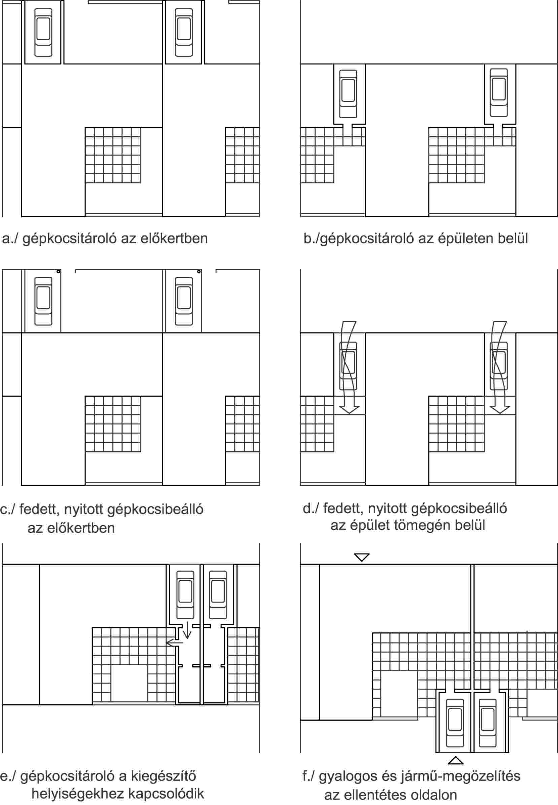

*4.35. ábra – Példák gépkocsitároló elhelyezésére udvarkertes házaknál*

A gépkocsitároló elhelyezhető magában az egységben: ez szélesíti az egység homlokvonalát, de tágítja az udvarkert méreteit ([4.35.b. ábra](#abra_4_35)).

A kapualjszerűen kialakított gépkocsibeálló elősegítheti az átrium kiszellőzését, de csak akkor alkalmazható, ha a kapcsolódó közút forgalma kicsiny, egyébként a füstgázok az udvarba kerülve ott megülhetnek ([4.35.d. ábra](#abra_4_35)).

Előfordulnak olyan esetek, amikor az udvarkertes egység kettős feltárású: gyalogos és járműforgalmi megközelítése az átellenes oldalon van. Ilyenkor a garázsok értelemszerűen a közút felőli oldalon vannak ([4.35.f. ábra](#abra_4_35)).

### 4.5.6. Udvarkertes együttesek kialakítása

Az átriumházakból formált lakóegyüttesek tervezésénél igen fontosak az ökológiai szempontok. A túl sűrűn beépített „szőnyegtelepek” aktív zöldfelületei nem elegendőek, ha csak az udvarkertek növényzete képezi azokat. Az udvarkert területe sokszor a beépített területnek mindössze harmada, negyede, aminek egy jó része még burkolt is. Ezért itt nagy szerep jut a közösen használt zöldfelületeknek. A zárt külső homlokzatú átriumházak közötti keskeny, sokszor sikátorszerű utakat érdemes sűrűn megszakítani kertészetileg is szépen formált teresedésekkel, amelyek a lakóközösség kommunikációs fórumai, gyermekek játszó helyei lehetnek.

Külföldön, a hatvanas években épített, nagy kiterjedésű, gyakran monoton szőnyegtelepeihez hasonlókat manapság nemigen létesítenek. A kisebb léptékű együttesek változatosak, sajátos, egyéni karaktert hordozhatnak külön-külön is. Ennél a beépítési formánál nem az egyes épület, hanem az együttes egésze hordozza az építészeti értéket.

(A [4.36. ábrasoron](#abra_4_36) bemutatott példák értelemszerűen sematikusak, építészeti vonatkozásban nem kell azokat sem értékelni, sem közvetlenül átvenni.)

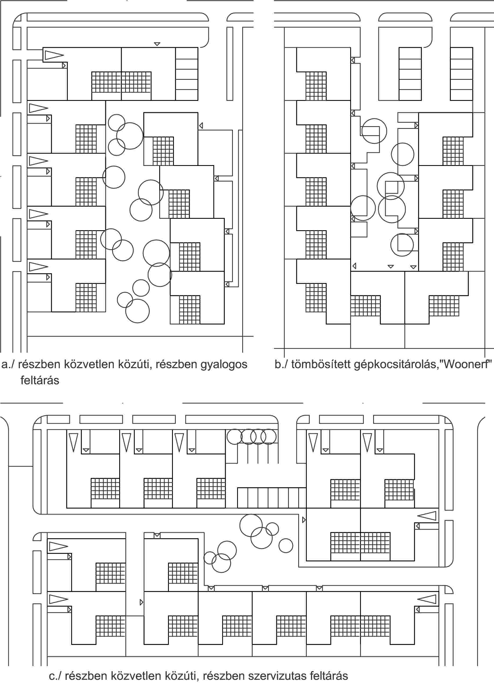

*4.36. ábra – Példák kisebb udvarkertes lakóegyüttesek elrendezésére (fiktív sémák)*

## 4.6. Az alacsony, nagy sűrűségű beépítés fenntartható és energiatudatos tervezése

A 3.7.3. fejezetben taglalt módszerek többnyire ezeknél az épülettípusoknál is jól alkalmazhatóak.

> **Megjegyzés**
>
> Az energiaveszteségek minimalizálását segítő tervezés gazdaságosan megoldható, és további előnyt jelent az, hogy a szél hűtő hatását jelentősen csökkenti a zártabb beépítés.
>
> A napsugárzás befogadását biztosító megoldások az ilyen épületegyüttes telepítése során is rendelkezésre állnak. A kedvező tájolású szabad homlokzat ablak vagy naptér számára felhasználható, és a tetőfelületek is hasonlóképpen kijelölhetők a napenergia-hasznosító berendezések számára.
>
> A csoportos beépítés során az áramtermelés (a napsugárzás és a szél energiájának felhasználásával) költséghatékonyan oldható meg, ha biztosítjuk a megfelelő tájolású felületet, vagy a közösségi szélkereket. Kevésbé alkalmas azonban a beépítés biomassza fűtésre (beszállítás, tárolás, égéstermék elvezetése). A sűrű beépítés nem teszi lehetővé a talajhő felhasználását sem az egységenként telepített hőszivattyúk számára, mert a közel eső telkek egymás hatásfokát rontanák. A hőszivattyús megoldás csak közösségi hőenergia termelésre lenne alkalmazható, például helyi közösségi fűtés esetén, azonban ennek nálunk nem alakult ki még a mérési gyakorlata és a kultúrája sem. (N.Á.)

Az energiatudatosság már a beépítési forma megválasztásánál is érvényesülhet. Például, a [4.18. ábrán](#abra_4_18) bemutatott sémák közül az a./ változatnál a homlokzatfelületek alapterülethez viszonyított aránya kedvező, ami kisebb hőveszteséget eredményez. Ugyanakkor déli homlokzata csak a szélső egységnek van: ez a napsugárzás energetikai hasznosítása szempontjából hátrányos. A b./ változatnál az egysávos feltárással kialakított szélesebb, de nem nagy mélységű lakásegységek egyik homlokzata délre tájolható, ami a szolár energia direkt hasznosítására ad lehetőséget. A nagyobb homlokzati felületek nagyobb hőveszteségét fokozott hőszigeteléssel, az északi homlokzat zártságával lehet ellensúlyozni.

A lakásegységek az itt tárgyalt épületfajtáknál is rendelkezhetnek napterekkel. A belső páció naptérként is szolgálhat, ha azt üveggel fedik és az épület energiamérlegének javítására alkalmas formában alakítják ki ([4.37.a. ábra](#abra_4_37)).

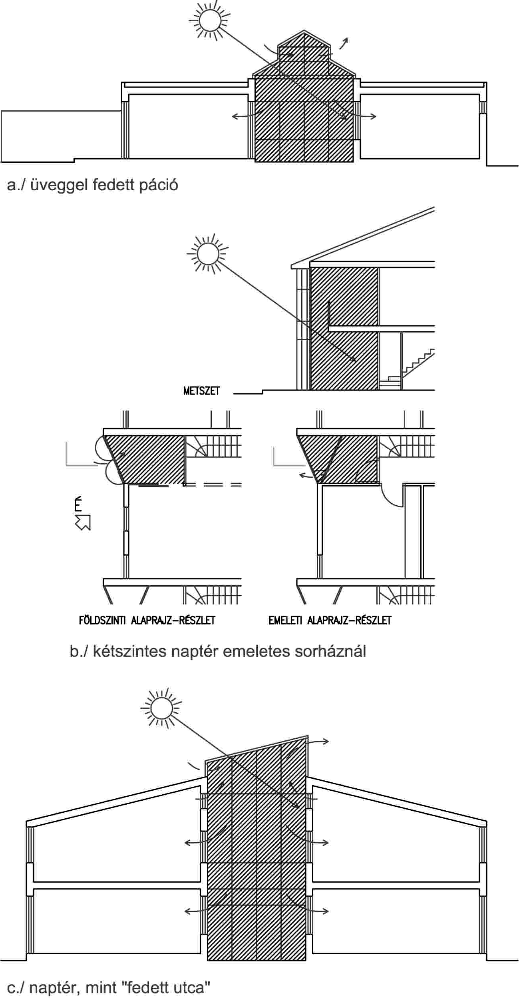

*4.37. ábra – Példák naptér kialakítására az alacsony, nagy sűrűségű beépítések épületeinél*

Kétszintes sorházaknál újabban gyakran láthatók kétszintes napterek ([4.37.b. ábra](#abra_4_37)).

Új építészeti eszközt jelent a lakásegységek megközelítését szolgáló, naptérként is funkcionáló, üveggel fedett tér. Ez a lakóközösség kommunikációs fóruma is egyben ([4.37.c. ábra](#abra_4_37)). Valószínű, hogy az elkövetkező időszakban a fokozottan energiatudatos tervezői megközelítés teljesen újszerű formákat is kifejleszt az alacsony, nagy sűrűségű beépítések körében.

# 5. Többszintes, többlakásos lakóépületek

## 5.1. A fejezet témaköre

A fejezet címében a „többszintes” jelző azt jelenti, hogy az itt tárgyalt épületek legalább egyemeletesek, de szintszámuk felső határa korlátlan. Azért kell ezt leszögezni, mert a „többszintes” jelző az épületek magassági kategóriákba való sorolásához is használatos volt korábbi szabályzatokban, amelyek megkülönböztettek „többszintes, középmagas és magas” lakóépületeket a legfelső padlóvonal magasságától függően.

A fogalomkör itt is átfedésbe kerül más lakóház-kategóriákkal: a közös telken álló kétszintes sorházak (sortársasházak) többlakásosak és többszintesek, de azokat az előző fejezetben már tárgyaltuk. E kérdéskörbe azok a többlakásos épületek tartoznak, amelyek lakásai közös közlekedőből – lépcsőházból, folyosóról – közelíthetők meg. Kivétel itt is van, mert a teraszházakat is ez a fejezet tárgyalja, bár azok egyes típusainak lakásait közvetlenül a terepről, de más típusokét szintén zárt lépcsőtérből vagy folyosóról lehet elérni.

Az épülettípusok a családi házakénál nagyságrenddel magasabb laksűrűség elérésére alkalmasak, de a többszintes lakóházakkal történő beépítések szintterületi mutatója széles skálán mozog. A beépítés intenzitásának mértékéhez különféle nagyságú és szintszámú épületek tartoznak a 2-3 szintes, 2 -12 lakásos városi villáktól az akár tíz-tizenöt szintnél is magasabb, nagyvárosi környezetben létesült lakóépületekig.

> **Megjegyzés**
>
> A „többlakásos városi villa” terminust azokra az épületekre vonatkoztatva vezettük be, amelyeket a köznyelv korábban „társasházaknak” nevezett: a zöldkörnyezetben álló 2-4 szintes, viszonylag kevés lakást tartalmazó, szabadon álló épületekre. A „társasház” – mint tulajdoni jelleg – ma már nem kötődik épületvolumenhez: igen sok lakást tartalmazó, középmagas lakóépületek is lehetnek társasházak.
>
> A nemzetközi szakirodalomban is nemrég lett általánosan elfogadott az „urban villa” (angol) vagy a „Stadtvilla” (német) kifejezés az ilyen épületek jelölésére.

A kisebb alapterületű lakások főképp többszintes, többlakásos épületekben helyezhetők el gazdaságosan, ezért a tárgyalt házfajták a lakásigények széles skáláját elégítik ki az egyszobás, kisméretű garzonoktól a luxus apartmanokig. A használók társadalmi helyzete ennek megfelelően sokrétű: a szociális bérlakások alacsony jövedelmű lakói és a zöldövezetekben épülő lakóparkok tehetős lakástulajdonosai egyaránt többszintes, többlakásos lakóépületben laknak.

## 5.2. Történeti áttekintés

> **Megjegyzés**
>
> A többlakásos bérházak elterjedése a XIX. század második felétől kezdődik Európa-szerte az ipari forradalom hatására. A nagyvárosok nagy ütemben szaporodó gyárai a munkavállalók tömegét vonzották, és egyes városok lakóinak száma nagyságrendet váltott néhány évtized alatt. A bérházak építése garantált hozamú tőkebefektetést jelentett.
>
> Hazánkban ez a folyamat az 1867-es kiegyezést követően indult el, és a századforduló körül kulminált. Az egységesítés után a korábbi három város – Pest, Buda és Óbuda – néhány évtized alatt metropolisszá növekedett. Budapest mai építészeti arculatát az akkoriban épült házaktól nyerte. A nagytömegű bérlakásépítés részben új telekosztásokon folyt, vagy már meglévő településszövetben a régi, lebontott épületek helyén. A Józsefváros külső részén vagy a Ferencvárosban még láthatók ennek a folyamatnak egyes stációi, ottfelejtett (és hamarosan bontásra kerülő) régi házak formájában. A korábbi földszintes vagy egyemeletes, két vagy négy oldalról körülépített udvarú épületek között magas bérházak jelentek meg és váltak fokozatosan uralkodóvá ([5.1. ábra](#abra_5_01)). A nyomasztó lakáshiány miatt a lakbérek magasak voltak, de a potenciális bérlők nagyobb részének jövedelme alacsony volt: ez a kislakások építésére ösztönzött. A szaporodó nagyvárosi polgárság tehetősebb rétegei (kereskedők, magasabb rangú tisztviselők) nagyobb, jobb minőségű lakást kerestek. A lakáspiacnak ezt a polarizációját tükrözi a századfordulón épült pesti bérház. A telket négy oldalról teljesen körülépítették, ami által szűk belső udvar alakult ki, ahová a nyitott körfolyosókról nyíló egyszoba-konyhás lakások néztek. Az akkor még viszonylag csendes, és a belső udvarnál jóval tágasabb utca felé a nagyobb, jobb minőségű lakások nyíltak ([5.2. ábra](#abra_5_02)). A zárt sorban összeépített házakból kialakult a sajátos, zárt udvaros beépítés. Az utcai lakások saját fürdőszobával rendelkeztek, de a kislakások komfort nélküliek, lakói a folyosó végén lévő közös WC csoportot használták. A szoba-konyhás lakások igen zsúfoltak: nemegyszer 6-8 tagú család lakott bennük. Egyre magasabb „bérpaloták” épültek, és a belső udvarok légtérarányai egyre rosszabbak lettek, az alsó szintek benapozást soha, megvilágítást is csak korlátozottan kaptak. Hasonlóan zsúfolt beépítéssel épültek bérházak Európa és Észak-Amerika nagyvárosaiban is, jóllehet az épületek tipológiája országonként eltérő volt.
>
> 
>
> 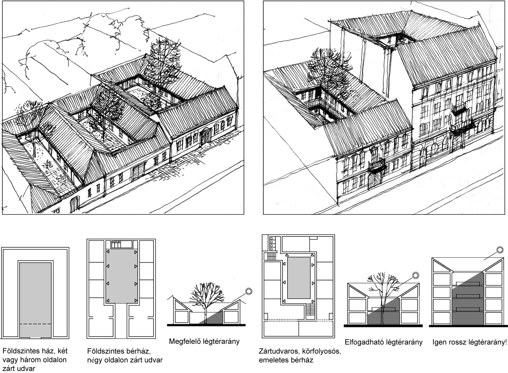
>
> *5.1. ábra – A pesti bérház kialakulása a XIX. században*
>
> 
>
> 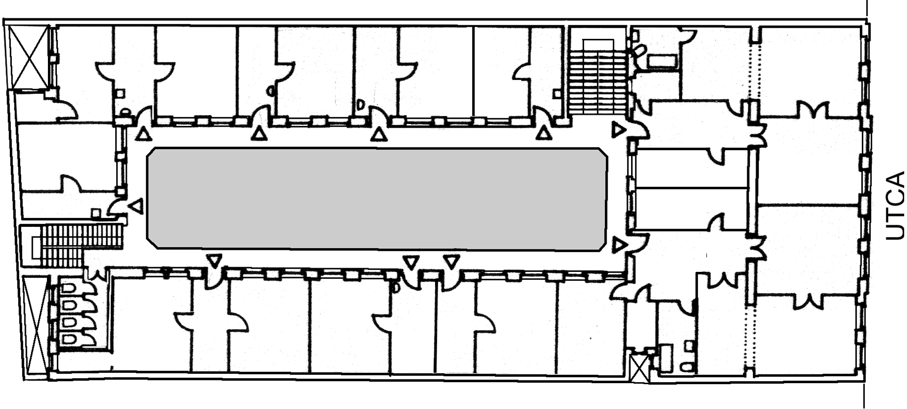
>
> *5.2. ábra – Tipikus erzsébetvárosi bérház alaprajza a XIX-XX. sz. fordulóján*

> **Megjegyzés**
>
> *Az első világháború után* új korszak kezdődött a nyugat-európai lakásépítés szemléletében, amelynek szellemi központja Németország volt. A vesztett háború után katasztrofális gazdasági helyzetbe került és súlyos inflációval is sújtott ország népessége nem tudott fizetőképes bérlőként megjelenni a szabad lakáspiacon, a munkásrétegek lakáshelyzete kilátástalan volt. A szociáldemokrata kormány kezdeményezésére a városi önkormányzatok külföldi kölcsönök felhasználásával lakásberuházásokat kezdtek. Lakótelepek épültek – addig példátlan léptékben – a kisjövedelműek számára: kétmillió bérlakás-egység épült egy évtized alatt. A lakáspiac hatásának kiiktatása a lakástervezés újszerű, pragmatikus megközelítését eredményezte: a Neue Sachlickeit (új tárgyiasság) az építési költségek csökkentése érdekében az épületek egyszerűségére, az épületelemek előregyárthatóságára törekedett. Az önkormányzat által alacsonyan megszabott, kötött lakbérek miatt a lakástípusok kialakítása immár nem a legnagyobb lakáspiaci haszon elérése érdekében történt: elméleti úton kellett eldönteni, hogy azok mennyiben feleltek meg rendeltetésüknek, funkciójuknak. A támogatott bérlakások igazságos elosztása érdekében normatív szemlélet érvényesült, kialakult a lakások férőhelyszámának fogalma és a lakások férőhelyszám szerinti méretezése, kategorizálása. Elméleti kutatások folytak arra nézve, hogy a rendeltetési célnak legjobban megfelelő helyiségméretekkel és helyiségkapcsolatokkal miként lehet kis alapterületű, mégis jól használható lakásokat létrehozni ([5.3. ábra](#abra_5_03)). „A forma követi a funkciót” jelszó egyben építészeti, művészeti mozgalommá is vált (funkcionalizmus). A modern avantgárd szellemi központja a Weimarban alapított „Bauhaus” művészeti iskola és alkotóműhely, szellemi vezetője pedig Walter Gropius volt.
>
> 
>
> 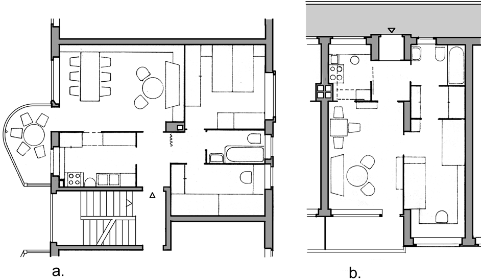
>
> *5.3. ábra – Lakásalaprajzok a ‘Minimalwohnung’ kutatásának jegyében 1930. Kétfogatú elrendezés (a.): H. Härig; Függőfolyosós elrendezés (b.): W.Gropius*

> **Megjegyzés**
>
> A korszak jeles építészei (köztük Walter Gropius) tervezték a berlini „Siemensstadt” lakótelepet ([5.4. ábra](#abra_5_04)), amely szinte a korabeli funkcionalista lakástervezési elvek manifesztuma volt (1929). A szigorúan É-D-i tengellyel, egymással párhuzamosan elrendezett sávházak mindkét homlokzatát napfény érte, és a lakások jól átszellőztethetők voltak. A kétszobás lakások függőfolyosós, a nagyobbak fogatolt rendszerű épületben kaptak helyet. Olyan távolságba helyezték el az épületeket, hogy legalsó szintjük is jól benapozott legyen. Az egészséges lakás, a benapozás ekkoriban kiemelt jelentőséget kapott, minthogy a munkásrétegek körében pusztító tuberkulózis egyik okát – joggal – az egészségtelen lakáskörülményeknek tulajdonították. Gropius vizsgálatokat végzett arra vonatkozóan, hogy az azonosan jó benapozás érdekében mekkora távolság szükséges a párhuzamos sávházak között, különböző épületmagasságok esetén ([5.5. ábra](#abra_5_05)). Az elvek tiszta érvényesítésének ára a hagyományos városszövet téri, formai sokszínűségének feláldozása, és a monotónia elfogadása volt. A hagyományostól merőben különböző épület-környezet viszony urbanisztikai eredménye a funkcionalista lakótelep, a „Siedlung”.
>
> 
>
> 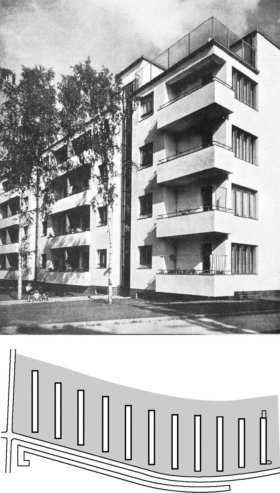
>
> *5.4. ábra – Berlin-Siemensstadt lakótelep beépítési sémája. Walter Gropius 1929.*
>
> 
>
> 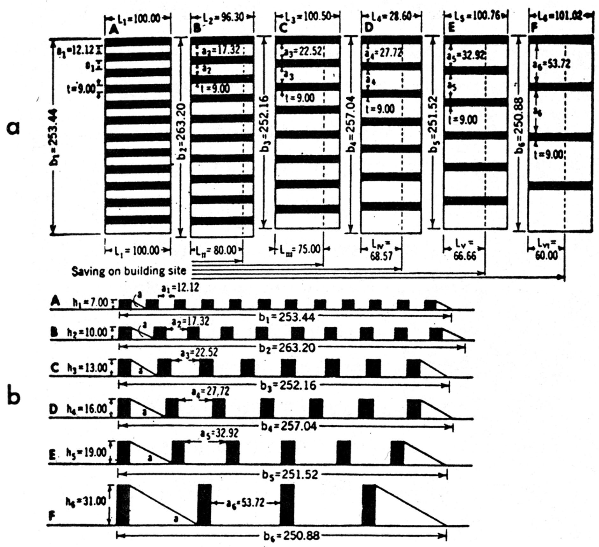
>
> *5.5. ábra – Walter Gropius sémái az épületmagasságok, benapozás és a telekszükséglet összehasonlítására 1928-1931*

> **Megjegyzés**
>
> Bécsben az un. „szuperblokk” alakult ki, amikor négy utca által határolt területen egységes, osztatlan „tömbtelek” létesült, amelyen egy vagy több, nagyméretű, átjárható udvart keretes formában építettek körül. Ennek további fejlődése a jobb szellőzést biztosító megszakított keretes, majd a rosszabb pozícióban lévő saroklakásokat kiiktató felnyitott keretes elrendezés ([5.7. ábra](#abra_5_07)).
>
> 
>
> 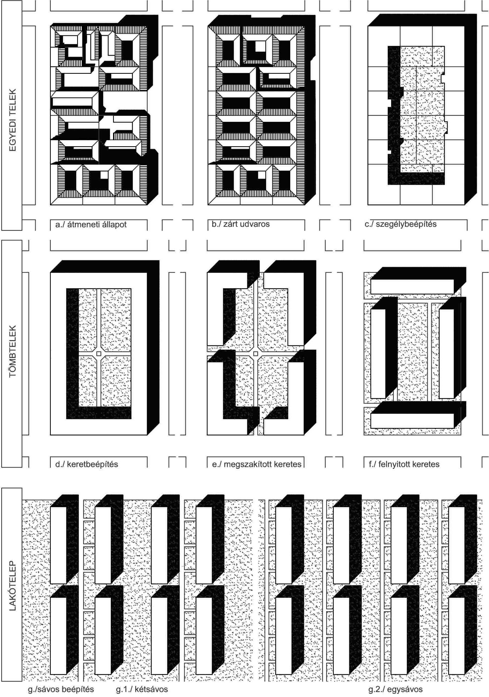
>
> *5.7. ábra – A többlakásos házak beépítési módjának fejlődése a XX. sz. első felében*

> **Megjegyzés**
>
> Az új, modern építészeti elvek világszerte terjedtek. 1928-ban alakult meg a modern építészek nemzetközi szervezete a CIAM (Congres Internationaux d´Architecture Modern). Hamarosan magyar tagozata is lett, vezetője Molnár Farkas, Gropius korábbi munkatársa volt. Nálunk – megfelelő gazdasági háttér és politikai szándék hiányában – nem épülnek a németországihoz hasonló ütemben lakótelepek a két háború közötti korszakban. Említésre méltó a Pongrácz úti 818 kislakást tartalmazó telep (1939-41) amelyet sávos beépítéssel alakítottak ki. A magyar modern mozgalom kisebb léptékben is építészetileg magas színvonalú épületeket és együtteseket hozott létre.

> **Megjegyzés**
>
> Az egészségesebb lakáskörülményeket célzó nyugat-európai törekvések nálunk is éreztették hatásukat. Noha az építésügyi szabályzat 1940-ig kifejezetten nem tiltotta a zárt udvaros házak építését, adókedvezményekkel inspirálták – sikeresen – az olyan beépítést, amelynél csak a telek utca felőli 13-15 m-es sávjában volt szabad épületet elhelyezni. ([5.7. ábra](#abra_5_07)). Ezzel a telkek mélyén csatlakozó kertek – bár kerítésekkel elhatárolták őket – vizuálisan összefüggő, belső zöldfelületet képeztek, amely így a hátsó frontra néző szobáknak is megfelelő bevilágítást, benapozást nyújtott. A harmincas évektől az ilyen, csatlakozó kertes szegélybeépítés lett általános a többlakásos házak számára újonnan alakított telkeken. A korábbi, körfolyosós elrendezést a fogatolt váltotta fel, ahol a telek szélességét kitöltő két-három lakás közvetlenül a lépcsőházból közelíthető meg. A lehetséges 13-15 m-es épületmélységet – természetesen – az építtetők kihasználták, de ez már három menetes elrendezést eredményezett, és a lakás közepén egy rosszul bevilágított sávot, ahova – jobb híján – egy közvetett megvilágítású ablaktalan helyiség került, amelynek a köznyelv a „hall” elnevezést adta ([5.6. ábra](#abra_5_06)). Ez a „hallos” lakás nem követte a funkcionalista elvek alapján szervezett lakások racionális elrendezését, szobaszámához képest túl nagy alapterületű volt, és ennek megfelelően magas lakbérű. Az első világháborút követően terjedt el nagyobb mértékben az „öröklakás”, ahol a használó nem bérli, hanem birtokolja lakását, és az épület társasház lesz. Ez a tulajdonforma homogén lakásminőséget kívánt és azt találta meg a fogatolt elrendezésű épületekben.
>
> 
>
> 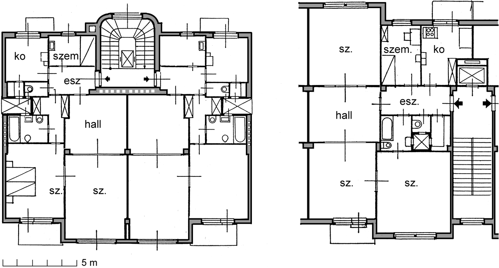
>
> *5.6. ábra – Budapesti lakástípusok a harmincas-negyvenes években (Kotsis Iván után)*

> **Megjegyzés**
>
> A *második világháború után* a lakásépítés fő feladata a romokban heverő Európa lakásállományának újjáépítése és a lakásveszteségek pótlása. Az ötvenes évek elejéig a magyar építészet az európai áramlatokkal együtt haladt. Választóvonalat jelent az 1951-ben politikai utasításra indított elméleti vita, amely a Szovjetunióból importált un. „szocialista-realista” irányzat egyeduralmának kikényszerítésével zárult, és az egyetemes építészet vonulataitól való elszakadáshoz vezetett.

> **Megjegyzés**
>
> *Az egyetemes építészetben* nagy hatást váltott ki az „Unité d´Habitation”, Le Corbusier által Marseille-be tervezett lakóház (1947-1952), amely egyben urbanisztikai kísérlet is volt. (Corbusier – Gropiusszal együtt – már a CIAM 1930-as kongresszusán a 10 emeletesnél magasabb lakóépületek mellett foglalt állást és készített ilyenekre elméleti érvényű terveket.) A 12 emeletes épület 23 féle lakástípust, összesen 336 lakást tartalmaz, sajátos térbeli elrendezéssel. Egy közepes falu nagyságú lakóterület teljes struktúráját foglalja magában, szolgáltató létesítményekkel együtt. Az emeleti folyosókat Le Corbusier „utcának” nevezte, külön emeletrészt foglalnak el az üzletek, vendéglátó és szolgáltató létesítmények. A tetőszinten óvoda van. A több mint ezer lakót befogadó ház nem foglal el nagyobb beépített területet, mint 30 hagyományos családi ház. A beépítés ilyen koncentrálása annak érdekében történt, hogy minél nagyobb természetes zöldfelület maradjon szabadon. A „lakógépnek” nevezett épület – mint egy nagy óceánjáró – úszik a természetes zöldfelület *felett,* mert az első használati szint az első emeleten van. Az épület lábakon áll, amelyek alatt a zöld mintegy átfolyik Le Corbusier egyik alapelvének megfelelően. (A szépen felújított épület mai állapota mutatja, hogy az építész akkor valamit kihagyott a számításból: a korábbi „természetes zöld” nagy részén ma parkoló autók zsúfolódnak.) Az „unité” továbbfejlesztett változata Nyugat-Berlinben is megépül, az „Interbau” keretében (1957). Az utóbbi egy nemzetközi lakásépítési kiállítás volt, ahol a korszak jeles építészei terveztek egy-egy épületet.

> **Megjegyzés**
>
> Már a negyvenes évek második felében Európa-szerte megindult az előregyártáson alapuló tömeges lakásépítés. A „Siedlung” kompozíciós készletét pontházak (toronyházak) egészítették ki, a beépítések némileg változatosabbak, de a lakótelepek mindenütt többé-kevésbé azonos karakterű lakókörnyezeti mintát követnek ([5.9. ábra](#abra_5_09)). A 60-as évek elején tagoltabb, térhatároló épületformákkal és változatosan sorolható szekciókkal kíséreltek meg építészetileg gazdagabb környezetet teremteni. A sokszínűbb városi környezet érdekében az alacsony nagy sűrűségű beépítés épülettípusait vegyítették a többszintes épületekkel. E törekvések nagy szakmai elismertséget kiváltó példája Candilis, Josic és Woods „Toulouse le Miraille” lakótelepe ([5.10. ábra](#abra_5_10)). A kísérletek nem eredményeztek lényegi áttörést: a tömeges lakásépítés legnagyobb része a maga termelékenység-orientált útját járta mindenütt.
>
> 
>
> 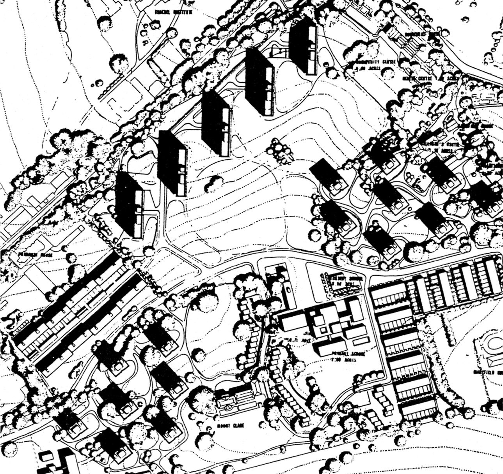
>
> *5.9. ábra – Roehampton lakótelep. Anglia 1951.*
>
> 
>
> 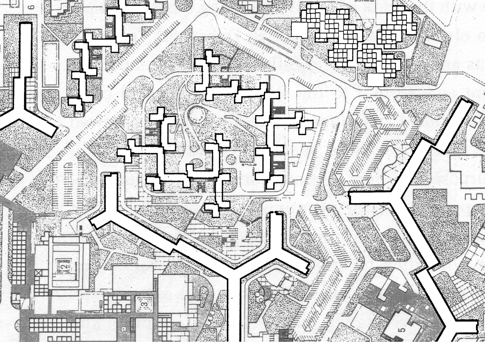
>
> *5.10. ábra – Toulouse de Mirail. Helyszínrajz-részlet. Candilis, Josic, Woods. 1961.*

> **Megjegyzés**
>
> A hatvanas években a szakmai érdeklődés egy új épülettípus, a *teraszház* felé fordult. Bár maga az épületfajta szinte teljesen kifejlett formájában jelent meg a finn Alvar Aalto 1936-ban tervezett együttesében, a teraszházak majd´ harminc év szünet után kezdtek nagy számban szaporodni az európai országok – főképpen Svájc és Németország – domboldalain. A szabad építési területek lassanként elfogytak, a telekárak emelkedtek, ezért a korábban beépíthetetlennek tartott lejtős terepeket is bevonták a lakásépítésbe. A nagyobb lélegzetű, szőnyegszerűen telepített teraszházas együttesek új minőséget hoztak a lakókörnyezet jellegében ([5.11. ábra](#abra_5_11)). A lakóháztípus akkori nagy népszerűsége inspiráló oka lehetett a sík terepre épített teraszház kifejlesztésének ([5.12. ábra](#abra_5_12)). A koncepció egyik forrása a japán építészet un. „metabolista” irányzata (metabolizmus = anyagcsere). A metabolista elv az épület elemeit két részre osztotta: az állandóbb alapszerkezetre (megastruktúra) és a lakásegységekre, amelyek időről időre lecserélhetők az újszerű igényeknek megfelelően. A nagyméretű „mesterséges lakódomb” néhány érdekes példája megépült ([5.13. ábra](#abra_5_13)), de nem terjedt el számottevő mértékben. A hetvenes évek végére a teraszházak iránti szakmai érdeklődés elcsendesedett, és azok szerényebb léptékben vagy egyes elemeikben bukkannak fel helyenként továbbra is.
>
> 
>
> 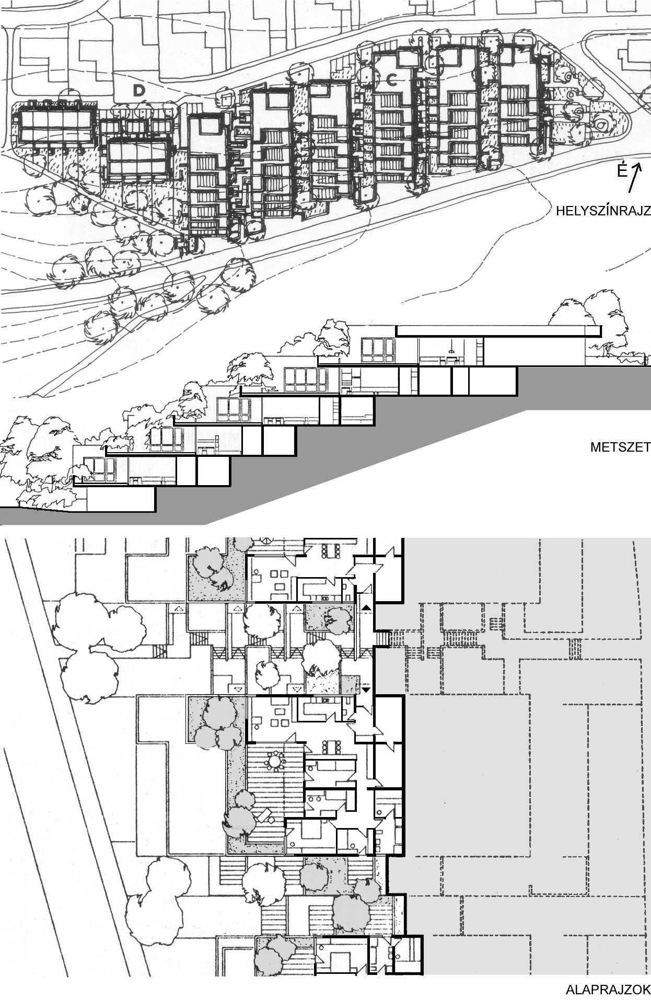
>
> *5.11. ábra – Teraszház-együttes. Neustadt/Waiblingen 1972. H. Kammer, W. Belz*
>
> 
>
> 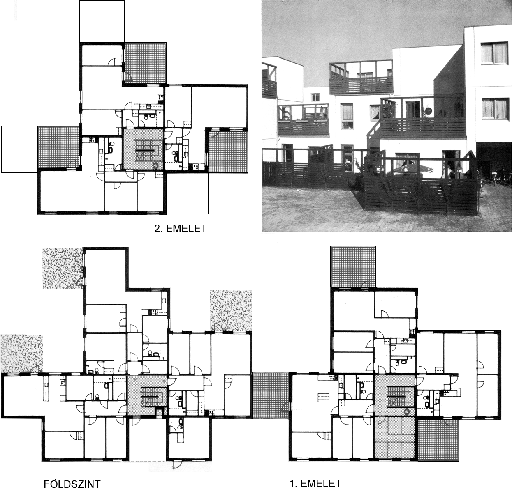
>
> *5.12. ábra – Lakóegyüttes dombházakkal. Koppenhága 1973-1975. Svend Hogsbro*
>
> 
>
> 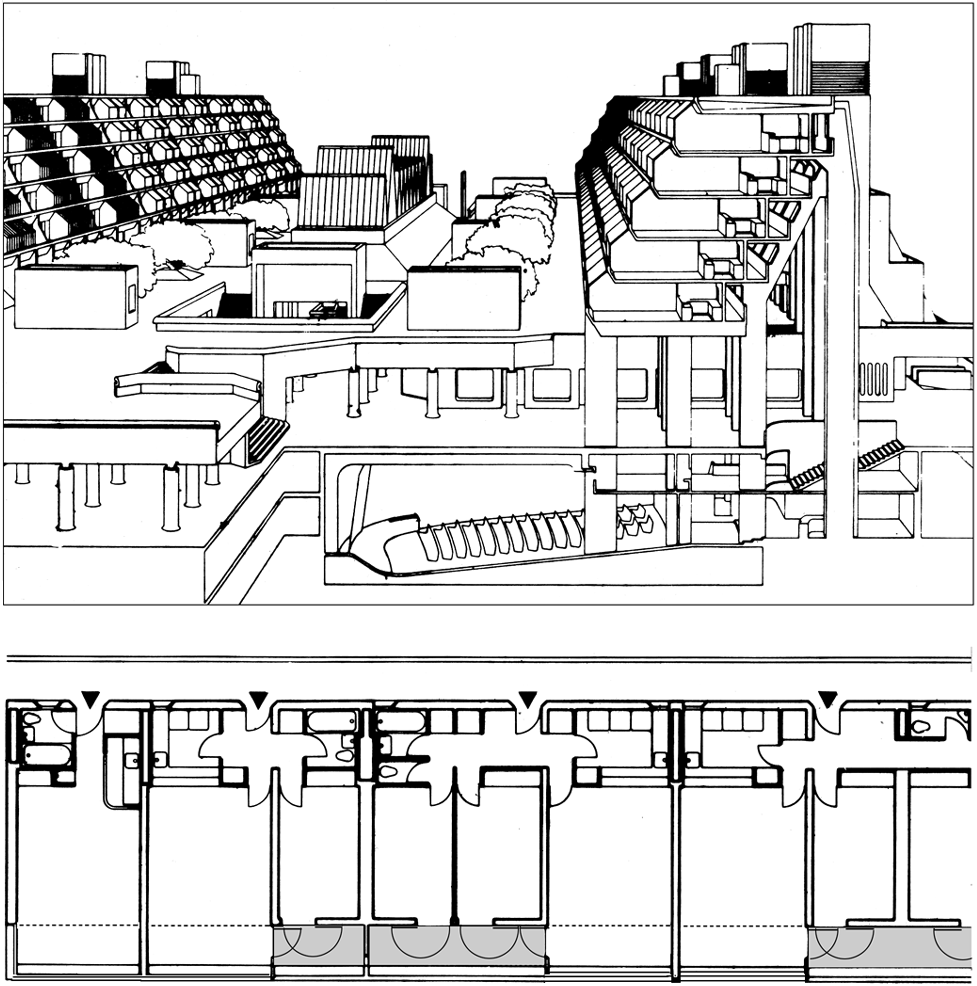
>
> *5.13. ábra – Nagyszerkezetre (megastruktúrára) épített lakódomb. London-Bloosbury 1962-1972. Hodgkinson, L. Martin*

> **Megjegyzés**
>
> A tömeges lakásépítés korábbi dinamizmusa a nyolcvanas évekre drasztikusan visszaesett. A fejlett országokban lakástúltermelés jelei mutatkoztak. Az ötvenes-hatvanas években épült lakótelepeken a társadalom alacsony státuszú rétegei (bevándorlók) koncentrálódtak az ezzel járó társadalmi problémákkal együtt. Elkezdődött a fizikai állagukban még állékony lakótelepek bontása. A nagyléptékű, ezres lakásszámú zöldmezős lakásberuházások gyakorlatilag megszűntek, és a többlakásos házak építése kisebb egységekben, főleg a meglévő városszövetek még szabad - vagy szabaddá tett – területein folyik.

> **Megjegyzés**
>
> A hetvenes évek második felétől az új, „posztmodern” áramlat rehabilitálta a modern építészet által korábban tételesen megtagadott hagyományos építészeti eszközöket. A városi környezet hagyományos elemeinek – utcáknak tereknek – létjogosultságát hirdeti Aldo Rossi: „A város építészete” c. munkája és Rob Krier nagy hatást kiváltó tanulmánya: „A városi tér fogalmánk tipológiai és morfológiai elemei”. A posztmodern klasszicizmus az épületek formálásánál is megtagadta a modern építészeti elveket, és a hagyományos, történelmi formákhoz nyúlt vissza ([5.14. ábra](#abra_5_14)). A korszak lakóház-tervezési elveit és eredményeit ismét egy berlini építészeti kiállítás demonstrálta 1987-ben. A posztmodern építészet kiváló képviselői terveztek egy, vagy több épületet, épületegyüttest (Hans Hollein, Rob Krier, Aldo Rossi, James Stirling, Charles Moore, Robert Stern, és mások). A foghíjtelkek beépítése a hagyományos városszövetbe való illeszkedést követeli. Új minőséggel feléledt a korábban már elfelejtett keretes beépítés ([5.12. ábra](#abra_5_12)), és a „városi villákból” képzett, különböző építészek által tervezett, de harmonikus egységet képviselő lakóegyüttes (Rauchstrasse).
>
> 
>
> 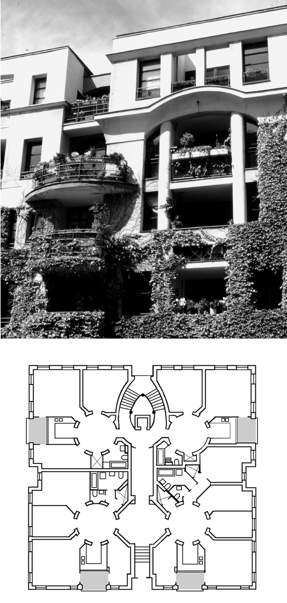
>
> *5.14. ábra – Többlakásos villa ( Stadtvilla). Berlin, Rauchstrasse. Rob Krier 1987.*

> **Megjegyzés**
>
> Mindeközben egyes nagy építész-egyéniségek a maguk egyéni útját járják. A jeles francia építész, Jean Nouvel maga deklarálja, hogy épületei nem követnek egyetlen stílust sem. A Nimes-ben, 1987-ben tervezett épületeinél a szociális lakásépítés új megközelítését adta ([5.16. ábra](#abra_5_16)). Tagadta, hogy a gazdaságosság miatt a lakásterek méreteit szűkíteni kellene, szerinte a tágas térméretek mellett az egyes lakáselemek és épületszerkezetek költségeit kell csökkenteni. Olyan szerkezeteket alkalmazott, amelyek korábban csak ipari épületeknél voltak használatosak, a tagolatlan, összefüggő nagy terekkel a nyílászárók számát csökkentette, az egyes lakásfunkcióknak való pontos megfeleltetés helyett többféleképpen használható térstruktúrák kialakítására törekedett. Annak ellenére, hogy a használat folyamán a lakásbelsők mégiscsak kispolgári köntöst öltöttek, az épület jelentős állomás a XX. századi lakáselméletek fejlődési folyamatában.
>
> 
>
> 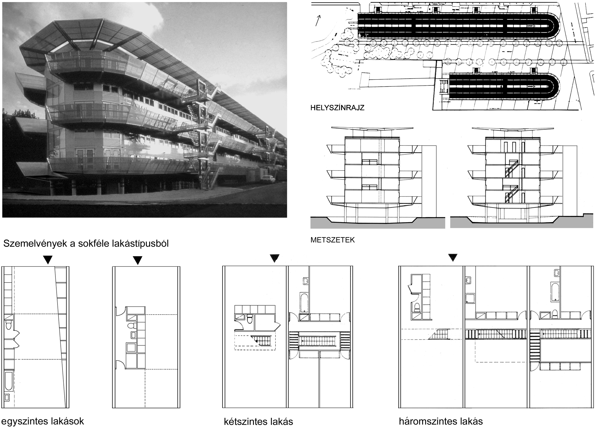
>
> *5.16. ábra – Lakóépületek szociális bérlakásokkal. Nimes, Franciaország Jean Nouvel, Jean-Marc Ibos 1987*

> **Megjegyzés**
>
> A közelmúlt lakóépület-építészetét a sokszínűség és az építész személyiségének szabad érvényesülése jellemzi. A széles körűen elfogadott „posztmodern” áramlat is lecsengett, stílusként újjáéledt a „neo-modern”, amely a korai modern építészet stiláris jegyeit feléleszti, de annak ideológiai beágyazottságát, tartalmi elemeit nem. A XX. század évtizedei folyamán mindig a figyelem előterébe került egy-egy új irányzat, majd rövidesen jelentőségét veszítette, hogy egy újabbnak adjon helyet. Mégis, a múlt század valamennyi újítása megtalálható a mai építészet kelléktárában is.

> **Megjegyzés**
>
> *A hazai történet az ötvenes évektől*
>
> Az ötvenes évek első felében a többszintes, többlakásos házak viszonylag nagy számban az új un. „szocialista városokban” épültek az erőszakosan fejlesztett nehézipar munkaerő-szükségletének elhelyezésére (pl. Dunaújváros, Kazincbarcika, Tatabánya stb.). A hagyományos építési technológiával épült állami bérházak kis alapterületű, szerény lakásokat tartalmaztak, így ellentmondás feszült a „szocreál” stílusban gazdagon dekorált épületek külseje és belső tartalma között. Tovább él a keretes beépítés, utcák, terek és nagylélegzetű allék létesültek. Valójában maga a városszerkezet az ekkoriban épült telepek és városrészek legértékesebb eleme.
>
> A többszintes, többlakásos házak létrehozására alkalmas építőipari szervezetek kizárólag állami vállalatok lehettek, amelyek tervutasításaikat közvetlenül kormányzati szintről kapták. (Jóval kisebb kapacitással jöttek létre a tanácsi, szórványosan a szövetkezeti építőipari vállalatok is.) A tömeges lakásépítés teljes mechanizmusa a központi tervutasítások végrehajtására szerveződött.
>
> A hatvanas években ambiciózus politikai elhatározás született: a 15 éves lakásépítési program, amely egymillió lakásegység megépítését írta elő. Ennek munkaerő-szükséglete már nem volt fedezhető, ezért az építésben korszerűbb, előregyártási módszereket kellett bevezetni. Előbb a különféle nagyblokkos építésmódokat alkalmazták, majd a hatvanas évek második felében elkezdődött annak a technológiai háttérnek a kiépítése, amely a következő húsz év hazai lakásépítését meghatározta. Az eredetileg Franciaországban kifejlesztett nagypaneles előregyártási rendszert (Camus rendszer) mi a Szovjetuniótól vettük át. Sorra épültek a házgyárak Budapesten és a nagyobb vidéki városokban, a hetvenes évek végére évente mintegy 40 000 lakás épült iparosított technológiával.
>
> Mivel az akkori gazdaságban piaci mechanizmusok nem működtek, a lakásépítésre szánt gazdasági erőforrások felhasználását normatívákkal szabályozták. Előírták, és szigorúan számon kérték, az állami lakások átlagos alapterületét. Ez kezdetben 48 m2 volt, ami később 53 m2-re növekedett ([5.17. ábra](#abra_5_17)). A normatívák garantált betarthatósága miatt az átlagos alapterületet épülettípusonként is érvényesítették, ezért a panellakások lakáskészlete nagy többségben 53 m2 alapterületű, kétszobás lakásokból áll. A tervutasítások végrehajtása a lakásépítésben résztvevő intézmények és vállalatok elsőrendű szempontja volt, a beköltöző lakók érdekei nem kaptak hangot. A gyártókapacitások leghatékonyabb működtetése a lehető legkisebb számú épülettípust és a területileg koncentrált építést ösztönözte. Emiatt alakultak ki a tízszintes sávházakból álló, több ezer lakásegységet tartalmazó lakótelepmonstrumok.
>
> 
>
> 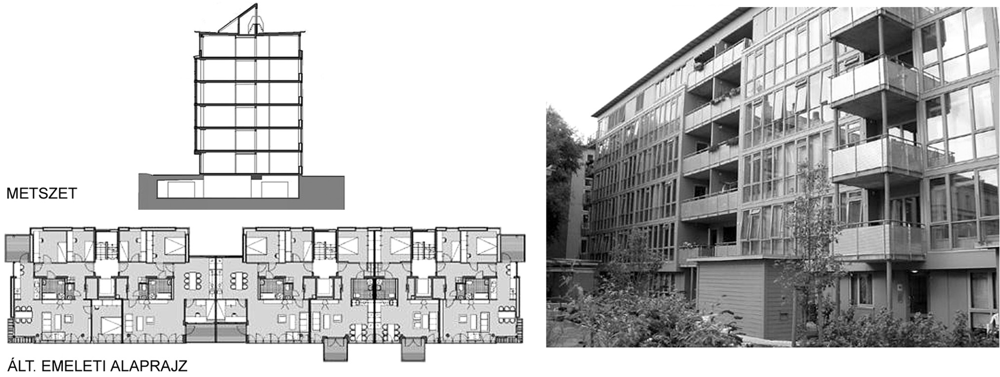
>
> *5.17. ábra – Többlakásos lakóépület. Oslo. Norvégia Per Kr. Monsen Arkitektkontoret GASA AS*
>
> A lakótelepek lakásai kezdetben állami bérlakások voltak, de a lakosság anyagi erejének bevonására fokozatosan terjed a szövetkezeti tulajdonforma, később az Országos Takarékpénztár is fellépett építtetőként, amely az általa beruházott lakóházakat öröklakásos társasházként értékesítette. A nyolcvanas évekre a magántulajdon uralkodóvá vált az akkor épülő lakótelepeken is. Az akkoriban kifejlesztett típusok már tágasabbak lettek (bevezették az 5,40 m fesztávot a korábbi max. 3,60 helyett) és az épületek szintszáma is csökkent. A nyolcvanas években épült panellakások (a Római-fürdői Pók utca, Kaszásdűlő) ma is kelendőek a lakáspiacon. A jó irányú elmozdulás már túl későn történt: a gazdaság válságba került és bekövetkezett a politikai rendszerváltozás, amely az állami nagyvállalatoknak és azok technológiai hátterének teljes felszámolásával járt.
>
> A tömeges (lakótelepi) lakásépítés mellett jóval kisebb számban épültek másféle, többszintes, többlakásos épületek a fent leírt időszakban. A jó fekvésű városi telkeken, így a budai hegyvidéken, spontán lakossági kezdeményezésre létesültek *társasházak*. Ezeknek az építkezéseknek legális vállalkozói hátterük alig volt, gyakori volt a „házilagos kivitelezés”, amely valójában az illegálisan működő, fekete építőipar fedőneve volt. A 60-as években épült társasházak még szerényebb méretű lakásokat tartalmaztak, később – ahogyan a lakosság jövedelemszintje emelkedett – igényesebb épületek is megjelentek, némelyik magas építészeti színvonalat is mutat. Ezen a területen még átsejlenek a nyugat-európai irányzatok: így például sok teraszház épül a hetvenes években, de mindig telkenként, társasházak formájában. Szervezett beruházást igénylő lakóegyüttesek – szórványos kivételtől eltekintve – nem szerepeltek a lakossági kezdeményezésű magánlakás-építés kelléktárában, mert ezeknek nem volt (nem lehetett) beruházó-vállalkozói hátterük.
>
> *A meglévő városszövetek* a nagypaneles technológia számára nem voltak alkalmas felvonulási területek. Az itteni lakásépítkezések vagy úgy történtek, hogy a belső városrészek szövetéből jókora területeket metszettek ki bontásokkal, és ide is lakótelepet ültettek be (pl. Óbuda, külső Józsefváros, Székesfehérvár, Debrecen) vagy, szerencsésebb esetben, telkenként építették az épületeket, amelyek lakásit – OTP öröklakások lévén – az alapterületi normatívák nem korlátozták (Zalaegerszeg, Szeged belváros, a budai Viziváros stb.). Ez utóbbiak tervezői általában a tanácsi tervező irodák voltak, ahol kitűnő építészek is dolgoztak. A 80-as évek végén kezdődött el nagyobb léptékben a régi városrészek nagyobb, összefüggő területeinek egy beruházási aktusban történő rehabilitációja ([5.18. ábra](#abra_5_18)). A folyamatot megállította – illetve átminősítette – az állami bérlakások privatizációja, ami telkenként elkülönült, egymástól független társasházakká változtatta a korábban állami tulajdonú bérlakásokat. A nagyobb területre kiterjedő, egységes beavatkozás helyett a rehabilitáció körülményesebben, telkenként történik, és elveszett az egységes lakókörnyezet feljavítását szolgáló bevált eszközök alkalmazásának lehetősége is (pl. több épület által keretezett nagyobb, összefüggő belső zöldfelületek, több házat kiszolgáló, koncentrált földalatti nagygarázsok létesítése).
>
> 
>
> 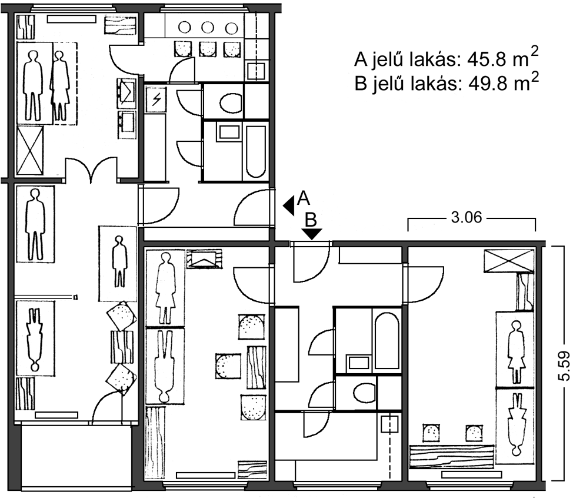
>
> *5.18. ábra – Lakástípusok a BHK I. házgyár első szériájából. 1960-as évek közepe (beköltözés után felmért bútorozással)*
>
> A 90-es években a lakásépítés üteme rendkívüli mértékben visszaesett, az évente épített többszintes, többlakásos házak száma nagyságrenddel csökkent. A lakásépítés a szabad piac keretei között folyik. A vállalkozói lakásépítés a befektetett tőke legnagyobb profitjára törekszik, ezért a többszintes, többlakásos házak építése két területre összpontosul: a belső városi területek foghíjtelkeinek beépítésére, vagy a jó fekvésű, frekventált zöldterületekre, ahol un. „lakóparkok” létesülnek. A belvárosi részeken legnagyobb kereslete a kicsiny, egyszobás lakásoknak van (ezekre van fizetőképesség); a lakóparkokban az igényesebb lakások kelendőek. A 2000-es évek elején kezdődő folyamatok azt jelzik, hogy előbb-utóbb nagyobb számban elindul az átlagos fizetőképességű családok számára is elérhető lakások építése többszintes, többlakásos épületek formájában.

> **Megjegyzés**
>
> *Új világtendenciák a fenntarthatóság jegyében (N.Á.)*
>
> A többlakásos épületek esetében is kialakultak azok az új követelmények, amelyek a fenntarthatóságot segítik elő. Az épületek tervezése során – különösen városi környezetben – gyakran törekednek a vegyes használatra (lakás és egyéb szolgáltatási funkció egyidejűleg jelenik meg a gazdaságos üzemeltetés érdekében), különböző méretű és adaptálható lakások biztosítására azért, hogy ne alakuljon ki szegregáció vagy egysíkú tulajdonosi- bérlői szerkezet. Sok esetben – főleg intenzív városi terület beépítésekor – megjelennek a gépkocsimentes zónák, ahol a beköltözőknek vállalni kell a gépkocsi nélküli életmódot.
>
> Az energiaveszteségek többlakásos épületeknél is jelentősen csökkenthetők az épületek szerkezeteinek jó megválasztásával. Megfelelő tájolással a napenergia közvetlenül hasznosítható, de gépészeti eszközökkel is befogadható és tárolható, felhasználható fűtésre, használati melegvíz készítésére vagy áramtermelésre.
>
> Az Osloban megépült, az [5.17. ábrán](#abra_5_17) látható, többlakásos lakóépület tervezése során kifejezetten az új, innovatív, napenergián alapuló technológia felhasználására törekedtek városi környezetben is.
>
> Az itt alkalmazott jellemző megoldások: aktív (napkollektor) és passzív szolár (napterek, üvegezett zónák) elemek együttes használata; a délre tájolt tetőfelületeken napkollektorok a háztartási melegvíz készítéséhez és a padlófűtés rásegítésére; magas hőszigetelési minőség az északi falakon; zöldtető a lapos tetős épületszakaszokon; egészséges, korlátozott számú, újra használható vagy reciklikálható anyagok; épületen belüli szelektív hulladékgyűjtés; csökkentett vízfogyasztás, a szürke szennyvíz helyi tísztítása és felhasználása a zöldfelület gondozásában; esővízgyűjtés és helyi felhasználás.

## 5.3. A többszintes, többlakásos házak telkének beépítése

A jelenleg érvényes *Országos Településrendezési és Építési Követelmények* által lefektetett beépítési módok a többszintes, többlakásos épületekre is érvényesek (szabadon álló, oldalhatáron álló, ikres és zártsorú).

Az *oldalhatáron álló* beépítés semmiképpen sem javasolható többszintes, többlakásos épületek esetén, mert azok elhelyezésére nem alkalmas.

Az *ikres* beépítési módot ma már csak kivételesen alkalmazzák a tárgyalt épületfajták körében. Akadnak erre példák kisebb volumenű társasházak esetében, de követésük semmiképp nem javasolható a helyi szabályozási tervek készítése során.

A jelenleg alkalmazható beépítési módok szerint többszintes, többlakásos házak szabadon álló és a zártsorú beépítésre kijelölt telkeken építhetők kedvezően.

*A szabadon álló* beépítésre alakított telken akárhány épület elhelyezhető, ezért azon állhat *egyetlen* többlakásos épület (korábbi meghatározás szerint „egyedi telek”), de lehet az olyan nagyméretű telek (korábbi nevén „tömbtelek”) is, amely alkalmas *több épületből* komponált lakóegyüttes kialakítására.

A zártsorú *beépítési mód* *a már kialakult városszövetekben való lakóház-építésre jellemző, de új telekosztásokon is előírható. A zártsorú beépítés jellemzően „egyedi telkes”, ahol valamennyi lakóház saját, külön telkén áll.*

> **Megjegyzés**
>
> Megjegyezzük, hogy a ma kodifikált, lehetséges beépítési módok nem elég rugalmasak a többszintes, többlakásos házak teljes beépítési skálájának befogadására. Nehezen illeszthető ezekbe, például, a közelmúltban újjáéledt *keretes* beépítés azon formája, amelynél egy vagy több *közös* belső udvart szegélybeépítés vesz körül ([5.15. ábra](#abra_5_15)). Ezt a beépítést „szabadon állónak” tekinteni aligha lehet, de zártsorúnak azért nem nevezhető, mert az épületek nem telekhatáron csatlakoznak egymáshoz, minthogy telkük közös.
>
> 
>
> 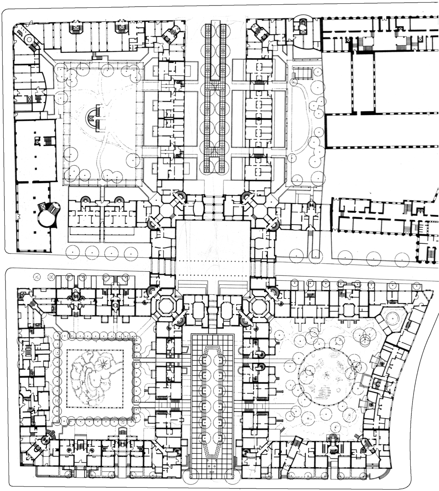
>
> *5.15. ábra – Lakótömb, Berlin, Ritterstrasse-Nord 1982-1988*

Az egyes beépítési módoknál érvényes részletesebb szabályozásra a 3. fejezetben leírtak itt is érvényesek.

A telekfelhasználás lényeges szempontja az a követelmény, amely lakásonként legalább 1 gépkocsi *telken belüli* elhelyezését írja elő.

A most érvényes OTÉK az alkalmazható legnagyobb szintterület-sűrűséget eltérően szabályozza az általános használat szerint megkülönböztetett „nagyvárosias, kisvárosias és kertvárosias” kategóriák szerint. A „kertvárosi” területen max. 0,6; „kisvárosias” területen max. 1,5 szintterület-sűrűséget enged. Az utóbbi érték már mélygarázsok építését vonhatja maga után.

A „nagyvárosias” területeken alkalmazható 3,0 szintterület-sűrűség már mindenképpen mélygarázs, esetleg többszintes mélygarázs létesítését követeli meg.

## 5.4. Szintszámok, magassági kategóriák

A többszintes, többlakásos épületek szintszáma széles skálán változik a kétszintes formától a sokszintes magasházakig. Azonos beépítettség mellett a szintszámokkal arányosan nő az épület összes szintterülete, tehát az építési telek kihasználtsága (a szintterületi mutató) egyre növekszik, elvileg egyre kedvezőbb a telekár és a terület-előkészítés költségeinek megoszlása: a lakásberuházás – látszólag – egyre gazdaságosabb. Az elvi összefüggés azonban a valóságban nem így érvényesül. A fajlagos építési költségek ugyanis bizonyos magassági határértékeknél ugrásszerűen emelkednek.

Ilyen magassági határérték az un. *„lifthatár”* amely felett a lakóépületben felvonót kell létesíteni, és a lakások m2-re vetített építési költségeire a felvonó létesítési költsége is rárakodik. Ez a többletköltség – gazdaságos közlekedő rendszer esetén – nem nagy.

*A gépkocsielhelyezés* módozata az építési költségek tekintetében sokkal jelentősebb. Bár a mélygarázs létesítésének kényszere nem az épületmagasságtól függ, bizonyos szintterületi mutatókhoz bizonyos épületmagasságok tartoznak a tapasztalatok szerint. Az előző fejezetben példaként elemzett 1,5 szintterületi mutató kb. 4-5 szintes épületmagassággal párosul általában, a telek beépítettségének mértékétől függően. Négy-ötszintes épületeknél már legtöbbször mélygarázst kell létesíteni.

A *mindenkori Országos Tűzvédelmi Szabályzat* előírásai bizonyos magassági határértékek átlépése esetén szigorodnak. (Az alább közölt előírások szemelvényszerűek. Konkrét tervezésnél a mindenkori tűzvédelmi szabályzat teljes körét kell figyelembe venni és betartani.)

**Ezek szerint**

- – *középmagas épületként* kell számításba venni azokat a házakat, melyeknek legfelső építményszint szintmagassága 13,65 és 30 méter között van,
- – *magas épületként* azokat, amelyeknek a legfelső építményszint szintmagassága a 30 métert meghaladja.

Szintmagasságként az épület főbejárata – bejárati előlépcsője – előtti járda szintje és az építményszint padlófelülete közötti függőleges távolságot kell érteni. A tetőteret tűzvédelmi szempontból akkor kell építményszintnek tekinteni, ha az ott beépített rész az alapterület 25%-át meghaladja.

Az épületekben egy vagy több tűzszakaszt kell meghatározni illetve kialakítani, és kiürítési számítással igazolni kell, hogy az épület tűz esetén biztonságosan elhagyható.

„Tűzszakasz: az építmény vagy szabadtér tűzvédelmi szempontból meghatározott olyan egysége, amelyet a szomszédos egységektől – meghatározott tűzvédelmi osztályú és tűzállósági határértékű – tűzgátló szerkezetek és a jogszabályokban előírt tűztávolságok választanak el.” (A tűzgátló szerkezet erre alkalmasan kiképzett ajtó is lehet.)

***Középmagas épületben***

- legfeljebb 4 fogatú középmagas lakóépületekben zárt, nem füstmentes – hő és füstelvezetéssel rendelkező – lépcsőház is létesíthető,
- szintenként egy tűzszakasz elhelyezkedése esetén a biztonságos kiürítés érdekében füstmentes lépcsőházat kell kialakítani,
- szintenként több tűzszakasz elhelyezkedése esetén, tűzszakaszonként 1-1 zárt, nem füstmentes – hő és füstelvezetéssel rendelkező – lépcsőházat kell kialakítani, és a lépcsőházak között az átjárást minden szinten biztosítani kell, vagy megengedett a tűzszakasz-határon természetes szellőzésű vagy előtérrel kialakított túlnyomásos szellőztetésű füstmentes lépcsőház létesítése is,
- ha szintenként több lépcsőház vagy tűzszakasz kerül kialakításra, de azok között az átjárás nem minden szinten biztosított, akkor valamennyi lépcsőházat füstmentes lépcsőházként kell kialakítani.

*Magas lakóházak* esetén a tűzrendészeti követelmények még szigorúbbak és összetettebbek, ezeket itt, most nem részletezzük. Ezek költségvonzata önmagában jelentős, de a magas lakóházak tartószerkezetei, gépészeti berendezései is lényegesen bonyolultabbak, költségesebbek, ezért azoknál a lakások fajlagos építési költsége is igen nagy.

Általános elvként ajánlható, hogy a *magas lakóépület létesítését kerülni kell*. Kivált olyankor – mint erre akad néhány hazai példa – ha ezek építésére csupán rosszul értelmezett presztízs-szempontok miatt kerül sor.

## 5.5. A többszintes, többlakásos lakóházak főbb szerkezetei és berendezései

### 5.5.1. A többszintes, többlakásos lakóházak szerkezeti rendszerei

Ebben az épületkategóriában a különféle építési rendszerek sokaságát fejlesztették ki és alkalmazták a tömeges lakásépítés fellendülő korszakában. Ezeknek még vázlatos ismertetésére sincs itt hely. Most a korábban „hagyományosnak” mondott építési rendszereknek azokra a szerkesztési elveire térünk ki, amelyek a többszintes épületek vázlatterv szintű tervezéséhez szükségesek.

A *függőleges teherhordó szerkezetek* lehetnek teherhordó falak vagy pillérek.

*A kerámia anyagú teherhordó falak* (téglafalak, kerámia falazóblokkból készült falak) csak alacsony szintszámú (max. 3-4 szintes) épületekhez használatosak. Itt különös gondot kell fordítani a faláttörések (falpillérek) méretezésére az alsó szinteken, mert a ma alkalmazott jó hőszigetelő képességű, ezért porózus falazó anyagok teherbírása lényegesen gyengébb, mint a tömör téglából készült falazatoké. A teherhordó falazatok gyakran készülnek *vasbetonból* is. Az elrendezés itt is lehet haránt- vagy hosszfalas illetve a kettő keveréke ([5.21. ábra](#abra_5_21)).

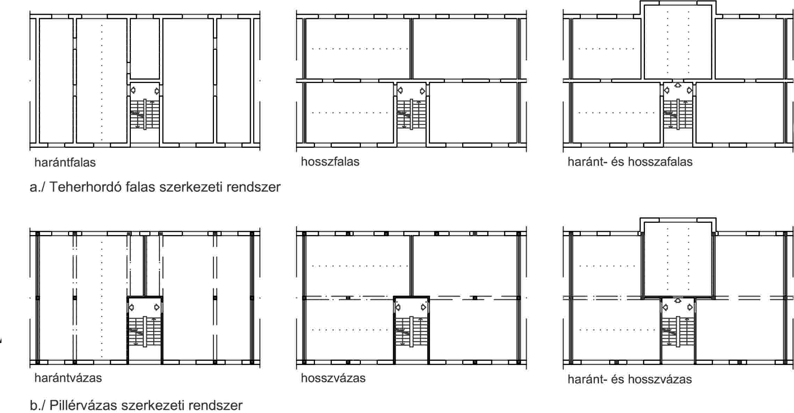

*5.21. ábra – Többszintes lakóházaknál gyakran alkalmazott szerkezeti rendszerek*

A teherhordó falakhoz alkalmazott *födémszerkezetek* készülhetnek monolit vasbetonból vagy előgyártott elemekből. Ezek gond nélkül alkalmazhatók a 6,00–6,60 m-ig terjedő fesztávolságokon. Ennél nagyobb fesztávok tervezése csak különlegesen indokolt esetben történhet. A nagyobb fesztávú és nem túl vastag, alul-felül sík monolit vasbeton lemezfödémek *lehajlása* nagy, szemmel is érzékelhető, és az alattuk lévő válaszfalakat is összeroppanthatják. A 7 métert meghaladó fesztávok áthidalására már speciális födémelemek kellenek: előfeszített, nagyméretű vasbeton gerendák, üreges pallók vagy alulbordás monolit vasbeton födémek. Mindezek alkalmazása nehézkes és drága.

A *pillérvázas* vasbetonszerkezet előnye, hogy a tartószerkezetektől hőszigetelő teljesítményt nem kell elvárni, a hőszigetelés a kitöltő falak dolga, amelyeknek viszont elsődleges tartószerkezeti szerepük nincs, így teherhordásra sem kell méretezni azokat. Ezért alkalmaznak manapság szívesen pillérvázas szerkezeteket alacsonyabb épületeknél is. Monolit vasbeton pillérvázas épületekhez előgyártott födémelemeket nem szokás alkalmazni, itt a födémek is általában monolit lemezfödémek. A födémlemezek a pillérek által hordott kiváltókra fekszenek fel. A kiváltók általában a födémlemez síkja alá lógnak, így a helyiségekben szemmel láthatók. Ezt a tényt az alaprajzok tervezésénél figyelembe kell venni, nehogy egy belógó kiváltó kellemetlenül metssze át egy helyiség mennyezetét. A kiváltók irányától függően beszélhetünk haránt- vagy hosszvázas elrendezésről, illetve a kettő keverékéről ([5.21. ábra](#abra_5_21)).

A könnyebb zsaluzhatóság érdekében gyakran alkalmaznak olyan vázszerkezetet, amelynél nincsenek belógó kiváltók, a pillérek a födémlemez síkjához közvetlenül csatlakoznak. Ez a pontokon támaszkodó, két irányban teherhordó, vasbeton lemezfödém (un. „rejtett gombafödém”). Kiváltók valójában itt is vannak, de azok olyan laposak, hogy vasalásuk elfér a kissé vastagabbra – 20–22 cm-esre – szabott födémlemez alsó és felső síkja között. Ezek a „rejtett kiváltók” viszont rendkívül szélesek: a betonvasak által elfoglalt mező szélessége az egy métert is meghaladja. Ennél a födémfajtánál belógó kiváltók nem befolyásolják az alaprajzok kialakítását, de nagy kötöttséget jelent, hogy a rejtett kiváltók sávjában és a pillérek környékén nem készülhet nagyobb födémáttörés szellőzőkürtők átvezetésére. Ezt a tényt szem előtt kell tartani a lakások vizeshelyiségeinek elrendezésénél.

A pillérvázas szerkezetek önmagukban csak korlátozottan alkalmasak vízszintes irányú terhelések (szélteher) felvételére, ezért – megfelelő helyeken – merevítő vasbeton falakat kell létesíteni mind haránt-, mind hosszirányban. Alacsonyabb, vagy közepes magasságú (3-4 szintes) épületeknél a lépcsőházat körítő vasbeton falak általában elegendőek a vázszerkezet merevítéséhez.

### 5.5.2. Lépcsők

*A lépcsőfokok* méretezésére többlakásos házak közös lépcsőinél is a következő képlet szolgál:

2M+SZ = 60-64 cm (optimum: 63 cm).

Az M fellépési magasság nem haladhatja meg a 17 cm-t. Akadálymentes használat igénye esetén, továbbá speciális lakóépületfajtáknál (pl. öregek otthonházainál, fogyatékos személyek lakóotthonaiban) a fellépési magasság legfeljebb 15 cm lehet.

A lépcsőfokok méretein a bejárati szinttől a legfelső lakásszintig változtatni nem szabad, mert a nem várt lépésritmus-váltás miatt a használó megbotolhat, balesetet szenvedhet. (A pincébe vagy padlásra vezető lépcső méretezésére ez nem vonatkozik.)

Ha különleges indokkal íves karú vagy húzott fokú lépcsőt tervezünk, akkor az előírt karszélességen belül a lépcsőfok legkisebb belépőszélessége legalább 13 cm legyen. A közösen használt íves karú, húzott fokú lépcső menekülési útvonalként nem vehető számításba.

A *lépcsőkar* szabad szélességét (a korlátok nélkül!) a lépcső által kiszolgált lakásokban tartózkodók számának és a kiürítésre vonatkozó tűzrendészeti előírásoknak megfelelően kell meghatározni. Ez a méret nem lehet 1,10 m-nél kevesebb (ajánlott legalább 1,20 m karszélesség). A lépcsőkar és lépcsőpihenő feletti szabad belmagasság legalább 2,20 m legyen. A lépcsőkarnak legalább egyik – a 2,0 m-nél szélesebb lépcsőkarnak mindkét – oldalát fogódzásra alkalmas módon kell kialakítani.

A kiesést gátló lépcsőkorlát markolatának magassága legalább a járóvonaltól mért 95 cm magasságban legyen. Az optimális megkapaszkodás érdekében a markolat 4,5–5,0 cm átmérőjű kör keresztmetszetű legyen és a kézfej akadálytalan végigcsúsztatása érdekében alulról legyen megfogva.

> **Megjegyzés**
>
> Felvonó hiányában a lépcsőn való biztonságos közlekedés érdekében javasolt az alacsonyabb, illetve nehezebben mozgó személyek számára a járóvonaltól mért 70 cm magasságban is fogódzásra alkalmas szerkezetet biztosítani. Ez az alacsonyabban elhelyezett második markolat gyermekek számára kényelmesen elérhető, és az idősebbeknek a lépcsőfokokra való nehézkesebb fellépését segíti. (P.A.)

A lépcsőkorlát kialakításánál fordítsunk fokozott figyelmet arra, hogy a gyermekek korlátra való felmászását fellépésre alkalmas szerkezeti elem ne segítse elő, és a kiesést gátló szerkezeti elemek közötti nyílás 12 cm-nél nagyobb ne legyen.

> **Megjegyzés**
>
> Ha a lépcsőpihenőről ajtószárny nyílik, akkor ügyelni kell arra, hogy az ajtó nyitása biztonságosan legyen elvégezhető, az ott álló személy a lépcső forgalmát ne zavarja: a lépcsőkar induló éle és a mellette lévő ajtó között legalább 30 cm távolság legyen. (P.A.)

Egy lépcsőkar legfeljebb 20 fellépést tartalmazhat, ezután lépcsőpihenőt kell beiktatni. (Mozgáskorlátozottak vagy öregek akadálymentes otthonházainál egy lépcsőkar 1,80 m-nél nagyobb szintkülönbséget nem hidalhat át.)

*A lépcsőpihenő* szélessége legyen legalább a karszélességgel azonos. Kivétel az egyenes lépcsőkarba iktatott pihenő: ez legyen legalább 60 cm hosszú, de az egyenletes lépésritmus érdekében ajánlott 1 belépés + 63 cm. A nagyobb tárgyak (bútordarabok, hordágy) szállítása mindig a fordulóknál jelent gondot, ezért jobb, ha a pihenők a minimumnál szélesebbek. Közbenső pihenőnél ajánlott legalább a karszélesség +10 cm, érkező pihenőnél a karszélesség + 20 cm-es méret.

Ha a lépcsőpihenőre kerekesszékkel is használható felvonó nyílik, akkor a lépcsőpihenő legyen megfelelően széles a kerekesszék fordulásához: legalább 1,50 m ([5.22. ábra](#abra_5_22)).

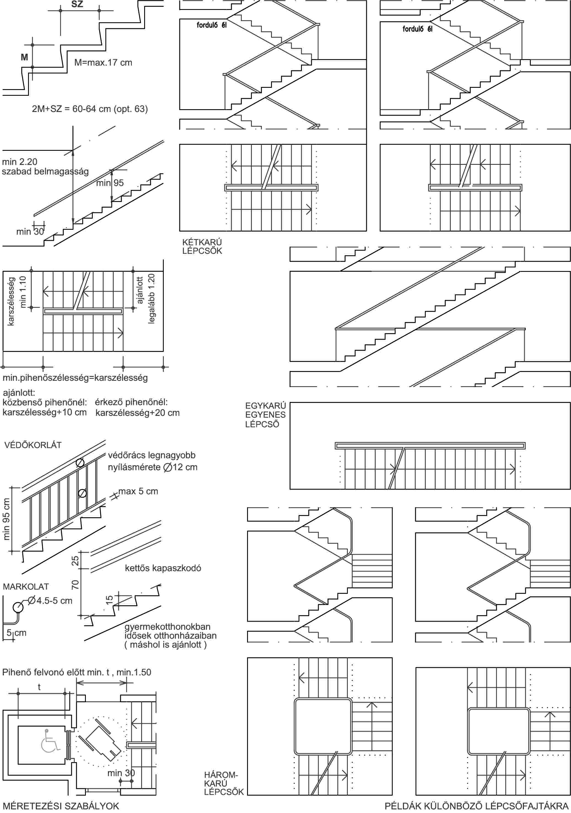

*5.22. ábra – Többlakásos házak közös lépcsői*

A kiürítésre szolgáló lépcső pihenőjét az előírt legkisebb szélességen belül más rendeltetés (pl. keresztező közlekedés) nem zavarhatja, előírt szabad méreteit benyíló ajtószárny, beálló berendezés nem csökkentheti.

*A lépcső építészeti megformálása* fontos az épület esztétikai minőségének szempontjából. A lépcsőlemez és a lépcsőpihenő alsó síkjának találkozása, a lépcsőkorlát fogódzójának vonalvezetése a szép lépcső szerkesztésének lényeges szempontja. Kedvező, ha a lépcsőpihenő alsó síkja és a lépcsőlemezek alsó síkja egy egyenesben találkozik (forduló él), és ha az érkező és induló korlátfogódzó a pihenőnél azonos magasságban találkozik. Ezeknek a szempontoknak figyelembe vétele általában egy belépő-szélességgel hosszabb lépcsőházat eredményez, mint ami a minimális méretekből adódnék.

Az [5.22. ábrasoron](#abra_5_22) olyan lépcsőket közlünk, amelyek lakóházaknál használatosak. Legkisebb alapterületet a kétkarú lépcső foglalja el, kissé területigényesebb a háromkarú lépcső. Akkor érdemes tervezni, ha a lépcsőház mérete mélységi irányban korlátozott. Ablaktalan, belső lépcsőház megvilágítása – alacsonyabb szintszámú épület esetén – felülvilágítóval is történhet, de ehhez megfelelően széles orsótér kell, ami a háromkarú lépcsőnél adódik. Az egykarú lépcső lépcsőháza igényli a legnagyobb területet, de nagyobb fogatszám esetén kedvezően alkalmazható (lásd 5.7. fejezetet).

### 5.5.3. Felvonók

A többszintes épületekben való függőleges közlekedés gépi berendezése a felvonó, amely a lépcső funkcióját kiegészíti, de nem helyettesíti. (Nem szabad olyan szintet tervezni, amely csak felvonóval közelíthető meg.) A lakóépületekben alkalmazott felvonók személyfelvonók, vagy bútorszállításra is alkalmas nagy személyfelvonók.

A jelenleg érvényes előírás szerint *kötelező* felvonót létesíteni minden épületben, amelyben a rendeltetésszerű használat 10,0 m-nél nagyobb szintkülönbség áthidalását teszi szükségessé (kivétel a kétszintes lakás második szintje). Pince nélküli épületben – általában – ez fszt+3 emelet, alápincézett épületben fszt+2 emeletet jelent. Természetesen, létesíthető felvonó alacsonyabb – akár kétszintes – épületben is építtetői szándék vagy gazdasági megfontolás alapján (lehet, hogy a felvonó nyújtotta jobb lakhatási színvonal magasabb lakáspiaci árban realizálódik).

> **Megjegyzés**
>
> Beruházói megfontolás kérdése, hogy a „lifthatárnál” alacsonyabb többlakásos lakóépületeknél felvonót létesítsenek vagy sem, de a lakóépület használati értékét jelentősen növeli, ha a komfortszint emelése vagy akadálymentesítése érdekében felvonó később beépíthető (pl. háromkarú lépcső ennek megfelelően méretezett orsóterébe). (P.A.)

Mindenképpen felvonót kell létesíteni az akadálymentes kialakítást igénylő speciális lakóépületeknél (pl. idősek otthonházainál). Itt biztonsági felvonó létesítése is kívánalom lehet, ha tűz esetén az épület kiürítése más módon nem biztosítható. (Biztonsági felvonó: az épület füstmentes lépcsőházához vagy tűzgátló előteréhez, vagy a szabad térhez kapcsolódó, az épülettűz alatt is működtethető felvonó.)

A felvonó működtetése történhet mechanikus vagy hidraulikus meghajtással, mindkettő elektromos energiaforrásból táplálkozik.

A *mechanikus meghajtás* hajtóműve korábban külön gépházat igényelt a liftakna felett, vagy a liftakna mellett az induló szinten (felső vagy alsó gépház). Ilyenekkel ma már jobbára csak épületfelújítások során találkozunk. Felső gépházat csak különösen nagy teljesítményű irodaházi felvonóknál alkalmaznak, alsó gépházat már nem létesítenek. Lakóépületeknél általánossá vált magában a felvonóaknában felszerelt hajtómű ([5.23. ábra](#abra_5_23)).

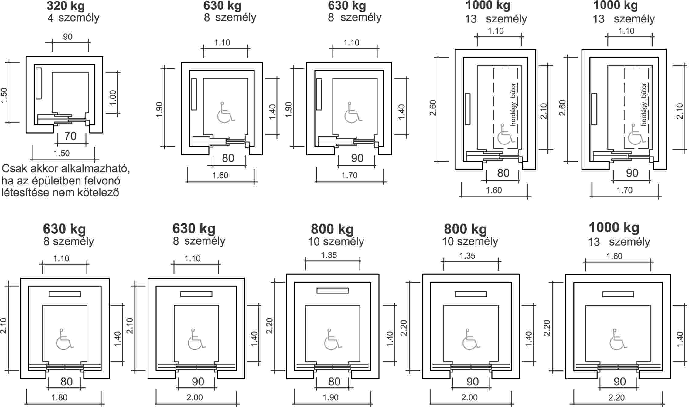

*5.23. ábra – Személyfelvonó kialakítása*

Az alacsonyabb szintszámnál alkalmazható *hidraulikus* felvonó teleszkópos munkahengere szivattyú által keltett olajnyomás hatására emeli a járószéket. Az ilyen lift azonban lassú és energiafaló, ezért létesítését kerülni kell.

A felvonóaknát úgy kell kialakítani, hogy a felvonó véghelyzeteiben a fülke alatt (süllyeszték) és a fülke felett (aknafej) megfelelő méretű menekülő tér legyen ([5.23. ábra](#abra_5_23)).

A *liftajtók* kizárólag automatikus működtetésű tolóajtók lehetnek, középen felnyíló vagy egy oldalra nyíló, teleszkópos elrendezésű szárnyakkal. A tiszta nyílásméret nem lehet kisebb 80 cm-nél, akadálymentes épületben 90 cm-nél. Különleges helyzetekben (pl. szinteltolásos épületben vagy más okból) alkalmazható olyan felvonó, amelynek két ajtaja van az átellenes oldalon. Ez – természetesen – bizonyos költségtöbblettel jár ([5.23. ábra](#abra_5_23)).

A felvonót (felvonókat) forgalomszámítás szerint kell méretezni. Lakóépületek esetében a 12 m2 alatti lakószobákat egy fő, 12 m2-es és annál nagyobb szobákat 1,5 fő használói létszámmal kell figyelembe venni. Lakóépületben ritkán fordul elő, hogy egynél több felvonót kell tervezni a nagy használói létszám miatt, de ha mégis, azok legyenek egy blokkban, egymás mellett elhelyezve.

Lehetséges, hogy a forgalomszámítás alapján kisebb, 4 személyes felvonó is elegendőnek látszik, de abba *babakocsi és kerekesszék* nem fér el a járószék szűkös méretei miatt. Legfeljebb olyan esetben lehet ilyent létesíteni, ha az épületben felvonó kialakítása egyébként nem kötelező.

Ha az előírások szerint felvonó létesítése kötelező (szintkülönbség a „lifthatár” felett van) akkor kerekesszékkel is használható 8 személyes, legalább 630 kg teherbírású liftet kell elhelyezni ([5.24. ábra](#abra_5_24)). Ennek többletköltsége a kis felvonóhoz képest – a lakásberuházás egészét tekintve – elenyésző. (A humanitárius szempontokon túl a lakáspiacon is értéknövekményt jelent, ha a lakónak egy váratlan balesetet követő, vagy idős korban bekövetkező mozgáskorlátozottsága miatt nem kell lakásától megválnia.) Ha az épületbe kerekesszékkel is használható felvonót tervezünk, akkor – természetesen – a vízszintes irányú közös közlekedés egész rendszerének *akadálymentes* kialakítása nyomatékosan ajánlott.

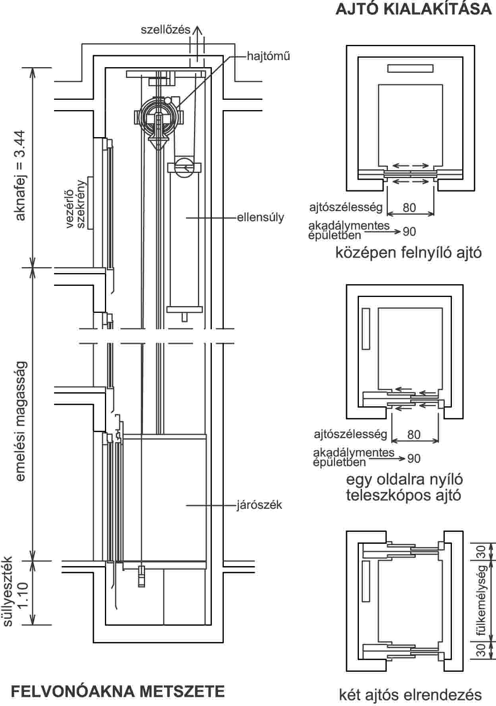

*5.24. ábra – Lakóépületekben alkalmazott személyfelvonók (ISO 4190)*

*Középmagas és magas épületeknél* bútorszállításra is alkalmas liftet kell tervezni. Ez legalább 1000 kg teherbírású (13 személyes). A 2,10 m-es fülkemélység nemcsak a nagyobb bútordarabok szállítása miatt jó, de abban *hordágy* is elhelyezhető.

A felvonótípus megválasztásához, építészeti kialakításához mindig konzulens felvonótervező szakembert kell bevonni a tervezés kezdő fázisában is.

Ügyelni kell arra, hogy a felvonóba történő be- és kiszállás megfelelően kényelmes legyen. Amennyiben a liftnek bútorszállításra is alkalmasnak kell lennie az előírás szerint, akkor a be- és kirakodás lehetősége rendeltetési követelmény. Ezért a felvonó-ajtó előtti várakozótérnek az ajtóra merőleges irányú mérete – a felvonóakna szélességében – ne legyen kisebb, mint a járószék mélységi mérete (de legalább 1,50 m a kerekesszékkel is használható lift esetében).

Ha a felvonóakna fala lakásterekkel határos, akkor a *zaj elleni védelem* miatt a liftakna mellett ne legyen lakóhelyiség (nappali szoba, hálószoba). Ilyenkor célszerű az akna körül alárendeltebb helyiségekből álló „zajzsilip” kialakítása, illetve az akna hangszigetelése. Igényesebb megoldás, ha az önhordó liftakna rugalmas építőanyagból készült elválasztó réteggel csatlakozik az épület vasbeton szerkezeteihez.

A felvonó és lépcső együttesen képezi az épület függőleges közlekedő magját. A lépcső és felvonó együttes elhelyezésére mutat példákat az [5.25. ábrasor](#abra_5_25). A háromkarú lépcső orsóterébe helyezett liftakna esztétikailag nem előnyös: a lépcsőteret folyosószerűvé teszi. Építészetileg kedvezőbb a lépcső mellett, vagy a lépcsővel szemben elhelyezett lift. Utóbbi a földszint kialakításánál jelent kötöttséget. Füstmentes lépcsőház terét ajtóval kell elválasztani a közös közlekedők légterétől. Ha biztonsági felvonó követelmény, annak tűzgátló előtérből vagy a füstmentes lépcsőház teréből kell nyílni.

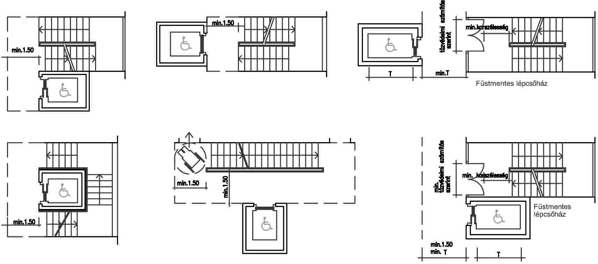

*5.25. ábra – Példák felvonó – lépcső kapcsolatokra*

### 5.5.4. Épületgépészeti szempontok

A többszintes, többlakásos lakóépületeknél gyakoriak a belső fekvésű, ablaktalan, de közvetlen szellőzést igénylő helyiségek. Ezek *szellőzéséről* gravitációs úton, vagy gépi úton működtetett szellőzőkürtőkkel gondoskodni kell. A gravitációs szellőzőkürtőket egyre inkább felváltja a ventillátorral működtetett gépi szellőzés. Előnyös, ha a függőleges csővezetékek (vízvezeték, függőleges csatornavezeték) a szellőzőkürtők mellett, egységes gépészeti aknában vannak elhelyezve, amelyben helyet kaphat a falikazán kéménye is. Az egymás feletti lakások gépészeti aknáinak – természetesen – egymás fölé kell esniük, hogy a szellőzőkürtőket és a függőleges csővezetékeket egyenes, függőleges vonalban lehessen vezetni. (Ezt a magától értetődő szempontot kezdő tervezők sokszor elhanyagolják olyankor, amikor egy-egy szint alaprajza az általánostól eltér pl. földszinti, tetőtéri lakások, kétszintes lakások esetében).

A szellőzőkürtők és kémények elrendezésénél figyelembe kell venni, hogy azokat a tető fölé kell kivezetni, ezért az épület külső megjelenését is befolyásolják. A rendezetlen formában megjelenő kivezetések sokasága elcsúfíthatja a tetőket.

> **Megjegyzés**
>
> Amennyiben automatizált gépi szellőztetést építenek ki az egész épületen belül, úgy lehetőség van arra, hogy hővisszanyerő szellőztető berendezést alkalmazzanak, amely a fűtési időszakban az elszívott, használt levegő hőjével előmelegíti a friss, de hideg levegőt. Ezek a berendezések mára egyre egyszerűbbekké váltak, méretük egy átlagos klímaszekrényhez hasonlítható. (N. Á.)

A lakások *fűtése* új többlakásos házak esetében szinte kivétel nélkül központi fűtés. A központi fűtés rendszere lehet lakásonként egymástól független, kiterjedhet egy épületre, de egy egész épületegyüttesre vagy ennél nagyobb területre is (távfűtés).

A lakásonként önálló gázüzemű központi fűtésnél a viszonylag kisméretű falikazán (cirko) legfeljebb alacsony szintszám mellett alkalmazható. (Minden kazán külön égéstermék-elvezetést igényel, és a korszerűbb, zárt égésterű falikazánok kéménymagassága is korlátozott.)

Az épület egészére kiterjedő központi fűtés kazánházának elhelyezése – gáz energiahordozó esetén – különös gondosságot követel a gázrobbanás veszélye miatt. A kazánháznak viszonylag nagy „hasadó felülettel” kell rendelkeznie (könnyű szerkezetű fal vagy „repülő födém”) amely a gázrobbanás feszítő hatásának nem áll ellen. Gáz energiahordozó esetén igen gyakori, hogy a kazánházat legfelső szintre helyezik. A kazánház méretei a kazánok számától, típusától függenek, amelyeket az épületgépész-tervező választ meg az épület fűtési energiaszükségletének kiszámítása alapján. A gépész-konzulens adja meg a kazánház berendezéseinek helyszükségletét is. Pincébe csak zárt égésterű gázkazán helyezhető el bizonyos feltételekkel, ilyenkor a jelentős méretű kémény helyigényét is figyelembe kell venni.

Ugyancsak jelentős lehet az épület alatt elhelyezett garázs felszálló szellőzővezetékének helyszükséglete is. A gépészeti megoldások bizonyos helyiségeket is kívánnak: pl. gáz-fogadó helyiség, szellőző gépház stb.

Mindezek miatt nem nélkülözhető szakavatott épületgépész-tervező közreműködése már a tervezés kezdő fázisában sem.

> **Megjegyzés**
>
> A használati melegvíz biztosítása is történhet lakásegységenként, vagy egész épületre kiterjedően. Utóbbi esetben, a megfelelően tájolt felületeken lévő napkollektor alkalmazása használati melegvíz készítésére kimondottan előnyös, mert az egyidejű használat nem olyan kiélezett, mint egy család esetében, hiszen itt a melegvíz-igény időben eltolva jelenik meg. Ezért a rendszer kihasználtsága kiegyensúlyozottabb, jobban tervezhető, ami költséghatékony üzemeltetést eredményez. Többlakásos épületeknél a lakásegységre jutó kollektor-felület és tartályméret is alig fele a családi házaknál megszokott berendezéseknek.
>
> Nagyobb épületegyüttes esetében a sűrű városi beépítés megkövetelheti a csapadékvíz telken belüli felhasználását. A tetőn és a burkolt felületeken „megfogható” csapadék időszakos – maximum egy hónapos – tárolása és fokozatos felhasználása locsolásra, esetleg a WC vízöblítésére szintén gazdaságos megoldás lehet. (N.Á.)

## 5.6. Többszintes, többlakásos épületek közös közlekedőinek rendszere

A többszintes épületekben lévő lakások függőleges irányú megközelítésére a közösen használt lépcső és felvonó szolgál. Az egyes lakószinteken lévő lakásokat a lépcsőtől vagy a lifttől vízszintes közlekedő felületeken lehet elérni. A függőleges és vízszintes közlekedésre szolgáló közös közlekedők együttes elrendezését nevezzük *közlekedőrendszernek.* A közös közlekedők létesítési költsége a fajlagos lakásárban (m2-árban) megjelenik, ezért azok kihasználtsága – a minél nagyobb lakás-alapterület kiszolgálása – lényeges (de nem kizárólagos) gazdasági szempont a közlekedőrendszer megválasztásánál.

*Fogatolt* rendszernek nevezzük azt az elrendezést, amikor a lakások bejárata közvetlenül a lépcsőpihenőről nyílik. Attól függően, hogy egy lépcsőről hány lakást lehet elérni, beszélhetünk ritkán egy-, gyakrabban két-, három-, vagy többfogatú rendszerről. Az egy lépcsővel (lépcsőházzal) feltárható lakások száma a lépcsőpihenő viszonylag kis mérete miatt korlátozott, ezért nagyobb lakásszámú fogatolt épületekben több lépcső (lépcsőház) is van. Az emeleteken közlekedés csak azok között a lakások között lehet, amelyek közös lépcsőházról nyílnak. A fogatolt épület egy-egy lépcsőházzal megközelíthető lakáscsoportját *szekciónak* nevezzük. ([5.26/a. ábra](#abra_5_26)). Az egymástól kellő tűzállóságú falakkal elválasztott szekciók tűzrendészeti szempontból általában önálló tűzszakasznak is minősülnek. A több szekcióból álló, fogatolt rendszerű épület lépcsőházait – általában – közvetlenül a külső térből lehet megközelíteni külön-külön bejáraton át. Ez bizonyos ellentmondást mutat az épület fizikai egysége és az épületet használó lakóközösség szekciók szerinti tagoltsága között.

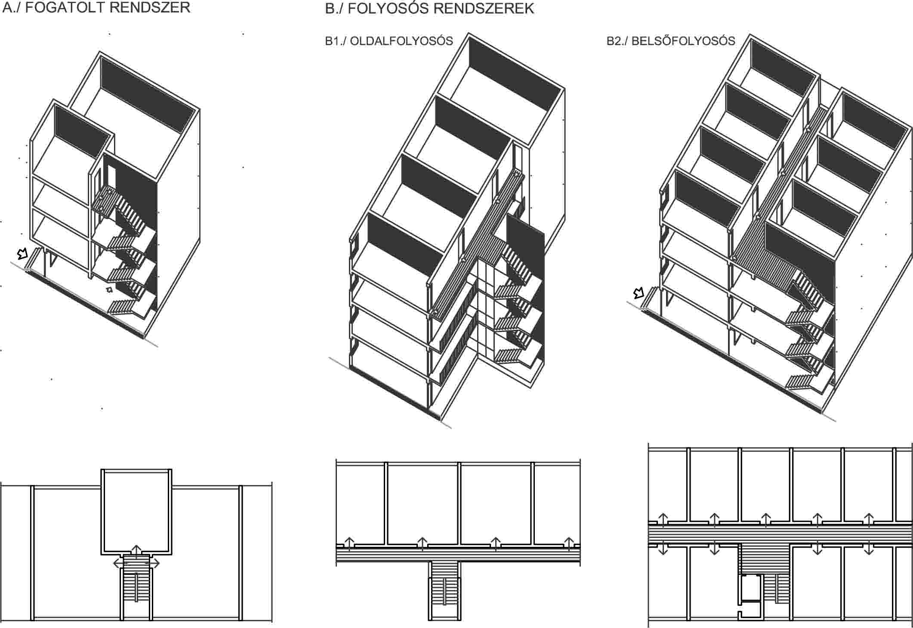

*5.26. ábra – Többszintes, többlakásos házak közös közlekedőinek rendszere*

*Folyosós* rendszernek azt az elrendezést nevezzük, amikor a lakások bejárata a függőleges közlekedőktől viszonylag távol esik, ezért a vízszintes közlekedő felület rövidebb-hosszabb folyosót képez. Az egy függőleges közlekedő mag által kiszolgált lakásszám jóval nagyobb lehet, mint a fogatolt rendszereknél. A folyosó elhelyezkedhet az épület homlokzata mentén, ebben az esetben *oldalfolyosóról* beszélhetünk, az épület belsejében elhelyezkedő folyosó *belső folyosó* ([5.26/b.](#abra_5_26) és [5.26/c. ábra](#abra_5_26)).

A fenti kategóriák határai sokszor átfednek és összemosódnak. Az *egykarú lépcső* lépcsőháza eleve folyosó jellegű, a kissé nagyobb pihenőkkel kialakított egykarú lépcsőről nyíló lakások elrendezését akár folyosós rendszernek is nevezhetjük. A több (5-6) fogatú szekcióknál igen gyakori, hogy a lépcső érkező pihenőjét kiszélesítik és az folyosószerű lesz. Nem húzható meg pontosan az a határvonal, amikor a fogatolt rendszer belső folyosóssá válik ([5.27. ábra](#abra_5_27)).

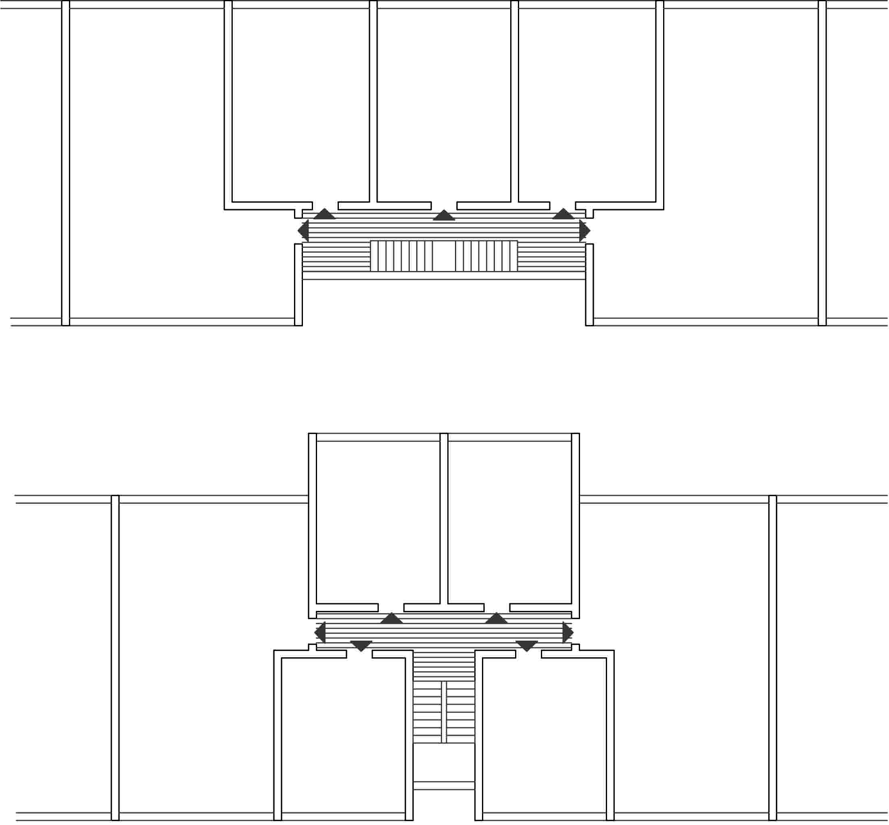

*5.27. ábra – Fogatolt és folyosós rendszerek közötti átmeneti formák*

> **Megjegyzés**
>
> Ennek csak akkor van jelentősége, ha a megnevezéshez valamilyen előírás kötődik. Például, középmagas épületeknél a zárt folyosós elrendezéshez füstmentes lépcsőházat kell tervezni, a fogatolthoz azonban nem. A „Tűzvédelmi műszaki követelmények” akkor tekintik zárt folyosónak a folyosószerűen nyújtott érkező lépcsőpihenőt, ha onnan több mint 4 lakás nyílik.

Igen gyakori a fogatolt és folyosós rendszer együttes alkalmazása is. Akkor – például – amikor kötött telekméreteket kell zártsorú formában kitölteni meglévő foghíjtelkek beépítésénél, és a telekszélesség egy lépcsőházzal kiszolgált fogatolt elrendezéshez túl széles, két szekcióhoz viszont keskeny. Ugyancsak gyakori a folyosós és fogatolt rendszer kombinálása sarokházaknál ([5.28. ábra](#abra_5_28)).

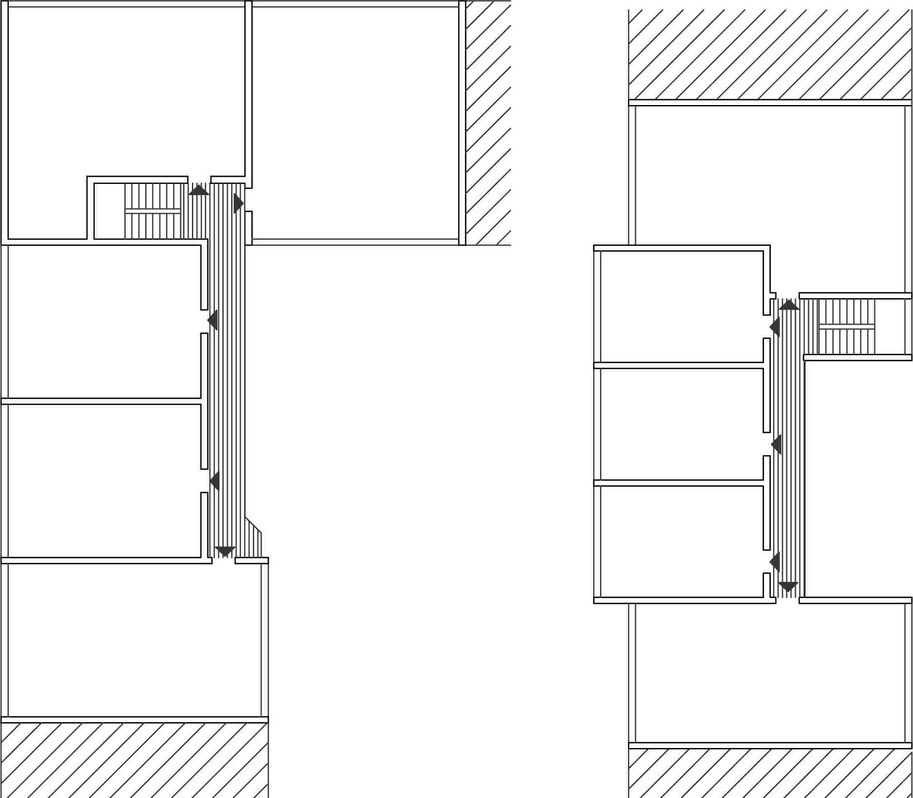

*5.28. ábra – Fogatolt és folyosós rendszerek kombinálása*

A kétféle elrendezés függőleges értelmű vegyítése is előfordul. Például, az őrzött bejárattal és portaszolgálattal rendelkező, több lépcsőházzal feltárt apartmanházaknál, ahol a lépcsőházakat a földszinten közös belső közlekedő köti össze, és az egyes „szekcióknak” nincs külön-külön bejárata. Arra is van példa, hogy a fogatolt rendszer szerint kialakított lépcsőket valamelyik felső szinten is közös, vízszintes közlekedő kapcsolja össze (pl. magas lakóépületeknél).

## 5.7. Fogatolt rendszerű lakóházak

### 5.7.1. A fogatolt rendszerű lakóházak alaptípusai

A fogatolt rendszerű lakóházak nagyságuktól függően feltárhatók egyetlen lépcsőházzal, vagy több szekcióból is állhatnak, szekciónként egy-egy lépcsőházzal.

A szabadon álló fogatolt épületek egy lépcsőházat tartalmazó formái a *pontházak*.

> **Megjegyzés**
>
> (A „pontház” elnevezést több kritika illette pongyolasága miatt, helyette a „kockaház” és „toronyház” kifejezéseket is használja a szakirodalom. Ez utóbbiak viszont az épületek magasság-szerinti kategóriáit is jelölik. Itt – jobb elnevezés híján – *pontháznak* olyan, *szabadon álló* többszintes lakóépületeket nevezünk, amelyeknek alaprajzi kiterjedése nem nagy, szélességi és hosszúsági méretei egymáshoz közeliek.)

Zártsorú beépítésben létesülő fogatolt épület egy lépcsőházat tartalmaz olyankor – és legtöbbször – ha a beépítendő telek ehhez nem túl széles.

Több szekció egyenes vonalú sorolásával *sávházak* alakulnak ki. Az egyes szekciók vízszintes elmozdításával, vagy eleve törtvonalú szekciók sorolásával törtvonalú épületformák hozhatók létre. Plasztikusan képzett, egymáshoz akár többféleképpen illeszthető szekciókkal tagolt külső tereket határoló épületformákat lehet megvalósítani. Az újjáéledt keretes beépítéseknél és foghíj-saroktelkek beépítésénél a fogatolt *sarokház* építési vonala sajátosan kialakított sarokszekció mentén fordulhat át. Zártsorú, szélesebb foghíjtelkek beépítésére több szekcióból álló fogatolt épület is szolgálhat ([5.29. ábra](#abra_5_29)).

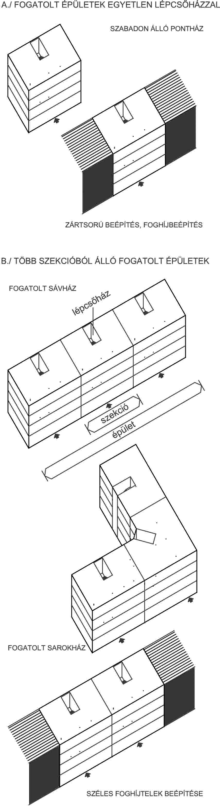

*5.29. ábra – Fogatolt rendszerű többlakásos házak alaptípusai*

### 5.7.2. Fogatolt rendszerű lakóházak szekcióinak kialakítása

A „sorolható szekció” a több szekcióból álló épület alapegysége, de alkalmazható önmagában is egy-egy különálló foghíjtelek beépítésére a zártsorú beépítési módban.

*Egyfogatú* elrendezés rendkívül ritka, mert a függőleges közlekedők kihasználtsága (költségeloszlása) kedvezőtlen. Kisméretű foghíjtelek beépítésére alkalmazható, sorolása nem szokásos ([5.30/a. ábra](#abra_5_30)).

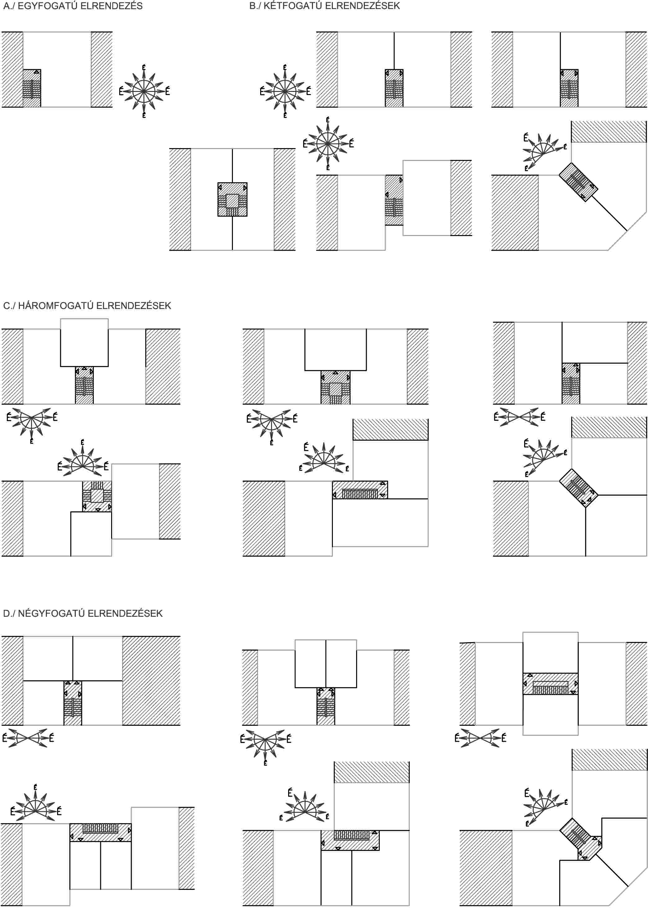

*5.30. ábra – Sorolható szekciók és sarokszekciók (példák)*

A *kétfogatú* elrendezés csak akkor gazdaságos, ha viszonylag nagy alapterületű lakásokat tartalmaz. Kedvező a lakások átszellőzése, „kereszthuzat” lehetősége a forró kánikulai napokon. A két lakás lehet azonos (tükörképi) kialakítású, de egymástól különbözhet is mind alapterület, mind alaprajzi kialakítás tekintetében.

Az [5.30/b. ábrasor](#abra_5_30) példákat mutat az egyenes vonalban sorolható, a törtvonalban sorolható és a sarokszekciók elrendezési sémáira.

A *háromfogatú elrendezés* olyan esetekben kedvező, amikor az építési program különféle alapterületű lakásokat kér. Legelterjedtebb alkalmazása az, amikor két nagyobb alapterületű lakás mellett egy kisebb létesül. (Ritkább az olyan program, amely egy nagyobb és két kisebb lakást igényel.) A nagyobb homlokzati felülettel rendelkező, háromfogatú sarokszekcióknál mód van három, viszonylag nagy lakás kialakítására is ([5.30/c. ábra](#abra_5_30)).

*A négyfogatú elrendezés* alkalmazása akkor szokásos, ha az épület lakásösszetételében a kis alapterületű lakások aránya magas. A négy kisebb lakást tartalmazó szekció inkább zártsorú foghíjtelek beépítésekor jöhet számításba, mert a csupa kislakásból álló, hosszabb sávház folyosós formája lényegesen gazdaságosabb. A három fogathoz hasonló az olyan diszpozíció, amikor két nagyobb lakás két, egészen kisméretű garzonlakást fog közre. Egykarú lépcső alkalmazása helyet teremt két nagyobb és két közepes méretű lakásnak. A sarokszekciókban jól elhelyezhetők nagyobb lakások is ([5.30/d. ábra](#abra_5_30)).

Az 5-6 fogatú, sorolható szekciók alaprajzi elrendezése már a folyosós elrendezések körével fed át ([5.27. ábra](#abra_5_27)).

*A helyszín tájolási adottságai* a fogatolt épületek kialakítását jelentősen befolyásolják. Noha a jelenleg érvényes követelmények már csak egyetlen lakószoba benapozását írják elő, ez is kizárja az olyan a lakások északi irányú tájolását, amelyeknek valamennyi lakószobája egy irányba néz. A két- és háromfogatú szekciók bármilyen tájolási adottság mellett alkalmazhatók. A keleti és nyugati homlokzattal rendelkező (É-D-i tengelyű) szekcióknál nincs tájolási gond. A K-Ny-i hossztengelyre rendezett háromfogatú elrendezést úgy kell kialakítani, hogy az egy szabad homlokzattal rendelkező lakás déli tájolású legyen.

A négy- vagy többfogatú szekciók esetén csak É-D-i irányú tengellyel helyezhető el az olyan szekció, amelynek mindkét homlokzatán vannak csak egyetlen homlokzati fallal bíró lakások.

A minimális követelmény betartásán túl arra kell törekedni, hogy a lakások minél több szobája – elsősorban a nappali szobája – benapozott legyen, és a hálószobák többsége keleti vagy déli benapozást kapjon. Az [5.31. ábrasor](#abra_5_31) olyan két- és háromfogatú szekciók fiktív sémáit mutatja példaként, amelyeknél a fent leírt tájolási szempontok érvényesülnek.

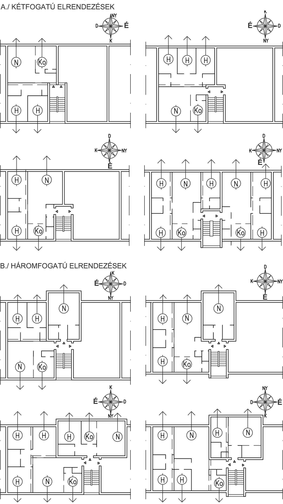

*5.31. ábra – Példák fogatolt elrendezések tájolási változataira*

Szabadon álló épületek végein olyan szekciókat kell kialakítani, amelyek a tájolási feltételeket is optimálisan kihasználják, lévén három szabad homlokzatuk. Ezek a közbensőktől teljesen eltérőek lehetnek, vagy azok módosított változatai.

> **Megjegyzés**
>
> (Ismét megjegyezzük, hogy a tájolási lehetőség csak egyike egy adott lakókörnyezeti helyzet sokrétű adottságainak. Meglévő településszövet foghíjtelke esetén gyakran elfordul például, hogy az épület jó tájolású homlokzata zajos és szennyezett levegőjű, forgalmas utcára néz, a rosszabb tájolású pedig egy szépen parkosított, csendes belső kertre. A két szempont között a konkrét adottságok eseti mérlegelésével kell dönteni.)

### 5.7.3. Fogatolt pontházak

A szabadon álló, egyetlen közlekedő magot tartalmazó fogatolt épületek (pontházak) négy szabad homlokzattal rendelkeznek, ami az alkalmazható fogatszám és lakásnagyság szempontjából lényegesen kedvezőbb, mint a sorolható szekciók esetében.

*Egyfogatú* elrendezés tervezését kikényszerítheti, ha a „városi villa” (társasház) olyan kicsiny telekre épül, hogy a beépítés kötött mértéke miatt nem lehet szintenként egynél több lakást kialakítani. Másik végletként, néhol előfordulnak olyan toronyházak is, ahol hatalmas luxus-apartmanok teljes emeletszintet foglalnak el.

*Kétfogatú* elrendezés az alacsonyabb épületeknél gyakori, főképpen olyankor, ha a telek nagysága a beépíthető alapterületnek korlátokat szab. Indokolt akkor is, ha a tervezési program igényes, nagy alapterületű lakások építésére szól.

*Három, vagy több* fogatú rendszerek gazdaságosan alkalmazhatók pontházak tervezésénél Ezek gyakran előforduló sémáit az [5.32. ábra](#abra_5_32) mutatja (a sémák konkrét épületek alapján készültek).

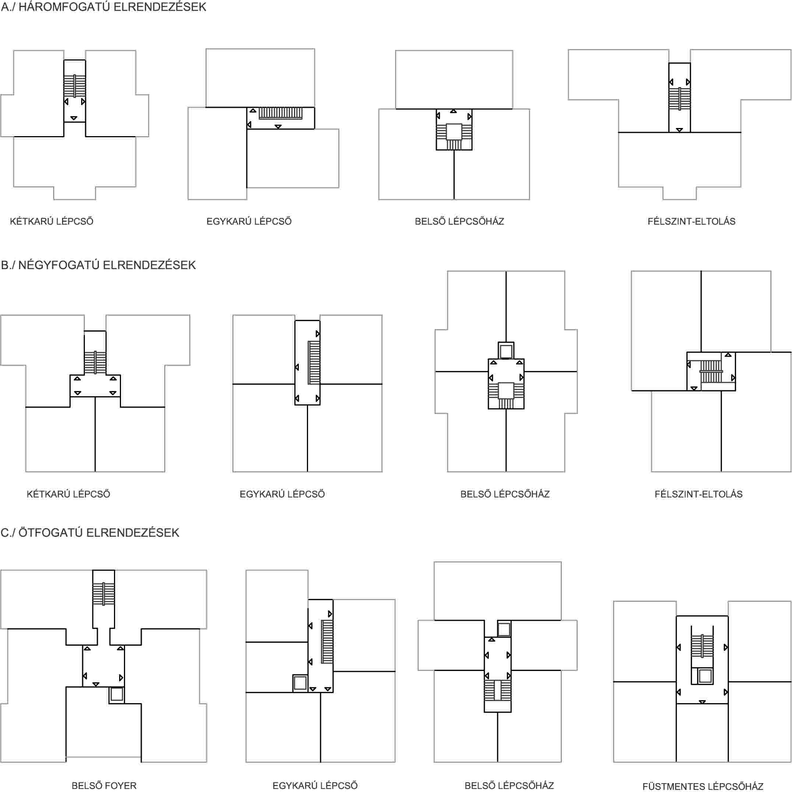

*5.32. ábra – Példák pontházak elrendezési sémáira*

### 5.7.4. A lakások fogatolt rendszerű épületben elfoglalt helyzetének, szobaszámának és alapterületének összefüggése

A fogatolt elrendezések itt bemutatott – és azon kívül még korlátlan számban tervezhető – széles skálájából a konkrét változatot az építési helyszín adottságai és a tervezési program alapján kell megválasztani. A tervezési programban általában csak az igényelt lakások nagyságát (alapterületét, szobaszámát), a különféle nagyságú lakások arányát fekteti le a megrendelő, azok térbeli szervezése a tervező dolga.

A lakások szobáit és a közvetlen, természetes világítást igénylő konyháját – nyilván – a homlokzati falak mentén kell elhelyezni. A kellően be nem világított sávba kerülhetnek az egyéb helyiségek (fürdőszoba, WC, közlekedők és tárolók). A fogatolt elrendezések lakásainak szobaszámát, kialakítását tehát döntően befolyásolja, hogy azok hány homlokzati fallal rendelkeznek az adott szekció elrendezése szerint.

Az [5.33. ábrasor](#abra_5_33) különféle lakások – nagyon vázlatos – alaprajzi sémáját mutatja. A közölt alapterületek felső határértékei kényelmesre méretezett, de még nem luxusszínvonalú lakáskategóriákra vonatkoznak.

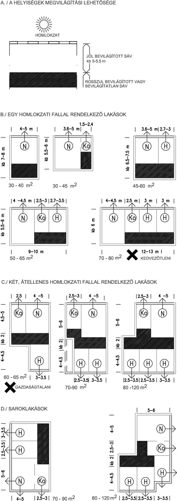

*5.33. ábra – Különböző alapterületű lakások sémái fogatolt elrendezésnél*

> **Megjegyzés**
>
> (A félméternyi méretskálával szerkesztett alaprajzi vázlatok csupán az itteni gondolatmenetet alátámasztó illusztrációk, lakástervezési példaként nem kell sem értékelni, sem felhasználni őket!)

*Az egy homlokzati fallal rendelkező lakások* jellemzően a három vagy annál nagyobb fogatszámú szekciókban fordulnak elő. Mivel a természetes megvilágítást igénylő helyiségeket csak egymás mellé lehet elhelyezni, kialakításuk csak kisebb szobaszám (legfeljebb nappali+1 háló) esetén kedvező. Ezeknek lehet belső konyhájuk is.

A két hálószobát vagy annál többet tartalmazó lakás ilyen helyzetben már igen nyújtott arányú, közlekedői hosszúak, és a vonalban sorolt lakóhelyiségek között nem jöhetnek létre szép térkapcsolatok; a nyújtott alaprajzi forma a szekcióban lévő többi lakásnak is kedvezőtlen pozíciót teremt.

*A két, átellenes homlokzati fallal rendelkező lakások* a két- és háromfogatú szekciók jellemző típusai. Ebben a helyzetben a kisebb (nappali+1 hálószobás vagy annál kisebb) lakások kedvezőtlenek, mert nem használják ki kellően az adott szituációt, és gazdaságos épületmélység esetén helyiségméreteik is aránytalanok lehetnek. Ilyen esetben legalább két hálóhelyiséges (nappali+1+1/2 háló, nappali+2 háló) vagy annál nagyobb lakások a jók.

*A két, csatlakozó homlokzati fallal rendelkező saroklakások* a sarokszekcióknál vagy a pontházaknál fordulnak elő. Ezekben egyaránt lehetnek kisebb, vagy nagyobb lakások, de az épületben elfoglalt kedvező helyzet miatt inkább nagyobb alapterületű, legalább két hálóhelyiséges lakások tervezése javasolható.

### 5.7.5. A fogatolt rendszerű lakóépületek földszintjének kialakítása

A földszint alaprajza módosítást igényel az emeletihez képest, a szekció (épület) főbejárata és az ahhoz kapcsolódó közös használatú egyéb helyiségek: a bejárati előtér és tárolók elhelyezése érdekében.

A *lépcsőház* földszinti kialakítására mutat példákat az [5.34. ábrasor](#abra_5_34), lift nélküli épületben.

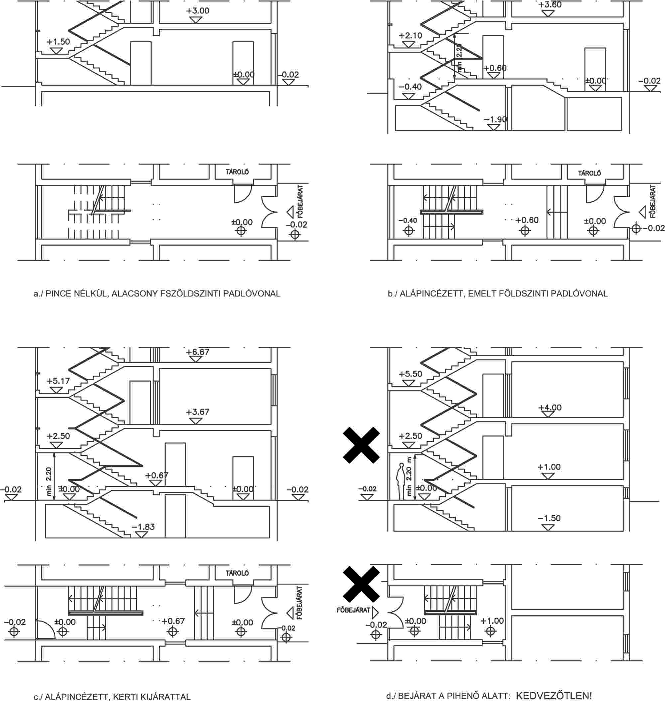

*5.34. ábra – Példák lépcsőház földszinti kialakítására*

Kedvező a lépcsőházi főbejáratnak a lépcsővel szemközti elhelyezése, mert a bejárat és lépcső között tágas, építészetileg jól megformálható előtér jön létre ([5.34./a.](#abra_5_34), [/b.](#abra_5_34), [/c. ábrák](#abra_5_34)).

A közvetlenül a lépcsőházba nyíló bejárat akkor alakítható ki a lépcső közbenső pihenője alatt, ha a földszinti padlóvonal viszonylag magas (1 méter körüli) és így a bejáratnál a 2,20 m belmagasság biztosítható. Helytakarékossága ellenére, ezt az elrendezést kerülni kell, mert a fogadótér kicsi, nyomott magasságú, építészeti szerepének betöltéséhez méltatlan. ([5.34./d. ábra](#abra_5_34)) Az épület lakásait feltáró közös közlekedők sorát hangsúlyos, az érkezőt kellően megtisztelő, tágas térrel illik indítani.

Zártsorú beépítésnél, vagy hosszabb sávház esetén, főbejárattal átellenes oldalon kerti kijárót kell tervezni. Ez nyílhat magából a lépcsőházból, ha a földszinti padlóvonal elég magas ahhoz, hogy a közbenső pihenő alatt elegendő belmagasság adódjék ([5.34./c. ábra](#abra_5_34)).

> **Megjegyzés**
>
> A bejárati szint kényelmes elérését számos élethelyzetben gátolja egy külső térben megjelenő előlépcső: pl. babakocsival, bevásárlókocsival történő beközlekedés, idősebb használók közlekedése, csomagok cipelése stb. Az épület komfortszintjének emelése érdekében nyomatékosan ajánlott, hogy a bejárat előtti külső tér és a belső előtér burkolt járószintje között legfeljebb 2 cm magasságkülönbség legyen.
>
> Az épületbe tervezett *felvonó* szintkülönbség nélküli, akadálytalan megközelítését minden esetben biztosítani kell a bejárati szinten, különben a felvonó használati értéke jelentősen csökken a házban lévő lakások értékével együtt.

> **Megjegyzés**
>
> Alapelv: erősen ajánlott minden esetben a földszinti közös területek teljes körét akadálymentesen kialakítani, hiszen a bejárat, a felvonóhoz vezető útvonal, a földszinti tárolók, a kerékpár és a babakocsi tároló, a postaládák és a kerti kijárat kényelmes és biztonságos, szintben történő elérhetősége az épületben lévő lakások komfortszintjét és így azok értékét is növeli. (P.A.)

Az [5.35. ábrasor](#abra_5_35) gyakran alkalmazott két- és háromfogatú, liftes szekciók földszintjének egyféle kialakítását mutatja sematikus formában, illusztratív jelleggel. (A tervezés során mindig a konkrét program és konkrét helyszín adottságai alapján kell kialakítani az odaillő, optimális elrendezést.)

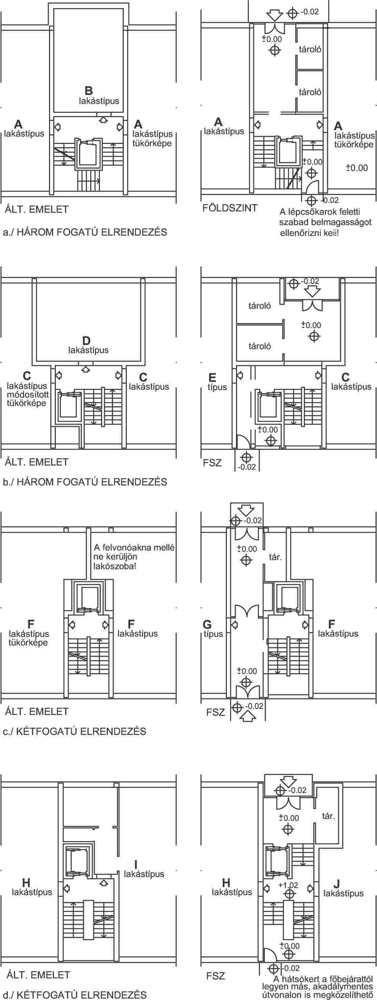

*5.35. ábra – Példák különféle fogatolt elrendezések földszintjének kialakítására*

Ha a földszinten is lakások vannak, akkor azok kialakítása – az esetek többségében – eltér az emeletitől a földszinti helyiségek helyigénye miatt. Lehet a földszinten az emeletinél kisebb, vagy kevesebb lakás. (A lakásváltozatok tervezésénél a teherhordó falak, pillérek valamint a felszálló gépészeti vezetékek kötött helyzetét, a szellőzőkürtők lehetséges helyét nem szabad elhanyagolni!)

> **Megjegyzés**
>
> A többszintes többlakásos lakóépületek földszinten elhelyezkedő lakásainál nyomatékosan ajánlott az akadálymentes kialakítás lehetőségét biztosítani: az emeleti lakásoktól jellemzően eltérő alaprajzú, a bejárati szintről szintkülönbség nélkül kényelmesen elérhető, adaptálható alaprajzú lakások kialakítása könnyen megoldható és így a létesítési költség változása nélkül bővül a speciális használói igényeknek megfelelően tervezett lakások elérhetősége a lakáspiacon. (P.A.)

*Szabadon álló pontház* esetén a bejárat elhelyezés jóval kötetlenebb, lényegében bármelyik homlokzaton lehet. Kerülni kell azonban az olyan elrendezést, amikor a bejárat a fő megközelítési iránnyal átellenes (hátsó) homlokzaton van.

## 5.8. Folyosós rendszerű lakóházak

### 5.8.1. Oldalfolyosós lakóházak

Az oldalfolyosó lehet nyitott, vagy zárt (üvegezett).

A nyitott oldalfolyosót *külső folyosónak,* a konzolos formában kialakított külső folyosót *függőfolyosónak* is szokás nevezni. *A nyitott oldalfolyosót* gyakran alkalmazzák, mert a hozzá csatlakozó homlokzat szellőzés, megvilágítás szempontjából teljes értékű. Az egymás feletti külső folyosók egymás által fedettek is, ami eső ellen védelmet nyújt. Kivétel a legfelső folyosó: ezt is érdemes lefedni föléje nyúló tetőrésszel. (A tapasztalatok szerint a fedetlen legfelső folyosót a lakók barkácsolt könnyű tetőkkel előbb-utóbb lefedik – és ezt a maguk szempontjából indokoltan teszik.) Középmagas vagy magas lakóépületek külső folyosóinál számításba kell venni, hogy sok embernek van tériszonya: az áttört folyosókorlát számukra diszkomfort-érzetet, esetleg rosszullétet is okozhat, ezért itt a közvetlen letekintést gátló mellvédet célszerű kialakítani ([5.36. ábra](#abra_5_36)).

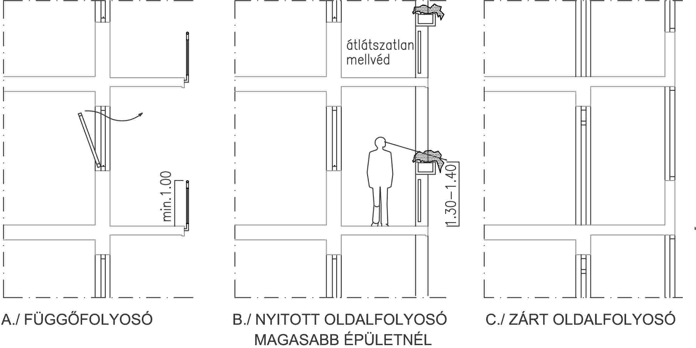

*5.36. ábra – Oldalfolyosók kialakítása*

A külső folyosóra nyíló helyiségek használati értékét csökkenti, hogy a folyosón elhaladók az ide néző ablakokon keresztül belátnak a lakásba. Ez a zavaró hatás magas parapetű ablakkal kizárható (pl. fürdőszobánál) vagy tolerálható (pl. konyhánál). Nagyon kellemetlen viszont lakószoba (hálószoba) esetén, mert azt állandóan le kell függönyözni áttetsző függönnyel, de forró nyári napokon a sarkig nyitott ablakot még az sem védheti meg a betekintéstől, vagy a rossz szándékú behatolástól.

Több, figyelemre méltó megoldás született már olyan formában, hogy az oldalfolyosót a homlokzattól elhúzták, és külön tartószerkezettel támasztották alá; a lakásokat a folyosóról rövid „hidakról” lehet elérni. Ezek az eseti megoldások érdekesek, de nem tipikusak. Helyesebb, ha a folyosóra nem nyitunk lakószobát.

A *zárt oldalfolyosó* alkalmazása ritkább. Mégis, ha az oldalfolyosóról olyan lakások nyílnak, amelyek a nappalival összevont légterű konyhával rendelkeznek, ezért a konyhák mindenképpen gépi szellőzést igényelnek, akkor megfontolandó az oldalfolyosó beüvegezése. Az üvegezett folyosó – amely sokszor épp a széljárta északi oldalon van – kedvezően befolyásolja a lakás fűtési energia-háztartását. Az így kialakult „puffer zóna” kedvező mind transzmissziós, mind a szélnyomás okozta filtrációs veszteségek csökkentésének szempontjából. Zárt folyosóra lakáshelyiséget szellőztetni nem szabad, de magának a folyosónak szellőzését biztosítani kell.

*Oldalfolyosós épületek tájolása* viszonylag szabad. É-D-i épülettengely esetén mindkét homlokzat benapozott: a folyosós oldal kiválasztása más helyszíni adottságok alapján is történhet. K-Ny-i irányú épülettengely esetén a folyosóval átellenes oldal legyen déli tájolású, mert a lakószobák ott helyezkednek el. Zártsorú foghíjtelkek beépítése esetén sokszor előfordul, hogy épp az utcai homlokzat északi, és az oldalfolyosó ide kívánkoznék, de az utca meglévő házainak homlokzatsorában megjelenő függőfolyosók eléggé bizarr látványt nyújtanak, ezért javasolt az ilyen elrendezés elkerülése, vagy a homlokzatnak a megszokottól eltérő, kivételesen gondos megformálása.

*Felvonót* kisebb szintszámú épülethez is érdemes tervezni, mert annak létesítési költségei nem emelik lényeges mértékben a lakások fajlagos építési költségét, minthogy az oldalfolyosós rendszernél – általában – a felvonó szintenként nagy lakásszámot (nagy összes lakásterületet) szolgál ki. Gyakran a nagyobb használói létszám önmagában is indokolja a legalább 8 férőhelyes lift létesítését, ami kerekesszékkel és gyermekkocsival történő igénybevételre is alkalmas, ezért betervezése akkor is erősen ajánlott, ha a kiszolgált használói létszámhoz kisebb felvonó is elég lenne egyébként. Ilyen felvonó létesítése esetén a vízszintes közlekedés legyen akadálymentes, mind a földszinten, mind az emeleteken.

*Az oldalfolyosó* szélességi méretének alsó határértékét a törvényi követelmények jelenleg 1,10 m-ben rögzítik, ennek ellenére 1,20 m-nél keskenyebb folyosó tervezése indokolatlan. A kerekesszék befordulásához 1,50 m szélességi méret szükséges, ezért tekintsük ez utóbbit mérvadónak, ha az épületben akadálymentesen használható lift van. A folyosó hosszúsági méretét régebben úgy szabályozták, hogy a legtávolabbi lakás bejárata nem lehetett 30 m-nél messzebb a lépcső érkező járóvonalától. Ezt – mint javasolt szélső értéket – ma is elfogadhatjuk. Ma az oldalfolyosó hosszát a tűzrendészeti szabályzatban foglalt „kiürítési idő” számítása szerint kell meghatározni. Az előírt kiürítési idő az egész épületre – mint tűzszakaszra – vonatkozik, így a kiürítési útvonal hosszát nem szintenként, hanem az épület egészére vonatkoztatva határolja le. Ezért az egyes szintek folyosóinak legnagyobb hosszúsága és legkisebb szélessége – áteresztő képessége – az épület magasságától és a kiszolgált használói létszámtól is függ.

*A lépcsőház* hosszabb folyosó esetén lehetőleg annak súlypontja körül legyen. Csatlakozhat a folyosó külső felületéhez, de elhelyezkedhet a lakások közé ékelve is ([5.37. ábra](#abra_5_37)). Középmagas épületnél *füstmentes lépcsőházat* kell kialakítani. Sok lakást tartalmazó, középmagas épületnél előfordul, hogy a kiürítési idő betartása miatt második – menekülő – lépcsőt kell létesíteni. Ez magas lakóépület esetén kötelező. **A két lépcső közül csak egyiknek kell füstmentesnek lennie.**

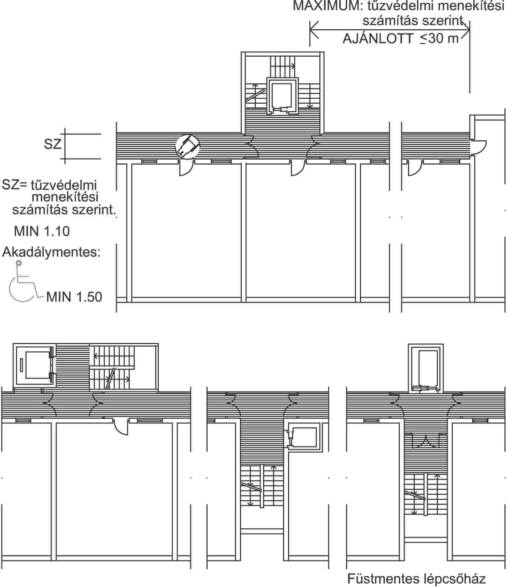

*5.37. ábra – Példák függőleges közlekedő mag kialakítására oldalfolyosós lakóházaknál*

### 5.8.2. Belsőfolyosós lakóházak

A *belsőfolyosó* az épület belsejében kialakított zárt közlekedőtér. Bizonyos épület-elrendezéseknél kialakulhat *kettős belső folyosó* (amikor két, párhuzamos folyosó között a függőleges közlekedőket és egyéb, nem lakás célú helyiségeket tartalmazó, nyújtott alaprajzú „belső mag” létesül), a szimmetriatengelyben futó belső folyosót a szaknyelv *középfolyosónak* is nevezi.

Minthogy belsőfolyosós elrendezésnél mindkét homlokzaton csak egy irányba néző lakások vannak, magának az épületnek tájolási lehetősége is igen kötött: a folyosó tengelye csak É-D – vagy ahhoz közeli – irányú lehet.

A belső folyosó szellőzéséről gondoskodni kell, ez lehetőleg történjék a folyosók végein, és/vagy a hozzá oldalról csatlakozó közlekedő tereken lévő ablakokon keresztül. A kellő természetes szellőzéssel nem rendelkező belsőfolyosók gépi úton is szellőztethetők, a tűzvédelmi előírások ilyenkor nagyteljesítményű füstelszívó berendezések létesítését is kötelezővé teszik. A gépi szellőzés jelentős energiafogyasztást okoz, üzemeltetési költségei magasak. A viszonylag hosszú folyosó végén, vagy ahhoz oldalról csatlakozó közlekedőkön lévő nyílászárók a kellő mértékű megvilágításához gyakran nem elegendőek, ilyenkor napközben is mesterséges megvilágításra van szükség, ami energia-felhasználás miatt igen kedvezőtlen. A természetes úton kellően nem bevilágítható és szellőztethető belsőfolyosók tervezését kerülni kell.

A belsőfolyosók hosszát, szélességi méretét ugyancsak a kiürítési számítás szerint kell meghatározni. Belsőfolyosó szélességei mérete ne legyen **1,50 m-nél kevesebb**, de legalább 1.80 m szélesség javasolt akkor is, ha ezt az előírások nem kérnék. (A keskeny belsőfolyosók a szűkösség nyomasztó érzetét keltik.) A lakások bejárati ajtói mindig *befelé* nyíljanak, mert a kiürítési útvonalba beálló ajtószárnyak a kiürítési útvonal szélességi méretét csökkentik. (A kiürítési útvonalon lévő ajtóknak a menekülés iránya felé akkor kell nyílniuk, ha a kiürítési létszám az 50 főt meghaladja. Nyilván, egy lakásból sohasem kell 50 főt menekíteni.)

### 5.8.3. A lakások folyosós rendszerű épületben elfoglalt helyzetének, szobaszámának és alapterületének összefüggése

A folyosós elrendezéseknél a közlekedő rendszer kihasználtsága, gazdaságossága miatt előnyös, ha a folyosó minél nagyobb számú lakást, illetve minél nagyobb lakásalapterületet szolgál ki. Az [5.39. ábra](#abra_5_39) a különféle nagyságú lakásokat folyosós rendszerű épületben elfoglalt helyzetük gazdasági vonzata alapján hasonlítja össze. A lakásméretek itt is egy átlagosnak mondható igényszinthez tartoznak.

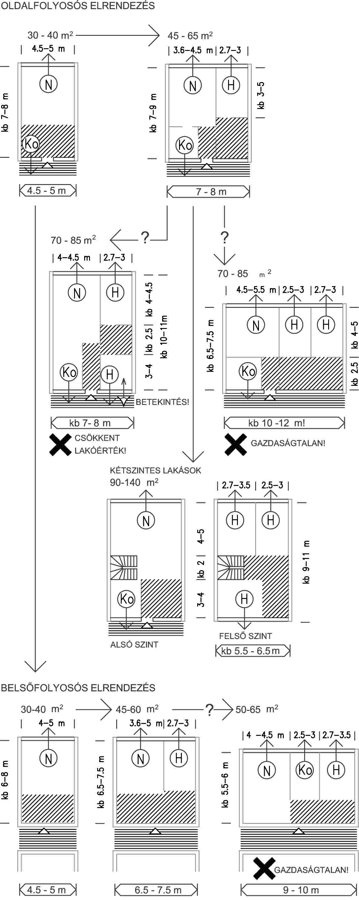

*5.39. ábra – Különféle alapterületű lakások sémái folyosós rendszereknél*

A legelőnyösebbnek az *egyszobás lakások* mutatkoznak a közlekedő által kiszolgált lakásszám tekintetében, mert szélességi méretük nem haladja meg a 4.5 – 5 métert. Az *oldalfolyosó* gazdaságos kihasználást hátráltatja az a tény, hogy az egyszobás lakások kicsiny alapterülete (30–40 m2) miatt az épületmélység is kicsi: 7–8 m-nél nemigen lehet nagyobb. A kisebb épületmélység fajlagosan nagy homlokzatfelületet (magasabb létesítési és fűtési költségeket) jelent. Az egyszobás lakások belső konyhával is kialakíthatók, nem igényelnek feltétlenül ablakot a folyosó felőli oldalon, ezért a *belsőfolyosós* elrendezésénél adódik a legkevesebb járulékos közlekedő terület. A belsőfolyosós elrendezés 14–18 m-es épületmélységénél a fajlagos homlokzatfelület igen kicsiny, és az egységnyi folyosófelülettel kiszolgált *lakás-alapterület* is nagyon kedvező arányt mutat. Abban az esetben, ha egy építési program csupa egyszobás lakásból álló épületet kér (garzonházak, otthonházak) akkor annak leggazdaságosabb közlekedő rendszere a belsőfolyosós elrendezés.

> **Megjegyzés**
>
> Megfontolandó azonban az a tény is, hogy a belsőfolyosós lakóházakat a lakók sokkal kevésbé kedvelik, mint az oldalfolyosósakat. Ez a gazdaságosságra is hat: lehet, hogy egy oldalfolyosós ház létesítése többe kerül, de a lakások ingatlanforgalmi értéke nagyobb lesz, mint ami belsőfolyosós elrendezés esetén adódik. Piaci lakásviszonyok között a gazdaságosság nemcsak a kisebb létesítési költségeken múlik, hanem egyéb „marketing” szempontokon. Itt a gazdaságosságot csak a létesítési költségek vonatkozásában hasonlítjuk össze.

*A nappali+1 hálóhelyiséges* (másfél, kétszobás) lakásoknak a folyosóval átelleni falon lévő szobái együttesen 7–8 méternyi lakásszélességet adnak, ami még kedvezőnek mondható. A konyha a külsőfolyosó felől természetes megvilágítást és szellőzést kaphat. Másfél-kétszobás lakások feltárására a külsőfolyosós elrendezés jól alkalmazható. Az oldalfolyosós elrendezésnél adódó 8–9 m-es épületmélység még éppen elfogadható. Ez a lakáskategória is belsőfolyosós épületben helyezhető el leggazdaságosabban akkor, ha közvetlen természetes szellőzésű és megvilágítású konyhára nincs megrendelői igény. Ha a kétszobás lakás közvetlen, természetes fénnyel megvilágított konyha igényével párosul, akkor a belsőfolyosós lakás szélessége elérné a 9–10 m-t, ami a közös közlekedők kihasználtságát igencsak megkérdőjelezné (pl. 30 m hosszú belsőfolyosóval mindössze hat lakás lenne feltárható).

*A nappali+2 hálóhelyiséges* (2+1/2, 3 szobás) vagy annál nagyobb lakások elhelyezése hagyományos folyosós rendszereknél már kritikussá válik. Külsőfolyosós elrendezésnél elfogadható szélességű lakás csak akkor adódik, ha egyik hálószoba a folyosóra néz. Ennek hátrányait az előzőkben már részleteztük. Ha folyosóra néző szobát nem tervezünk, akkor egy homlokzaton három szoba sorolódik, a lakás szélessége eléri a 10-12 m-t, és a folyosó felőli oldalon lévő kiszolgáló helyiségek vagy feleslegesen túlméretezettek lesznek, vagy képtelenül kis épületmélység alakul ki.

Folyosós rendszerek *hagyományos* formái csak a kisebb, két szobásnál nem nagyobb lakásokhoz alkalmazhatók gazdaságosan. Ez – természetesen – csak irányelv, mert konkrét esetekben árnyaltabban érvényesül. Olyankor – például – amikor viszonylag rövid oldalfolyosó mindkét végén egy-egy nagyobb lakás létesül, amelyeknek hálószobája már a folyosó felőli homlokzat felé is nézhet, vagy az épület tengelyének irányába is megnyitható. Gyakran alkalmaznak folyosós rendszert nagyobb lakásokat tartalmazó apartmanházaknál is, mert a szállodákhoz hasonló üzemeltetés lehetősége a gazdaságosság általános esetben érvényes szempontjait felülírja (pl. a folyamatos portaszolgálat miatt megkívánt egyetlen bejárat).

Keskeny, mégis nagy alapterületű lakások kétszintes („duplex”) formában alakíthatók ki, amint azt a kétszintes sorházak tárgyalásánál már láttuk. Ilyenek folyosós rendszereknél is alkalmazhatók. Ekkor csak minden második szinten van folyosó, és a lakások két szintjét lakás belsőlépcső köti össze. Az emeleti helyzetű kétszintes lakások szaknyelvi elnevezése: „maisonette” ([5.40. ábra](#abra_5_40)). Kétségtelen, hogy a belső lépcsők a lakások költségét emelik, de azt többé-kevésbé ellensúlyozza a kevés közlekedővel kialakítható tömör alaprajz és a közös közlekedőfolyosók számának felezése. A maisonette rendszer a teljes lakás akadálymentes használatát kizárja.

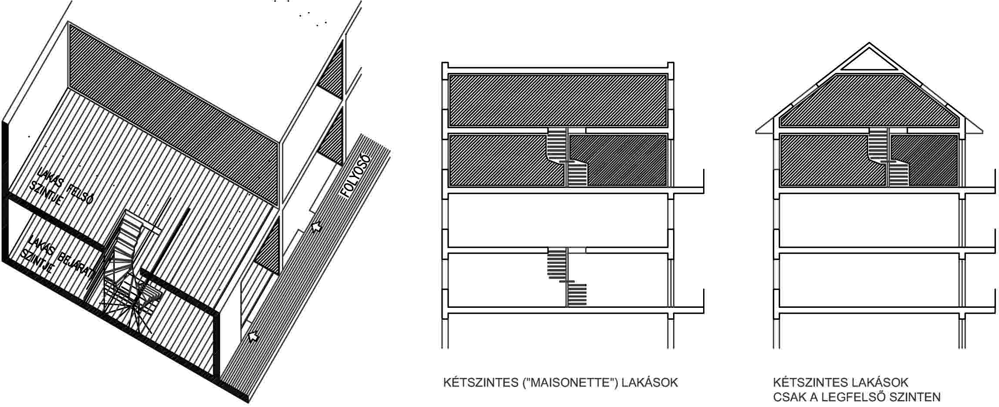

*5.40. ábra – Oldalfolyosós elrendezés, kétszintes lakásokkal*

Hagyományos, oldalfolyosós elrendezéseknél is gyakran létesítenek duplex lakást a legfelső szinten, tetőterek beépítésére.

### 5.8.4. Összetett térbeli elrendezésű folyosós épületek

A nagyobb lakások folyosós feltárására igen sokféle (néha igen bonyolult) térbeli rendszerek alakultak ki az ötvenes-hatvanas évek nyugat-európai lakásépítészetében, minden bizonnyal annak az ideológiának a hatására is, amely akkor a magas lakóépületeket preferálta. (Magas épületek fogatolt rendszerben nem gazdaságosak.)

A kétszintes lakáshoz alkalmazott *belsőfolyosós* rendszer egy, építészetileg szép példáját Le Corbusier fejlesztette ki az „Unité d´Habitation”-hoz ([5.41.a. ábra](#abra_5_41)).

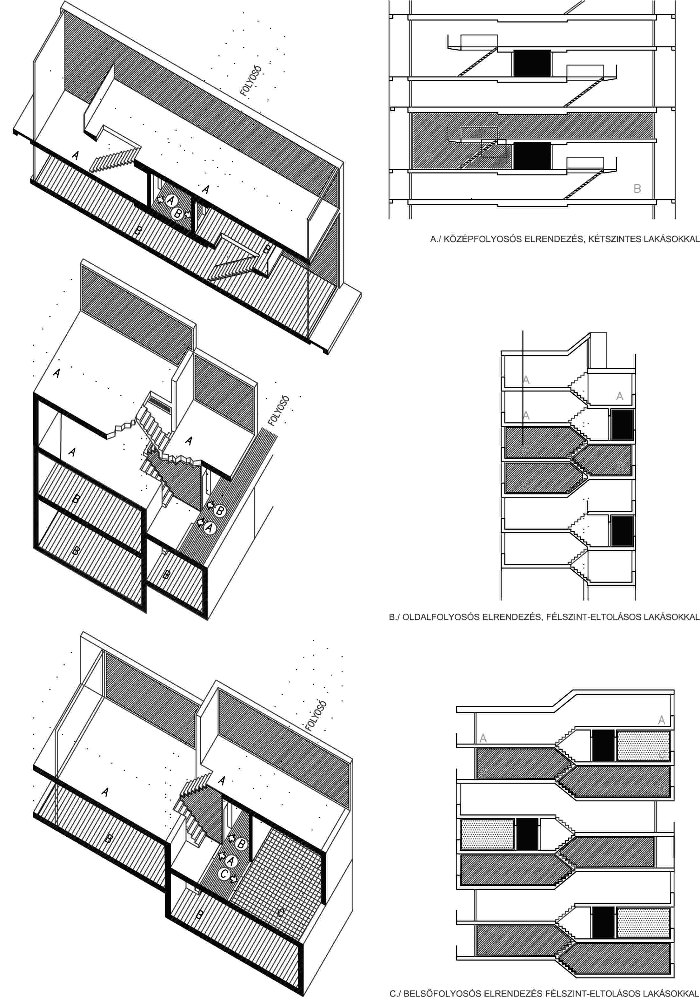

*5.41. ábra – Folyosós rendszerek összetett térbeli elrendezéssel (példák)*

A folyosós rendszer lakásai lehetnek félszinteltolásúak is, amelynek egy oldalfolyosós sémáját az [5.41.b. ábra](#abra_5_41) mutatja. A belső folyosóról nyíló félszinteltolásos („semi-duplex”) lakások és egyszintes lakások vegyítésével alakul ki az a bonyolult térbeli elrendezés, amelyet az [5.41.c. ábra](#abra_5_41) mutat.

Az építészetileg izgalmas belső térkapcsolatok ellenére a „semi-duplex” lakások nagy hiányossága, hogy akadálymentes használatuk teljességgel kizárt, és a lakók az állandó lépcsőjárást sem kedvelik igazán.

Az eredetileg magas lakóházakhoz kifejlesztett, összetett térbeli elrendezésű folyosós rendszereket ritkábban alkalmazzák mostanában, mert ma már a szakma is az alacsonyabb lakóépületeket tekinti kedvezőbbnek. A korábban tervezési bravúrt jelentő, néha agyafúrtságig bonyolult térbeli elrendezéseknek sem lehetősége, sem oka nincsen kisebb szintszámú épületeknél.

## 5.9. A lakások külső térrel való kapcsolata többszintes lakóházaknál

A többszintes lakóépületek emeleti lakásainak közvetlen kertkapcsolata – nyilván – nem lehet, de a környezetükkel való kapcsolatuk fontos tervezési szempont. A környezettel való *vizuális* kapcsolat minőségét figyelembe kell venni a lakóterek ablakainak elhelyezésénél. Az ablakból adódó kivételesen szép – vagy ellenkezőleg: csúnya – látvány sokszor a tájolás konvencionális szempontjainál nagyobb fontosságot nyerhet a mentális komfortérzetre gyakorolt hatása miatt.

Az emeleti lakásoknál is beszélhetünk a külső és belső terek közötti átmeneti térről és a külső térbe kiterjedt lakótérről.

*A „francia erkély”,* vagy más néven „francia ablak” padlóvonalig érő, teljes magasságában nyitható (védőkorláttal ellátott) ablak. Nyitott állapotában a szoba terének néhány négyzetméterét „átmeneti térré” változtatja, a belső és külső tér kapcsolatát intenzívebbé teszi, mint a csak kitekintésre szolgáló ablakok ([5.42.a. ábra](#abra_5_42)).

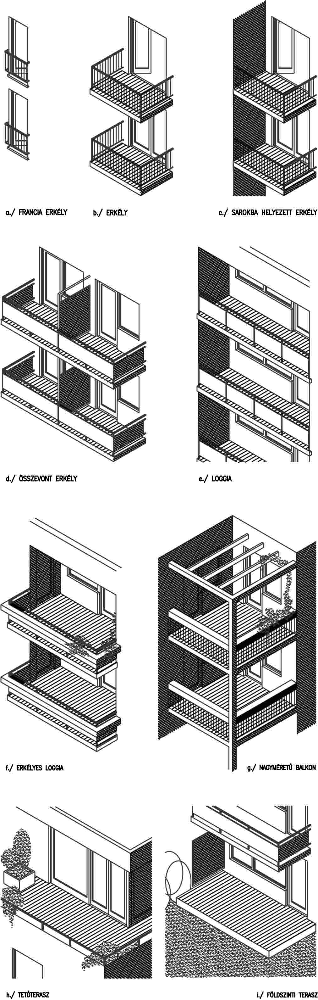

*5.42. ábra – Külső térrel való kapcsolat többszintes lakóházaknál*

*Az erkély* lakáshasználati szempontból a belső térnek a külső térbe való kiterjesztésére szolgál. Az erkélyt úgy kell méretezni, hogy minél nagyobb használati értéke legyen: nyugágyat, gyermekjárókát lehessen oda kitenni, akár reggelizni lehessen ott stb. Mivel az erkélyen kisgyermek is tartózkodhat, a korlátot úgy kell kialakítani, hogy azon a gyermek felkapaszkodni ne tudjon. A jól használható erkély szélességi mérete legalább 1,50 m.

Az erkélyek használatát zavarhatja a szomszéd néhány méterre lévő erkélyéről való átlátás. Néha az erkélyeket oldalról paravánszerű, átlátást gátló elemekkel is ellátják, amelyek egyben a széltől is védenek. Ezek praktikusak, de építészeti hatásuk sokszor kedvezőtlen. Tagoltabb épületkontúr esetén jobb az erkélyt olyan sarokba helyezni, ahol a vizuális védelem és a szél elleni védelem magától adódik ([5.42.c. ábra](#abra_5_42)).

Néha – többnyire homlokzatformálási megfontolásból – a szomszéd lakások erkélyeit közvetlenül egymás mellé helyezik, összevonják ([5.42.d. ábra](#abra_5_42)). Az ilyenkor nélkülözhetetlen elválasztó paraván vizuális védelmet ad ugyan, de akusztikai védelem szempontjából hatástalan. Az összevont erkély tervezését érdemes elkerülni, már csak azért is, mert a homlokzati rendszer és a belső térrendszer diszharmóniája itt azonnal tetten érhető: az erkély formája egységesnek színlel két olyan tércsoportot, amelyek valójában elkülönítettek.

*A loggia* az épület homlokzati síkja mögé visszahúzott, fedett, de egyik oldalán teljes szélességében felnyitott „átmeneti tér” ([5.42.e. ábra](#abra_5_42)). Előnye, hogy vizuálisan védett, hátránya viszont, hogy a mögötte lévő terek benapozási időtartamát csökkenti az oldalfalak árnyékoló hatása, és szerkezeti kialakításuk is bonyolultabb, mint az erkélyé. A loggiát erkély is kiegészítheti, a kettő kombinálásával létesített szabad téri tartózkodó mérete nagyobb lehet, mintha az csak erkély lenne, amelynél a konzolos lemez kiülése tartószerkezeti szempontok miatt nem növelhető korlátlanul ([5.42.f. sz. ábra](#abra_5_42)).

Egy erkély vagy loggia homlokzattal párhuzamos méretei kötetlenek, de a túl hosszú erkélyek és loggiák nem használhatók ki az alapterületükkel arányosan. Használati szempontból kedvezőbbek a rövidebb, de mélyebb erkélyek és loggiák. A homlokzatra merőleges méretüket azonban behatárolja a mögöttük lévő helyiségekre gyakorolt árnyékoló hatásuk. A helyiségek megvilágításának mértéke a bevilágító felület felső záródásának magasságától (is) függ. A nagy kiülésű erkélyek és nagy mélységű loggiák akadályozhatják mögöttük lévő terek vagy tér-részek jó bevilágítását ([5.43. ábra](#abra_5_43)).

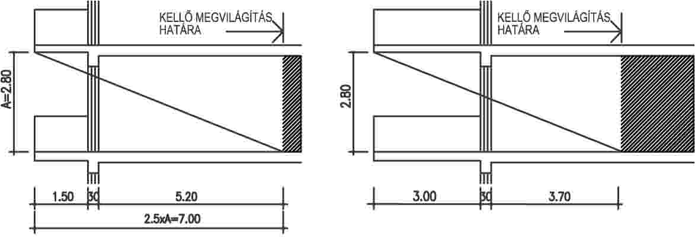

*5.43. ábra – Az erkély szélességének hatása a helyiségek megvilágítására*

Lehet azonban a külső tartózkodó olyan helyzetben, hogy a mögötte lévő helyiség mélységi mérete kicsi, vagy a csökkent bevilágítási mérték a helyiség használatát nem zavarja (pl. étkező), vagy másik ablakkal jól bevilágítható a külső tartózkodó felé néző nyílászáróin kívül ([5.44. ábra](#abra_5_44)). Ilyenkor nagyméretű emeleti balkonok alakíthatók ki, amelyek igen jól használhatóak, akár étkezésre, sőt vendégfogadásra is igénybe vehetők, de csak nagy alapterületű, tágas lakáshoz valók.

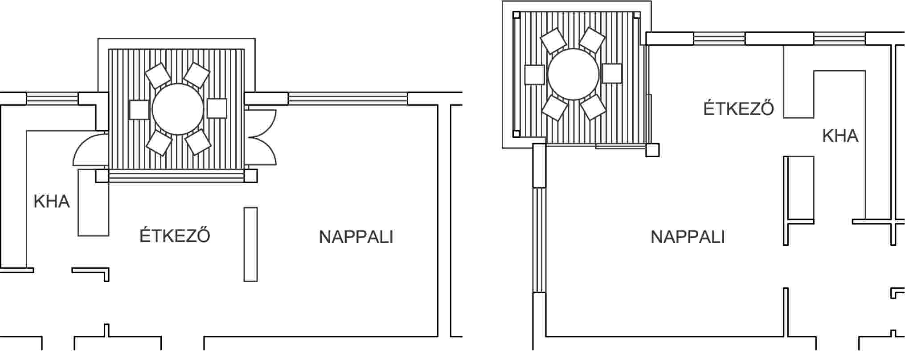

*5.44. ábra – Példák nagy mélységű emeleti balkonok elhelyezésére*

*Tetőteraszok* a legfelső lakószint alapterületének csökkentésével alakíthatók ki ([5.42.h. ábra](#abra_5_42)). (Az alapterület-csökkenés lehetőleg *kevesebb* lakást jelentsen, mintsem ugyanannyi, de kisebb lakást!) Ezeknek nyilván nincs árnyékoló hatásuk, napfényesek, zöldtetővel kiegészülve szinte a kertes lakás teraszával egyenértékűek. A visszahúzott legfelső szint szerkezeti kialakítása sokszor gondot okoz. Például hosszfalas elrendezésnél csak akkor lehetséges, ha a terasz szélessége megegyezik a traktusmélységgel. Pillérvázas szerkezetnél kialakítható tetőteraszra változatokat mutat az [5.45. ábra](#abra_5_45).

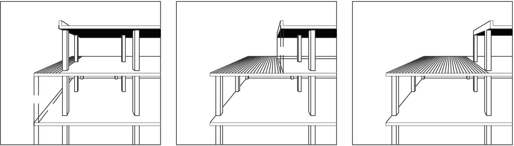

*5.45. ábra – Tetőteraszok kialakításának sémái pillérvázas épületeknél*

*Földszinti teraszok* olyankor létesíthetők, ha az épületnek kertkapcsolata van. Ilyenkor a földszinti lakás használati értéke nagyobb, és ez a többlet a piaci árban is megjelenik. A közösen birtokolt telek tagolása privát és közösen használt részekre itt is ugyanúgy lehetséges, ahogyan azt a 4. fejezetben tárgyaltuk.

Földszinti teraszok létesítésénél a hozzájuk csatlakozó külső tér csak egy szűkebb lakóközösség által használható terület lehet. A lakótelepeken létesített, nyilvános használatú külső terekhez csatlakozó földszinti teraszokat a bizalmatlan lakók sokszor magas kerítéssel kerítik el vagy az üvegfalak elé ijesztő rácsozatokat létesítenek. Az ilyen torzulások oka nem(csak) a lakó alacsony színvonalú lakáskultúrája, hanem a közvetlen lakókörnyezet és a környezettel létesített kapcsolat hibás megtervezése.

*A földszint külső térrel való kapcsolata* a csatlakozó tér használatának jellegétől függ. A többszintes, többlakásos épületek esetében – a városszerkezeti elhelyezkedéstől függően – a használati jelleg teljes skálája előfordulhat. A csatlakozó tér lehet közterület, nyilvános használatú terület, közös terület, privát terület („public, semi-public, semi-private, private”).

Az eszerint megkülönbözetett külső térhez való kapcsolatok változatait az [5.46. ábra](#abra_5_46) mutatja.

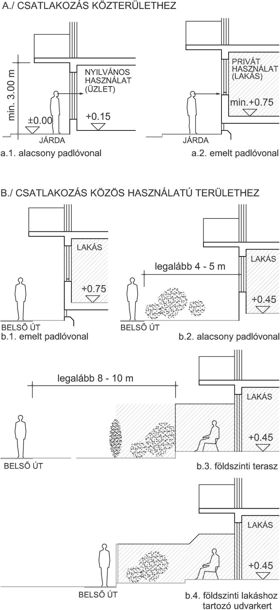

*5.46. ábra – Többlakásos ház földszintjének kapcsolata a külső térrel*

A közterülethez vagy nyilvános használatú területhez csatlakozó földszinti lakások padlóvonalát olyan magasra kell emelni (min 0,75 m), hogy járókelők az ablakokon keresztül a lakásba közvetlenül ne láthassanak be.

A közös (kizárólag egy lakóközösség által használható) területhez való kapcsolódás mikéntje a lakóközösség létszámától, összetételétől, és együttműködésének jellegétől függ. Nagy létszámú és laza szomszédsági viszonyban élő lakóközösség esetében a földszinti lakások fokozott vizuális védettséget kívánhatnak, míg a szorosabban együttműködő, egymás privát életét kölcsönösen tiszteletben tartó kisebb használói csoport esetében ez nem szükséges. A földszinti lakásokhoz tartozó teraszoknak és privát használatú kert-részeknek csak ilyen esetben van létjogosultságuk. Ennek ellenére, a telek belső úthálózatát úgy kell kialakítani, hogy a közös terület használata ne kényszerítse ki a lakások vizuális zavarását.

## 5.10. Teraszházak

A teraszház olyan többszintes, többlakásos lakóépület, melynek lakásaihoz (vagy lakásai nagy részéhez) közvetlenül csatlakozik nagyméretű tetőterasz.

> **Megjegyzés**
>
> (A korábbi magyar terminológia szerint csak a *lejtős terepre* lépcsőzetesen épített házat neveztük teraszháznak. A mai, külföldi szakirodalomban a fenti definíció szerinti meghatározás érvényes, amely szerint lehetnek sík terepre épülő teraszházak is.)

*A lejtős terepen létesített teraszházak* szintjei a lejtő emelkedésének irányában lépcsőzetesen visszahúzva sorolódnak. A lakások padlószintjének egyik része alatt maga a talaj, másik része alatt egy szomszéd lakás helyezkedik el. A visszalépcsőző szintek előtt egy lapostetős sáv alakul ki, amely lehet teljes egészében tetőterasz, vagy tetőterasz és zöldtető kombinációja.

*A visszalépcsőzés* *mértéke* – a tetőterasz szélessége – a terep lejtésének mértékével összefügg ([5.47. ábra](#abra_5_47)). Az elvi geometriai összefüggés szerint a tetőteraszok peremére fektetett sík és a terep síkja párhuzamos. Enyhébben emelkedő lejtők esetén mélyebb tetőteraszok, és ennek megfelelően a lejtőre merőleges irányban szélesebb lakásegységek alakíthatók ki. Meredekebb lejtőnél mind a tetőterasz mélysége, mind a lakásegység lejtőre merőleges mérete kisebb lehet. Ez az elvi összefüggés a valóságban sohasem érvényesül tisztán: részben azért, mert a terep lejtése ritkán egyenletes mindenütt, másrészt azért, mert a terepre illesztést a gépkocsitárólók kialakítása, a megközelítés lehetősége is befolyásolja, és az eredeti terepfelszín több-kevesebb módosítását igényli ([5.48. ábra](#abra_5_48)).

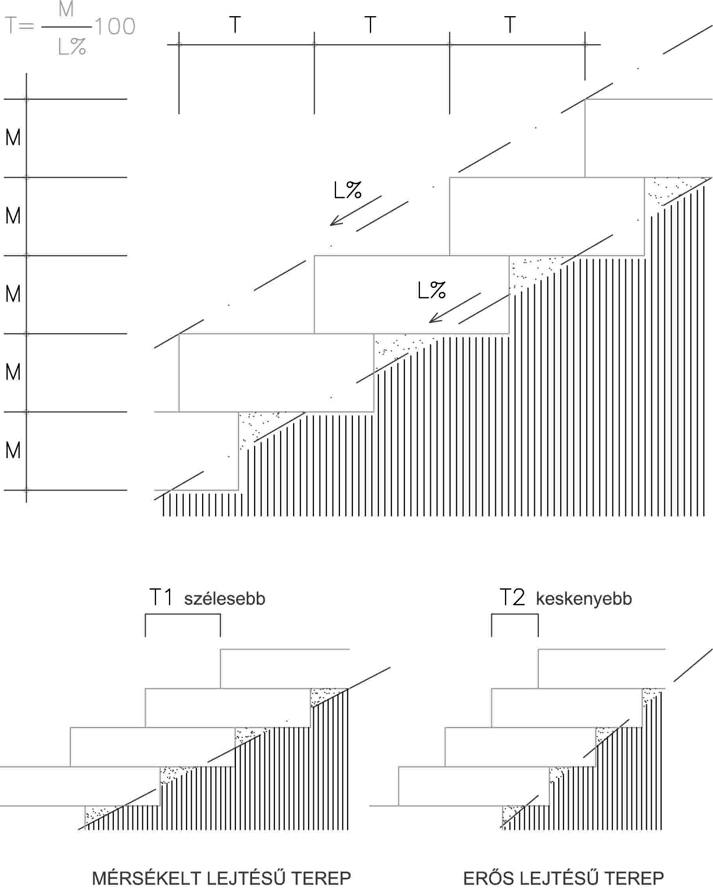

*5.47. ábra – A tereplejtés mértékének és a teraszok méretének geometriai összefüggése*

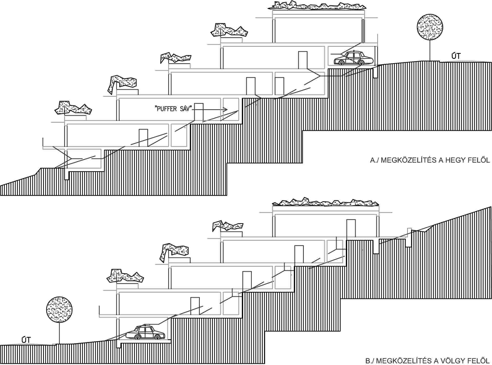

*5.48. ábra – Teraszházak terepre illesztése (fiktív sémák)*

*A lakásegységek megközelítése* legtöbbször tereplépcsőről történik. Egyenes vonalban sorolt tereplépcső-karok csak a tereplejtés bizonyos határértékéig alkalmazhatók. Ekkor a lépcsőkar és a szintenkénti pihenő együttesen kb. max. 47%-os lejtőre illeszkedik ([5.49.a. ábra](#abra_5_49)). Nagyobb tereplejtés esetén többkarú tereplépcsők alkalmazhatók ([5.49.b–d. ábra](#abra_5_49)). A lépcsőről vagy csak egyik oldalon nyílnak lakások (egysávos feltárás), vagy mindkét oldalon (kétsávos feltárás). A tereplépcsők lehetnek üveggel fedettek is.

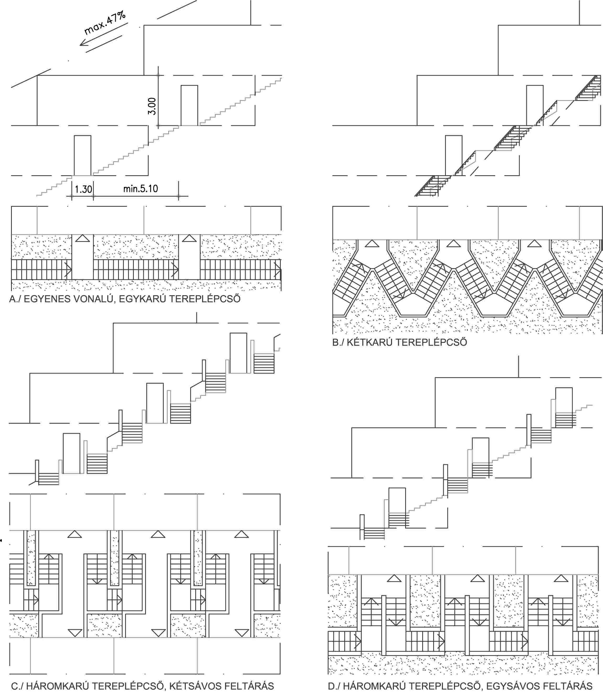

*5.49. ábra – Teraszházak tereplépcsőjének kialakítása*

*A tetőteraszok vizuális védelme* fontos tervezési szempont, ugyanis a lépcsőzetesen eltolt tetőteraszokra zavaró átlátás adódik a felettük lévő szintekről. Ennek elkerülésére a terasz-mellvéd olyan kialakítása szolgálhat, amelynél szélesebb virágvályú korlátozza a letekintés látószögét. Mélyebb tetőteraszoknál ezt a funkciót zöldtető-sáv is teljesítheti ([5.50. ábra](#abra_5_50)).

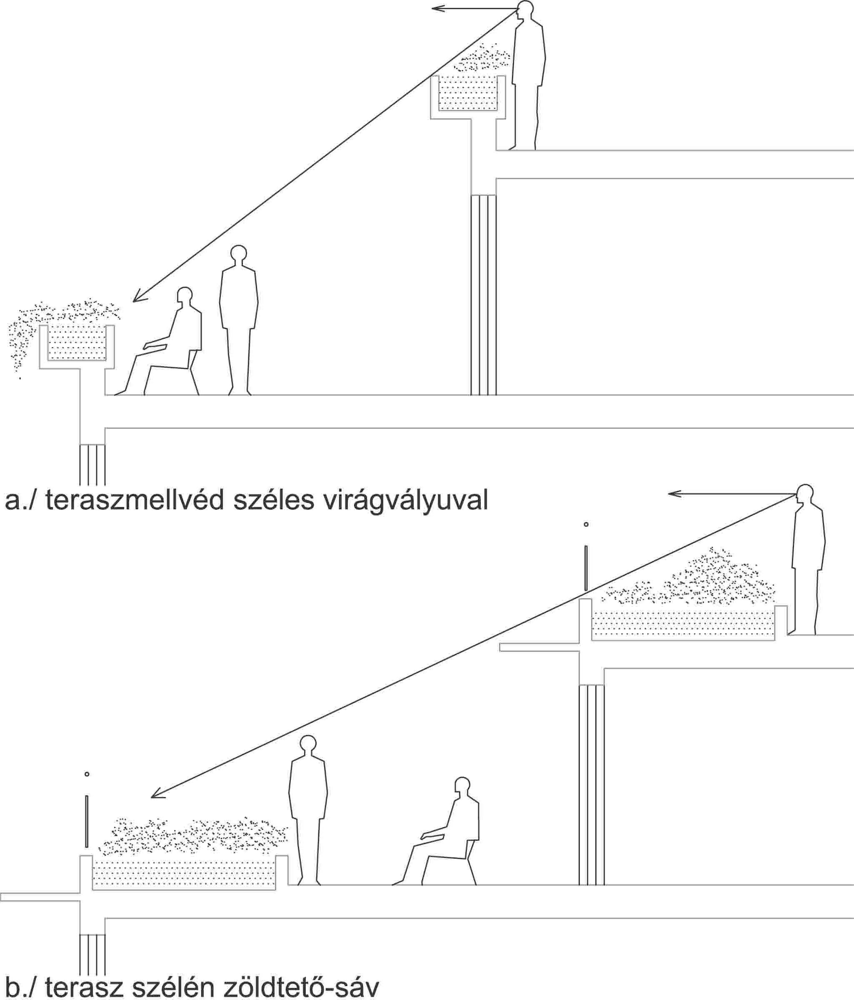

*5.50. ábra – Tetőteraszok közötti letekintés gátlása*

*A lejtős terepre illesztett teraszházak gyakrabban alkalmazott sémái* a lejtőre merőleges irányban mélyebb, vagy a lejtővel párhuzamos méretükben szélesebb elrendezések ([5.51. ábra](#abra_5_51)). Előbbi eset vagy a viszonylag keskenyebb telekméretből adódik, vagy a mérsékeltebb tereplejtés miatt szükséges. Alacsonyabb hajlásszögű terepsíkra ugyanis csak nagymértékű visszalépcsőzéssel ültethető az épület, amely olyan téglalapformát kíván, amelynek lejtőre merőleges mérete a nagyobb. A lakásnak közvetlen kertkapcsolata is lehet a bejárattal átellenes oldalon.

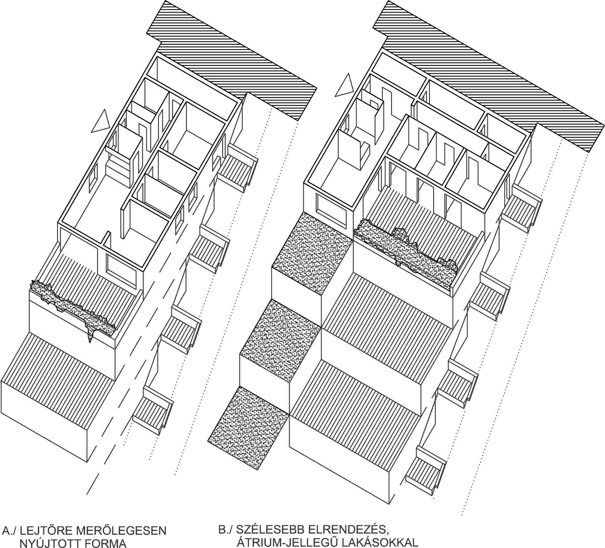

*5.51. ábra – Teraszházak gyakran alkalmazott sémái*

A lejtővel párhuzamos méretükben szélesebb elrendezések a meredekebb lejtőkre alkalmazhatók. Igen gyakori, hogy egy kiugró oldalszárnnyal átrium jellegű lakástípust alakítanak ki, amely a tömörebb alaprajzi elrendezés mellett széltől védett, intimebb tetőteraszt is eredményez. (Az oldalszárny előtti lapostető ilyenkor rendszerint zöldtető.)

*A teraszházak sajátos tervezési szempontjai* elsősorban a lakások lépcsőzetesen eltolt jellegéből adódnak. Mivel a „vizeshelyiségek” itt nem kerülhetnek egymás fölé, gondot okoz az ablakkal nem rendelkező helyiségek szellőzőkürtőinek kialakítása (amelyek – nyilván – nem vezethetők ki a felső szomszéd teraszán). Ezért érdemes a közvetlen szellőzést igénylő helyiségeket a homlokzatok mellé helyezni, az alárendeltebb helyiségeknek általában az oldalhomlokzatok jutnak. Ugyanilyen probléma a lakásonkénti fűtés kéményeinek kivezetése is, ezért előnyösebb, ha az egész épületet a legfelső szinten (vagy közvetlenül az alatt) elhelyezett, közös kazánház szolgálja ki. A lakások szennyvizeit általában szintenként, vízszintesen vezetik ki az épület mellett futó, ejtőaknákkal megszakított csatornavezetékbe.

A lakások hátsó fala (támfala) mentén egy olyan, alárendeltebb helyiségekből képzett, részben a terepszint alá kerülő „puffer sávot” kell tervezni, amellyel elkerülhető, hogy lakóhelyiség padlóvonala kerüljön a terepfelszín alá az oldalhomlokzatok mentén. Másfelől, a szigetelés esetleges meghibásodása nem lakóhelyiségben okoz felázást. (A támfal mentén meghibásodott szigetelés gyakorlatilag javíthatatlan.) Különös gondosságot igényel a lejtő mentén keletkezett rétegvizek elvezetése.

Sajátos – csaknem minden esetben előálló – probléma, hogy azonos födém egy része belső tereket, másik része külső és belső tereket választ el. A tetőteraszok alatti födém rétegrendje a vízszigetelési és hőszigetelési funkció miatt összetettebb, nagyobb vastagságot igényel, mint a lakások közötti födémmező. Előfordul, hogy a tetőteraszra egy lépcsőfoknyit fel kell lépni, de ez a terasz és lakás kapcsolata szempontjából – elsősorban esztétikailag – hátrányos. A födém vastagságának kiegyenlítése mindenkor eseti problémát jelent.

A lejtős terepre illesztett teraszház igen nagy hátránya, hogy ennél *felvonót* gyakorlatilag nem lehet kialakítani. Legfeljebb két-három szintes elrendezésnél lehet esélye egy központi közlekedő mag kialakításának, ahová felvonó telepíthető. (Akad példa arra, hogy ferde pályán futó, sikló-szerű felvonót létesítettek sokszintes teraszháznál, de ilyet szériában nem gyártanak. Egyedi legyártása aránytalanul költséges lenne.) A három-négy szintnél magasabb teraszházaknál a lépcsőjárás kényelmetlenségét már nemigen ellensúlyozza a tetőterasz használati értéke. Akadálymentes megközelítése legfeljebb az utcaszinten lévő lakásnak lehetséges.

A teraszházak jellegzetessége, hogy adott fajlagos szintterületi mutatóhoz képest telkük beépítettsége nagy (az építménymagasság legfeljebb a kétszintes, hagyományos házéval egyenértékű). A lakásegységre jutó telekterület lényegesen nagyobb a hagyományos, többszintes házaknál szokásos mértéknél. (A lejtős terepen lévő teraszház inkább az alacsony, nagy sűrűségű beépítések alternatívája lehet.) Minthogy a teraszházak elhelyezésére alkalmas telkek általában a zöldövezetekben vannak, ezekre vonatkozóan az előírt zöldfelületek aránya is nagy. Ezért érdemes a nagyméretű lapostetős szakaszok minél nagyobb részét zöldtetőként kialakítani, mert azok alapterületének egy része – a bizonyos feltételekkel – az előírt zöldfelületbe beszámítható.

*A sík terepen létesített teraszházak* esetében a lakásokhoz csatlakozó tetőteraszok az épület sajátos térbeli elrendezésével alakíthatók ki.

Lehetséges olyan térbeli elrendezés, ahol az egymás fölé sorolt szintek alapterülete fokozatosan csökken („dombház”). Az ilyen ház különleges tervezési problémát jelent, mert valamennyi szint alaprajza eltér egymástól. Az egyes szinteket úgy kell kialakítani, hogy az alapterület-csökkenés egy-egy jól használható tetőterasz formájában jelentkezzen valamennyi lakásnál, mindamellett a függőleges szerelvény-blokkok azonos helyen maradjanak. Hogy a felső szinten lévő lakások se legyenek képtelenül kicsik, a szintenként elhelyezett lakásszámot (fogatszámot) is fokozatosan csökkenteni kell ([5.12. ábra](#abra_5_12)).

Bizonyos határok között lehetséges az egyes, közel azonos kialakítású szintek hátralépcsőzése, megfelelő szerkezeti kialakítás esetén ([5.13. ábra](#abra_5_13)).

## 5.11. Gépkocsielhelyezés

A jelenleg nálunk érvényes törvényi követelmények előírásai szerint többszintes, többlakásos épületeknél a lakásszámmal azonos számú gépkocsi elhelyezéséről a *telken belül* kell gondoskodni. Ennek ellenére, ha az épület igényesebb lakásokat tartalmaz, akkor a fenti alap-normánál több gépkocsit is feltételezni lehet (ma már gyakori, hogy tehetősebb családok két vagy akár három gépkocsival is rendelkeznek) és ezt az igényt a tervezési programban is rögzíteni kell.

*A terepszinten lévő parkolók* kialakítása a gépkocsielhelyezés legegyszerűbb módja. Ez csak viszonylag alacsony szintterületi mutató mellett lehetséges, tehát ott, ahol a helyi szabályozás kismértékű beépítettséget és mérsékelt homlokzatmagasságot enged meg; vagy a telekár mérsékeltebb és az olcsóbb, „elérhető lakások” létesítése a beruházás célja. Lehetséges, hogy a terepszinti parkoló a normatív szám feletti, második gépkocsik helye, ha csak lakásonként egy gépkocsit vesznek figyelembe a garázs méretezésénél.

*A fedett-nyitott gépkocsibeállók* alacsony szintszámú épületeknél úgy létesíthetők, hogy a földszint egy részét lábakra állítják. Ennek előnye, hogy a gépkocsik feletti átlátás miatt a kertterületből nagyobb rész látszik, így az tágasabbnak tűnik. Hátránya, hogy a fedett beállók más, hasznos terek (lakásterek) helyét foglalják el a földszinten. Az épülettől elkülönített, fedett és nyitott gépkocsiszínek az esetek túlnyomó többségében nem adnak építészetileg elfogadható megoldást, ilyenek létesítését kerülni kell többszintes, többlakásos épületek esetén.

*A zárt gépkocsitárolók* létesítését vagyonvédelmi megfontolások is indokolják, és ezzel összefüggésben az a gazdasági szempont, hogy a zárt gépkocsitárolók eladhatók vagy bérbe adhatók.

*Az épületek földszintjén kialakított, sorolt garázsok vagy ikergarázsok* méretezése a [3.22.](#abra_3_22_E5) és [3.23. ábra](#abra_3_23_E5) szerint történhet. Csak kisebb szintszámú épület esetében lehetséges, hogy valamennyi gépkocsi elhelyezése földszinti tárolókban történjen. A földszinti homlokzatot szinte teljesen kitöltő garázskapuk összefüggő sora és az előttük húzódó betonsáv barátságtalan, sivár látványt nyújt, ezért építészetileg igen kedvezőtlen. Másrészt, a földszinti gépkocsitárolók egy teljes lakószint helyét elfoglalhatják, ezzel a potenciálisan építhető lakásterületet csökkentik a telek kötött beépítettségi mértéke és építménymagassága mellett. A gépkocsitárolók eladási ára vagy bérleti díja legtöbb esetben nem ellentételezi a földszinti lakások (vagy egyéb hasznos terek) elmaradása miatti kisebb nyereséget. A többszintes épülettől különálló, földszintes sorgarázsok esztétikus kialakítása szinte lehetetlen, ilyeneket semmi esetre ne létesítsünk, már csak azért se, mert alapterületük a beépítettség mértékébe beszámít.

*3.22. ábra – A mértékadó gépkocsi mérete és fordulási íve*

*3.23. ábra – A gépkocsitárolás helyszükséglete*

*A terepszint alatt kialakított teremgarázsok* gyakoriak az értékesebb telkeken, mert nem foglalnak el más célra hasznosítható földszinti területeket, és **magasabb szintterületi mutató elérését teszik lehetővé**. Ezért létesítésük gazdaságilag indokolt lehet akkor is, ha fajlagos építési költségük viszonylag magas. A teremgarázsok alaprajzi-elrendezési sémái többfélék, de a lakóépületekkel összefüggő, nem túl sok gépkocsit befogadó teremgarázsoknál az un. „merőleges beállású” elrendezést alkalmazzák legtöbbször, amelynek méretezési szabályait az [5.52. ábra](#abra_5_52) mutatja be.

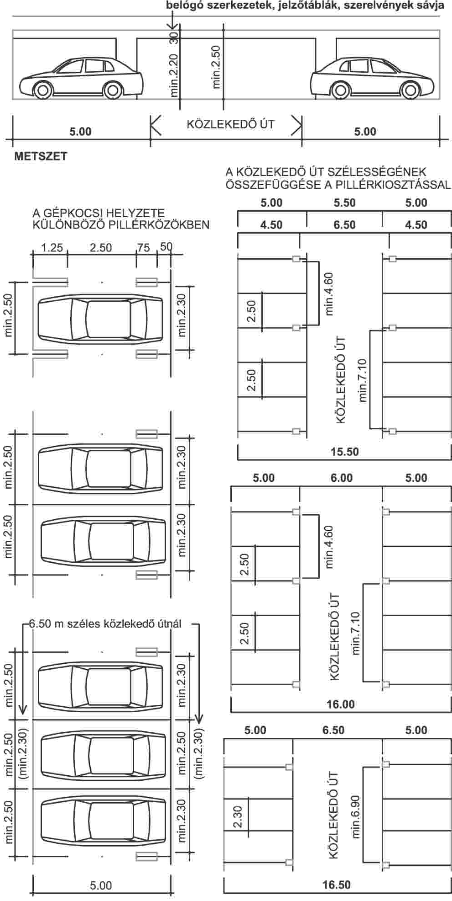

*5.52. ábra – Merőleges beállású teremgarázsok méretezése*

A mélygarázsok létesítésénél különös gondot kell fordítani a lehajtó-rámpa méretezésére. A rámpát egy 20 m-es sugarú, átmeneti körívvel kell alul-felül indítani, amelynek hossza a rámpa hajlásszögétől függ. Az összefüggést az [5.53. ábra](#abra_5_53) mutatja. Bizonyos városszerkezeti helyzetekben (foghíjtelkeken) előfordulhat, hogy megfelelő hosszúságú rámpa kialakítására nincs elég hely, ilyenkor gépkocsifelvonót is lehet alkalmazni. Ennek létesítési költségeit ellensúlyozhatja, hogy területigénye a rámpa helyszükségletének tört része. Hátránya viszont az időigényes és körülményes üzemeltetés, az üzemelés költsége és annak veszélye, hogy a felvonó meghibásodása esetén a mélygarázsba sem be, sem onnan ki nem lehet hajtani a hiba elhárításáig (vagy tartalék-felvonót is kell létesíteni).

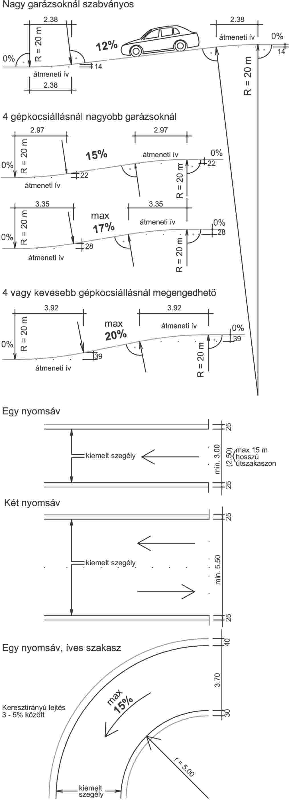

*5.53. ábra – Autórámpák méretezése*

*A mélygarázs és a lakóépület viszonya* szempontjából legkedvezőbbnek az olyan elrendezés *tűnik*, ahol a mélygarázs a lakóépület pinceszintjén helyezkedik el. A középső útról két oldalra történő merőleges beállás csak akkor lehetséges, ha az épület mélységi mérete a 16 métert eléri ([5.55. ábra](#abra_5_55)). Az 5.7.4. és az 5.8.4. fejezetekben leírtak szerint ilyen épületmélység gazdaságosan csak belső folyosós elrendezéseknél alakítható ki, ezért alkalmazása igen korlátozott.

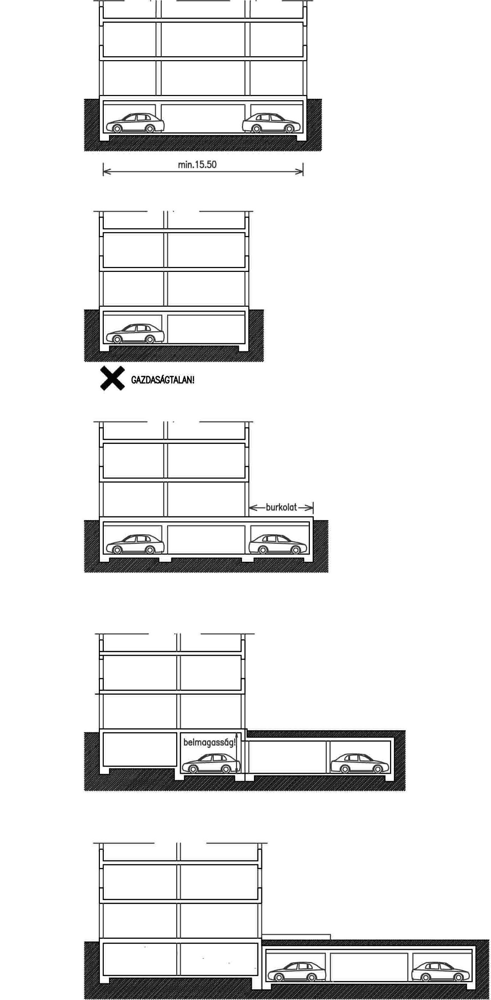

*5.55. ábra – Mélygarázs és lakóépület viszonya*

Az [5.52. ábra](#abra_5_52) mutatja, hogy a mélygarázsban lévő tartópillérek kiosztása összefügg a gépkocsiállások helyigényével. A garázsszinten kedvező az 5,00 m-es vagy a 7,20 m-es pillér-tengelytáv. Ezt a pillérkiosztást – természetesen – az emeleti szinteken is folytatni kell, de a kötött szerkezeti raszter a lakások elrendezési lehetőségét erősen korlátozza. Ha a lakásoknál gyakran alkalmazott 3,60 - 4,20 m körüli pillérközök jelennek meg a garázsszinten, akkor ezek a gépkocsiállások túlméretezését okozzák, az egy autóra vetített alapterületet és annak építési költsége erősen megnő.

Amikor a lakóépületeknél általános 11-12 m-es épületmélység a garázsszinten is érvényesül, akkor a közlekedő útról csak egy sor gépkocsiállás közelíthető meg, a teremgarázs nagyobb részét maga a beltéri út foglalja el. Ez az egy gépkocsira jutó garázs-alapterületet (fajlagos költséget) jó 40%-kal megnöveli, ezért igen gazdaságtalan.

Ha a mélygarázs kisebb-nagyobb része az épület kontúrja alól kiáll, akkor vagy széles tetőterasz alakul ki a földszinten, ami a szűkösen biztosítható zöldfelületekből vesz el, vagy – ha erre a részre földtakarás kerül – felesleges belmagasságot eredményez az épület alatt.

Legkevesebb problémával az olyan elrendezés jár, ahol a mélygarázs teljes egészében kikerül az épület alól. Ekkor a lakóház és a garázs pillérkiosztása egymástól független, a lakóház alatti pinceszint egyéb célra (pl. tárolóknak) jól hasznosítható. Zártsorú foghíjtelkek beépítésnél a lehajtó rámpa is ilyen elrendezésnél lehet megfelelő hosszúságú ([5.55. ábrasor](#abra_5_55)).

A mélygarázsoknak a lakóházból (lépcsőházból) való megközelítése csak egy szellőztetett, tűz- és füstgátló előtér („zsilip”) közbeiktatásával történhet. Ebbe a helyiségbe semmilyen más helyiség vagy felvonó nem nyílhat, szellőztetése gépi úton is lehetséges.

A mélygarázsok minden esetben gépi szellőzést igényelnek, mert a levegőnél nehezebb füstgázok onnan másképpen eltávozni nem tudnak. A garázsszinthez kapcsolódóan szellőző gépházat kell létesíteni, valamint az épület belsejében (vagy az épület mellett) olyan függőleges szellőzőkürtőt kell elhelyezni, amely a garázs szennyezett levegőjét a tetőszint fölé vezeti. Ennek keresztmetszete – a garázs nagyságától függően – tekintélyes lehet, az 1 m2 körüli alapterületet is elérheti. Mélygarázsok létesítésénél szakértő épületgépész közreműködése nem nélkülözhető még a tervezés kezdő fázisaiban sem.

## 5.12. Szemétkezelés - hulladékkezelés

*A szemétkezelés helyiségei és építményei* az építési telket magában foglaló nagyobb területen folyó szemétszállítás rendszerétől függően létesüljenek. A szemétgyűjtés történhet gyűjtőedényekben – polgárjogot nyert argó szerint „kukákban” – vagy nagyobb konténerekben ([5.56. ábra](#abra_5_56)). Többlakásos házaknál a „nagykuka” használata gyakoribb. Konténereket – amelyek speciális szállító járműveket igényelnek – nagy lakásszámot, akár több épületet tartalmazó lakóegyüttesekhez (lakótelepekhez) rendszeresítenek.

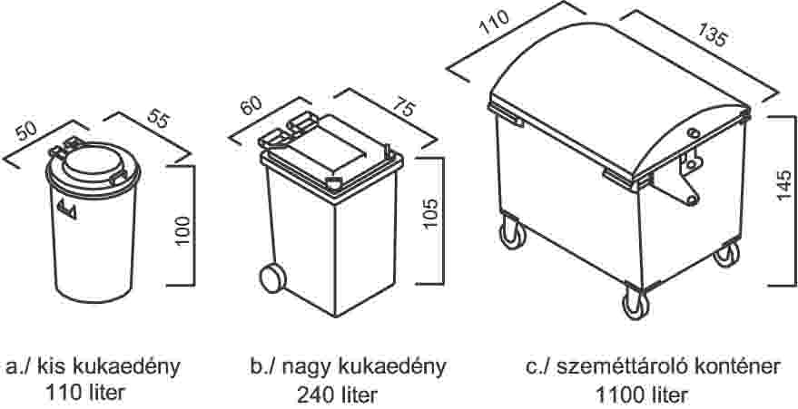

*5.56. ábra – Szemétgyűjtő edények*

A szükséges gyűjtőedények száma a használói létszámtól és a szemétgyűjtés gyakoriságától függ. Budapest önkormányzatának ide vonatkozó rendelete szerint jelenleg 3 liter/fő/nap háztartási szemét keletkezésével kell számolni. (Ez az érték kissé szűkös, valamivel bőkezűbb méretezés ajánlható.) A közületi szemétgyűjtés gyakorisága területenként eltérő: pl. Budapest egyes kerületeiben hetenként háromszor, némelyik külső kerületben heti egy alkalommal gyűjtenek szemetet. Konkrét tervezési megbízás esetén a szemétkezelés rendszeréről tájékozódni, a szolgáltatást végző vállalattal vagy szervezettel egyeztetni szükséges. A szeméttároló helyiség vagy építmény méretezéséhez (a keletkezett hulladék mennyiségének számításához) a lakások férőhelyszámát tekintsük mérvadónak, teljes telítettséget feltételezve.

A szeméttárolás történhet az épületen belül kialakított szeméttároló helyiségben, vagy az épületen kívül létesített szeméttároló építményben. A szeméttároló helyiséget vagy építményt úgy kell elhelyezni, hogy az a szemétszállító járművel legfeljebb 10 m távolságon belül megközelíthető legyen, és a gyűjtőedény mozgatásának útvonalába lépcső ne kerüljön.

Mindenképpen épületen belüli szeméttároló helyiséget kell létesíteni, ha az épület bejárata közvetlenül csatlakozik a közterülethez, és épülettől független szeméttároló építmény kialakítására nincs lehetőség. A szeméttároló helyiség nyílhat a bejárati előtérből vagy a szélfogóból is. Kapjon közvetlen, természetes szellőzést (célszerűen ablakot, mert a gravitációs szellőzőkürtő pont a kritikus nyári időszakban visszafelé működhet). Falait mosható burkolattal kell ellátni, benne tömlővéges vízvételi helyről, padlóösszefolyóról kell gondoskodni. Különféle kapacitású szeméttároló helyiségek legkisebb méreteit („nagykuka” esetére) az [5.57. ábrasor](#abra_5_57) mutatja be.

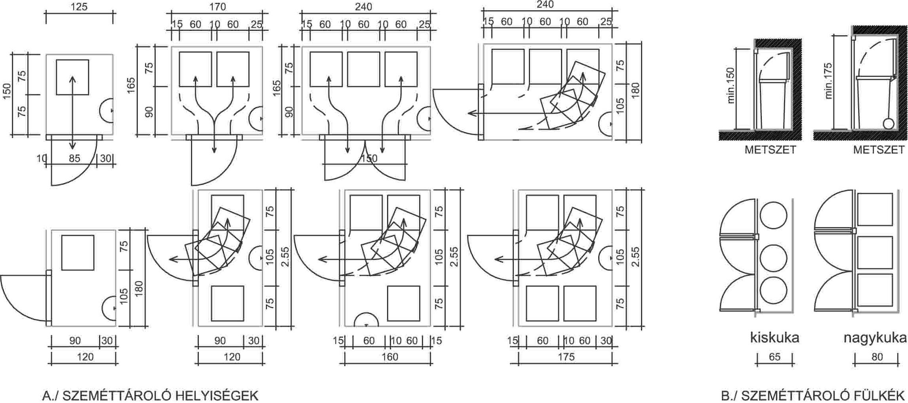

*5.57. ábra – Szeméttároló helyiségek méretezése*

*Szeméttároló építmény* létesíthető a saját telken álló többlakásos városi villák kerítéséhez kapcsolva, vagy egyéb, a megközelítési távolságon belül eső helyen (pl. támfalban). Ha a kukatároló építmény (fülke) 80 cm-nél nem mélyebb, belmagassága 1,50 m-ig csökkenthető ([5.57. ábra](#abra_5_57)). Építészetileg kulturált kialakítása a kerti növényzettel, kerti létesítményekkel összhangban történjen. Az esetleges konténertárolókat is kulturáltan megformált, akár növényzettel befutatott fedetlen kerti építményekként kell létesíteni. A gyűjtőedények tisztításához a szeméttároló építmények közelében tömlővéges vízcsatlakozást kell biztosítani a kerti locsolóhálózat részeként.

A közületi szemétszállítás csak közterületi útvonalakon történik, így a több lakóépületet magában foglaló nagyobb telkek – lakóparkok – belsejébe a szállító jármű nem köteles bemenni (legfeljebb külön, magánszerződés alapján, külön díjazás fejében, ha ott a jármű mozgásának feltételei biztosítottak). Ilyenkor gyakori, hogy a szemétgyűjtést a telken belül a lakóközösség vagy az üzemeltető vállalkozás bérmunkaként végezteti, és a közületi szemétszállítás egy központi gyűjtőhelyről történik.

*Szemétledobó berendezés* korábban a középmagas és magas épületekhez létesült, hogy a lakónak ne kelljen a szemetet lifttel a földszintre szállítani. Ez egy kb. 40 cm átmérőjű cső, amelyben szintenként ledobónyílások vannak, ahová a lakók a szemetesvödröket ürítik. Erre a műveletre külön ledobóhelyiség szolgál. A hulladék a csővezeték végén elhelyezett gyűjtőedénybe vagy konténerbe hull. A szemétledobó berendezésekkel kapcsolatosan igen sok rossz tapasztalat gyűlt össze: a ledobóhelyiség tisztántartása nem garantálható, a ledobócső tisztítása nehézkes és gyakran elhanyagolják, emiatt az legtöbb helyen a férgek kedvenc közlekedési útvonalává vált. A szemétledobó létesítését azért is kerülni érdemes, mert a mihamar általánossá váló szelektív hulladékgyűjtésre alkalmatlan.

*A szelektív hulladékgyűjtés* nálunk még szórványos, de általános bevezetése küszöbön áll. Ez több, a különböző hulladékfajták elkülönített gyűjtésére rendszeresített hulladékgyűjtő edényt igényel (ezek helyszükségletével együtt), és a szemétszállítás egész rendszerének átformálásával jár. Ma még nem tudható, hogy nálunk ez a rendszer részleteiben milyen lesz, de a szűkösen méretezett szeméttároló helyiségek és építmények átalakítása rendkívül nagy költségekkel járhat. Ezért – az „erkölcsi évülés” elkerülése érdekében – jó, ha ezek méretezése bőkezűen történik.

## 5.13. Lakásokon kívüli egyéb terek, helyiségek

A többszintes, többlakásos lakóépületek közös közlekedőiről, a gépkocsitárolóról, kazánházról, gépházakról, szeméttárolóról a korábbi fejezetekben esett szó.

*A bejárat és bejárati előtér* kialakításánál biztosítani kell a kaputelefon, a postaládák és hirdetési felületek kulturált elhelyezését megfelelően megvilágított és esőtől védett helyen.

A menekülési útvonalba eső közös közlekedők ajtóit a tűzvédelmi szabvány szerint kell méretezni a kiürítési idő figyelembe vételével. Középmagas és magas épületeknél, valamint olyankor, amikor a menekülők létszáma az 50 főt meghaladja, az ajtóknak a menekülés iránya felé kell nyílniuk.

*Bejárati szélfogó* rendeltetése az, hogy a lépcsőház és a külső tér között lévő, ajtóval zárható térként a lépcsőház kürtőhatását (a huzatérzetet, filtrációs hőveszteséget) csökkentse. Ezért magas épületeknél mindenképpen létesüljön szélfogó, középmagas házaknál nyomatékkal javasolható, alacsonyabb szintszámok esetén tervezői döntés függvénye a szélfogó létesítése.

Olyankor is célszerű szélfogót kialakítani, ha a bejárati előtér valamely okból fűtést igényel (pl. az apartmanházak földszinti várakozó tere, társalgója stb.).

*Közös tárolók* az egész lakóközösség szolgálatára állnak. A földszinten – lehetőleg a bejárati előtérhez kapcsolódóan – célszerű egy olyan közös raktár kialakítása, ahol a lakók kerékpárjukat, esetleg a gyermekkocsikat elhelyezhetik. Ez lehet a tároló helye a csak az utcán használt, elektromos meghajtású kerekesszéknek is. Ha az épületben gyermekkocsi szállítására alkalmas felvonó van, a közös gyermekkocsi tárolót ritkán használják, de ilyenkor a lakás előszobájának méretezésénél kell a gyermekkocsi elhelyezésére számítani. A közös tárolóban vagy külön tároló fülkét, vagy erre a célra elhelyezett szekrényt célszerű a közös helyiségek takarítására szolgáló eszközök és takarítószerek tárolására biztosítani. Ha a szeméttároló nem az épületen belül van, akkor a közös helyiségek takarításához lehetőleg a raktárban elhelyezett vízvételi helyről is gondoskodjunk.

*A lakók egyéni tároló helyiségei* egyéni tulajdonban vagy bérleményben állnak, de nem tartoznak közvetlenül a lakáshoz. Ezeket legcélszerűbb a pinceszinten elhelyezni. Hiányuk a lakások használati értékét nagyban csökkenti, mert itt helyezhetők el a hosszabb időn át használaton kívül álló eszközök és tárgyak, amelyeknek a lakásban sehol sincs jó helyük (pl. szánkó, síléc, használaton kívüli gyermekágy, sporteszközök, javításra váró bútordarabok stb.). Az egyéni tároló helyiségek legyenek jól zárhatóak. Külön-külön szellőztetésük igen bonyolult és költséges lenne, ezért rácsozattal vagy hézagosan rakott elválasztó falakkal a pince – együttesen szellőztetett – légteréhez kapcsolhatók.

*Közös használatú helyiségeket* (pl. fittness szoba, szauna, játékszoba, közös barkácsműhely stb.) csak kifejezett építtetői igényre tervezzünk. Létesítésük költsége a lakásárakban megjelenik, ezért azok piaci esélyeit ronthatja. Fenntartásuk költségeihez nem szívesen járulnak hozzá azok a lakók, akik nem használják ezeket.

*A szolgáltatásokat is nyújtó lakóépületek* esetében a lakásokon kívüli terek nagyobb jelentőséget kapnak. Ilyenek a luxuslakásokat tartalmazó *apartmanházak,* amelyeket vállalkozási alapon üzemeltetnek. Ezekben állandó portaszolgálat, takarítószolgálat, karbantartó szolgálat stb. működik. Itt helye van a társalgónak, esetenként a szaunának, testépítő helyiségnek, esetleg uszodának stb. A szolgáltatások jellege, színvonala, mindenkor a vállalkozás pénzügyi tervével függ össze és eseti tervezési program rögzíti azokat.

*A nyugdíjasok otthonházai* sajátos lakóépületformát jelentenek, és egyre gyakoribb, hogy ezeket is vállalkozási formában üzemeltetik. (Az egyedül élő öregek eladják lakásaikat és ezzel az összeggel, meg a nyugdíjuk tekintélyes részével váltják meg a lakáshasználat és a szolgáltatások igénybevételének jogát.) Itt fontos az étkeztetés, egészségügyi szolgáltatás, állandó orvosi felügyelet biztosítása, ezen kívül lehetséges a napközbeni elfoglaltságot nyújtó klubszobák, kézműves műhelyek kialakítása stb. Az öregek lakhatása külön témakört jelent a közös hálótermekkel kialakított, a létminimumot nyújtó szociális otthonoktól az uszoda-használatot is biztosító luxusszínvonalú otthonházakig. A szolgáltatások helyiségeinek kialakítása, elrendezése már a középülettervezés témakörébe tartozik, ezért itt azokkal részletesen nem foglalkozunk.

*Idegen funkció* jelenléte a lakóházakban elsősorban a sűrű, városias lakóterületeken jellemző. Itt a földszinteken az utca zaja és légszennyezettsége miatt lakások nem helyezhetők el (Budapest sűrűbb részein ezt szabályzat is tiltja), viszont kereskedelmi, szolgáltató létesítmények számára kiválóan alkalmas a lakóházak földszintje. Idegen funkció jelenléte esetén alapszabály, hogy a különböző rendeltetésű tércsoportok forgalma ne kereszteződjék, azok elkülönített bejárattal rendelkezzenek. A lakóépület közös közlekedői önállóan zárhatók, felügyelhetők legyenek, ugyanígy a nem lakás-rendeltetésű helyiségek, helyiségcsoportok is. Lehetséges – mindenkori megállapodás kérdése – hogy bizonyos helyiségeket a lakók és a más rendeltetésű létesítmények üzemeltetői közösen használjanak (pl. a gépkocsitárolót, hulladéktárolót stb.).

## 5.14. A többszintes, többlakásos lakóépületek energiatudatos és fenntartható kialakítása (B.J., N.Á.)

A hőveszteségek csökkentése és a napenergia befogadása többlakásos épületek esetében is költséghatékonyan megoldható. A lakások egymás mellé és fölé sorolása miatt csökken a fajlagos (lakás m2-re eső) lehűlő felület, így a hőveszteség is. Nehezebb azonban az ideális tájolás biztosítása, különösen meglevő településszerkezet, úthálózat és telekadottságok mellett.

A fogatolt sávházaknál a 30-as évek óta favorizált É-D-i tengelyű elrendezés a déli homlokzatot rövid bütüvé redukálja, ami a ház energiafelvétele szempontjából kedvezőtlen.

A fenntartható szemlélet éppenséggel a K-Ny-i tengelyű elrendezést preferálja, amikor a déli homlokzaton viszonylag nagy ablakfelülettel kialakított szobák helyezkednek el, az intenzíven hőszigetelt, kisebb ablakokkal megnyitott északi oldalon az egyéb helyiségek (amelyek között még egy hálószoba is lehet).

Belsőfolyosós elrendezések ilyen tájolása nem lehetséges, de oldalfolyosós rendszereknél ez a pozíció természetes. A zárt oldalfolyosó – mint puffer tér – kedvezően csökkenti az épület energia leadását, de vizsgálatot érdemel, hogy a folyosó felőli helyiségek gépi szellőztetésének – egész éven át tartó – energiaszükséglete merre billenti az energiamérleg nyelvét. Különösen városi környezetben lehetséges az oldalfolyosó mentén olyan – alul-felül nyitott – üvegfal kialakítása, amely védelmet nyújt a széltől és a zajtól, de az intenzív átszellőzést biztosítja.

A többszintes, többlakásos épületekben is helye van napterek létesítésének. (A spontán „energiatudatosság” megnyilvánulása, hogy a lakók a loggiákat gyakran beüvegezik). Különféle, a homlokzatfelületből kiálló virágablakok, üvegezett – nyáron nagy felületen felnyitható – zárt erkélyek a lakások energiamérlegét javítják, és a szélterhelésből adódó hőveszteségeket csökkentik.

A többszintes épületek esetében jelentőséget kap a szellőzési, *filtrációs veszteségek* csökkentése, kivált a középmagas és magas épületeknél. A szél felőli homlokzatokon szélnyomás alakul ki, az átellenes homlokzatoknál a turbulencia szívó hatást kelt. Emiatt a lakások ablakainak résein át létrejövő légcsere mértéke nagyobb lehet, mint ami a szellőzéshez elegendő, és ez a többlet energiaveszteségként jelentkezik. Az ablakok légtömörségének fokozása azonban egy határértéken túl már nem jó: szélmentes időben a belső levegő pangását okozza, ami káros: gyakori oka pl. a falpenészesedésnek.

A filtrációs veszteséget csökkentik a pufferzónák, az árnyékolt homlokzaton kialakított szélvédett közlekedők és a benapozott homlokzaton kialakított zárterkélyek, napterek. A szélnyomást csökkentő hatása van a „zöldhomlokzatoknak” is, ezek létesítése és fenntartása azonban 4-5 szintnél magasabb épület esetében nehezebben és költségesebben oldható meg (lásd következő alfejezetben).

Elsősorban a sokszintes épületeknél jelent problémát az épület teljes magasságáig összefüggő légterekben (lépcsőházban, liftaknában) jelentkező kürtőhatás, ami a legalsó padlószint és a legfelső zárófödém közötti légoszlopban kialakuló nyomáskülönbségből adódik. Ez a lakásbejárati ajtók résein át okoz filtrációs veszteséget. Ezt jótékonyan csökkenti a jól méretezett bejárati szélfogó – ami biztonsági szempontból is előnyös – és a füstmentes lépcsőház (amelynek ajtaja már csak a füst behatolása ellen is kellően légtömör), de olyan esetben, ha két lépcsőház közül csak egyiknek kell füstmentesnek lennie (magas épületeknél) a másik lépcsőházban a kürtőhatás ugyanúgy létrejöhet, ezért célszerű annak légterét is szintenként elzárni a kapcsolódó közlekedő terektől. (Ezek a problémák is érvet szolgáltatnak a magas lakóépületek létesítése ellen.)

A térhatároló szerkezetek kellő hőszigetelése, a hőhidak elkerülése inkább a részlettervek készítése során érvényesülő szempont, de már a korai vázlatok készítésénél is figyelembe kell venni az egyes elrendezéseknél tipikusan felmerülő problémákat. Ilyen például a *konzolos* függőfolyosók, erkélyek hőhídmentes kialakítása, amire vannak ugyan bevezetett technikai megoldások, de bonyolultak és költségesek. Az eneriatudatosságnak a tervezés minden fázisában érvényesülnie kell, így a szakipari szerkezetek kialakításánál is. (Az [5.58. ábra](#abra_5_58) egy energiatudatosan kialakított homlokzati nyílászárót mutat, amelyet az [5.17. ábrán](#abra_5_17) látható oslói többlakásos épületnél alkalmaztak.)

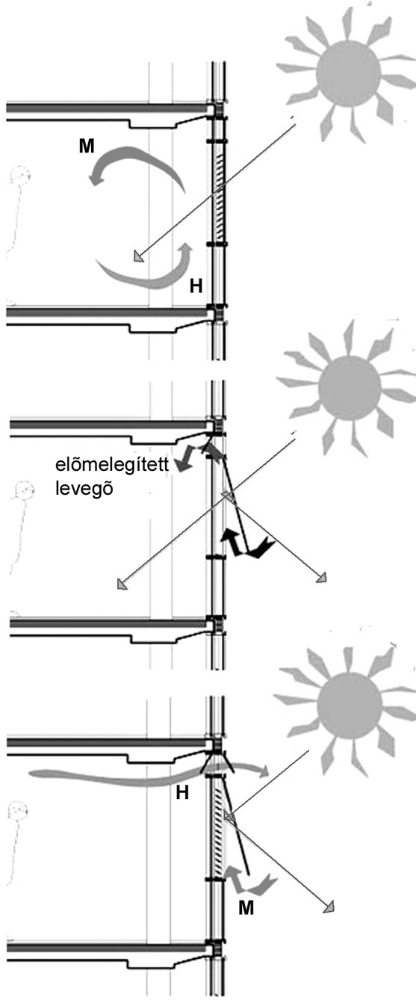

*5.58. ábra – Példa homlokzati nyílászáró energiatudatos (interaktív) kialakítására. (Oslo, többlakásos ház)*

A többszintes, többlakásos lakóépületek energiamérlegét nagymértékben befolyásolja a fűtési rendszer megválasztása (pl. lakásonkénti falikazán vagy központi kazán lakásonként mérhető energia-fogyasztással), de a kérdés esetenkénti mérlegelése, eldöntése a közreműködő épületgépész szakkonzulens hozzáértését igényli. A tetőn elhelyezett kollektorok hozzájárulhatnak a melegvíz-készítéshez és kiegészíthetik a fűtési rendszert is.

## 5.15. A növényzet szerepe az intenzív beépítések esetében (N.Á.)

A zöldfelületek tervezését nem mindig tekintjük az épülettervezés részének. Azonban sűrű városi beépítés esetén, a belső udvarok intenzív zöldesítése esetleg vízfelülettel vagy vízjátékkal történő gazdagítása, zöldtető és zöldhomlokzat kialakítása jótékonyan befolyásolja a közvetlen környezet mikroklímáját, ezek alkalmazásával gépészeti eszközök nélkül is csökkenthető a nyári hőterhelés. Mindez javítja a környezet esztétikai értékét, és a vizuális komfortérzetet is.

A növényfelület, levélzet csökkenti a zaj és porterhelést. A hanghullámokat, rezgéseket a növények mozgással veszik fel, a növény mögötti homlokzati falon csökken a zajterhelés.

A külső levegőben szálló por – a levegő egyéb szennyező részecskéivel együtt – megül a levélfelületeken, ezáltal csökken a belső térbe jutó szennyezés mértéke, a felhalmozódó káros anyagot a csapadék végül a talajba juttatja.

A *zöldtető* olyan, speciális módon kialakított tető, amelyet összefüggő növényfelület borít. Hasznossága – a fent említetteken túl – kiegészül azzal, hogy a lapostető alatti terek túlzott felmelegedését a tetőn lévő földtömeg és növényzet a nyári időszakban csökkenti, hiszen a nedves földtömeg és a növényzet párologtatással hőt von el a közvetlen környezetéből. Téli időszakban viszont a föld és a növényzet hőszigetelő paplanként viselkedik, és meggátolja a jegesedést is.

A tervezés során figyelembe kell venni, hogy a hőszigetelés vastagsága lényegesen nem csökkenthető a zöldtetővel ellátott födémeknél sem. Így a födém feletti szerkezeti rétegek összes vastagsága általában meghaladja a 40-50 cm-t, a tervezett termőközeg vastagságtól függően. Zöldtető megfelelő segédszerkezetettekkel nemcsak lapostetőn, hanem ferde tetőn és íves tetősíkon is kialakítható. Az öntözést, rendszeres művelést nem igénylő növényekkel „extenzív” zöldtetők alakíthatók ki. Ezek jellemző növényei a mi éghajlati viszonyaink között a szédumok vagy a sziklakerti növények, gyógynövények, illatos és színes évelők. Vízigényes növényeket csak művelhető, locsolható, rendszeres gondozást biztosító tetőn lehet ültetni (pl. tetőteraszokhoz csatlakozva), ezeket „intenzív” zöldtetőknek nevezzük.

*Zöldhomlokzat* tervezése a sűrű városi környezetben kerül előtérbe, mert a pormegkötő képesség és a zajcsökkentés itt a legfontosabb feladat. A zöldhomlokzat árnyékoló hatásával megakadályozza a homlokzati felületek túlmelegedését, csökkenti a felületre jutó sugárzási energiát, ezáltal a belső tér nyáron is hűvösebb marad. Csökkenti a nyári túlmelegedést az is, hogy a növények a párologtatással és az árnyékolással a falsík mentén légáramlást hoznak létre, ami szintén hűtő hatású.

A spontán módon kialakult zöldhomlokzatok (borostyánnal, repkénnyel befuttatott falak) régről ismertek ([5.59. ábra](#abra_5_59)). Ezek mellett egyre inkább megjelennek az élőfalak, a kisebb súlyt, de dús növényzetet eredményező megoldások. Az előbbiek esetében a növényzet gyökere a talajban fejlődik, és a felület kevés gondozást kíván. A gondozás leginkább a felesleges részek levágása, miközben a növényzet homlokzaton általában segédszerkezet nélkül fut egy-két szint magasságig. Segédszerkezet javasolható azonban a többszintes homlokzatra felfutó növényzet esetében, a megfelelő biztonság és széllel szembeni ellenállás érdekében ([5.60. ábra](#abra_5_60)).

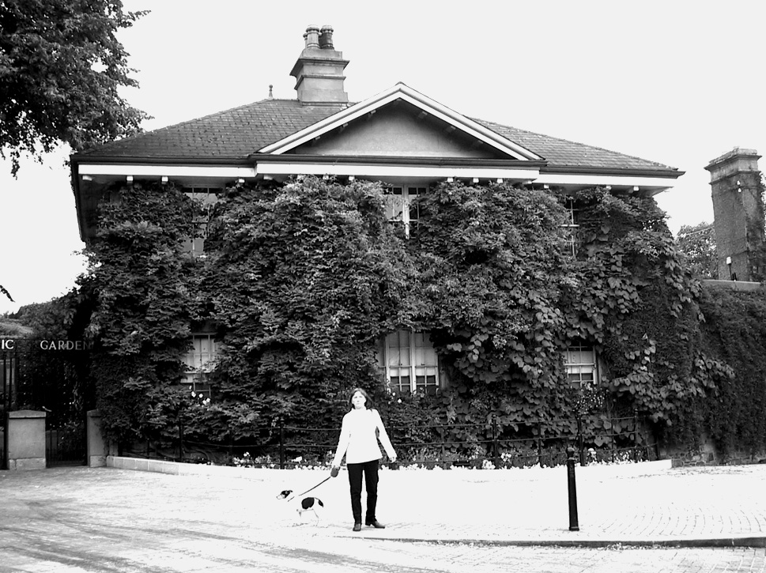

*5.59. ábra – Zöldhomlokzat spontán kialakulása*

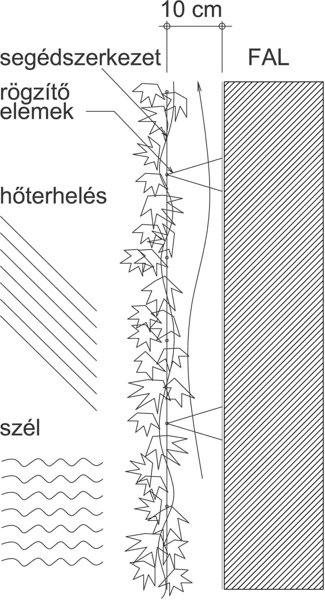

*5.60. ábra – Tervezett zöldhomlokzat*

Új irányzat a kültéri vagy beltéri *élőfalak* kialakítása. Ebben az esetben a homlokzat vagy belső fal előtti síkban függesztik fel a növénytartó kazettákat, zsákokat, és biztosítják az állandó nedvességet is. A falsíkon vízzáró felületet kell kialakítani, mert a növénytartó szerkezet rendszeresen nagy mennyiségű vizet kap a fenntartás, karbantartás során. (Emiatt mind a létesítés, mind a fenntartás meglehetősen költséges.) A növényzet és falsík között ki kell alakítani egy légrést is.

A zöldhomlokzatok tudatos alkalmazásával az utóbbi időben új eszközzel gazdagodott az építészeti tervezés kelléktára: vannak olyan példák, ahol a növényanyag különböző színeinek megválasztásával festői kompozíciót hoznak létre nagy kiterjedésű élőfalakon. Ilyenkor a botanikai ismeretekkel rendelkező kertészeti szakember nemcsak az épület környezetének kialakításához, hanem magának az épületnek a megtervezéséhez is nélkülözhetetlenné válik.

# 6. Hétvégi házak, nyaralók

## 6.1. A fejezet témaköre

Ebben a fejezetben tárgyalt épületfajták időszakos lakhelyek, ezért valójában nem lakóházak. Akár lakóépületeknek is tekinthetők akkor, ha a lakásokra vonatkozó használati követelmények teljes körének eleget tesznek. Ilyenek lehetnek a nagyobb méretű nyaralók, amelyeknél a funkcióváltás is előfordul: lehet, hogy később állandó lakásként használják azokat. Újabban az is gyakori, hogy öreg falusi lakóházakat nyaraló céljára vásárolnak meg, és újítanak fel. A hétvégi házak használata legfeljebb néhány napra terjed, így azok méretei, felszereltsége jóval szerényebb lehet, mint amit állandó lakhelyeknél minimálisan elvárható, így azok semmiképp nem lakások. Nem vonható azonban éles határvonal a hétvégi házak és a nyaralók fogalma között, mint ahogyan a kisméretű hétvégi ház és az átmeneti hajlék fogalma között sem.

A témakör átfed a szállás-jellegű épületfajtákkal, hiszen az erősen látogatott üdülőterületeken kisebb nyaralóépületek együttesét sokszor szállodaszerűen üzemeltetik (apartman-falvak). A több egységből álló, emeletes „társas üdülők” is közel állnak a szálloda jelleggel működtetett apartman-házakhoz. Ezeket itt nem tárgyaljuk részletesen.

## 6.2. Történeti áttekintés

> **Megjegyzés**
>
> Az időszakosan használt lakhelyek építésének története nagyon régi. A városi palotákban lakó főnemesek távolabbi nagybirtokain is volt kastély vagy udvarház, ahol több-kevesebb időt töltöttek, vadászatokat rendeztek.
>
> Az alföldi tanya is „második otthon” volt eredeti formájában, mert a távoli mezővárosban lakó család munkabíró tagjai csak tavasztól őszig laktak a tanyán, a mezőgazdasági munkák időszakában. Később, a bérmunkásokat alkalmazó gazdag mezővárosi polgár tanyáját egyféle hétvégi pihenőházként is használta.
>
> A mai értelemben vett nyaralók elterjedése a XIX. század közepétől kezdődött nálunk. A vagyonos városi polgárság kisebb-nagyobb birtokot vásárolt a városon kívüli területeken, és azon nyaralót építtetett magának. Ilyenek voltak kezdetben a budai hegyvidéken épült villák is, amint azt a 3.2. fejezetben említettük. Az állandó lakhely és az időszakos lakhely közötti távolságnak határt szabott a lófogattal való közlekedés sebessége. A vasúthálózat kiépülésével, majd a gépkocsizás elterjedésével a lakás és a nyaraló több tíz, vagy akár több száz kilométerre lehet egymástól.
>
> A XIX. – XX. század fordulóján Magyarország akkori területén, főleg az Adriai-tenger és a Tátra vidékén, részben pedig Erdélyben alakulnak ki jelentős üdülőhelyek, és elindult a balatoni üdülőrégió fejlődése is. Az itteni települések belterületén szaporodtak az olyan nyaralóházak, amelyekhez már nem tartozik a teleknél nagyobb földterület. Ekkoriban még csak a vagyonosabb rétegek engedhették meg maguknak nyaraló építését, amelyek viszonylag nagy, igényes villák voltak.
>
> A trianoni békeszerződés után a korábbi jelentős üdülőhelyek az országhatáron túlra kerültek. Ekkor vett lendületet a Balaton-környék fejlődése és új üdülőterületek kialakulása (Duna-kanyar, Velencei-tó). Ekkoriban még aránylag olcsón lehetett telket vásárolni, és a jobban fizetett tisztviselők, az átlagosnál magasabb jövedelmű kispolgárok fizetőképességéhez illeszkedő, kisméretű, de még jól lakható nyaralók, hétvégi házak szaporodtak el ezeken a területeken. (Ekkoriban kezdődött el a déli Balaton-part szinte teljes hosszát elfoglaló vízparti teleksor kialakulása, amely ma a fejlesztés egyik legnagyobb akadálya.)
>
> A második világháború után, az ötvenes években a családi üdülők építése megtorpant: akinek telt is volna rá, jobbnak látta eltitkolni vagyoni helyzetét.
>
> A hatvanas évek második felétől szinte robbanásszerűen nőtt a hétvégi házak építése iránti igény. Ennek oka bizonyára a mezőgazdaság „kollektivizálása”, a termőföld magántulajdonának megszüntetése. A mezőgazdaság gépesítésével feleslegessé vált falusi munkaerő a városokban épülő új lakótelepekre költözött, de a föld ösztönös szeretetét, a természettel való együttélés igényét nem tudta levetkőzni. Mindenáron igyekezett bármilyen kis földdarabot szerezni, ahová panellakásából elmenekülhet a hétvégeken. Másfelől, külterületi termőföldet vásárolni nem lehetett, de belterületi telket igen. Ez a tény az üdülőterületek településeinek vezetőit arra ösztönözte, hogy kiterjesszék a belterületek határait, a még meglévő tartalékföldeket vagy a belterületbe kerülő szövetkezeti földeket üdülőtelkekké parcellázzák és eladják. Ilymódon némi fejlesztési forráshoz jutottak a települések, de maguk a vezetők is jól jártak, mert a telkek elosztásánál családi vagy baráti körüket előnyben részesíthették. Mindezt a legfelső fórumok politikailag is ösztönözték, mert a hétvégi ház birtoklása (a panellakás és a Trabant gépkocsi mellett) a magyar, szocialista „jóléti modell” egyik jelképévé vált. „A Balaton mindenkié!” frázis is e folyamatot szentesítette. A telkek várható vásárlói körének korlátozott fizetőképessége miatt a telkek aprócskák, néhol a 200 m2 nagyságot alig haladják meg. Ezeken szedett-vedett anyagokból összetákolt, apró házak épülnek nagy sűrűséggel, a környezet esztétikai minőségét tönkretéve. Az esztétikai szennyeződés elkerülésének szándékával jelentek meg ekkoriban a hétvégiház-típustervek, csekély hatásfokkal ([6.1. ábra](#abra_6_01)). A környezeti kár nemcsak a táj képében keletkezik: csatorna-közművet nélkülöző területek ilyen mérvű besűrűsödése nem kis mértékben volt oka a Balaton vízminőség-romlásának.
>
> 
>
> 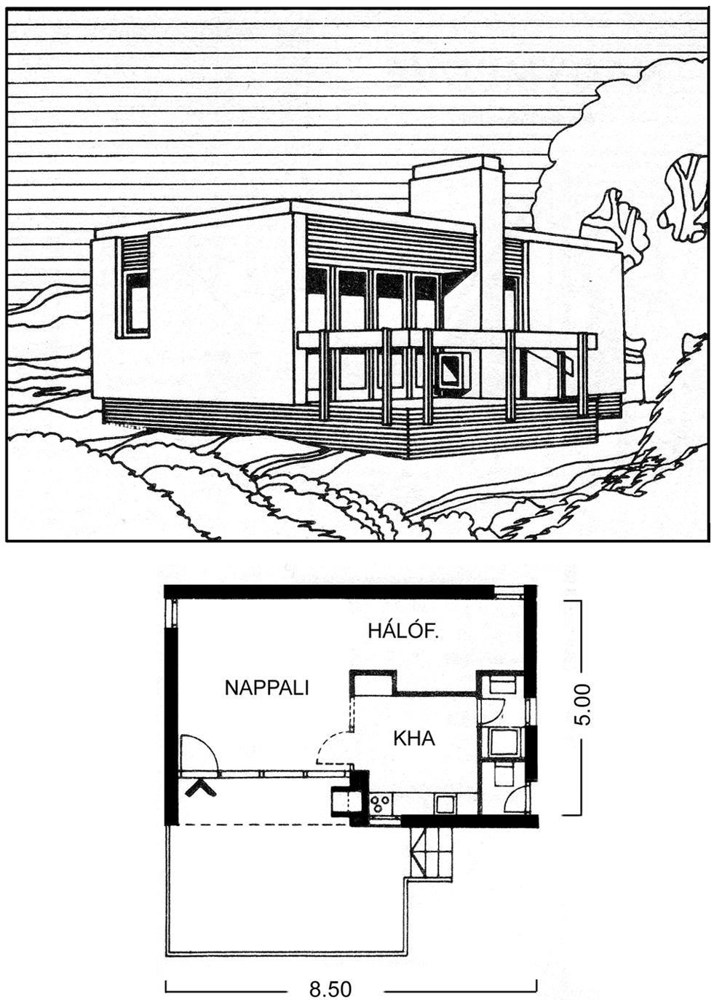
>
> *6.1. ábra – Hétvégi ház típusterve a 60-as évekből*
>
> A települések belterületeinek határát a végtelenségig terjeszteni azonban nem lehetett, de bizonyos térségekben nem is lehetett indokolni üdülőövezetek kialakítását. E korlátokat lépték át a hetvenes években, a városkörnyéki „zárt kert” fogalmának bevezetésével, amellyel lehetővé vált külterületi termőföldek pár száz négyzetméteres hobbi-kertekké történő parcellázása. Ezek elvileg mezőgazdasági területek maradtak, de megengedték, hogy azokon kezdetben 12 m2-nél, majd később 30 m2-nél nem nagyobb „szerszám- és terméktároló” létesülhessen. Ezek a valóságban ugyancsak hétvégi házak lettek, de az alapterületi kötöttségek miatt néhol idétlenül magas, meredek tetőkkel, torz épületformákkal, rossz anyagokkal épültek meg. A mezőgazdasági rendeltetés hazugsága mentesítette a településeket a közműhálózat kiépítésétől is. Ennek ellenére, a tulajdonosok sok helyen elérték, hogy később vízvezeték- és elektromos hálózat létesüljön, és ma már egyre több „zártkerti építményt” használnak állandó lakásként, annak ellenére, hogy a terület infrastrukturális hálózata (pl. útjainak szélessége) teljesen alkalmatlan arra, hogy az lakó- vagy üdülőövezetté válhasson.
>
> Az északi Balaton-part is ennek a folyamatnak esett áldozatául, ahol a dombok szőlőterületein egyre több hétvégi ház épült a régi présházak helyén, és a korábban csak a hegylábnál lévő beépítés a dombtető magasságáig ellepte a gyönyörű dombok vonulatát. A Hivatal ezt a folyamatot is tervpályázatokkal, típustervekkel igyekezett jó irányban befolyásolni, jobbára sikertelenül ([6.2. ábra](#abra_6_02)). Hasonló, féllegitim keretek között keletkeztek üdülőterületek a folyók hullámterein (jellemzően a Tisza mentén), ahol az építészeti káoszt csak fokozza, hogy a kisméretű bódék nyurga betonlábak tetején fityegnek az évente ismétlődő magas vízállás miatt.
>
> 
>
> 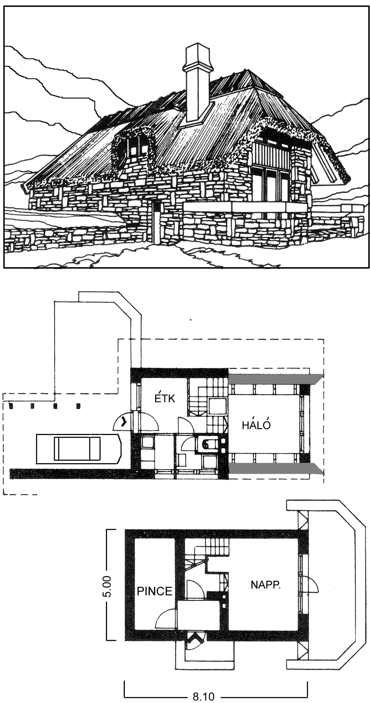
>
> *6.2. ábra – Szőlőhegyi nyaraló ajánlott terve. 1970-es évek*
>
> A politikai-gazdasági rendszer megváltozása ezeknek a környezetkárosító folyamatoknak véget vetett a 90-es években. A „zárt kert” fogalmát már korábban eltörölték, a földnek piaci ára lett, végre megkezdődött a Balaton-környéki üdülőterületek csatornázása, ahol építési engedélyt ma már csak teljes közművel ellátott telekre adnak ki. Emiatt a kiemelt üdülőterületek telekárai nagyon megemelkedtek: egy jó fekvésű balatoni telek ára ma már eléri vagy meghaladja egy nagyvárosi építési telek árát is. Ilyen értékű telken egy kisméretű hétvégi ház építése – amelynek építési költsége esetleg a telekár tört részét tenné ki – gazdasági abszurdum lenne.
>
> A mezőgazdaság időszakos válsága miatt is csökken a falvak népessége, az ottani ingatlanárak alacsonyak. Egyre gyakoribb, hogy a tehetősebb városlakók szép természeti környezetben lévő falvakban vásárolnak maguknak házat vagy tanyát nyaraló céljára. Az északi Balaton-part mögötti völgyekben (pl. a Káli-medencében), a Vértes hegységben, a Tisza-menti falvakban stb. egyre több öreg parasztházat újítanak fel nyaraló céljára. Ez mindenképpen jó irányú folyamat, mert hátráltatja a falvak elhalását. A nyaralók tulajdonosai többnyire a városi értelmiség köréből kerülnek ki, és saját javukat is szolgálja, ha képzettségük és kapcsolataik révén elősegítik a falusi lakosság érdekérvényesítését hivatali és politikai fórumokon ([6.3. ábra](#abra_6_03)).
>
> 
>
> 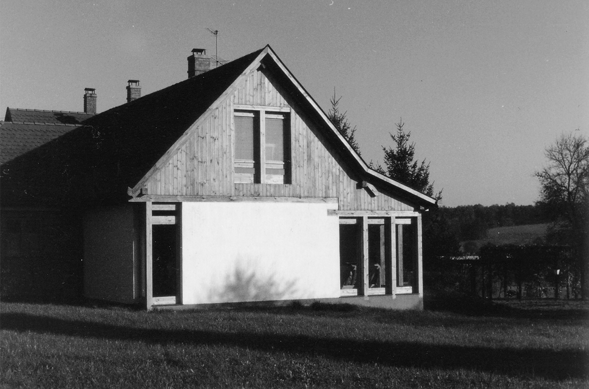
>
> *6.3. ábra – Nyaralóépület falusi környezetben. (Tervező: U. Nagy Gábor)*

## 6.3. A hétvégi házak, nyaralók tereinek kialakítása, méretezése

Hétvégi házra általában kevesebbet szán(hat)nak a családok, mint lakásszerzésre, így annak alapterülete általában jóval kisebb, mint egy ugyanolyan férőhelyszámú lakásé. Igen rossz, de elég általános gyakorlat, hogy a kisméretű hétvégi házakat „lekicsinyített” családi háznak tekintik és azokhoz hasonló helyiségeket, térkapcsolási rendszereket alakítanak ki, de a kényelmetlenségig vagy használhatatlanságig csökkentett méretekkel. Az 1.2. fejezetben tárgyalt, egyes lakástevékenységek által igényelt térméretek az időszakos szálláshelyeknél vagy időszakos lakhelyeknél is érvényesek. Némi engedményt lehet tenni ésszerű határok között, mert a lakások tervezéséhez alkalmazott alapméretek mindig rendelkeznek bizonyos tartalékkal, de a kényelmetlenség vagy netán balesetveszély szintjéig csökkenteni ezeket nem szabad.

Alkalmasabb tervezési módszer, ha a lakástevékenységek teljes köréből elhagyjuk azokat, amelyek egy hétvégi ház vagy nyaraló esetében nem várhatók. Például, a [6.4. ábrán](#abra_6_04) látható, egy-egy éjszaka eltöltésére használt *átmeneti hajlék* (horgászkunyhó) esetében mindössze két használati követelménynek kell eleget tenni: az „alvás” és a „tárolás” térigényének. Minden más: pl. tisztálkodás, bográcsozás, étkezés, beszélgetés, poharazgatás stb. a külső térben történhet. Az építési költségekben alig érzékelhető változást jelentene, ha a fekhelyek méretét vagy a tér belmagasságát csökkentenénk, de a kis építmény kényelmetlenné válna, használati értékének csökkenése messze nem lenne arányos a költségmegtakarítással.

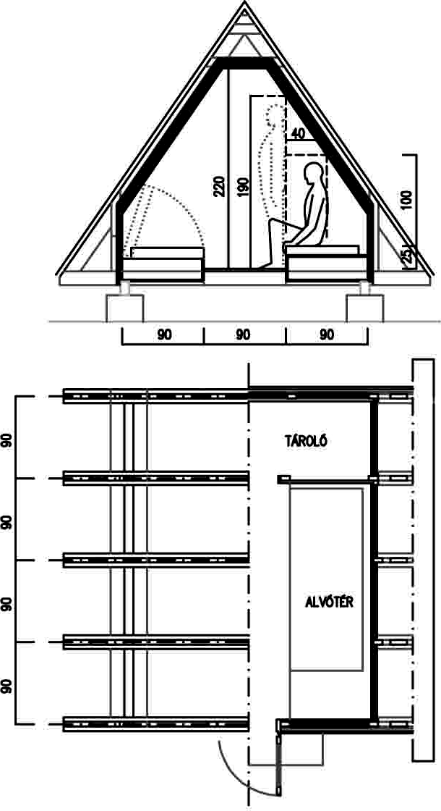

*6.4. ábra – Fiktív példa minimális hajlék (horgászkunyhó) méretezésére*

*A hétvégi házaknál* hasonló elv érvényesíthető ([6.5. ábra](#abra_6_05)). A használat célja és időtartama nem indokolja az „egyéni tevékenységek” (otthoni szellemi munka, tanulás) tér- és eszköz-igényeinek teljesítését, ezért a *hálóhelyeket* kizárólag az „alvás” követelményei szerint elegendő méretezni. Alkalmazható emeletes ágy is, és az ágy melletti lerakó felület is elmaradhat. Az alvóhelyek közötti hangszigetelésnek sem kell olyan mértékűnek lennie, mint ami állandó lakásoknál elvárható. Ha arra kifejezett építtetői igény nincs, nem szükséges a szülői hálóknál szokásos iker-ágyelrendezést biztosítani. Ha a fűthető hétvégi házat hideg időben is használják, amikor nyitott ablaknál aludni nem lehet, az ajtóval zárt hálóhelyek térfogatát ne csökkentsük a 15 m3/fő alá, vagy azok legyenek nagyobb, közvetlen természetes szellőzéssel rendelkező térrel (nappalival) légtérben összenyithatók (lásd 1.5.2. fejezet).

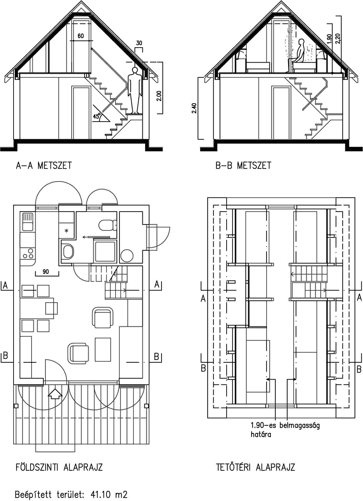

*6.5. ábra – Fiktív példa hétvégi ház elrendezésére*

*A főzőhely* kialakításakor kevesebb tároló- és munkafelület szükséges a mérsékeltebb igénybevétel miatt, az elemsorból a sütő elmaradhat, a tűzhely helyett lehet elektromos rezsót alkalmazni, ezért a használati zóna szélessége 90 cm-ig csökkenthető. Hűtőszekrénynek mindenképpen helyet kell biztosítani (de ez lehet kisebb, a konyhapult alá férő típus is).

A *személyi higiénia* helyiségeinek számánál is el lehet tekinteni a lakásoknál leírt ajánlásoktól (pl. külön WC nem szükséges a 4 főnél nagyobb igénybevétel esetén sem), mert itt a munkába indulásnál szokásos reggeli „csúcsforgalom” nem jelentkezik, vagy tolerálható. Nagyobb férőhelyszámnál is elegendő a zuhany a fürdőkád helyett. A berendezési tárgyak helyigényét azonban tartsuk tiszteletben a kényelmes használat érdekében. Nem szabad elfelejtkezni a hétvégi házaknál leggyakrabban alkalmazott villanybojler helyigényéről, amely a vízvételi helyekhez közel eső tárolóban is elhelyezhető.

A *háztartási munkák* köréből a mosás-vasalás kihagyható a néhány napig terjedő tartózkodás miatt.

Jelentős alapterület takarítható meg a lakásoknál szokásos *közlekedők* elhagyásával: a nappali tér betöltheti az előszoba és a belső közlekedő szerepét még akkor is, ha ide fekhely kerül. A közös tartózkodás teréből még tisztálkodó helyiség is nyílhat, de a jó ízlés azt kívánja, hogy a WC berendezés ne legyen szem előtt az ajtó kinyitásakor, kellő hangszigeteléssel és szagelszívó ventillátorral rendelkezzen ilyenkor.

A *belső lépcsőknél* 60 cm-es karszélesség elegendő, ha azon bútorszállítás nem várható, de a meredekség meghatározásánál érdemes mérlegelni, hogy a lakásoknál megengedett max. 45 foknál meredekebb lépcső miatti, esetleges gyermekbaleset kockázatának vállalása arányban áll-e a helymegtakarítás mértékével?

A legkevésbé a *nappali időtöltés* terének méretével érdemes takarékoskodni. Ennek szűkössége megkeserítheti az esős hétvégek, vagy a tavaszi és ősz-eleji pihenőnapok eltöltését, amikor még/már a teraszra kiülni nem lehet az esti órákban. A [6.5. ábrán](#abra_6_05) bemutatott, 6 személy által igénybe vehető hétvégiház-séma hasznos alapterülete mindössze 39 m2, ennek ellenére a nappali tere 20,7 m2-es lehetett.

A *terasz* a hétvégi házak és nyaralók nélkülözhetetlen tartozéka, jó időben ez a nappali tartózkodás helye. Legyen tágas, árnyékolt vagy árnyékolható, és legalább egy része legyen fedett is, ahová a szemerkélő nyári esőben is ki lehet ülni.

A *tárolók* köréből az élelmiszertárolót akár el is lehet hagyni, mert az egy-két napos tartalék a hűtőszekrényben vagy az egyik konyhai tároló-elemben elfér. A ruhatárolás térfogata is jóval kisebb lehet, mint ami a lakásoknál kívánatos. Ennek ellenére ruhatároló szekrények vagy eltakarható falfülkék itt is kellenek, mert a fali kampókra aggatott ruházat, netán fehérnemű látványa nem éppen esztétikus. Feltétlenül szükség van kerti szerszám és kertibútor-tárolóra, ahol egyéb tárgyakat és eszközöket (kerékpár, sporteszköz) is el lehet zárni.

Sajnos, az utóbbi időben egyre fontosabb szempont lett a *betörés elleni védelem*. Jó, ha erre a célra nem fixen beépített acélrács szolgál, amely mögül a környező természet látványa nem élvezhető igazán, és az épület megjelenését is rontja. A zárhatóan kialakított, felnyíló vagy eltolható zsalutáblák vagy tömör deszkatáblák kedvezőbbek, és némi leleménnyel akár másra is használhatók. Vannak példák arra, hogy a felhajtva megtámasztott zsalutáblák vízszintes árnyékoló felületek lesznek, vagy a nappali üvegfala előtt elhelyezett, betörésvédő deszkatábla lehajtott állapotban terasszá válik.

A *nyaralók* tervezésénél is a fentihez hasonló gondolatmenet érvényesülhet, ha takarékos méretezésre van szükség. Ezeknek a házaknak a használata azonban huzamosabb, néhány hétre vagy akár néhány hónapra terjed. Ennek megfelelően gondolni kell az élelemtárolásra és mosásra is, a ruhatárolás is nagyobb felületet kíván, mint ami a hétvégi házaknál elfogadható. A főzés elemsora is hosszabb, jobban felszerelt. Ha az építtető nem kéri kifejezetten a konyha külön helyiségként való kialakítását, akkor a főzőhelyet érdemes a nappali teréhez kapcsolni: a nyaralás idején a főzés amúgy is félig-meddig hobbitevékenység. A [6.6. ábrán](#abra_6_06) mutatott 58 m2-es, takarékosan méretezett nyaralóban a közös időtöltés, étkezés, főzés közös tere 25,2 m2, ami állandó lakások nappali szobájánál is tágasnak számít.

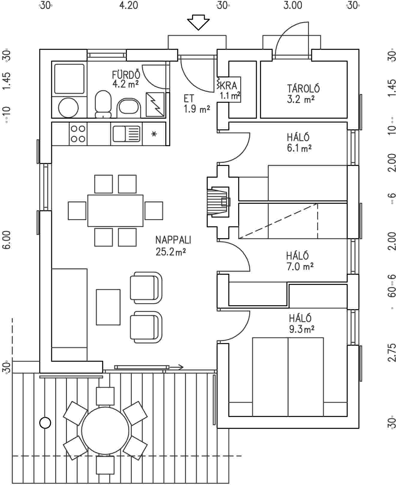

*6.6. ábra – Fiktív példa 58 m²-es családi üdülőház méretezésére*

Általában, a takarékossági szempontok sem indokolják a kényelmetlenségig szűkös méretezést.

> **Megjegyzés**
>
> Ha például egy 50 m2-nyi alapterületű nyaraló nappali terét 5 m2-rel növeljük, az 55 m2-es változat költségnövekménye nem 10%-os, hanem annál lényegesen kisebb. A költséges tételek: a telekár, a közműcsatlakozás és a telken belüli vezetékhálózat, az épületgépészeti felszereltség, a nyílászárók száma, jellege mind a kisebb, mind a nagyobb változatnál ugyanannyiba kerülnek, ezért a tágasabb változat fajlagos m2-ára lényegesen kevesebb lesz.

Az üdülőterületekre indokoltan előírt alacsony beépítési százalék mellett a nyaraló területét sokszor a szűkös telekméret korlátozza. Ez az üdülőterületek szabályozási tervét készítő szakemberek felelőssége. Általában nincs értelme apró telkek kialakításának, akkor sem, ha azok teljes közművel vannak ellátva. A kis egységekre aprózott területek közműhálózata sűrű, kiépítése a telek területi egységére vetítve költséges, amely költség a telekárban megjelenik. A drága telekre épített szűkös nyaraló használati értéke nem áll arányban a teljes létesítési költséggel (lásd még a 6.4. fejezetet.)

Tehetős építtetők számára tervezett nyaralók területe elérheti vagy meg is haladhatja egy kényelmes családi ház alapterületét. Mégsem helyes azokat olyanra tervezni, mint egy lakóházat. A nyaralóba, a „második otthonba” kikapcsolódni járnak, ezért az határozottan és karakteresen különbözzön a városi lakástól. A szabadság idején igényelt természetközeli, lezserebb élet, az egyénies üdülési szokások, akár egyéni hobbik szerint, sokszor játékosan alakított belső terek, a természeti környezethez harmonikusan illeszkedő tömegformák, egyszerű, természetes anyagokból képzett külső épületelemek adhatnak ellazulásra ösztönző, sajátosan nyaraló jelleget az épületnek.

## 6.4. Hétvégi házak és nyaralók beépítési módjai, épületfajtái

A hétvégi ház vagy nyaraló létesítésének indítéka vagy az, hogy a városi lakása mellől hiányzó kertet legalább hétvégeken pótolja a használójának, lehetőleg szép természeti környezetben; vagy csupán az, hogy tulajdonosa valamilyen szép kirándulóhely, horgászhely, fürdőhely gyalogosan elérhető közelében tölthesse szabadságát. Bár az üdülőterületek általában valamilyen, pihenésre alkalmas, vonzó természeti adottság (hegyvidék, tó, folyó) környezetében vannak, az is lehetséges, hogy mesterségesen kiépített fürdőhely közelében alakítanak ki üdülőterületeket (pl. Hajdúszoboszló, Balf, Bükfürdő stb.).

Az „Országos Településrendezési és Építési Követelmények” üdülőépületek elhelyezésére „Üdülőterület” kialakításáról rendelkezik, kétféle változatban.

Üdülőházas terület *melynek épületei „... túlnyomóan változó üdülői kör hosszabb tartózkodására szolgálnak.” A helyi szabályozási terv itt akár a 10 m-es építménymagasságot is megengedheti, amely többszintes, szabadon álló üdülőszállókra, panziókra jellemző. Ilyen övezetben létesíthetők többszintes, többegységes* társasüdülők *annak a használói körnek, amely nem a saját kertet igényli, hanem a fürdőhely közelségét. Leggyakoribb ezeknél a külsőfolyosós elrendezés. Az üdülőházas területen is létesíthetők családi üdülők szabadon álló, oldalhatáron álló, és csoportos beépítési módban. A telkek csak teljes közművesítettség esetén építhetők be.*

*Hétvégi házas terület* a családi üdülők jellemző területe. A most érvényes OTÉK szerint ezen legfeljebb két üdülőegységet tartalmazó épület létesíthető szabadon álló, oldalhatáron álló vagy ikres beépítési módban. Csoportos beépítést a helyi építési szabályzat megengedheti vagy előírhatja, de ez csak közművesített területen lehetséges. Egyébként a telkek részleges közművesítés mellett (közcsatorna nélkül) is beépíthetők, ha a helyi szabályozási tervnek az üdülőövezetre vonatkozó előírásai azt megengedik. Kisméretű telkek esetén azonban a közcsatorna hiánya rendkívül környezetkárosító lehet, mert a telkenként elhelyezett szennyvíz-ülepítő és szivárogtató berendezések olyan közelségbe kerülnek, hogy a talaj biológiai tisztítóképessége szinte hatástalanná válik (lásd még a 2.4. fejezetet).

A [6.7.a. ábra](#abra_6_07) olyan, fiktív telekosztást mutat, amely az OTÉK mellékletében közölt példa alsó határértékeinek betartásával készült (360 m2-es telekterület, 15%-os beépítettség). Az úthálózat rendkívül sűrű, a területet a kerítések agyonszabdalják, ezért természetes zöldkörnyezet kialakulásának nincs esélye, a házak közelsége miatt a kerthasználat vizuális zavartalansága sem biztosítható. Az egész környezet – mint számos példa mutatja a valóságban – egy „lekicsinyített falu” bizarr képét adja.

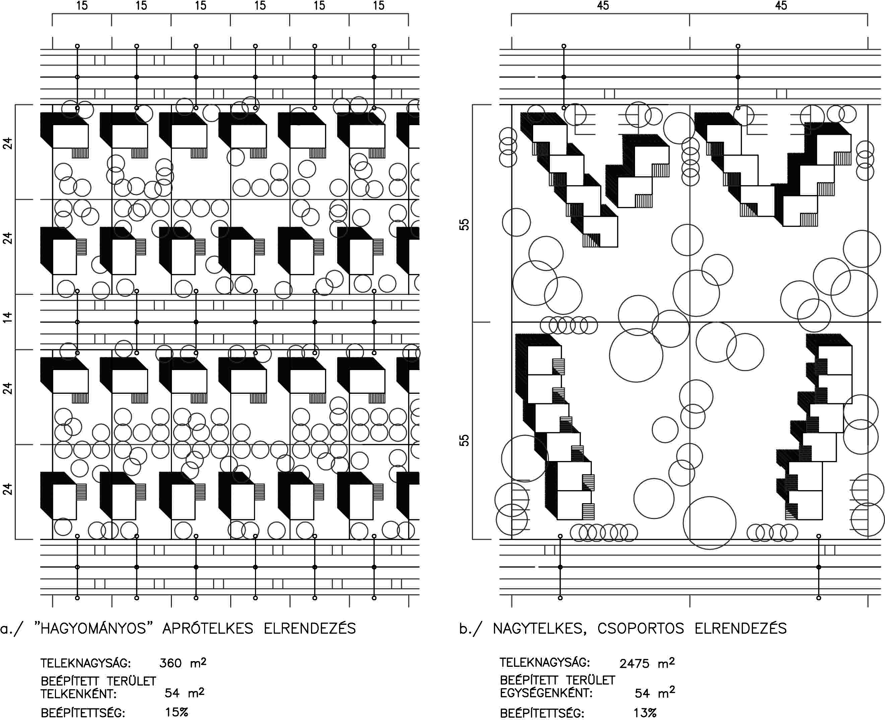

*6.7. ábra – Üdülőterületek beépítési jellegének összehasonlítása (fiktív sémák)*

Ezzel szemben a [6.7.b. ábra](#abra_6_07) egy olyan elrendezést mutat, ahol a viszonylag nagy telkeken összevont csoportokban helyezkednek el az üdülőegységek bokros, illetve sorolt formában. A telkeken összefüggő pázsitfelületek és facsoportok maradhatnak, a környezet nagy része megtartható természetes állapotában. Az ábra szemléletesen mutatja, hogy a nagytelkes elrendezéshez fele akkora utcaterület, és – a kevesebb bekötés miatt – felénél is kevesebb közműhossz elegendő. Az egységekhez privát használatú területrész tartozhat, a közös zöld bérmunkával fenntartható, amelynek költségét a tulajdonosok eloszthatják egymás között (így a kert akkor sem ég ki, gazosodik el, ha valakinek hetekig nincs ideje az üdülőjéhez leutazni). Még a korszerű, környezetbarát helyi szennyvíztisztító berendezés telepítésének is nagyobb az esélye, ha annak költségeit több tulajdonos együttesen viseli.

Az üdülőházak (hétvégi házak, nyaralók) körében csaknem minden épületfajta megtalálható, amelyeket a lakóházaknál megismertünk. A lakóépületek egyes fajtáihoz (családi házak; alacsony, nagy sűrűségű beépítések épülettípusai; többszintes többlakásos házak) jellemzően különböző laksűrűségi és szintterület-sűrűségi értékek tartoznak. Üdülőterületeken városiasan magas laksűrűség kialakulása ellentmondana magának az eredeti rendeltetésnek. Ezért itt a több üdülőegységet koncentráló épületfajták alkalmazását nem a telekterület megtakarítása indokolja, hanem az, hogy minél nagyobb szabad, összefüggő zöldfelületet lehessen megtartani természetes állapotában.

Az üdülőház birtoklását nem lehet valamilyen, szociális szempontból elismerhető szükségletnek tekinteni, ami a széles néprétegek által elérhető, olcsó üdülőtelkek kínálatának növelését indokolná. Ellenkezőleg: a valóságos társadalmi érdek éppen a nemzeti közkincsnek számító, értékes tájak eredeti szépségének megőrzése. Ezért csak üdvözölhető, hogy nagyobb, új üdülőterületek alakítása az utóbbi évtizedekben szinte teljesen megszűnt, és a családi üdülők inkább aprófalvakban, tanyás térségekben létesülnek.

## 6.5. Hálózaton kívüli (Off-grid) nyaralóépületek, természetközeli megoldások (N.Á.)

> **Megjegyzés**
>
> A városi értelmiség körében egyre többen vannak, akik a környezettudatosságot mindennapjaikban is érvényesítik. A szép természeti környezetben lévő aprófalvas vagy tanyás térségekben létesült (régi házból átalakított vagy újonnan épített) családi nyaralók tulajdonosai – akik között újabban sok nyugat-európai család is van – épp a természetközelség, a nagyvárosi életformából való kikapcsolódás miatt választják ezeket a helyeket. Ez a motiváció – szerencsére – a hagyományos, visszaforgatható, természetes építőanyagok és építési módszerek alkalmazását is ösztönzi. E térségekben azonban rendkívül alacsony a közművesítettség szintje, lehet, hogy még a vezetékes ivóvízellátás és elektromos hálózat is hiányzik. Ilyenkor kerülnek előtérbe az un. „off-grid” megoldások. (B.J.)

Az időszakos – és főleg nyári – használatú épületek esetében a szükséges energia biztosítására kiváló szolgálatot tesz a legegyszerűbb kialakítású napkollektor a zuhanyozáshoz, fűtéshez pedig a tavaszi és őszi időszakokban a fatüzelésű kályha. A kerti sütő-főző berendezés mellett egy fatüzelésű tűzhely is alkalmas nemcsak főzésre, hanem esetleg gyümölcs feldolgozásra, lekvár készítésére is.

Egyes szórakoztató elektronikai eszközök széles skálán készülnek alacsony feszültségű egyenáramú kivitelben (televízió, zenelejátszó, mobiltöltő), így ezek nagy biztonsággal üzemeltethetők napelemről akkumulátor közbeiktatásával, éppúgy, mint a 12 V-os áramforrással is működő hűtőszekrények és világítótestek. (Fenti megoldásokkal másutt is lehetséges az áramfelhasználást radikálisan csökkenteni, és a háztartásban megújuló energiaforrást alkalmazni.)

Ha vezetékes víz nincs, a palackos ivóvíz mellett az összegyűjtött esővíz, vagy ha lehetőség van rá, akkor a kútvíz is használható tisztálkodásra, mosásra, locsolásra. (A kísérletező kedvűek kisebb szélmotorral is megoldhatják a vízkivételt a kútból egy magasabban elhelyezett tartályba, ahonnan már gravitációsan haladhat a víz tovább a felhasználási helyre.)

A szennyvízkezelés időszakos használatú épületeknél is figyelmet követel. A konyha és fürdőszoba szennyvize („szürkeszennyvíz”) viszonylag egyszerűen kezelhető. A fekáliás szennyvíz ártalmatlanítása nagyobb eszközigényt jelent, ha nincs szennyvízcsatorna csatlakozás. Mindkét szennyeződéstípusra alkalmas korszerű házi szennyvíztisztítók kaphatóak, helyigényük különböző, azonban abban azonosak, hogy a tisztított víz alkalmassá válik locsolásra vagy dréncsövön át történő öntözésre. Lehet, hogy a fekáliás szennyvíz házi tisztítására szolgáló berendezés létesítési költségével nem arányos annak kihasználtsága, ezért rövid időre szóló időszakos használat esetén a technikai fejlődéssel párhuzamosan újra előtérbe kerültek az alomszékek, száraztoalettek.

A korábbról ismert kültéri árnyékszékhez viszonyítva ma már fejlettebb, higiénikusabb megoldások is vannak. Az úgynevezett „skandináv toalett” használatában is hasonlít a vízöblítéses illemhelyhez, karbantartásának gyakorisága csökkenthető. Ilyen illemhelyeket használnak Skandinávia több országában országutak melletti létesítményeknél is ([6.8. ábra](#abra_6_08)).

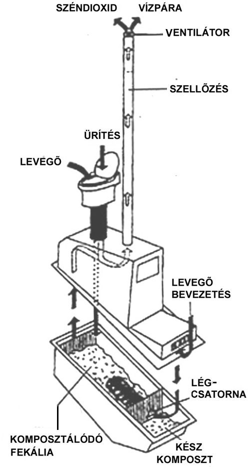

*6.8. ábra – Skandináv toalett*

Az alomszékek, száraz toalettek megfelelőségének egyik legfontosabb kritériuma a jó szellőztetés és a lebontáshoz szükséges cellulóz biztosítása. Ezek a berendezések már termékként is hozzáférhetőek. Az egyéb, fekáliamentes szürkeszennyvíz kezelése olcsóbb és egyszerűbb, hiszen ülepítés után a talajban elhelyezett dréncsövekben a telken belül elszivárogtatható.

A hétvégi házban, nyaralóban a kikapcsolódást az aktív időtöltés is segíti. A fenti alternatív megoldások ösztönöznek a kreatív hozzáállásra, amely által az „ökológiai lábnyom” is csökkenthető.

# 7. A lakásállomány fenntartása és fejlesztése

## 7.1. A lakóházak fenntartása

A lakóépületek idővel elhasználódnak, állaguk elöregszik. Ez a folyamat a *fizikai évülés.*

Az általánosan elfogadott lakáshasználati módok idővel megváltoznak, újszerű igények keletkeznek, az új lakások felszereltsége fejlettebb lesz, és egyre emelkedik az elfogadhatónak ítélt lakáshasználati színvonal alsó határértéke. Egy adott időszak hivatalosan rögzített vagy társadalmi közmegegyezéssel elfogadott normái szerint kialakított lakás évtizedek múlva már nem képes eleget tenni az akkor általános elvárásoknak. Ez a folyamat az *erkölcsi évülés*.

> **Megjegyzés**
>
> A huszadik század elején épült, az akkori normáknak és tömeges igényeknek megfelelő szoba-konyhás, komfortnélküli városi lakások vagy a csak külső árnyékszékkel rendelkező családi házak ma már az ország lakáskészletének legalacsonyabb minőségű szegmensét képviselik. Ilyenekre ma már nem adnak építési engedélyt.

A fizikai elévülés műszaki beavatkozásokkal késleltethető. A folyamatos karbantartás során a helyiségeket, nyílászárókat és más épület-alkatrészeket időnként átfestik, az egyes épületszerkezetek, berendezések meghibásodásait kijavítják, egyes elemeit kicserélik.

Az épületszerkezetek, berendezések élettartama a legjobb karbantartás mellett sem növelhető korlátlanul, azok előbb-utóbb tönkremennek.

A lakóházak szerkezeti komponenseinek élettartama nem azonos. Általában a tartószerkezetek élettartama a leghosszabb. Különféle építőanyagok, építésmódok esetén ugyan különböző, de legalább kb. 100 év élettartamra lehet számítani. Lényegesen kisebb a homlokzatképzések, fedések tartóssága. A belső burkolatok elhasználódásának ideje a felhasznált anyagoktól függően változó, de a ma általánosan használt anyagok esetén legfeljebb néhány évtizedre terjed ki.

A különféle szakipari szerkezetek (pl. nyílászárók) élettartama gyártmányonként különbözik, azonban a tartószerkezetek élettartamánál lényegesen rövidebb.

Az épületgépészeti berendezések és szerelvények átlagos élettartama 25-35 évre becsülhető.

A különféle komponenseket nem szokás, és általában nem is lehetséges a tönkremenetel-szerinti időpontokban egymástól függetlenül lecserélni (pl. gépészeti szerelvények cseréje aligha történhet a belső burkolatok felújítása nélkül, vagy a külső nyílászárók cseréjét is csak a homlokzat felújításával együtt lehet elvégezni). A lakóházak ciklikus felújításra szorulnak, ekkor a különféle mértékben elhasználódott, de élettartamuk határidejéhez közelítő, vagy azt már kismértékben túllépett elemeket egy nagyobb lélegzetű műszaki beavatkozás során újítják meg, cserélik ki.

A felújítások ciklusideje az alkalmazott anyagok és szerkezetek jellegétől függően változó, de legfeljebb 30-35 évre becsülhető. Ez azt jelenti, hogy a tartószerkezetek élettartamára becsült 100 év alatt a lakóháznak legalább két nagyfelújításon kell átesnie.

A lakóházak létesítési költségeiben a tartószerkezetekre jutó hányad legfeljebb 25-30 %, az építésmódtól és szerkezeti rendszertől függően. Ezért egy új épület létesítési költségeinek akár 50–75 %-át is felemésztheti egy-egy teljes körű felújítás.

Ha a nagyfelújítás a tartószerkezetek megerősítésére vagy cseréjére is kiterjed, akkor – a tapasztalatok szerint – a felújítás költsége általában meghaladja egy új épület létesítési költségeit. Ilyenkor a beruházás gazdaságossága nem igazolható, ha csak a befektetésből nyert használati értéket veszik figyelembe a kalkuláció során. A tartószerkezetekre is kiterjedő felújítás akkor indokolt, ha a ház olyan építészeti, városképi értékkel rendelkezik, hogy fenntartása a lakókörnyezet kulturális minőségének megőrzése szempontjából szükséges. Ez nyilván nem vonatkoztatható valamennyi lakóházra, ezért azok zömének bontására kell számítani a élettartamuk végén. A korszerű, ökologikus szemléletű tervezés a ház teljes életciklusába a bontást is beleérti, és lehetőleg könnyen bontható szerkezeteket, a természetbe visszaforgatható építőanyagokat alkalmaz.

A lakóházak fenntartási költségeit részben a folyamatos karbantartási költségek, részben a felújítások során felhasznált pénzösszegek teszik ki. Ezek lényegesen meghaladják a létesítési költségeket az épület teljes életciklusa alatt.

A lakóházak és a lakások erkölcsi évültsége megkérdőjelezheti a felújításra szánt pénz felhasználásának gazdasági hatásfokát. Biztosra vehető, hogy egy komfort nélküli lakás változatlan komfortszinten történő felújítására szánt befektetés nem térül vissza annak piaci árában vagy lakbérében. Ezért a felújítások során a lakásokat korszerűsíteni kell. Az újonnan beépített szerkezeteknek és berendezéseknek meg kell felelniük a felújítás idején érvényes szabványoknak és műszaki előírásoknak: ez önmagában a használati érték növekedését jelenti. Legtöbbször sor kerül a lakások felszereltségének növelésére, alkalmasint a lakás helyiségeinek kisebb-nagyobb mértékű átrendezésére, néha a többlakásos ház lakásösszetételének átalakítására is. Ezt a beavatkozást szokás értéknövelő felújításnak nevezni.

A felújítás során nyerhető értéknövekmény nagyságát előnyösen befolyásolja a lakások flexibilitása.

> **Megjegyzés**
>
> (A lakás helyiségeinek időszakonkénti átalakításával már a korai modern lakáselméletek is számoltak. Ez az egyik indoka a Le Corbusier által javasolt pillérvázas szerkezetnek. Mies van der Rohe tervezett olyan lakást, amelynek szerelhető válaszfalait a család létszámának növekedése szerint időről-időre át lehetett volna rendezni. Az átrendezés ilyen gyakorisága túlzott feltételezésnek bizonyult, de arra nagyobb időintervallumokban valóságos igény van.)

Már az építés idején is kedvező az épület tartószerkezeteinek olyan kialakítása (pl. pillérvázas szerkezet) amely rugalmas keretet nyújt egy lakástípus különféle változatainak létrehozásához, hogy a beköltöző lakó meg tudja választani a számára legkedvezőbbet. A nagyfelújítások alkalmával akár teljesen új lakáselrendezés is kialakítható, megfelelően flexibilis alapszerkezet esetén akár funkcióváltás is történhet.

## 7.2. A lakókörnyezet értéknövelő felújítása

Az erkölcsi évülés nemcsak a lakásokat, lakóházakat érinti, hanem azok környezetét is. Gyakran épp a lakókörnyezet erkölcsi évülése az ottani lakásállomány értékvesztésének a forrása. A századfordulón épült, zártudvaros pesti bérházak alsó szintjein lévő udvari lakások korszerűsítésére költött pénz megtérülése kétséges, ha azok továbbra is sötétek, szellőzetlenek maradnak. Gyakori, hogy a sűrű beépítésű, igen szűk utcákkal tagolt negyedekbe nem költöznek a jobb fizetőképességű rétegek a parkolóhelyek hiánya miatt, ugyanis a gépkocsitartás életformájukhoz tartozik. Gyermekeket nevelő családokat a zöldfelületek hiánya riasztja vissza a zsúfolt beépítésű városrészbe való költözéstől. A lakáspiac mozgásai azt mutatják, hogy a lakásárakat – amelyek végső soron a felújításra fordított beruházás megtérülési hatásfokát is jelzik – főleg a konkrét területi elhelyezkedés befolyásolja.

A lakókörnyezet erkölcsi évülésének következményei akkor a legszembetűnőbbek, ha típusos formában, nagyobb területi egységre terjednek ki. Ez olyankor áll elő, ha bizonyos lakóterületek egy időben, vagy viszonylag rövid időszak alatt épültek be azonos jelleggel, ezért azonos tüneteket mutatva egyszerre is évülnek el. Ez a helyzet Pest belső kerületeinél, de sok más ország metropoliszainak egyes kerületeiben is.

> **Megjegyzés**
>
> Az erkölcsileg avult lakókörnyezet lepusztulása öngerjesztő folyamat: az elavult, az átlagosnál rosszabb lakhatási körülményeket nyújtó környezet miatt a lakásárak (lakbérek) alacsonyak, emiatt az egyes lakóházak felújításához, korszerűsítéséhez szükséges tőke nem térül meg, így a felújítások elmaradnak. Az egyre romló állagú lakások árai vagy a bérleti díjai tovább csökkennek, ezért alacsony jövedelmű rétegek költöznek oda a társadalom perifériájáról. Ezek körében gyakori a deviáns magatartás, a romló közbiztonság távol tartja a fizetőképes rétegek megtelepedését: kialakul a „slum” a vele járó szociálpatológiai jelenségekkel együtt. New York egyik közismert slumja, a Harlem negyed elegáns környéknek számított újkorában. A magyar nagyvárosokban – szerencsére – még nem alakultak ki hasonlók, de a folyamat egyes szakértők jelzései szerint Pest egyes részein már elindult.

A beteg városszövetek megújítására két, ellentétes előjelű módszer alkalmazható. Lehetséges, hogy a lepusztult épületekből a lakókat bizonyos lakáspiaci stratégiákkal kiköltöztetik, és viszonylag nagy terület épületállagát teljes egészében lebontják. Ezáltal kiterjedt, összefüggő területet nyernek egy nagyobb lélegzetű lakásberuházás megvalósításához. A kimetszett településszövet helyére implantátum kerül (ez a *„városrekonstrukció”*). E drasztikus, igen tőkeigényes, de egyszerűen végrehajtható módszer az érintett városrész folyamatos fejlődésének megszakításával, az eredeti településkarakter és az általa örökített kulturális értékek teljes felszámolásával jár.

A lakókörnyezet értéknövelő felújításának másik, az előzővel ellentétes módszerét – az orvoslásból vett műszóval – *rehabilitációnak* nevezik. Ez az előzőnél jóval érzékenyebb beavatkozást jelent. Célja, hogy az eredeti településkaraktert minél nagyobb mértékben megtartsák a lakókörnyezet korszerűsítése mellett. Ez csak igen gondos tervezés és erőteljes önkormányzati beavatkozás, felügyelet mellett lehetséges. A tervezés során felmérik a rehabilitációra kijelölt terület épületállagát, kijelölik azokat a házakat, amelyek jó állapotuk vagy utcaképi jelentőségük miatt feltétlenül megtartandók, valamint azokat, amelyek bontása lehetséges vagy szükséges. A beépítés zsúfoltságának csökkentése érdekében a megmaradó épületek egyes részeit is elbonthatják (pl. a zárt udvaros házak egy-egy udvari szárnyát). Növelik a zöldfelületek arányát, parkolóhelyeket, térszint alatti garázsokat alakítanak ki stb. A lebontott házak helyére új épületeket illesztenek, amelyeknek közvetlen környezete is a kor kívánalmainak megfelelő. Összességében, a sikeres rehabilitáció megőrzi a településszövet fejlődésének kontinuitását, főbb elemeiben átörökíti annak karakterét, miközben korszerűbb, a mai élethez jobban illeszkedő lakókörnyezetet teremt. Ezáltal a korábbi, öngerjesztő folyamat előjelet vált: a jó minőségű lakókörnyezet miatt a lakásárak, lakbérek emelkednek, ami a beruházást gazdaságossá teszi és a rehabilitációs jellegű beavatkozások kiterjesztését inspirálja ([5.19. ábra](#abra_5_19)).

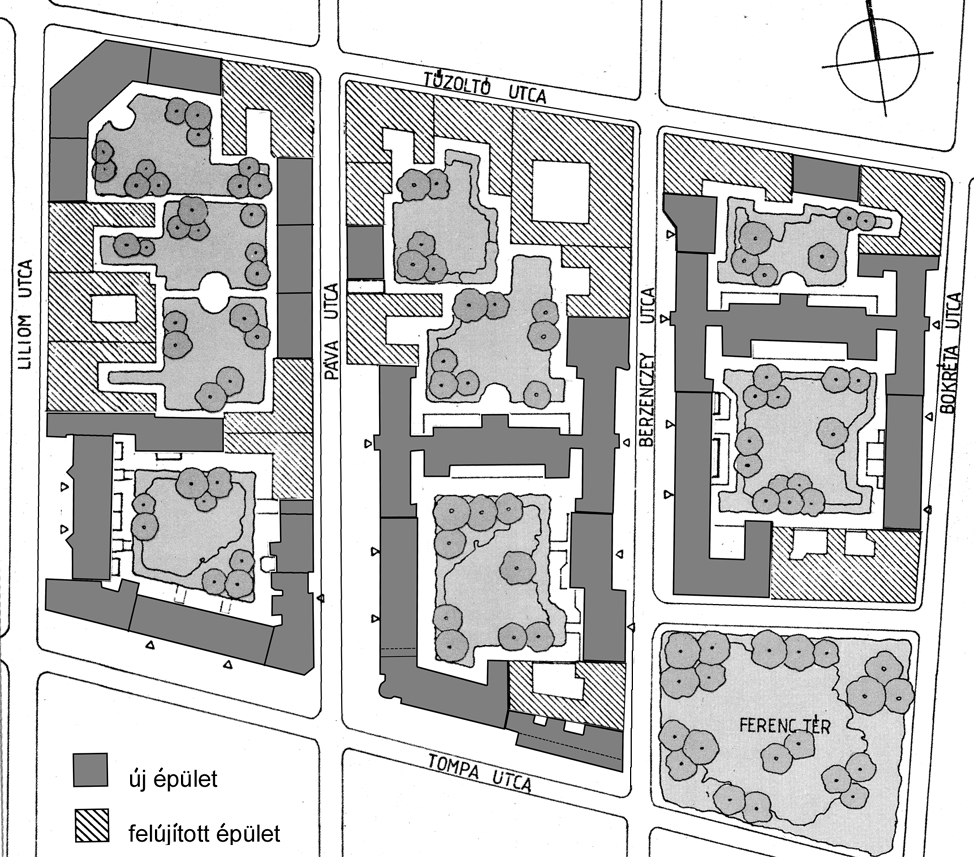

*5.19. ábra – Budapest, Ferencváros. Lakóterület rehabilitációja 1987-1990 Rendezési terv: Locsmándi Gábor Építész vezető tervező: Gyüre Zsolt TTI*

Röviden: ha nem egyes lakások, hanem egy lakóterületi egység *lakásállományának* fenntartásáról beszélünk, akkor a folyamatos karbantartásnak, értéknövelő felújításnak a *lakókörnyezetre* is ki kell terjednie folyamatos lakóterület-fejlesztés és – szükség esetén – nagyobb lélegzetű lakóterület-rehabilitáció formájában.

## 7.3. Az ország lakásállományának fenntartása és fejlesztése

Magyarország a mostani ezredfordulón kereken 4 millió lakással rendelkezett. Ez az érték a tízmilliós népességszámmal összevetve kielégítőnek tűnik, bár Európa fejlettebb országainak színvonala alatt maradt. Látszólagos lakásfelesleget is mutat az a tény, hogy a lakáskészlet 6%-ában a felmérés idején nem laktak. A lakásállományban azonban *szükségképpen* kell lennie éppen üres lakásoknak, mert könnyű belátni, hogy 100%-os telítettség esetén – ha egyetlen üres, beköltözhető lakás sem lenne az állományban – megszűnne a lakásmobilitás, és nem működhetne a lakáspiac.

Az ország lakásállományának *minősége* nem homogén, és sohasem lehet az, mert a most rendelkezésre álló lakáskészlet hosszú, száz évet is meghaladó idő alatt keletkezett. A meglévő házak életkora, ennek megfelelő fizikai állaga és használati színvonala törvényszerűen különböző ([7.1.c. diagram](#abra_7_01)).

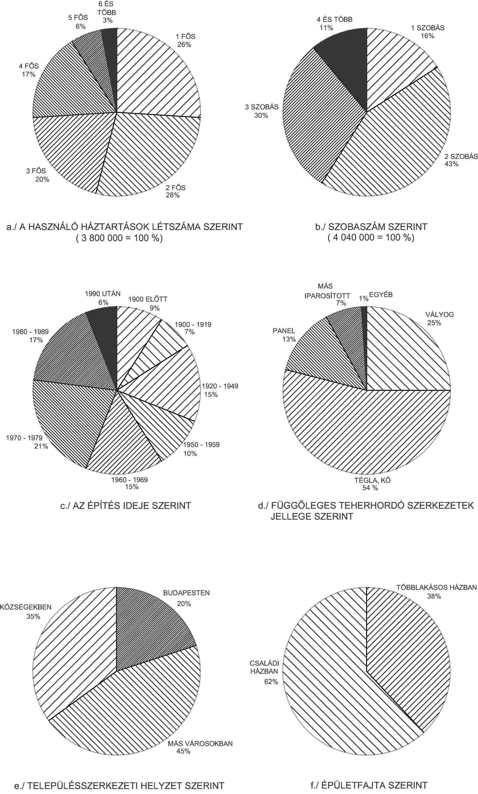

*7.1. ábra – A magyarországi lakásállomány összetétele az ezredfordulón*

Az erkölcsileg és fizikailag egyaránt elévült lakóházakat lebontják, azokat „lakáselhullásként” könyvelik el a statisztikák. Nem pozitív jelenség, ha a lakáselhullás mértéke aránytalanul kicsiny, mert azt jelzi, hogy a fizikai állaguk és használati színvonaluk alapján bontásra érett házakat továbbra is lakják. Például, a korábban hivatkozott felmérés a lakásállomány 25%-ában vályogfalat mutatott ki ([7.1.d. diagram](#abra_7_01)). Tudjuk, hogy a szigeteletlen vályogfalat annak idején nem „környezetbarát” megfontolásból építették, hanem azért, mert csak arra tellett, és már akkor is alacsony lakásminőséggel járt együtt. A lakásállománynak ebben a szegmensében bizonyára rengeteg olyan lakásegység van, amelynek használati színvonala mélyen a mai normák alatt marad, és hosszabb távon történő fenntartása aligha lehetséges vagy kívánatos.

A lakásállomány minőségére utalnak a felmérésnek a szobaszámára utaló adatai ([7.1.b. diagram](#abra_7_01)). Ha a fekhely nélküli nappaliszoba-használatot tekintenénk általános normának, akkor lakásállományunk 59%-a két férőhelyesnek minősíthető (lásd 1.6. fejezet). Ez az arány a lakásállomány egyfajta erkölcsi évültségét jelzi.

> **Megjegyzés**
>
> A [7.1.a.](#abra_7_01) és a [7.1.b.](#abra_7_01) diagram összevetése azt a látszatot kelti, hogy a lakások szobaszáma és a háztartások létszáma között nincs is nagy disszonancia, hiszen az 1-2 szobás lakások 59%-os részarányával az 1-2 fős háztartások 54%-os aránya állítható szembe. A statisztikai adatok összevetése azonban mindig *átlagos* értéket eredményez. Amikor a statisztikai felmérés azt mutatja ki, hogy egy vizsgált lakáscsoport együttes férőhelyszáma és a használók együttes létszáma azonos, ez azt jelenti, hogy a lakásokban a férőhelyszámnak megfelelő létszámú háztartás él, *átlagosan.* Tehát a lakások egyik részében az átlagosnál kevesebben laknak, a másik részében az átlagosnál *többen*. Vagyis a lakások tekintélyes hányada zsúfoltnak mondható, ha a fekhely nélküli nappali szobát általános normának tekintjük. (B.J.)

> **Megjegyzés**
>
> A múlt század második felében épült lakótelepeken a zömmel kétszobás lakások átlagos területe 54 m2, a történelmi belső városrészekben a 30 m2 körüli egyszobás lakások találhatók nagy arányban és kevesebb többszobás lakás. A családi házak között a 80-90 m2 körüli kétszobás „kockaház” uralja a vidéket. Nem nagyon színesíti a képet az utóbbi évtizedekben épült lakóparkok lakásállománya, ahol a lehetséges elérhető haszonmaximálás érdekében a szűk alapterületek váltak jellemzővé.
>
> Európai átlagban a lakások alapterületének növekedése figyelhető meg, annak ellenére, hogy az egy háztartásban élők száma csökken. (Az EU–ban 2001-2003 között épült lakások átlagos alapterülete 80-125 m2 között alakult, holott az átlagos háztartások létszáma 2003-ban már 2,4 főre csökkent.)
>
> Nálunk a nyolcvanas évek végéig, még az 54-63 m2 kétszobás lakásokat is 4 főre tervezték. Mára éles szakadék kezd kialakulni az úgynevezett szubsztandard és a magas minőségű lakások között. Az egy főre jutó lakásterület alakulása kimutatja, hogy a lakásszám évtizedeken át történő növekedése – miközben a szubsztandard lakások nagy részét nem bontották le – segítette az egyre kisebb létszámú háztartások kényelmesebb lakhatását. Mára a korábban 4 főre tervezett lakások kényelmesebb otthont jelentenek a kétfős háztartásokban élőknek (kialakulhat a fekhelymentes nappali). Ez egyben azt is jelenti, hogy a lakások belső kialakításában mindig bizonyos rugalmasságra kell törekedni. Új jelenség az egyfős háztartások számarányának növekedése és a nagyobb alapterületű lakások tervezése a kevesebb számú, de még bőven megtalálható 4-5 fős háztartások számára.
>
> Az a jelenség, hogy a lakások kevésbé zsúfoltan lakottak, és az általános lakáskörülmények javultak, egyúttal hátrányos is lehet, mivel egy-egy környék ezzel párhuzamosan elöregszik, kiürül. Ez beavatkozás nélkül általános leromláshoz vezethet, hiszen a vásárlóerő is távozik a fiatalabb generációval együtt. Ezért egyre fontosabb a vegyes lakásállomány létrehozása annak érdekében, hogy egy nagyobb épületbe vagy nagyobb szomszédsági területre vegyes életkorú és élethelyzetű családok kerüljenek, ezzel megelőzve az egyszerre történő kiürülést vagy elöregedést.
>
> Az új lakások építése során a társadalmi fenntarthatóság érdekében az összetett és változatos lakóépületek, lakóterületek kialakítása a cél. Új jelenség az egy fős háztartások számának nagyarányú növekedése minden korosztályban, illetve az egyszülős vagy mozaikcsaládok növekvő száma is. Ez azt jelenti, hogy a lakások alapterületi választéka és változatos funkcionális kialakítása egyre fontosabb lehet az új építés során, hiszen a meglevő lakásállomány az alapterület vonatkozásában elég egyhangú képet mutat. (N.Á.)

Az 1-2 szobás lakások felé nálunk kedvezőtlenül eltolódott arány ellenére, az ezredforduló körül épített városi lakóházak igen nagy számban tartalmaztak egészen kicsiny, egyszobás garzonlakásokat, mert erre volt legnagyobb a piaci kereslet. E jelenség azonban nem a lakástípus különös társadalmi preferenciáját, hanem a lakáskereslet fizetőképességének alacsony színvonalát jelzi. A lakáspiaci konjunktúra súlypontjai rövid idő alatt áthelyeződnek, de egy-egy időszakban épült lakások több évtizedre, akár évszázadra szólóan befolyásolják egy adott városrész vagy az ország lakáskészletének minőségét. Ezért is van szükség állami vagy önkormányzati beavatkozásra a lakáspiacon, hogy különféle preferenciákkal, szubvenciókkal ellensúlyozzák azokat a nem kívánatos hatásokat, amelyeket a piac „tiszta” működési mechanizmusa okoz.

> **Megjegyzés**
>
> Mivel az épített környezetet a nyersanyagok kitermelése, a gyártás, a közművesítés és az építés folyamata évtizedekre esetleg évszázadokra meghatározza, ezért a lakások létrehozása nem tekinthető egyszerű piaci folyamatnak. A lakás különleges termék, hiszen több generáció számára nyújt használati értéket, és alapvetően meghatározza a mindennapi életet az egész épített környezetben, így azok életét is, akik nem benne laknak.
>
> A lakás különleges termék azért is, mert a lakhatás a fejlett társadalmakban a megfelelő táplálkozás után a legfontosabb emberi igény, hiszen a többi tevékenység (családi kapcsolatok, társas kapcsolatok, szórakozás, pihenés, részben a munka, létfenntartás, fajfenntartás) számára biztosít teret, ezért a lakásépítés közpénzekkel történő támogatása jó eszköz a településpolitika és a társadalompolitika kezében. Bár a posztkommunista országokban az urbanizáció félig sikerült gyermekei (a nagylakótelepek) és a piacgazdaság első szülöttei (lakóparkok) a lakáskérdésre egyszerűsített választ adtak, mára világos, hogy amennyiben a települések a fenntarthatóság szempontjait komolyan érvényesítik, úgy a fenntartható lakásállomány kialakításában lehet szavuk.
>
> A lakások létrejöttéhez a legtöbb esetben közvetetten vagy közvetlenül közpénz is szükséges (utak, közművek fejlesztése, a területen a szociális és egyéb ellátások biztosítása) ezért elengedhetetlen, hogy a közpénz megfelelő hasznosulása érdekében bizonyos szabályokat alkossanak a lakás helyiségei, az anyaghasználat és az üzemeltetés megfelelő szintjének kontrollálására. A kontroll eszközei: az OTÉK, az egyedi településrendezési előírások, az energetikai követelmények, az esztétikai követelmények, míg a támogatás eszközei lehetnek pénzügyi eszközök (közvetlen támogatások, kölcsöntámogatás) vagy egyéb módok: pl. közművesítettség biztosítása, megfelelő tájékoztatás, információk, tervek, megoldási javaslatok kidolgozása. (N.Á.)

A lakásállomány társadalmi hasznosságát nagymértékben befolyásolja annak *területi eloszlása* ([7.1.e. diagram](#abra_7_01)). A területi eloszlás és az ország egyes régióinak gazdasági vitalitása között összefüggés van. A gazdaságilag fellendülő térségek munkaerő-szükséglete az ottani lakáskeresletet növeli, míg a gazdaságilag elmaradott térségekben lakáskínálat áll elő. Ez a jelenség jól kimutatható a lakásárakban: egyes, gazdasági jelentőségüket vesztett városokban a lakások szinte eladhatatlanok; a gazdaságilag degradálódott, városoktól távol eső falvakban nagy házat lehet venni egy budapesti garzonlakás áráért. Minthogy a lakásfenntartásba (felújításba) történő befektetés megtérülése az ingatlanárakkal összefügg, az országos lakásállomány – mint nemzeti vagyon – fenntartásának gazdasági feltételeit igen kedvezőtlenül befolyásolja, ha a munkaerőpiac keresleti oldalának és a lakáspiac kínálati oldalának területi eloszlása nagyon különbözik. Az elmaradott térségek lakásállományának degradálódása a fejlettebb régiókban teremt lakáshiányt. Egyes területekre jellemző iparágak időszakos konjunktúráját vagy dekonjunktúráját követi a munkaerő-szükségletek – lakásigények – állandó területi átrendeződése. A munkaerő mozgását nálunk az is hátráltatja, hogy a 90-es évek privatizációs hullámának következtében európai léptékben egyedülállóan kicsi lett a bérlakások aránya: mindössze a lakásállomány 8%-a (fejlettebb európai országokban ez 30-40%).

A lakásállomány állapota és a gazdasági fejlődés közötti, nyilvánvaló összefüggés miatt a lakásépítés közpénzből való támogatása nem tekinthető csupán a társadalmi szolidaritás megnyilvánulásának. A lakásépítés támogatására szánt közpénz nemzetgazdasági léptékben az általános jólétet fellendítő befektetés is.

> **Megjegyzés**
>
> A támogatások csökkenése miatt a 90-es években drasztikusan visszaesett lakásépítési ütem sokak szerint menthető azzal, hogy a lakáshiány immár megszűnt, lévén valamivel több a lakás, mint ahány háztartást felmértek a népszámlálás során.
>
> A múlt század második felének „szocialista” lakásépítési terveit megalapozó ideológiákban állandóan hangoztatott cél volt a „mennyiségi lakáshiány” felszámolása, amit majd a „minőségi lakáshiány” felszámolása követ, amíg ki nem alakul egy ideális egyensúlyi állapot. Ezek szerint a mennyiségi lakáshiány akkor szűnne meg, ha a lakások száma eléri vagy meghaladja a lakásra jogosult háztartások számát, a minőségi hiány pedig akkor, ha minden háztartás létszámának megfelelő nagyságú és megfelelő minőségű lakásban él.
>
> E frazeológia könnyűszerrel cáfolható. A lakásállomány mennyisége is minőségi kérdés, mert attól függ, hogy milyen minőségi kritériumok alapján tekintünk egy objektumot lakásnak a felmérés során. A lakásállományban minőségi különbségek mindig lesznek annak eltérő korösszetétele miatt is, és mindig lesz olyan része az állománynak, amely az *akkori* minőségi kritériumokat már nem teljesíti. Ezeket elbontják, így az állomány mennyisége csökken, ha nem épülnek az elhullást pótló új lakások. Egyensúlyi állapot soha nem alakulhat ki.

Ha a lakóépületek élettartamára becsült időt 100 évnek fogadjuk el (nincs ok, hogy ezt ne tegyük), és egyenletes kor szerinti elosztást feltételezünk a lakásállományban, akkor évente legalább a lakásállomány 1%-át kitevő új lakás építésére van szükség, csupán az elbontott volumen pótlására. E képlet azonban nem érvényesül ilyen sematikusan, és az évente építeni kívánatos lakásszám a mondott értéknél lényegesen nagyobb. A lakáselhullást növeli a lakásigények területi átrendeződése is, valamint az, hogy az általános lakáshasználati színvonal emelkedésével egyre szigorúbb lesz a teljes erkölcsi évültséget kimondó, társadalmi közmegegyezéssel kialakított norma. Az ország lakásállományának fenntartása és fejlesztése nemcsak a meglévő lakások folyamatos karbantartását és időnkénti értéknövelő felújítását jelenti, hanem kellő számú új lakás építését is.

*

A lakások az élő településszövet sejtjei. Ami él, az anyagcserét folytat. Anyagcserét folytatnak maguk a sejtek is, de idővel elhalnak, helyükön újak keletkeznek, eközben maga a szövet is állandóan változik, átformálódik. A lakóházak tervezése során nem örök érvényű emlékműveket hozunk létre, hanem olyan épületeket, amelyeket a bennük és körülöttük folyó, szakadatlanul változó élet minőségére gyakorolt hatásuk szerint értékelnek. Lehet, hogy a felújítások során kisebb-nagyobb mértékben át fogják alakítani azokat, végül el is bontják, hacsak nem képviselnek jelentős kulturális értéket. Hogy melyik lakóházat kell jelentős kulturális érték hordozójának tekinteni, azt majd a későbbi kor dönti el.
