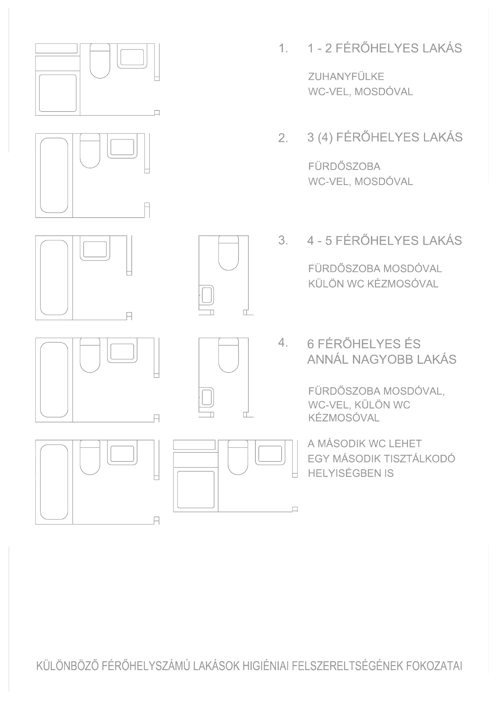
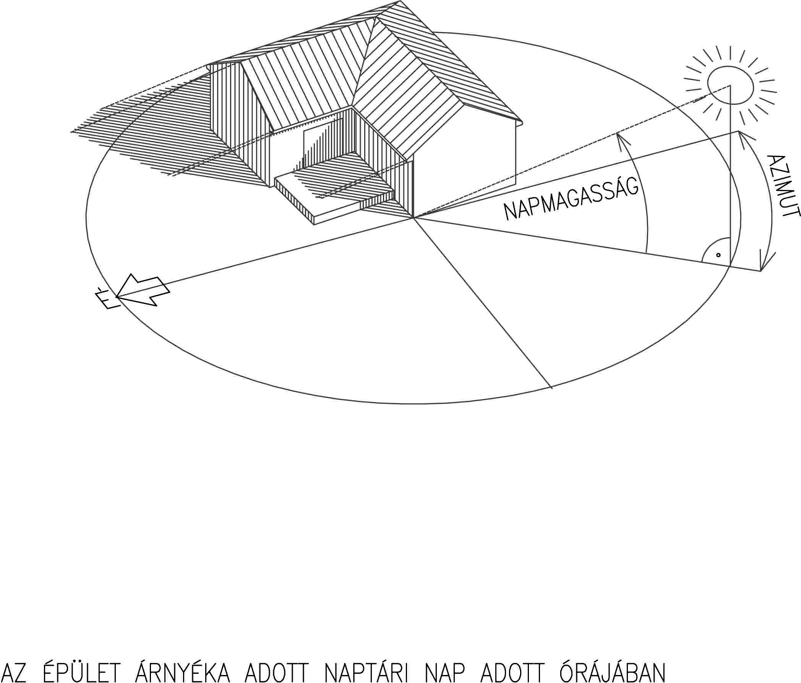
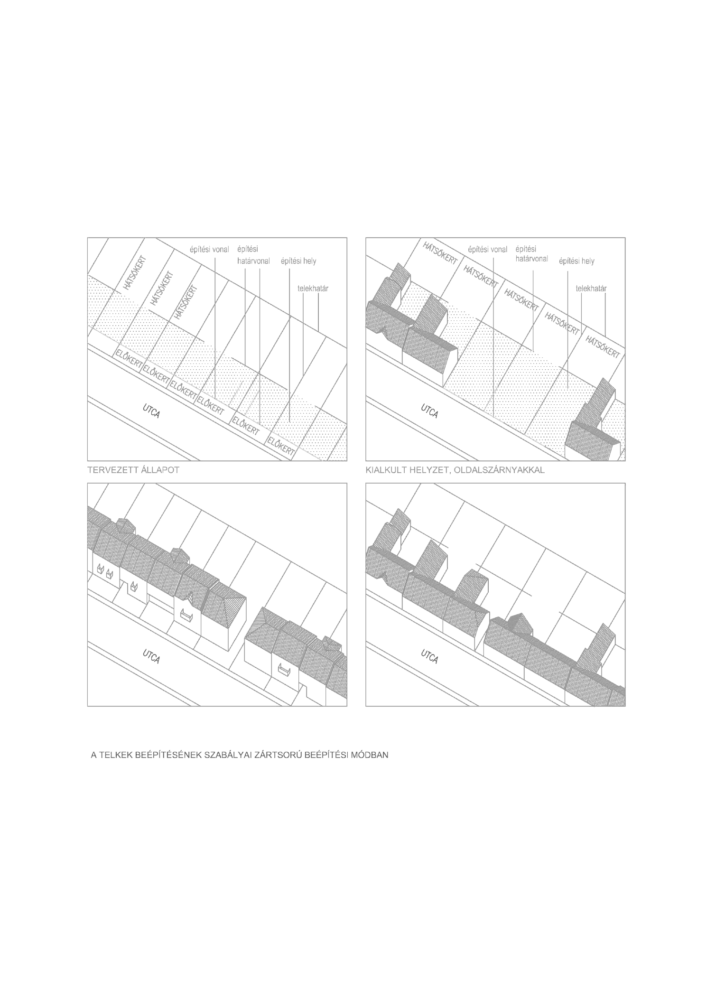
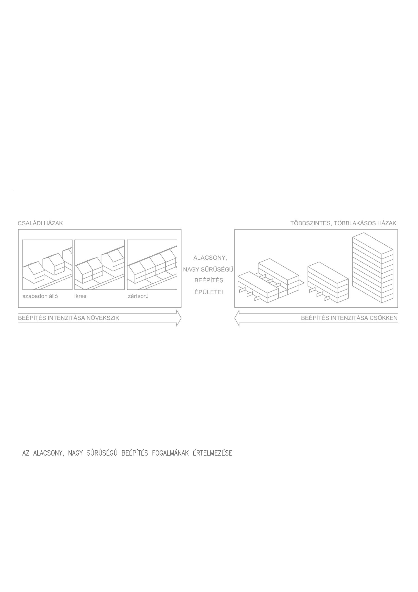
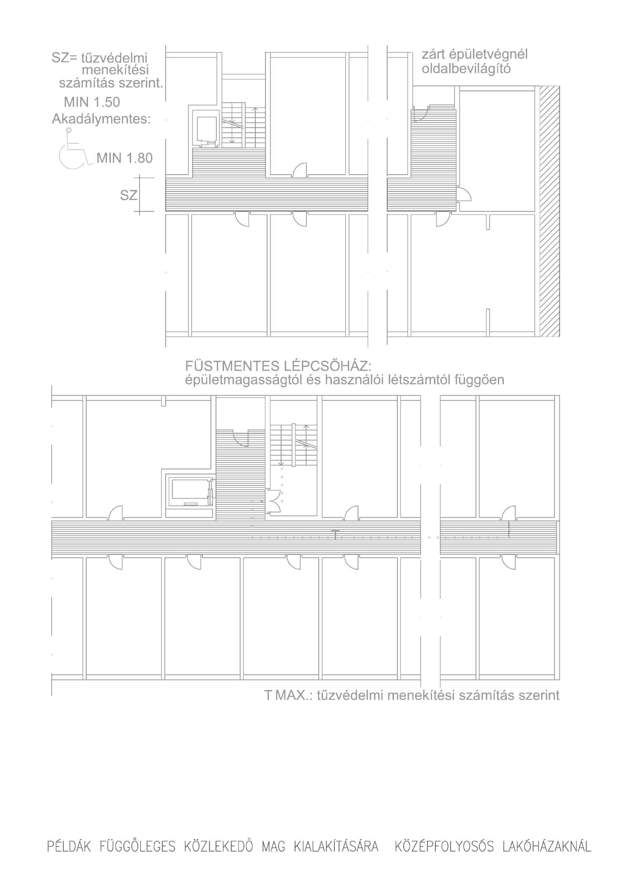
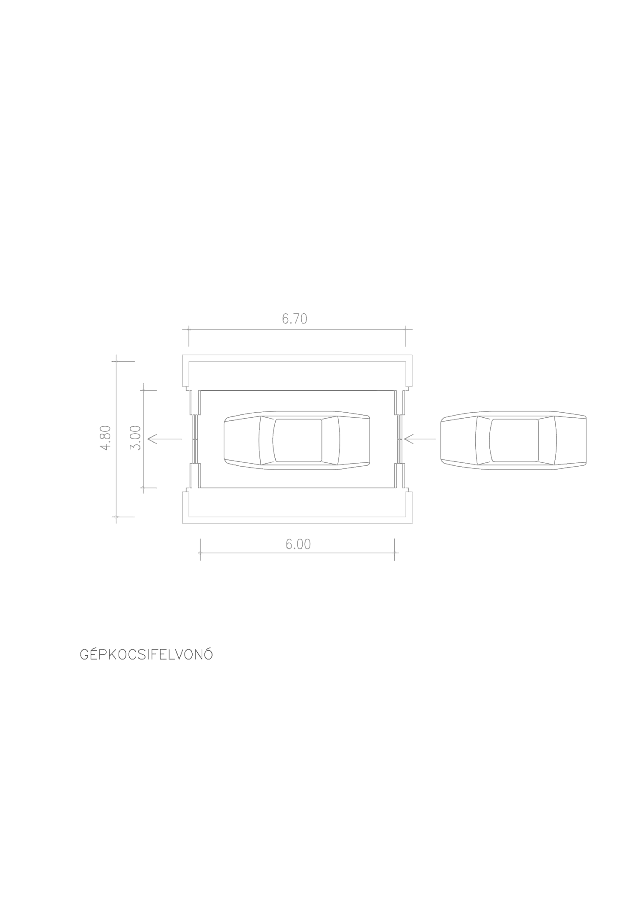

János Bitó

# Housing design
© 2013 Budapest University of Technology and Economics, Department of Residential Buildings

## Contributors
András Pandula – accessibility;
Ágnes Novák – sustainability;
Oliver Sales – translation.

The curriculum development of the BME Department of Residential Building Design was implemented under the project TÁMOP-4.1.2.A/1-11/1-2011-0055.

## Abstract

János Bitó’s textbook *Designing Residential Buildings*, now regarded as a classic and a defining work in the teaching of residential building design, is made freely available in digital form in this edition.

The book examines the objective aspects of residential building design. It begins with the rooms of the dwelling and the spatial requirements of individual activities, then considers family houses, apartment buildings, low-rise high-density developments and weekend houses, before turning to the design of residential environments and the maintenance and improvement of the housing stock.

The digital edition has also been updated in the fields of environmentally conscious construction and accessibility. An English translation of the expanded edition has been prepared to support teachers and students in the English-language programme.

## Editorial note

The statutory references in this volume require partial revision following changes introduced since the 2013 edition was completed. They should therefore not be treated as current legal guidance for design or regulatory procedures. A professional review is in progress; until it is complete, readers should check every cited requirement against the legislation in force at the time of use.

— György Hild DLA, architect

## Introduction

This material is primarily for those who will use this knowledge in the course of their studies and while practicing design work. While the information contained here is enough to assist in the design of residential buildings, it does not cover everything. The creative architectural design process should also include a certain knowledge and an innate judgment of values and emotions, a sense of taste and imagination. These skills can not be mastered with a single book. Development is best achieved through personal experience and continuous cooperation with skilled tutors.

Architectural design knowledge is one issue contained within this book. Specifically, the author places his hopes upon the functional aspect. Abstract concepts, including aesthetics, can be investigated while the purpose is to study "function, structure and form" as related to use, stability, durability and a building’s physical properties. Nonetheless, a house is just an agglomeration of useless forms and only achieves higher, appreciable architectural quality with an understanding of building codes and the nature of materials and components employed. Conversely, usability and structural rationality alone does not give rise to true architectural value if the house does not articulate an idea, conveyed as a sensory component of the perceived design message.

This subject at hand does not call for a concentration upon the design of building structures and construction technologies, since these are covered in a separate course at a local academic level. Sometimes questions of structure and construction technology are alluded to, but often not in totally in synch with a course of studies with a design objective, or according to a student's ability to deduce the relationship between disciplines. Therefore, structural issues are touched upon, but only at a depth that might influence the fundamental requirements inherent in the layout and design of residential areas.

Architectural discussion and issues of materials are deliberately avoided. These should be dealt with from a different perspective. The artistic aspect of architectural building quality, as in all building types, is judged in terms of homogeneous space and weight, proportional systems, scale and rhythm of materials in use, stylistic problems, etc. These limitations can be superficially discussed by readers within the context of the total text. Discussion of architectural issues and analysis of this work cannot be accomplished thoroughly without the accompaniment of pictorial illustrations.

Knowledge of analytical methods can bring one closer to the goal when respect for both the structure and the necessary information is molded into the architectural design. Often an understanding design practice evaluation criteria and the synthesis of knowledge are in conflict. I venture to claim that the creation of architectural design is achieved by an optimal balancing of key elements from disparate value systems. The world around us is changing rapidly, and this applies in particular to the legal environment. That is why it is important for an architectural education not to omit aspects of current zoning laws and regulations. Nevertheless, change is quite rapid, particularly in domestic practice, often making it almost impossible to update the given content, thus leading to inevitable inconsistencies. In spite of this, the reader should consider official regulations cited in this book to be valid at time of publication and those originating from a later date to be authoritative.

In Section [1.3](#E1_A_lakastevekenysegek_terigenye), certain requirements and recommendations have been set down – requirements in terms of expectations where foreseen by applicable laws, and general preferences based upon professional consensus. While not fixed in law, these requirements take the form of descriptions, valid within the field of education. However, there is no obstacle whatsoever to referring to these guidelines when in contact with building developers and their respective funding institutions.

Chapters on various residential building types are preceded by a brief historical overview. On one hand, this helps the reader embed the topical information in a universal history of architecture. On the other hand, in order to understand the pure form of development, one must take into account the socio-economic, cultural and environmental factors at the time of each building type’s creation. Thus, it becomes clear how to interpret them and how circumstances have changed with time.

Illustrations and specific examples presented in this publication are for instructive purposes only and are not meant to be viewed as design solutions. Self-respecting students are expected to move beyond the information provided.

The majority of material published within has been revised and expanded from a previous book by János Bitó entitled Lakóházak Tervezése, copyrighted 2004, János Bitó and B+V lap és Könyvkiadó Kft.

This revised edition brings the work into line with current curriculum issues of sustainability, autonomy and universal design concepts regarding residential buildings and their surroundings, as they are inescapably important both in education and in practice.

New additions to this publication include PhD research work undertaken in the field of universal design (accessibility) by the co-authors Ágnes Novák and András Pandula, whose full names are shown alongside the chapters and supplementary passages they authored.

OTÉK appears throughout this publication and refers to Országos Településrendezési és Építési Követelmények (National Town Planning and Building Requirements). For this publication, Hungarian standards are adopted as an educational medium.

The authors express their gratitude to all those that contributed to the creation of this book in terms of work, as well as moral and financial support.

## 1. The home

### 1.1. Preface

Defining the term *home* is not easy to do, but it is necessary, especially when asked to define a nation's housing stock. When a home has no hygienic infrastructure – whether it be an urban home that is totally eroded due to a lack of maintenance, or a rural room that houses an extended family – the question arises, “How does one calculate this?” Obviously, this is housing at its very lowest extreme, a standard would not be acceptable for new residential dwellings.

Previous government standards described a minimum requirement for home building (entrance hall, lounge, kitchen, bathroom and toilet) that did not include certain use types. This had a shortcoming, however, since it did not encourage the design of new homes, because it did not cover issues of practicality – an entrance porch or separate location for the kitchen, for example. Defining these practical means as mere technical objects alone is not sufficient; it can only hinder innovation.

Would it not be more appropriate to assess the meaning of the noun *home* as a place covered by the verb *live*? We can live not only in an apartment; it is possible to live in a hotel, youth hostel, nursing home, etc., which allow for sleep, recreation, meals and personal hygiene. Prisoners are not referred to as living in prison; they are said to be held in a penal institution.

*Live* refers to a refuge for the sensations, a place that provides mental comfort.

An orphanage or juvenile facility is not a home in the traditional sense, but within its structure, it does provide, at a foster-parenting level, a home in terms of cooking, washing, cleaning and other domestic activities.

Homes can be seen as places that provide for two-generation families (parents with children). It is now increasingly rare to find homes with three-generation families (grandparents, parents and children), childless families, older couples, broken homes (divorced parent and children) and mixed families. It is also true to say a large number of people live alone. There are also homes that occupy non-family groups (loose connections of older children living with relatives or other community types including shared housing among friends and students). These shared occupancy groups are viewed socially as a *household*.

The *home* within a home communicates a message of close human relationships as well. This might be as individuals or as a group encompassing friends and social relationships, occasionally welcoming guests. Members of the household also need times of safe passage to the wider community of work, education or private activities. Family homes must also facilitate child care and child rearing, even though this is not present in some homes. (Often homes intended for one or two users have to accommodate children as well, but usually in emergency situations.)

The concept of home may be written as follows: The home consists of a group of spaces in which an individual or group of people in close relationship can reside for extended periods of time – allowing for appropriate physical and mental comfort, humane relationships and activities at home, as well as providing storage for basic needs, objects, equipment, etc. Housing's basic activities include leisure (common pastimes, receiving guests), common meals, sleep and relaxation, the residents’ individual activities, preparation of food, cleaning, washing, hygiene and storage of items.

Accordingly, you can not enforce quality criteria, since what would be viewed as *appropriate* should not be left out of this definition. A village hut with a single room also serves as a *home*, but does not meet the terms described.

In order to establish a goal for housing requirements, we must make sure that our assessment of the national housing stock takes into account income-related solutions, from low-cost rental social housing to luxury homes.

Once the criteria for a nation’s current economic norm (usually fixed) can be agreed upon, then it is possible to establish the lower limit at which planning and construction licenses may be issued. This should ensure the right of life and health, while preventing harmful solutions (e.g., defining a normative level of heating, ventilation and pollution-control measures). On the other hand, wealthier, advanced societies should provide a centralized norm that ensures and guarantees the increased value of housing as a national asset.

The following observations about housing design issues do not attempt to discuss conventional uses of space or functions as expected under current socio-economic conditions, but those that are considered spatial and objective concepts necessary to provide a standard of living.

::: note

A slow but continuous change can be observed in the development of housing. Connections or even separations might be observed due to work-related activities, entertainment, as well as cultural or even social environments. The home of the twenty-first century often revisits themes of the twentieth century. In many cases, these are purely functional forms which, due to work or leisure activities, might require nothing more than furnishing solutions, but the phenomenon of "abundance" design, which might have financial drawbacks over the lifetime of a given project, allows these spaces to be adapted for different uses over time.

— Ágnes Novák
:::

### 1.2. Dimensions of residential spaces

#### 1.2.1. Measurement, measurement systems, scale, scale systems

The Hungarian word for engineer, *mérnök*, vividly expresses the foundation for technical activities. Its meaning is "one who measures", derived from the ancient idea of the human body serving a measuring tool. Some countries still use these ancient techniques related to body size (thumb, palm, span, foot, elbow, ell and fathom). This served well for primitive construction, allowing for differences in the actual size of the builder's body; but later these units where fixed on various measurement devices, obviously at different intervals of time depending on the geographic location.

The inch-and-foot measurement system is still used in some countries, including the United States, Canada and Australia, as well as in international aviation. ([fig. 1.3](#abra_1_03))

*Figure 1.3 – Comparison between ISO and other systems of measurement*

Some systems used prior to the introduction of the metric system are still used in Hungary today – for land units, the *negyszögöl* (square foot). One Viennese foot (or *Klafter*) is equal to 189.65 meters; therefore, 1 *négyszögöl* = 3.597 m². Construction timber is often measured in units of *cölös* (inches) derived from the German word *Zoll*.

Measurement systems based upon the human body have been useful in architecture due to the direct relationship between body and spatial dimensions. It is often said that beautiful architecture takes its proportions from a well-formed man's body.

::: note

VITRUVIUS (Architect to Roman Emperor Augustus) in his works titled "De Architectura" writes, "the proportion of all works, together with all units of measurement overall, are ordered by symmetries. The symmetry and proportion applied to the design of a temple can only be exact proportions, as exist among the members of a man's physique." After an analysis of fine human physique, Vitruvius proposes, "In addition, the body's natural center is the navel. Should a man be placed supine with arms and legs outstretched with a compass placed in the center of the navel, a circle thus described will touch the fingers and toes. Just as the body describes a circular form, squares might also be found within. It is also possible to observe that if one measures the distance from the sole of the feet to the top of the skull, it is equal to that of the outstretched arms. This width and height in turn is equal to the square which it also describes". (Translation by Dénes Gulyás)
:::

The Ancient system for division of parts is known as the "Golden Section", which states that "Two quantities fall within the golden ratio if the ratio of the sum of the quantities to the larger quantity is equal to the ratio of the larger quantity to the smaller one." Leonardo da Vinci's well known illustration of the Vitruvian Man (fig. 1.1) adopts the golden section by using the pubic bone as the center of the square in proportion to the center of the navel.

*Figure 1.1 – Leonardo (Vitruvian illustration) constructing the golden figure and the golden ratio*

Towards the end of the 18th century, the French National Assembly adopted a decimal system of measurement proposed by their Academy of Sciences: metric, which is based upon a unit one forty-millionth of the distance through the Earth from Paris to South Korea (the Earth’s meridian through Paris). The metric system has been broadly adopted in most industrialized countries in 1889 (excluding Great Britain and the United States). This system is much easier to use, since it is not related to complicated measurements of the human body as is in the inch-and-foot system. (One centimeter, one decimeter and one meter are not related to any bodily dimensions.)

In the last century, the brilliant Swiss/French architect Le Corbusier, for his own design purposes, developed his own measurement system based upon the body and the golden section, as well as metric and inch-foot units. This system is known as Modulor. (fig. 1.2)

A brief description of Modulor, as a geometric system, is as follows:

*Figure 1.2 – Le Corbusier: MODULAR. First golden figure and final version*

A six-foot-tall (183 cm) figure is based upon the human form. The golden section places the navel at a height of 113 cm. Double this (226 cm) for the height of the raised hands. The differences in among these measurements give us a set of values (226, 183, 113, 70, 43 cm) that conform to the Fibonacci sequence, where the larger value is the sum of its two predecessors. Then draw two columns – one in red which is 183 cm high, and one in blue which is 226 cm high. Then subdivide these columns according to the golden section in ascending scale, and it will become apparent that these measurements approximate, with some degree of tolerance, the metric and inch systems. This provides a wealthy variation of measurement units.

The proportional Modulor figure may have been proved quite instructive – Le Corbusier's original was based upon the average height of European people at the time (175 cm) and later adjusted to six feet (183 cm) – since it returned to the fact that rooms need to be based upon the measurement of the human body, best described in feet and inches. Still, Le Corbusier's Modulor system is rarely used, although it is regarded as a brilliant intellectual performance.

The construction of building elements requires a system of lines with sizes and dimensions, including distribution of units or joints.

(From ancient times to the present, the brick has been used as a standard scale of measurement. These are otherwise known as scale coordinated products.)

International Organization for Standardization (ISO) specifies that the decimeter, H=10 cm, be adopted as the construction industry’s standard module, with larger measurements described as Multi-Modules and smaller ones as Sub-Modules.

Upon examining the ISO Module system, it is apparent that 3M Multi-Module is similar to the measurement of a foot. 9M Multi-Module is almost a yard, and a measurement of 1/4 Sub-Module approximates one inch. All of these are components of the British Imperial system. The common measurement of a footprint, or 3M (30 cm), often forms the basis for residential buildings design. Structures in multiples of 6M (60 cm) and certain products including interior doors, kitchen furniture and appliances are similarly based upon the size 1.5M (15 cm). ([fig. 1.3](#abra_1_03))

With respect to the dimensions in residences, values in subsequent examples are often rounded to the closest 0.5M (5 cm) Sub-Module. This accuracy should prove adequate to determine the spatial demands of household activities.

#### 1.2.2. Ergonomic data and movement-related situations

The use of domestic spaces and appliances, although related to the size of the human body, cannot be solely adapted as a basis for design. Some consider this a basis for design, but on closer examination, use of the average population’s size would only guarantee the comfort of half the population. Nor is it appropriate to correct the height of the kitchen counter and sink to suit a taller than average person; this also would be a mistake. Anthropometric data suggests that some items might need to be higher or lower than the given size of an average individual.

Some residential buildings, such as homes for the elderly or disabled persons, require that certain functions be adapted to suit occupants. (See chapter [1.7.](#E1_Az_akadalymentes_lakas-egyetemes_tervezes))

::: note

*Houses and homes need to consider the diverse needs of their respective residents over its lifespan. This must be taken into consideration when the building is new. Variations in household living patterns occur due to the birth of children, youths leaving home, or even elderly members of the family being taken into the extended family’s care. Changes might also occur due to temporary or permanent injury, illness or disability. A home should be readily adaptable, so any likely changes to its elements can occur without major disruption or redevelopment in its primary structure and infrastructure.*

— András Pandula
:::

Architectural design does not have to be restricted to the size of the human body in terms of spatial units, although it is recommended to consider the sizes of the human body during the planning process, since they are fixed in design standards and specifications. At different times, documented information has been made available to assist in the process. Separate disciplines have also described the human body in terms of anthropometry, including the garment industry, furniture industry, automotive industry, etc. Continuous measurement is also required as the average human changes from generation to generation.

To take a Dutch example, the average 18-year-old’s height is 181cm, approx. 190 cm for males and a little over 170 cm for females. It is also recorded that, over the last half of the 20th century, the average height increased by 1.3 cm every ten years, reflecting a mean overall increase of 6cm, due to better nutrition and quality of health care. This does not mean that Dutch figures will continue to rise at such a pace, but it might indicate similar future increases in domestic Hungarian growth patterns.

::: note

Based on these figures it was recommended by the EU in 1996 that the industry standard for internal doors have a minimum clearance height of 210 cm.

— Ágnes Novák
:::

Ergonomics is the science which deals with the reasonable amount of space and energy required to perform a task to gain highest performance results. This publication deals with information based upon previous academic research, both domestic and EU-wide, into specific ergonomic requirements where sizes are rounded to multiples of 5 cm (sufficient in accuracy for design of residential spaces and areas). Doing so facilitates the learning process by removing the need to refer to several manuals at one time. This system, however, is too rough for highly-detailed, specialist, interior design dimensions; therefore, it is recommended to refer to other manuals where more accurate information might be found. Illustrations showing dimensions have been rounded to the nearest 1M or 0.5M for easy use. (fig. 1.4) Movement around and within the home (unfurnished surfaces) are described in terms of the minimum dimensions required. (fig. 1.5)

*Figure 1.4 – Various spatial requirements and postures*

*Figure 1.5 – Circulation in the home. Circulation routes*

::: note

*Note that these values provided reflect the lower range of recommended sizes and appropriate use. When considering the conservation of sustainable housing stock, long-term practicality should be insured, so current regulations should be forward-looking. When changing the design quality of new homes – and not just with the aim of alleviating housing shortages – the design can include an increase of 5-10% upon the lower limit. Higher standards of living should reflect comfort in terms of the ability to satisfy demand by means of ability to finance such projects. Long-term higher-comfort homes should be constructed to meet that specific demand.*

— Ágnes Novák
:::

#### 1.2.3. Spatial requirement for domestic furniture and appliances

The majority of furniture, fixtures and fittings used in residential building design can be grouped according to function. Built-in furniture and equipment must be indicated on design plans, as they are integral parts of the construction process. A separate plan, often labeled "furnishing plan", indicates mobile items, although it is not compulsory in Hungary to provide such a plan. (In some countries, it is part of the statutory requirements.) Nonetheless, it is recommended to do so at the initial design stage to assist in schematic development.

On rare occasions, a client might request the full design of a home including a total interior design package incorporating the selection of all furniture and fittings. For individual home design, it is recommended to discuss furnishing arrangements with the client beforehand. A wise investor, however, is quite aware that a home can maintain its high value over the long term if the furnishing is appropriately arranged. Individually, use of furnishing will change with time according to specific needs. Generally, in most cases, multi-unit residential buildings are repetitive in the design of fixed items, allowing individual users the freedom to arrange mobile furniture at a later date.

The "furnishing plan" is not intended as an instruction guide for how to place furniture. It is provided to demonstrate how core activities might be performed throughout the home. Therefore, it is inappropriate to allow for specialist furnishing items when planning homes. It is advisable to design with commercially available manufactured items that meet cultural expectations in mind.

Commercial furniture – even standard items – also varies in dimensions, as does the human body (as previously discussed). It should be taken into account that most furniture is designed in accordance with the average home size. When designing smaller than average homes, care should be taken to be economic in design.

The space required for an individual item of furniture is usually larger than the item itself. When designing the floor plan, this should be taken into consideration. Standard-sized furniture occupies a furniture zone area. ([fig. 1.6](#abra_1_06)) Some furniture is larger than standard size (within reasonable limits), and some smaller, but they still occupies the same furniture zone. ([fig. 1.7](#abra_1_07)). It is also possible to benchmark the size of furnishings at lower or different sizes, so long as one allows for the replacement of furniture over the building’s entire lifespan.

*Figure 1.6 – Spatial requirements for furniture (example: armchair)*

*Figure 1.7 – Various items of furniture and respective use zones*

Important dimensions of most furniture items and their respective use zones are shown in [figure 1.8](#abra_1_08). Important dimensions of sanitary fittings and their respective use zones are shown in [figure 1.9](#abra_1_09).

*Figure 1.8 – Important spatial requirements for furniture*

*Figure 1.9 – Spatial requirements for sanitary equipment*

::: note

*Furnishing in some areas may differ significantly from standard values – for example, mobility aids (wheelchairs) or child-care-orientated furniture (baby baths and toilet training seats). Standard designs need not take these extremes functions into account; however, if allowed for in the overall development of a project, it might increase a home’s value. Larger areas in the home should allow for adaptation and the installation of large-scale items. Multi-unit housing and other forms of repetitive development should allow a leeway of 5-10% as a starting point when considering possible extremes in the space provided for furniture, fixtures and fittings.*

— András Pandula
:::

#### 1.2.4. Headroom allowances

In most homes, the headroom provided is continuous throughout, this being the vertical distance between the finished floor and ceiling surfaces. Where a home is built on several levels, the headroom is fixed depending upon individual floor slab heights. Lower headroom might occur in subordinate spaces (storage rooms) or throughout entire floor levels of the building (basements). Sometimes headroom may vary when the floor level differs within a room, or when the ceiling is not built horizontally. The latter case usually occurs when the closing slab is found at roof level (built-in roof space).

The standard size of a human requires a vertical height of 1.90 m for all activities involving movement while standing. Therefore, any floor area, according to some building codes, that has headroom of more than 1.90 m is classified as "Usable Space" and can be calculated as part of the minimum required floor area.

"Ancillary Spaces" are usually regarded as less than 1.90 m in vertical height and are often appropriate for embedded and mobile storage facilities, as well as equipment and furniture placement if they are accessible via a usable space with 1.90 m headroom or more. These areas can be used when the occupant is not in a standing position (bed, toilet, etc.).

"Reduced Utility Spaces" are usually to be found where a higher than minimum (2.20m) headroom is required (corridors and storage areas).

"Full Utility Spaces" refers to areas where headroom of 2.50 m ([fig. 1.10](#abra_1_10)) may be found as a lower limit for activities where ones hands are raised above head level, including an upper band of space for such uses as the placement of light fittings. This is considered to be lower limit, while the general, average headroom of 2.70 m is usually adopted for medium-standard homes. Spatial comfort is usually proportional to floor area; therefore, a larger room might have a higher ceiling. Take care not to provide ceilings that are too high in small rooms, since this is often considered confusing.

*Figure 1.10 – Domestic headroom*

::: note

*The prescribed minimum headroom (2.50 m or 2.20 m) can also benefit construction costs. Obviously higher headroom in core spaces allows for larger windows that provide proportionally smoother and brighter lighting throughout. Areas with greater headroom will also allow for better ventilation and internal airflow, which is more favorable in the summer. Heat loss (cost) is not directly related to a room’s volume, but the ration of surface area/volume. Compact forms of construction do not imply an increase in operational costs in proportion to height. It can signal an increase in comfort and may obviate the need for mechanic assistance (no air conditioners required). For this reason, in some countries, the minimum interior headroom for family houses is set higher at 3.00 m to allow for greater comfort.*

— Ágnes Novák
:::

Current town planning and building code in Hungary (OTÉK) has fixed average headroom requirements as follows: primarily used room (living room), minimum average height 2.50 m (excluding secondary spaces); less frequently used rooms, 2.20 m (not including living rooms). However, compliance with regulations does not guarantee usability. Check that residential spaces meet performance requirements in all respects. Bedrooms with an inclined ceiling, averaging 2.20 m, might be appropriate but not necessarily recommended with a horizontal ceiling. Let the latter be a space of full utility, which is standard in all cases. A space with less than 2.20 m average headroom may be sufficient for the placement of a toilet. Ancillary spaces below an angled ceiling might be appropriate for locating some furniture, fixtures and fittings depending upon the depth of space available. Demand for use of space might dictate terms regarding lofts outfitted as children's rooms. [Figure 1.11](#abra_1_11) illustrates options for built-in furniture (sanitary fittings, kitchens, wardrobes, etc.). It is advisable to avoid going more than 1.00 m deep into spaces lower than 1.90 m, as it will be problematic to clean without physical discomfort.

*Figure 1.11 – Use of furniture and fittings below sloping ceilings*

#### 1.2.5. Door dimensions

Doors in residential buildings are usually single- or double-leaf and, in some cases, sliding. (Sometimes openings between rooms are sealed off by curtains or plastic harmonica doors; however, these options are not air or sound proof, and therefore can not be applied where separation of individual rooms is required.) Double-leaf doors are usually symmetrical, but asymmetrical leaves are occasionally fitted (e.g., entrance doors), the larger leaf being used on a regular basis and the smaller leaf being opened for such tasks as delivery of furniture. Single leaf doors can be described in two ways. When facing the door on its opening side, if the hinges are on the left hand side, this is referred to as a "left hung" door. Conversely, if the hinges are on the right hand side, this is referred to as a "right hung" door. ([fig. 1.13](#abra_1_13)) Doors are provided with or without thresholds. The latter usually applies to doors that separate wet and dry function rooms (e.g., a door to bathroom). Thresholds can be omitted if the difference in floor levels is less than 1 cm (the wet function room being lower) and this difference is covered by a thin metal strip.

*Figure 1.13 – Basic door opening types*

In terms of sound insulation, doors without thresholds are not as good as those that have one. Yet, raised thresholds can pose a barrier to disabled users.

::: note

*A home with fewer raised thresholds is advisable in terms of utility and comfort. Consider that small children learning to walk or running around do not lift their feet very high. The same applies to older people shuffling about the home, who risk of falling. This also applies to children in all buildings and nursing homes for the elderly. Where sound insulation and air-tight barriers are issues, automatic thresholds can be used. Automatic thresholds come in various forms, but are usually of two types: those which rise from the floor when the door is closed, or those which extend from the bottom of the door to meet a rubber sealing strip. The latter is ideal in locations adjoining wet places.*

— András Pandula
:::

On plan drawings, a line is drawn through the center of the door. Above this line, the door’s width is indicated; below this line, the door’s height is shown. Door measurements display two characteristics: the clear opening between frames and the nominal size. The nominal size is fractionally larger than the real, manufactured size to allow leeway for onsite installation. The numbers indicated on architectural plans are nominal sizes. ([fig. 1.12](#abra_1_12))

*Figure 1.12 – Basic door measurements*

The recommended clear opening height for internal doors is 205 cm, which most manufacturers provide at a nominal height of 210 cm.

The actual "use size" of a door is found to be 10 cm larger in width and depth, on both sides, than the inner measurement of the frame. (The door’s actual opening size is larger than indicated on plans.) These larger measurements constitute the door’s use zone.

::: note

*Doors placed near corners of walls are best placed 10 cm away from the corner to allow space for the door handle when the door is open position at a 90° angle. The path through this opening then remains clear.*

— András Pandula
:::

It is usual to provide an "additional use zone" of 20 cm at the opening side of a door. This allows for ease of use and an ideal place to locate light switches and power supply sockets usually used for vacuum cleaners. ([fig. 1.14](#abra_1_14))

*Figure 1.14 – Door use zones*

::: note

*The main entrance door is ideally installed in a flat area, at the same level as the interior. Try to avoid ramps and steps. Also allow adequate space for finding door keys to facilitate locking and unlocking. The entrance door is one of the most frequently used places in a home for delivery of parcels and carrying of equipment.*

*(The same applies to the pantry, storage room and laundry room.) Therefore, it requires a larger than usual "additional use zone" of about 50 cm to ensure comfortable use. This "additional use zone" could be increased still further, which is quite beneficial when we consider children being carried, larger packages being handled, tools (suitcases, clothes baskets, shopping bags, vacuum cleaner) and even physical aid equipment (wheelchairs, walking frames) to allow for barrier-free access.*

— András Pandula
:::

Sliding doors can be advantageous in some situations, as they occupy little space. Still, they are not as air-tight or sound proof as conventional doors. Sliding doors can be mounted to the door opening without the need for a frame, or they can be built into a framed opening if required. These doors do extend in front of walls when open. ([fig. 1.15](#abra_1_15)) This surface can be hidden behind furniture (e.g., a bookshelf) or placed into a demountable bulkhead wall.

*Figure 1.15 – Sliding door dimensions*

Placing a sliding door between two masonry walls is not advisable, since it is hard to fit the guiding track and even harder to repair should the system fail. The latter might result in the need to demolish then rebuild one of the side walls.

#### 1.2.6. Window placement

The primary function of windows is to provide daylight and ventilation (later discussed in parts 1.5.1. and 1.5.2., respectively). The development of residential spaces is influenced by the placement of windows in relation to where optimal lighting is required for practical reasons.

The windowsill level is determined by location and light requirements. ([fig. 1.16](#abra_1_16)) The windowsill in living rooms and bedrooms is usually located at a height of 90 cm, which allows for a clear horizontal view out of the window from a sitting position. In attic space rooms, which are a little more ambiguous, windows should be placed so that the bottom edge of the glass surface is not above the eye level of a person seated at 110 cm or 120 cm.

*Figure 1.16 – Placement of windows*

Lower sills or windows without sills may be used where intensive visual contact is desired with the outdoors. This usually occurs in rooftop terraces or living room windows overlooking gardens. When using these windows one should also consider heating the room, since radiators cannot be paced below them (or only with limitations). Where the external ground level is more than 80 cm below the finished floor’s interior level, a sill level of 80 cm or more should be employed as an inhibitory safety wall. When upper floor windows have sill levels lower than 80 cm, a horizontal safety measure should be placed at a height of 95 cm above the floor level. This must be fixed and reduce the risk of falling out of the window. It is also recommended to use shock-resistant safety glazing in these locations.

Where larger than standard areas are used, vertical glass structures generally require some form of solar shading device to provide protection against overheating in the summer. Vertical surfaces, glass doors and windows, do not provide the interior with much lighting below 60-80 cm in height (unless the interior floor’s finish is reflective, which could be disturbing). This should be taken into account when calculating interior illumination levels. When considering heating, security and maintenance, a 20 cm zone should be provided along the solid structural line of the wall. In cases where the glazing starts at floor level, sunken radiators or heated floors should be used to prevent condensation at lower levels. Low-level windowsills also compromise a building’s thermal performance, especially in winter conditions, due to the glazing’s lower surface temperature. This brings about a need for high-performance glazing solutions.

Larger-plan area spaces require more light at eye level, which is best achieved by increasing the number of light sources by introducing vertical windows that are higher than usual instead of wider horizontal windows (with the same area of glass being used to do so).

::: note

*Inclined glazed surfaces can increase summer overheating. Therefore, consider the orientation of windows to take this into account. A good example of this is when a bedroom has an east-facing inclined window. It will be exposed to more direct sunlight for a longer time than a vertical window and lead to discomfort through overheating in summer months. This demonstrates that increasing the size of inclined windows is not always beneficial unless used in specific design situations (studios, greenhouses, etc.).*

— Ágnes Novák
:::

Some bands of furniture might be placed below parapet level (desks, kitchen units, etc.), but they should not be deeper than 75 cm, or it would be hard to reach the window handle.

The usual location for a heating element (radiator) is below the windowsill. This wall also conceals the heating pipes. Therefore, allow a clear zone of 15 cm in front of windows (fittings zone) that should not be furnished. Built-in furniture can occupy this fittings zone so long as it is provided with cover units. In some situations, the heating pipes are placed in the floor, and the fittings zone will only need to occupy the width of the window, not the wall adjacent to it. When preparing construction drawings, take care to consider where pipe work and wiring run and provide a safety margin for later furnishings. ([fig. 1.16](#abra_1_16))

If built-in kitchens are placed below windows, sills should not be lower than 120 cm (100 cm in some cases) as side hung windows will interfere with activities on the worktop. In this situation, the radiator will be located elsewhere, unless the kitchen unit functions solely as a work surface without cabinets below. A ventilation gap will still be required along the work surface to prevent any obstacle to the free circulation of air. (Note: Homes for disabled users do not accept this practice, as radiators could burn people’s legs without them being aware.)

Bathrooms and toilets often have higher sill levels to prevent people from looking in. Windows might also have opaque glazing (e.g., cathedral glass and sand blasted glass), but this is often detrimental to the elevational treatment. It is advisable not to place bathtubs in front of windows, especially with high sills, as they are hard to open without specialized handle systems.

Window sizes and placement often create problems when designing a building’s elevations. A single window might have a negative impact on the rhythm or proportion of a building’s elevational treatment. It falls upon the architect to balance these problems and solve the design, often leading to the redesign of an entire room, to create a positive elevation. That is why it is advisable to consider the design of elevations when beginning the very first sketch plan.

#### 1.2.7. Determination and dimensioning of spaces

Dimensioning is an important part of process required to determine which activities take place within residential spaces. This is also combined with use of certain furniture and furniture groups.

If individual items of furniture are placed in usage groups, then the use zones will overlap and then circulation spaces will become visible. ([fig. 1.17](#abra_1_17))

*Figure 1.17 – Compilation of furniture groups*

A residential area (room) can be assigned its given area once each item of furniture, as well as the fixtures, fittings and circulation spaces are assigned minimum floor-plan dimensions. ([fig. 1.18](#abra_1_18)) Obviously, the use zones and circulation areas do not have to be marked on plans. If furniture arrangements are considered – initially, in minimal spatial terms – it is easy to expand these sizes later on; and if possible, it is recommended to do so. One does not want a room to be furnished solely in one way, so allow a desired amount of flexibility or "reserve space”. A careful architect will dimension with these furnishing variations in mind.

*Figure 1.18 – Determining room dimensions based on furniture arrangement*

Experience often shows that furnishing zones and circulation areas often seem to be smaller than required. In fact, given the size of most plans, some reserve space should be allowed for.

Sanitary equipment is built in during a home’s construction phase and has to be precisely sized, allowing for use zones. ([fig. 1.19](#abra_1_19)) It is possible to increase this area, therefore allowing a higher standard of amenities that will be better in terms of furnishing, floor area and comfort provided.

*Figure 1.19 – Bathroom size defined by fixtures spatial requirements*

When preparing 1:100 or 1:50 scale plans, the room's dimensions apply to structural wall sizes and do not take into account the real thickness of finished walls. This means that a wall's real size might vary in terms of millimeters, but traditionally a wall is about 5 cm thicker than indicated on plans, since each side can be finished with about 2.5 cm of adhesive plaster and wall tiles. This, in turn, reduces the actual size of a room by 5 cm in all directions. In smaller spaces, this can lead to health problems. Although, in larger spaces, the use zone for furniture items provides enough leeway to deal with this; in smaller areas, the thickness of the wall finish must be taken into consideration. ([fig. 1.20](#abra_1_20)) In most situations, this simply reduces the usable area of a room; but in some situations, neglecting the thickness of the wall’s finish can make the placement of fixed-site fittings or built-in elements impossible. For instance, where kitchen units are placed near doors, variations in wall finishing treatments must be taken into account to avoid problems.

*Figure 1.20 – Wall finishes should be taken into consideration as shown in shorter measurements*

The next chapter contains accommodation requirements for lower-level performance criteria. These are poor in appearance and therefore not to be reduced further. Unfortunately, most publications dwell upon items used in the planning of luxury-category housing, while other projects fail to meet minimum standards.

Some residential dimensions are derived from occupancy levels (e.g., dining room, living room and sanitary areas). The occupancy level shows how many residents can live in the home at the appropriate standard without saturation. However, the housing market is not based upon occupancy levels and cannot be expected to operate so. This is something the architect must consider. Larger homes often reflect affluence, not the size of the family or how many children live there. Still, it is desirable that the home should withstand being fully occupied by the maximum number of residents. The number of potential residents can be determined by the number of beds that are placed, given the proper conditions, within the home. (See Section [1.3.3.](#E1_Alvas_pihenes) on sleep and relaxation.)

### 1.3. Residential spatial requirements

#### 1.3.1. Recreation and entertaining

The home is where a close emotionally-related group of people (usually a family) communicate and spend their leisure time together. This

"family time" is not just important for mental comfort, but fosters personality development – primarily, the social acclimatization of children.

Family cohabitation relationships today are not as close as they previously were. Conversation and board games have been replaced by watching the television. Increasingly, individual members of the household have personal radios or even televisions in their rooms, in addition to a television set shared by the family.

A common pastime in most homes is receiving guests. That is why the living area is often larger than that required by actual number of people who reside there.

Generally furniture should be arranged in a group around a readily available coffee table that can be accessed from comfortable armchairs and sofas. A large number of families live in different locations, which leads to the need, in many cases, for family members to visit for a few nights as overnight guests. For this reason, it is unwise to consider sofas that are smaller in size than a bed (for example, the so-called “love chairs” on sale), since they should serve as spare beds. Variations on these furnishing arrangements can be seen in [figure 1.21](#abra_1_21).

*Figure 1.21 – Shared time, hospitality furnishing*

##### REQUIREMENTS AND RECOMMENDATIONS

**BASIC REQUIREMENT:**
Ensure that members of the household can spend their leisure time together, that guests can be welcomed into the household and that every family member has access to common audio-visual entertainment.

**FURNITURE REQUIREMENTS:**
Lounge furniture group to include seating, a sofa that can double as a spare bed, a coffee table, audio and visual equipment, as well as a storage area for books and other commonly used household items. Storage of books in this area might be waived if the home includes other possibilities such as a library, work room, den, etc.

**Sufficient furniture in lounge group:**
- 1- or 2-person homes, seating for 4 people
- 3- or 4-person homes, seating for 5 people
- homes for 5 persons or more, seating for 6 people

Common living rooms or lounge areas should be as large as affordably possible. (OTÉK stipulates a minimum 17 m².) For smaller apartments, a minimum 18 m² is recommended. In homes for 3 or more people, a lower limit of 20 m² will suffice. Room width or depth is best kept to a minimum of 3.60 m.

In smaller homes of 1-2 persons, it is possible to use the living room as a sleeping area. In some cases (such as social housing or more affordable models), it is inevitable that the living room will be used as a sleeping area when the number of bedrooms is not enough for the whole family. In this case, the living room must be separable, even from the kitchen and dining room, although the latter can serve as a provisional place to receive unexpected guests. (See Section [1.3.3.](#E1_Alvas_pihenes) on sleep and relaxation.)

A living room without sleeping space can function as a circulation area if the planning schedule does not specify otherwise. (See also Sections [1.5.1.](#E1_Megvilagitas) and [1.5.2.](#E1_Szellozes))

#### 1.3.2. Dining

Preparation of meals is described later on. Here the theme of meal times is discussed, which does not mean dietary intake. As common “family time” spent chatting in the living room becomes increasingly rare, togetherness in the family is better represented by common meal times. The dining room should be capable of accommodating shared meals on festive occasions.

One of the problems of panel housing developments from the ‘60s and ‘70s was the lack of a common dining area. Once furnished, the small living area did not leave enough room for a dining table beside the small kitchen, which also had no space for dining. In these homes, some families tried to improvise folding tables to provide dining areas; but, as many social surveys showed, family members chose to eat at different times.

The dining table rarely functions solely as a place for meals. It often serves as a place for playing cards and board games, or for smaller children to draw in close proximity to their mother. A well-sized dining table can compliment the living room. Dining tables in the vicinity of the cooking area can, when not used for dining, provide additional kitchen space.

Families often receive guests, so it is therefore recommended to have a table larger than that required solely for use by family members. [Figure 1.22](#abra_1_22) shows variations in dining furniture arrangements.

*Figure 1.22 – Shared dining furniture*

##### REQUIREMENTS AND RECOMMENDATIONS

**BASIC REQUIREMENT:**
Ensure that all members of the household and occasional guests can dine together in comfortable circumstances.

**FURNITURE REQUIREMENTS:**
Dining table and chairs. Recommend that seating allow for two extra places (for guests) in addition to the actual occupancy number. The dining area may be located in the dining room or living room, or it can be an integral part of the kitchen. In larger homes (where occupancy is more than 2-person), it is not possible to have a dining area in the living room when the living room is also used as a sleeping area. The dining area should be in proper vicinity to the site of cooking (not more than one door apart) except in cases where an alternative dining area is in the kitchen. There should be no steps between the dining area and kitchen, since this increases the risk of accidents. The dining area can be used as a general circulation area.

#### 1.3.3. Sleep and relaxation

The primary purpose of the home is a place to recharge and regenerate. This means undisturbed sleep (usually at night) and relaxation throughout the day. The usual setting for sleep is the bedroom, although other places are possible (sleeping gallery, sleeping cubicles accessed via other rooms, or the living room). Traditionally, bedrooms are on the upper level and also provide learning and study space, but not always. These other activities are discussed in another chapter. There is a continuous relation between the room (or rooms) for sleeping and other spaces in the home. To guarantee unity of design, this, too, must be examined. When the place for sleep is not properly separated from another adjoining space, then both spaces must jointly meet the requirements for sleep.

Obviously couples (parents) require intimacy regarding sleep area. Therefore, privacy should be allowed for in the design. Individuals within the household may also require sleeping areas of their own. Often, due to financial constraints, this is not possible. Hence, two or more people may have to share one room. For two, sharing requires a degree of mutual tolerance regarding individual life rhythms; but if three or more share, this could lead to congestion problems, so it is unacceptable. Younger children, even boys and girls, can be comfortable sharing; while teenagers or older siblings of different sexes might be disturbed by this. Consequently, it is important to design with these factors in mind.

As with other domestic activities, in a small home that provides sleeping facilities for one or two people, the users’ rhythms can be coordinated throughout. One or two users can easily avoid sleeping, preparing food and receiving guests at the same time. In this case, common areas such as the lounge can be used as a living room / bedroom.

Social housing – or affordable housing, in general – often does not provide sufficient sleeping areas in bedrooms unless this is also provided in the living room itself. The latter, in some situations, can be achieved at a modest level of acceptability. In this case, the living room / bedroom must meet the requirements for sleep.

Furniture requirements should take into account older or even elderly users. Older family members might move in, children grow up soon and leave, or parents grow older. Some furniture comes in the form of bunk beds (usually children’s beds), which is not appropriate. Double beds for parents, or those narrower than 180 cm, can only be used comfortable for a limited period of the life cycle. Also, they are not accepted under the same criteria as a double bed.

Draughty areas and cold surfaces can be bad for health. Thus, do not place beds directly under windows and, if possible, not along external walls. Direct proximity to radiant surfaces and radiators also interferes with sleep patterns, so try to avoid this, too.

Sleeping furniture and its respective layouts are shown in [figure 1.23.](#abra_1_23)

*Figure 1.23 – Sleeping, relaxation furniture*

##### REQUIREMENTS AND RECOMMENDATIONS

**BASIC REQUIREMENT:**
Ensure that users can rest or sleep without being disturbed.

**FURNITURE REQUIREMENTS:**
- Each person should be provided with a bed, 90 x 200 cm (plan area). To the side of each bed, provide at least 45 x 45 cm (plan area) and maximum 75-cm-high storage area (low cabinet, shelf, table, etc.).
- Each sleeping area, for usually a maximum of two people, should be acoustically shielded. The main householders, a couple or parents, should be provided with a twin bed, min 180 x 200 cm, which should be accessed along both long sides. A double (pull-out) sofa bed is also acceptable in bedroom / living rooms. Beds used by other family members or siblings should not be connected along the longer side. Where a home can provide for only one bedroom, this should be a double or master bedroom. The beds should be arranged in such a way as to avoid inconvenience, damage to health, and surfaces that are radiant, hot or cold.
- Any area within the home that is dedicated to the purpose of sleep should have a minimum volume of 15 m³ per person. (See Section [1.5.2.](#E1_Szellozes)) Single bedrooms require a minimum floor area of 8m², double bedrooms 12m², both taking into account a minimum volume for ventilation purposes.
- In larger homes of more than two occupants, the sleeping area should be acoustically separate, isolated from the rest of the domestic activities and not used as general circulation space, since this would disturb the purpose of sleep.
- One- or two-occupant homes do allow for the possibility of providing a living / sleeping room. In larger than two occupancy homes, it is possible to use the living room as a sleeping area (although not for children) as long as it is acoustically separate from other domestic functions (e.g., cooking and dining) and does not interfere with common pastimes, activities and welcoming guests.

#### 1.3.4. Individual activities

Various members of the household are often engaged in some form of activity that often requires a degree of privacy. School-aged children are occupied with studying, or white-collar workers might be working from home. The latter is of growing importance. Some experts have predicted that an information technology-orientated society will necessitate an increase in home-workplace relationships, with employers and co-workers communicating via personal computers.

::: note

*Distance working creates opportunities, diverse in respect of non-residential information technology solutions, which can strengthen pillars of economic and social sustainability. Working from home reduces pressure on transport networks and the environmental impact, while the work force has more available leisure and work time. Therefore, more time is obviously spent at home.*

— Ágnes Novák
:::

If someone is not working from home, most of the time is spent in various personal activities (internet browsing, reading, listening to music, needlework, etc.). Since there are so many possible activities that people might be engaged in at home, it is impossible to design for all situations. Usually, the minimum requirement for such activities is to provide each household member with space for a desk and chair. The same space also applies to sitting on a lounge chair (for reading, music and handicrafts), at a home computer desk or hobby bench. If one does not have extra room for such activities, these functions usually take place in the bedroom, as it is suitably isolated acoustically. In some cases, the householders’ place of work might be the living room. The furniture zone for a desk and a chair in the master bedroom might also serve for a dressing table if one parent does not require the space there for work. A baby’s cot may provisionally take the place of the dressing table during the period when care is required at night. The parent's personal items and books can be moved to the living room. Meanwhile, other household members’ possessions should be placed in proper proximity to the site of their individual activities. Whatever practical solution is decided upon, it should not interfere with anyone's comfort levels.

If financial or spatial wealth is above minimum, it might be possible to develop a more spacious working area within the home, including more storage, a separate TV area and guest seating area. *Bedroom* usually refers to the master bedroom, but the other bedrooms can function as living rooms – particularly when there are teenagers present, when adults are sharing a home, or when elderly family members are part of the household. Alternative furniture arrangements for individual activities are shown in [Figure 1.24.](#abra_1_24)

*Figure 1.24 – Furniture for other activities*

##### REQUIREMENTS AND RECOMMENDATIONS

**BASIC REQUIREMENT:**
Ensure that individual household members can pursue their various individual activities (e.g., studies and hobbies) without being disturbed or disturbing others and that the tools or objects required can be stored at hand.

**FURNITURE REQUIREMENTS:**
- Minimum requirement: A table of at least 60 x 120 cm (plan area) with chair and suitable use zone. Also, a low-height storage cabinet / bookcase measuring 90 x 45 cm (plan area) per person.
- Spaces for Individual tasks should be located separately. If sound is a problem, they should be acoustically isolated from other noisy domestic functions. Sleep and individual activities can take place in the same area, but the two functions can be distinct (for example, a bedroom and study in one) if affordable. One acoustically cohesive space should not be shared by more than two users. The individual activities of one person (householder) can take place in the living room if required. The parents’ bedroom can provide room for individual activities or an alternative, temporary spot for a baby’s bed.

#### 1.3.5. Food preparation

Food, while traditionally prepared in the kitchen, is not always cooked in a separate room nowadays. Kitchens, furniture and equipment, and the use zone might be located in a single space or form part of another room (living / dining room).

Kitchens contain worktops, stove, water supply and utensils required to prepare food. Storage space is also provided for eating utensils and cutlery. (Older kitchens were made up of a free-standing stove, wall tap, kitchen table and kitchen cabinet). Modern kitchens are derived from ideas developed in the 1930s. ([fig. 1.25](#abra_1_25))

*Figure 1.25 – The "Frankfurt Kitchen". 1931*

Developed over the last century, since the ‘20s and ‘30s, physical ideas of housework based upon ergonomic and functionalist theory, especially regarding food preparation, have lead to more space efficient solutions that required less effort. The prototype for modern, fitted kitchens was developed by Grete Lihotzky, in order to provide kitchens in workers’ housing designed by Ernst May in Frankfurt-am-Main, These kitchens widely became known as the "Frankfurt Kitchen". The same format kitchen was a great success at a housing exhibition in Stockholm, which is why it also referred to as the "Swedish Kitchen".

Modern kitchens are usually mass produced and therefore size coordinated to allow for manufacture of base storage units, wall-mounted units and work surfaces. The process of cooking and storage are described in [figure 1.26](#abra_1_26).

*Figure 1.26 – Domestic kitchen technology*

The most frequently used part of a kitchen is the space between the stove and sink. This should not be smaller than 60 x 60 cm. The surface on the other side of the stove is used for freshly prepared food. The work surface on the other side of the sink is used for food preparation, raw material and cleaning. After meals, this process is reversed, allowing the sink to be used for the washing of utensils, a second basin for rinsing, drying and storage of dishes.

Built-in components are coordinated to provide base units that are 60 cm deep and between 85-90 cm high. Wall mounted units, starting at a height of 135 cm from floor level, are usually 32-35 cm deep, the upper height not being fixed. Upper storage units can be built even up to the ceiling when the topmost parts are used to store less frequently used items that can only be reached by standing on a kitchen stool. A use zone of at least 120 cm depth should be provided in front of opening appliances (e.g., stove and dishwasher) and 90 cm with other furniture.

Stoves are usually gas or electric. Gas stoves are cheaper to operate, although open-flame combustion creates air-born pollution that is often deposited on curtains and other textiles in the direct vicinity. If the kitchen forms part of the same space as a living room, it is recommended to avoid using gas stoves. Electric stoves are available as a combined cooking ring and oven unit, though sometimes the oven might be supplied separately. The latter has the advantage of allowing ovens to be built into more convenient upright wall units. Space below the cooking top that does not house an integral oven can be used for additional storage.

Extractor fans are available in two types – one that filters the air before recycling it, and one that leads to the open air via a ventilated conduit. When kitchens are located in shared spaces, the latter is recommended and care should be taken to ensure a fresh air supply. If an extractor fan and central heating boiler are located in the kitchen, the latter must be a sealed combustion furnace.

Sinks are usually single or double units, with or without dish drainers. If a dishwashing machine is not fitted into a kitchen, it is advisable to install a double sink; since a single sink requires constant rinsing with hot water, and the naturally consumes great amounts of water, energy and detergent. From an environmental point of view, kitchen detergents are damaging to the natural water supply chain.

Dishwashing machines are now widely available, and obviously space needs to be provided for them. The plan area of 60 x 120 cm, usually provided for a double sink, can accommodate a single sink and dishwashing machine – the reasoning being that once a dishwasher is used, a single sink will suffice, since the amount of hand-washing will be minimized. Still, if possible, install a double sink together with a built-in dishwasher, since the sink will be a supply of fresh water. ([fig. 1.27b](#abra_1_27)) Dishwashing machines are usually next to the sink and best built into fitted kitchen systems.

*Figure 1.27 – Food preparation furniture and equipment*

Refrigerators can be integral parts of the kitchen system or free-standing items. Technological development has not designated a specific location for these units. A refrigerator should be located in the kitchen – not in the pantry, as this machine generates heat. A 200-liter refrigerator should suffice in most households. A single- or two-person occupancy home can be provided for with a smaller refrigerator located in the lower storage units, but a larger one (150-200 liters) is better here as well. A combined deep freezer / refrigerator unit (150-200 liters) occupies a plan area of 60 x 90 cm; or this can be achieved by using individual units, each occupying a plan area of 60 x 60 cm.

::: note

*Waste collection, as in most locations in the home, needs to be provided, allowing for selective disposal. Waste disposal in the kitchen should be directly connected to the kitchen technology and take into account that consumer habits have lead to a rise in waste per capita (packaging and consumption levels). Regulations regarding waste disposal and environmental protection have lead to the development of recycling standards, including the provision of selective waste disposal points. The so-called "American Kitchen" is based more upon the spectacular than the "background model" (food storage, waste disposal, etc.) functions, while often kitchens in small towns provide more space for other activities (canning, bottling, packaging and deep-freezing). Most families now consider the kitchen as a place in which value-added tasks can take place.*

— Ágnes Novák
:::

Kitchen furnishing units, equipment and ancillary fittings are widely available in various sizes. Some manufactures work to a standard Module of 15 cm and others according to the ISO 1M standard of 10 cm. Both of these accommodate the Sub-Module 0.5M (5 cm) as shown in figure 1.27. Once the base units are fitted, a single work top can be installed which covers all joints, resulting in an easy to clean surface. (Better manufacturers supply this as standard.)

Mini-kitchens are available when space is limited (1.00 meter long), although these are really intended for use as tea kitchens in office developments and not sufficient residential use. (They might be used when a family member needs a separate place to prepare coffee or breakfast, but are not suitable for use as a full kitchen.) A single- or double-occupancy home requires a fitted kitchen width of at least 230 cm, and a family kitchen width of at least 270cm. In both cases, additional space is required for a refrigerator. It is strongly recommended that a family kitchen be 360 cm wide to allow for full furnishing excluding refrigeration.

Undersized kitchens can give rise to dwellings that are "morally impaired" due to developments in technology that result in lack of space to store new equipment.

Depending on the kitchen size and geometric form, the work surface might be arranged in a continuous line or broken line. Continuous lines may conform to an L-shaped or U-shaped plan. ([fig. 1.28](#abra_1_28)) A broken line kitchen is usually arranged in two parallel units – one side should house all the kitchen technology (cooking, preparation and washing functions), while the other side should house storage units including refrigeration and an additional worktop. Take care to not arrange functions otherwise, because this can give rise to accidents – for example, when moving hot water form one side to the other. Even when an additional worktop is located on the opposite side of all the technology, make sure that the minimum distance between the stove and sink is not less than 60 cm. Linear kitchens and L-shaped kitchens can be supplemented with other functions outside the continuous line (e.g., extra work surfaces, refrigerators and storage). Kitchens can also include a dining table as an additional work surface. Seats may be pushed below the table top, since food preparation and consumption of meals does not occur at the same time.

*Figure 1.28 – Alternative kitchen arrangements. Examples*

L-shaped and U-shaped kitchens result in corner units that can be handled as shown in [figure 1.29](#abra_1_29). The stove should not be placed in the corner or right beside the corner unit, since a 90-cm-wide use zone cannot be provided. In addition, the side wall just next to the oven will be harder to keep clean. The same applies even to specialized units designed with stoves in the corner position.

*Figure 1.29 – Detailed kitchen unit*

Gas stoves must not be placed next to water taps, the sink, or just below windows. Wind or splashing water might extinguish the flame, which is dangerous. The same applies to electric stoves. When the oven is right under a window, it is not possible to fit an extractor fan, and it is not suitable to leave the window open continuously for ventilation purposes. Also, a window adjacent to a stove will always be dirty due to the oily steam given off during cooking.

Most accidents occurring in the home involve children and stoves. Do not place stoves near doors or at the open end of kitchen units.

Some kitchens, including "American Kitchens", provide visual contact with the living room. Therefore, care should be taken to ensure that the quality of both spaces is balanced. These kitchens are more suited to the processing of pre-cleaned, ready-made meals. The other approach, in homes that often receive diner guests, is to provide a kitchen that resembles that of a small restaurant. With the latter type of kitchen, it is advisable to make this a separate space.

Larger L-shaped or U-shaped kitchens have led to the idea that an additional preparation space may be required, usually taking the form of an "island kitchen". ([fig. 1.30](#abra_1_30)) This island might also include a stove or sink and even, in some cases, all the kitchen technology, leaving the surrounding kitchen units free for storage space.

*Figure 1.30 – Centrally located work surface ("Island" system)*

::: note

*Society is seeing a growth in allergy-related problems. (Currently, 25% of the population suffers from some form of allergy, usually pollen-related. Among children, 6-8% suffers from some form of dietary allergy, and this trend is appearing the adult population.) Food allergies in the family might require a need for separate food storage and preparation facilities. The standard design process does not take into account that variations in kitchen technology might be required to suit different lifestyles: vegetarian, vegan, kosher, etc. These might require elements to be "oversized" or changed in time. These variables (e.g., allergies, life-styles and selective waste) will obviously lead to an increase in demand for kitchen units.*

— Ágnes Novák
:::

##### REQUIREMENTS AND RECOMMENDATIONS

**BASIC REQUIREMENT:**
The kitchen should provide enough space to prepare food for all the daily meals, based upon the requirements of the permanent occupants plus two guests. Storage of cooking utensils, dining utensils, washing of said utensils and storage of food, including the provision of a refrigeration.

**FURNITURE AND EQUIPMENT:**
- Electric or gas stove with integral oven or separate oven, sink with running hot water, preparation work surfaces and storage units at both lower and higher levels, as well as tall storage cabinet(s). Dishwashing machine and refrigeration units.
- Excluding refrigeration units, a single- or double-occupancy home requires a fitted kitchen width of at least 230 cm, and at least 270 cm for a family kitchen (max. occupancy: 3 people). In both cases, additional space is required for a refrigerator. In a family kitchen serving 4-5 people, it is strongly recommended that the total row of fitted units be at least 360 cm in length and 420 cm for higher occupancy, excluding refrigeration. The cooking area can be a separate room or form part of the living room. The space directly in front of kitchen units should not function as a general circulation space (or corridor) unless used in single- or double-occupancy homes. If cooking is undertaken in the same space as the living room, mechanical ventilation must be provided directly above stove. Gas stoves are not recommended in spaces shared with the living room and are not allowed in spaces shared with sleeping areas.

#### 1.3.6. Housekeeping

Housekeeping: chores undertaken within the household such as washing, drying, ironing, laundry, clothes repairs, cleaning and tidying. In most homes, space should be allowed for. In larger homes, a room dedicated to "utility" might be provided.

Laundering is commonly done in the washing machine. This can be placed in the bathroom or kitchen. (Automatic washing machines fit within the standard kitchen module.) Do not place a washing machine in the kitchen if it is not isolated acoustically from the living areas, since the machine is noisy. Clothes can be dried on a rack or clothesline above the bath, although some consider this to be aesthetically displeasing. A possible option is a clothes-drying machine or washer-dryer in some cases.

Ironing can take place in most rooms, because the ironing board is easy to assemble. For this purpose, larger kitchens or living rooms are preferable. Clothes can be repaired at the dining table or a parent's work table. Cleaning equipment and materials can be stored in a 60 x 60 cm cupboard usually located in the entrance hall or as part of the kitchen.

In larger homes, washing, drying, ironing, laundry, clothes repairs, cleaning and tidying can be undertaken in a "utility" room. ([figs. 1.31b and c](#abra_1_31)) This room is also ideal as a place to situate the boiler of a central gas heating system (for homes that are not connected to a shared heating facility).

*Figure 1.31 – Domestic chores furniture and equipment*

::: note

*Housekeeping can increase the life of a building and sustainability via cleaning, maintenance and repair activities. Psychologically, even dull household tasks like vacuum cleaning can be viewed positively as creative pastimes. Even though household chores have been mechanized, time spent doing them has not decreased, even though the physical effort required has. (It has been recorded that, from 1986-2000, women spend 5% less time undertaking household chores; meanwhile, with men, the trend has reversed, increasing by 16%. Despite this, women spend on average 249 minutes a day and men 101 minutes a day actively engaged in housework, including shopping and maintenance). Housekeeping requires a space large enough to store the necessary tools and is not location specific. Smaller areas are harder to maintain due to accessibility.*

— Ágnes Novák
:::

##### REQUIREMENTS AND RECOMMENDATIONS

**BASIC REQUIREMENT:**
Ensure that tasks including washing, drying, ironing, laundry and repairs can be undertaken and the necessary tools appropriately stored.

**FURNITURE AND EQUIPMENT:**
Minimum requirement: automatic washing machine and clothes-drying rack/rail if no dryer available. Folding ironing board, table and equipment or tool storage. If a utility room is possible, automatic washing (and drying) machine, hand-basin sink for washing and cleaning, dirty clothes closet, repairs and work surface, folding ironing board and equipment or tool storage.

#### 1.3.7. Personal hygiene

Newly built residential homes must provide within the premises a flushing toilet and washing facilities with hot water (in a bathroom or shower room).

Personal hygiene equipment is usually (with rare exceptions) in a separate room. That is why we discuss not just the functions, but also the room sizes required.

For standard wash basins, see figure 1.32. Larger washbasins are also available, but these usually fit a use zone of 90 cm. Double wash basins are also available for two people to use at one time. If two people are sharing, make sure the basins are placed apart at a radius of 90 cm. Washbasins often have storage space below and / or beside them. ([fig. 1.32](#abra_1_32))

*Figure 1.32 – Various washbasins*

Small washbasins are not suitable for washing purposes and should only serve as hand washbasins in separate toilet areas.

Shower bases are usually recommended at 90 x 90 cm in size. Smaller showers bases (75 cm or 80 cm) are acceptable, but usually when used to compliment the bathtub.

Bathtub sizes are given in [figure 1.35](#abra_1_35). Variations are available, including double baths, whirlpool baths and plunge pools that usually serve, not only as places to wash, but also as places to relax and recuperate. These types of baths are usually found in specialist manufacturers’ catalogues and are fitted in a manner typical of items in more affluent homes.

*Figure 1.35 – Personal hygiene sanitary fittings*

Toilets facilities are usually mounted according to available plumbing allowances. If a smaller footprint is preferred, toilets are mounted differently. High cistern toilets are rarely fitted these days. Most have the cistern in close proximity to or actually mounted upon the toilet bowl itself. Toilet bowls have back or floor waste outlet pipes. Toilets with floor outlet pipes are usually fitted in homes that have sewage pipes below in the basement area. Toilets with back waste outlet pipes can be used with wall-mounted, cantilever toilets. The latter are preferred for hygienic reasons, since they are easier to clean. ([fig. 1.33](#abra_1_32))

Toilets cisterns can be concealed behind a mountable bulkhead. A similar solution is generally applied when pipes cannot be placed in the wall – for example, when the toilet is located on the external wall, and the risk of freezing prevents situating pipes the in wall. Also design requirements may call for surfaces to be attached to a metal framing system that is later covered and tiled. This panel can be the full height of the room, or lower and used as storage shelf. ([fig. 1.34](#abra_1_32))

A bidet is not a standard requirement; it is an optional extra, not favored by all. For practical reasons, this is placed beside the toilet and usually wall-mounted. There are also combined toilet / bidet units available.

For alternative layouts to personal hygiene spaces, see [figure 1.36](#abra_1_36). If a toilet is separately located, it must have its own hand wash basin. (It would be pointless to use a toilet, then a bathroom, since this would result in two door handles being dirtied). Although it is not mandatory in residential buildings, it is advisable to have outward-opening toilet doors. Thus, if someone elderly or ill lies unconscious on the floor and needs to be helped exiting the toilet, it can prevent injury caused by a forcefully-operated, inward-opening door. The same can be said for all bathroom doors. If it is not possible to use such a door – i.e., the use of an inward-opening door is inevitable – please allow a 20-cm ease of use zone. ([fig. 1.14](#abra_1_14))

*Figure 1.36 – Examples of sanitary-space layouts and dimensions*

The toilet cubicle should have a normal-sized washbasin if it is not located on the same floor as the bathroom. This also can occur when the toilet serves as a guest area for the application of makeup or combing hair; thus, a mirror is also appropriate. There is an option for situating the washing machine here. In larger homes, try to avoid this and place washing machine in utility room.

##### REQUIREMENTS AND RECOMMENDATIONS

**BASIC REQUIREMENT:**
To provide access to warm water for washing and bathing. Ensure that the toilet can be used in tolerable circumstances with regard to other occupants.

**Hygiene-related lower limits for occupancy levels:**
- 1-2 occupants, provide toilet, shower and washbasin.
- 3-4 occupants, provide toilet, bathtub and washbasin.
- 4-5 occupants, provide separate toilet and wash basin, in addition to main bathroom.
- 6 or more occupants, provide separate toilet and wash basin besides the main bathroom with toilet.

If a home has two bathrooms or a shower in addition to the first bathroom, and both rooms are provided with a toilet, then an extra toilet is not compulsory. If a home is on more than one level, then provide a toilet and washbasin on all levels. In split-level homes, the toilet can be located in the mid-level area. Bathrooms accessed via bedrooms should be solely for the use of that bedroom’s occupants. Another bathroom should be provided for the other occupants.

*Figure 1.37 – Levels of sanitary equipment for dwellings of different occupancy*

#### 1.3.8. Storage

In previous chapters, storage for recreation, entertaining, activities and household chores have been discussed.

Clothes can be stored in mobile cabinets or built-in wardrobes and closets. ([fig. 1.38](#abra_1_38)) Jackets, coats and shoes, including those belonging to visitors, should be stored close to the main entrance. Other clothing should be placed in a bedroom wardrobe or in a corridor closet in the immediate vicinity.

*Figure 1.38 – Clothing storage arrangements*

Urban housing has seen a fall in the demand for food storage facilities, since supplies are easily and quickly made available. Suburban, green-belt housing tends toward the idea of an intensive, weekly trip for food and groceries, usually accomplished by car. Rural homes tend towards a pantry-type storage area for smoked goods, preserves, vegetables and bulk buying. Hungarian householders in general prefer the idea of a pantry (or *spájz*) to storing food in the kitchen.

Grocery storage (excluding that which is stored in the kitchen or refrigerator) requires a storage cupboard or pantry. ([fig. 1.39](#abra_1_39)) The kitchen cupboard is only suitable for dry, canned and bottled food. Perishable foods (such as fruits and vegetables) are suited to independently ventilated storage. The so-called “cupboard pantry” is built into the kitchen, but provided with independent ventilation. A well-designed pantry or food storage area should maximize the amount of floor area occupied by shelves. Often smaller pantries are more efficient than badly-planned cupboards in terms of food storage.

*Figure 1.39 – Food storage arrangements*

The pantry should be independently ventilated and allow shelving on at least two, possibly three walls. The door should open out, as this prevents items that might fall form shelves from blocking easy access. A larger pantry or food storage area can be better ventilated via a window, while also large enough to accommodate a deep freeze, which also needs ventilation, since this machine generates heat.

Other objects (sports equipment, large toys, unused play pens, tools, etc.) can be stored outside the home, as long as this storage place is within close proximity (in a basement, attic, storage room, communal storage space or outbuildings). This idea of external storage is preferable, since it is usually cheaper to construct. Homes with gardens should provide storage areas for garden tools and outdoor furniture.

##### REQUIREMENTS AND RECOMMENDATIONS

**BASIC REQUIREMENT:**
Appropriate storage must be provided (in furniture or rooms) for food and clothing inside the home, while other articles not for everyday use should be either inside or near the home.

**FURNITURE AND EQUIPMENT:**
Clothes storage – including cupboards, closets, built-in wardrobes or walk-in closets – should be provided. The depth of cupboards and built-in wardrobes should be a minimum of 60 cm. Ideally, a minimum of 1.20 running meters of clothing storage should be provided per occupant. Of this, at least 0.6 running meters of clothes storage should be provided in the sleeping area or in a corridor next to the bedrooms. Storage facilities for coats, hats, bags, wet shoes, etc., should be provided near the entrance.

**Food storage, in addition to that stored in a refrigerator, should be calculated thus:**

- for 1-2 occupants, a minimum 60 x 60 cm (plan area) food cabinet to full ceiling height
- for 3 occupants, minimum 60 x 60 cm (plan area) ventilated pantry
- for 4 or more occupants - ventilated pantry with minimum 1.20 running meters of shelves

It is strongly recommended that, when designing for food storage, the actual location of the home, lifestyle issues and proximity of grocery suppliers be taken into account. A general storage area of 4m² per dwelling should be provided. This may be outside the actual home, in which case, it should be lockable.

#### 1.3.9. Child care

One of the main considerations in the design of family homes is that of child care. When designing homes for three or more occupants, children should be taken into account and provided for, even if the home is commissioned for a household with no children. Homes change hands, and those that do not allow for children often sell at lower prices.

In previous chapters, spatial and furnishing requirements have been addressed but not in a child-specific manner. The simple reason for this is that, as a child reaches adolescence, adult measurements will suffice, but until then child proportions should prevail.

A baby or infant requires constant parental contact and supervision, even while other activities take place. A crib can be located in the parent's bedroom, and the kitchen should be located to allow visual contact with children at play. Children feel comfortable if they are in contact with parents; therefore, try to place bedrooms within an earshot, and avoid placing them on separate levels or in opposite corners of the home.

Try to ensure that it is easy to carry small children around the home – through corridors, doorways and use zones – without obstruction. The same applies to toddlers just as it does to impaired or elderly occupants, as seen in part 1.7.

Spatial and use development of a home should be analyzed to allow for babies and infants. For example, a baby requires bathing in a small bath, which can not be fitted into a shower cubicle.

It is extremely important to consider safety in the home. Most accidents happen in the kitchen, as mentioned in part 1.3.5. Safety devices (such as safety barriers) should be considered and designed keeping in mind that children are smaller in proportion. They can navigate smaller openings and lack a developed sense of danger. A safety barrier is not adequate if children can climb over it. This will be discussed later.

### 1.4. Residential spaces

We would like to stress that the following dimensions given are indicative of the nominal requirements for the furnishing and use of residential spaces. By no means do these features represent real use patterns. In fact, they change over time with domestic use. The measurements given are practical minimums and should be increased by at least 5-10% in planning process.

The development of interior areas, depending on the scope of activities taking place within the housing, has been discussed in detail in previous chapters. Aspects of architectural space formation might also influence the result. Spaces within a home are grouped into elements that are usually separate from each other.

- **Spatial separation can occur as**
- Physical separation (air-tight walls or glass surfaces, air-tight doors)
- Visual separation (non-transparent surfaces)
- Acoustic separation (sound proof walls and doors)
- Architectural separation (wherein a space located adjacent to another is differently executed, not physically, visually or acoustically, but by means of architectural language)

Spaces separated by walls and solid panel doors can come under all the heading of all the aforementioned spatial separation types. Such intense separation is needed in spaces for sleep, relaxation and personal hygiene; yet, there is rich variation in the possible interrelation of distinct domestic spaces. (Some examples shown in figure 1.51.)

*Passages through the home's space* refers to actual movement. These passages or corridors can, at times, afford space for storage (clothes cupboards). The home's most common passages are the entrance hall and inner hallway. These areas are often used to store items of clothing and are referred to as the wardrobe. Clear width in these spaces should be at least 1.20 m (excluding furniture) for the entrance hall, and not less than 1.00 m (excluding furniture) in all other corridors where openings to rooms appear at either side.

::: note

*When determining the size of the entrance hall, ensure there is enough room to pass through this space, in addition to storing clothes and shoes, even when the door is open. Some situations require variations. If a chair is placed in the entrance hall to assist the elderly or children, make sure that it does not restrict passage. In addition, in the case of small children, provide a storage space of 0.90 x 1.20 m for pushchairs, or a suitable place to store a wheelchair and or other mobility aids. This can be a walk-in closet, best arranged with direct access to the foyer, which prevents wet and dirty shoes, pushchairs, wheelchairs, mobility aids and shopping trolleys from being taken into the home. (Multi-unit housing developments often provide communal storage for pushchairs, wheelchairs and/or bicycles.) The larger entrance hall can also serve as a place to welcome guests and prepare for post-breakfast departures as a family unit.*

— András Pandula
:::

The living room’s actual function can vary according the size and arrangement of the dwelling. Living rooms of different sizes and arrangements are shown in [fig. 1.40](#abra_1_40). Common pastimes and receiving visitors are general functions. This can be supplemented by a furniture zone for the “individual activity” of one resident. This area always should always be provided, since it also serves as a reserve area for any unforeseeable ancillary functions. The living room can be a place for dining also – in this case, in proper proximity to the site of cooking, unless there is an alternative dining spot is in the kitchen.

*Figure 1.40 – Living room examples*

The living room can be a place to sleep, especially in small apartments. Single- or double-occupancy homes do not require acoustic separation (unless it is part of the client’s brief), since this is tolerable if sleep and other functions do not occur at the same time. Larger than double occupancy homes can allow for sleeping in the living room, in cases of necessity, if other functions within the home are isolated acoustically and visually (chiefly, food preparation and consumption).

Although it is not common practice, more homes are being provided with a kitchen as part of the general living area. This is usually required by developers in order to reduce construction costs, and it can result in the production of smaller living areas.

A detached dining room can perform at a higher standard or can act as a “second living room”, usually when sleeping in the main living room cannot be avoided. The dining room is usually directly connected to the kitchen and living room. See [figure 1.41](#abra_1_41) for various dining room arrangements. The area required can also depend upon the number of users and how food is to be served. Examples of how this might be achieved efficiently are given in figure 1.41a. Apart from the dining table and chairs, storage may have to be provided for tablecloths, cutlery and serving utensils, as well as ornamental pieces such as decorative glass or bone china tableware. The dining room does not have to be visually or acoustically separate form the rest of the home.

*Figure 1.41 – Dining room examples*

::: note

*Sitting around the dining table can be beneficial for everyone, but especially for the hearing impaired. It is best to sit opposite one another, not side by side or at right angles, because this makes it easier to lip-read. Better still, if the window is at a right angle to those seated at the table, light distribution reduces the shadows on people’s faces, thus making lip-reading, perception of facial expressions, and communication easier.*

— András Pandula
:::

The eat-in kitchen offers an economical use of space, with the dining table also made available as a food preparation area between meals. In rural houses, where the residents deal with vegetable gardening and animal husbandry, the kitchen table is indispensable for processing items. Naturally, eat-in kitchens are found in urban homes as well. The demand often arises, even in more spacious homes with a separate dining room, for a small breakfast nook or place to eat within the kitchen. (This can be achieved economically, too. See figure 1.22b.) For alternative eat-in kitchen layouts, see [figure 1.42](#abra_1_42).

*Figure 1.42 – Dining kitchen examples*

Cooking utensils and kitchen layout are discussed in Section [1.3.5.](#E1_Etelkeszites), [figure 1.28](#abra_1_28).

Sanitary facilities are detailed in Section [1.3.7.](#E1_Szemelyi_higienia), figure 1.36. These areas require visual and acoustic separation (a rare possible exception being private bathrooms accessed only from the master bedroom).

The bedroom’s main function is sleep, but this room can also serve other functions, including study. Therefore, it should be isolated visually and acoustically. Examples of bedroom plans are given in [figure 1.43](#abra_1_43). (Sizes given are practical minimums, so larger dimensions can be allowed for in designs.)

*Figure 1.43 – Bedroom examples*

Single bedrooms are at least 8.00m², which, when occupied by teenagers, tend to serve as their own living room. If this is required, it is better to build a single bedroom at double bedroom proportions. Bedrooms, in general, should be considered multifunctional spaces. In multi-unit apartment buildings, families of different compositions well move into a similar and repeated dwelling type. Thus, a "nursery" might also function as a study room if there are no children present. Grandparents move in, children leave home, rooms become personalized, etc. For alternative layouts, refer to [figure 1.44](#abra_1_44).

*Figure 1.44 – Example of a room arranged for different uses*

Conventional rooms have been discussed, but other options are possible within the home. We are talking of galleries, chat spaces or interlocking seating areas which might not be so easily defined. The design should allow for these other functions, since they have an impact upon the levels of convenience or comfort required. Specific design briefs might require alternative spaces (body-building room, sauna, swimming pool, hobby room, craft room, studio, etc.), all of which can only be designed correctly following consultation with one’s client.

### 1.5. Residential comfort

#### 1.5.1. Lighting

Care should be taken to provide adequate light for all rooms and residential spaces. This includes the provision of both natural and artificial lighting.

Natural illumination may be direct or indirect. Direct light from outside is provided to the interior via glazed surfaces (windows), while indirect natural light is provided via translucent surfaces or unobstructed openings from adjoining rooms that receive direct light. ([fig. 1.45](#abra_1_45))

*Figure 1.45 – Ventilation and lighting concepts*

Building codes (OTÉK) recommend ratios for glazed surfaces in proportion to useful floor area, such as "[…] provide a 1:8 minimum for adequate light in rooms where people remain for long periods. Where appropriate, provide 1:10 […] further, when light is from above, provide at least 1:10." This calculation must take into account the effective glazed surface (excluding window frames), which is significantly smaller than the windows nominal size.

At the sketch design stage, it is useful to count the clear glazed area as 13 cm smaller on all sides of the frame in comparison to the window’s nominal size. When final plans are prepared, this can be adjusted to fit manufacturers’ actual dimensions, with the product catalogues providing a variety of window types, frames and sash profiles that allow for precise calculation.

Compliance with regulations does not guarantee that the natural lighting levels will be lesser or greater than required. If the window overlooks a narrow street, courtyard or larger building, then a ration of 1:8 will not suffice. Conversely, for a hilltop home that commands the entire horizon, it is more than adequate.

Direct sunlight upon a given point varies in intensity across the sky's hemisphere depending upon angle of incidence to the horizon. Light from the zenith can be three times more intense than that from the horizon. This is why windows facing the sky are more effective than vertically glazed surfaces. This is also why slanted skylights are preferred for the provision of natural light, because they can provide much more light than a vertical window.

Room illumination may not only depend upon window to floor-area ratio, but also the depth of spaces or height of surfaces to be illuminated. Professional convention holds to the belief that the depth of a properly illuminated part of a space should not exceed two and a half times the size of the perpendicular height from the finished floor to the top of the window. ([fig. 1.46](#abra_1_46))

*Figure 1.46 – Window sizes and sufficient illumination depth*

Indirect natural light is usually weaker than direct, but not always – for example, at times when light comes from an entirely glazed intermediate space. Therefore, consider indirect lighting the equivalent of direct lighting in spaces that require natural light for given activities. For instance, the kitchen might be indirectly illuminated via a dining area that adjoins it without obstruction. By analogy, similar situations might occur (room depth in comparison to window size) where direct light does not penetrate far enough into a room for given activities, but sufficient light levels are attained for others.

- **Residential lighting requirements:**
- Direct natural light should be provided to all rooms that are used for two or more hours daily over long periods. These rooms include shared spaces, rooms where guests are entertained, reading rooms (the living room), individual activity spaces (for study or working from home) and daytime relaxation areas (bedrooms). This also applies to kitchens for homes with two or more occupants where direct visual contact is not made with living rooms or any other naturally-lighted spaces.
- Indirect natural light should be provided to all areas where artificial light can be employed while in use and natural light is required for reasons of mental comfort. These rooms include dining rooms and kitchens (both with visual contact to directly illuminated spaces), as well as sleeping areas (bunks or galleries) that open onto directly illuminated spaces without obstruction.
- Artificial light should be sufficient for infrequently used areas (corridors, bathrooms, storerooms and even kitchenettes in single- or double-occupancy homes).

These descriptions are indicative of a lower limit requirement. In most situations, more light, if possible, is to be recommended. In the home, general lighting may arise from many sources according to the use of a given space. If a room in the home is used for more than two hours continuously, then direct natural light must be provided.

#### 1.5.2. Ventilation

While at home, people consume oxygen and expel carbon dioxide. To maintain suitable levels of comfort, the carbon dioxide level should not exceed more than one thousandth of the air content. Therefore, air must be replaced and ventilated. The intensity of ventilation is the rate of air exchange. Two-hourly ventilation means that the air is changed at a rate of two times the volume of air per hour.

Ventilation occurs when air can flow between the interior and exterior of a building (direct ventilation). Air flowing from one space to another before reaching the exterior is referred to as indirect ventilation. (fig. 1.45)

Air flow is created by the action of layers of air at different temperatures and the specific difference in gravity of external air movement (wind). This is called natural (gravitational) ventilation. If air flow is created by a fan or any other mechanical device, this is called artificial (mechanical) ventilation.

Natural (gravitational) ventilation requires an external door (window or balcony door) or air duct (e.g., a vent, pipe or vent grill).

Old types of external doors and windows in the closed position can allow for an hourly air change rate of one or one and a half (depending on the door’s dimensions and air-tight qualities). Modern, energy-efficient door and window types are increasingly air-tight, which can be detrimental. Lack of air exchange can lead to health problems, including fungal- and allergen-related issues. Such windows can be opened from time to time to ventilate a room, but not bedrooms. This is why regulations require a minimum air volume of 15m³ per person in all bedrooms.

Gravitational air exchange is best achieved when the distance between the bottom and top of a window are increased, so vertical windows are favorable. For the same reason, it is preferable to have the top of a window as close to the ceiling as possible.

::: note

*The amount of air exchange needed depends upon the activities undertaken and the constitution of the people involved. Natural air exchange should be smooth (no drafts) to provide comfort, easily achieved when a building is ventilated on two opposite elevations, or when close to vegetation or water (even a row of trees planted along the facade), allowing for temperature differences to occur through the day. The exchange of air in air-tight buildings and "passive houses" (see later section) is critical to design. During the summer season, it is necessary to increase air exchange to prevent overheating. During the heating season, air exchange must be reduced to prevent excessive cooling. These two situations are contradictory and must be allowed for when designing buildings’ structural and mechanical systems. Window manufacturers are seeking to improve air-tight technology; therefore, solutions must be found to provide fresh air.*

— Ágnes Novák
:::

It is not possible to locate all functions close to the elevation and near a window. Inner spaces can be ventilated naturally (gravitationally) by means of a horizontal ventilation duct. If a room is close to the façade, natural horizontal ventilation can work. In this situation, the duct should not exceed two meters in length. ([fig. 1.47](#abra_1_47)) OTÉK provides minimum requirements for duct sizes, but they must be calculated respectively when mechanical systems are applied. Vertical ventilation should discharge stale air above the building’s roof. Formerly made of masonry and frequently concrete tubes, they are generally made of lighter metal in thermally insulated ducts nowadays.

*Figure 1.47 – Ventilation via horizontal ducts*

Vertical air ducts are not uniform in their efficiency. In winter, when the outside temperature is significantly cooler than the ventilated space, the rate of airflow will intensify. Sometimes meteorological situations might arise in which temperatures are the same or there is no wind. As a result, the ventilation duct will not function. In summer, outside temperatures might be so high that the ventilation duct will reverse the flow, bringing stale air into the home.

(Luckily, the windows are usually open in such meteorological conditions.)

Gravitation air ducts require air to be supplied from within the home via gaps under doors or ventilation grills in the doors. Secondary intake ducts for fresh air ([fig. 1.48b](#abra_1_48)) are complicated and expensive to construct; hence, they are rarely used. Each space must be individually ventilated, resulting in a large footprint, especially in multi-story and multi-unit buildings.

*Figure 1.48 – Ventilation by means of installed duct systems*

Mechanical ventilation provides controlled and constant intensity. In some cases, a single collector duct serves to ventilate several rooms, and the permanently running fan is situated on the roof. Each ventilated room can be provided by an independent fan joined to the collector duct via non-return valves. These fans are controlled automatically, so they keep running for the necessary amount of time. These facilities consume energy, but not significantly, so they are applied with increasing frequency. ([fig. 1.48c](#abra_1_48))

::: note

*Modern "energy conscious" systems allow for heat recovery solutions that use already warm exhaust to preheat incoming fresh air. This has the effect of reducing energy costs. If one chooses to use such central ventilation systems in the home (or building), care must be taken to provide space for the mechanical equipment. Higher than usual rooms make it easier to install mechanical ventilation systems. Overall, excessive use of mechanical systems should be avoided where possible. Try to abide by passive solutions that employ suitable orientation and proper structures to provide sufficient air exchange.*

— Ágnes Novák
:::

- **Residential ventilation requirements:**
- Direct natural ventilation, via windows, should be provided to all rooms that require direct natural light. (section [1.5.1.](#E1_Megvilagitas)) This applies to kitchens, kitchen/dining rooms and all closed (closable) spaces in the home apart from kitchens in one- or two-occupant homes.
- Indirect natural ventilation should be provided to corridor spaces, dining rooms, storage rooms, storage areas for non-perishable materials (e.g., wardrobes, built-in cupboards and general storage), and sleeping areas (galleries or cubicles) that feature a large unobstructed opening onto adjoining living areas that are continually supplied with direct natural ventilation.

Direct ventilation – via windows, air ducts or mechanical systems – must be provided to all sanitary spaces (e.g., bathroom, shower and toilet), housekeeping rooms and pantries.

Mechanical ventilation (extractor fans) should be used, with caution, over cookers, in food preparation areas that are not separated from other rooms, and in windowless kitchenettes in one- or two-occupant homes.

::: note

*Extractor fans (cooker hoods) should not be used in the same spaces as fireplaces or heating stoves. The hood creates a drop in pressure that could cause a back draft from the chimney. The same applies to chimneys of incorrect height as well. In the past, this has also occurred where gas appliances were used. More recently, though, gas appliances have a closed combustion chamber where oxygen is drawn directly from outdoors. This back draft problem might also occur with other ventilation systems, central vacuum cleanings and bathroom extractor fans. Therefore, if such mechanical systems are built into a home, simultaneous use should be avoided.*

— Ágnes Novák
:::

Previously not mentioned, and not generally required, is ventilation in residential spaces depending on the nature of its intended use. Direct ventilation (i.e., windows) is necessary to exhaust odors, steam or the residue of pollution-producing activities.

#### 1.5.3. Thermal comfort and heating

Thermal comfort does not refer solely to the air temperature within the home; other factors also apply. We can feel cold near a large window due to a chill wind (cold radiates from the surface of glass), so more heating is required. Or we may feel warm when near heat-radiating surfaces (heated floors and walls) even though the air is cooler. Thermal comfort can also be affected by the movement of air and ambient humidity levels.

::: note

*Well insulated walls and floors are associated with thermal comfort. A better insulated outer wall leads to better inner surface temperatures, so inside air temperatures can be lower than usual for thermal comfort. For general good health and physical well-being, the inner wall surface temperature should be not less than 16ºC, even in corners of rooms. To maintain a surface temperature of 16ºC, the air temperature should be about 23-24ºC for an activity in the sitting position. If the wall surface can be kept at about 20ºC, then so can the air temperature. This means that with better insulation, less energy is required. Further savings can be achieved by providing a lower interior air temperature inlet level and high comfort levels. The heating of homes and buildings can be solved in many ways, and technology is providing even more, ever newer methods of doing so. One thing is certain, design should strive to reduce winter heat loss (good insulation, good surface/volume ratio and avoidance of thermal bridging) and increase heat gains (orientation, juxtaposing spaces and zoning).*

— Ágnes Novák
:::

The heating of a building is usually designed by a mechanical engineer. However, energy demand is a function of architectural and structural design. The following paragraphs refer to all different energy-efficiency aspects of residential buildings.

Solid fuel heating systems are rarely used, gas-fired central heating being widespread. Individual homes or multi-unit homes employ an independent central heating system or shared heating network, respectively. The most commonly used system is a wall mounted boiler and exhaust flue (or chimney). Dimensions are given in [figure 1.49](#abra_1_49).

*Figure 1.49 – Gas fired boiler*

Not only low temperatures are uncomfortable, high temperatures also are not so pleasant, especially on a hot summer day. Over a 24-hour period, the temperature varies form cooler overnight and in the morning to warmer at noon. A building with a higher physical mass loses the ability to gain or shed heat over time, creating a stable average daily temperature; while external materials with a high thermal inertia remain cooler (traditional thick-walled brick and stone buildings). Summer overheating tends to occur in light building structures. An important factor is the ventilation of dwellings. Multi-unit housing is better when windows are provided on opposite sides of the building, allowing for a cross-draft overnight when the walls shed the heat absorbed during the day. The worse type of dwelling is that which only has openings on a single high heat-load elevation.

Solar heat gain upon windows can be reduced by shielding methods. Summer sun on a south-facing wall can be shielded with a horizontal projection ([figs. 1.50a, 1.50b and 1.50c](#abra_1_50)), but they are not effective on the east or west sides, where the angle of the summer sun is low in the sky. This mostly applies to the western side when outside air temperature is also high in times of direct solar radiation. Shielding against this can be achieved using mobile shielding devices. ([figs. 1.50d and 1.50e](#abra_1_50))

*Figure 1.50 – Commonly used domestic shading devices*

Demanding residential buildings often have mechanical cooling devices installed (air conditioners), but their energy consumption is very high. In light of global "sustainable development", this is a negative phenomenon; it is preferable to design homes that do not require energy consumption to provide sufficient thermal comfort in the summer.

#### 1.5.4. Daylight, orientation and energy awareness

Daylight in the home can serve as a source of solar energy, for the sake of health and comfort as well. Direct sunlight can be germicidal, preventing the growth of harmful micro-organisms and fungi. Rooms orientated so that they receive no sunlight can be depressing, resulting in bad moods.

A sunlit room uses external energy to generate savings. Today, homes have become more affordable when energy costs are taken into consideration – with the creation of space, the layout of glazed surfaces and orientation giving rise to "passive solar principles". Aside from technical devices (e.g., solar collectors and solar cells), this means the building’s fabric itself becomes active.

In general, the building should use appropriate structural materials and finishes (concrete, brick and ceramic tiles) to absorb solar energy.

Solar gain is a positive phenomenon during most of the year in this climate; yet, during hot summer days, it can be detrimental, causing overheating. (See previous section.)

East-facing bedrooms are beneficial, since they receive solar radiation in the morning hours when the outside air temperature is lower after a cool dawn. At noon, when temperatures become higher, eastern elevations are not sunny. Conversely, this is why west-facing bedrooms are at a disadvantage due to overheating and discomfort at night time. In kitchens, overheating is exacerbated by the oven, and a warm pantry is also detrimental. A room’s orientation should take into account two conflicting viewpoints: 1) does the room have enough daylight, and 2) does the room disturb users through overheating?

- **Professional convention favors generally accepted guidelines that rooms be orientated as follows:**
- living room: south (south-west, west)
- master bedroom: east (north-east)
- additional bedrooms: east (south-east, south)
- kitchen and pantry: north (north-east, north-west)
- other rooms: neutral

These preferences do not apply to all clients, and they are often not always possible. Passive solar principles often rewrite these conventions. Specific problems of orientation and day-time lighting in different building types are discussed in the following chapters.

#### 1.5.5. Noise prevention, acoustic comfort

Sources of audio disturbance (emissions) can be inside or outside the home, from the neighboring home or the immediate surroundings. To reduce disturbances, either reduce emissions at the source or use sound-insulating structures.

The hardest sound to protect against is that generated from the immediate neighborhood (street, railway, aviation and industrial activities), requiring intensive sound insulation measures to be taken, including structures and glazing solutions, which only work when windows are closed. This is not really desirable in residential buildings (unless they are combined with air conditioning systems, which are expensive). In areas where excessive noise is generated, residential developments are usually avoided. If this is not possible in individual cases (e.g., vacant plots), windows should be located on facade that faces the quieter area, even if this is undesirable from other points of view (e.g., orientation). Such situations should be considered or weighed individually.

Noise generated by neighbors should be adequately insulated against with suitable walls and floor-slab construction. Protection against noise should be provided in study areas and sleep areas (usually the bedroom). Noise generated within the home (watching TV or listening to music) should be at levels that are tolerable for all household members. It is possible to isolate acoustically the living room, too. Most other noise in the home is generated in the kitchen or by sanitary appliances. In larger homes of two occupants or more, it should be possible to isolate sleeping areas from the kitchen acoustically. Although modern mechanical engineering solutions are relatively quiet, try to avoid situating plumbing pipes in bedroom walls.

::: note

*For householders, protection from noise in the immediate environment requires a great deal of attention. Almost every room in the average home contains sound-emitting devices: television, radio, CD player, personal computer, etc. However, householders still want to protect against sound from within their own home, as well as that generated by neighbors. This can be achieved with sound proof doors and partitions, in addition to sound proof electrical and mechanical ducting. Placement of interior furniture can assist acoustic properties. Rooms with hard finishes can be provided with acoustic dampening if windows are fitted with and if carpets are laid. Wet rooms function better when ceramic wall tiles are only placed where required, not throughout, since they generate echoes which can lead to disturbances and accidents. External noise is also increasing, becoming harder to tolerate; therefore, the building's structure should be designed to protect against vibration or airborne sound. Multilayered soft structures can protect against the former, while heavier structures (i.e., walls and floors) ensure against the latter.*

*When preparing plans, the sizing of floor slabs and walls should be take some flexibility into consideration. Once these walls are located, it will help to designate noisy and quiet zones within the home. It always helps to design a home surrounded by vegetation (e.g., plants along the facade, a green roof or more garden area), since leaves and plants act as sound absorbers.*

— Ágnes Novák
:::

#### 1.5.6. Visual comfort

— Ágnes Novák

Housing also requires comfort in visual terms. Most of our time is spent indoors, and most of that at home. In terms of the senses, visual perception and images are just as important as noise.

Visual perception in the home’s interior – including the interior design and colors used – applies to issues of the design. When approaching a home, the first strong impression is visual.

When entering a hallway, or any other room, leading to the living room, visual contact to other rooms (such as the kitchen/dining room) can be disturbed by an intrusive door, or if the light levels are brighter or duller.

Good design should allow for the eyes of a newcomer to negotiate the interiors in comfort. This will help inspire calming spaces. The home is a reflection of the occupant's lifestyle. Good design should assist in achieving soothing spaces for individual users. Good light, color contrasts and choice of materials (mainly flooring) help those that are not experts settle into their homes.

Non-residential spaces of the home can be customized and opened up to the outside world, acting as a filter. These include balconies, loggias, terraces and planted areas with individual furnishing to bring peace of mind, establishing either a retreat from or a connection to the outside environment.

#### 1.5.7. Healthy, allergen-free homes

— Ágnes Novák

The majority of Europeans spend most of their time indoors. (There are extremes: the British spend the most time indoors, while the Swedish spend the most outdoors). Outdoor and indoor air quality, though, is important to everyone. The percentage of people with allergies is increasing. While some people, perhaps, are not sensitive to a specific form of pollution, the unpleasant symptoms can still appear given a certain combination of factors.

Few allergies are curable. Relief from symptoms is not easy, which has a negative impact on our ability to work, social relationships and quality of life.

Specific allergies are not discussed in this text, since that would require specialist knowledge when designing for the environment.

Allergens (dust, pollen and various pollutants) pose a special problem to those who are affected outdoors in the summer. Those who suffer from seasonal pollen-related allergies try to avoid contact by staying indoors or avoiding contaminated areas when possible. Dust and airborne pollutants are harder to avoid, but good planning can reduce their impact. The best solution for dust and pollutant problems is to increase the amount of binding surfaces, which may include mass vegetation, rows of trees, plants along the facades and the formation of parks. Water surfaces and water spray is also preferable. Damp, moist air is heavier and settles towards the ground, which helps. Warm air, on the other hand, rises, causing discomfort as dust settles on the skin or in people’s hair and airways. Outdoor living for health reasons requires an important an important role played by vegetation and water. Building orientation should take into consideration the location of vegetation and prevailing wind directions.

The main objective is to reduce the amount of allergens indoors (inside buildings and homes). This is best achieved by preventing the entry of allergens and pollutants through ventilation systems. This is best reduced first on the outside (see previous paragraph), or by the use of controlled ventilation. Ventilation with filtration systems are an even greater help.

Another task is to reduce the amount of dust/allergens within the home. To this end, designs should include easy-to-clean surfaces that can withstand frequent cleaning. Try to avoid carpets and other dust-binding floor coverings. Generally, technology should strive for materials that are easy to clean with wet surface treatments, and the occupant should develop a customized sense of taste and health awareness when selecting interior finishes, carpets and textiles.

Pets can also cause allergies, so try to avoid cats, dogs and birds in the home. Bed clothes made from linen or containing feathers can be allergenic, so find correct cleaning methods or choose different materials instead. This does not apply to all custom-made homes, but it is wise to learn from the example of hotel-style buildings to find an acceptable solution for all.

Contact allergies (usually to metals) have not grown at the same rate as respiratory allergies; still, but be prepared when designing for children or the elderly. Contact dermatitis is often caused by construction materials that contain nickel and/or formaldehyde.

### 1.6. Residential space composition and connections

Access to most rooms within a home are made through circulation spaces (e.g., entrance hall and corridors), but some movement might occur through given rooms (e.g., dining room and living room). The latter can be viewed as hidden paths. "Hidden paths" are not usual in most rooms in the home and not acceptable as exclusive access to another room through bedrooms (unless solely for the purpose of accessing a private bathroom, dressing room or study), through sanitary areas (unless to access shower, bath or toilet) or through technological areas of the kitchens (unless to access a pantry and/or utility room).

Comfort within the home has a significant impact upon the householders’ mental state and personal relationships. It is mainly spatial relationships that determine whether a home is "friendly, intimate, cozy, elegant, generous," etc.

Activities within the home can be realized as a sequence or process. These repetitive sequences can be grouped closely, with a use relationship assumed. Though generally accepted, however, such correlations (for example, food storage, cooking, eating, washing or sleep, wake up, grooming, dressing, etc.) are never, in reality, so rigidly applied.

The householders’ (or family’s) communication (not only conversation) occurs in many ways. This communication may be established by means of shared activities (e.g., conversation, watching television or doing housework) and may overlap from room to room or by activity.

"Family Time" does not only apply to time spent in the living room; it applies to the entire residence.

Modular relationships between individual areas are described in [figure 1.51](#abra_1_51). Spaces may be separated and linked by doors or without doors, with openings or purely symbolic as "rooms".

*Figure 1.51 – Connection of spaces within the home*

[Figure 1.52](#abra_1_52) shows the relationship between "living, eating and food preparation". A variety of activities are accessed via circulation areas and individual entrances ([fig. 1.52a](#abra_1_52)). In this case, direct communication is broken, but activities are grouped in fields.

*Figure 1.52 – Examples of connection between entrance, kitchen and living room*

[Figure 1.52b](#abra_1_52) shows the traditional residential layout model, where the kitchen/dining room serves as the family’s central point. The mother cooks, and children play under supervision. [Figure 1.52c](#abra_1_52) shows how a central dining room with access to the living room via a "hidden path" creates a more spacious sensation.

The previous three versions show the living room separated from cooking/dining areas by a door. This is absolutely necessary if someone wishes to sleep in the living room. Moreover, this allows for the living room to be a room with a higher standard of cleanliness, where more expensive furnishing and textiles are used. Therefore, separation is required to prevent damage by frequent use.

[Figure 1.52d](#abra_1_52) shows an option where the living room is constantly open. Figure 1.52e shows a kitchen that is part of the general "living space", where the kitchen, dining and living rooms are essentially one big space. This kitchen concept (the American kitchen) is generally urban. Professional working mothers prefer this, as time spent at home can be spent as part of the family unit. If the kitchen is part of the general living area, then the need for an entrance via the entrance hall is not really required, as [figure 1.52f](#abra_1_52) shows. The kitchen is accessed directly from the dining area

Another group of activities and their respective arrangements are shown in [figure 1.53](#abra_1_53), bedroom - bathroom - corridor. The home can have infinite numbers of plan arrangements. Those presented in [figure 1.54](#abra_1_54) are frequently used and based upon actual floor plans.

*Figure 1.53 – Examples of connection between bedrooms, corridor and bathroom*

*Figure 1.54 – Examples of schematic layout of spaces*

Single corridor plans are best suited to small homes, for reasons of spatial economy.

Arrangements that divide the plan into two zones (open and intimate) are frequently applied. Bedrooms and living rooms are usually separated to allow for guests to be received without disturbing anyone who wants to rest or not join the social activity. Likewise, bedrooms and bathrooms are visually separated by corridors for reasons of privacy, so "night dress traffic" is not viewed by guests.

This relationship between spaces in the home is commonly accepted, although some of the original motives (i.e., rationale) are now highly questionable.

Outside the family group, relationships are less formal than seventy or eighty years ago. No longer are visitors expected to obey a "Code of Conduct or Propriety". Each family member now has separate contact groups, and it is no longer thought of as objectionable should teenagers receive a guest (even of the opposite sex) in their bedroom or the very "intimate zone" of the home.

On the other hand a "business party" that does not involve close friends might take place at a wealthier home or villa, since this is intended to strengthen corporate contacts and business interests.

The "intimate zone" established for bedrooms, sleep and study needs to be separate from the usual sources of noise in the "living zone". This is why access corridors to bedrooms usually serve as buffer zones. This corridor can be linked directly to the entrance hall, but sometimes a hidden path can be found between the two (dining room and living room). See [figure 1.54b](#abra_1_54).

Sometimes bedrooms are not linked to a single, common corridor, but located in different parts of the home. A bedroom accessed directly from the entrance hall is beneficial for a grandparent or adult offspring due to different living patterns. In this case, next to the unattached bedroom, a second bathroom or shower is recommended which can also serve as a common or guest toilet. ([Fig.1.53.d](#abra_1_53)) The master bedroom with its own bathroom can be separated from the children's rooms ([fig. 1.54c and 1.55c](#abra_1_54)) although this is disadvantageous when caring for smaller children.

The ratio of living space to circulation space can be minimized by applying rooms with “hidden paths” instead of corridors. In Hungary, traditionally, the entrance hall doubles as a dining space, through which other rooms are accessed. ([fig. 1.54d](#abra_1_54))

Recently, Scandinavian countries have adopted the idea or arrangement scheme that transforms the living room into an access point for all other rooms, including the bedrooms. The idea is to lower the cost of homes by reducing the amount of walls and doors needed, while providing comfortably large spaces to create a "corridor-free home". Windows for living areas can be reduced in size to create more comfort, too. These homes encourage – and practically enforce – intensive communication among family members, which in some situations could be harder to tolerate.

Recently, it has become fashionable to have an "American kitchen" (open to the living room), which in some situations might be inappropriate – for instance, where freshly-slaughtered animals are to be cleaned and butchered (village tradition) or where cooking habits are intensive and create large amounts of waste or odor.

Current residential developments should allow for a degree of flexibility in their planning, giving opportunities for incoming resident to choose among suitable options – e.g., the relationship between kitchen, dining and living spaces. ([fig. 1.55a](#abra_1_55))

*Figure 1.55 – Examples of systematic composition of homes and structure*

Certain lifestyles patterns fit into specific plan types. [Figure 1.55b](#abra_1_55) shows a typical rural dining room. This also functions as a second living room, where it is possible to enter in work clothes, with rubber boots still on, bearing in mind that it is not convenient to change clothes when entering the home – a regular occurrence, especially when working in the garden or when involved with animals.

[Figure 1.55c](#abra_1_55) shows an L-shaped building. This is a bipolar building arranged around a courtyard with hidden paths to access rooms via the living room.

The housing market also effects the type of plan arrangements, as does the segment of society to which a property is to be marketed.

Proven wrong in earlier functionalist theories and socialist nations’ ideology is the hypothesis that homes can be designed based upon equity and need alone. It only served to categorize homes in terms of “a larger family needs a larger home”. In reality, markets are governed by opportunities for providing housing. Homes are available to families that are solvent. In some advanced countries, even government subsidies might be of assistance.

The first pair of illustrations in [figure 1.56](#abra_1_56) shows a comparison between traditional two-and-a-half-room flats: the first being more conventional, the second more relaxed. The second is better suited to a family of three that wants an open communication between the kitchen and living rooms.

*Figure 1.56 – Examples of homes and their respective types according to market values*

A family of four members with two children of the opposite sex might be able to live in a two-and-a-half-room flat if the parents adopt the living room as a bedroom. However, this will only work if the home is more traditionally planned and 74 m². Even for families with three children, this traditionally planned home can be suitable; nevertheless, a home of 85-90 m² would be needed in cases where it is impossible to use the living room as a bedroom. Homes of the latter size are hardly affordable for most families with three children. Unfortunately, the current housing situation in this country cannot always achieve this standard, even when social benefits are awarded to families with three or more children.

When subsidized housing projects take aim at larger families of low income

– or when developments are located in less frequented destinations at lower construction costs affordable for relatively low-income families – try to take into account family sizes, the number of children and limited floor area. These factors often necessitate the use of the living room as a bedroom as well. Obviously, then, the living room cannot be shared with the kitchen or serve as a common circulation area or “hidden path”.

It is also possible to view the property market from the opposite point of view. A well-off couple with no children might desire to build a large villa. However, take care, because when selling such a home, if it has been designed to be suitable for the use of only two people, its market value will be remarkably reduced, even in times of financial growth.

### 1.7. Barrier-free – universal design

— Ágnes Novák and András Pandula

#### 1.7.1. Accessible housing

General architectural variations based upon theories and ideologies for people have been around for a long time, more or less concerned with abstracting the concept of the model-human that can be used as the basis for measurement. (See section [1.2.1.](#E1_Meres_mertetrendszer_meretarany_meretrend)) This idealized design is based upon a man in his prime and of good physique, which is not applicable to most people. For some reason, about 10% of the population has declined in performance, or else suffers from perception-related problems, poor vision, poor hearing or assorted physically disabilities. (By comparison, we consider it usual – routine, even – to design a home for six occupants without allowing for members of society who are less fortunate than the average, even though the demand for special circumstances is larger than the demand for six-occupant homes).

A barrier-free environment is one where anybody can independently and safely exist regardless of physical, sensory or mental capabilities.

Barrier-free access to buildings or structures is achieved when anyone – regardless of physical, sensory or mental disabilities – can gain access without outside help and with no special effort. To accomplish this, correctly-sized heights at sites and locations must be secured, so the use of aids (canes, crutches, walking frames and wheelchairs) is not limited.

A building is considered barrier-free when its structure, fixtures and fittings can be used independently – regardless of physical, sensory and mental disabilities; or, in the case of extreme disabilities, with the aid of a constant companion. Tools, physical aids and their respective use should also be considered barrier-free.

Everyone's life cycle covers stages of human ability: children in pushchairs; an adult, who may have suffered an injury, needing crutches; or the elderly, in a state weakened physical and sensory capability, might require a cane, walking frame or even a wheelchair. If current trends continue, 25% of the European population will be over the age of 60 in the near future. Barrier-free design must serve the population as a whole and should not be thought of as positive discrimination towards any specific group of people. Barrier-free living is intended to achieve equality between people, to eliminate discrimination through, for example, restricting access to workplaces for those with decreased mobility, or restricting access to cultural activities, theaters, concerts, restaurants or night clubs. Official formalities should also be accessible based on the basic citizens' right to life.

From the 1970s onward, organizations that advocate rights for people with disabilities have grown in size and political force. In many countries, laws now exist to enforce equal opportunities.

Hungary established Article LXXVII in 1997, which protects the built environment. This law provides precise definitions and system requirements for the design of the built environment. These laws are based upon recommendations found in the "Barrier-free Design Handbook" adopted by the EU Commission in 1996. These regulations actually refer to public domain buildings. Under Act XXVI of 1998, in § 5 of the paragraph "ensuring equal rights and opportunities for disabled people", it states that "disabled persons have the right to accessibility and perceived safety in the built environment", which implies that housing should be designed as barrier-free. General requirements state that the whole structure (family homes) or part of it (ground-floor residential units or communal spaces in multi-story apartment blocks) should be barrier-free or easily adapted for that purpose.

Access to and use of residential buildings does not have to be barrier-free or normally required, but the general trend is moving in this direction. Human diversity in terms of age, culture and ability is growing at unprecedented proportions, thus increasing demand for new residential buildings which must be flexible, not to mention economical and free of environmental burden throughout their life cycle.

From the late 1990s, the planning process for barrier-free design shifted towards a newer design paradigm: the idea of universal design.

#### 1.7.2. Universal design

Universal design is a preventative approach to thinking and planning strategy, which, at the initial stags of the design process, takes into account the different capabilities of the end user. The design strategy for the exercise of designing such buildings is to ensure that no specific features or adaptations restrict the opportunity for a building to be used by the largest possible number of people.

The main target in residential design is to minimize requirements needed to adapt spaces and spatial composition to suit the needs of users in different situations at different times.

This means that all the elements of a home are not necessarily barrier-free, but a suitably sized home could be adapted at any time without the need for total reconstruction. Otherwise, unobstructed access to housing should be strongly recommended in some cases (ground-floor apartments) or enforced throughout in other cases (e.g., homes for the elderly and homes for those with disabilities).

Sometimes, the specification for a home might require a barrier-free design – for example, a house where a family member is disabled, a house is to be constructed which will include such a family, or an existing home needs to be adapted to allow accessibility for someone who has become disabled through illness or as a result of an accident.

Among the design concepts and theories identified, there are several trends. Although subtly different, their conditions and objectives are effectively the same. From the 1960s and onwards, German-speaking countries have seen "Barrier-free Design"; English-speaking countries, "Accessible Design"; and from the 1990s onwards, throughout the European Union, there have existed three main trends: "Universal Design", "Design For All" and "Inclusive Design". In Hungary, design professionals prefer to apply "Universal Design" to the built environment and "Inclusive Design" when referring to the design of individual items.

#### 1.7.3. Barrier-free spatial requirements

The space within a home should be determined to suit someone using a wheelchair. (These routes are also common to those who need canes, crutches or walking frames.) Dimensions and spatial requirements for wheelchairs are provided in [figure 1.57](#abra_1_57). Note that this information varies between manual and electrically operated wheel chairs, the latter being considered a benchmark for further consideration.

*Figure 1.57 – Dimensions and spatial requirements for wheelchairs*

Movement within homes requires that a minimum circulation space of 90 cm should be provided between furniture items and corridor walls. Shared corridors require a minimum width of 120 cm; and where doors open sideway, a minimum width of 150 cm is needed. See [figure 1.58](#abra_1_57).

Ensure that the free space to an open doorway is at least 90 cm, In the case of double-leaf doors, ensure that at least one leaf provides the opening necessary for a push chair or wheelchair to pass through without causing difficulties and without opening the second leaf. This requirement is easiest to fulfill when double doors have asymmetrical leaves.

Avoid raised thresholds! If this can not be avoided (e.g., doors to wet rooms), ensure that the threshold is no higher than 2cm with rounded edges to allow wheelchairs smooth access and to prevent others from tripping over it.

To allow easy use of doors for wheelchair users, provide adequate space on each side to allow for opening and closing. On the outside of the door (facing the direction the door opens), provide at least 50-55 cm; on the other side, at least 30 cm. Door use zones are explained in [figure 1.59](#abra_1_57).

Preference should be given to sliding doors. The door panel must be installed with an easy-grip handle on the leading edge.

Common pastime and conversation areas should allow for wheelchairs. Sofas and other chairs can be arranged to leave a free space, so a wheelchair user can join the group without constantly knocking into others’ chairs. Also, ensure that users of canes, crutches and walking frames are not obstructed from joining the conversation, watching TV, etc. As longer periods of time are spent in the living room, it is recommended to make sure that wheelchair users can transfer comfortably to a sofa or lounge chair.

Seating positions can be taken into consideration for those who are hard of hearing. Allow for people to sit at right angles to or directly opposite each other, so as to make lip reading easier. It is best not to situate windows behind chairs, since the occupant will cast shadows which make facial expressions harder to detect, and communication may become more difficult.

Meal times require careful dimensioning and planning of spaces to allow for wheelchairs. (See [figure 1.60b](#abra_1_60).) Free access to the table should be provided, allowing for the positioning of open knee wheelchairs. The best position might be at one end (or both ends) of the table and should not require the wheelchair user to move chairs away before smoothly taking their place at the table. Provide space for people with canes, crutches and walking frames to put their mobility aids to one side without disturbing others while taking their place at the table.

*Figure 1.60 – Barrie free access requirements specific to domestic occupancy*

Sleeping space requires a 90 x 200 cm bed with a transfer zone for the wheelchair of at least 120 x 150 cm. ([fig. 1.60c](#abra_1_60))

Severely ill people or those with multiple disabilities should be provided with lifting equipment to help them get into or out of bed. This equipment might be on wheels or mounted to the wall or ceiling rails. Care must be taken to ensure that it is not obstructed by other furniture and that free space is given for support staff. This area should be at least 2.0 m wide at the side of the bed.

Bedroom furniture and cupboards should have enough room beside them to accommodate users of mobility aids – for example, wheelchairs. Ensure that this also applies when furniture doors or drawers are open for ease of use. It would be better still if all cabinet doors have "wide-opening hinges" that allow a clear angle of 180°. There may be an advantage to using sliding doors or specialist-designed furniture with roller-blind.

A study table should have a minimum width of at least 80 cm, a "free knee" zone under the table, as well as a work surface not higher than 85 cm from the floor. The use zone should be at a depth of 110 cm and width of 120 cm, with a shelf to place books and tools not higher than 120 cm from the floor. ([fig. 1.60d](#abra_1_60))

Knee-free design means that any open space provided for built-in equipment and furniture allows for comfortable wheelchair access (e.g., counters and tables). The knees of the user, their wheelchair, as well as its arm and foot rests should not be restricted by any protruding elements below the work surface.

Storage surfaces for wheelchair users should not be lower than 30 cm or higher than 130 cm. Use zones for cabinets with opening doors should be provided according to [figure 1.60e](#abra_1_60). Preference should be given to sliding doors when cabinets are designed.

Kitchen design principles need to be described in greater than usual, taking into account the location of appliances relative to workflow, the arrangement of work surfaces, and the interfacing of technologies. Otherwise, this will be uncomfortable for all. Preparation times will be increased, especially for those in wheelchairs, with crutches or with walking frames, since they have to use both hands just to move in the kitchen. Therefore, kitchen tasks are harder, sometimes even impossible to move an item from one place to another and relocate necessary object (e.g., to move a cooking pot filled with hot water). The food preparation (kitchen) equipment must be designed as an uninterrupted knee-free area (including sink, worktop and cooker). Obviously, there can be no storage below counter height, the ideal counter height being 85-90 cm. As with wheelchair users, the elderly might need to prepare food from a sitting position as well. To this end, the distance between the food preparation surface and cooker should not be more than 80 cm.

Washing up of dishes is also paramount to the completion of the process. Ensure that dishwashing can be undertaken from one position, allowing for dirty items to be deposited on one side of the sink and left to dry after on the other. The under side of the sink must be thermally insulated to prevent burns to insensitive knees caused by hot water. If a dishwashing machine is used, make sure that it is accessible and proper for use by wheelchair users.

The oven should be fixed at a high lever above the floor, preferably in a built-in cabinet. Ovens, stoves and microwave ovens should have a work surface on one side for the easy placement of hot dishes. If this is not part of the work surface, it could be a pull-out shelf built into adjacent kitchen cabinets.

Kitchen cabinet doors should either be sliding or equipped with "wide-opening hinges" that allow a clear angle of 180°, since doors should not obstruct the operating zone. Drawers are preferred, because the contents can be checked and removed from above. Where kitchen units have doors, a use zone with a depth of 150 cm should be provided; where the kitchen has a knee-free work surface, a use zone with a depth of 120 cm should be provided. The wheelchair should have a turning circle diameter of not less than 170 cm, part of which may be below the work surface. ([fig. 1.60f](#abra_1_60))

The refrigerator should be located with ease access for wheelchair users. Refrigerators placed below the work surface can be problematic when reaching for the lowest shelf. It is better to place refrigerators 30 cm above the floor level and even to use combination freezer/refrigerator units where the freezer is located in the lower section.

The design of sanitary spaces in barrier-free homes is critical and also depends upon the individual ability of the user. ([fig. 1.60g](#abra_1_60))

For toilets, folding grab rails for wheelchair users should be provided. Transfer from the wheelchair to the toilet can be parallel when the wheelchair is situated side by side with the toilet bowl.

(This is rather rare and mainly practiced by leg amputees.) Usually the wheelchair is placed at a right angle or at an offset position in relation to the toilet bowl. This situation might depend also upon the muscular mobility of the user and might change form one side to the other depending upon the individual concerned. In some situations, the user might place the wheelchair directly in front of the toilet and make a 180° transfer to the toilet bowl.

The hand-washing basin might be used by other occupants of the home and can be mounted to slide vertically, which calls for flexible pipe connections.

Showers that have no flange should be installed, and the floor finish should be the same as the rest of the bathroom with a slope of 2% towards a corner drain. Provide adequate hand holds and a folding seat to be used by wheelchair users. This type of folding shower seat is also beneficial for the elderly. Transfer to a shower seat is the same as transfer to a toilet bowl. For ease and safety of use, place the shower head and faucet perpendicular to the wall where the seat is fixed not behind it. Optimally showers should be tailored to fit corner locations. ([fig. 1.60h](#abra_1_60) and [1.60i](#abra_1_60))

In some situations, a disabled person might find it preferable to have a bathtub installed for reasons of personal hygiene. Transfer to this can be done by means of a bathtub seat, which allows for transfer form wheelchair to seat, then turning and lowering into the water. Some may require (the elderly included) bathtub grip handles. Some wheelchair users have highly developed, muscular upper bodies and would prefer to transfer to a seat at the back of the bath and lower themselves into the water with the help of side-grip bars. ([fig. 1.60k](#abra_1_60))

Variations for situating the toilet and hand-washing basin are given in [figure 1.60j](#abra_1_60). Options “A” and “B” are preferred where the user can wash hands just after using the toilet and before transferring back to the wheelchair. Option “A” is located in the corner and also allows room for a helper to stand by. It is recommended to have a flexible shower attachment fitted to enable washing of the lower body.

Bathrooms should have a free turning circle with a diameter 150-170 cm. This might be, at foot height, located below appliances.

Other arrangements need to be provided when a physically disabled person cannot use sanitary facilities alone. That is when specific facilities need to be individually designed. Specialist literature and advisors are available to assist in these situations.

The home should be designed to allow straight access routes, and the design should aim to reduce the number of corridors. Direct connection between the bedroom and bathroom is recommended.

Special-needs housing for disabled persons who are visually impaired, hearing impaired or mentally handicapped is not discussed here. In these cases helpful literature does exist, providing information regarding design issues (e.g., signs, fixtures, flooring, railings, handrails, etc.).

Non-dwelling spaces and barrier-free portions within different types of homes are discussed in later chapters.

## 2. Residential environment

### 2.1. Preface

The residential environment forms a part of the built environment, especially regarding knowledge of town planning concepts. This chapter contains all the knowledge deemed necessary to help in the design of homes, even if the student has not had a chance to study town planning theory.

Architecturally, residential buildings can only be developed in specific locations or environments. The previous chapter summarized the elements required to design a *home* without exploring the actual form of the building itself. The size of the home itself and the space it occupies affects its relationship to the actual construction site. By virtue of jobs available at the site (e.g., the building contractors), the related income relationships, the local lifestyle-influencing cultural patterns typical of the societal group, the available commerce and cultural services, etc., more or less determine the opportunities and demands associated with housing use. Therefore, residential unit types can only be understood in relationship to specific environments.

::: note

*The concept of "sustainable development" is applied not to "sustainability" when discussing residential environments. Development is often publicly misunderstood to mean an increase. For example, housing stock development no longer means building to suit population growth, but more importantly to reduce inefficient quality and/or to create cost-effective solutions for housing. The question "Where is your new home?" is being replaced by "What is your new home?" Sustainability examines the use of existing urban sites or new residential development land. Environmental sustainability concerns itself with the use of existing sites for development to avoid taking more land away from nature. It would also be desirable to ensure that, when land is redeveloped for housing, the correct planning tools are used to create improvements. Finally, the residential environment should examine the use of existing and new areas as one.*

— Ágnes Novák
:::

### 2.2. Environment

The environment is an all-encompassing phenomenon. This might be close, direct or distant environment. Architecture concerns itself with the direct environment, which includes the functioning of internal spaces, buildings and groups of buildings, as well as the immediate surrounding (green) areas. The wider environment covers areas of settlement, villages, towns, cities and larger territories such as regions.

Our environment can be examined under different criteria, but should be seen as one.

The natural environment encompasses all that is not a product of human activity (climate, topography and features of the biosphere).

The human community’s voluntary cooperation operates according to an inculcated system of rules and values. We call these rules and regulation, in the wider sense of the word, *their culture.* The human community that cooperates according to the cultural patterns and laws is what we call the *society*, which also endows each individual member with an environment, known as the *social environment.*

Therefore, someone living in a settlement is a member of a social and cultural environment.

A developed culture is based upon production and exchange of wealth, often referred to as the economic environment.

Objects created by human activity form part of the artificial environment, and this includes the built environment. The built environment is often socially referred to as cultural tradition or "collective memory". This environmental type is artificial, but borrows from nature and society.

#### 2.2.1. Sustainable residential environment

— Ágnes Novák

Housing has developed over thousands of years, while new aspects of "sustainability" have evolved, partly due to changes in technology and lifestyle, in order to maintain a healthy environment that the planet Earth has the capacity to support.

Throughout the EU, country by country, buildings are being classified for their energy-consumption levels – in much the same way as household appliances are – the basis for this being that it "meets the needs of the present without compromising the ability of future generations to meet their own needs". Regarding the main pillars of economy, society and the local environment, we must recognize that they are embedded concepts – with the ecosystem a subsystem of society, and society a subsystem of economic development. The purpose of formulating ecological sustainability is crucial. However effective the interventions undertaken may be, one should take into account the essential, complex subsystems. Therefore, each case must take into consideration the attainable possibilities within the subsystems, in order to retain a sustainable ecosystem.

“Think globally, act locally” is not just essential for the site, it should be a fundamental principle. In any case, we must learn there are no great strides forward without small or partial gains. This is why – in the course of planning, construction and maintenance – every preparatory step counts.

Commonly, it was held that sustainability referred to the landscape and nature, while recently such issues have become interwoven with almost every aspect of our lives. Food, hygiene, leisure, school and work may all be considered “eco” or “green”.

Since the close of the "post-modern" movement in the 1980s, new concepts in green living have developed.

Following a period of energy crisis when there was a need to reduce consumption, the criteria for "energy-conscious architecture" came into use. This has become the base criteria for thermal standards.

"Solar architecture" has become an accepted basis for employing the sun’s energy in housing (passive solar buildings), or when combined with technology to extract and conserve power (active solar buildings) as a means to reduce fossil fuel dependency.

"Energy-conscious architecture" has imposed a complex program to treat issues of energy trends within construction and internal energy gains, turning towards technology linked to high comfort demands and low fossil fuel use. supported by a revolution in mechanical engineering solutions and computer-based management systems.

"Eco-architecture" places new construction materials under deep examination to test its impact upon the environment throughout a full life-cycle, measured against existing analysis for energy consumption.

Priority considerations in "green or bio-architecture" are connected to health issues effecting the user (both physiologically and psychologically).

"Ecological-construction" considers the use of local or nearby sources of natural raw materials, as well as work force and fair trade practices. This life cycle is traced form the extraction of raw materials all the way to its final demolition.

To achieve sustainability, we must shape the process under which we work, avoid the need for external energy sources and avoid waste, while focusing on the goal of achieving a sustainable society by means of design and construction. One must think systematically. It is necessary to create a system in which fulfills natural, social and economic objectives alike.

To this end, when developing the residential environment, not only existing utilities should be considered, but also new emergent solutions should be taken into account. Efforts should be made, in individual or groups of buildings, to create an autonomous – if possible, community-wide – choice regarding energy use and waste treatment methods. Proposed alternative energy production and waste management programs should be taken into account when considering spatial requirements and orientation. Solar and wind energy can be included. Rain and ground water utilization can be employed alongside waste management alternatives. Although it may not be possible now, it will be in the coming decades.

In addition to the refinement of approaches to sustainability, new products have also been developed over the past two decades. Renewable resources have been developed in terms of appliances, and with increasing experience in their use, we have been able to standardize an evaluation of their merits and quality in terms of buildings. A rating system is already in place.

### 2.3. Towns and town planning

#### 2.3.1. Town planning regulations

Hungary is divided into administrative territories based upon the boundaries of settlements (villages and towns). These are democratic institutions that regulate the environment on behalf of the community. The Building Act forms part of the basis for Common Law as a parliamentary framework. This code is referred to as National Town Planning and Building Requirements (or OTÉK). OTÉK was prepared in compliance with local regulations for the construction of settlements, and it contains structured planning and management guidelines for said settlements. Plans submitted for construction must be approved by a local municipality and are subject to local building codes prior to construction. The hierarchy of legislation does not allow any one provision to contradict another.

The constitutional laws are applicable to technical professionals – architects included – and OTÉK establishes the level of local regulations. Members of parliament and local government officials are not usually professionals; hence, architects taking part in the decision-making bear a great responsibility endorse the individual and collective rights and interests of citizens, to raise residents’ quality of life through community development, and to safeguard and develop the built environment’s cultural values. Building codes are usually periodically binding, allowing for changes from time to time in terms of social and economic opportunities. Statutory building codes should not be viewed as scientifically valid axioms, but should be upheld in the same way as any other law.

#### 2.3.2. Town planning structure

Settlements are composed of natural and built elements sharing the same context, which provides the structure of a settlement system. Components of this structural system create the flow of life within the settlement.

The settlement structure contains all the elements of the settlement, but the design of a settlement structure plan contains only the dominant elements.

"The settlement structure plan sets out the possibilities for shaping and preservation, as well as developmental directions, and, accordingly, the manner of use for each portion of the settlement, the spatial placement and arrangement of the technical infrastructure elements necessary for the operation of the settlement in the interests of improving or at least maintaining the condition of the environment, while taking into account local and national interests, as well as the basic rights and operational laws of neighboring settlements and other settlements concerned." (Act LXXVIII, 1997, Built environment development and protection, § 10 (1))

A settlement is divided into land use areas or units which may or may not be used for construction. Land use areas deemed for construction might be distinguished as residential, mixed use, commercial, recreational or other specialized use according to their given nature. Residential development is primarily provided in residential and mixed use areas.

Public areas are usually owned and maintained by the local government, and their respective use is made available to everyone (e.g., streets, squares and parks). These public areas also serve as a network for utility servers.

#### 2.3.3. Other aspects of town planning

— Ágnes Novák

Town planning might also be used to assist with design of the microclimate.

Rows or double rows of trees and planted areas might be included as an option in areas of vehicular traffic to reduce dust and sound levels.

Provision of larger green areas within the settlements can be required to improve oxygen levels and reduce airborne carbon dioxide. This forestation has many benefits: improving the microclimate, stabilizing rainfall, promoting a growth in recreational activities and reducing energy demands via preservation of biological diversity.

Rainwater paths can be designed as a system for water retention.

Sunlight should be investigated, especially regarding terrain. Shaded areas are better suited to non-residential purposes such as commerce and industry.

Wind direction and strength should be studied when designing settlements. This, too, can be utilized with wind turbines. A moderate breeze is capable, especially in the summer, of providing refreshing air to areas of vegetation and water surfaces.

Regulations regarding a balance between the built and natural environment should be encouraged. Buffer zones should also be provided between different use areas, which might adopt non-standard functions in the future.

### 2.4. Public works, housing density

One hundred years ago, the village norm for hygiene referred to a dug-up water wells and garden outhouses; "public works" meant anything built by the local community which might have included dirt roads and storm water drainage trenches.

Current housing standards require running water, flushing toilets and electrical energy. Drinking water and electrical power networks are relatively cheap to provide; therefore, these two exist in most places and are known as "Partial Public Works".

The supply of water to homes has naturally led to the creation of large volumes of waste water being created, which is an obvious environmental problem. (Per person, 140-150 liters of waste water are created per day; i.e., a family of three creates almost half a cubic meter of waste water a day by washing up, bathing, and toilet use.) Dust and other pollutants also enter the water system, infect it, then trickle down into the substrata form which our drinking water is obtained. Today, the biggest problem faced in our environment is the "utility gap" which exists in settlements without public sewer systems. In contrast to the supply of fresh water and electricity, sewage systems are expensive to provide, due to cost of a large cross-section of pipe networks, pumping stations and water treatment plants – all required before water is returned to nature or the drinking supply.

Where no public sewers are present, a sealed waste water storage tank can be provided, but this needs emptying at regular intervals by sewage truck. However, this is expensive (a 4- or 5-person home produces enough waste for one truck load a week) and still the question of how the waste is treated remains. It is advisable that sealed waste water storage tanks only be used in areas where a public sewer and treatment plant is to be provided in the near future.

In emergency situations, where the chance of a public sewer does not exist, infiltration pits might be used, allowing waste water to leak into the ground gradually. This results in a reduction of nitrates in the soil, while treatment of a biological nature is undertaken by micro-organisms. Waste water contains increasingly more chemicals (detergents) which enter the water system, killing micro-organisms. Therefore, such sites cannot retain the ability to biologically treat waste water, especially when homes are close together. An area with no public sewerage system should have a relatively low population density (one person per hectare).

::: note

*Housing density is similar (housing per hectare), but a more technically manageable unit where drainage can be provided on the basis of the average family size in a given area. Recently a land use unit expressed as "floor area density" has been employed to include all floor levels of a building, and it is shown as a ratio. This housing density helps to indicate population density as an average statistic, since it provides the number of homes in a given floor area.*
:::

Low density housing is particularly important (e.g., in villages and suburbs) when considering residential areas that allow for pets and other animals. Animals generate an increase in pollution, odor and attract insects which can, if too concentrated, lower the quality of living. These days, water treatment (such as active sludge treatment plants and reed beds) can provide for this, but only in areas with a low population density.

It is obvious that settlements which are loosely developed (with low density) will require a greater utility cost per dwelling; therefore, high density developments are more efficient from this point of view, but only if the whole utility network is built in a short time. If not, then the risk of pollution is higher. A current day anomaly is the development of smaller settlements.

The utility network now includes more services, paved roads and paths, tap water, waste-water sewers, storm-water sewers, electricity lines, gas lines, telephone lines, cable TV networks, etc. The public works are somewhat like a vascular organic network within the settlement. In addition to this, we also have other networks or services – for example, regular garbage collection, public transport, postal services, as well as commerce and social institutions. Collectively, these are all known as infrastructure. In order for the infrastructure to operate and be maintainable, it must be related directly to population density. Development of infrastructure can only be achieved when supervisory techniques are applied to ensure the number of residential buildings (housing density) is in line with the population being served.

### 2.5. Infrastructure and zoning

The more developed a residential area’s infrastructure, the more civilized housing conditions will be, which will ultimately be reflected in the cost of a site. Villages often face the economic obstacle created when utility provision costs are higher than land values. Infrastructure in urban areas that have a high public demand can be built into site costs, thus increasing market demand. This economic context encourages the growth of housing density, since the land can be divided into several apartment units to establish multi-family buildings. This should be considered when developing settlements, because too many restrictions might dampen the house-building economy and trigger social tension. In some situations, for social reasons, a low density might be required for community reasons – for example, in the Buda hills, the capital city’s "lungs" - where a looser population density is required as a common interest. Here, however, a construction site might cost far more than the home built upon it, so only the truly wealthy can afford this option.

Regional development strategy is not treated with the same gravity in all areas. Development now is based upon infrastructure and local character when selecting areas for residential development. (OTÉK now recognizes valid and distinctive residential zones: large urban, small urban, suburban and rural).

Within these land use zones, various regulations are exercised as follows: minimum size of site, designated building type, building’s maximum footprint area, building’s minimum-maximum height, required utilities, minimum area of vegetation, environmental impact (e.g., emissions and pollutants) and structures below ground level. (These are discussed in detail in following chapters.) These standards are recorded in the zoning codes (not always the same parameters for every site) for each building site, so a potential developer knows what can be implemented and within what limits prior to purchase.

### 2.6. Construction site

A residential building plot is established for the construction of residential facilities. Newly established residential plots should be accessible from public space (usually streets) to allow for utility connections.

Town planning code establishes the minimum required width and depth of a site suitable to build upon. The size of plot will be related to the character of the development. Large plots can cater to several buildings in residential complexes and residential parks (formerly called "blocks of land") when relatively smaller plots are developed first. Then, if the intention is to develop on a smaller scale, single dwellings or just a few dwellings can be built as the plot requires.

Inhabitants of residential communities are usually interested in an environment which favors undeveloped land being used for vegetation. Most individuals might view this as a conflict of interest. If the plot is expensive, then they should try to use it to maximum advantage and build as much as possible. If landowners could build without restriction, sooner or later we would run out of green space, and land use would be too intense. The plot and buildings would depreciate in terms of residential comfort. Therefore, all property owners benefit from some degree of restricted land use policies.

A built-up area of property is expressed as a ratio. The formula for its calculation is:

Build Ratio (%) = (Built-on area / Plot area) x 100

Built-on area, in rough terms, is the gross building area (walls included) at ground floor level.

The officially definition of built-on area: "The amount of land to be measured as built-on area should include all structures that are to be developed excluding those which are less than 1.0 m in height on a horizontal plane above ground level. When calculating the area, projections that can be ignored […] are any projections from the building of less than 1.50 m depth at a minimum height of 2.0 m from ground level, including balconies, suspended walkways, eaves, porch roofs and any other horizontal elements."

A maximum height for buildings is also part of legislation. The building height, in rough terms, is the average height of all facades. In simple terms, this is calculated as being the area of all facades divided by the combined length of all facades.

The official method for calculation of building height is more complex, so it is omitted here, but it can be found in OTÉK documentation.

By combining Build Ratio and Maximum Build Height, it is possible to establish the maximum volume that can be built upon a given plot. Where a large number of housing units are to be built on a single plot, this can be a useful statistical guide as to how many average-sized homes might be estimated.

The downside of this legislation is that the virtual cube form provided does not take into account the fact that this given volume or mass may have more complex shapes and be subject to subtle morphological qualities of individual sites.

Locally, to calculate development size, a floor area ratio is employed to allow for greater planning flexibility (also a dominant method in Western Europe). This allows for the inclusion of all gross floor area, including those at ground level and those above ground level.

Floor Area Ratio = Sum of gross floor areas / Plot area

The floor area ratio helps control development density, although height restrictions are not binding over larger areas. Plots might accommodate different smaller groupings, too. This means a lower building might require a higher build ratio than a higher, multi-story building. This might be seen as contradicting the protection of green areas, but, in reality, the effect is not significant. Higher buildings provide more shadow; lower buildings allow for the tree canopy level to be higher than the building itself. This, in turn, means that where shading is reduced, vegetation is more lush. This legislation can ensure that an alternative to multi-story, multi-unit housing be low-rise, high density housing (explained in more detail in chapter [4](#alacsony_beepitesek)).

Limiting the build ratio does not offer any guarantee that a desirable proportion of the site remains green. For example, extensive portions of the site can be paved for car-parking space. Therefore, it is also appropriate to have legislation to provide for a minimum green area for the site.

(The specific subdivision of a plot and development methods are discussed in further detail in chapter [3.](#Csaladi_hazak))

### 2.7. Barrier-free access

— András Pandula

Approach to a residential building should be by car, public transport, bicycle or on foot; and should be convenient yet secure, to protect the home's value and comfort.

Unobstructed use of indoor car storage is preferable (e.g., covered car port or enclosed garage). If cars are to be parked outside the building, a covered path linking this area to the entrance door should be provided. The reason for this is that inclement weather conditions, rain and snowy or icy paths can lead to accidents while leaving or accessing one's vehicle.

From the point of view of safe and comfortable use, it is of primary importance that parking spaces be established with enough width guarantee *unobstructed use.* When exiting a vehicle, many uses, demanding greater or lesser space, must be taken into consideration. The space should be no less than 3.60 m wide when located outdoors, bigger than usually required. Similarly, where a parking space is enclosed, it should not be less than 5.50 m wide. In both cases, this allows adequate room for the removal of wheelchairs, packages and baby carriages that may be stowed in the trunk.

Car parking areas and paths should be sufficiently solid, smooth-surfaced and slide-resistant to allow unobstructed access. These may be poured concrete, asphalt or paved. In some instances, wood or metal covers might be used. The latter should not have any holes that might cause canes, crutches, wheelchairs, pushchairs or bicycle wheels to become stuck. Access via lawns and grassy pathways is not recommended, since this may prove uneven or even possible to sink into.

To ensure safe access for wheelchairs and pushchairs, a minimum path width of 1.20 m is recommended, since this allows for 360° turns to be made. For comfortable movement across terrain with changes in levels, it is recommended to build ramps, not stairs, with a maximum slope angle of 5%. The borders of all paths and ramps should have a raised edge to prevent wheelchairs from sliding off the path towards the lower side. Care should also be taken to ensure that this edge does not act as a barrier to path drainage.

Residential buildings often require some form of accentuation to indicate the entrance door. For barrier-free access, the usual use of 1 or 2 steps is not acceptable. Therefore, some other form of architectural motif should be employed to emphasize the entrance.

If these steps can not be avoided for architectural, structural or other reasons, it will be necessary to add a ramp. As a ramp slopes gently, the required footprint might be too large. Thus, a mechanical solution might be proposed (e.g., a rising platform or elevator). Where elevators are installed in larger multi-story, multi-unit buildings, it is recommended that the lift should start at the external ground level within the entrance hall.

### 2.8. Protection of cultural and architectural features

The built environment holds a cultural value which includes not just individual buildings, but the whole settlement as well. The latter is perhaps more important. Relatively simple buildings that follow similar principles help create a harmonious ensemble that comprises a civilized settlement. Too many "individually" styled homes might suffer a lack of character as a whole.

A settlement’s character depends upon the town planning structure and elements built within. The streets and squares create a networked structure where individual buildings can be located and related to each other. These buildings bear distinctive details that appear as part of the houses’ design. Traditional settlements take their form from a uniform integrity based upon cultural patterns. The general cultural characteristic also reflects the surrounding environment as well. This also can be seen in terms of local context, economy and time.

As urban and townscape fabrics are subject to continuous change, nowadays tradition is seen as a station along the path of continuous development. Cultural layers might be "read" into the townscape as traditional elements from different ages remain. The historical continuity of general culture is based upon public consensus and inherited, to provide traditionalist characteristics that must follow utilitarianism in order to be retained as part of the settlement structure.

Today, unfortunately, cultural consensus has been broken, even confused. Human coexistence is now characterized by divergence. With the broadcast of mass communication, random elements pulled from other cultures and subcultures are swamping traditional environments; while members of the consumer culture, encouraged to snap up ever new products, value “novelty” as an intrinsic value. This is all reflected in the built environment, not only by the developers’ requirements, but also by the perceived fragmentation of the architectural profession striving to act as individuals. One cannot, however, succeed in preserving a professional attitude, prevent the change of traditional values or craft nostalgic evocations when economic and cultural roots are no longer present in society.

Local building codes might also be instrumental in bringing aesthetic change to settlements. A town planner might voluntarily be the source of tension in society, since they might act in their own self-interest by placing limitations on community standards and civil liberties. Therefore, it is vital that any town planning theories and regulations be subject to public consensus. Social "empathy" can only be achieved when the town planner or architect accepts that they do not stand above opinion, that their intellectual attitude must be reflected in the community.

Residential buildings are rarely designed without their surroundings in mind, the exception being individual villas on sites with dense foliage. Most homes are built on smaller plots closer together and composed from related elements, creating a row of building or a streetscape. Recently, rapid development of settlements has lead to a cacophony of architectural shapes and styles where the streetscape has been disturbed, and villas have manifested themselves as uncultured posers.

Traditionally, the village plan resembled a "comb" with houses placed so that the gable wall or hipped roof faced the street, and the roof ridge was set at a perpendicular, creating a pleasant rhythm of houses similar in scale and proportion. Today, this architectural effect is not being followed. Buildings no longer follow the same system of proportion and scale. They might face the street instead of their own courtyard, with the end result that all sense of rhythm is lost. Extreme frustration can be caused when homes have differing roof types and orientation, ranging from the steep "alpine" type roofs to the flatter "Mediterranean" roofs that are both better suited to other climatic and cultural conditions, evoking other architectural forms. Regulations to limit building heights and roof angles can help protect cultural tolerances, especially in gabled streetscapes.

The traditional urban streetscape has buildings that are built in rows. Facades are finished with projecting eaves, and the roof ridge is parallel to the street. In rural towns, these buildings have roofs which, in effect, are the traditional type “flipped over”. (See chapter [3.2.](#E3_Torteneti_attekintes)) It is possible that this roof type was later confused during ‘60s and ‘70s with the "pyramid-roofed" houses that replaced the gabled streetscape. Today, there is no common consensus about the form of roofs and their respective relationship to the streetscape. This deregulation has lead to many different forms being placed beside each other. It might be appropriate in certain places to regulate the orientation of facades and roof ridges facing the street.

It is hard to provide a recipe to justify what a streetscape should be. It may depend upon location, construction methods, use types and other factors. For example, if a streetscape allows for buildings of differing heights, single storey and multi-story buildings might be neighbors. Therefore, parallel facades might be preferred instead of gable ends. Row housing, especially like that found in Northern Europe, avoids gable ends as being non-traditional.

The building line, elevation heights, roof shapes and angles related to the streetscape are not commonly legislated. Perhaps, in extreme cases, we could consider uniform fencing or certain colors to be used upon facades. In order to maintain a single, cultured environment, it is up to the good will of developers and the humility of architects to respect existing town planning and architectural character – that is, if a unified streetscape is to be maintained.

## 3. Family homes

### 3.1. Preface

A family home is usually considered a building that contains a single residence, but this is not always easy to clarify. A two-generation family home is a single building that contains two residences. A semi-detached home stands on one plot and provides two family homes. Row housing can be seen as one block comprised of family homes, each occupying its own land; or, on a shared area of land, it might be viewed as a condominium. This is why this chapter discusses various types of family homes under different categories.

Housing quality might be income-related; therefore, the better quality homes will be large urban villas as opposed to village homes, which are the only homes available to people with average and lower incomes.

### 3.2. Historical overview

In this section, we discuss the differences between "rural" and "urban" family home types. The distinction is based upon differences in the overall structure of a settlement. Indeed, urban areas may contain rural-style homes, and the same applies to rural locations where urban-style homes might be found.

#### 3.2.1. Rural homes

Rural family homes generally apply to those found in places where agricultural and livestock activities take place. These homes are not found on only residential land; they may be farm buildings where functions could overlap. The rural home is a result of a historic development in the built environment, as well as cultural and farming needs.

Throughout the centuries, villages developed almost spontaneously. Then, about two hundred years ago, two dominant village types appeared – the cluster and the linear form.

Starting in the 18th century and continuing into the early 19th century, engineers (under strict governance) deployed the "comb" planning structure with respect to the subdivision of land and placement of buildings. In cases where land was inherited, it was then split longitudinally, resulting in long narrow plots. The home was a single tract building located right against the site boundary without buildings in linear connection. The home provided a "clear yard" with the farm land and vegetable garden located behind. Spontaneous functions developed in relation to the home parallel to the street. To this day, these homes follow suit. ([fig. 3.1](#abra_3_01))

*Figure 3.1 – Traditional "comb" arrangement found in villages*

The comb-type home continued to develop until the turn of the 19th and 20th centuries. At this time, changes came about due to the development of railways, bringing prosperity to rural towns and an inflow of capital. Rural towns developed with a growth in population, including an influx of artisans, merchants and intellectuals. Meanwhile, farmers with larger detached farms established inns, another new type of dwelling. The existing comb-shaped houses were altered to take on an "L" shape that closed the yard from the street, the yard usually being accessed by a narrow, covered passageway, with this driveway closing off the street. On approaching the town center, multi-story apartment houses were developed. At this point, a unique, small-town character and streetscape evolved. ([fig. 3.2](#abra_3_02)) Following the Second World War, the former lifestyle of the bourgeoisie ceased to exist, and so did the requirement for these types of home.

*Figure 3.2 – Rural town row housing arrangement*

Following the Second World War, rapid changes took place in the rural towns and villages due to forced land surrender, distribution of land and collective agriculture, which continued until the mid-60s. Peasantry, as a specific cultural type or social class, was liquidated. Prior to this age, half the population of Hungary was employed in agriculture, but membership in cooperatives only provided employment for 10% of the population. The rest of the population, therefore, had to commute to industrial worksites on a daily basis. At the same time, the productivity of agricultural estates did not decrease. Those forced to commute retained gardens to supplement their low incomes.

(Sociologists of the time labeled these people "amphibious".) A working class subculture developed, trying to maintain the cultural patterns of the previous hierarchy.

History has left distinct traces on village architecture. Throughout the 60s, an explosive spread of square-planned, double-tract, pyramid-roofed houses took place. These obviously drew inspiration from suburban-style housing, but legislation enforced the presence of a front garden. The house, pushed back from the street, was not allowed to enter the so-called contaminated zone, so a square plan was adopted. The previous side access gave way to a narrow gateway which prevented access to neighbors on either side. Therefore, orientation could only be to the street or garden. The rooms facing the garden are viewed as daily-use rooms connected to agricultural functions, while the rooms facing the street are clean rooms for nighttime use and days of rest. These houses are considered ideal for the amphibious lifestyle. They are also the last home types to follow a patterned type. ([fig. 3.3](#abra_3_03))

*Figure 3.3 – Break-up of comb format, to establish pitched roof house development*

In the 70s and 80s, backyard farming increased in importance. This was more for reasons of self-sufficiency than part of a productive market economy. During this time, householders developed a mono-culture, raising pigs and chickens. In the 80s, private companies were allowed, often resulting in small workshops established in the entrance hall. Although this helped build up savings and develop the economy, it did not advance agriculture, since people could not buy land. Obviously, people wanted to invest, to derive value from the income saved, and they did so on their own properties. Houses where enlarged, extra stories added, and roofs built. The former residential function was handed over to commercial enterprise, and houses extended vertically to provide living space. These developments followed so-called "recommended plans", which, in turn, led to the development of large, tightly-packed. These tended to pry apart the fabric of the original settlement. These homes overrun each other, creating a disturbed streetscape that is heterogeneous in appearance. ([fig. 3.4](#abra_3_04))

*Figure 3.4 – Break-up of street scape. Changes in scale of homes*

Following the system change, the farming cooperatives collapsed, leaving only smallholders with viable estates, Hungarian agriculture was in a crisis. The 90s saw the economic decline of villages. The age of overbuilt, over-scaled house construction had expired. It is still not clear what form agriculture will take or how it will reflect upon the nature of the Hungarian village structure and house types. Villages are changing in function. Holiday villages are found in areas with beautiful landscapes, even though they are in economic decline. There is also movement out of urban centers into rural locations, pushing up property prices. This results in properties becoming too expensive for those who work in agriculture to remain. These villages now resemble suburbs or garden towns – or, better still, “sleepy towns”.

#### 3.2.2. Urban homes

Urban homes are those where no agricultural functions can take place. Land used for produce and gardening is only a hobby.

Tenements started to appear as part of the cities’ housing stock in the mid-19th century. Walled cities, due to limited space, needed high-density housing solutions. Originally, these followed a Germanic cultural pattern, in demand among the German-speaking bourgeoisie. Characteristically, these were built in rows of single-story or often two-story buildings, frequently with side wings, and enclosed on all sides by boundary walls. This generally housed workshops, warehouses and stables, as well as homes for wealthier residents of the city and their house staff. Reaming examples of these buildings, with few exceptions, are now multi-family homes. (Examples can be found within the walls of Buda’s castle district.)

The rural towns of the Hungarian *Alföld* (Lower Plain) also have examples of early urban homes, but until the mid-19th century, these are more like enormous villages, discussed in the previous section. The following is a brief historical overview of urban houses in Budapest.

Today, the Graz perception of an urban home is one which has a garden, since this brings us closer to nature. This desire to be connected to nature can be traced form the end of the 18th century up to the French Enlightenment of the 19th century, where it became a conscious part of architectural and urban planning. The English "garden city" launched the construction of such settlements throughout Europe, with the English country manor or "manor house" becoming the model for suburban homes everywhere.

The Villa was a city holiday home for the rich bourgeoisie and members of the aristocracy in an age when they still owned farms. This was typical in Buda and Pest in the first half of the 19th century. At this time, the villas of the Buda hills and Pest's *Városliget* (City Park) were holiday homes that often had acres of vineyards, too. (Some beautiful examples of these neoclassical villas are still standing – for example, the “Barabás Miklós” vineyard house in Városmajor Street, the Jókai Villa on Sváb Hill or "Csendilla” on Budakeszi Road).

After the unification of Buda and Pest, representative villas were erected for the rich bourgeoisie in the eclectic style of that age, mostly around the outer end of Andrássy Avenue and its environs. ([fig. 3.5](#abra_3_05)) Once bridges over the Danube and roads had been constructed, a trend occurred to occupy villas all year round – e.g., on Rózsadomb (Rose Hill) and Gellérthegy (Gellért Hill). In the period following the First World War, Buda became the focal point for villa construction.

*Figure 3.5 – Upper Middle class villa. 1896. Home of architect Gyula Schweiger. Budapest. Stéfania út.*

In addition to the large villas being built, a proliferation of modest homes occurred in Budapest. Due to the turn of the century’s economic boom, a need for worker’s housing became apparent. The flow of capital also led to an increase in rents, making it very depressing to find homes during a housing shortage. To resolve this, the government passed an act in 1908 to provide homes for 10,000 workers. To do this, a new garden city was erected following the English model, named Wekerle Estate after the prime minister at the time, Sándor Wekerle. This site includes family homes and multi-unit buildings totaling 4,000 units and was designed by the best architects and town planners of the time. It is still a fine example of garden city development. ([fig. 3.6](#abra_3_06))

*Figure 3.6 – Budapest, Wekerle Estate. 1909–1926. Detail of semi-detached home and aerial photograph*

Some factories even built homes for their officers (e.g., Ganz in Orczy Square and Gázgyár in Óbuda). Construction of housing estates also took place between the two world wars. A typical example of this is the OTI site (750 homes) in Magdolnaváros. It was completed in 1940 according to plans by well known architects, who designed modest two-bedroom detached and semi-detached homes, with single room homes being built as row houses.

Modest-income families built homes in the suburbs where land prices were still affordable. Land was subdivided to make building affordable, and oftentimes, the homes developed were semi-detached.

More sophisticated villas were designed for individuals who required the services of leading architects, making it easy to follow trends in 20th century architecture and family house design. Earlier villas followed eclectic styles with elements taken from vernacular architecture. By the 1930s, the European modern movement, especially the Bauhaus, inspired outstanding architectural works. ([fig. 3.7](#abra_3_07)) In 1931, a small group of architects came together to design the Napraforgó Street housing project as an example of "villas for modest people". Despite the fact that the architects involved did not follow the same architectural maxims, it is still a good example of this development type.

*Figure 3.7 – Farkas Molnár: Villa. Budapest, Lejtő út. 1932.*

Following the Second World War, housing development came to a halt. The bourgeoisie were liquidated, and villas were taken into state possession, later to be subdivided into multi-unit homes. This dictated ideology placed the nature of individual family homes in question.

In 1951, Budapest annexed surrounding settlements in order to extend its municipal borders. These areas, apart from their respective centers, are still rural in character.

In the 60s and 70s, villa plots were sold off in order to develop 4-6 apartment buildings as property prices started to rise.

In the 70s and early 80s, houses started to be built on land previously used for holiday homes, most of it land on the Buda side that had been previously annexed. At this time, a growth of opposition to political ideals became manifest, which lead to the growth of a new ideology in house design – that of Hungarian "Organic Architecture". ([fig. 3.8](#abra_3_08)) To the end of the 80s and early 90s, a new trend in building large-scale houses on the green sites of Buda began. Land prices went sky-high following the change of system, and a new class of wealthy investors appeared. This new social class’s ideal was a bourgeois form of the Neo-baroque villa – with large buildings, historical references and an often tinsel-town appearance. (Architects of that period had no problem justifying their works, since it all came under the universal heading of "Postmodern Classicism”.) However, against this backdrop, some wealthy, more cultured clients commissioned superior family homes. ([fig. 3.9](#abra_3_09))

*Figure 3.8 – Imre Makovecz: Richter family home. Budapest, Pesthidegkút 1983.*

*Figure 3.9 – Gábor Turányi: Individual family villa. Budapest. 2000.*

As capital city plots are now slowly running out, urban-style homes are being built in the outlying villages that now form part of the metropolitan agglomeration.

As the 20th century came to a close, professional attention has turned towards energy-conscious development (if only to help reduce operational costs), and sustainability (chapter [2.2.1.](#E2_fenntarthato_lakokornyezet)) will become a key factor regarding the design of family homes. This new approach has not yet been implemented en masse, but it is gaining in importance. In any case, the route of progress can be seen.

[Figure 3.10](#abra_3_10) shows the spirit for using natural materials.

*Figure 3.10 – Péter Medgyasszai: Magyarkúti family home. 2007-2008*

::: note

##### Emerging trends in contemporary architecture: autonomous homes, eco homes and passive homes

— Ágnes Novák

- **In each of these three design categories, the same principles apply – a naturally, with different emphasis:**
- Good utilization of solar energy (orientation and thermal storage devices)
- Minimizing heating and operational energy use (e.g., domestic hot water, cooking and other household functions)
- Adapting local autonomous buildings for energy production (solar, wind, bio mass)
- Maximum use of natural light and ventilation
- Resolving summer heating by passive means of protection (e.g., shading and vegetation)
- Recycling and possibly the use of natural and renewable materials
- Use of water-saving techniques resulting in reuse and a reduced amount of gentle water treatment technology

- **Differences**
- *Autonomous House:* So-called “off-grid”, the house is to be disconnected from its surrounding networks. If it is still connected to a power supply, it should be exceptionally balanced. A typical solution does require a large building plot. In these buildings, power generation, water intake, water treatment and thermal energy production should take place "within its boundaries". This building’s operation might require the use of high technology alongside low technology (e.g., bio toilet and heavy mass stove with photovoltaic power generation). The inhabitants of such a building must be prepared with sufficient knowledge to run its integral systems. The energy requirement is 80-100 kWh/m²/year. Therefore, heating, cooking and other energy requirements must be provided by use of bio mass, solar energy or other forms of electricity generation.
- *Eco House:* These homes use materials considered healthy, particularly with respect to the climate. Power consumption is lower than usual, and it is typical to use renewable energy sources. These houses seek new techniques that employ nature-based technology – for example, gravitational solar water-heating systems and water-heating fireplaces. The inhabitants of such a building must play an active role in operating its systems. The energy requirement is 80-120 kWh/m²/year. Therefore heating, cooking and other energy requirements must be provided by use of bio mass, solar energy or other forms of electricity generation.
- *Passive House:* While the previous two types of home are concerned with lower power consumption, a passive house is concerned with power retention by utilizing all internal energy losses. These buildings are often high-tech in nature and use mechanical engineering solutions: heat recovery ventilation systems, heat pumps, ground collectors, etc. The maintenance and operation of automated systems are regularly required, including remote monitoring. Depending on the model building type, energy intake needed is 40-60 kWh/m²/year. The technology mostly used is solar energy and electricity.
:::

### 3.3. Detached homes

The National Town Planning and Building Code (OTÉK) requires that local building codes determine how a building plot might be developed, this applies to free-standing buildings, buildings along the site boundary, semi-detached buildings and row houses. This directly applies to family homes. This chapter deals with how family homes might be situated.

This chapter covers in detail how free-standing homes are to be placed and later variations on that theme.

> OTÉK states:
>
> The location on a given plot for development of a home is directly related to that (the building plot’s) boundary.
>
> A free-standing construction should be accessed from within its own boundaries in relation to front, side and rear gardens.

A free-standing building should have land on all four sides which is not open to development ([fig. 3.11](#abra_3_11))

*Figure 3.11 – Plot development rules for detached housing*

The front garden connects the home to the street line, the direct purpose being to offer a protective zone from noise, exhaust fumes and dust and to provide privacy with respect to windows. Also, the home is pushed back from the street line to allow for avenues of trees and green areas to create a pleasant environment. Usually the front garden is set at a depth of 5.0 m. ([fig. 3.12](#abra_3_12))

*Figure 3.12 – Front garden function*

A side garden runs perpendicular to the street. This is usually set at such a distance to provide adequate separation from the neighbor’s property. Appropriate distance is also required as a fire prevention measure, to prevent the spread of fire from on building to another. This does not guarantee there will be no risk of fire. Other factors must be taken into consideration (e.g., fire proof materials, location of openings, size of openings, etc.). Fire prevention should be examined in depth. The main purpose of the side garden is to provide visual and audio privacy between neighbors.

A suitably wide side garden should allow for adequate daytime lighting and limit excessive shading of the neighbor’s land.

The above viewpoints (fire prevention and shading) are generally linked to the height of buildings. That is why building height is used to determine side garden widths. As plots are not always developed at the same time, restrictions are established to protect lower buildings from potentially higher developments that might occur at a later date.

::: note

*The regulations concerning building height can be limiting and complicated. Usually this height describes the height at which a building’s eaves are set. In some cases, a building might have a high mansard roof which allows for 2-3 floor levels within. To control building height, the height of elevations is usually assessed, calculated by measuring the distance between the path level and the point at which the roof intersects the wall. This can be difficult, since, in some situations, a wall might not intersect the roof’s plane, rendering it too complex to calculate. Today height refers to the average height of all elevations. The calculation of this is rather complicated and explained in OTÉK Appendix 1.: Definitions 26 Building height (H).*
:::

The side garden width is usually set at half the building’s height (1/2 H), but usually at a minimum of 3.00 m. Therefore, the combined width of neighbor's side gardens will be 6.00 m, which corresponds with the maximum building height. ([fig. 3.13](#abra_3_13))

*Figure 3.13 – Side garden function*

The rear garden also establishes a zone which can not be developed. This is a more valuable part of the property in terms of garden space, and therefore the minimum width is larger than the front and side gardens, at a minimum of 6.00 m.

These boundaries help to graphically establish where it is not prohibited to build, which in turn illustrates which part of a building plot can be used for construction.

A building line, on the street side, might also be required by planning codes. This fixes the location of the front elevation or two corner points in the home’s elevations.

In addition to regulations fixing maximum build ratios, other regulations exist stating the minimum amounts of green space to be provided and floor-to-area ratio.

Compliance with building code alone does not result in a good use of the plot. Other factors that are not regulated need to be discussed. These factors often contradict each other. It is the task and responsibility of an architect to evaluate their relative importance and bring them into balance.

Below are the detailed factors that apply to detached buildings. Other building types might be regarded from different points of view.

#### 3.3.2. Orientation, daylight and shelter from wind

Section [1.5.4.](#E1_Benapozas_tajolas) already discussed the subject of daylight regarding housing. It is advantageous for larger windows to be placed on the sunny side of the building: to prevent loss of heat due to wind. It is also advisable to have fewer openings on the side of building which faces the prevailing wind. (In Hungary, this is NW – the northwest.) This topic is discussed in further detail regarding energy efficient design in Section [3.7.3.](#energiatudatos)

Orientation of a room alone does not help improve sunlight penetration. Objects outside the home or the building itself might cast shadows. Examination of sunlight provision must be specific to each site. Building regulations require that a minimum of 60 minutes of direct daylight should be cast on a building on February 15th.

Geographically, exposure to the sun varies with latitude. In Hungary, this varies by approximately 3° from the most northern to southern points. Although this seems to cause little significant difference, it should be taken into account when making precise calculations. The center of Hungary lies at a latitude of 47°, which can be taken as a general measure for solar exposure conditions throughout. Sun positions and angles of incidence change continuously on an annual and cyclical basis. ([fig. 3.14](#abra_3_14))

*Figure 3.14 – Solar diagram principles*

On a daily basis, the amount of daylight hours can be seen, as well as relative direction and angles. This is recorded on an "Ecliptic Chart" ([figs. 3.15 and 3.16](#abra_3_16)), which shows the path of the sun throughout the year.

*Figure 3.16 – Sun path diagram*

::: note

*Sun path diagrams represent characteristic points of the sky's hemisphere projected onto a horizontal plane (projection converging at the nadir). This diagram shows two days a month throughout the year and the sun’s relative position to the horizontal plane. From this, the exact time of sunrise and sunset can be ascertained. By following the concentric circles of this diagram, specific angles can be seen at given points. The hours of the day can be derived by interpolating the relationship between the sun’s angle (azimuth) and geographical position.*

*These diagrams have been extracted from a publication entitled "Benapozás" (Solar Access), published by Dr. Gellért Kuba of Iparterv in 1975.*
:::

*Figure 3.17 – Building shadow at a given hour on a given calendar day*

Today, advanced software allows us to calculate extremely accurate daylight conditions. This is especially important when designing for energy balances in passive solar house design. (See Section [3.7.3.](#energiatudatos))

The sun can be detrimental in the summertime and can overheat some rooms. Shading to prevent this was discussed in Section [1.5.2.](#E1_Szellozes) Due to seasonal changes in sun angles relative to the horizontal plane ([figs. 1.50a and 1.50b](#abra_1_50)), shading devices should be designed so as not to hinder attempts to gain energy. ([fig. 3.18](#abra_3_18)) Measured daylight modeling methods can be performed.

*Figure 3.18 – Change in shading according to seasons*

Optimum shading "devices" for windows could include a crown of deciduous trees that allow daylight penetration from autumn to spring and provide shading during the summer months. This is another reason why garden design is important in relation to house design. Saplings planted might only reach maturity after 15-20 years. Therefore, consider retention and utilization of existing vegetation.

#### 3.3.3. Garden access

A point of special interest in the value of detached homes is the suburban garden. The garden requires just as much care in planning as the home itself: An average home can be improved by a well designed garden, or a beautifully designed home could be devalued by a barren or neglected site. This is why garden designers are often commissioned.

The garden can compliment the home’s design and even contribute to the occupants’ “quality time”. Traditionally, in village life, most daytime activities took place outdoors in the garden or the porch of the house, which often housed an oven. A well-designed modern home also fulfils the same function. With terraces and pergolas, entertaining guests in the kitchen often gives way to an outdoor barbecue. The garden may provide a children's area, outdoor shower, outdoor swimming pool or other recreational activities.

The aesthetic balance between interior and exterior spaces should be equally valid. The garden terrace is connected to the living room as a complimentary space for pastime activities (like reading the newspaper or listening to the radio) without much need for movement between the two. Emphasis can be achieved architecturally when a large glazed wall is placed between the living room and garden. This can be further enhanced if the floor finish is of similar type. Other spaces in the building can aesthetically benefit from the garden design, and this should be taken into account when considering windows to frame the views of the changing of seasons. ([fig. 3.19](#abra_3_19))

*Figure 3.19 – Interior space connection to garden*

Daylight illumination in the garden is also important when considering shading and habitats for vegetation. The building itself shades the garden, so make sure that plants on the north side can withstand shady conditions. The interior spaces of the home and garden are interrelated. If one requires sunny rooms, ensure the garden is also sunny. The ideal layout should connect most daytime function rooms (e.g., the living room) directly to the garden terraces.

[Figure 3.20](#abra_3_20) shows where it would be best to orientate the living spaces within a home and garden purely form the perspective of benefiting from the daylight. This should be interpreted as a guideline only, since, in the design process, conditions may change regarding existing circumstances in relation to potential possibilities.

*Figure 3.20 – Buildings and gardens on sites in relation to orientation*

[Figure 3.21](#abra_3_21) shows a fictitious example, rigidly interpreted, of how planting can be valuable to the site when situating buildings. A mature tree, if cut down, can be replaced, but the newly planted tree might take a lifetime to grow large enough to replace the one that was felled, therefore influencing potential shading abilities.

*Figure 3.21 – Building relationship to site regarding real situations (fictive schematic)*

#### 3.3.4. Building access

It is important to design for pedestrian or vehicular access. The entrance should be architecturally pronounced and not interfere with the private parts of the home’s "intimate" garden space. This is not usually a problem when the entrance is on the street side. However, this is not always possible. For architectural or site reasons, access could be perpendicular to the home. In such a situation, it would not be possible to access the home from the front, since it might interfere with the particular planning of a home’s interior. Even in this case, an entrance approached from the side of the home should be architecturally clear and emphatic.

In Section [3.3.6.](#Gepkocsitarolas), vehicular access and parking are discussed.

#### 3.3.5. Placement of non-residential buildings and structures

The previous codes described concerned themselves with "Main Buildings" and the "Building Plot". Other buildings that might be found on a building plot are no longer covered by planning law and are generally regarded as outbuildings. Nonetheless, the concept of outbuildings lives on in public consciousness. These may be of lower functional standard and temporary use, generally unheated and built from simple structures using low cost materials. Generally, they are scrappy shelters located behind the home – as part of the family land in daily use – often crammed together and encroaching upon the immediate neighbors, thus lowering the tone of the local environment.

These outbuildings are especially unsuited to smaller plots. When there is no place for them in the front or side gardens, they are placed in the rear within the building line, reducing the valuable connection between house and garden.

These outbuildings are diverse in function. Some are directly related to the home (such as a studio or study), and others are not (e.g., offices and workshops). Effort should be made to balance the architectural quality in terms of the relationship to the main building, its scale and composition.

Detached homes often require storage for garden tools and furniture, and this should be handled with care.

Outbuildings are often not regarded as part of the main building’s facilities, so they need not be included in a calculation of building’s area – for example, utility connections, waste storage and terraces that are less than 1.0 m above ground level, as well as water features, swimming pools, solar panels, etc. A maximum plan area of 20 m² is allowed to provide for garden pergolas, free-standing roofed structures and covered car parking shelters, which also fall into this category.

::: note

*The homes garden, in addition to being visually pleasing, offers recreational opportunities and often economic functions when a plot is large enough. A garden might be for ornamental purposes or for growing food, both a form of recreation. This type of use requires a garden to be creatively planned considering the use of proper surfaces, green houses and other outbuildings, which should all be suitably located. Gardens of this type might require specialized irrigation systems; therefore, a structure to house pumps may be required. It is also important to consider that outbuildings used for gardening and storage should be located with security in mind.*

— Ágnes Novák
:::

#### 3.3.6. Vehicular access

Each family home should be provided, onsite, with a parking space for one car; however, it is becoming common practice to provide for two or three cars. The size of a parking space and maneuverability of a car are given in [figures 3.22 - 3.24.](#abra_3_22)

*Figure 3.22 – Motor car dimensions and turning circle*

*Figure 3.23 – Spatial requirements for storage of motor car*

*Figure 3.24 – Ramp design*

Storage of cars may be open or covered. A sheltered carport is more economical to build, although enclosed garages are preferred in Hungary.

Car parking may be located on the ground floor of the home itself, within the main building’s volume. In this case, the structural walls, floor slabs and elevational treatment will be similar in cost to the home itself. The ceiling height is often too high for this purpose.

To make this connection successful, care should be taken when designing the aesthetics of both volumes, that of the garage and the home alike.

The garage may be a separate enclosure (outbuilding), but relatively small in comparison to the main building, which requires a complex architectural composition. Usually a garage developed as an outbuilding should include other functions (storage, a wind barrier, pergola, etc.) within its compositional unit. ([fig. 3.25](#abra_3_25))

*Figure 3.25 – Motor car parking for detached homes*

Basement garages often require long access ramps, which usually do not fit into the width of a front garden unless the ground floor level is raised. The latter might have a financial impact, split the garden or not be possible due to height restrictions. When a plot slopes, it may be advantageous to place a car parking below the home (see next paragraphs); or, where the site is flat, to split floor the levels in the home to suit it. ([fig. 3.26](#abra_3_26))

*Figure 3.26 – Basement car parking on flat site*

The above list of situations might lead to specific problems that require attention. From inception of any project, car parking should be considered as a key element of the design. As with most areas of design, there may or may not be solutions that are deemed acceptable.

Vehicular storage should also take into account the approach route, so as not to devalue the garden. Where access is not straight, adequate turning space must be provided.

::: note

*Access to and from vehicular storage should be comfortable, maybe wider than the minimum space requirement. This must be followed in the design of barrier-free homes, and, where possible, it should be followed as part of the design when considering future use patterns.*

*It is recommended to provide a width of 3.60 m for parking spaces to allow room for the vehicle and access. Where barrier-free access is required, enough room should be provided to open a vehicle’s doors to their full extent. This also applies when considering the elderly or children who need access to special car seats, as well as accessing items transported by car.*

*It is recommended that a garage be 6.00 - 6.50 m in length to allow for trunk access, for wheelchairs, pushchairs and packages. If the home does not include other storage space, the length of the garage can be increased as a general storage area, which may add value to the property.*

*Car parking in the basement has several disadvantages such as approaching vehicles. Movement of goods to and from the car by stairs can be strenuous, especially for the elderly. Parking at a level above or below the home’s entrance level might also hinder the ability to adapt for barrier-free access at a later date.*

— András Pandula
:::

#### 3.3.7. Terrain management

It is common in the suburbs of large cities and towns to find sloping plots. Relationship between the building and the terrain is dependent on the plot’s geometric area (wider or narrower plot), as well as the size and height (numbers of floors) of the building affected.

It is common to see buildings that have been designed for flat sites where the plot has been partially leveled to accommodate this. This is only really acceptable when a building is relatively narrow (when comparing the site contours to the building’s depth) or the site has a gentle slope. Site terrain may be manageable when the difference between heights on the uphill side and the valley vary little. If a building is placed perpendicular to the slope, it may incur a significant discrepancy in level, even on a gentle slope.

Effort should be made to retain the original morphological characteristics of a site – first, to avoid significant increases in excavation and foundation costs; and second, to reduce disruption to the existing vegetation.

Improper location of a building on a sloping site can necessitate the creation of an unpleasant and unsightly false hill, which is costly in terms of soil movement and foundation. ([fig. 3.27](#abra_3_27))

*Figure 3.27 – Matching building to terrain*

If one excavates a hole in the side of a hill, this creates a ditch that acts as a water collection point. Large amounts of soil must be removed from the site, and windows facing the hillside will face an artificial slope. ([fig. 3.27b](#abra_3_27)) Generally accepted is the "natural balance" principle, where soil excavated on the higher side is deposited on the downhill side. It is not only necessary to reduce costs of earthworks, but it also results in minimal disruption to the original terrain. This is ideal for narrow buildings that are to be placed higher than the intersection the ground floor and original ground line. ([fig. 3.27c](#abra_3_27)) However, if the same principle is applied to a building placed lengthwise along the site, it will result in some of the excavation/false hill problems previously mentioned. ([fig. 3.27d](#abra_3_27)) In this situation, it would be better to design the home in such a way that floor levels vary in accordance with the terrain. The following approaches offer solutions to this situation and provide homes with a richer spatial layout. Plans can offer unique responses to the site conditions, allowing the architects to explore their ingenuity and imaginations.

If the slope varies little from the upper to the lower end of the site (1.00 m perhaps), then it may be possible to terrace the floor – making some rooms higher than others, while the ceiling follows the same horizontal plane. Spacious daytime rooms (e.g., the living room) can be created. ([fig. 3.28a](#abra_3_28)) It is possible that two (or more) spatial groups within the home are placed on different vertical levels. This split-level shift ([fig. 3.28b](#abra_3_28)) can create imposing interior connections, although the obvious disadvantage will be the increased need for stairs within the home.

*Figure 3.28 – Matching building levels to the terrain*

If the difference between the site varies greatly (2.00 m or more), then a three-dimensional solution will be required. Spaces on the lower side are used for daytime congregation, while spaces on the hillside become cellar space. ([fig. 3.28c](#abra_3_28)) With this arrangement, care must be taken when using the "natural balance" system, because the site’s infill and excavations run the risk of becoming too extensive.

Sloping sites often have a soil condition that follows the inclined plane, which is impermeable and results in water collection. Should a basement be built on the uphill side, care must be taken to build drainage solutions to protect against groundwater pressure.

A building’s connection to the site is usually made along the horizontal planes (apart from the rare exceptions when buildings are set upon legs, or when architectural intervention is required to remove paths around the home). Paths around the home might slope by a few degrees, and during winter, these may not be viable or functional. The building is suited to the site in fields and paths that follow the slope of the terrain. The outside terrain should not be higher than the internal living spaces. Therefore, any junction between the home and the terrain, possibly covering the whole plot, might require retaining walls and incorporated drainage systems. Water must be prevented from flowing towards the building. Towards the hillside, a slight "fall" must be provided. To protect damage to neighbor’s land, the terrain must not vary near the boundary. No retaining walls are acceptable; the fence must be left in its original position. Rainwater should not be directed onto neighbor’s land. Groundwork around the building should be as indicate in [figure 3.29](#abra_3_29).

*Figure 3.29 – Arranging terrain adjacent to building*

Steep slopes can cause another problem, especially when approached by car. Cars generally cannot negotiate slopes steeper than 15-16%, so parking is often located at ground level on the valley side of the road. ([fig. 3.30](#abra_3_30))

*Figure 3.30 – Motor car parking on sloping sites*

Sloping sites usually offer great views. If the lower part of a site has the building line close to the street, this is the best place to build a garage with a retaining wall. ([fig. 3.31](#abra_3_30)) In this case, the distance from the street to the home's entrance may be longer than usual and not connected to the garage, which can be viewed as a drawback. These different contradictory values often lead to ad hoc decisions.

### 3.4. Boundary sites

This form of housing is widespread in Hungary, mostly in villages. The historical tradition was discussed before. (See Section [3.2.1.](#E3_falusi_csaladi_hazak))

According to OTÉK: "The area of the site used for location of buildings (building site) will be determined in relation to site boundaries, as […] the mode of boundary site development occurs when a home is built along one side of the plot’s boundary […]"

The plot for construction and development should fall on one of the boundary lines. Thus, the side of the building is located directly on the boundary. When streets consist of rows built from "boundary site" homes, regulations require that all buildings be built against the same boundary of favorable orientation, north boundary preferred. The side garden (remember there is only one) should be in direct proportion with the buildings height, but not less than 6.00 m. In some situations, this is narrower and justified when there is no other option is available. The building often does not have to be built right against the site’s boundary; a distance of 1.00 m (a dripping distance) may be left to prevent rainwater from falling off the roof onto a neighbor’s land, while also allowing for elevation maintenance. In the past, common law gave neighbors the "right of way" to whitewash walls once a year. If this dripping distance is enforced, it will be stated in local codes, although a dripping distance of 1.00 m is viewed as having no other practical value. ([fig. 3.32](#abra_3_32))

*Figure 3.32 – Town planning code for boundary sites*

Traditionally, boundary site homes planned in comb-form streets had no windows facing the neighbor. As lifestyles have changed, this ruling has been amended to prevent the building of narrow single-tract houses. Windows are allowed that can be opened for ventilation purposes on the neighbor's side (e.g., the wc, bathroom or corridor) on the conditions: that the windowsill is higher than 1.80 m above ground level (to prevent visual contact), it does not create audio disturbances, (e.g., crosstalk between bedrooms or the kitchen), and it is limited in size to an openable area of 0.40m²/per room. This also applies to roof windows when the roof’s pitch is greater than 30°. Basements can not have windows that open on the neighbor’s side unless a 1.00 m separation width is provided. ([fig. 3.33](#abra_3_33)) These regulations do not apply if the building is not rectangular – that is, it is polygonal and part of the wall steps back, having an angle of less than 60° ([fig. 3.34](#abra_3_34)) and a depth of 3.00 m from the site’s boundary.

*Figure 3.33 – Main rules for boundary developments*

*Figure 3.34 – Locating windows on boundary side elevation*

The building’s eaves, if at least higher than 2.00 m from ground level, are allowed to project 0.5 m into a neighbor’s land, so long as all rainwater is disposed of on their own land.

Non-residential buildings also need to be considered in the rural environment. These buildings still have an agricultural function (e.g., gardening and animal husbandry), being part of the courtyard’s "outbuilding" agro-industrial use type. To this day, they are still in use in residential courtyards, farmyards and gardens. This mixed use is ideal for boundary site homes, since it helps provide shelter and reduce wind in the large side garden. The home is located at the front followed by farm buildings with agricultural functions. ([fig. 3.35](#abra_3_35))

*Figure 3.35 – Traditional relationship between rural homes and agricultural function*

Non-residential buildings of this type are critical when considering housing livestock. Previously, building codes tried to restrict how many animals could be kept and at what "safe" distance from the home; yet, these regulations could not be enforced. Today building codes state that animals must be kept 15.00 m back form the street line. Still, this does not guarantee that domestic functions and animal husbandry do not get mixed, which is also undesirable. Livestock control is subject to local authority regulations, but should be considered in architectural design.

Normally, cars are stored in the outbuildings, but one has to drive through the side garden. This might be achieved with grass pavers to reduce damage to the garden; or, if a site is wide enough, the garage can be placed on the site’s boundary. ([fig. 3.36](#abra_3_36))

*Figure 3.36 – Schematic location of motor car storage for boundary site homes*

Gardens are accessed from the front or side of the house, with agricultural functions to the rear. Today the side garden – usually in (sub)urban context – has changed in use to being a place for relaxation. Naturally, in this case, it is undesirable to isolate the outbuildings form the main house.

Daytime illumination and orientation of living spaces can be problematic. Daytime functions face the side garden, and when considering a ratio of 1:1 (building to airspace), it is often difficult to provide daylight. A side garden that is 6.00 m wide can only provide enough direct daylight if the neighbor’s building is 4.00 - 4.50 m in height. Therefore, it is wise to avoid the construction of multi-story buildings.

### 3.5. Semi-detached housing

In urban areas, the semi-detached home was developed to conserve land. Adjacent buildings are built upon a shared site boundary. ([fig. 3.37](#abra_3_37)) Sometimes two homes are built as apartments in one building, but this is not to be confused with semi-detached housing. ([fig. 3.38](#abra_3_38))

*Figure 3.37 – Town planning code for semi-detached homes*

*Figure 3.38 – Semi-detached home concept*

According to OTÉK: "The area of the site used for the location of buildings (building site) will be determined in relation to site boundaries […] as semi-detached when two plots, side by side, are demarcated by buildings which share a common face […]"

In this case, the site is also side boundary, where a home has a side garden of no less than half the building's height (i.e., no less than 3.00 m).

The plots and the buildings constructed on these plots are legally independent and should not form part of any shared ownership collective. These buildings do share a boundary wall and might be built at different times. The common wall acts as both site boundary and fire wall. Both building’s owners or designer(s) must consider the harmonious design of this shared wall, the individual homes and their respective massing. Mutual agreement should be made when designing foundations and basements, and no cost should be borne by the developer who does not want a basement, even though the wall is shared. ([fig. 3.39](#abra_3_39))

*Figure 3.39 – Connection of semi-detached housing units*

Walls are usually constructed on the boundary as fire prevention measures, and they should be of fire-resistant materials (usually brick). These walls are usually higher than the roof line to prevent the spread of fire via roof structures. It is desirable (but not required) that fire wall maintenance can be carried out under mutual agreement without needing to access a neighbor’s property.

Windows can not be placed in such a way that they disturb neighbors. They must not be built on the site’s boundary. If they face the neighbor’s land, they should be more than 3.00 m away from the site’s boundary, and this includes windows on walls that run at angles greater than 60° to the site’s boundary. ([fig. 3.40](#abra_3_40))

*Figure 3.40 – Placement of party walls at site boundary*

Direct daylight and orientation in semi-detached properties can be problematic. In principle, one home is the mirror image of the other. Due to orientation, though, one will be well lit, and the other will not. This is why better designs try to avoid identical plan types. Three elevations are left free for design purposes, but this still might not help achieve ideal day light requirements. ([fig. 3.41](#abra_3_41))

*Figure 3.41 – Semi-detached homes in relationship to orientation*

When designing these homes, gardens require particular care. Care should be taken to make sure that terraces are not on the shared boundary. Planting is suggested in the intensive areas of use between them.

Outbuildings should be avoided on the common boundary. These are not mandatory on the site’s boundary and should be located elsewhere on the site, in places within the allowable build zone. As with free-standing buildings, the side garden is narrow and therefore outbuildings are best located in the rear garden where they will pose no obstruction.

Car parking may be located in the building or in a separate building behind the house. It is also possible for the garage to be used a common element on the site’s boundary. ([fig. 3.42](#abra_3_42))

*Figure 3.42 – Schematic location of motor car storage for semi-detached homes*

### 3.6. Row housing

This is a form of high-density housing found in the inner districts of larger towns. Due to narrow plots, the entire street width is filled with facades, separated on both sides by fire walls. Originally seen when homes planned on comb-like street plots were adapted to build a wing across the entire street boundary without interfering with the neighbor’s land, later on they became totally closed by covered passageways (dry crawlers). These were really a hybrid of previous house types and not separated by firewalls. (See 3.1 and 3.2.) Following the Second World War, the development of row houses all but ceased. Today the only similar development might occur when urban regeneration takes place at infill sites, but mostly in redeveloped residential areas.

Older literature refers to all forms of housing that are closed off from the street as being "row houses", but this general grouping (row, chain or atrium) can cause confusion. This should be clarified to prevent confusion in the terminology.

Traditionally, row development occurred when building plots and spatial requirements became connected, as prescribed in local building codes. In this situation, individuals had the freedom to build, usually buildings of different design, at different times. "Grouped housing", which includes row, chain and atrium homes, were developed to achieve high-density housing, They are special building types, uniformly planned and built at the same time on a single plot of land, later legally subdivided. These are classified as "low-rise, high-density" homes and discussed in a later chapter.

According to OTÉK, "The area of the site used for the location of buildings (building site) will be determined in relation to site boundaries […] as a row housing group development when the front garden building line intersects both side boundaries […]"

*Figure 3.43 – Rules for plot development in continuous-row development*

As these buildings might be developed as infill of vacant plots, OTÉK does not always require that the connecting walls on either side became "firewall connections", and they might not be built up to the side boundary in all cases. A home might be built in a semi-closed form along one of its boundaries. If an uninterrupted row of buildings is required in the street, then regulations should state this. The row might also be required to be interrupted at intervals (close to the building at 2/3 of building height). The regulations regarding development on the side boundaries is the same as that regarding semi-detached homes, but on both boundaries. (fig. 3.40)

Due to limitations and freedoms, both encountered in national building codes, local regulations for residential development of this type should be taken into consideration. Row housing should not be built simultaneously across a whole street’s width. Where new developments are shared, it is recommended to build in 10.00 m widths. (Narrower sites pose problems with utility providers and access for contractors.) When trying to maintain the street line, this must be fixed prior to construction. The same applies to any side wings the building may have.

In terms of street elevation, height control in this case is justified within certain limits (although compliance with "building height" rules does not guarantee the uniform appearance of street facades – for example, if a building with a lower garden elevation can have a higher street elevation and still be of the same building height as its neighbor).

To ensure valuable use of neighboring properties (e.g., gardens and day light) try to establish a rear garden development line which prevents connection to neighbor’s elevations, leading to shading each other’s properties (for example, when a neighboring house extends into the garden). This is even more important when regulations allow for higher buildings to be developed.

Previously, it was recommended that any projections planned for the rear of a building fall within a 45° angle respective to the site’s boundary and main wall. ([fig. 3.44](#abra_3_44)) Today it is possible to use this as a method to establish where the rear garden is located.

*Figure 3.44 – Traditionally applied (still applies in some local regulations) rules regarding development to garden side of home*

Mutual firewalls, although no longer mandatory, are strongly recommended. They should also be accessible during construction, refurbishment and maintenance periods without disrupting neighbors.

Gardens and daylight exposure can be in contradiction, but should still be considered in the design process. Consider how to access the garden for maintenance purposes without having access to living areas. If this is not possible, said areas should be made easy to clean. This is possible if the garden may be accessed via "cold floored passage". ([fig. 3.45](#abra_3_45))

*Figure 3.45 – Access for maintenance purposes to gardens of row houses*

The design of car storage is often a problem. The rear garden can not provide "outbuildings". That is why cars are often parked parallel to the street or within the main building's mass, which can damage the architectural value of the street facade. Traditionally, buildings have a carport and gate, which in some varieties also allows access to the garden for maintenance. ([fig. 3.46](#abra_3_46))

*Figure 3.46 – Schematic location of motor car storage for row housing*

### 3.7. Family home design

#### 3.7.1. Spatial arrangement and floor levels

The family home design program includes spatial arrangement, site information and, naturally, the architect's intentions.

Homes are usually built on one or two floors, sometimes three or more. (Often two floors + attic space creates a three-floor home, even though most zoning codes do not allow for this.) Variations on spatial configurations are possible, such as a partial double story, double height space interiors or split level homes. ([fig. 3.47](#abra_3_47))

*Figure 3.47 – Common floor level arrangements of family homes*

Spatial arrangement is not affected by non-residential functions (e.g., study, studio, workshop, etc.) in relation to the dwelling, the home itself being located on one, two or several levels. It is not favorable to spread the residential functions over three levels. A tiring and uncomfortable need to climb stairs will result. Different levels suggest different functions: day time functions on the ground floor, and bedrooms (bathroom) upstairs. Where possible, it is recommended to place one bedroom with bath or shower and toilet on the ground floor for those how can not negotiate the stairs in the case of temporary or permanent disability because of accident or old age. Also take care when designing stairs, especially in split-levels buildings, so they do not interrupt natural connections (between kitchen and dining room, etc.). Of course, some functions might benefit form being located at different heights. (On a sloping site, to gain a better view, it might be wise to place the living room higher than the entrance hall, etc.).

Moreover, some clients require cellar or basement space.

Regulations state that a basement is a room or group of rooms located below ground floor level when the ground floor level is 70 cm or higher than the external ground line. A cellar refers to rooms that are below the surface.

Rooms located below ground cannot be used for residential purposes. They can be used for non-residential purposes – for example, workshops, storage etc. In larger and more expensive homes, these spaces might house a fitness room, sauna, indoor swimming pool or game rooms.

Basements are best not constructed under the entire ground floor area as this could result in ground floors being between 1.80-2.00m above the garden. Cellars require that a study of ground water levels be undertaken. If ground water is present above the cellar floor level then measures must be taken to protect against groundwater pressure. Where the ground water levels are high special attention should be taken when designing the structure to prevent the building from "floating" as a building of 1-2 storey height is not heavy enough to balance against ground water pressure. In this case cellars are not recommended (lowlands, waterfront, etc.).

Spaces below ground should be insulated against ground moisture, but not in cases where the client needs to store wine barrels or fruit (Not suited to powder dry conditions).

It is possible that only part of the building has cellar space, if not required, but this might have cost implications if the other walls also need foundations: to avoid this step foundations to connected with cellar walls. care should be taken to ensure that main wall and cellar walls are compatible ([fig.3.48](#abra_3_48)).

*Figure 3.48 – Design of basements*

Spaces in the basement should be naturally ventilated. This is why buildings with basements have the ground floor level about 70-80cm above external ground level to allow space for windows: which might limit pleasing connections between house and garden. It might be possible to reduce the living room floor level by a few steps or choose different window arrangements ([fig.3.49](#abra_3_49)).

*Figure 3.49 – Placement of basement windows in relation to ground level*

#### 3.7.2. Structural design factors

This section discusses the family home's structure, which is influenced by the plan layout, spatial organization and massing, which should be considered from the inception stage of design.

Prefabricated homes can be considered, especially lightweight timber systems, and they are becoming more common on the local market. However, these follow an individual set of rules, most homes being built as part of a series (plan catalogues). Custom design can be applied, but full understanding of these systems is needed for implementation. Thus, these buildings are usually built as the "in-house" designer suggests. Herein, this chapter concentrates on "traditional" methods of design and construction.

The vertical load-bearing structure of a family home usually consists of load-bearing walls. In single- or two-story homes, these are usually the external walls, generally sufficient to support floor slabs. In some situations, or when large spaces are required, frames are used. (Twentieth-century architecture saw concrete framed structures used in villa design by Le Corbusier, steel frames by Mies van der Rohe, etc.).

Most load-bearing walls are constructed from brick or other silicate-based construction blocks. Today the emergence of "ecological architecture" has seen a modern rebirth of earth walls.

::: note

*Care should be taken with external walls to provide adequate thermal insulation, usually resulting in many layered structures. External brick walls will require an additional 10-15 cm thermal insulation on the external surface, which is finished in plaster or another material. Until now, external brick walls were of 38 cm thickness. Rule of thumb suggests that brick walls should be at least 48 cm thick in standard situations and not less than 30 cm for lightweight construction. These wall dimensions are included when calculating gross plan area. (AN )*
:::

External walls may or may not be load-bearing. Care should be taken when placing doors and windows to ensure that the resulting pillar walls are suitably designed, in terms of cross-section area, to carry loads. Closed elevations with fewer openings perform better (especially regarding thermal performance of walls constructed from porous materials). Non-load-bearing walls are preferable for locating openings. Usually it is not enough to depend upon external walls for load-bearing purposes (e.g., single tract buildings). Interior walls also might be structural.

When load-bearing walls run parallel to the longitudinal access of the home, these are called side walls. When perpendicular, these are called cross walls.

Internal load-bearing walls can be smaller in cross-section. Often steel reinforced piers may be used. When using internal load-bearing structures, spatial arrangements can be varied. Frequently, beams (cut uncomfortably across rooms) can be seen supporting upper levels below the ceiling plane. Care should be taken to ensure that they do not influence the shaping of interior spaces. ([fig. 3.50f](#abra_3_50))

*Figure 3.50 – Arrangement of load bearing structures in family homes*

Horizontal load-bearing structures (e.g., floors and beams) are usually of reinforced concrete, cast in-situ or from pre-cast monolithic modular manufactured systems. Timber floor slabs are also common.

Pre-cast beams sizes are determined by their length, distance between load-bearing walls and height, which should be calculated prior to production. These are usually supplied as 60 cm modular units.

Pre-cast monolithic slabs systems are suited to situations where two load bearing walls are provided. In floor plans where walls might be irregular or not right-angled (e.g., converging walls and curved walls), pre-cast systems might be difficult or not suitable. In such situations, in-situ slabs should be constructed.

Monolithic slabs should take into account the location of a site and accessibility for contractors’ technical support. Monolithic slabs are indicated when liquid concrete can be delivered to site, or the contractor has the technology to produce high volumes of concrete onsite. Larger areas need to have pouring formworks erected and onsite manufacture of steel reinforcing. Pre-cast systems are better suited to smaller projects, regular building forms and a smaller labor force, ideal for smaller construction firms.

Economical choice of spans for structures should be considered (correct proportion for cross sections). Residential buildings usually have maximum spans of 6.00 m (7.20 m pre-cast unit length), and about the same applies as an upper limit to in-situ slabs. (Larger spans require more specialized engineering solutions and are usually thicker and cost more.)

Vertical and horizontal systems of spatial load-bearing have been divided into groups of possible solutions, shown in [figure 3.50](#abra_3_50). When making initial design sketches, it is advisable to follow these guidelines, in order to avoid errors made by less experienced designers.

The choice of roof structure and coverings affects the architectural appearance. Various roof forms are given in [figure 3.51](#abra_3_51). Roofs can be described as flat or pitched. Flat roofs are those that have a slope of 1-3% and might be accessible (roof terraces) or unaccessible. Recently, green roofs have been covered with vegetation for environmentally-friendly reasons. Pitched roofs are often related to methods of covering: a roof of up to 20° might be covered in metal cladding, this being the lowest angle suitable for most roof tiles. (Manufacturers of roof covering state suitable roof pitch angles in their trade literature.) In Hungary roofs had a traditional pitch of 35-45° to suit climatic conditions. Some homes, usually rural ones, have high pitched roofs (> 45°), but this is not traditional.

*Figure 3.51 – Commonly used roof structure types in family homes*

Flat roofs allow for freer contour planning and covering of plane areas; pitched roofs require an educated understanding of geometry. [Figure 3.52](#abra_3_52) shows the most common roof forms used in housing. Complex contours used in pitched roof design can often necessitate multiple planes, which are often ugly and expensive. (fig. 3.52.1) At the sketch design stage, roof forms should be examined.

*Figure 3.52 – Common pitched-roof forms used for housing*

Pitched roofs can offer the advantage of providing a "buffer zone" function. In the winter, it can assist in reducing heat loss; and in the summer, a vented attic can help prevent overheating of living spaces. Single pitched roofs can also function as the closing slab in addition to their function as roof covering. ([fig. 3.51i](#abra_3_51) and [fig. 3.51j](#abra_3_51))

Pitched roofs often have built-in attic rooms. This can be done even at a later date if allowed for. ([fig. 3.51f](#abra_3_51) and [3.53](#abra_3_53)) Roof structures are generally lightweight with low thermal inertia. High risk of summer overheating also reduced levels of sound insulation. This is why reinforced concrete slabs are often used (coffin roof). Attic spaces costs about the same as a conventional building story and therefore offer little in terms of economical benefit. This solution is usually used as a response to building height rules.

*Figure 3.53 – Structural arrangement for inhabited roofs*

To construct an attic space, roofs with a pitch steeper than 35° are preferred, as lower-pitched roofs will have a reduced useable area of less than 1.90 m headroom. The roof frame itself should be designed to ensure that a minimum amount of "space" is left clear of horizontal and vertical structural elements.

Windows to the roof space can be placed in the gable walls or on the roof itself. Windows placed in gable walls need no special treatment. Roof windows can be built above the roof plane or on the roof plane. (fig. 2.54a and fig. 2.54b) Windows built above the roof plane require adaptation of the roof structure. Windows built into the roof plane are more expensive, but due to the fact the structure needs little or no adaptation, they might be more economical.

For those living in a roof space, it is important that roof windows are placed in positions that allow views out. (If the sill or the skylight window is too high, a feeling of claustrophobia is caused.) The side wall, often found in roof structures, is for the most part relatively high. This, in turn, raises the height of roof windows, upsetting the building proportions.

Flat roofs are often adapted to serve as terraces adjacent to living spaces. When attempting this, make sure that the structure supporting the upper level is supported below the floor slab (e.g., by a wall or pillars). Non-load-bearing walls are well-placed on the slab if not too heavy (lightweight walls and areas of glazing). Ensure that the terrace slab is not the same thickness as the interior slab, as no room will be left to provide waterproofing, thermal insulation or a suitable drainage slope.

Interior stairs must be considered in all homes with two or more stories. Where several apartments are located in one building, provide a common stair. Steps for comfortable use should have an angle within the range of the following calculation:

2R + G = 60-64 cm (R = Vertical Rise, G = Going or Horizontal Depth)

When stairs are curved in the plan, the central line of each step should be used for this calculation. Building codes allow for steps to have a rise (R) of 20cm, but this can be uncomfortable and best suited to less frequently used places (e.g., cellar or roof). The latter can be accessed (if not inhabited) by a special attic ladder or fixed ladder. Attic space is usual accessed by a service hatch which conceals a collapsible ladder. If the attic is to be used for storage or clothes drying, then provide access stairs.

A rise of 18 cm is comfortable in most areas. ([fig. 3.55](#abra_3_55)) Figure 3.57 shows a comfortable, economical stair. (Special stairs should be designed for larger homes.) A curved stair should be calculated to ensure that there is no discomfort for the user, even though step widths narrow towards the center. The handrail should also rise in a gentle arc. ([fig. 3.56](#abra_3_56)) Curved staircases should be used only when enough space is available to use them comfortably. Narrow spiral staircases should only be used to access gallery spaces as they can not be used to transport larger pieces of furniture or, in emergencies, stretchers.

*Figure 3.55 – Interior stair dimensions, construction*

*Figure 3.56 – Sweeping stair construction diagram*

*Figure 3.57 – Various interior stair types*

An opening should be provided in the floor slab to allow for the location of stairs. This applies to precast and in-situ slabs, and it should be suited to accommodate the stairs’ load and geometry. Single-flight, straight stairs are best when placed against a load-bearing wall. Fold-back stairs, being almost square in plan, require a support beam at the edge of floor slab. Try to locate this within the floor’s thickness and avoid beams that project below the ceiling plane. Stairs are always easier to construct when placed beside load-bearing walls. ([fig. 3.58](#abra_3_58))

*Figure 3.58 – Relationship between interior stairs and floor slabs*

Stairs to upper levels and basements should be placed together in order to save space. ([fig. 3.59a](#abra_3_59)) Consider that spaces below stairs can be hard to access and keep clean. (They are rather useful as storage areas.)

Staircases are an important design element. They should be attractive and treated with correct architectural gravity. Stairs might also provide an attractive way to separate spaces ([fig. 3.59a](#abra_3_59)) Stairs are not pleasing when accessed from narrow corridors or when straight flights of stairs are built as a corridor.

*Figure 3.59 – Spatial arrangement of interior stairs*

#### 3.7.3. Sustainable and energy efficient design

— Ágnes Novák

The key issues with sustainable construction is to reduce heating and cooling demands, the use of solar and wind energy, alternative renewable energy sources and environmentally friendly materials used to create a healthy interior climate – all to be considered when designing a building's longevity.

During the buildings heating season, energy will pass from warmer to cooler areas. During the heating season, an ideal indoor temperature of 20°C is preferred, while the outer temperature on average in January can be -4°C. Thus, to prevent loss of energy to the exterior, the building must compensate for this. External boundary structures (walls, windows, doors, etc.) emit thermal heat loss which must be replaced. These external structures must possess a high insulating ability to prevent heat loss. Good thermal insulation materials are those which contain air. These materials are usually foam-based, plastics, glass, etc., or fibrillated products (e.g., mineral wool, fiberglass and cellulose). They are usually lightweight materials. (Different boundary structures vary in degree of heat loss. A well-insulated building sheltered from the wind will have lower heat loss rates than a poorly insulated building exposed to the wind. Strive to ensure that thermal bridges are not created. Glazed areas on the elevation lead to an increase of heat loss. To counteract this, it might me advisable to add extra shielding mechanisms.)

Heat loss through a building's structure, in the case of massive construction, is delayed from warmer interior to cooler exterior side, due to the phenomenon of thermal inertia. During the summer, the reverse occurs. Heat from the exterior pass through the wall into the interior, which in heavier structures caries some delay. Summer heat retention in heavy walls can result in a better interior climate – for example, with a brick or adobe wall that is 42-54 cm thick, heat will take up to 18 hours to transfer. As a result, the inner surface will be cooler than the outer surface. Interior walls will radiate cooler air, increasing comfort. When night falls, with correct ventilation, the cooler outside air can be admitted, which maintains a stable interior climate. Heavy structures help to reduce the need for energy-guzzling mechanical ventilation systems.

Given the above, an external material must be heavy enough to protect against summer heat, yet a good enough insulator to prevent heat losses from the interior. This is why walls constructed of one material rarely suffice. This is why contemporary structures are layered for reasons of thermal comfort.

Lightweight, framed buildings can heat and cool very quickly with thermal inertia making them, on hot days, very uncomfortable during the day and night. Therefore, it is advisable to combine light structures with heavier ones. This is why lightweight buildings built on heavy concrete slabs or above cellars succeed in reducing overheating.

Passive solar energy is based upon the "greenhouse effect". Normal glass reflects small amounts of light – absorbs a little, but allows most to pass through. Other materials used in construction react differently to solar light waves; some retain more thermal energy than others. Thermal energy reflected from walls and floors travels on a long-wave basis, which glass does not transmit. This impervious quality of glass creates heat that is trapped inside. In this way, the inner spaces of a building near glass surfaces function as "sun traps", which can be explicitly strengthened in the architecture. A large south-facing window – together with a dark interior, room and floor – absorbs solar energy, as does a glass conservatory. These are both examples of passive solar energy use. Obviously, to prevent overheating in the summer, shading devices and ventilation will be required.

Transparent structures are more difficult and expensive to insulate than solid walls. This results in heat gains rapidly turning to heat loss in the absence of sunlight. In some northern hemisphere countries, quadruple-glazed windows had been fitted to increase insulation values, but most occupants do not recommend them, since the multiple reflections they produce lead to visual discomfort.

Rule of thumb: For cost effectiveness, if windows are required for illumination and better insulation, place triple-glazed widows on north-west, north and north-east elevations. Double-glazed windows to the south-east, south and south-west are best used for solar gain in autumn and spring (triple-glazed windows are not so good for solar gain) in combination with curtains and external shutters to improve thermal insulation.

For improved solar gain and heat loss reductions, these design techniques are useful:

- Help design to minimize heat losses.
- Good choice of surface-to-volume ratio, a greater heated area in proportion to heat loss surfaces, especially towards the north side of the building.
- Excellent thermal insulation of external surfaces (with minimum thermal insulation of 15 cm for plinth and walls, and 30 cm for flat roof or attic).
- Avoid thermal bridges, especially at plinth level, slab junctions and corners.
- Reduce the amount of window surfaces on north-west, north and north-east elevations to reduce heat loss, allowing for windows to open for summer ventilation.
- Use zoned planning as a buffer between heated spaces and the outdoors (e.g., vestibule, garage, storage spaces which also should not open north, etc.)
- Reduce the wind’s cooling effect in winter (plant evergreens to north and north-west side).
- Protect large, glazed areas from winter (evening) heat loss (with shutters, blinds or curtains).
- Plan to capture, store and distribute solar gains.
- Windows to the south-east, south and south-west should have high lintel levels to maximize solar gains in spring and autumn.
- Make sure that all walls and floors enclosed by south facing windows have a high heat-retention capacity. When possible, interior function will determine this. In Hungary, a double-story glazed (greenhouse) design is more efficient.
- Make sure that floors are of a heavy construction and well-insulated on the underside to retain solar gains, as with walls.
- Ensure that space between sunny areas and heated areas allow for easy exchange of air.
- Take advantage of natural lighting to reduce electrical lighting costs.
- Enclosed internal spaces should be day-lit by skylights.

The design principles set out here are for passive solar energy. (Not far from Hungarian tradition are south-facing porches on the sunny side, high shuttered windows, cool storage rooms and cellars in heavy brickwork structures – all of which can be considered in a new design.)

Rule of thumb when designing sun rooms: This space is not a "winter garden" used for exotic plants and does not require heating in the evenings. By definition, this space by definition does not need heating. The sun room serves the purpose of accumulating heat in the spring and autumn to assist in providing adequate thermal comfort levels. The sun room is a pronounced architectural and spatial feature of the building, in terms of physical massing and elevational treatment. In larger buildings, a sun room could be inappropriate in the summer, since it might produce overheating and need ventilation. In some cases, a mechanical engineer whose special flied of interest is "solar housing" might be required.

The above described techniques reduce heating costs. Sunlight energy can reduce the length of the heating season, while other energy demands can be sought from renewable sources.

If solar-powered mechanical devices are used (e.g., the generation of domestic hot water supply), we are talking about "active solar" systems. It does not matter what system is used to generate this, but storage of heated water must be allowed for, and this requires space. Here is an example of domestic hot water production for a four-person household: A flat or tubular solar collector must be placed on a south-facing, sloping roof surface. Warm water must be stored in an insulated container in close proximity to the solar collectors. This system also requires sensors, pumps, expansion tanks and an auxiliary water-heating system (the latter usually an electric immersion heater) for periods without sun. Typically, you should allow for two hot water consumption periods a day during summer months.

::: note

Rule of thumb: Each person uses 40-60 liters of hot water per day. This can increase if washing machines and dishwashers are used. The preparation of domestic hot water is considered cost effective if it meets the following criteria: a four-person household requires a solar collector of about 4-6 m² in surface area facing south at an inclination of 35-45° and supplying a 300-liter water storage buffer tank.
:::

Solar energy can be used in addition to the heating system for a family home when the home is well-sealed and thermally insulated. In this situation, a large, well-insulated storage tank and its management systems will be required. This system is not only more expensive to produce, but also requires more space. In the winter, this system will need auxiliary back-up via “traditional” systems (e.g., electric, gas or bio-mass). During the summer, this large production of energy can be difficult to manage unless it is used to heat swimming pools.

Rule of thumb: Auxiliary solar heating is cost effective when 1 m² of solar collector is used to heat a planned area of 5 m² inside the building (and more efficient when a vacuum tube system is used). Therefore, 30 m² of collectors will be required to heat an area of 150 m² in the home and necessitate two 1000-liter, insulated hot water storage tanks. A bio mass boiler (pellet boiler), gas or electric boilers will be needed when there is no sun. These systems work best when floors, walls and ceilings are to be heated to reduce surfaces that create heat loss.

One – at present, less developed – method of heating with solar energy is the use of an air collector. Due to its nature, it is good to use together with air heating. The system is very economical, but it still has some weak points: the need for both a heat-containing medium and noise buffers. However, it is good to use air collectors for heating if the building is equipped with a ventilation system that filters dust and pollen, provides a good solution for acoustic disturbances, and has precise, automated controls. At present, it is most appropriate for use in small public buildings.

Rule of thumb: Solar hot air collection is cost effective when 1 m² of solar collector is used to heat a planned area of 10 m² inside the building and controlled by a mechanical ventilation system. A bio mass boiler (pellet boiler), gas or electric boilers will be needed when there is no sun.

Solar production of electricity is an alternative to production of heat when used for electrical lighting and kitchen and household appliances. Local production of electricity requires solar cells and storage batteries, or electricity not used at the time of generation can be fed into a public supply network. Currently, the power generated is low voltage direct current, which can only be used for light fittings and refrigeration systems. This is why electricity is stored in batteries and must be converted to an alternating current mechanically. This conversion is done by an inverter. Electricity-generating elements can be placed on the roof or integrated with glass windows. (A south-facing sun room could be glazed with solar cells.)

Rule of thumb: Solar generation of electricity is not viable if used in isolation for residential installations due to the cost of initial installation and maintenance. It is better used as an addition to power supplied by "grid" or public utility providers. These technologies are rapidly evolving and might see an improvement over the next ten years.

Wind energy is a possibility, but not discussed in this publication due to the complex scope of subject.

Bio mass as a renewable energy source is being widely promoted. When a home is well-insulated and passive solar gains are solved, then bio mass solutions can be satisfied. These solutions might be wood or pellet burning boilers for reasons of cost effectiveness or environmental impact. These are similar to conventional gas-fired storage boilers, but require fuel-storage hoppers, special chimney systems and precise automatic control. To produce the same energy output as a gas-fired system using 1 m³ of gas, a bio mass central heating system requires 1.8 kg of pellets or 3.0 kg of firewood.

Hot water can be produced on a traditional brick or cast iron fireplace. This is usually required when cooking or on demand, and it can be time consuming. This option is only truly economical if an activity in the home produces enough combustible matter to make it worthwhile.

Rule of thumb: The heating-season firewood demand for a 150 m² house is about 2000 kg (2.2-2.8 m³) or 3000 kg of pellets (1.7 m³). Older buildings require more.

Traditional brick stoves are a good option for 3-4 room homes.

## 4. Low-rise, high-density housing

### 4.1. Preface

Low-rise, high-density housing is not a commonly recognized building type in the Hungarian language.

In Hungary, these building types are officially referred to as being "housing grouped in closed rows". OTÉK defines this group as row houses, chain houses and a collection of atrium buildings. In fact, the range is broader. (Some examples are given in [fig. 4.1.](#abra_4_01)) Row housing units may be grouped, even though they occupy distinctly separate building plots. As we shall later see, this is only one type of development that jointly occupies a building plot (e.g., residential complexes and housing estates). In this case, for lack of a better choice, the same regulations apply as to "free-standing" buildings or groups of buildings. This category of development is rather sloppy in terms of definition when compared to other "use" types, and it may include different variations on the same theme.

*Figure 4.1 – Low rise, high density housing schematic examples*

Low-rise, high-density housing covers a wide spectrum of development which overlaps with multi-level, multi-unit housing. A single building plot may provide the location for a line of row housing, which might be structurally linked as a multi-level, multi-unit property or even by a common underground garage. A development might consist of individual homes with private gardens that are joined by a common space (a covered atrium or "closed street"), which also applies to multi-level, multi-unit homes.

Low-rise, high-density housing usually occurs when the building or buildings are placed on sites allowing for a higher proportion of build-ration or land to be developed, or where a direct need for private gardens might be found.

*Figure 4.2 – Interpretation of the concept of low-rise, high-density development*

### 4.2. Historical overview

High-density residential buildings have evolved throughout history due to site sizes being restricted for various reasons. Walled cities developed to increase the chance of survival in war gave rise to high-density development.

The Roman-style courtyard home, known as the atrium house, was commonplace in the ancient world. This enclosed courtyard developed throughout the Mediterranean region due to climatic conditions, with the high wall providing shade and protection against heat for the mostly year-round family residence. Later, in Spanish and Northern African regions, Islamic culture continued this tradition with a desire for introspective living.

Today's row housing originated in the Middle Ages. This occurred when town sites became subdivided along the street line.

The golden age of low-rise, high-density housing occurred following the rapid urbanization of Industrial Revolution-era England. Large areas of English cities were covered with two-story row houses of standard design. This led to a rather bleak architectural effect ([fig. 4.3](#abra_4_03)) on account of the increased density.

*Figure 4.3 – London row housing of the XIX century. House type and arrangement*

The modern garden home emerged at the turn of the 19th and 20th century, with the growth of English garden cities. This set a model for the European development of suburban "village-style” and row house types.

After the First World War, particularly where social democratic governments came to power, policy called for an improvement in workers’ housing. This modern, functional home design formed part of the ideological background for the German Weimar Republic. At the Deutscher Werkbund exhibition in Stuttgart, 1927, several leading architectural personalities put forward their ideas for modern housing, and most of these were row houses.

Well-known examples of row-house housing estates from the early period of modern architecture, where extensive housing areas were made up of two-story row houses, include the estate planned by Walter Gropius in the Törten quarter of Dessau, as well as the “Römerstadt” built in Frankfurt-am-Main and designed by Ernst May. ([fig. 4.4](#abra_4_04))

*Figure 4.4 – Housing estate. Römerstadt, Frankfurt-am-Main. 1926 –1930. Ernst May. Detail from location plan and two storey unit layout*

The modern movement also adapted atrium houses to developed high-density homes with gardens. Examples of this are the L-shaped house by Ludwig Hilberseimer ([fig. 4.5](#abra_4_05)) or the atrium homes of the 1930s by Mies van der Rohe. Construction of these house types took place not only between the two world wars, but continued into the 1960s.

*Figure 4.5 – Courtyard house design. Ludwig Hilberseimer. 1931.*

Throughout Europe, in the 1950s, financial support was state-initiated for large-scale housing developments. By the 60s, the economic situation, led to the comprehensive and organized development of housing. Low-rise, high-density housing mainly cropped up in England, the Netherlands and Scandinavian countries, with other important developments in West Germany and Switzerland.

Danish architect Jörn Utzon designed the picturesque atrium housing estate of "Kingohouse". ([fig. 4.6](#abra_4_06)) Due to the nature of this site and water table considerations, he succeeded in retaining the natural environment.

*Figure 4.6 – Kinghousene. Helsingör. Atrium houses. 1958 – 1960. Jörn Utzon. Location plan and typical house.*

The universally accepted second generation of Finnish architecture saw the design of fine atrium houses by Pentti Ahola in Tapiola. ([fig. 4.7](#abra_4_07)) These houses were protected from the inclement northern weather to create a pleasant microclimatic zone.

*Figure 4.7 – Atrium houses, Tapiola. Finland. 1963 – 65. Pentti Ahola*

In the 70s, low-rise, high-density housing types were often built as compositional units in the form of multi-story, multi-unit homes in an attempt to prevent the monotonous repetition of row housing. In these developments, low-rise buildings contained larger homes, while high-rise buildings housed smaller apartments. ([fig. 4.8](#abra_4_08))

*Figure 4.8 – t’ Hool. Eindhoven, Holland. 1969-73. Van den Broek and Bakema. Detail from location plan and two storey unit layout*

Also in the 70s, to evoke historical references in the German city of Eckamp Ratingen, near Düsseldorf, gabled houses facing the street where developed. Local architectural language applied. ([fig. 4.9](#abra_4_09)) This was a grandiose approach to high-density housing.

*Figure 4.9 – Row housing estate. Ratingen, near Düsseldorf. 1970-es*

In the second half of the 80s, significant changes occurred throughout Europe. In countries where mass housing occurred – Sweden, for example – development fell to a fraction of previous levels. Post-Modern architectural and urban design theory, linked to a halt in government assistance, led to the end of housing estate monopolies. Non-profit organizations (housing associations) took over developments usually focusing on smaller projects in undeveloped areas of existing urban fabric. These developments were more humane, requiring residents to live in closer proximity to each other. A typical example is the Bavarian “Veitschöchheim” housing complex ([fig. 4.10](#abra_4_10)), designed according to a winning tender by the Danish architectural group Vandkunsten. This project does not follow the previous, almost mechanical technique of building in rows. Here homes are built on single-story levels and vary in size depending on "generational changes". Two- and three-bedroom units are built on upper levels for younger families, and older residents are provided with ground-floor apartments.

*Figure 4.10 – Housing group. Veitschöchheim, Germany. 1989. Vandkunsten Group*

At the end of the 20th century, low-rise, high-density housing types were seen to concentrate upon issues of sustainability and energy awareness. [Figure 4.11](#abra_4_11) shows a development of two-story homes in Utrecht, the Netherlands, which explored the use of solar energy.

*Figure 4.11 – Urban row housing. Uttrecht, Holland. Van Straalen (Zeist) Hek Klunder Architects*

Modest single-story homes were built in the last century for mining communities and factory workers. These single-story row homes were relatively small, low-quality constructions, being worker accommodations of up to two bedrooms. Between the two world wars, family homes took the form of small single-bedroom, single-story row houses. Two-story homes or atrium houses were not constructed before the Second World War. Local architectural forums led by Hungarian architects tried to instill modern movement ideals from Western Europe, but with practically no result. (Designs for row houses and atrium homes by Lajos Kozma failed to materialize.)

In the late 50s, sporadic development of two-story housing occurred. A good example is the Farkaslyuk Estate, dwellings for miners in Ózd, made up of spacious two-story cottages. During the Communist Era, which ended in the 80s, housing fell into two categories: private and state-funded. Following the hard ideological times of the 50s, the 60s saw a need for family home construction that formed part of a five-year national economic plan. During this period, housing was split equally between private and state-funded. The first generation of state-funded (council) housing was undertaken by large state-owned construction companies to develop housing estates often for thousands of occupants, usually in prefabricated housing units. These developments were usually ten-story apartment blocks. Hence, low-rise, high-density housing was not funded by the state.

Private home development mainly occurred in rural areas at lower-level standards. Here the "utility gap" led to a risk of ecological damage. Central politics favored high-density housing on land provided with all utilities as an inspirational move forward. The state initiated "pilot housing scheme" developments for row housing (In Óbuda, Budafok and Békéscsaba). In the 60s, the concept of future villages was researched. This called for the proposal of "rustic" row houses that could be (though not necessarily) in close proximity, connected to private gardens. A similar idea for rural row housing that achieved professional recognition was designed and constructed in Perbál by Tamás Maros

([fig. 4.12](#abra_4_12)). Truly, smaller communities are better suited to low-rise, high-density housing, which is generally accepted by most people.

*Figure 4.12 – Row housing. Perbál, 1975. Tamás Maros*

The political apparatus sought to promote development of high-density housing via financial initiatives. Loans varied according to home type. Thus, a free-standing family home had less chance of receiving financial assistance than a "modern" grouping of homes. More was made available to "individual" developments of four apartment buildings, but the preferred form was two- to four-story "estate" developments of 12 apartment buildings. Due to preference for low-rise, high-density buildings in terms of financial support, this building type began to proliferate. Although the intention was good, most of these buildings took on the form of "multi-story" and "estate-like" types. This resulted in free-standing developments of 4- to 6-story apartment blocks and rows of up to 12 homes, usually with poor infrastructure, at the edges of rural communities. Sometimes, when handled correctly, better results were realized.

In the 80s, the National Savings Bank (OTP) took over the management and development of land and properties that previously formed part of the political apparatus. Hungarian housing development then took on a more favorable aspect with newer housing stock including newer row house developments (Újszeged, Nyíregyháza). The problem of this era was a lack of management. There were no non-profit housing associations as in Western Europe, only the spontaneous needs of individual construction firms.

Towards the end of the 80s, positive signs of change became apparent. Funding was made available for housing association developments, such as the 97 courtyard housing units in Dunaújváros. ([fig. 4.13](#abra_4_13)) Here the site, being developed as one block, reduced public utility and material procurement costs – which, in turn, reduced construction costs. Although some of the work undertaken was of poor quality in some of the homes, this is offset by the fact that it was developed as a cooperative housing scheme, offering its residents cultural value.

*Figure 4.13 – Housing estate, Dunaújváros, 1985–1989. J. Bitó, I. Sárvári, Gy. Szamosi*

Following the change in political system, a new set of values, in terms of finance and management, has arisen in home development. In the 90s, the volume of housing developed fell significantly. In some areas, low-rise, high-density housing has been developed by profit-orientated developers, often as "gated" estates, even with outstanding architectural results. ([fig. 4.14](#abra_4_14))

*Figure 4.14 – Barlang Utca Housing Estate, Budapest, 2000, Ferenc Cságoly*

### 4.3. Characteristics of low-rise, high-density housing

#### 4.3.1. Economic considerations

The cost of land for construction can include the availability of public utilities and preparation work. Urban sites increase in value in accordance with market forces. Therefore, urban and suburban sites are usually only available to wealthier investors. For those with less to invest, two options are available: multi-story, multi-unit apartments without individual garden access or building in areas with lower land costs. The latter results in the loss of benefits of urban living and necessitates an increase in daily transport costs.

Low-rise, high-density housing fills the gap in housing needs between detached family homes and multi-story, multi-unit housing, regarding economic and site development factors.

In this chapter, a comparison of individual building types and economic values will be made. Some types of homes have evolved for efficient use of land – for example, row houses need the least land. Traditional row homes can be built independent of each other, even at different times. The actual size of row houses can be the same as that of a detached home, but the site might be half the width. In popular areas, land prices might even be higher.

A common feature of low-rise, high-density housing is that units are often built one at a time, either as an individual building unit or a group of buildings following a uniform plan. Apartments developed in this way can save a large percentage of the cost and physical volume of project budgets for 4-6 units. As the land is common to the project, proportional ownership and tenancy of the shared garden even allows for private user gardens.

Intensive construction, naturally, assumes the need of full public utilities. (Waste water can not drain away into soil, kitchen waste is not composted, and refuse must be collected.) In other words, low-rise, high-density housing is not a cheap alternative, but a working urban solution.

Low-rise, high-density housing – as with high-rise, high-density housing – poses the question of accessibility. The latter has been seen to decrease in size in the last few decades, since people generally do not like them, and they are hard to justify in economic terms. This is due to tighter regulations concerning car parking, 1-1.2 cars per home, and the need for more areas of vegetation, which could necessitate a demand for building underground garages at great cost. Therefore, developments of buildings more than four stories in height are not justified, especially on green field sites. Low-rise, high-density housing is far more justified than high-rise development on sites where a build ratio of 0.6 to 0.7 is allowed.

[Figure 4.15](#abra_4_15) shows different plan types. Each occupies the same footprint area, while the plan areas vary. Free-standing apartment blocks have larger common gardens. Two-story rows have private gardens, and atrium houses are more compact with private shaded areas.

*Figure 4.15 – Various comparative examples of row housing and build ratios*

Atrium houses are better suited to sites where the critical development area

(or footprint) is less than 0.4 of the site. Ideally, though, a ratio of 0.5 seems more realistic.

#### 4.3.2. Site use

Low-rise, high-density housing can be independent properties (high-density row housing), built on common ownership land (condominium), and more often developed in groups or as a larger "block" development.

Row houses are not usually joined by physical structures (separate by firewalls). All units are developed on individually owned sites. These buildings might have been built at the same time, but responsible maintenance depends upon individual ownership. These homes express the ideal "my home is my castle". The biggest disadvantage is the costly provision of utilities to each site, the individual spur connections being more costly than the main supply lines.

These sites have two use types: public and private, allowing no lee-way for shared spaces including playgrounds or ball courts. ([fig. 4.16a](#abra_4_16))

*Figure 4.16 – Low rise, high density housing, use of site*

A single site might be developed to accommodate multiple housing units, joint ownership of the building, and land forming a condominium where maintenance costs are shared. This type of development is economic in terms of having a single connection to public utilities. By mutual consent, the residents share the garden. There is even the possibility of providing private garden areas for each home. The common facilities might even allow for a shared barbecue, playground or even swimming pool, etc. The common garden area provides vegetation, "ornamental gardens", trees, bushes and lawns are maintained by all residents. These sites consist of land which is for private use and shared. ([fig. 4.16b](#abra_4_16))

(Definitions of site use generally include: “public area”, “semi-public area”, “semi-private area” and “private area" terminology. Note that public areas in the context of condominiums can refer to private use for residents only.)

Larger developments can extend to cover extensive site areas allocating many buildings or groups of buildings. These developments often provide homes in the tens or hundreds. These developments are usually accessed by semi-public road networks that act as public space. (See next section.) The rest of the site may be shared and private use.

Maintenance of common garden areas and shared spaces form part of the community core activity and are usually undertaken by outside contractors. Larger developments often have shared buildings (garden tool storage, maintenance workshop, community meeting rooms, fitness club, sauna, etc.). This is more common in Western Europe under the management of housing associations and cooperatives. In Hungary, this is more likely in "gated" communities.

#### 4.3.3. Pedestrian and vehicular access

Pedestrian and vehicular access to and from sites depends upon modes of specific use. Individual access to the public domain, especially in the case of row houses, is best achieved when private roads are avoided.

Options for larger developments, usually housing estates, are given in [figure 4.17](#abra_4_17).

*Figure 4.17 – Access to development on larger sites.*

Where a home is within walking distance from public roads, and vehicles are on at least two (but preferably three) sides; it is possible to provide each unit with a car parking space, if the build ratio allows. ([fig. 4.17a](#abra_4_17))

In some cases, a private road (blind road or cul-de-sac) was developed. This was favored in the past, but now it is viewed as outdated due to the large areas of paving and road needed. In some cases, this was also dangerous and a cause of noise and environmental pollution. ([fig. 4.17b](#abra_4_17))

When only pedestrian access is allowed, with vehicles parked close to public road, problems are created regarding emergency access. Therefore, this is best suited to smaller developments. ([fig. 4.17c](#abra_4_17))

The "service road" options provides a narrower than usual road which can only be used by certain vehicles – ambulances, fire engines, garbage trucks and furniture delivery services. This was common throughout Europe in the 60s and 70s, but most homeowners do not like the idea of having to carry the shopping home from cars parked off-site. ([fig. 4.17d](#abra_4_17))

Combined access allows for the slow driving of vehicles on pedestrian areas, but parking is forbidden, as is through traffic. Parking spaces or a mass parking garage is located separately, so the route is only rarely worthwhile for car traffic (e.g., when delivering packages), and vehicular traffic in general is more moderate. Despite this, it is only appropriate for low traffic need (with a low number of occupants). ([fig. 4.17e](#abra_4_17))

The mixed system with mandatory speed restrictions introduced in Holland, commonly known as a "Woonerf" zone, integrates traffic, pedestrians, vegetation and obstacles (e.g., planters, trees and furniture) to reduce vehicular flow. Each unit can have an individual parking space. ([fig. 4.17f](#abra_4_17))

The listed methods of access can even be combined.

::: note

*Considering barrier-free access, it is preferable to have direct access from home to vehicular storage. Disabled persons (e.g., active wheelchair users or the elderly) are often regular car users. It is also important to consider that, in bad weather conditions, a disabled person cannot use umbrellas and mobility aids at the same time. Hence, sheltered parking facilities with direct access from the home are preferred.*

— András Pandula
:::

How a site is accessed can also determine building types. Direct access to the public domain can be directly related to the width of the development site for economic reasons. (Examples of sites that are 4.0 m wide can be found.) On sites developed with block private access, internal traffic solutions may be sought, although this might lead to problems when trying to provide private gardens. ([fig. 4.18](#abra_4_18))

*Figure 4.18 – Use of sites developed for double storey row housing*

When designing low-rise, high-density housing, the design of access to and from each unit must be an integral part of the process. Only on sites that have been previously developed (a brown site) is it usual to place a home on an existing footprint. Generally, local town planning code will help the architect determine what form of access is required.

### 4.4. Row housing

#### 4.4.1. Floor levels

Row housing is the building type most commonly found in low-rise, high-density developments. These are usually single- or double-story buildings (rarely including three or more).

A single-story row house occupies twice the area required for a two-story home within the same floor-area ratio. If more of the site is developed, then the garden will be smaller. It is recommended that a ratio of 0.4 be used for building, to ensure that enough garden remains and adequate distance is kept from neighbors to provide visual comfort. To improve visual distinction, the home may incorporate a courtyard. ([fig. 4.19](#abra_4_19)) Courtyard houses are discussed in detail later.

*Figure 4.19 – Typical single storey row house types.*

Pitched roofs usually mark the transition from one property form to another. In single- and double-story developments, the attic space can be built in later.

Larger two-story row houses are justified in the European tradition (terraced houses). They are also economical to build, because smaller sites can support large floor-area ratios.

#### 4.4.2. Double-story unit design

Composition of this building type defines a space with two distinct use groups – these being the daytime “living” use and the “private” bedroom, bathroom use – established on separate levels connected by internal stairs. As these homes have gardens, obviously, they should be directly connected to daytime functions.

A disadvantage arises – as with all two-story homes – in the continuous need for using stairs, which may be critical in some situations (old age, disability). Therefore, it is recommended that all domestic functions occur on the ground floor, with the inclusion of a toilet and washbasin that can, in times of need, be adapted to include a shower.

::: note

*Located on the ground floor should be a larger than usually toilet block/utility room that also provides space for a washing machine, dryer and household chores. This might be a smaller room.*

*Spatial layout should allow the home to adapt at a later date to barrier-free use. A multi-purpose room can be placed next to a bathroom. Therefore, the size of these rooms, their door sizes, and accessibility should be taken into account.*

— András Pandula
:::

[Figure 4.20](#abra_4_20) shows a schematic layout for a two-story row house unit. If the upper floor houses three bedrooms, a bathroom and circulation space, then the ground level floor area must be the same.

*Figure 4.20 – Typical schematic of a double storey row house*

Sometimes fewer bedrooms are required, with a ground floor larger than the upper floor (although this rarely occurs). [Figure 4.20b](#abra_4_20) shows a version where the ground floor is larger, accommodating an extra room that might serve as guest room, grandparent's bedroom or multi-purpose room. In this case, it is recommended to have a bathroom on the ground floor, too. The ground floor area might also increase in size if the garage is located within the home. [Figure 4.21](#abra_4_21) shows various two-level systems, spatial arrangements that might occur in this housing type.

*Figure 4.21 – Example of row house spatial arrangement*

When beginning the design of a home, proper spatial arrangement should be made available for functions on the ground floor and upper levels.

#### 4.4.3. Spatial arrangement

Orientation is limited in this house type, as there are only two facades on opposite sides of the building. Generally, try to locate living room towards the sunny side. Professional convention accepts that the living room should face south or west, but more important is the connection to the garden. If the garden is to the east, then priority should also be to the east.

West-facing bedrooms are best avoided, due to overheating in the summer. It is preferable to locate them facing east or south. If a building axis or ridge line runs north to south, locate important functions on the eastern side. When a building faces north, locate the master bedroom on the north side and children’s bedrooms to the south, since children tend to use their bedrooms in the daytime. When bedrooms face west, provide sun shading devices.

[Figure 4.22](#abra_4_22) shows common layouts for three-bedroom row houses. When the garden is to the west, only one of the three bedrooms should face west. This bedroom does not occupy the whole width of the building; it is shared with the bathroom. Note that plumbing cannot interfere with the living room. (See also Section [4.4.7.](#E4_epuletgepeszet)) In this case, a trade-off must be made to locate the bathroom on the west side. (When orientating rooms in the home, concessions must be made to locate rooms according to function and practicality. This might result in necessary compromises.)

*Figure 4.22 – Example floor plan of double storey, three bedroom row house with attention paid to orientation*

It is extremely hard to ensure good orientation when the garden is on the north facade. Try to avoid this at the town-planning stage, although often it cannot be avoided. In this case, give the front garden a domestic function (enclosed courtyard garden) and place a dining terrace adjacent to the dining room on the north side.

It should also be emphasized that proper goal of orientation is to capture daytime sunlight. This is not guaranteed by the technically proper placement of one or two windows if they fall in the shadow cast by the building itself, especially in the winter and autumn months when there is the greatest need. [Figure 4.23](#abra_4_23) illustrates such a case as a negative example.

*Figure 4.23 – Two storey row house orientated to give good daylighting to living room (fictive schematic)*

#### 4.4.4. Garden access

A primary design consideration of low-rise, high-density housing is the garden. One difficulty is that upper level bedrooms overlook neighbors’ gardens due to narrow sites. Try to design houses so that gardens are not disturbed by neighbors, as shown in [figure 4.24](#abra_4_24). (Drawings are schematic; more options are possible.)

Horizontal visual barriers can be provided by vegetation along the site boundary, as shown in [figure 4.24a](#abra_4_24).

If the unit size is relatively small, then boundary walls can provide visual barriers. (fig. 4.24b) Most disturbances to living room terraces occur during summer months. The massing of the building may be tailored to provide privacy. ([fig. 4.24c](#abra_4_24))

It is hard to obscure the view of neighbors’ gardens from the upper level, although this is usually tolerated in better communities. Nevertheless, try to consider this problem (bedroom balconies to the garden side of the house). The contour of the building might obscure views, such as homes planned in a saw-tooth layout or side panels to terraces that can provide better visual obstacles at both levels ([fig. 4.24d](#abra_4_24))

*Figure 4.24 – Examples of how to avoid visual disturbance regarding use of gardens in two storey row houses*

::: note

*The garden terrace is usually one or two steps higher than the garden itself. Take care in the summer, when the garden is most frequently used, to ensure that the difference in level between living room and garden terrace is a maximum of 2 cm from the threshold to door. This difference should accommodate waterproofing issues without hindering ease of access.*

— András Pandula
:::

#### 4.4.5. Vehicular storage

As described in previous chapters, vehicular access and parking occurs in two ways: as common parking areas or garage blocks, or as private parking either within the home or in close proximity. The latter has schematic versions shown in [figure 4.25](#abra_4_25).

*Figure 4.25 – Storage of motor cars in two storey row houses*

Narrow row houses often include the garage as part of the ground floor plan, with some functions having to be relocated to the upper floor. Try to avoid this. ([fig. 4.25a](#abra_4_25))

Placed directly in front of the house, it limits possibilities for window placement and makes floor planning difficult (with the location of a kitchen here impossible). Hence, this is a weak solution. ([fig. 4.25b](#abra_4_25))

If the site is wide enough to place a garage next to home, and the upper floor is smaller in area than the ground floor, then this solution can work. Also, the garden may be accessed from the street without disturbing the household. ([fig. 4.25c and 4.25d](#abra_4_25))

A free-standing structure placed about 2-3 m in front of the home provides a solution that creates a private courtyard. It might push back the house and reduce back garden size. ([fig. 4.25e](#abra_4_25))

A basement (maximum 70 cm below street level) can work when placed beside the home, if it does not disturb the garden. The home’s axis should be planned around garage access. ([fig. 4.25f](#abra_4_25))

A cellar (more than 70 cm below street level) is best avoided at all costs. The ramp will need to be steeper than 20%. With transitional slopes, it becomes too long, removing the chance for vegetation and potentially ruining the aesthetic quality of the home.

#### 4.4.6. Structural design

Due to low number of floor levels in this building type, structural solutions are similar to those described in Chapter [3.](#Csaladi_hazak) The choice of structure really affects the pace of construction. For efficiency, it is best to limit variations in main structural types, as individual units are small. Allow for flexibility in interior planning. (This is a pronounced advantage form the user’s point of view.)

Row houses are best planned around load-bearing walls. Prefabricated reinforced concrete slabs are ideal for floors, usually spanning 6.60-7.20 m. Larger spans require more specialist solutions, which can be restrictive (mechanical lifting, use of a crane) and are usually not recommended.

Narrower units are preferred (7.20 m span), since the load-bearing wall also acts as an acoustic barrier to the neighbors. (Larger units require secondary load-bearing walls.)

In row housing, the structure is rarely arranged to span the building’s depth; although recent thermal insulation requirements have lead to a change in the proportion of the elevation being left clear for doors and windows – which, in turn, requires all external walls to be load-bearing, especially when built in "blocks". ([fig. 4.18](#abra_4_18)) In principle, the cross wall or long wall can be used to carry structural spans (up to 7.20m), but the building’s depth is crucial. A combination of cross-wall and long-wall solutions can be used to achieve spatial variations.

The design of internal staircases is a key issue. See stair design notes for family homes (Section [3.7.2.](#fobb_szerkezetek), diagrams 3.55- 3.59). Other design factors might impact stair layout.

Switchback stairs are usually located in the center of the house and have the advantage of making upper floor use easier. Such stairs are usually accessed directly from living or dining rooms to avoid large hallways.

Switchback stairs are only advisable near the elevation in homes that are not very deep. ([fig. 4.26a](#abra_4_26))

Single-flight stairs require a long plan area and are therefore imposing in architectural character. They are best suited to the interior design of living spaces. On the upper floor, a large "U" shaped corridor is needed, so care must be taken when planning such stairs. ([fig. 4.26b](#abra_4_26))

Single-flight stairs with extruded steps might offer a good solution for locating entrances to individual bedrooms. These steps can start close to a home's entrance door, arriving at the center of the home at bedroom doors. This solution can also be placed centrally in the home. ([fig. 4.26c](#abra_4_26))

*Figure 4.26 – Schematic composition of two storey row houses and their stairs*

In addition to the above stair layout options, endless solutions are possible when planning a row house’s interior layout. These examples given are to demonstrate how stairs are used to pass from the ground to the upper level and should be considered at the initial planning phase.

#### 4.4.7. Mechanical engineering solutions

In planning the layout of row houses, pressurized hot and cold water supply pipes do not pose many problems, but location of "wet" areas does, as sewage pipes are gravitational. Therefore, place "wet" areas above one other. ([fig. 4.27](#abra_4_27) and [4.28](#abra_4_28))

*Figure 4.27 – Appropriate arrangement of wet areas in two storey homes*

*Figure 4.28 – Arrangement of wet areas in two storey homes (fictive schematic)*

Toilets need large cross-section sewage pipes that must slope to create gravitational drainage. These are hard to locate within the thickness of slab between the ground and upper floor. Therefore, connection to a vertical "down pipe" is required. This must be accessible for repairs, and connections to toilets should not be more than 1.5 m away from the horizontal plane. Regulations also state that toilets cannot be located above habitable rooms. Try to avoid any chance of seeing down pipes or audible disturbances from them. It is a common mistake for designers to place bathrooms in a location in such a way that down pipes must cross habitable spaces on the ground floor. (fig. 4.28c)

Ensure the correct location of central heating systems and respective exhaust flues or chimney. For ventilation purposes, "wet" rooms should not be placed without in windowless. (They may require mechanical ventilation ducts, too).

### 4.5. Courtyard housing

#### 4.5.1. Courtyard housing – basic types

A courtyard encloses a private garden on three or more sides. A courtyard home describes homes which open onto an enclosed private garden.

Internationally, these homes are known by various names – in German, Atruimhaus, Gartenhofhaus and Winkelhaus; in English: courtyard house, court garden home and patio house; in Hungarian: atriumház – where the home is built around two, three or four sides of the garden, and the remaining sides are enclosed by garden walls. Professional literature often describes homes that are L-shaped in plan form as being courtyard houses.

The enclosed garden adds value to the project, acting as "outdoor room". ([fig. 4.29](#abra_4_29))

*Figure 4.29 – Basic types of courtyard homes*

The following diagram ([fig. 4.30](#abra_4_30)) illustrates various forms of courtyard houses and their respective relationship to gardens.

*Figure 4.30 – Common schematics of courtyard homes*

Courtyard houses can be built in groups of single-story buildings, even as row houses. These suffer little in terms of visual interference with regard to small gardens ([fig. 4.19](#abra_4_19)) and are best justified when building on a small area, up to 100 m², as shown in [figure 4.30a](#abra_4_30).

The most common form of courtyard house is developed on two sides of the garden. This is best when the garden is oriented towards the sun, so rooms opening onto garden can take advantage of natural daylight. Floor area in the home can be up to 100 m². It is best to place the living room facing south and bedrooms on the east side, as shown in [figure 4.30b](#abra_4_30).

When developed on three sides of the garden, a smaller wing might be used for functions not directly related to the home (studio, workshop, storage, etc.), as shown in [figure 4.30c](#abra_4_30).

When the home is developed on all four sides of the garden, the home size is larger, up to 150 m². This can be more in keeping with a more conventional family home, but not so favorable in terms of microclimate or an intimate garden, as shown in [figure 4.30d](#abra_4_30).

A double-story building on one side with a single-story wing enclosing two sides of the garden can provide a more economical use of land. Here the build ratio is similar to that of row houses. A home of larger volume can be in better proportion to its garden. The building’s larger volume should be placed on the site’s north side for better daytime lighting to ground floor areas. See [figure 4.30e](#abra_4_30).

Often courtyard homes are developed in connection with each other in groups. ([fig. 4.31](#abra_4_31))

*Figure 4.31 – Alternative schematics of courtyard homes*

Often courtyard homes have a front garden, while the courtyard garden is to the rear of the property. This is not so efficient in terms of land use, but does allow living rooms to face public and private spaces. See [figure 4.31a](#abra_4_31).

If economic factors, limited site width or connection to public spaces are restrictive, then a courtyard house allow for light penetration to deeper portions of larger properties. See [figure 4.31b](#abra_4_31).

Another form of courtyard house has an enclosed atrium which is used for solar energy gain purposes in winter months. This must be ventilated in the summer months. See [figure 4.31c](#abra_4_31).

#### 4.5.2. Courtyard housing daylight

A problem with courtyard houses is the fact that the building or its garden walls can block direct sunlight even when oriented favorably in terms of natural exposure.

Natural lighting can help determine the plan form by consideration of possible cast shadows. The shape of the roof should be taken into account, since shade is created below the highest point on the roof ridge, and not at the top of the facade. In the 60s and 70s, many courtyard houses were built on housing estates. These had flat roofs, which reduced shading problems. Contemporary homes have high pitched roofs that increase shade or green roofs. The ideal roof pitch is between 20-24°.

See [figure 4.32](#abra_4_32).

*Figure 4.32 – Courtyard home daylighting with different roof forms*

As spaces looking into the garden or in sight of the garden are relatively small, it is recommended at initial design stages to assess amount of actual natural light that may be available.

Given any month and time, it is possible to determine accurately the direction of sunlight and shade, especially at critical times of the year. For those who are computer-literate and use architectural software, it is possible to create a 3D model that examines daylight and shade at any given time and geographical location.

#### 4.5.3. Courtyard housing microclimate

Although it is desirable to have good daytime lighting in rooms facing the courtyard, this may be compromised by overheating in the summer months. The walls enclosing the courtyard and the floor finish absorb solar energy which can not escape during the night due to poor ventilation.

It is no coincidence that the traditional courtyard houses of the Mediterranean and Northern Africa, or the modern forms found in Northern Europe, have developed to exploit the advantages of southern exposure and shading devices. In all these homes, ventilation solutions have been developed over the centuries.

In Scandinavian countries, the courtyard functions as a sheltered “sun trap” during the cold spring and autumn months. In the winter, it serves as protection against snow storms. Since summers are mild, defense against overheating is not really an issue.

Regarding ventilation of the courtyard, enclosing all four sides of the garden with solid walls does not help. Therefore, at least one wall should be pierced to allow ventilation.

Solid horizontal planes (overhanging eaves) are not the best solution to shading courtyard spaces or rooms. Therefore, perforated or temporary structures better serve this purpose.

Courtyard microclimatic impact can be positively enhanced with use of paved surfaces, planting, shading devices, surfaces that are non-heat absorbent, vegetation for shade, correctly placed trees or even water features. Ventilation to rooms facing garden (the living room, especially) should be intensive and best oriented to the shaded side.

In housing estate developments, care should be taken to ensure isolation from external vehicular exhaust fumes, in order to prevent the build up of polluted air in the courtyard.

An enclosed courtyard garden (roofed atrium) can also function as a special microclimate. This may require professional assistance in the design process regarding a solar room and garden technology.

#### 4.5.4. Courtyard housing classification

Classification of how courtyard houses can be developed has many variations. Each has different challenges to face: design, fantasy, creativity and problem-solving. This analysis looks at some of the basic design criteria.

Single-story courtyard homes can be built in single or double rows. Double rows occur when roads lie on two sides of a site, with back-to-back gardens. This solution is best applied when the development axis runs in a north-south direction, resulting in courtyard rooms facing either east or west. ([fig. 4.33a](#abra_4_33)) Single-row developments require double the amount of road access. They are preferred when access is only by pedestrian routes. ([fig. 4.33b](#abra_4_33))

A good working anomaly of courtyard house orientation is shown in [figure 4.33c](#abra_4_33). The homes are joined in staggered pairs, facing the same direction. They are well ventilated, and visual contact is inhibited by using the building envelope to form courtyard walls.

Often housing estates contain smaller single-story maisonettes as part of the urban fabric. Larger courtyard houses are integrated with smaller units to create diversity amongst user groups (e.g., the elderly, starter homes and single occupants). This helps develop a more complex social structure. ([fig. 4.33d](#abra_4_33))

*Figure 4.33 – Classification of single storey courtyard homes*

Double rows of courtyard homes often result in gardens being adjacent to each other. ([fig. 4.34a](#abra_4_34)) The boundary wall offers visual separation, but poor acoustic value. This might be aided if the boundary wall is replaced with smaller building elements – storage sheds, for example. This works best when the development axis runs north-south, but homes will have reflected floor plans. If courtyard homes planned in double rows face the same direction, the entrance doors will be located differently. ([fig. 4.34.a(2)](#abra_4_34))

Single-row developments can be oriented in the same direction, although this might create the need for a "semi-courtyard" to complement the main garden area. This can result in a more comfortable access route and ventilation. In this situation, all the access routes are not public roads. ([fig. 4.34b](#abra_4_34))

A relaxed, non-linear grouping of housing units, enclosing a "public use" area, can form a more scenic organic character in harmony with the natural environment. ([fig. 4.34c and 4.34d](#abra_4_34)) With rigorous design, this geometric form can positively affect build ratios, achieving similar land use patterns to that of more conventional homes, with homes concentrated to preserve the site’s natural form. This reduces the cost of ground work and installation of utilities.

*Figure 4.34 – Atrium home classification*

Most residents of urban developments desire a garden of some kind, but city life can be hectic, resulting in little time for garden maintenance. Courtyard houses offer a chance for maintainable private gardens, while the remaining public garden areas can be cared for by independent contractors.

#### 4.5.5. Vehicular storage

Typical courtyard housing usually accommodates car parking within the building's volume or affiliated garages. As these sites are wider than usual, some inefficiency is created regarding vehicular and utility access. Courtyard houses are usually accessed via footpaths and narrow service roads with enforced speed limits. (See Section [4.4.4.](#E4_kertkapcsolat)) Where courtyard homes occur in larger groups, the obvious need for each unit to have a garage is apparent.

::: note

*The most convenient option is a covered carport. This allows for access to and from the vehicle regardless of weather conditions (shelter from rain and snow or overheating in the summer). It even reduces the need to clear snow or fallen leaves from vehicle itself.*

— András Pandula
:::

The carport or garage might be placed directly in front of the home ([fig. 4.35.a and 4.35c](#abra_4_35))

By increasing the building's width, a garage might form part of the building mass, also increasing width of garden. ([fig. 4.35b](#abra_4_35))

The garage might even assist in allowing cross ventilation, best in low traffic areas, while taking care to not fumigate the courtyard. ([fig. 4.35d](#abra_4_35))

There are situations when the pedestrian approach to the home is not the same as the vehicular access route. In this case, the garage might be located on the opposite side of the property. ([fig. 4.35f](#abra_4_35))

*Figure 4.35 – Examples of motor car storage with courtyard homes*

#### 4.5.6. Grouping of courtyard homes

Ecological aspects are of high importance when designing courtyard homes. If only the courtyard gardens are considered for vegetation, then not enough will be possible; since the courtyard, often partially paved, forms maybe one third or one quarter of the built area. Therefore, public areas must be well-designed in terms of access routes, vegetation, community areas and children's play areas.

Outside Hungary, large developments of monotonous courtyard homes occurred in the 60s. This trend has not continued. Smaller scale developments can be more individual in character. This unique architectural value only really works when there is consideration of the development as a whole, not just of individual units. (Examples in [figure 4.36](#abra_4_36) demonstrate schematic options for building groups, not architectural value).

*Figure 4.36 – Examples of smaller groupings of courtyard homes (fictive schematic)*

### 4.6. Sustainable and energy-efficient design

In Section [3.7.3.](#energiatudatos), most methods discussed can be applied to this building type.

::: note

*One advantage of this enclosed form of housing is that heat loss due to wind cooling is significantly reduced. Solutions for solar energy use are readily available. Positive solar gains can be achieved with windows, and the roof offers space for the placement of solar energy devices. When developed in groups, it is possible to consider energy generation (solar and wind) with the proper orientation of solar panels and/or a communal wind turbine. These developments are less suited to bio mass heating (supply, storage of energy and exhaust flues). The individual installation of heat pumps is not recommended, since the proximity of neighbors might impair efficiency. Heat pump technology might only work when a group of buildings develops its own communal heating plant, which to date has not been attempted in Hungary.*

— Ágnes Novák
:::

Energy awareness might also be dependent upon the building’s physical form. For example, in [figure 4.18a](#abra_4_18), the buildings wall-to-floor ratio results in reducing passive heat loss, although only the southern elevation can assists with passive solar gains. In [figure 4.18b](#abra_4_18), the wider elevation is not so efficient regarding passive heat loss, but does offer a better opportunity to utilize direct solar energy gains. Larger elevations required better insulation and some balance to heat loss problems can be achieved by providing more closed northern elevations.

Housing units covered in this chapter might include passive solar sun rooms, where glazing the courtyard or atrium can improve energy balance issues. ([fig. 4.37a](#abra_4_37))

Two-story homes can have passive solar rooms. ([fig. 4.37b](#abra_4_37))

Contemporary architecture employs glazing as a tool to create enclosed communal spaces (so-called "covered streets") using passive solar gains. ([fig. 4.37c](#abra_4_37)) As environmental and energy-conscious design develops, this solution will probably be applied to low-rise, high-density housing projects.

*Figure 4.37 – Examples of solar rooms used in low rise, high density housing*

## 5. Multi-story, multi-unit housing

### 5.1. Preface

In the chapter title, "multi-story" refers to buildings that are a minimum of one level without limit to how many upper floor levels. Previously, discussion covered issues of buildings height. This chapter describes what might be classified as middle- to high-rise buildings, where the top floor level defines actual height.

Previous chapters have discussed other house categories that in some terms overlap with this theme. Double-story row houses can occupy one site. Here we take a look at multi-unit buildings that are usually accessed by a common hallway, staircases and corridors. Also discussed in this chapter are row houses and how they are placed on a site – the difference being that these house types are not accessed individually, but by various types of enclosed circulation spaces.

Unlike individual family homes, these buildings have a higher build density and vary greatly in their range of build ratios. Build density spans from 2- to 3-story buildings, 2- to 12-unit urban villas or even 10- to 15-story metropolitan housing schemes.

The name "urban villa" refers to free-standing buildings, usually in green suburbs, between 2-and 4-story in size, previously described as "apartment buildings". Apartment buildings, as well as condominiums, used to refer to ownership status or building size. Now these developments could even be mid-rise buildings accommodating multiple apartments. Internationally, literature now refers to this form of housing development as "urban villas", or the German "Stadtvilla".

Multi-story, multi-unit buildings suit a large range of home types – from smaller, one-bedroom studio flats all the way to larger luxury apartments. Social factors also affect the development type. Low income residents might rent social housing, while green suburb apartments might be privately owned by more wealthy members of society.

### 5.2. Historical overview

Multi-unit apartment buildings started to spread through Europe in the late 19th century due to the industrial revolution. In just decades, the growth of factories in cities attracted mass populations of workers. Development of tenement buildings guaranteed strong equity investments.

Following the Austro-Hungarian Compromise of 1867 and the unification of Buda, Pest and Óbuda, it only took a few decades to establish a new metropolis. It was this era that determined Budapest's current architectural appearance. Older buildings were demolished to make way for newer subdivisions and the subsequent development of newer tenements. Even today, the extent of redevelopment can be seen on the outskirts of Józsefváros or Ferencváros, where some of the original single- and double-story homes remain. They were later replaced by taller buildings enclosing courtyards on two or four sides. ([fig 5.1](#abra_5_01)) Due to housing demand, low incomes and high rent, most of these apartments were relatively small. Wealthier residents (traders and senior officials) sought larger and better homes, which is also reflected in the building plans. The resulting inner courtyard was allocated to smaller, often single-room homes accessed by external walkway; meanwhile, wealthier people could afford the larger, more comfortable homes on the street side. ([fig. 5.2](#abra_5_02)) These buildings, developed in closed rows, created a special type of courtyard development. The larger, more comfortable homes had their own private bathrooms, while the smaller apartments shared toilet blocks, often found at the end of corridors. The smaller, single-room apartments often provided shelter for families of 6-8 members. More and more palatial homes took over the front part of the building, often resulting in a lack of quality daylight for those living on the lower floors or at the rear of the courtyard. Similar developments occurred throughout Europe and North America, even though building types varied a little.

*Figure 5.1 – Pest tenement development from the XIX century*

*Figure 5.2 – Typical tenement development in Erzsébetváros at turn of XIX–XX centuries*

After the First World War, new housing types emerged in Europe thanks to German inspiration. After losing the war, extreme inflation led to a disastrous economic situation where members of the working classes could not afford cooperatives. To alleviate this problem, the social-democratic Weimar government sought foreign investment loans. With these loans, housing estates of homes for low-income families were built on an unprecedented scale: two million housing units in a decade. To achieve this, a pragmatic approach to design was required to fulfill housing market needs. The Neue Sachlichkeit (New Objectivity) attitude was adopted. It required simplicity of building materials, low costs and pre-manufactured components. Local government tailored them to low incomes and rents which did not fit the majority’s housing market needs. Theoretically, they had to decide whether these homes complied in terms of purpose and function. For this end, a normative approach was needed to measure home requirements in terms of occupancy, meaning beds per home. The theoretical work that followed resulted in a purposeful development of dimensions and spatial needs to provide homes on a minimum footprint. ([fig. 5.3](#abra_5_03)) The "form follows function" principal was established both as architectural and artistic movements (Functionalism). The modern avant-garde of the Weimar republic was consequently established at the Bauhaus School of Art, as well as creative workshops under the spiritual guidance of Walter Gropius.

*Figure 5.3 – Home plan experiments for tenements in the "Minimalwohnung" style, 1930. (a.): Duplex arrangement by H. Härig; (b.): Corridor access arrangement by W.Gropius*

During this period, prominent architects (Walter Gropius included) designed Berlin's "Siemensstadt" housing development ([fig. 5.4](#abra_5_04)), following the functionalist manifesto for home design (1929). These homes were planned on a strict north-south axis, in parallel rows, providing good daylight and ventilation. These buildings were comprised of two bedroom apartments accessed by a common stair and corridor. The buildings were placed at sufficient intervals to allow daylight even at lower levels, explored in diagrams for buildings of differing heights. ([fig 5.5](#abra_5_05)) To do this, the traditional urban fabric was sacrificed to create cleanliness, resulting in the adoption of monotony, with developments simply known as "Siedlung" or settlement.

*Figure 5.4 – Berlin-Siemensstadt housing estate schematic. 1929. Walter Gropius*

*Figure 5.5 – Walter Gropius schematic for daylighting in regard to building height and site requirements. 1928–31*

In Vienna, a "superblock" system was established, bounded on four sides by streets of undivided blocks. Here buildings surrounded one or many courtyards accessed by a frame-like network. This was later developed to increase good ventilation, remove problematic corner flats and open up accessibility. ([fig. 5.7](#abra_5_07))

*Figure 5.7 – Development of multi-unit housing in the early XX century*

Modern architectural theory spread on a worldwide basis. In 1928, CIAM (Congress Internationaux d'Architecture Modern) was established as an international organization of architects. The Hungarian representative was a former employee of Walter Gropius, Farkas Molnár. Due to Hungary’s having a different economic situation from that in Germany, large housing developments did not occur between the two world wars. A smaller development of linear buildings comprising 818 housing units was established on Budapest's Pongrácz Road (1939-4). The Hungarian Modern Movement was relatively small, but did result in the development of high-quality buildings.

Locally, Western European ideas regarding healthier living started to develop. Although courtyard developments were not halted until the 1940s, tax incentives were offered to develop only on the street side within a 13-15 m build zone. ([fig. 5.7](#abra_5_07)) The plots were connected by gardens, separated only by fencing, and provided homes with adequate daylight even to rear-facing rooms. From the 30s onward, multi-unit developments occurred where most buildings had two or three apartments accessed via a central core stairwell. Even though the depth of 13-15 m should have been adequate to provide well-lit rooms in each apartment, developers often created a windowless room in the heart of the apartment known as the hall. ([fig. 5.6](#abra_5_06)) This hall was not included for functional reasons. It was included to increase the number of rooms per home, so rent rates could also be raised. Following the First World War, many condominiums were built for private ownership and not for the rental market. To assist in this, a newer homogeneous dwelling form and more single-core buildings were designed.

*Figure 5.6 – Budapest apartment types in the thirties and forties (after Iván Kotsis)*

Following the Second World War, the main task for Europe was to rebuild housing stock from ruins. Until the 50s, Hungarian development progressed at the same rate as the rest of Europe. This was halted when the Soviet Union enforced the "Social Realism" school of thought in 1951, drawing a line which ended any hope of continued architectural unity.

Universal architecture was greatly influenced by the "Unité d'Habitation" (1947-1952) in Marseilles, designed by Le Corbusier, even as an urban experiment. (Le Corbusier, together with Gropius, developed plans for buildings more than 10 stories in height at the CIAM congress of 1930.) The 12-story building contained 23 housing types, totaling 336 units, following specific spatial arrangements. The development contained the equivalent of a small village in its structure. The corridors, which Le Corbusier called streets, housed shops, restaurants and service facilities on different floors. The top floor contained a kindergarten. More than one thousand tenants could occupy the same area as 30 traditional homes. This allowed for more green areas to remain undeveloped. "Machine for Living" was the title applied to this building as it floated like a cruise ship above the ground level, the ground floor not being used for occupancy. This building stood on legs to allow for green areas to exist below the building, following Le Corbusier's theories. (Although this building has been beautifully restored, it demonstrates one of the architect’s omissions. Now the "natural green" area is a crowded car park.) Another "Unité" – namely, the “Interbau” – was developed in West Berlin in 1957. This was the location for an exhibition of international housing by prominent architects.

In the late 40s, mass construction of prefabricated housing began. While "Siedlung" framed-system housing (high-rises) varied somewhat, it was very similar in character and residential patterns. ([fig. 5.9](#abra_5_09)) In the early 60s, fragmented, cross-formed plans developed in an attempt to create a richer architectural environment. To create urban diversity, attempts were made to mingle low-rise, high-density buildings with multi-story developments. A well-recognized example was the "Toulouse le Miraille" housing estate by Candilis, Josic and Woods. ([fig. 5.10](#abra_5_10)) These experiments in housing did not result in any substantial breakthroughs, the most significant trait being a demonstration of product-oriented mass housing.

*Figure 5.9 – Roehampton Housing Estate. England. 1951*

*Figure 5.10 – Toulouse de Mirail. Detail from location plan. Candilis, Josic and Woods. 1961*

In the 60s, professional interest turned to a new type of terraced housing. Although housing of this type had been developed in 1936 by the Finnish architect Alvar Alto, it took nearly 30 years for the idea to catch on, mostly on hillside developments throughout Germany and Switzerland. As building land costs increased, sloping sites, previously considered undevelopable, became an attractive development alternative. Large-scale quality terraced housing developments appeared. ([fig. 5.11](#abra_5_11)) This type of home was so popular at the time that similar developments occurred on flat sites. ([fig. 5.12](#abra_5_12)) One source of inspiration was the Japanese "Metabolism" movement. This involved two parts: first, the fixed structure; second, housing units that could be interchangeable from time to time as required. Large-scale "artificial residential hills" were developed ([fig. 5.13](#abra_5_13)), but this trend did not spread significantly. Towards the end of the 60s professional interest in this type of terraced housing declined, even though some smaller examples continued to emerge from time to time.

*Figure 5.11 – Terrace housing. Neustadt/Waiblingen 1972. H. Kammer, W. Belz*

*Figure 5.12 – Hill like housing group. Copenhagen 1973-75. Svend Hogsbro*

*Figure 5.13 – Megastructure housing. London-Bloomsbury 1962-72. Hodgkinson, L. Martin*

In the 80s, the previously dynamic pace of mass housing development drastically fell. In more developed countries, signs of overdevelopment occurred. Housing in the 50s and 60s suffered from social problems (often immigrant populations), especially amongst poorer citizens. Some of these estates were subsequently demolished. Extensive development of estates for thousands of residents virtually ceased to exist, while newer developments occurred on a smaller scale on previously freed-up locations within the city’s existing urban fabric.

From the late 70s, "postmodern" movements succeeded modernism, often employing traditional architectural themes. Traditional urban elements (streetscape), according to Aldo Rossi’s "The Architecture of the City" and Rob Krier's study "Urban Space", had a great impact. Postmodernism embraced classicism with a preference for traditional architectural forms as part of a rejection of modern theories. ([fig. 5.14](#abra_5_14)) The architecture of this era was once again demonstrated in Berlin, in 1987, where dominant architects of the time (Hans Hollein, Rob Krier, Aldo Rossi, James Stirling, Charles Moore, Robert Stern and others) each designed different buildings. These newer quality developments occupied vacant urban sites in the form of "urban villas" such as those found on Rauchstrasse in place of the now forgotten boxes. ([fig. 5.12](#abra_5_12))

*Figure 5.14 – Multi-unit villa (Stadtvilla).Berlin, Rauchstrasse. Rob Krier 1987*

Meanwhile, major architectural personalities found their own paths. The notable French architect Jean Nouvel declared that buildings do not follow any one style, as demonstrated with his social housing project in Nimes, in 1987. ([fig. 5.16](#abra_5_16)) He denied that economic restrictions called for a reduction in home sizes and proposed that savings could be made by reducing the cost of individual building elements ands structures. This was proven with the use of structures previously only used in industrial buildings – e.g., large expanses of windows and open spaces within the home that could be adapted to serve as required. Despite the fact that individual apartments had standard interior furnishings, the building as a whole set a milestone for 20th century residential building design.

*Figure 5.16 – Social housing rental apartments. Nimes, France. Jean Nouvel, Jean-Marc Ibos 1987*

More recent residential developments show a proper respect for the individual architect’s freedom. The widely accepted "postmodern" movement has faded, to be replaced by "neo-modernism" which adapts stylistic features of modernism without the need to adhere to ideological content. Nearly every decade of the 20th century saw a new architectural trend that later paled in significance to make way for newer ideas. Still, the innovations have become part of the paraphernalia of contemporary architecture.

In the first half of the 1950s, an aggressive demand for multi-level, multi-unit homes arose to fulfill the needs of new "Socialist" heavy industry-orientated cities (Dunaújváros, Kazincbarcika, Tatbánya, etc.). Traditional construction technology was used to build small, modest state-owned rental homes that expressed "Socialist Realism" via richly decorative exteriors in contradiction with poor interior content. These developments can be seen and recognized even now for their town-planning fabric, streets and grandiose alleyways – the latter, in fact, being the most valuable asset.

These developments of multi-story, multi-unit homes could only have come into existence with government approval. (Little opportunity was given to small construction companies and local town councils.) Development of mass housing was an integral part of the central governing mechanism.

In the 60s, an ambitious government program to build one million homes over 15 years was initiated. As the labor requirement to achieve this could not be met, it was decided to build prefabricated system housing. Over the next twenty years, development of large "blocks" dominated Hungarian building technology. Originally, the French (Camus) prefabricated system was adopted by the Soviet Union for local use. Later factories were established in Budapest and other large cities, resulting in some 40,000 housing units being built with industrial technology.

Since a market economy did not exist, normal financial resources had to be regulated. This meant that a normal, publicly-funded home was restricted to 48 m², later increased to 53 m² ([fig. 5.17](#abra_5_17)) This is why most homes, even now, are in the majority of cases 53 m², two-bedroom apartments found in blocks of flats. Implementation of this development program was institutionalized and did not take into account anything asked for by potential residents. To achieve manufacturing efficiency, a smaller amount of variation in home types was adopted for construction on concentrated regional developments. This led to the monstrous development of ten-story-high linear housing blocks.

*Figure 5.17 – Multi-unit housing. Oslo. Norway. Per Kr. Monsen Arkitektkontoret GASA AS*

Housing estate homes were originally state-owned for rental purposes. Later on, residents gained sufficient financial strength to buy homes under cooperative ownership schemes. Still later, OTP bank developed housing schemes as a form of investment. In the 80s, more homes were built by private investors. Previously. most homes were based upon a structural span of 3.60 m. This was increased to a more generous 5.40 m span, while the number of stories was reduced. Homes built under this later system (which can be found in the Kaszásdűlő development, on Pók Street and in Római-fürdő) are still desirable homes on the housing market. Then, the political situation changed, which caused a crisis, the failure of state-owned housing enterprises and a decline in their respective technological backgrounds.

During the same period, many smaller multi-story, multi-unit buildings were developed. These are mostly found on well-situated urban sites, such as the Buda Hills, and usually spontaneously developed as smaller condominiums. At this time, developers of questionable legality built these homes to almost "do it yourself" standards, and the entrepreneurial aspect often formed part of the "black" or untraceable illegal economy. From the 60s onwards, as investors had more income, homes became more comfortable, demonstrating higher quality design and architectural standards. These homes even followed Western European ideals, mostly terraced on the hillsides in the 70s and usually built as co-ownership schemes on individual sites. Developments had to be built by groups of individuals wishing to build new homes without applying for housing initiative funding. Private development firms could not build at all, since they were prohibited by the state.

The urban fabric of most cities was not suited to the development of prefabricated housing schemes; therefore, large areas of existing cities were demolished (e.g., Budapest's Józsefváros and parts of Székesfehérvár and Debrecen). In some more fortunate cases, vacant sites were developed, usually by OTP Bank, as part of condominium schemes (in Zalaegerszeg, Szeged and Budapest's Viziváros). The latter were usually designed by prominent architects working for state-owned, council design studios. Towards the end of the 80s, rehabilitation of older neighborhoods started to gain investment support. ([fig. 5.18](#abra_5_18)) The rental housing process halted, and housing was privatized under co-ownership schemes. The following rehabilitation did not cover whole districts, but occurred in smaller steps, often on single sites, thus forestalling any chance for a unified upgrade of the residential environment. Instead, individual opportunities arose – for example, more buildings could have larger green areas, more homes could be developed on each site, and large underground parking garages could be provided.

*Figure 5.18 – Typical housing units (furnishing arrangements) from the sixties by BHK I system house factory*

In the 90s, the pace of construction in terms of multi-story, multi-unit housing fell drastically. Apartment buildings become subject to free-market economic activity. Two areas of potential interest remain for those wishing to invest in multi-story, multi-unit housing developments: first, the urban infill of vacant sites; and second, "green field, gated community" developments. Sites in the city center are best suited to single-room or one-bedroom apartments (market demand being limiting those who can afford more). The more affluent prefer newer housing estates. From the millennium onwards, trends indicate that more and more families would prefer to live in multi-story, multi-unit housing on account of financial standing.

##### New world trends in sustainability

— Ágnes Novák

*Multi-unit housing is now required to promote sustainability. Building design – urban developments – often seek mixed-use types (residential and service providers in the interest of economics), apartments of different sizes and adaptability, without segregating owner occupants from rental occupants. Many developments, usually urban, call for car-free zones as a question of lifestyle.*

*Energy loss in multi-unit housing can be reduced by the choice of structure, and correct orientation can allow for positive solar gains that can assist in the production of heating, hot water supply and electricity generation if mechanical engineering solutions and storage are provided.*

*[Figure 5.17](#abra_5_17) shows a multi-unit building development in Oslo that was specifically designed to take advantage of solar energy in the urban environment.*

*Typically, a combination of active solar (solar panels) and passive solar (solar rooms) technology helps. This may include placing panels on south-facing roofs, using energy for below-floor heating, well-insulated north walls, flat roofs converted into green roofs, the use of environmentally friendly reusable or recycled materials, selective waste disposal, reduced water consumption, grey water purification for use in gardens, as well as rain water harvesting.*

### 5.3. Multi-story, multi-unit housing site use

The national building code OTÉK states that multi-story, multi-unit housing can placed on a site in many ways – as a free-standing building, against the site boundary, semi-detached or in rows. However, locating them along the site boundary is not recommended, since this not best suit them.

Apart from special instances, they are not recommended as smaller apartment building developments or semi-detached buildings, especially when preparing town-planning master plans.

The most favorable method for development of multi-story, multi-unit housing is that of free-standing buildings.

Sites allocated for construction of free-standing multi-story, multi-unit buildings can be for a single development (individual plot) or for a group of buildings on a larger site (block plot).

When developed in rows, multi-story, multi-unit buildings usually form part of the existing urban fabric; or, in situations where new plots are established, this is solely with the intent of developing one building.

Current regulations are not flexible enough to cover the full range of potential opportunities for developing multi-story, multi-unit housing. It is difficult to regulate developments where a single building might incorporate several interior courtyards. ([fig. 5.15](#abra_5_15)) This type of development is "free-standing", but cannot really be labeled as row housing and does not connect to neighboring sites at the boundary. Still, the site is common to all development contained within.

*Figure 5.15 – Residential block. Berlin, Ritterstrasse-Nord 1982-88*

Chapter [3](#Csaladi_hazak) examined town planning and zoning in terms of possible site use in more detail.

It is important to note that each dwelling should be provided with one car parking space, and this should be within the site boundary.

Current OTÉK regulations call for build-ratios that vary depending upon location – major urban, rural town and suburban, for example. Rural town and suburban sites usually allow for a build-ratio of 0.6, while the ratio is 1.5 for urban sites. In addition to the latter figure, underground car parking garages may be included.

Regarding larger urban developments, a build ratio of 3.0 will be allowed, and underground car parking facilities (often multi-story car parking) must be provided.

### 5.4. Story numbers and height classifications

Multi-story, multi-unit housing covers a wide range of building size from double-story to skyscraper levels. As the amount of floors built upon increases, the same increment is applied to the build ratio. This, in principal, affects the economics of land area in relationship to build area. In reality, however, this is too idealistic. Due to technological requirements, significant changes occur by leaps and bounds at given building’s heights.

Height is often limited to a "lift limit". This is the point at which it is not economical to build and operate lifts in relation to the square meters residential space provided.

Car parking facilities can also have a significant impact on construction costs. Parking garages are not directly related in size to a building’s height or build ratio. While experience shows that a building with a build ratio of 1.5 (see previous section) will be 4-5 stories in height depending upon the site’s area; this, in turn, will require underground car parking facilities.

Over certain height limits, fire regulations become more stringent. (The following gives an indication of standards required. When designing a building the current fire codes in effect must be adhered to.)

- **Accordingly …**
- Mid-size buildings are those that have an upper floor level found between 13.65-30.00 meters.
- High-rise buildings are those that have upper floor levels higher than 30.00 meters.

A building’s height is measured from the level of floors found outside the building’s main entrance. Unoccupied roof space and attics should also be included in works requiring fire prevention measures if larger than 25% of the site area.

The building should be constructed in such a way as to allow for safe egress in case of fire. This can be calculated and is usually measured in classes.

"Fire classes" refer to points within a building or its surrounding environment that can be isolated in times of fire, the time it takes to evacuate these spaces and the degree of separation required, especially when fireproofing structures. (Fire prevention can be achieved through the placement of "fire doors".)

- **Mid-size buildings…**
- For mid-size buildings of up to four stories, an enclosed (but not air-tight) staircase can be established to act as evacuation route for smoke and heat.
- At each level, the staircase must be provided with a smoke-free area to allow smoke free egress from the building.
- In situations where a building has more than one fire zone per floor, an escape stairway must be provided that is accessible via smoke free areas. This must be naturally ventilated or, in cases where enclosed staircases are used, kept smoke-free by mechanical ventilation equipment.
- If several staircases are to be provided, one must be designated as a smoke-free exit route.

High-rise buildings enter a fire class that is extremely complex and thus not practical to describe in this publication. It is important to consider that these buildings require complex structural and mechanical engineering solutions that greatly raise the cost of development.

It is best to avoid high-rise buildings when considering residential developments for reasons of cost unless it is intended to create an air of prestige, as seen in a few examples in Hungary.

### 5.5. Structural design factors

#### 5.5.1. Structural systems

This category of buildings has many systems for construction, nearly all applied in the age of the mass housing boom. This publication is not larger enough to even cover all the basic concepts. Here we discuss the main "traditional" systems to assist in the preparation of sketch design schemes.

Vertical load can be carried by load-bearing walls or columns.

Ceramic based (brick or block) load-bearing walls are best suited to lower level buildings (3- to 4-story). Particular attention should be paid to detailing openings in walls, pillars, the sizing of walls at lower levels, thermal insulation and the load-bearing capability of porous materials which are much weaker than solid bricks. Load-bearing walls can also be of reinforced concrete. These load-bearing walls can be placed longitudinally or as cross walls. ([fig. 5.21](#abra_5_21))

*Figure 5.21 – Typical structural arrangement of multi-story housing*

Floor structures used in buildings with load-bearing walls can be of monolithic or prefabricated reinforced concrete, easily covering spans in the range of 6.00-6.60 meters. Larger spans are best avoided unless special solutions are deemed appropriate. Floors of larger span are not necessarily thicker, but deflect more, which might result in visual discomfort or crushing of internal walls. Spans of more than 7.00 meters might require special systems, pre-cast sectional beams, hollow core slabs, and composite steel deck or concrete solutions. All of these can be cumbersome and expensive to use.

A column structure can be preferable in terms of thermal insulation to fill in walls. This is easily to achieve, because they serve no load-bearing purpose. Columned buildings are even preferred now for low-rise buildings. Prefabricated floor systems are rarely used in these buildings. Slabs are usually carried by beams that are directly connected to columns. Therefore, care should be taken to ensure that beams do not turn up in the middle of rooms. Floor slab support beams can run longitudinally, across the building or a combination of both. ([fig. 5.21](#abra_5_21))

To make shuttering of concrete structures easier, concrete framed buildings are often designed to avoid the use of support beams. This usually involves floor slabs being bi-directional and supported at columns by "mushroom slabs". These, in fact, are a form of flat beam that might be concealed in the slab's own thickness of around 20-22 cm. These mushroom slabs are usually wide and can even extend up to 1.00 m from the center of columns, requiring unbroken steel reinforcing. Due to this, any slabs using the mushroom system must not be pierced in any way – for example, for mechanical services. Try to avoid this system in "wet" areas.

Pillar systems are limited with respect to horizontal loads (wind loads); therefore, in critical areas, lateral stability must be provided. In buildings of lower or medium height (3- to 4-story), staircases with reinforced concrete walls might be sufficient to stiffen the frame.

#### 5.5.2. Stairs

Calculation of stair sizes in multi-story buildings follows this formula:

2R + G = 60-64 cm (optimum 63 cm)

The R (riser) should not exceed 17 cm. For barrier free access and special building functions (nursing homes, homes for disabled persons) riser is best set at 15cm.

Dimensions of steps used throughout the building should not be varied form the entrance to the top floor, as any break in the rhythm of climbing or descending stairs could cause accidents. (Stairs leading to basements or attics do not always apply.)

If, for special design reasons, a staircase is planned in a curve, ensure that the inner radius, along the handrail, does not have a going (G) of less than 13 cm. Curved stairs should not be used for escape routes.

The clear width of a stair (excluding between handrails) within homes should be established to allow for safe means of escape. This should not be less than 1.10 m. (More recommended is 1.20 m between handrails.) Headroom above the staircase flight line and landings should be at least 2.20 m. Where stairs are wider than 2.0 m, handrails should be provided on both sides.

The handrail should be fixed at least 95 cm above the staircase flight line. This rail should be between 4.5-5.0 cm in diameter and fixed from below to allow easy gripping action without hindering the ability to slide one’s hand along the rail.

::: note

*When buildings do not have a lift, a secondary handrail should be fitted at 70 cm above the staircase flight line for those who have difficulty using stairs. This might include the elderly or small children.*

— András Pandula
:::

When designing balustrades for stairs and landings, ensure that children can not use them for climbing and that any holes are no larger than 12 cm. The latter is to stop children’s heads from getting stuck in between.

::: note

*If a door opens onto the staircase, for reasons of safety, make sure that distance from the step to the edge of door is at least 30 cm.*

— András Pandula
:::

A stair should rise to a maximum of 20 steps before placing a landing. (In homes for the elderly or disabled, a maximum rise of 1.80 meters is accepted.)

The depth of a landing should be equal to the width of the stairs it serves, apart from when used on a straight flight of stairs where a depth of 60cm is accepted as a minimum. For better rhythm, however, a depth of 63 cm + 1R is better. These sizes provide minimum requirements for landings; therefore, landings should be bigger to assist in moving large items (e.g., furniture and stretchers). Allow an extra 10 cm in depth at intermediate landings and 20 cm at arrival landings.

Stairs also form an important aesthetic element of the architectural design. In order to do this, ensure that the under side of stairs has a smooth junction with floor slabs. Handrails should join smoothly at a uniform height. Considering this point of view, minimum dimensions applied at the building’s entrance should be related to the width of the stairwell.

[Figure 5.22](#abra_5_22) shows typical staircases used in residential buildings. A double, switchback staircase occupies less room than a three-stage one. The latter is better applied when depth in a building is restricted. Stairwells that are windowless and do not benefit form daylight need to be lit. In lower buildings, this can be with a skylight which should be the full width of the stairwell. Straight flights of stairs require the most room, but they are favorable in some instances. (See Section [5.7.](#E5_fogatolt_rendszer))

*Figure 5.22 – Multi-unit housing shared stairs*

#### 5.5.3. Lifts

In addition to stairs, multi-story buildings often require a complimentary mechanical lift, but this should not replace stairs. (Do not plan a level that can only be accessed by lift.) Lifts used in residential buildings should be capable of transporting people and items of furniture.

Current regulations state that lifts should be provided to every building with vertical floor differences of more than 10.00 m in height. (This does not include the second floor in two-story homes.) In real terms, this usually means a building with no basement that has a ground floor plus three floors, or a building with a basement that also has a ground floor plus two floors. Naturally, a building with two levels can have a lift, but this should be taken into account at the design stage for economic reasons. (This might be a question of lifestyle in the quality housing market.)

::: note

*Property investors consider the lower limits for providing lifts in multi-unit buildings: whether to provide a lift or not, if it will affect property value, if it can be installed at a later date for comfort or barrier-free access. (In this case, a three-flight stair should be designed with a lift in mind.)*

— András Pandula
:::

In special building types (homes for the elderly), barrier-free lifts must be installed. Here a lift must be safe enough to use as means of escape in case of fire if no other option is available. (A safety lift must be directly related to a smoke-free stairway, fire lobbies or the open air, and it must be operable even if the building is on fire.)

Whether a lift is mechanical or hydraulic, they are powered by electricity.

If a lift is mechanical, then a machine room is provided at the head of the lift shaft or adjacent to the lift at the initial level (upper or lower machine room). Mechanical lifts are usually chosen during renovation projects. Upper machine rooms are now only used in commercial buildings; lower machine rooms are no longer provided. In residential buildings the drive gear is usually located in the lift shaft. ([fig. 5.23](#abra_5_23))

*Figure 5.23 – Design of passenger lifts*

In lower buildings, a hydraulic, telescopic cylinder is usually used employing a pressurized oil piston. These can be slow and energy-consuming, so their installation should be avoided.

The lift shaft should be designed so that operating cables can fit below the cabin at the lower position and above cabin at the higher position. ([fig. 5.23](#abra_5_23))

Lift doors are automatically operated sliding doors that open centrally or are side hung, usually telescopic. The clear opening for doors should be a minimum of 80 cm or 90 cm in barrier-free buildings. In some situations such as split-level buildings, a lift might have doors on both sides of the cabin. This will incur additional costs. ([fig. 5.23](#abra_5_23))

The size of a lift required is calculated to match a buildings occupancy rate. For each 12 m² of habitable building space, it is assumed there is one resident. Where habitable rooms are larger than 12 m², a rate of 1.5 residents is calculated. If a residential building has a high occupancy rate, then more lifts are to be provided, adjacent to each other in a lift block.

Most buildings can be provided with a cabin large enough for four people, but this does not provide enough room for wheelchairs or pushchairs due to the limited size of the cabin. Providing for these is not strictly required in buildings that do not need a lift.

If regulations state that a lift must be provided (i.e., the rule for more than 10.00 m) and wheelchairs provided for, then an eight-person model with 630 kg pay load lift should be used. ([fig. 5.24](#abra_5_24)) In proportion to the cost of the building as a whole, the cost of a lift is negligible. (From a humanitarian point of view, a lift is a worthy investment considering disability, old age and accident-related injuries.) Naturally, access and egress from a lift should also be barrier-free.

*Figure 5.24 – Recommended use of passenger lifts in residential buildings (ISO 4190)*

In larger buildings, a lift capable of carrying a pay load of 1000 kg (13 persons) is more recommended. These are usually 2.10 m deep, allowing adequate space for large items of furniture, even emergency stretchers.

At design inception, the architect should consult with a lift design consultant regarding types and sizes.

Care should be taken to provide comfortably access or egress from the lift cabin. Regarding delivery of furniture, the landing in front of the lift should be at least as deep as the lift itself. The lift shaft should be large enough to allow not only for the lift cabin but also enough room for its doors to slide open. (Lift shafts for cabins that can carry wheelchairs cannot have internal measurements smaller than 1.50 m.)

When a lift shaft boarders on residential spaces (e.g., living room or bedroom), it must be soundproofed. A better option is to build an isolated lift shaft, usually of reinforced concrete, separated from the building’s main structural elements by a flexible insulator.

Stairs and lifts are usually combined to form the building's vertical circulation core. [Figure 5.25](#abra_5_25) demonstrates some planning alternatives. Placed in the center of a three-flight staircase, it is not always aesthetically pleasing, since this turns the landing into a corridor. Architecturally speaking, it is better to place a lift beside the stairs. The latter can create problems at the ground floor level regarding smoke-free stairs where the common area should be separated by fire doors. If a safety lift is installed, this must open onto a smoke-free stairwell.

*Figure 5.25 – Examples of relationship between passenger lifts and stairs*

#### 5.5.4. Mechanical engineering solutions

It is common for many rooms in a multi-story, multi-unit building to be without windows, but there is a need for ventilation. In the past, this was gravitational. Now it is usual to use mechanical, fan-assisted ventilation duct systems. It is preferable to locate all mechanical services in vertical ducts (sewer pipes, water pipes, gas pipes, ventilation ducts and boiler flues). Obviously, ducts should be located one above another throughout the building, but care should be taken, since this is often overlooked by less experienced designers.

Boiler exhaust flues and chimneys should expel gases at the top of a building, but take care not to allow ugly solutions to cover the building’s roof.

::: note

*If the building has a mechanical ventilation system, it might be wise to use heat recovery systems. These can even preheat cold air prior to use in the heating system. These systems are becoming smaller, approaching the size of a wall-mounted air conditioner.*

— Ágnes Novák
:::

New developments have central heating systems of one kind or other. These systems might be independent, serving each home, or a shared system (district heating).

Most apartments now have closed-combustion, central-heating gas boilers. (Each boiler, even the modern closed systems, is restricted by the height of exhaust flues needed.)

If a building has a shared (district) gas heating plant, special care must be taken due to the risk of explosions. The boiler room should be designed in such a way as to allow for a wall or the roof to blow out in the case of an explosion. This prevents further damage to the rest of the building. Remember gas appliances are usually used on the "full" power setting. The boiler is designed to supply the building’s maximum energy demands, and a mechanical engineer should be consulted regarding its design. The mechanical engineer should also assist in the design of the boiler room and space required for all equipment. When boilers are located in the basement only, sealed gas combustion chambers can be used. This will require special attention being taken when designing the considerably large chimney.

Ventilation is also required for underground garages in terms of the vertical expulsion of gases, including the provision of ventilation equipment and service ducts.

At the initial stages of the building’s design, mechanical and electrical engineers should be consulted.

::: note

*Provision of hot water can be based on individual dwelling units or the building as a whole. In the latter case, solar energy might be beneficial, since it will help reduce costs, supply hot water when demanded and can be designed so that stored hot water reconciles the fact that not all the residents will require hot water at the same time. In multi-unit buildings, the required area of solar panels and associated equipment is less than that of a conventional family home.*

*Larger buildings might benefit from rainwater harvesting. If monthly rain fall is calculated, roof areas and paved areas could provide enough water for the flushing of toilets and irrigation of garden areas.*

— Ágnes Novák
:::

### 5.6. Common access systems to individual housing units

The approach to apartments in multi-story buildings is usually by means of vertical staircases and lifts. Once the given floor is reached by lift or stairs, each apartment is subsequently accessed via corridors. These common circulation spaces are included in the cost of each apartment (m² cost per home). Considering the higher proportion of habitable space provided, this makes economic sense when choosing access methods.

Core access homes are those which open directly onto a stairwell and/or lift shaft. Depending upon how many homes are placed on each level, this can be achieved by use of a single core. In rare instances, double- or triple-core homes are built. Due to the limited size of landings serving each stairwell, only a limited number of apartments can be accessed. That is why more stairwells are required in buildings with many apartments on each floor. Access at each level can only be achieved via common staircase. Core access staircases are shown in [diagram 5.26a](#abra_5_26). Each apartment is separated by fire resistant walls. In multi-sectional core buildings, staircases are usually accessed separately from the outside. This can be seen as a contradiction of use where individual units are separated and lie in isolation from the building as a whole.

*Figure 5.26 – Multi-story, multi-unit housing shared circulation systems*

Corridor access is required when the distance from the vertical core is relatively far, resulting in the need for horizontal circulation spaces of various lengths. Obviously, buildings with corridor access can accommodate far more apartments than homes with core only access. This corridor might be located along the building’s elevation, in a suspended corridor, or as a closed corridor within the building’s volume. ([fig. 5.26b and 5.26c](#abra_5_26))

The above categories overlap to some degree. A straight flight of stairs where apartments are accessed via landings can be referred to as a corridor. A core access building might afford access to apartments directly from the stairs where the landing is widened into a corridor (5-6 apartments). These can be seen in [diagram 5.27](#abra_5_27).

*Figure 5.27 – Transitional forms of corridor and stair core systems*

Access methods have to be linked to other regulations. For example, a core access building with a closed corridor must have a smoke-free escape stair. Fire prevention regulations state that any corridor serving four or more homes is to be treated as a closed corridor.

A common system of access, usually used in buildings on narrow or infill sites, is that of a core staircase with access to a corridor. This might result in some of the apartments being narrower than others or assist in the design of corner-site buildings. ([fig. 5.28](#abra_5_28))

*Figure 5.28 – Combined forms of corridor and stair core systems*

Ambiguity might occur when more that one access core is provided. For example, a building with two or more cores can be connected by common corridors, but only one staircase can be managed by a security guard or porter service. In other examples, separate core staircases might be connected on the upper floor level by a common corridor (usual in high rise buildings).

### 5.7. Single core accessed residential building

#### 5.7.1. Single core residential building types

Core homes are usually served by one staircase, or they are divided into sections with each served by its own staircase.

Free-standing dwellings served by a common staircase are also known as core buildings.

(In some situations, "core buildings” are referred to in critical literature as "housing blocks" or "housing towers". These definitions refer to a building’s height. For lack of better terms, a core building is a multi-story building that is usually not too high where the planned width and depth are similar.)

On sites that are not very wide, buildings developed in rows are often served by a single stairwell.

Row houses can be developed in sections. Each section might be planned in linear rows or staggered. A certain degree of plasticity might even be applied to each section’s design, allowing for external modeling of the building’s volume. This form of building is ideal for urban infill sites and corner buildings. Where a site is relatively wide, then a building might be divided into sections for greater efficiency. ([fig. 5.29](#abra_5_29))

*Figure 5.29 – Basic types of stair core systems in multi-unit housing*

#### 5.7.2. Urban development types

Classification demonstrates how a single, infill building can be used to complete a row of buildings.

Single apartments accessed via a common core at each level are rare due to density and cost. This technique may be appropriate in smaller infill projects. ([fig. 5.30a](#abra_5_30))

*Figure 5.30 – Modular and corner unit housing blocks (examples)*

Two apartments accessed from a single core is a system used for larger apartments. This allows for positive passive ventilation "cross drafts" on hot summer days. The two apartments can be identical (mirror image), or they may differ from each other according to site restrictions or floor plan.

[Figure 5.30b](#abra_5_30) shows examples of linear plan types, as well as staggered and corner-site schemes.

Three apartments accessed from a single core give rise to more favorable plan types. The most common provides for two large apartments and one small on each floor (rarely two small and one large). Placed on corner sites, this arrangement affords the chance to build three large apartments. ([fig. 5.30c](#abra_5_30))

Four apartments accessed from a single core usually occur where a higher proportion of homes are to be provided. These are often, for reasons of economy, accessed by corridors and best used when developing infill sites. Similar to situation with three apartments per floor, this arrangement leads to the development of different sized homes, possibly two larger apartments and two studio flats. For larger apartments, corner sites work better. ([fig. 5.30d](#abra_5_30))

Refer to previous sections of this chapter for 5- to 6-apartment layouts. ([fig. 5.27](#abra_5_27))

Site orientation can also affect the location of the building’s core. Current regulations state a minimum of one habitable room should have direct exposure to the sun. This means northern-exposed apartments cannot be developed. This does not pose problems for two or three apartment arrangements so long as the east and west elevations (along the north-south axis) are exposed. When the axis is east-west, ensure that each apartment has an exposed southern elevation.

When buildings have four or more apartments per floor, ensure that rooms along the north-south axis have elevations exposed to daylight.

In addition to satisfying minimal requirements to ensure that more than room has direct daylight, the living room and the majority of bedrooms should face east or south. [Figure 5.31](#abra_5_31) provides some theoretical schemes for orienting rooms to gain optimal daytime lighting in building plan types with two or three apartments per floor.

*Figure 5.31 – Examples of core housing unit orientation*

Free-standing buildings should be divided in such a way as to provide three free elevations for optimal use. The layout might be similar or variations on a theme.

(Note: Orientation is just one factor to consider when developing ideas. Existing infill sites may have many variations. A well-placed elevation might face a noisy or polluted street, while a poorly-placed elevation might face a beautifully landscaped park or garden. Balancing these issues must also be taken into consideration).

#### 5.7.3. Free-standing types

Free-standing core houses have four free elevations, making them more favorable than core houses built n rows.

This building type is dedicated to "urban villas" (condominiums) where it is not possible to build single apartments on each floor due to site restrictions. This type of arrangement also applies to luxury residential high-rise towers where large apartments might occupy an entire floor.

Often two apartments are provided on each floor, but usually on smaller sites or where the build ratio is limited. This is usually employed when the design schedule calls for larger apartments.

Three or more apartments per floor are more common types, as shown in examples given in [figure 5.32](#abra_5_32) (based upon existing building schematics).

*Figure 5.32 – Schematic examples of core house arrangements*

#### 5.7.4. Spatial arrangement within individual units

Shown here are examples of individual unit plans within core buildings. In reality, the options are far greater. Consider factors generated by site conditions and the development program. The design program usually indicates the required sizes (e.g, square meters and number of rooms) and the amount of apartments in the building. The architect is responsible for spatial organization.

Rooms that require direct sunlight (the kitchen, for example) must be placed with at least one wall along the external elevation. Rooms that do not require daylight (e.g., bathroom, toilet, corridors and storage space) should be placed elsewhere. Therefore, it is crucial to consider the relationship between the floor plan arrangement and elevations.

[Figure 5.33](#abra_5_33) suggests different floor plan arrangements at the sketch level. These refer to standard and not luxury housing categories.

*Figure 5.33 – Individual examples of apartments within core house developments*

(The measurements given in half-meter increments are for guideline purposes only. These should not be used as working examples).

In most developments, an apartment will have one elevation that receives natural sunlight. This means that rooms should be placed in a linear arrangement, which is best suited to apartments with a small amount of rooms (living room and one bedroom). Kitchens may be placed internally.

If an apartment has two or more bedrooms, a linear plan is not desirable, since it tends to give rise to long access corridors and uncomfortable spatial arrangements.

It is more characteristic for apartments in this building type to have rooms placed on opposing or different elevations. With smaller homes of one living room and one bedroom, this does not really work due to depth of building. However, with larger homes (of one living room and two or more bedrooms), this works well.

Two elevations that meet on the corner of a building often occur within one apartment. These are ideal for the design of small and larger apartments, even more so when two bedrooms or multiple homes are required.

#### 5.7.5. Arrangement of ground floor areas

The ground floor of all core buildings has a plan that is a modification of all upper level plans with consideration for the building's main entrance, common circulation areas, as well as storage and refuse disposal areas.

[Figure 5.34](#abra_5_34) shows examples for buildings with no lift.

A comfortable, architecturally pleasing entrance hall can be created when the stairwell faces the entrance door. ([fig. 5.34a, 5.34b and 5.34c](#abra_5_34))

In these situations, the intermediate landings on the stairwell need to have a minimum headroom clearance of 2.20 m; however efficient this use of space though, in buildings that have a ground floor level around 1.00 m above street level, it can be uncomfortable. Try to avoid this option. ([fig. 5.34d](#abra_5_34)) It is always better to enter a building through a spacious, impressive space.

When developed in rows, core houses can have the stairwell and entrance placed in such a way so that a second door can provide access to the garden. This might open directly from the staircase or at the landing level. ([fig. 5.34c](#abra_5_34))

*Figure 5.34 – Examples of development of staircase at ground floor level*

::: note

*The entry level of the building needs to take into consideration lifestyle questions of comfort: pushchairs, shopping trolleys, the elderly, delivery of luggage, etc. In order to improve the building’s comfort, try to ensure that the difference between the outdoor street level and the indoor floor level is no more than 2 cm.*

*When a lift is to be included in the design, for reasons of barrier-free access, make sure that there is no difference in floor levels at the entrance level. If care is not taken, it will reduce the development’s market value.*

*In principle, a building’s market value will be enhanced if barrier-free access is provided to all common areas, lifts, storage rooms, bicycle and pushchair storage areas, postal boxes and garden doors.*

— András Pandula
:::

[Figure 5.35](#abra_5_35) shows different schematic arrangements for developing the ground floor. (Specific design schedules will vary, as will site requirements.)

*Figure 5.35 – Examples of core house developments at ground floor level*

::: note

*Apartments built on the ground floor usually differ from those on upper levels. They may be smaller or less in number. (Consider load-bearing walls, pillars and service ducts – all of which must not be ignored!)*

*In most multi-story, multi-unit housing developments, it is highly recommended to devote the ground floor to barrier-free apartments. Upper-level homes can easily adapt to changes in level, internal arrangements and general flexibility. Both situations are rational in terms of construction costs and marketable value.*

— András Pandula
:::

Free-standing buildings offer more freedom in terms of entrance placement. However, try to avoid placing the main entrance on the rear elevation.

### 5.8. Corridor accessed residential building

#### 5.8.1. Open corridor apartments

Open corridors in some situations are enclosed with glazing.

In some situations, when supported on consoles, these corridors are referred to as suspended corridors. Open corridors are usually used to allow for ventilation and better daytime sunlight to apartments. These corridors are usually protected from rain by the corridor of the floor above – except for the top floor, which is usually sheltered by the roof’s projecting eaves. (Experience has shown, residents of top-floor apartments sooner or later cover the corridor themselves with lightweight, makeshift roofs). Some people do not like these open corridors, because they can induce feelings of vertigo; hence, measures are taken to enclose the balustrade. ([fig. 5.36](#abra_5_36))

*Figure 5.36 – Design of side access corridors*

When considering rooms adjacent to the corridor, recognize the fact that passers-by can see in. A higher parapet window might be used where tolerable (bathrooms or kitchens). However, living rooms and bedrooms placed in this location are very uncomfortable, requiring translucent curtains. Residents wishing to prevent a loss of privacy or malicious intrusion may not be able to open these windows.

In some situations, an open corridor may be pulled away from the elevation as an independent structure, allowing access to homes by short "bridges". Although this is an interesting solution to the problem, it would be better to plan apartments with non-habitable rooms adjacent to corridor.

Rarely are these open corridors enclosed. In such instances, where a kitchen is not part of an open-plan apartment, mechanical ventilation must be provided. Consider glazing for the corridor, especially if it is on an exposed north side, since this might be of help regarding energy efficiency issues. This "buffer zone" can be beneficial, but might reduce the effectiveness of natural ventilation. It is also prohibited to use enclosed corridors for ventilation of apartments; therefore, alternative ventilation must be provided.

Correct orientation of open corridor buildings is relatively problem-free. Buildings placed on a north-south access are ideal, as both sides will receive light in the daytime, so one is free to choose which side will house the corridor. When a building is placed on an east-west axis, ensure that the corridor does not run along habitable rooms. When a building faces north on the street side, then place the open corridor on the northern elevation. Open corridors facing the street can often look bizarre, so take care to detail the building appropriately with this in mind.

Even in buildings with only a few floors, it is advisable to include a lift. The cost in proportion to the overall development is not significantly increased, but the amount of apartments served is often relatively high. It is also recommended to use a larger, eight-person elevator to allow for wheelchair and pushchair access, even when a smaller lift might be suited in terms of actual resident capacity. Remember that this should also offer barrier-free access to all floors and corridors.

The narrowest unobstructed width for this corridor type should be 1.10 m, although 1.20 m is more recommended. In buildings deemed to be barrier-free, a width of 1.50 m is better, since this allows for easy access to the lift and turning space for wheelchairs. The furthest distance to an apartment’s entrance door must not exceed 30 m from the stairs. Even now, this is considered the extreme limit in terms of calculating the "evacuation time". Evacuation time is not calculated at each level; it is based upon the time needed to evacuate the building in case of fire. Therefore, corridor length and width might vary from floor to floor according to the number of people served and the build ratio at different heights.

The stairwell should be placed where there is the greatest concentration of use. The stairwell is usually placed on the outside of the corridor, but often located between two apartments. ([fig. 5.37](#abra_5_37)) In mid-rise buildings, the stairwell should be smoke free. In many mid-rise buildings, a second escape staircase is provided to reduce evacuation times. In high-rise buildings, the second staircase is mandatory, and one of the stairs must be smoke free.

*Figure 5.37 – Examples of vertical circulation cores in side access corridor residential buildings*

#### 5.8.2. Closed corridor apartments

Closed corridors are those found within the building’s interior. Some buildings might have a dual system of closed corridors (parallel corridors to separate residential and non-residential users, accessing the central core from different directions in linear developments). These corridors are placed along the building's axis and are also referred to as an "aisle".

Both sides of a closed corridor provide access to apartments; therefore, it is ideal for the building to be placed along a north-south axis, or as close to it as possible.

An enclosed corridor needs ventilation at both ends, from windows or from hallways connected at the sides. Mechanical ventilation can be provided when natural ventilation is not achievable. Fire regulations might call for mandatory high-power smoke extraction systems. Mechanical ventilation consumes energy with high operating costs. Long corridors require artificial lighting, even during the day, increasing energy use. It is preferable to design for natural daylight and ventilation.

Corridor length and width should be calculated in terms of evacuation times. Unless otherwise stated, corridors should be a minimum width of 1.50 m, although 1.80 m is more recommended. (Narrow corridors can seem claustrophobic.) Doors to apartments must open in to prevent the obstruction of escape routes. (Doors in corridors must open in the direction of evacuation where the number of potential evacuees exceeds 50 people. Individual apartments do not require an escape route for 50 people.)

*Figure 5.38 – Examples of vertical circulation cores in central-corridor residential buildings*

#### 5.8.3. Correlation between rooms provided and floor areas

Due to the size of corridors and circulation routes, it makes economic sense to provide the maximum number of apartments possible over the building’s entire planned area. [Figure 5.39](#abra_5_39) illustrates different plan types in relation to corridors and their respective economic impact. The sizes given are based on average apartment width, rarely exceeding 4.50-5.00 meters. These apartments are well suited to open corridor buildings, since their floor areas (30-40 m²) are relatively small, providing a depth of 7.00-8.00 meters. Nonetheless, smaller building depths have proportionally larger elevation areas (hence, higher heating and construction costs). Single-room apartments can have internal kitchens with windows facing the corridor. This might require additional corridor space within the home. Where a building depth is 14-18 m, smaller unit homes are still favorable when used in conjunction with a closed corridor. If a building developer requests a building with one-room dwellings (studio apartments), it makes economic sense to provide access to them via a closed central corridor.

*Figure 5.39 – Various apartment schematics for corridor accessed homes*

From an occupant’s point of view, closed corridors are less preferable than open corridors. From an economical standpoint, an open corridor building might cost more to build than a closed corridor building and have increased real estate potential. Marketing of properties is not always related to the economics of construction. In this example, cost of construction is being compared.

Living room plus one bedroom (or two-bedroom) homes are favorable when apartment width is between 7.00-8.00 meters. The kitchen can be lit naturally from an open corridor. These apartments are best suited to open corridor developments when the depth is within the range of 8.00-9.00 meters. This size of residence also works in closed corridor homes if the developer does not demand natural light and ventilation for kitchens. When this type of home is planned with apartments that are 9.00-10.00 meters wide, the size of corridors comes under question. (A 30-meter-long corridor can only support six apartments.)

Placing two-bedroom apartments (even three-bedroom) can be critical if traditional corridor arrangements are required. Open corridor buildings in this situation are best provided one bedroom opens onto a corridor. If not, three bedrooms will need to be placed along the elevation, which could become 10.00-12.00 meters in width. This will require all ancillary rooms to be placed on the corridor side of the apartment or absurdly shallow building depths.

Conventional corridor arrangements are best suited to smaller apartments – this being for guideline purposes only. In some cases, a relatively short open corridor might have larger apartments placed at each end, in which case bedrooms overlook the corridor side of the building. Similar corridor arrangements are also used in hotels or guest apartment buildings, but these fall into a different economic class. (Single entrance is required due to continuous porter service.)

Where narrow apartment widths are developed, two-storey (duplex) homes are often planned. The access corridor is placed at alternate levels. The interior arrangement of these apartments is usually referred to as "maisonette". ([fig. 5.40](#abra_5_40)) No doubt, the individual cost of construction per residence is greater (including interior stairs), but this can be offset by the fact that half as many access corridors need to be built. Maisonettes can not be developed as barrier-free homes on both floors.

*Figure 5.40 – Double storey homes in side access corridor buildings*

It is also common for two-floor loft apartments to be built on the uppermost level of open corridor buildings.

#### 5.8.4. Complex planning arrangements

Larger homes have many varied approaches to the design of access corridors (sometimes very complex), often seen in Western European developments in the 60s and 70s. This obviously has an ideological basis, based upon a preference for higher buildings.

A beautiful example of two-story homes being arranged around a closed corridor was developed by Le Corbusier in the "Unié d'Habitation". ([fig. 5.41a](#abra_5_41))

The corridor provides access to the home at a split level (shown in [figure 5.41b](#abra_5_41)), creating what was termed a "semi-duplex" (shown in three dimensions in [figure 5.41c](#abra_5_41)).

*Figure 5.41 – Spatial arrangement of corridor access (examples)*

Despite the interesting architectural spatial arrangement of interior spaces in these "semi-duplex" homes, barrier-free access is not possible, and residents do not enjoy the continuous need to use the stairs.

Originally, the building was developed with the intention of creating complex spatial arrangements that are either seldom used today or thought more applicable to lower-rise buildings. These brave feats of engineering and often complex spatial layouts are not possible now, even in lower-level buildings.

### 5.9. External spatial arrangement

Obviously, apartments in multi-story buildings cannot all have direct contact with a garden, but a relationship to the environment is an important design consideration. Visual contact is important via windows from all habitable rooms. Therefore, a well-paced window can afford a beautiful view, as opposed to a poorly-placed window affording an ugly view.

Upstairs apartments might require a "transitional" between the interior and exterior.

A French balcony or French window refers to a door with a full-height opening protected by a balustrade. When this door is open, a few square meters within the room act as the "transitional" space, providing a more intense connection between internal and external spheres. ([fig. 5.42a](#abra_5_42))

*Figure 5.42 – Multi-story apartment connection to external space*

Projecting balconies provide a useful way of extending interior functions towards the exterior. Balconies should be designed to maximize use with enough room for deck chairs, playpens, breakfast tables, etc. Care should be taken to design balustrades which cannot be climbed by children. A useful depth for a balcony is 1.50 m. ([fig. 5.42b](#abra_5_42))

Often balconies interfere with neighbors’ privacy, especially when placed within a few meters of each other. Sometimes a balcony can be provided with a windshield that also provides visual privacy. These offer a practical, but often architecturally displeasing appearance. If the contour of a building's external wall is varied, corner balconies providing shelter and privacy can be established. ([fig. 5.42c](#abra_5_42))

Sometimes balconies, usually on linear elevations, are placed side by side. ([fig. 5.42d](#abra_5_42)) These shared balconies must be separated for visual and acoustic reasons. This type of arrangement is best avoided, since they create disharmony due to the pretence that two separate spaces act as one.

Galleries or loggias can be set back form the building line, providing a covered "transitional" space. ([fig. 5.42e](#abra_5_42)) While the advantage is visual privacy, disadvantages include a reduction of daylight due to overshadowing and more complex construction. A loggia might also be combined with a balcony by use of a projecting floor slab to create a hybrid space. ([fig. 5.42f](#abra_5_42))

Balconies and loggias can, without limit, extend the whole width of a building; yet, care should be taken with regard to proportions. In terms of use, deeper balconies and loggias are favorable. Even so, one must take into account the shadows on spaces behind them. Therefore, care must be taken when designing these spaces with regard to structural height as well to prevent restricting daylight to the rooms they serve. ([fig. 5.43](#abra_5_43))

*Figure 5.43 – Balcony depth in relation to daylighting interior spaces*

Nevertheless, balconies can be placed beside rooms that do not require high levels of direct sunlight (the dining room, for example) or those accessed on all sides by doors. ([fig. 5.44](#abra_5_44)) In this situation, an outside room is formed that might function as a secondary dining room or a place to entertain guests. This is best suited to larger apartments.

*Figure 5.44 – Examples of how to provide for larger depth balconies*

Roof terraces can also be created. ([fig. 5.42h](#abra_5_42)) (Fewer homes will be possible at this level due to reduced footprint area.) These roof terraces do not provide shade from the sun and are best designed as green roofs of roof gardens. This can also lead to construction problems if the terrace is not the same size as the load-bearing walls. Roof terraces are better supported by pillar frame buildings. (See variations on this in [figure 5.45](#abra_5_45).)

*Figure 5.45 – Roof terraces schematic design for framed buildings*

Ground-floor terraces are best established when direct access to a garden is provided. This can also increase the market value of respective apartments. The garden can also be subdivided as discussed in previous chapters.

Ground-floor terraces can only be used by a limited number of the building’s occupants and suffer several disadvantages. They are often enclosed by high fences, glazed walls or even security grills. These solutions reduce the overall quality of the development and can be regarded as a design flaw in terms of cultural relationships (i.e., between public and private spheres).

The connection of ground-floor spaces to the surrounding environment in the case of multi-story, multi-unit buildings has an effect on the urban fabric, leading to specific, characteristic use types. These connecting spaces might form part of the public domain, include public use or be private in nature (i.e., public, semi-private and private, respectively).

[Figure 5.46](#abra_5_46) demonstrates various approaches to the development of ground-floor spaces.

*Figure 5.46 – Multi-unit housing connection to external space at ground floor level*

If a ground-floor room is for private use and is directly connected to the public domain, it is better placed 75 cm above ground level to restrict visual intrusion.

Public areas (referring to common use by residents) should be designed in proportion to occupancy levels for cooperative use. When larger developments are established, ground-floor apartments should be provided with enhanced visual protection, allowing for the mutual respect of privacy. Only then can private terraces and gardens be provided. Even still, access paths and roads should not be compromised for the sake of individual comfort.

### 5.10. Terraced developments

Terraced houses are multi-story, multi-unit apartments which are directly connected by large roof terraces.

(In Hungary, this refers to buildings that are built as a staggered development on hill sides, although similar developments can occur on flat sites.)

Due to the sloping terrain, terraced houses are stepped back as the hill rises. A proportion of each home is below ground and below the home above. The roof of each apartment serves as a terrace to the place above.

There is a direct correlation between the terracing of apartments, depth of roof terraces and terrain. ([fig. 5.47](#abra_5_47)) Theoretically, the leading edge of each roof terrace is parallel to the ground line. If the ground slopes gently, then so does the terracing of apartments, allowing for larger roof terraces. If the ground slopes steeply, then so does the terracing of apartments, resulting in small roof terraces. In reality, this does not occur, as sites rarely have an even slope. Land must be adapted for access by pedestrians and vehicles, resulting in the need to modify terrain. ([fig. 5.48](#abra_5_48))

*Figure 5.47 – Geometric relationship between terrace sizes and sloping terrain*

*Figure 5.48 – Terraced housing in relationship to terrain (fictive schematic)*

Apartments are usually accessed by exterior staircases. A straight flight of steps and required landings result in a slope of 47%. ([fig. 5.49a](#abra_5_49)) Steeper sites will require more complex arrangements of steps and landings. ([fig.5.49b, 5.49c and 5.49d](#abra_5_49)) Steps can provide access to apartments from both sides and are often covered by glazed roofs.

*Figure 5.49 – Design of external access stairs to terraced housing*

Some form of visual protection should be provided to roof terraces for privacy reasons. To do so, parapet walls are often developed with integral planters, or they are dedicated to planting strips or green roofs. ([fig. 5.50](#abra_5_50))

*Figure 5.50 – Visual shielding between roof terraces*

Depending upon the site’s gradient, apartments can be placed perpendicularly or parallel to the site. ([fig. 5.51](#abra_5_51)) The first case is better suited to narrow, steep sites. On not so steep sites, longer flights of steps will be required. If a slope is steep, then shorter flights of steps will be required. In both cases, the plan type is rectangular. Individual apartments are usually accessed from the side opposite the garden.

*Figure 5.51 – Common schematics for terraced housing*

When apartments are placed on wider sites, then the development can run parallel to the slope. In this case, atrium-like homes are often planned, affording greater privacy to the roof terraces. (The smaller roof is often a green roof.)

As these homes are not planned directly above each other, some areas of design need greater attention. So-called wet areas cannot be placed one above the other, so take care when situating windows and ventilation ducts. (Do not place them near the roof terrace of adjoining homes.) Therefore, direct ventilation of secondary spaces should be placed towards side elevations. The same applies to chimneys. This can be solved if the whole building is heated by a shared boiler placed on the upper floor. Sewage can be drained via external drains connected horizontally, at each level, to individual apartments.

As the back wall of each apartment is in fact a retaining wall, it might be wise to introduce a "buffer zone". Avoid using this area for habitable spaces. Try to ensure that living areas are placed in locations that do not require intense damp-proof insulation. (Damaged waterproofing to retaining walls is generally not repairable.) Developments on sloping sites present problems regarding groundwater extraction.

Another problem posed by these developments is that created by slab construction, acting in part as floor slab and part as roof terrace. The latter will need to be detailed differently to provide additional thermal insulation and waterproofing. A common aesthetic mistake occurs when access to the roof terrace requires a step up from the interior spaces.

Another problem with terraced housing occurs when attempts are made to install lifts. It is possible in developments of two or three levels to establish a central core that includes a lift. (There are examples of homes that are accessed by funicular railway, but this is not available as a product and results in the need for a high-cost custom item). When developments have four or more levels, the required amount of steps can detract from the market value, even when balanced against the positive aspect of having roof terraces. Barrier-free access can really only occur at street level.

Terraced developments are best suited to sites where a large build ratio is allowed for (also where the allowed build height is equivalent to that of a two-story home). The footprint of this building is also considerably larger than that of a normal multi-story building. (Terraced house can be labeled as low-rise, high-density developments.) As these buildings occupy most of the site, attention to regulations regarding green areas should be accounted for by including the design of green roofs.

When terraced houses are developed on flat sites, interior arrangements will vary in relationship to roof terraces. These buildings have been described as "artificial hill houses" where each level is gradually smaller than the level below. These pose design problems, since each floor is different in plan. Roof terraces and structural walls remain the same in size, but apartments decrease in size. Take care that the upper level apartments and core sizes do not become absurdly small. ([fig. 5.12](#abra_5_12))

Within reason, it is possible, where structural design allows, to terrace the back of the building. ([fig. 5.13](#abra_5_13))

### 5.11. Vehicular storage

Regulations currently state that multi-story, multi-unit buildings should provide an amount of onsite parking spaces equal to the number of apartments planned. However, if the building program demands that more spaces be provided (as affluent home owners may have two or three cars), then the design should account for this.

The easiest place to locate parking spaces is at ground level. This is only applicable where a low ratio of the site is to be developed, usually on smaller developments of "affordable housing" where land prices are relatively low. In these situations, it might also be possible to provide for a second parking space instead of the single parking place required by law.

Semi-enclosed carports are simple enough to build, since they are simple shelters on legs. The advantage is that they create little visual obstruction. Disadvantages include the fact that they occupy area that might be developed for other, more useful purposes. Often the architectural execution of these carports can be poor in quality, so they are best avoided when designing multi-story, multi-unit buildings.

Enclosed garages are more secure and can even be sold or rented out depending upon market requirements.

Sizes for single and double garages were included in [Sections 3.22.](#abra_3_22_E5) and [3.23.](#abra_3_23_E5) This is better suited to low-level buildings at street level. If a larger building has its entire width occupied by garage doors, the entire elevation may appear rugged, desolate and even architecturally poor. Also, developing the entire ground floor as garages can detract from the property value and space allocated by build ratio. This does not make sense in terms of selling or renting, because the profit margin achievable by developing ground-floor apartments is still higher. Try to avoid ground-level development of car parking garages at all costs for aesthetic, financial and build ratio reasons.

*Figure 3.22 – Motor car dimensions and turning circle*

*Figure 3.23 – Spatial requirements for motor car storage*

Underground garages are usually built on more expensive plots, providing freedom for the better development of the area allowed in build ratio calculations. For this reason, seemingly expensive construction costs can be justified. When used in residential buildings, underground garage plans can take many forms that provide for low-volume use, usually parking in perpendicular rows as shown in [figure 5.52](#abra_5_52).

*Figure 5.52 – Dimensioning of garages*

Special attention must be paid to the design of access ramps. The head and foot of the ramp should have an arc radius of 20.00 m to allow for the transition between horizontal surfaces and the main body of the ramp, the length of which depends on the depth of garage from ground level ([fig. 5.53](#abra_5_53)) In some situations such as urban infill sites, a car lift will be used, since there might not be enough room to build a ramp. The cost of this can be offset by the cost of space saved by excluding a ramp. The disadvantages are that these lifts are slow and costly to maintain. If they fail, it may be impossible to enter or exit the garage, thus necessitating a back-up lift.

*Figure 5.53 – Dimensioning of garage access ramps*

*Figure 5.54 – Car lift*

The preferred location for an underground garage is in the building’s basement. To achieve this, opposing rows of parking spaces and a central access road must be provided, requiring a width of around 16.00 meters. ([fig. 5.55](#abra_5_55)) Sections [5.7.4](#E5_osszefuggesek) and [5.8.4.](#E5_terbeli_elrendezes) describe economical depth arrangements. From this, it can be seen that satisfactory structural solutions are limited.

*Figure 5.55 – Relationship between garages and residential buildings*

[Figure 5.52](#abra_5_52) shows where pillars can be placed in relation to parking spaces. Pillars are best located centrally with spacing of 5.00 or 7.20 meters. This location of pillars must be continued throughout the building at higher floor levels. Given the fact that most homes are based on a structural pillar center spacing of 3.60 or 4.20 meters, this should be reflected in the parking area. Therefore, to create structural harmony, car parking spaces are often oversized, leading to increased construction costs.

As most residential building developments are usually about 11.00-12.00 m deep, basement parking only provides enough room for a single row of parking spaces and the access road. This, in effect, increases the cost of parking spaces by 40% per unit, which is not economical.

To resolve this, additional parking must be provided below the garden area, protruding from the building’s contour. This will reduce the development’s green area, perhaps requiring expensive green roofs or resulting in different floor slab levels.

Another option is to place the underground garage next to the building. This will not interfere with the residential building’s structural composition. Allow the basement to be used for general storage and provide more distance to develop an access ramp to the garage. (fig. 5.55)

Access to and from an underground garage must be via a ventilated, smoke-free, fire resistant staircase through an "airlock". No other access (lifts included) should be available to this area.

Due to the nature of car exhaust fumes, mechanical ventilation must be provided. The mechanical service room for this purpose must be placed beside the garage, within the building’s volume, ensuring that all exhaust fumes are extracted vertically to above the building’s highest roof level. These extractor fans can have ducts with cross-sections of around 1.00 m². Design of such systems should be undertaken by mechanical engineers employed from at the initial stage of building design.

### 5.12. Waste management

Waste management and the size of facilities depend upon the size of the building and frequency of removal. Waste is collected in storage receptacles commonly known as "bins" ([fig. 5.56](#abra_5_56)) or larger "containers". These need to be emptied by special waste disposal vehicles. As the size of the developments increase, so does the frequency of removal.

*Figure 5.56 – Refuse collection receptacles*

The required number of bins depends upon occupancy levels and frequency of disposal services. Budapest's regulatory council calculates that each person creates 3 liters of domestic waste per day. (This is actually a little optimistic, and more should be allowed for.) City-wide collection periods vary from three times a week (in the city center) to once a week (in the suburbs). This service is provided by agreement with specialist waste management contractors. The amount of bins provided should be calculated on the assumption of the building’s full occupation.

Domestic waste should be stored within the building or on the building's land in an area devoted to bin storage. Waste storage must not be placed more than 10.00 meters from the disposal vehicle. Waste receptacles must not be transported via stairs. Waste storage should be accessed via a public part of building opening onto public space. Waste storage can be placed in the entrance hall or vestibule. This area should be naturally ventilated, easily cleaned and sized in proportion to the building’s occupancy level. [Figure 5.57](#abra_5_57) provides an indication of how "waste containers" can be optimally provided for.

*Figure 5.57 – Dimensioning of refuse storage areas*

Bin cupboards can be placed on the land of multi-unit residences and urban villas, within a practical distance, as part of the boundary fence or retaining wall. These are usually small cabins of about 80 cm depth with a minimum interior height of 150 cm. ([fig. 5.57](#abra_5_57)) Obviously, this should be designed in an architecturally sensitive manner with respect to garden facilities and greenery – in some cases, even hidden by vegetation. This must also be easy to clean, so it is best placed close to garden irrigation, hose or tap.

Public waste disposal contractors are only expected to collect waste from buildings that open onto public space. Larger developments, including private housing estates, cannot be entered (unless under separate terms of contract, usually at additional cost and with proof of access road being provided). In these situations, it is more usual for the private development management to provide a central waste disposal station.

In the past, examples of waste disposal chutes were installed in middle-size high-rise buildings, the residents not wishing to descend to the ground floor to dispose of rubbish. This was usually a shaft, 40 cm in diameter, placed on each floor and leading to a waste receptacle at the end of the shaft. This created many problems, mostly connected with hygiene, since it was not cleaned often enough. The shaft could become blocked, providing a breading ground for maggots. This method is best avoided, as waste disposal now includes selective waste collection.

Although selective waste disposal is in its early days, it is imminent. This service requires use of designated waste receptacles. To date, the sizing and types of waste to be collected have not always been defined. Therefore, provide more space for waste storage to allow lee-way with regard to future developments.

### 5.13. Non-residential areas

In previous chapters, shared spaces, car parking, boiler rooms, machine rooms and waste storage have been discussed.

The entrance hall or vestibule should house the intercom and postal boxes. It should also be sheltered from the rain.

In case of fire, the escape route should be sufficiently large enough to allow for easy evacuation. When used in middle-size high-rise buildings, this escape route must allow for the evacuation of at least 50 people. Therefore, doors must open in direction of escape.

The purpose of the vestibule is to create a barrier between the outside and inside spaces (preventing drafts and heat loss). A vestibule is highly recommended in middle-size high-rise buildings, but left to the designers’ discretion in smaller developments. If a building’s entrance has direct access to a heated space (waiting rooms, lounges), then a vestibule is highly recommended.

Common storage rooms are usual in residential buildings and usually located near the main entrance. Better still, they can be placed in the basement, providing more room for storage of less frequently or seasonally used items (e.g., sledges, skis, cots, sports equipment and furniture). These facilities are usually not developed as individual rooms, but as secure cages.

Shared facilities (such as a fitness room, sauna, game room or craft workshop) might also be provided. The cost for this is included in the price of each home. In the case of poor management or maintenance, it can have a negative effect on market values.

Non-residential areas of the building require maintenance service providers, usually provided by an outside contractor. In luxury developments, this might extend to porter service, cleaning service, maintenance service, etc. In some developments, this might include common lounges, sauna, body-building gym or even a swimming pool. All of these extra requirements will need to be correctly planned, as well as financially managed and maintained in order for them to succeed.

Retirement homes are also being developed in larger numbers, usually operated by a business or charitable organization. (Elderly residents might transfer part of their pension funds, or they may have sold their homes in order to live in such a development.) It will be important to provide medical services, doctor’s offices, space for daytime activities and craft rooms. The subject of housing for the elderly covers a wide social range – from low-income to high-end luxury facilities. This type of development, though partially a residential building, is viewed, in fact, as a public building.

Non-residential functions are more common in urban developments. In Budapest (regulation states in denser districts), residential functions cannot be planned on the ground floor due to traffic noise and air pollution. These areas are ideal for commercial functions or service providers. Obviously, these functions should not be accessed by the same door as the residential development, so provide extra doors. Another possibility is for ground-floor facilities (car park, waste storage, etc.) to share the space with non-residential occupants.

### 5.14. Sustainable and energy efficient design

— János Bitó and Ágnes Novák

Reduction of heat loss and use of solar energy will be cost effective in multi-story, high-rise buildings. As apartments are placed side by side, heat loss decreases (per m²). Orientation of apartments is harder due to site, road and urban fabric restrictions.

Core houses built in the 30s were oriented on a north-south axis, reducing the size of the south elevation and thus reducing the surface area that can be used for positive solar gains.

Sustainable ideology would place a building along an east-west axis, increasing the amount of southern-facing windows. Even bedrooms could face south, with other spaces being placed in better insulated areas.

This is not possible with closed corridor buildings. Open corridor buildings are ideal, since it affords a buffer space. When correctly used, this can tip the scale towards positive energy conservation. If glazed, it can be controlled through the use of upper and lower windows that may be opened to balance air quality, wind and noise barriers.

Often residents take advantage of loggias by glazing them to create solar rooms. Also, projecting balconies can provide shade to apartments below and prevent overheating in the summer months.

It is important in multi-story, multi-unit buildings to prevent excessive heat loss through filtration. Elevations facing the windward side create suction on the opposite side of the building. This, in turn, creates increased air exchange rates, greater than those actually needed, and hence heat loss. However, care should be taken to prevent sealing the building, since moisture can not escape and condensation will lead to fungal mold developing on interior surfaces.

Prevention of filtration can be assisted by the placement of buffer zones, shading devices and enclosed balconies. Wind pressure can also be reduced by use of "planted wall" systems. This is practical for heights of up to 4 or 5 stories. (See next chapter.)

One of the greatest problems with mid-size high-rise buildings is the effect of gravity upon stairwells and lift shafts. The difference in height means that they act as natural ventilation routes, drawing heat out of the building. This can be prevented by reducing the size of the main entrance door. Design the stairwell as a smoke-free escape route (with fire doors that are airtight). This obviously works when one stairwell is provided, but when a development has two stairwells, then both must be smoke-free escape routes. These factors can bring into question the ecological viability of high-rise buildings.

Care should be taken, even at the sketch design stage, to avoid structures that might be hard to insulate, cause thermal bridging or require unnecessarily complex detail solutions in order to be developed. Good examples of this are balconies and open corridors supported on consoles. They can solve thermal transmission issues, but are expensive to install. This applies to all design stages and specialist structural solutions. ([Figure 5.58](#abra_5_58) demonstrates how well designed fenestration can support energy efficiency, the same being applied to the multi-story project in Oslo, [figure 5.17](#abra_5_17).)

*Figure 5.58 – Examples of energy conscious placement of fenestration (interactive). Oslo. Multi-unit housing*

Choosing a heating system for multi-story, multi-unit buildings can also impact energy balance issues. (Should each home have independent systems, or should the building have a central heating plant?) Consult with mechanical and electrical engineers. Use solar devices on the roof to aid in the generation of hot water and to support the heating system.

### 5.15. Integration of soft landscape

— Ágnes Novák

Green space planning is not always considered part of the design program. However, in dense urban areas, courtyards might provide green areas or water features. Green roofs could be developed or "planted walls". All of these providing beneficial microclimatic conditions, reducing the need for mechanical solutions in summer months. They improve the aesthetic environment and create visual comfort.

Vegetation reduces noise and dust pollution. Sound waves and vibrations are absorbed by plants, reducing noise pollution to walls. Dust and other airborne particles or pollutants settle on leaves and are subsequently washed away by rainfall.

A green roof is specially designed to provide vegetation cover. In the summer, these roofs use physical mass and moisture to draw heat away from the building. In the winter, they act as an insulating blanket, preventing ice build up and heat loss.

At the design stage, insulation thickness should be taken into account in order to balance slab and green roof sizes. The total thickness of the roof above the structural slab will be about 40-50 cm, depending upon the intended growing medium. Green roofs are not always flat and can be established on pitched or curved roofs, too. "Extensive" green roofs are those that do not require regular irrigation – such as sedum, rock garden plants, herbs and fragrant, colorful perennials. "Intensive" green roofs are best developed when easily accessed, since the vegetation requires regular irrigation (via roof terraces).

"Planted walls" or green facades are best used in dense urban areas where dust and sound reduction are required. These walls also provide cooler interior spaces, offering shade to prevent overheating. Evaporation from the plants also creates air currents which flow over the building’s surface, creating a concealed, cooling effect.

Older buildings support spontaneous green facades (ivy or vine-covered walls) as shown in [figure 5.59](#abra_5_59). This often occurs on front walls, creating low-weight lush vegetation. The roots of these plants need little maintenance. Care must be taken not to over-prune this type of vegetation, since it can grow naturally up to a few floors in height without any form of structural assistance. When required to grow higher, support structures are needed for safety reasons and to protect the plant from wind damage. ([fig. 5.60](#abra_5_60))

*Figure 5.59 – Spontaneous formation of green elevations*

*Figure 5.60 – Built green elevations*

New design trends favor "planted walls". These require specialist suspended planters to be fixed to the elevation and need continuous irrigation. The building’s wall must be well-insulated against this regular watering. (These walls need continuous maintenance and are expensive.) The area between the plants and wall require an air gap.

New technologies have been developed to assist in the architectural design of planted walls. These can even help in the choice of plants used to create picturesque displays of color and patterns. In this case, one also needs to consult a botanist who has specialist knowledge not only of the plants required, but also of how to build these structures.

## 6. Weekend and holiday homes

### 6.1. Preface

This chapter looks at temporary use dwellings which are not recognized as homes. These building types should also comply with the same requirements as other housing types. These homes could include larger buildings which function, at times, as permanent homes. Recently, older village homes have been purchased with this in mind. Weekend homes are usually used for a few days at a time. Therefore, their size and facilities are usually smaller than conventional homes, so they are certainly not homes. However, no sharp line can be drawn between the concepts of holiday houses and cottages, as is true for small-scale cottages and temporary shelter.

This building type overlaps in topic with vacationing functions, usually located in recreational areas, often in groups of similar buildings (apartments and holiday villages). Sometimes these are "social resorts" in multi-story managed hotel apartments. These are not discussed in detail.

### 6.2. Historical overview

This building type has a long history. The aristocratic residents of large urban palaces often had a farm or castle that was used for organized hunting events.

This farm was viewed as a "second home" originally. Members of the family would occupy it from spring to autumn, the agricultural season. Later, members of this rural gentry would allow hired workers to use it as places of rest during weekends.

What we now view as weekend homes started to develop in the mid-19th century. Wealthier members of the bourgeoisie bought parcels of land to build weekend homes – initially villas in the Buda hills, as mentioned in Section [3.2.](#E3_Torteneti_attekintes) The distance between their permanent and temporary home was limited by speed of horse transport. Later on, the railways and motorcar transportation extended this distance by tens or hundreds of kilometers.

At the turn of the 19th and 20th centuries, holiday homes, due to the size of Hungary, reached from the Adriatic to the Tatra Hills and a significant portion of Transylvania and the Lake Balaton region. Due to increased development of the cities, plot sizes fell, and only the wealthier could afford to build relatively large villas of high quality.

Following the Treaty of Trianon, former major resorts fell beyond the country's borders. This led to an increase of new vacation areas around Lake Balaton (as well as the Danube Bend and Lake Velence). At that time, land was cheap. Well-paid officials or higher-than-average earners could buy land and build small cottages. (This led to a proliferation of development. Almost the entire waterfront was developed, which now poses an obstacle to further development.)

After the Second World War, mostly in the 50s, development halted. It was better to conceal one's wealth.

During the late 60s, there was an explosion in the demand for weekend homes. The reason for this was the "collectivization" and abolition of private agricultural land ownership. Mechanization of agriculture led to a surplus of workers in the labor force. They, in turn, moved to cities, but the instinctive love of the land and the need to coexist with nature remained. People tried to find a small piece of land to escape from blocks of flats on the weekends at all costs. Still, it was not possible to buy rural land, so only urban sites remained. Town leadership, therefore, was put under pressure to extend town boundaries into the undeveloped surrounding areas to create land parcels for vacation purposes. The fact was that towns benefited from this expansion, as did the leadership and their "friends". This became the Hungarian Socialist "welfare model" at the highest political levels – to own a cottage in addition to a tower block home and Trabant car. The slogan "Balaton for Everyone" was enshrined in the process. Due to potential buyers’ lack of funds, land parcels rarely exceeded 200 m². Lack of funding also led to a disregard for aesthetic quality due to the use of scrap-quality materials. As an attempt to halt contamination of the aesthetic standard, low cost "weekend-house" plans were developed. ([fig. 6.1](#abra_6_01)) The damage, through overdevelopment, also extended to an overloading of waste water sewers and, to some extent, the degradation of water quality in the Balaton itself.

*Figure 6.1 – Typical holiday homes of the 1960s*

Town borders could not be extended indefinitely, even though in some places a justification of recreational area could be established. In the 70s, this led to the concept of settlements having "closed gardens" made up of rural land parceled out for recreational use in areas of a few hundred square meters. First, a "tool and produce" store building of up to 12 m² was allowed, later 30 m². In reality, these often turned out to be steep-roofed, badly built and usually inanely disproportionate weekend houses. This dishonesty in village planning also led to problems with public utility providers. In spite of this, owners have installed electricity and plumbing facilities, making these "closed gardens" function as permanent homes where the infrastructure (road width, for example) can not support them and where it is unsuitable for residential or vacationing use.

The northern shore of the Balaton has fallen victim to this process. Former vineyard press houses have been replaced by weekend homes. Now development can be seen from the banks of the lake to the hilltops. Even though government ministries have suggested better design examples ([fig. 6.2](#abra_6_02)), there has been little success in halting development. This trend has occurred elsewhere, usually along the river banks (e.g., the Tisza) where architectural chaos has exploded in the form of small booths on top of spindly concrete legs to avoid flooding.

*Figure 6.2 – Recommended holiday home plans from the 1970s*

Changes in the political and economic system in the 90s helped stop this environmental damage. "Closed gardens" can no longer be established. Land prices are governed by market forces, and permission to build in recreational areas such as the Balaton will only be granted to land that is already provided with all utilities. Consequently, land prices soared – at times, even equal in cost to larger city land prices, especially when there is a view of the lake. As land now costs so much and the possible cottage size so small, it does not make economic sense to build.

Agriculture, due to financial recession, has declined, lowering real estate prices in many villages. Therefore, more affluent city dwellers have opted to buy village homes in beautiful natural locations as holiday farms. To the north of the Balaton (the Kali Basin), in the Vértes Hills or Tisza villages, old farmhouses are being renovated as holiday homes. This actually helps slow the decline of villages, as the incoming population has the ability to combine intellectual information with existing villagers' interests with respect to administrative and policy-making issues. ([fig. 6.3](#abra_6_03))

*Figure 6.3 – Holiday home in a rural setting. Architect: Gábor U. Nagy*

### 6.3. Spatial arrangement and sizes

Weekend homes are used less often than regular homes. Even though the occupancy level is the same, the building may be smaller. Although bad-practice weekend homes are considered to be "scaled-down" family homes, this can lead to discomfort or unsuitability in some instances. In Chapter [1.2.](#E1_A_lakasterek_meretei), the required dimensions for even temporary building types and activities were given. Some concessions can be made within reason, since basic dimensions allow for a degree of tolerance, but discomfort or risk of accident should be avoided.

Another design method could be that of omitting functions not required in a weekend home. For example, see [figure 6.4](#abra_6_04) (fishing hut). Only two requirements are met – sleep and storage. Everything else occurs outdoors: cleaning, cooking, conversation, parties, etc. Construction costs can be reduced when reducing the size of sleeping areas and headroom, but not at the expense of comfort.

*Figure 6.4 – Fictive example of minimal shelter requirements (fisherman's hut)*

Similar principles may be applied to weekend homes. ([fig. 6.5](#abra_6_05)) The limited time use does not justify "individual actions" (study, housework, etc.). That is why proportions should be based on "sleep" requirements. Bunk beds might suffice with storage below them. Sound insulation between rooms is not an issue. It might also be possible to provide comfort without double beds for parents. If the weekend house is to be used in cold weather, with doors and windows closed, provide 15 m³/person as a minimum for sleeping areas, or larger when connected to general living areas that are naturally ventilated. (Section [1.5.2.](#E1_Szellozes))

*Figure 6.5 – Fictive example of holiday home interior arrangement*

Cooking facilities require less space; an electric hot plate might suffice in place of a full stove, thus reducing the use zone’s depth to 90 cm. Refrigerator should be provided (e.g., a smaller below-counter unit).

Personal hygiene provisions can be reduced in comparison to those in standard homes. (There is no need for a separate toilet even if there are more than four occupants.) Since there is no need to provide for the working day "rush hour", this discomfort is tolerable. A shower can be used in place of a bath. Allow for the use of an electric boiler placed close to the sanitary fittings.

Provision for housework and laundry can be excluded due to few days’ occupancy.

Considerable space can be saved by excluding circulation spaces. The living room can function as an entrance hall, if not used as a sleeping area. Washrooms can open onto living rooms. Try to avoid visual contact with the toilet. Provide good sound insulation and an extractor fan.

Internal stairs can be 60 cm wide, since there is no need for furniture delivery. Stairs can be steeper to save space, but be careful if are steeper than 45°, since this can be dangerous for small children.

Try to reduce the size of the living room for pastimes only, allowing for use on rainy weekends or in early spring and autumn. The rest of the time is spent on the terrace. [Figure 6.5](#abra_6_05) shows a 39 m² weekend house where only 20.7 m² are occupied by living spaces.

It is essential for weekend houses to have a terrace for quality-time use. This should be spacious and shaded or possible to shade. Also, if possible, it should offer shelter, allowing one to sit out on summer days, even in the rain.

Storage for food should be kept to a minimum – a refrigerator or a single cupboard, enough for two days’ supplies. Clothing storage can also be kept to a minimum. Use built-in cupboards, niches and wall hooks. Try to avoid the poor aesthetic of underwear being visible. Storage space must be provided for garden tools and furniture, as well as a secure place for other equipment (bikes, sports equipment, etc.).

Sadly, weekend homes fall victim to burglary. Although permanent steel bars help, they do not afford a pleasant view of the surrounding environment and spoil the building’s appearance. Lockable folding or sliding wooden shutters are preferable. In some cases, security shutters also have vertical slats that act as sunscreens, or the shutter folds down to provide a table.

When planning holiday homes, consider efficient use of space. Holiday homes have more extensive use compared to weekend houses, ranging from days at a time to months. Accordingly, more room should be provided for food storage, washing and laundry facilities than is acceptable in weekend homes. The cooking area should also be larger and better equipped. If the owner does not specifically require a separate kitchen area, this should be part of the general living area. Cooking is more like a hobby in holiday homes. [Figure 6.6](#abra_6_06) shows a holiday home of 58 m² where 25.2 m² is used for living space, cooking and dining, which could also be acceptable in a permanent home.

*Figure 6.6 – Fictive example of 58 square metre family holiday home dimensioning*

Generally, comfort should not be compromised by economy. For example, if a holiday home's site is increased to 55m², an increment of 5m² to 50 m², this does not incur a 10% cost increase. Expensive items include the land purchase, utility connections or mechanical engineering solutions, and the number of windows. Often smaller items cost more than larger ones, which, in turn, means a larger home might not cost more per square meter.

Sites dedicated to weekend homes are often small, as are the permitted building sizes. Town planning codes are established by design professionals who are responsible for such. This is why it is not reasonable to allow for sites that are too small, even when all utilities are provided. A small site that is overdeveloped will become costly. Proportionally, it is not economical to build a holiday home on an expensive site. (See Section [6.4.](#E6_beepitesi_modok))

Affluent developers sometimes build holiday homes that exceed the expectations of a normal family home. These are really designed as conventional homes. The character is different to that of an urban home, since these function as a "second home". These homes reflect a need for leisure time and contact with nature. They might be hobby-orientated and require a playful interior design or crafted use of construction materials. The exterior character may reflect the holiday home style.

### 6.4. Building types and town planning code

Weekend and holiday homes are usually established to allow people to have a garden, not found in city homes. They are preferably in natural settings, regions of beauty and tourism, places for fishing and bathing, or within walking distance of recreational activities. These are normally places of natural beauty (e.g., hills, lakes and rivers) often located in places where recreation developments have been established (such as Hajdúszoboszló, Balf and Bükfürdő).

OTÉK states that this dwelling type can be developed in "Recreational Areas" under two distinct categories.

The first category is in resort areas with buildings "predominantly used for longer-stay holidays". These might be multi-story buildings, up to 10 m in height, in the form of apartment complexes or boarding houses. These multi-story/multi-unit buildings do not have individual gardens and are usually in close proximity to a beach. These apartments are usually accessed by external, suspended corridors. They are usually free-standing buildings or groups of buildings on a site fully provided with all utilities.

The second category is weekend houses. These might be developed with one or two units per site, either built against the site’s boundary or as semi-detached buildings. Buildings might be grouped and can only be built where full public utilities are provided. Sometimes weekend houses can be developed where there is no public sewer. This can be damaging to the environment, even when waste can be removed from the site, due to the seepage of pollutants that natural biological treatment can not absorb into the water table. (Section [2.4.](#E2_kozmuvesites_laksuruseg))

[Figure 6.7a](#abra_6_07) shows a fictive planning concept, close to lower limit of OTEK regulations (a 360 m² site where 15% can be developed). This requires a high density of access roads, proliferation of fences, little contact with nature and might be viewed by some as a bizarre image of a "miniature village".

In contrast, [figure 6.7.b](#abra_6_07) shows groups of buildings on the same area of land which allows for lawns, groups of trees and recreational areas, leaving the site in its natural state. This layout shows that, graphically, fewer individual sites require less road access and allow for private areas. Costs can be shared for common garden areas (no needed for dried out lawns) and even the installation of a local sewage treatment plant.

*Figure 6.7 – Comparative holiday area zoning (fictive schematic)*

Holiday homes (weekend houses) cover most building types discussed in this book. These might be dwellings of many types (family homes, low or high rise; high density developments of multi-story, multi-unit buildings; etc.) and depend upon the legal development ratio's density. This does not mean that high density buildings are desirable in resort areas; instead, more of the building site should be left as open space to allow greater connection to green areas and nature.

Possession of a weekend home cannot be viewed as a social need, since then it should be made available to a wide spectrum of people. To do so would require an increase in low cost land. This is not desirable, since it is the ideal of society as a whole to preserve areas of natural beauty or interest. Therefore, in recent years, the previous increase in available land has fallen, and some families have opted to find recreation in small villages and farming areas.

### 6.5. Off-grid solutions

— Ágnes Novák

Among current urban intelligentsia, there is a growing awareness of environmental issues. Beautiful natural areas, villages and farms (with the existing buildings refurbished) now serve as holiday homes, usually as an escape from metropolitan life (more so in Western Europe) or a form of recreation. Fortunately, the motivation is to use recyclable natural building materials and methods. However, many of these areas have little in way of utilities, often no water or electricity supply. Out of this has developed the term "off-grid". (See the foreword by Dr. János Bitó.)

Seasonally – usually in the summer – the simplest design solutions are found for high energy requirements (e.g., solar showers). In winter, wood burning stoves are used for heating. Garden grills or stoves might also be used, not only for regular cooking, but also for making jam and fruit processing.

Some electrical appliances can operate on low power supplies (televisions, sound systems and mobile telephone chargers), possibly supplied by solar panel via battery banks. This can also run 12-volt refrigerators and light fittings. (This can be accomplished elsewhere as a form of renewable energy to radically reduce energy consumption.)

Bottled water is usually used for drinking. Water is collected from the rain, or water wells are used for personal hygiene, laundry and watering plants. (Some more experimental home owners use experimental wind pumps and water storage tanks to gravity-feed water to the whole site as required.)

Care needs to be taken with waste water in these buildings. Waste water from the kitchen and bathing (gray water) is easy to use. Fecal waste poses a major problem where no sewer is present. Both types of waste water can be treated in domestic sewage plants, which purify waste water that is then used for irrigation purposes. These systems are only of benefit when the "off-grid" home is to be occupied for long periods and where an outhouse latrine is not used.

Outhouse latrines now have advanced hygienic solutions. These are often called "Scandinavian toilets". In appearance, they resemble flushing toilets and require regular maintenance. In some Scandinavian countries, these toilets can be found at roadside stops. ([fig. 6.8](#abra_6_08))

*Figure 6.8 – Scandinavian composting toilet*

Outhouse toilets, or dry toilets, need good ventilation and the addition of cellulose to help facilitate the breakdown of waste. This toilet type can also be supplied as a manufactured product. Remaining gray water can be easily disposed of, at low cost, via ground drainage systems.

These weekend homes are an active form of recreation, which encourage those with a creative mindset to develop ideas towards reducing the "ecological footprint".

## 7. Development and maintenance of housing stock

### 7.1. Maintenance of housing stock

Residential buildings deteriorate with time, and consistent with the ageing process, this has a physical effect.

Generally homes undergo changes over time – as new needs arise, new ideas are developed, and a rise in minimal standards is deemed necessary. A home that is considered acceptable at one period in time will not be recognized as such by social consensus in the following decades. In principle, a home should progress with time.

A home built in the early 20th century would have been acceptable if it had a room that served as a kitchen. A rural cottage would have had a garden latrine. These are now considered low-quality-sector solutions and would not be granted planning permission today.

Physical limitations are placed upon the ageing of some technical content. Ongoing maintenance is required – for example, the painting of doors and windows, structural repairs, replacement of failed equipment, and even replacement of whole building elements.

Even with the best maintenance program, a building's structure and fittings cannot last indefinitely.

The building’s main structure must be regarded differently. This is required to last the longest. Considering types of materials and construction techniques used, this should last for a period of 100 years. Elevational treatments and roof coverings should be durable. Interior surface treatments should also be expected to last for a few decades.

Manufactured products (doors and windows, for example) vary in life span, which can reduce the life span of their respective supporting structures.

Mechanical and electrical systems should be expected to last on average 25-35 years.

Various components do not usually fail without having an impact on other building parts. (Mechanical fittings can not be changed without damage to decorative walls finishes, and windows can not be changed without restoration to surrounding walls.) The repair of a home is cyclical, depending on wear and tear, the life expectancy of materials used or technical advancement.

The renewal cycle varies depending on the nature of the materials and structures used, but it is estimated at up to 30-35 years. This means that a building expected to last 100 years will undergo at least two major refurbishments.

A building's structure costs about 25-30% of the final project value, depending upon materials used. Therefore, 50-75% would be required to undertake an intensive building refurbishment.

According to experience, if a building requires major refurbishment that also requires structural works, this costs more than constructing a new building. In this situation, it is only profitable to invest if the proposed new use has taken this into account. Renovations of this type are usually desirable when the project is of architectural or aesthetic (townscape) and therefore cultural value. This does not apply to all homes. Some must be demolished at the end of their useful life span. Modern ecological theories even take eventual demolition into account by consideration of structures that are easy to disassemble and the possibility of recycling materials.

A home's maintenance costs should also allow for refurbishments, which in some cases can be greater in value than the original construction cost.

Economically speaking, considering future renovation costs is also morally correct. Ensure that funds used to renovate a home are correctly reflected in market costs for sale or rent. Therefore, when renovating a home, ensure that current technical standards and specifications are achieved. This, in turn, represents an increase in usability. Often homes undergo renovation that increases the quality of fittings that are re-planned for efficiency, or smaller flats are joined to form a larger home. These interventions are regarded as "value-added" renovations.

A home that is designed to be flexible is better suited to later renovations. (Periodic transformation of homes was discussed in modernist theory – hence, Le Corbusier's use of pillar structures. Mies van der Rohe designed a house based upon bulkheads, allowing for walls to be repositioned as a family grew in size. The later was taken to an extreme, but not impracticably so.)

At the design stage, it might be advisable to design a framed (pillar-structure) building, allowing for greater flexibility of plan forms. An incoming resident can choose what plans suit them best. Moreover, a flexible plan may allow for a totally new way of living at a later date.

### 7.2. Value-added renovation

Value is continuous – not only for residential buildings, but their surrounding environment as well. In principle, the standard of housing stock should be maintained at the source. Early 20th-century Budapest apartments at ground floor level will remain dark and poorly ventilated, even if well renovated. High-density homes in narrow streets offer little space for car parking, prompting car owners to move out of the city. Families with children often relocate to greener areas. Movements in the housing market are reflected in property values. This also includes renovated properties and their respective geographical locations.

As time progresses, the consequences of certain development types will become apparent. If homes of a given type are developed in the same area at the same time, symptoms of change will occur simultaneously. A good example of this is the inner districts of Pest. The same also applies to metropolitan areas in other countries.

A decline in housing value might follow, and an apartment building might not be renovated due to financial pressure. This, in turn, reduces market value or prospects for renting. Once this trend begins, the result is residential districts with only lower-income or socially disadvantaged inhabitants. This can also lead to a decline in public safety where the social phenomenon of "slums" might arise. New York's best example of this is Harlem, which in its heyday was an elegant neighborhood. Thankfully, Hungarian cities have not declined to such an extent, even though some experts see a similar trend in parts of Pest.

Responsible renewal of urban tissue can happen in two ways. One possibility is run-down buildings can be demolished once residents have moved out, allowing for land to be sold and developed as if new. This form of investment – urban reconstruction – is costly and replaces the existing tissue. The method is dramatic, highly capital-intensive when compared with continuous development, and it entails a total liquidation of all inherent cultural values and character.

An alternative method, called rehabilitation, is to reverse the downward trend – almost like surgery. This option requires more sensitivity, aiming to retain and upgrade the existing character. This is only possible with careful planning and strong input from local government agencies. Assessment should be made of which buildings are to remain (due to good conditions or suitability to the streetscape) and which should be demolished. Partial demolition may be required in the course of development – for example, a courtyard building might have its inner wings demolished. Green areas, parking areas and even underground car parking may be increased. Where older buildings are demolished, newer ones can be developed in keeping with the surrounding environment and times. Overall, successful rehabilitation preserves the continuity of development, respects modernization and remains in harmony with contemporary social activity. Eventually, works as a self-reinforcing act, reversing negative trends. Producing a high-quality housing environment spurs a rise in property values and rental costs, inspiring further rehabilitations and interventions. ([fig. 5.19](#abra_5_19))

*Figure 5.19 – Budapest, Ferencváros. Residential-area rehabilitation, 1987–1990. Master plan: Gábor Locsmándi; lead architect: Zsolt Gyüre, TTI*

Briefly, if maintenance of housing stock refers not to one home, but to an entire residential area, one must carry out continuous maintenance and value-added renovations on the residential environment in the form of continuous development and, when necessary, large-scale rehabilitation to residential areas.

### 7.3. National-level development and maintenance

At the turn of the millennium, Hungary had a housing stock of 4 million dwellings. For a population of ten million, this is satisfactory, but below the standard of more developed European countries. At the time of this survey, 6% of homes were not occupied. Even if 100% of homes were occupied at this time, there would be a necessity for empty homes; otherwise, the housing market would stagnate, as would mobility.

The quality of the nation's housing stock is not homogeneous, and never can be, since the existing stock developed over the past hundred years. This led to variations in buildings’ age, physical state and quality. ([fig. 7.1c](#abra_7_01))

*Figure 7.1 – Housing stock in Hungary at the Millennium*

Statistically, obsolete homes were recorded as "dead homes", deemed fit for demolition. It is a none-too-positive tendency that "dead homes" exist in such proportions that many are still inhabited. For example, the same survey recorded that 25% of the housing stock is of adobe construction – not the result of a “green philosophy” initiative, but the low-quality type with no insulation. These homes form a large part of the nation's stock and are well below current standards for comfort. In the long run, it is neither desirable nor possible to maintain them.

Housing stock is referred to in terms of available rooms. ([fig. 7.1b](#abra_7_01)) Based upon this, if the living room is not counted as a place to sleep, the norm in Hungary is for two-bedroom homes (Section [1.6.](#E1_A_lakasterek_kapcsolatrendszere_lakaskompozicio)) at a proportion of 59%. In principle, this shows the housing stock ratio has stagnated.

[Diagrams 7.1a and 7.1b](#abra_7_01) show a discrepancy between the facts that 59% of homes have one or two bedrooms, while households of 1 or 2 people number 54%. However, statistics are only concerned with average values. These statistics also show that, over a wide sample group, most people are adequately provided with bedrooms per household. In reality, some homes are under-occupied, while others are over-occupied. The latter are cramped arrangements with occupants usually resorting to using the living room as a bedroom. (Dr. János Bitó)

From the second half of the last century, the average home size is 54 m² for a two-bedroom home and 30 m² for single-room homes in historic city districts and apartment buildings. Rural family homes, "cube houses", are about 80-90 m² and have two bedrooms. The picture does not become rosier when considering newer homes built on housing developments in the past few decades. These accommodate only a small segment of the society.

At a European level, housing size averages have grown, while household sizes have fallen. (Average EU homes were 80-125 m² between 2001 and 2003, with household population at 2.4 people per home).

Until the end of the 80s, 54-63 m² home were designed for households of four people. Nowadays, a sharp divide can be seen between substandard and quality housing. Recent decades show an increase in housing development, while most substandard homes have not been demolished, allowing for lower-occupancy homes to become more comfortable. Today, homes once designed for four people now house two occupants (with a former bedroom now serving as a living room). Interior design has become more flexible. There is a growing trend for single-occupancy homes. At the other end of the spectrum, plenty of 4- or 5-person households exist.

Although homes are becoming less crowded, and general conditions have improved, there is a detrimental effect as a result of ageing housing stock and the abandonment of neighborhoods. This is also coupled with the fact that the younger generation lacks the purchasing power to buy homes. Some form of intervention is needed to halt this trend. It may be in the form of mixed housing types or residents of mixed age groups, but something has to be done to stop migration patterns.

::: note

*During construction of new developments, it should be possible to establish a goal whereby social complexity and diversity are encouraged. A new pattern of homes for single occupants or single-parent families is also emerging. This means that new homes should be flexible enough to embrace new social patterns.*

— Ágnes Novák
:::

Locally, the tendency toward 1- and 2-bedroom apartments has grown, this being a negative shift away from older single-room studios which were in demand at the turn of the 19th and 20th century. Demand now is based upon poor fiscal solvency, not social preference. However, the housing market has experienced booms at times, over the decades, affecting urban and rural housing stock standards at a regional level. The state or government should be active on the housing market, ready to intervene regarding questions of preference, subsidies and "clean" operation of the real estate mechanism.

The creation of homes cannot be viewed as a simple market phenomenon, since the process of extracting raw material, manufacturing and providing public utilities determines the nature of the built environment for decades and even centuries. A home is a unique product. It is of both use and value to many generations, and it has a fundamentally effect upon the everyday lives of those within the built environment, as well as the lives of those who do not live there.

Homes are also unique products, since in a developed society, housing is one of the most important human requirements (after adequate nourishment). Indeed, homes provide space for many activities (e.g., family, social contact, entertainment, recreation, work, life support, cooperative support). This is also why public funds should be made available to support the development of housing, social policy and planning policy. In post-Communist countries, the half-successful products of urbanization (housing estates) and the first offspring of the market economy (gated communities) offered simplified answered answers to the housing question. Nowadays, it is already clear that insofar as communities take sustainability seriously, the implementation of sustainable housing stock can be discussed.

::: note

*Most homes need public funding, in whole or in part (for roads, utilities, social factors, etc.), and they should be appropriately managed and regulated in terms of housing requirements, materials used and quality control. Monitoring by OTÉK can regulate town planning policy, energy demands and aesthetic issues. Financing (through grants, loans and subsidies) can only follow once plans, utilities and working solutions are provided.*

— Ágnes Novák
:::

Socially, housing stock should be provided where it is actually needed. ([fig. 7.1e](#abra_7_01)) This correlation also reflects the nation’s economic vitality. Where there is a housing demand, the need for construction and the economy grows. Likewise, a lack of demand suggests economic depression. This is reinforced by property prices. A town with a poor economy has homes which can not be sold. In some remote towns and villages, a large house can be purchased for the price of a studio flat in Budapest. To make a return on investments in housing stock levels – as a national asset – a sustainable distribution of the housing market is required, which differs greatly from the construction labor market. Poorer regions face a degradation of housing stock when compared to wealthier regions. When specific areas benefit from an economic boom, this creates a shift in labor and housing needs, leading to permanent regional rearrangement. Privatization in the 90s led to a phenomenon unique in Europe, with 8% of homes forming part of the rental market. (The European average is 30-40%.)

Due to the apparent relationship between private ownership and economic development, support for public-funded housing is viewed as an act of social solidarity. Public funding for construction of housing reflects well-being in investment.

The decrease of subsidies in the 90s dropped drastically, as did the pace of residential construction. National surveys also show that there is no shortage of housing with respect to households measured.

The goal of "Socialist housing theory” in the last century was to eliminate the "quantitative housing shortage", followed by the elimination of "quality housing shortage", to create an ideal state of equilibrium. The assumption was that if enough homes were provided, the population would also achieve sufficient spatial and qualitative standards.

This philosophy is easily refuted. Volume of housing is a matter of quality, and criteria for measuring quality should be established. Houses that do not meet these quality criteria need to be demolished and replaced with homes of better quality. Existing homes differ with age. Either way, the home volume decreases, and equilibrium is not met.

If a home is expected to last 100 years (and there is no reason why this is not possible), then 1% of housing stock must be replaced each year, and only to replace the poorer buildings that face demolition. In reality, this figure does not apply, since the real demand is much higher. The volume of homes that have come to the end of their usefulness is rising, as are moral, social and qualitative standards. To maintain the nation’s housing stock, it is necessary to build new homes and maintain or refurbish existing ones, too.

*

Homes are the cells that comprise a town’s living tissue, sustained by a continuous process of metabolism. Metabolism can only function properly if dead cells are replaced, allowing the tissue to regenerate and transform. The aim of residential development is not to create monuments, but buildings which have a qualitative impact upon their surroundings, as part of a constantly evolving life form. This change can be undertaken by renovation or eventual demolition unless they represent significant cultural value. Only the future can determine which family homes are of cultural significance.
